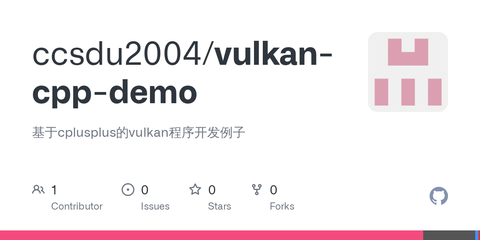

# Vulkan从入门到精通5-Shader封装

Vulkan用的Shader和OpenGL有点不同。后者通常都是实时编译shader并使用，前者这是先从shader生成SPIR-V代码，然后加载进程序。

命令行执行以下命令即可把shader.vert 源码程序翻译为spv格式的[二进制文件](https://zhida.zhihu.com/search?content_id=184949238&content_type=Article&match_order=1&q=二进制文件&zhida_source=entity)

```text
glslc.exe shader.vert -o vert.spv
```

要想程序支持实时编译，使用glslang::TShader总是提示找不到[符号链接](https://zhida.zhihu.com/search?content_id=184949238&content_type=Article&match_order=1&q=符号链接&zhida_source=entity)，就先跳过这个。先看下Vulkan对Shader模块的加载

VulkanTutorial 例子中涉及Shader的代码段如下

```cpp
    VkShaderModule createShaderModule(const std::vector<char>& code) {
        VkShaderModuleCreateInfo createInfo{};
        createInfo.sType = VK_STRUCTURE_TYPE_SHADER_MODULE_CREATE_INFO;
        createInfo.codeSize = code.size();
        createInfo.pCode = reinterpret_cast<const uint32_t*>(code.data());

        VkShaderModule shaderModule;
        if (vkCreateShaderModule(device, &createInfo, nullptr, &shaderModule) != VK_SUCCESS) {
            throw std::runtime_error("failed to create shader module!");
        }

        return shaderModule;
    }
```

传入spv数据，传出VkShaderModule。

在创建管线前相关代码如下

```cpp
        auto vertShaderCode = readFile("shaders/vert.spv");
        auto fragShaderCode = readFile("shaders/frag.spv");

        VkShaderModule vertShaderModule = createShaderModule(vertShaderCode);
        VkShaderModule fragShaderModule = createShaderModule(fragShaderCode);

        VkPipelineShaderStageCreateInfo vertShaderStageInfo{};
        vertShaderStageInfo.sType = VK_STRUCTURE_TYPE_PIPELINE_SHADER_STAGE_CREATE_INFO;
        vertShaderStageInfo.stage = VK_SHADER_STAGE_VERTEX_BIT;
        vertShaderStageInfo.module = vertShaderModule;
        vertShaderStageInfo.pName = "main";

        VkPipelineShaderStageCreateInfo fragShaderStageInfo{};
        fragShaderStageInfo.sType = VK_STRUCTURE_TYPE_PIPELINE_SHADER_STAGE_CREATE_INFO;
        fragShaderStageInfo.stage = VK_SHADER_STAGE_FRAGMENT_BIT;
        fragShaderStageInfo.module = fragShaderModule;
        fragShaderStageInfo.pName = "main";

        VkPipelineShaderStageCreateInfo shaderStages[] = {vertShaderStageInfo, fragShaderStageInfo};
```

之后把VkGraphicsPipelineCreateInfo的stageCount填写shader个数，pStages填写[数据指针](https://zhida.zhihu.com/search?content_id=184949238&content_type=Article&match_order=1&q=数据指针&zhida_source=entity)。据此就可以对Vulkan Shader 做个小封装。笔者封装如下

```cpp
class VK_ShaderSet : public VK_Deleter
{
public:
    virtual bool addShader(const std::string &spvFile, VkShaderStageFlagBits type,
                           const std::string &entryPoint = std::string("main")) = 0;
    virtual bool isValid() = 0;
    virtual VkPipelineShaderStageCreateInfo* getCreateInfoData() = 0;
    virtual int getCreateInfoCount() = 0;
};
```

使用addShader函数从本地spvFile加载数据，shader格式是type，入口函数默认为main

使用isValid判断ShaderSet是否合法，使用二个函数获取VkPipelineShaderStageCreateInfo指针和数量。

实现代码如下

```cpp
VK_ShaderSetImpl::VK_ShaderSetImpl(VkDevice device):
    vkDevice(device)
{
}

VK_ShaderSetImpl::~VK_ShaderSetImpl()
{
}

void VK_ShaderSetImpl::release()
{
    for(auto itr = shaderStageCreateInfos.begin(); itr != shaderStageCreateInfos.end(); itr++)
        vkDestroyShaderModule(vkDevice, itr->module, nullptr);
    delete this;
}

bool VK_ShaderSetImpl::addShader(const std::string &spvFile, VkShaderStageFlagBits type, const std::string &entryPoint)
{
    auto module = createShaderModule(spvFile);
    if(!module)
        return false;

    auto itr = shaderStageCreateInfos.begin();
    while(itr != shaderStageCreateInfos.end()) {
        if(itr->flags == type)
            return false;
        itr ++;
    }

    VkPipelineShaderStageCreateInfo createInfo{};
    createInfo.stage = type;
    createInfo.sType = VK_STRUCTURE_TYPE_PIPELINE_SHADER_STAGE_CREATE_INFO;
    createInfo.pName = entryPoint.data();
    createInfo.module = module;

    shaderStageCreateInfos.push_back(createInfo);
    return true;
}

bool VK_ShaderSetImpl::isValid()
{
    bool hasV = false, hasFs = false;
    auto itr = shaderStageCreateInfos.begin();
    while(itr != shaderStageCreateInfos.end()) {
        if(itr->stage == VK_SHADER_STAGE_VERTEX_BIT)
            hasV = true;
        else if(itr->stage == VK_SHADER_STAGE_FRAGMENT_BIT)
            hasFs = true;
        itr ++;
    }
    return hasV && hasFs;
}

VkPipelineShaderStageCreateInfo* VK_ShaderSetImpl::getCreateInfoData()
{
    return shaderStageCreateInfos.data();
}

int VK_ShaderSetImpl::getCreateInfoCount()
{
    return shaderStageCreateInfos.size();
}

VkShaderModule VK_ShaderSetImpl::createShaderModule(const std::string &spvFile)
{
    VkShaderModule shaderModule = 0;
    auto code = readDataFromFile(spvFile);
    if (code.empty())
        return shaderModule;

    VkShaderModuleCreateInfo createInfo{};
    createInfo.sType = VK_STRUCTURE_TYPE_SHADER_MODULE_CREATE_INFO;
    createInfo.codeSize = code.size();
    createInfo.pCode = reinterpret_cast<const uint32_t *>(code.data());

    if (vkCreateShaderModule(vkDevice, &createInfo, nullptr, &shaderModule) != VK_SUCCESS)
        std::cerr << "failed to create shader module!" << std::endl;

    return shaderModule;
}
```


代码比较清晰，只涉及了2个Vk函数

- vkCreateShaderModule - 创建shaderModule
- vkDestroyShaderModule - 销毁shaderModule

通常来说，创建管线完成后，如不再需要就可以销毁shaderModule了。

另外，由于VkShaderModule是从VkDevice创建的，在销毁VkDevice前需要先销毁VkShaderModule。对于其他从VkDevice创建的资源亦是如此。


代码仓 -

[GitHub - ccsdu2004/vulkan-cpp-demo: 基于cplusplus的vulkan程序开发例子github.com/ccsdu2004/vulkan-cpp-demo](https://link.zhihu.com/?target=https%3A//github.com/ccsdu2004/vulkan-cpp-demo)


