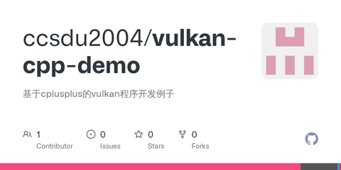

# Vulkan从入门到精通7-vkImage，Image视图和采样器

本文来谈谈vkImage，ImageView和Sampler。

vkImage是[图形数据](https://zhida.zhihu.com/search?content_id=185313152&content_type=Article&match_order=1&q=图形数据&zhida_source=entity)的集合，可用于纹理以及附件，以及图形管线的相关描述符填充。

创建[交换链](https://zhida.zhihu.com/search?content_id=185313152&content_type=Article&match_order=1&q=交换链&zhida_source=entity)成功后，即可用vkGetSwapchainImagesKHR获取交换链支持的图形个数，并初始化ImageList，片段如下

```cpp
    if (vkCreateSwapchainKHR(device, &createInfo, nullptr, &swapChain) != VK_SUCCESS) {
        throw std::runtime_error("failed to create swap chain!");
    }

    vkGetSwapchainImagesKHR(device, swapChain, &imageCount, nullptr);
    swapChainImages.resize(imageCount, VK_NULL_HANDLE);
    vkGetSwapchainImagesKHR(device, swapChain, &imageCount, swapChainImages.data());
```


从文件加载图形的代码片段如下:

```cpp
bool VK_ImageImpl::load(const std::string &filename)
{
    int width, height, texChannels;
    auto pixels = stbi_load(filename.data(), &width, &height, &texChannels, STBI_rgb_alpha);
    VkDeviceSize imageSize = width * height * 4;

    if (!pixels) {
        std::cerr << "failed to load texture image!" << std::endl;
        return false;
    }

    VkBuffer stagingBuffer;
    VkDeviceMemory stagingBufferMemory;
    context->createBuffer(imageSize, VK_BUFFER_USAGE_TRANSFER_SRC_BIT, VK_MEMORY_PROPERTY_HOST_VISIBLE_BIT | VK_MEMORY_PROPERTY_HOST_COHERENT_BIT, stagingBuffer, stagingBufferMemory);

    void* data = nullptr;
    vkMapMemory(device, stagingBufferMemory, 0, imageSize, 0, &data);
    memcpy(data, pixels, static_cast<size_t>(imageSize));
    vkUnmapMemory(device, stagingBufferMemory);

    stbi_image_free(pixels);

    createImage(width, height, VK_FORMAT_R8G8B8A8_SRGB, VK_IMAGE_TILING_OPTIMAL, VK_IMAGE_USAGE_TRANSFER_DST_BIT | VK_IMAGE_USAGE_SAMPLED_BIT, VK_MEMORY_PROPERTY_DEVICE_LOCAL_BIT, textureImage, textureImageMemory);

    context->transitionImageLayout(textureImage, VK_FORMAT_R8G8B8A8_SRGB, VK_IMAGE_LAYOUT_UNDEFINED, VK_IMAGE_LAYOUT_TRANSFER_DST_OPTIMAL);
    context->copyBufferToImage(stagingBuffer, textureImage, static_cast<uint32_t>(width), static_cast<uint32_t>(height));
    context->transitionImageLayout(textureImage, VK_FORMAT_R8G8B8A8_SRGB, VK_IMAGE_LAYOUT_TRANSFER_DST_OPTIMAL, VK_IMAGE_LAYOUT_SHADER_READ_ONLY_OPTIMAL);

    vkDestroyBuffer(device, stagingBuffer, nullptr);
    vkFreeMemory(device, stagingBufferMemory, nullptr);

    return true;
}
```

再入图形数据到内存成功后，在GPU端创建一个同大小的空间，映射数据后关闭映射。

然后创建vkImage对象，并绑定内存，之后是设置图形格式并复制数据。

```cpp
bool VK_ImageImpl::createImage(uint32_t width, uint32_t height, VkFormat format, VkImageTiling tiling, VkImageUsageFlags usage, VkMemoryPropertyFlags properties, VkImage &image, VkDeviceMemory &imageMemory)
{
    createInfo.sType = VK_STRUCTURE_TYPE_IMAGE_CREATE_INFO;
    createInfo.imageType = VK_IMAGE_TYPE_2D;
    createInfo.extent.width = width;
    createInfo.extent.height = height;
    createInfo.extent.depth = 1;
    createInfo.mipLevels = 1;
    createInfo.arrayLayers = 1;
    createInfo.format = format;
    createInfo.tiling = tiling;
    createInfo.initialLayout = VK_IMAGE_LAYOUT_UNDEFINED;
    createInfo.usage = usage;
    createInfo.samples = VK_SAMPLE_COUNT_1_BIT;
    createInfo.sharingMode = VK_SHARING_MODE_EXCLUSIVE;
    createInfo.pNext = nullptr;

    if (vkCreateImage(device, &createInfo, nullptr, &image) != VK_SUCCESS) {
        std::cerr << "failed to create image!" << std::endl;
        return true;
    }

    VkMemoryRequirements memRequirements;
    vkGetImageMemoryRequirements(device, image, &memRequirements);

    VkMemoryAllocateInfo allocInfo{};
    allocInfo.sType = VK_STRUCTURE_TYPE_MEMORY_ALLOCATE_INFO;
    allocInfo.allocationSize = memRequirements.size;
    allocInfo.memoryTypeIndex = context->findMemoryType(memRequirements.memoryTypeBits, properties);

    if (vkAllocateMemory(device, &allocInfo, nullptr, &imageMemory) != VK_SUCCESS) {
        std::cerr << "failed to allocate image memory!" << std::endl;
        return false;
    }

    vkBindImageMemory(device, image, imageMemory, 0);
    return true;
}
```

------

再看ImageView

管线着色起不能直接访问图形对象。作为替代，image view相当于一个代理，代表了image所占据的连续内存区域，并且包含一些额外的成员用来对image进行读写。

image view必须创建于一个类型一致的image上面。类型有

```cpp
typedef enum VkImageViewType {
VK_IMAGE_VIEW_TYPE_1D = 0,
VK_IMAGE_VIEW_TYPE_2D = 1,
VK_IMAGE_VIEW_TYPE_3D = 2,
VK_IMAGE_VIEW_TYPE_CUBE = 3,
VK_IMAGE_VIEW_TYPE_1D_ARRAY = 4,
VK_IMAGE_VIEW_TYPE_2D_ARRAY = 5,
VK_IMAGE_VIEW_TYPE_CUBE_ARRAY = 6,
} VkImageViewType;
```

ImageView是由函数vkCreateImageView来创建，由vkDestroyImageView来销毁。对应的CreateInfo 是

```cpp
typedef struct VkImageViewCreateInfo {
    VkStructureType            sType;
    const void*                pNext;
    VkImageViewCreateFlags     flags;
    VkImage                    image;
    VkImageViewType            viewType;
    VkFormat                   format;
    VkComponentMapping         components;
    VkImageSubresourceRange    subresourceRange;
} VkImageViewCreateInfo;
```

Image[采样器](https://zhida.zhihu.com/search?content_id=185313152&content_type=Article&match_order=1&q=采样器&zhida_source=entity)代表了对Image采样，或变换所需要的状态信息。他的CreateInfo是

```cpp
这块typedef struct VkSamplerCreateInfo {
    VkStructureType         sType;
    const void*             pNext;
    VkSamplerCreateFlags    flags;
    VkFilter                magFilter;
    VkFilter                minFilter;
    VkSamplerMipmapMode     mipmapMode;
    VkSamplerAddressMode    addressModeU;
    VkSamplerAddressMode    addressModeV;
    VkSamplerAddressMode    addressModeW;
    float                   mipLodBias;
    VkBool32                anisotropyEnable;
    float                   maxAnisotropy;
    VkBool32                compareEnable;
    VkCompareOp             compareOp;
    float                   minLod;
    float                   maxLod;
    VkBorderColor           borderColor;
    VkBool32                unnormalizedCoordinates;
} VkSamplerCreateInfo;
```

这块和[mesa](https://zhida.zhihu.com/search?content_id=185313152&content_type=Article&match_order=1&q=mesa&zhida_source=entity)底层描述已经很接近了。只要看过opengl，就能理解其中magFilter，minFilter，modeU、ModeV、ModeW含义。

ImageView和Sampler构成了图形的存储形式和展示描述，作为一个整体，即可代表一个纹理。

在vulkan中，除了纹理，创建交换链Image也是用的ImageView对象。创建过程如下

```cpp
void VK_ContextImpl::createSwapChainImageViews()
{
    swapChainImageViews.resize(swapChainImages.size());

    for (size_t i = 0; i < swapChainImages.size(); i++) {
        VkImageViewCreateInfo viewCreateInfo = VK_Texture::createImageViewCreateInfo(swapChainImages[i], swapChainImageFormat);
        VkSamplerCreateInfo samplerCreateInfo = VK_Texture::createSamplerCreateInfo();
        samplerCreateInfo.anisotropyEnable = VK_FALSE;

        VK_TextureImpl* texture = new VK_TextureImpl(device, this);
        texture->setRemoveFromContainerWhenRelease(false);
        if(!texture->create(viewCreateInfo, samplerCreateInfo)) {
            std::cerr << "failed to create image views!" << std::endl;
        }

        swapChainImageViews[i] = texture;
    }
}
```

VK_TextureImpl则是对VkImageView、VkSampler的封装

```cpp
#include <iostream>
#include "VK_TextureImpl.h"

VK_TextureImpl::VK_TextureImpl(VkDevice vkDevice, VK_ContextImpl* vkContext):
    device(vkDevice),
    context(vkContext)
{
}

VK_TextureImpl::~VK_TextureImpl()
{
}

void VK_TextureImpl::release()
{
    if(isRemoveFromContainerWhenRelease())
        context->onReleaseTexture(this);

    if(textureSampler)
        vkDestroySampler(device, textureSampler, nullptr);

    if(textureImageView)
        vkDestroyImageView(device, textureImageView, nullptr);

    delete this;
}

VkImageView VK_TextureImpl::getTextureImageView() const
{
    return textureImageView;
}

bool VK_TextureImpl::create(const VkImageViewCreateInfo& viewCreateInfo, const VkSamplerCreateInfo& samplerInfo)
{
    if (vkCreateSampler(device, &samplerInfo, nullptr, &textureSampler) != VK_SUCCESS) {
        std::cerr << "failed to create texture sampler!" << std::endl;
        return false;
    }

    if (vkCreateImageView(device, &viewCreateInfo, nullptr, &textureImageView) != VK_SUCCESS) {
        std::cerr << "failed to create texture image view!" << std::endl;
        return false;
    }
    return true;
}
```

这块还是比较简单的。

------

本文涉及vulkan api

- vkDestroyImage
- vkFreeMemory
- vkCreateImage
- vkBindImageMemory
- vkCreateSampler
- vkCreateImageView
- vkDestroySampler
- vkDestroyImageView
- vkGetSwapchainImagesKHR


代码仓库 -

[GitHub - ccsdu2004/vulkan-cpp-demo: 基于cplusplus的vulkan程序开发例子github.com/ccsdu2004/vulkan-cpp-demo](https://link.zhihu.com/?target=https%3A//github.com/ccsdu2004/vulkan-cpp-demo)