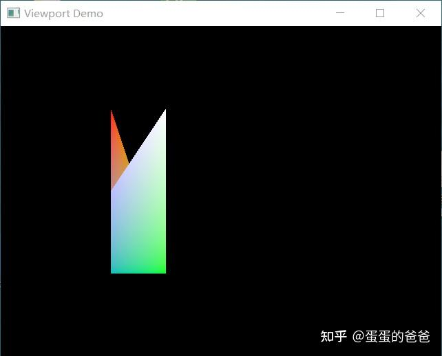

# Vulkan从入门到精通8-视口和裁剪

创建vulkan管线时需要指定视口和裁剪参数，createinfo结构如下

```cpp
typedef struct VkPipelineViewportStateCreateInfo {
    VkStructureType                       sType;
    const void*                           pNext;
    VkPipelineViewportStateCreateFlags    flags;
    uint32_t                              viewportCount;
    const VkViewport*                     pViewports;
    uint32_t                              scissorCount;
    const VkRect2D*                       pScissors;
} VkPipelineViewportStateCreateInfo;
```

pVkViewports和pScissors分别指向具体的视口和裁剪结构体，可以一次使用多个视口和裁剪体。

之前代码我们是通过下述代码来设置的

```cpp
        VkViewport viewport{};
        viewport.x = 0.0f;
        viewport.y = 0.0f;
        viewport.width = (float) swapChainExtent.width;
        viewport.height = (float) swapChainExtent.height;
        viewport.minDepth = 0.0f;
        viewport.maxDepth = 1.0f;

        VkRect2D scissor{};
        scissor.offset = {0, 0};
        scissor.extent = swapChainExtent;

        VkPipelineViewportStateCreateInfo viewportState{};
        viewportState.sType = VK_STRUCTURE_TYPE_PIPELINE_VIEWPORT_STATE_CREATE_INFO;
        viewportState.viewportCount = 1;
        viewportState.pViewports = &viewport;
        viewportState.scissorCount = 1;
        viewportState.pScissors = &scissor;
```

VkViewport不仅提供了视口范围还提供了视深 minDepth和maxDepth，和[mesa](https://zhida.zhihu.com/search?content_id=185507149&content_type=Article&match_order=1&q=mesa&zhida_source=entity)里的视口异曲同工，只是后者做了NDC处理

```cpp
struct pipe_viewport_state
{
   float scale[3];
   float translate[3];
   enum pipe_viewport_swizzle swizzle_x:8;
   enum pipe_viewport_swizzle swizzle_y:8;
   enum pipe_viewport_swizzle swizzle_z:8;
   enum pipe_viewport_swizzle swizzle_w:8;
};
```

根据之前的简单视口和裁剪设置，很容易把他提炼到一个单独的Viewport对象，考虑到多视口，起名叫VK_Viewports，考虑到视口和裁剪总是一一对应，就把二者合二为一。设计的Viewports接口如下

```cpp
class VK_Viewports
{
public:
    static VkViewport createViewport(uint32_t width, uint32_t height, float near = 0.0f, float far = 1.0f);
    static VkRect2D createScissor(uint32_t width, uint32_t height);

    VK_Viewports() = default;
    VK_Viewports(uint32_t width, uint32_t height);
    VK_Viewports(const VK_Viewports& viewports);
    VK_Viewports& operator =(const VK_Viewports& viewports);
    VK_Viewports(const VK_Viewports&& viewports);
    ~VK_Viewports() = default;
public:
    bool operator == (const VK_Viewports& others);
    bool operator != (const VK_Viewports& others);
    void addViewport(const VkViewport&);
    void setScissor(size_t index, const VkRect2D& scissor);

    void clear();
public:
    int getViewportCount()const;
    const VkViewport* getViewportData()const;
    const VkRect2D* getScissorData()const;
private:
    typedef std::vector<VkViewport> VK_Viewport;
    typedef std::vector<VkRect2D> VK_Scissor;
    std::vector<VkViewport> viewports;
    std::vector<VkRect2D> scissors;
};
```

然后在Context接口增加setViewports和getViewports接口

同时在创建[逻辑设备](https://zhida.zhihu.com/search?content_id=185507149&content_type=Article&match_order=1&q=逻辑设备&zhida_source=entity)中构建硬件特性时需要开启多视口支持

```cpp
    VkPhysicalDeviceFeatures deviceFeatures{};
    deviceFeatures.multiViewport = VK_TRUE;
```

在程序中窗口大小回调时重设视口

```cpp
void onFrameSizeChanged(int width, int height)
{
    auto vp = VK_Viewports::createViewport(width, height);
    VK_Viewports vps;
    vps.addViewport(vp);
    context->setViewports(vps);
}
```

在测试例子中通过点击鼠标来设置一左一右二个视口同时设置二分之一的裁剪。

```cpp
void onMouseButtonCallback(int button, int action, int mods)
{
    auto size = context->getSwapChainExtent();

    auto vp1 = VK_Viewports::createViewport(size.width >> 1, size.height);
    auto vp2 = VK_Viewports::createViewport(size.width >> 1, size.height);

    newViewports.clear();

    newViewports.addViewport(vp1);
    vp2.x = vp1.width;
    newViewports.addViewport(vp2);

    auto scissor2 = VK_Viewports::createScissor(size.width >> 1, size.height);
    scissor2.offset.x = size.width * 0.25;
    newViewports.setScissor(0, scissor2);

    if(action) {
        context->setViewports(viewports);
    } else {
        context->setViewports(newViewports);
    }
}
```

程序执行截图如下




程序仓库 -

[https://github.com/ccsdu2004/vulkan-cpp-demogithub.com/ccsdu2004/vulkan-cpp-demo](https://github.com/ccsdu2004/vulkan-cpp-demo)