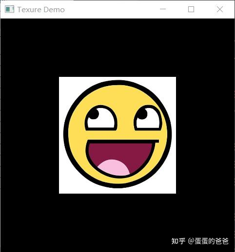
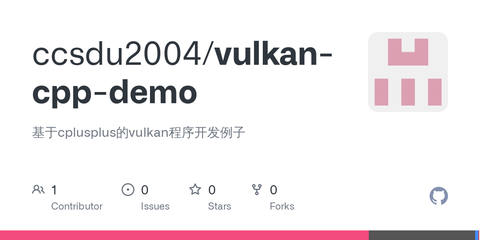

# Vulkan从入门到精通9-纹理显示

终于谈到了纹理的显示

在 [蛋蛋的爸爸：Vulkan从入门到精通7-vkImage，Image视图和采样器](https://zhuanlan.zhihu.com/p/437325722) 谈了image view和sampeler。

从文件载入[图形数据](https://zhida.zhihu.com/search?content_id=185572984&content_type=Article&match_order=1&q=图形数据&zhida_source=entity)，创建完 VkImage和VkImage。然后设置VkImageViewCreateInfo和VkSamplerCreateInfo

```cpp
VkImageViewCreateInfo VK_Texture::createImageViewCreateInfo(VkImage image, VkFormat format)
{
    VkImageViewCreateInfo viewInfo{};
    viewInfo.pNext = nullptr;
    viewInfo.sType = VK_STRUCTURE_TYPE_IMAGE_VIEW_CREATE_INFO;
    viewInfo.image = image;
    viewInfo.viewType = VK_IMAGE_VIEW_TYPE_2D;
    viewInfo.format = format;
    viewInfo.subresourceRange.aspectMask = VK_IMAGE_ASPECT_COLOR_BIT;
    viewInfo.subresourceRange.baseMipLevel = 0;
    viewInfo.subresourceRange.levelCount = 1;
    viewInfo.subresourceRange.baseArrayLayer = 0;
    viewInfo.subresourceRange.layerCount = 1;
    return viewInfo;
}

VkSamplerCreateInfo VK_Texture::createSamplerCreateInfo()
{
    VkSamplerCreateInfo samplerInfo{};
    samplerInfo.sType = VK_STRUCTURE_TYPE_SAMPLER_CREATE_INFO;
    samplerInfo.magFilter = VK_FILTER_LINEAR;
    samplerInfo.minFilter = VK_FILTER_LINEAR;
    samplerInfo.addressModeU = VK_SAMPLER_ADDRESS_MODE_REPEAT;
    samplerInfo.addressModeV = VK_SAMPLER_ADDRESS_MODE_REPEAT;
    samplerInfo.addressModeW = VK_SAMPLER_ADDRESS_MODE_REPEAT;
    samplerInfo.anisotropyEnable = VK_TRUE;
    samplerInfo.maxAnisotropy = 1.0f;
    //deviceProperties.limits.maxSamplerAnisotropy;
    samplerInfo.borderColor = VK_BORDER_COLOR_INT_OPAQUE_BLACK;
    samplerInfo.unnormalizedCoordinates = VK_FALSE;
    samplerInfo.compareEnable = VK_FALSE;
    samplerInfo.compareOp = VK_COMPARE_OP_ALWAYS;
    samplerInfo.mipmapMode = VK_SAMPLER_MIPMAP_MODE_LINEAR;
    return samplerInfo;
}
```

接下来创建vkImageView和vkSampler

```cpp
    if (vkCreateSampler(device, &samplerInfo, nullptr, &textureSampler) != VK_SUCCESS) {
        std::cerr << "failed to create texture sampler!" << std::endl;
        return false;
    }

    if (vkCreateImageView(device, &viewCreateInfo, nullptr, &textureImageView) != VK_SUCCESS) {
        std::cerr << "failed to create texture image view!" << std::endl;
        return false;
    }
```

最后一步要做的是在createDescriptorSets阶段创建对应的VkWriteDescriptorSet

```cpp
VkWriteDescriptorSet VK_TextureImpl::createWriteDescriptorSet(uint32_t index, VkDescriptorSet descriptorSet) const
{
    VkWriteDescriptorSet descriptorWrite{};
    descriptorWrite.sType = VK_STRUCTURE_TYPE_WRITE_DESCRIPTOR_SET;
    descriptorWrite.dstSet = descriptorSet;
    descriptorWrite.dstBinding = 1;
    descriptorWrite.dstArrayElement = 0;
    descriptorWrite.descriptorType = VK_DESCRIPTOR_TYPE_COMBINED_IMAGE_SAMPLER;
    descriptorWrite.descriptorCount = 1;
    descriptorWrite.pImageInfo = &imageInfo;
    return descriptorWrite;
}
```

根据uniform和纹理个数创建同样个数的VkWriteDescriptorSet，然后调用vkUpdateDescriptorSets更新描述符集

```cpp
    if (vkAllocateDescriptorSets(device, &allocInfo, descriptorSets.data()) != VK_SUCCESS) {
        std::cerr << "failed to allocate descriptor sets" << std::endl;
        return;
    }

    for (size_t i = 0; i < swapChainImages.size(); i++) {
        std::vector<VkWriteDescriptorSet> descriptorWrites;
        for(auto buffer : vkUniformBuffers)
            descriptorWrites.push_back(buffer->createWriteDescriptorSet(i, descriptorSets[i]));

        for(auto texture : vkTextureList)
            descriptorWrites.push_back(texture->createWriteDescriptorSet(i, descriptorSets[i]));

        vkUpdateDescriptorSets(device, descriptorWrites.size(), &descriptorWrites[0], 0, nullptr);
    }
```

最终显示截图见下




本文涉及vulkan函数 vkUpdateDescriptorSets - Update the contents of a descriptor set object

代码仓库 -

[GitHub - ccsdu2004/vulkan-cpp-demo: 基于cplusplus的vulkan程序开发例子github.com/ccsdu2004/vulkan-cpp-demo](https://github.com/ccsdu2004/vulkan-cpp-demo)

