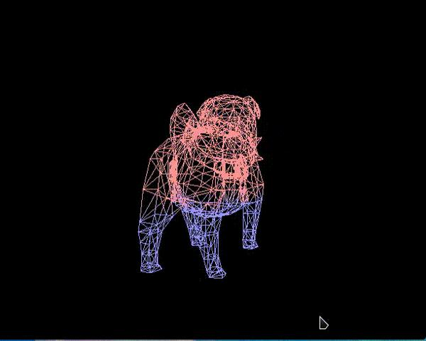

# Vulkan从入门到精通16-网格模型

上篇我们用vulkan绘制了一个立方体，本文来用vulkan绘制3维模型。这里使用tiny*obj loader来加载模型*

*具体的加载类设计如下*

```cpp
class VK_OBJLoader : public VK_VertexBuffer
{
public:
    VK_OBJLoader() = delete;
    VK_OBJLoader(VK_Context *context, VkDevice vkDevice):
        VK_VertexBuffer(context,vkDevice)
    {
    }

    bool load(const std::string &file, bool zero = true);
    glm::vec3 getMinPosition()const;
    glm::vec3 getMaxPosition()const;

    std::vector<std::vector<float>> getData()const
    {
        return data;
    }
private:
    glm::vec3 minPosition;
    glm::vec3 maxPosition;
    std::vector<std::vector<float>> data;
};
```

关键实现

```cpp
bool VK_OBJLoader::load(const std::string &file, bool zero)
{
    glm::vec3 minPosition(std::numeric_limits<float>::max());
    glm::vec3 maxPosition(std::numeric_limits<float>::min());

    data.clear();

    tinyobj::attrib_t attrib;
    std::vector<tinyobj::shape_t> shapes;
    std::vector<tinyobj::material_t> materials;

    std::string warn;
    std::string err;

    bool ok = tinyobj::LoadObj(&attrib, &shapes, &materials, &warn, &err, file.data(), nullptr, true, true);
    if (!ok)
        return false;

    for (size_t i = 0; i < shapes.size(); i++) {
        assert(shapes[i].mesh.num_face_vertices.size() == shapes[i].mesh.material_ids.size());
        assert(shapes[i].mesh.num_face_vertices.size() == shapes[i].mesh.smoothing_group_ids.size());

        size_t index_offset = 0;
        std::vector<float> items;

        for (size_t f = 0; f < shapes[i].mesh.num_face_vertices.size(); f++) {
            size_t fnum = shapes[i].mesh.num_face_vertices[f];

            tinyobj::index_t idx;
            int vertex_index[3];
            int normal_index[3];
            int texcoord_index[3];

            for (size_t v = 0; v < fnum; v++) {
                idx = shapes[i].mesh.indices[index_offset + v];
                vertex_index[v] = idx.vertex_index;
                texcoord_index[v] = idx.texcoord_index;
                normal_index[v] = idx.normal_index;
            }

            for (size_t v = 0; v < fnum; v++) {
                float x = attrib.vertices[(vertex_index[v]) * 3 + 0];
                float y = attrib.vertices[(vertex_index[v]) * 3 + 1];
                float z = attrib.vertices[(vertex_index[v]) * 3 + 2];

                items.push_back(x);
                items.push_back(y);
                items.push_back(z);

                glm::vec3 position(x, y, z);

                minPosition = getMinPos(minPosition, position);
                maxPosition = getMaxPos(maxPosition, position);

                if (attrib.texcoords.empty()) {
                    items.push_back(0.0f);
                    items.push_back(0.0f);
                } else {
                    items.push_back(attrib.texcoords[texcoord_index[v] * 2 + 0]);
                    items.push_back(attrib.texcoords[texcoord_index[v] * 2 + 1]);
                }

                if (attrib.normals.empty()) {
                    items.push_back(1.0f);
                    items.push_back(0.2f);
                    items.push_back(0.3f);
                } else {
                    items.push_back(attrib.normals[normal_index[v] * 3 + 0]);
                    items.push_back(attrib.normals[normal_index[v] * 3 + 1]);
                    items.push_back(attrib.normals[normal_index[v] * 3 + 2]);
                }
            }

            index_offset += fnum;
        }

        data.push_back(items);
    }

    if (zero) {
        auto center = (minPosition + maxPosition) * 0.5f;

        minPosition -= center;
        maxPosition -= center;

        float maxValue = std::max(maxPosition.x, std::max(maxPosition.y, maxPosition.z));

        std::vector<std::vector<float>> tmp;

        for (auto mesh : data) {
            int count = mesh.size() >> 3;

            std::vector<float> unit;

            for (int i = 0; i < count; i++) {
                glm::vec3 position(mesh[i * 8 + 0], mesh[i * 8 + 1], mesh[i * 8 + 2]);
                position -= center;

                unit.push_back(position.x / maxValue);
                unit.push_back(position.y / maxValue);
                unit.push_back(position.z / maxValue);

                for (int j = 0; j < 5; j++)
                    unit.push_back(mesh[i * 8 + 3]);
            }

            tmp.push_back(unit);
        }

        minPosition /= maxValue;
        maxPosition /= maxValue;
        data = tmp;
    }

    return true;
}
```

有几点需要注意

1.这里没有加载材质相关信息

2.加载数据时需要对[纹理坐标](https://zhida.zhihu.com/search?content_id=187413776&content_type=Article&match_order=1&q=纹理坐标&zhida_source=entity)和法线数据做检查

3.加载最后可能需要对模型放置在原点位置并根据aabb做单位化处理

4.模型数据格式是 vec3 position + vec2 texCoord + vec3 normal


然后在Context中暴露对外接口

```cpp
VK_Buffer *VK_ContextImpl::createVertexBuffer(const std::string &filename, bool zero)
{
    VK_OBJLoader* loader = new VK_OBJLoader(this, device);
    if(!loader->load(filename, zero)) {
        loader->release();
        return nullptr;
    }

    auto data = loader->getData();
    if(!data.empty()) {
        loader->create(data[0], 8, std::vector<uint32_t>());
    }
    return loader;
}
```

最后是[主程序](https://zhida.zhihu.com/search?content_id=187413776&content_type=Article&match_order=1&q=主程序&zhida_source=entity)

```text
#include <iostream>
#include <cstring>
#include <chrono>
#include <glm/mat4x4.hpp>
#include <glm/gtx/transform.hpp>
#include "VK_UniformBuffer.h"
#include "VK_Context.h"
#include "VK_Image.h"
#include "VK_Texture.h"

using namespace std;

VK_Context *context = nullptr;

uint32_t updateUniformBufferData(char *&data, uint32_t size)
{
    static auto startTime = std::chrono::high_resolution_clock::now();
    auto currentTime = std::chrono::high_resolution_clock::now();
    float time = std::chrono::duration<float, std::chrono::seconds::period>(currentTime - startTime).count();
    glm::mat4 model = glm::rotate(glm::mat4(1.0f), glm::radians(90.0f), glm::vec3(1.0f, 0.0f, 0.0f));
    model *= glm::rotate(glm::mat4(1.0f), time * glm::radians(30.0f), glm::vec3(0.0f, 1.0f, 0.0f));
    auto view = glm::lookAt(glm::vec3(0.0f, 4.0f, 0.0f), glm::vec3(0.0f, 0.0f, 0.0f), glm::vec3(0.0f, 0.0f, 1.0f));
    auto proj = glm::perspective(glm::radians(45.0f),
                                 context->getSwapChainExtent().width / (float)context->getSwapChainExtent().height, 0.1f, 10.0f);
    proj[1][1] *= -1;

    model = proj * view * model;

    memcpy(data, &model[0][0], size);

    time = sin(time);

    memcpy(data + sizeof(float) * 16, (void *)&time, sizeof(float));

    return 17 * sizeof(float);
}

void onFrameSizeChanged(int width, int height)
{
    auto vp = VK_Viewports::createViewport(width, height);
    VK_Viewports vps;
    vps.addViewport(vp);
    context->setViewports(vps);
}

int main()
{
    VK_ContextConfig config;
    config.debug = false;
    config.name = "Model Mesh";

    context = createVkContext(config);
    context->createWindow(480, 480, true);
    context->setOnFrameSizeChanged(onFrameSizeChanged);

    VK_Context::VK_Config vkConfig;
    context->initVulkanDevice(vkConfig);

    auto shaderSet = context->createShaderSet();
    shaderSet->addShader("../shader/model-mesh/vert.spv", VK_SHADER_STAGE_VERTEX_BIT);
    shaderSet->addShader("../shader/model-mesh/frag.spv", VK_SHADER_STAGE_FRAGMENT_BIT);

    shaderSet->appendAttributeDescription(0, sizeof (float) * 3);
    shaderSet->appendAttributeDescription(1, sizeof (float) * 2);
    shaderSet->appendAttributeDescription(2, sizeof (float) * 3);

    VkDescriptorSetLayoutBinding uniformBinding = VK_ShaderSet::createDescriptorSetLayoutBinding(0,
            VK_DESCRIPTOR_TYPE_UNIFORM_BUFFER, VK_SHADER_STAGE_VERTEX_BIT);
    shaderSet->addDescriptorSetLayoutBinding(uniformBinding);

    if (!shaderSet->isValid()) {
        std::cerr << "invalid shaderSet" << std::endl;
        shaderSet->release();
        context->release();
        return -1;
    }

    auto ubo = context->createUniformBuffer(0, sizeof(float) * 17);
    ubo->setWriteDataCallback(updateUniformBufferData);
    context->addUniformBuffer(ubo);

    auto buffer = context->createVertexBuffer("../model/pug.obj", true);
    context->addBuffer(buffer);

    context->initVulkanContext(shaderSet);

    auto rasterCreateInfo = context->getPipelineRasterizationStateCreateInfo();
    rasterCreateInfo.polygonMode = VK_POLYGON_MODE_LINE;

    context->setPipelineRasterizationStateCreateInfo(rasterCreateInfo);

    context->initPipeline();
    context->createCommandBuffers();

    context->run();
    context->release();

    return 0;
}
```

其中[光栅化](https://zhida.zhihu.com/search?content_id=187413776&content_type=Article&match_order=1&q=光栅化&zhida_source=entity)参数多边形模式设置的是线框模式

对应的shader是

```glsl
#version 450
layout(location = 0) in vec3 inPosition;
layout(location = 1) in vec2 coord;
layout(location = 2) in vec3 inColor;
layout(location = 0) out vec4 fragColor;
layout(binding = 0) uniform UniformBufferObject {
    mat4 model;
    float value;
} mvp;

void main() {
    gl_Position = mvp.model*vec4(inPosition, 1.0);

    if(inPosition.y > mvp.value)
    {
        fragColor = vec4(1.0,0.3,0.3,1.0);
    }
    else
    {
        fragColor = vec4(0.3,0.3,1.0,1.0);
    }
}
```

根据时间设置当前片段颜色。最终展示效果如下




代码仓库 -

[https://github.com/ccsdu2004/vulkan-cpp-demogithub.com/ccsdu2004/vulkan-cpp-demo](https://github.com/ccsdu2004/vulkan-cpp-demo)

