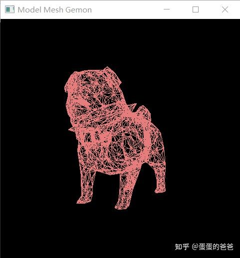

# Vulkan从入门到精通17-几何着色器

上篇显示了一个小狗的网格模型，这里使用几何着色器模拟出细分着色器的效果。主程序如下

```cpp
#include <iostream>
#include <cstring>
#include <chrono>
#include <glm/mat4x4.hpp>
#include <glm/gtx/transform.hpp>
#include "VK_UniformBuffer.h"
#include "VK_Context.h"
#include "VK_Image.h"
#include "VK_Texture.h"

using namespace std;

VK_Context *context = nullptr;

uint32_t updateUniformBufferData(char *&data, uint32_t size)
{
    static auto startTime = std::chrono::high_resolution_clock::now();
    auto currentTime = std::chrono::high_resolution_clock::now();
    float time = std::chrono::duration<float, std::chrono::seconds::period>(currentTime - startTime).count();
    glm::mat4 model = glm::rotate(glm::mat4(1.0f), glm::radians(90.0f), glm::vec3(1.0f, 0.0f, 0.0f));
    model *= glm::rotate(glm::mat4(1.0f), time * glm::radians(30.0f), glm::vec3(0.0f, 1.0f, 0.0f));
    auto view = glm::lookAt(glm::vec3(0.0f, 4.0f, 0.0f), glm::vec3(0.0f, 0.0f, 0.0f), glm::vec3(0.0f, 0.0f, 1.0f));
    auto proj = glm::perspective(glm::radians(45.0f),
                                 context->getSwapChainExtent().width / (float)context->getSwapChainExtent().height, 0.1f, 10.0f);
    proj[1][1] *= -1;

    model = proj * view * model;
    memcpy(data, &model[0][0], size);
    return 16 * sizeof(float);
}

void onFrameSizeChanged(int width, int height)
{
    auto vp = VK_Viewports::createViewport(width, height);
    VK_Viewports vps;
    vps.addViewport(vp);
    context->setViewports(vps);
}

int main()
{
    VK_ContextConfig config;
    config.debug = false;
    config.name = "Model Mesh Gemon";

    context = createVkContext(config);
    context->createWindow(480, 480, true);
    context->setOnFrameSizeChanged(onFrameSizeChanged);

    VkPhysicalDeviceFeatures deviceFeatures{};
    deviceFeatures.geometryShader = VK_TRUE;
    context->setLogicalDeviceFeatures(deviceFeatures);

    VK_Context::VK_Config vkConfig;
    context->initVulkanDevice(vkConfig);

    auto shaderSet = context->createShaderSet();
    shaderSet->addShader("../shader/geom-mesh-geom/shader.vert.spv", VK_SHADER_STAGE_VERTEX_BIT);
    shaderSet->addShader("../shader/geom-mesh-geom/shader.frag.spv", VK_SHADER_STAGE_FRAGMENT_BIT);
    shaderSet->addShader("../shader/geom-mesh-geom/shader.geom.spv", VK_SHADER_STAGE_GEOMETRY_BIT);

    shaderSet->appendAttributeDescription(0, sizeof (float) * 3);
    shaderSet->appendAttributeDescription(1, sizeof (float) * 2);
    shaderSet->appendAttributeDescription(2, sizeof (float) * 3);

    VkDescriptorSetLayoutBinding uniformBinding = VK_ShaderSet::createDescriptorSetLayoutBinding(0,
            VK_DESCRIPTOR_TYPE_UNIFORM_BUFFER, VK_SHADER_STAGE_VERTEX_BIT);
    shaderSet->addDescriptorSetLayoutBinding(uniformBinding);

    if (!shaderSet->isValid()) {
        std::cerr << "invalid shaderSet" << std::endl;
        shaderSet->release();
        context->release();
        return -1;
    }

    auto ubo = context->createUniformBuffer(0, sizeof(float) * 16);
    ubo->setWriteDataCallback(updateUniformBufferData);
    context->addUniformBuffer(ubo);

    auto buffer = context->createVertexBuffer("../model/pug.obj", true);
    context->addBuffer(buffer);

    context->initVulkanContext(shaderSet);

    auto rasterCreateInfo = context->getPipelineRasterizationStateCreateInfo();
    rasterCreateInfo.polygonMode = VK_POLYGON_MODE_FILL;

    context->setPipelineRasterizationStateCreateInfo(rasterCreateInfo);

    context->initPipeline();
    context->createCommandBuffers();

    context->run();
    context->release();

    return 0;
}
```

在初始化vulkan设备前，开启几何着色器

```cpp
    VkPhysicalDeviceFeatures deviceFeatures{};
    deviceFeatures.geometryShader = VK_TRUE;
    context->setLogicalDeviceFeatures(deviceFeatures);
```

然后在shaderSet中加载几何着色器

```glsl
    shaderSet->addShader("../shader/geom-mesh-geom/shader.geom.spv", VK_SHADER_STAGE_GEOMETRY_BIT);
```

[几何着色器](https://zhida.zhihu.com/search?content_id=187438633&content_type=Article&match_order=4&q=几何着色器&zhida_source=entity)代码如下

```glsl
#version 450
layout(triangles) in; 
layout(line_strip,max_vertices = 9) out; 
 
void main() 
{ 
    vec4 p1 = gl_in[0].gl_Position;
	vec4 p2 = gl_in[1].gl_Position;
	vec4 p3 = gl_in[2].gl_Position;
	
	vec4 center = (p1+p2+p3)*0.33333;
	
	//1
	gl_Position = p1;
	EmitVertex();
	
	gl_Position = p2;
	EmitVertex();
	
	gl_Position = center;
	EmitVertex();	

    //2
	gl_Position = p2;
	EmitVertex();
	
	gl_Position = p3;
	EmitVertex();

	gl_Position = center;
	EmitVertex();	
	
	//3
	gl_Position = center;
	EmitVertex();
	
	gl_Position = p3;
	EmitVertex();

	gl_Position = p1;
	EmitVertex();
	
	EndPrimitive();
}
```

根据三个顶点，[计算中心](https://zhida.zhihu.com/search?content_id=187438633&content_type=Article&match_order=1&q=计算中心&zhida_source=entity)点，然后结合三个顶点绘制3个三角形

最终效果如下



