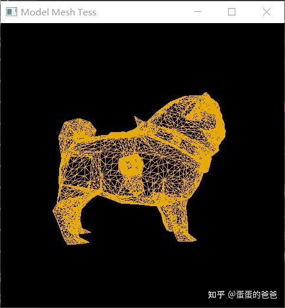

# Vulkan从入门到精通18-细分着色器

上篇聊了几何着色器，本篇接着说下细分着色器

要在vulkan中使用[细分着色器](https://zhida.zhihu.com/search?content_id=187459719&content_type=Article&match_order=2&q=细分着色器&zhida_source=entity)，在初始化逻辑设备时需要开启细分着色器并把fillModeNonSolid设置为ture，如下

```cpp
    VkPhysicalDeviceFeatures deviceFeatures{};
    deviceFeatures.tessellationShader = VK_TRUE;
    deviceFeatures.fillModeNonSolid = VK_TRUE;
    context->setLogicalDeviceFeatures(deviceFeatures);
```

然后是加载[shader文件](https://zhida.zhihu.com/search?content_id=187459719&content_type=Article&match_order=1&q=shader文件&zhida_source=entity)

```cpp
    auto shaderSet = context->createShaderSet();
    shaderSet->addShader("../shader/geom-mesh-tess/vert.spv", VK_SHADER_STAGE_VERTEX_BIT);
    shaderSet->addShader("../shader/geom-mesh-tess/frag.spv", VK_SHADER_STAGE_FRAGMENT_BIT);
    shaderSet->addShader("../shader/geom-mesh-tess/tesc.spv", VK_SHADER_STAGE_TESSELLATION_CONTROL_BIT);
    shaderSet->addShader("../shader/geom-mesh-tess/tese.spv", VK_SHADER_STAGE_TESSELLATION_EVALUATION_BIT);
```

初始化管线前设置细分patchControlPoints，此参数用于控制细分程度

```cpp
    auto tessellationCreateInfo = context->createPipelineTessellationStateCreateInfo();
    tessellationCreateInfo.patchControlPoints = 3;
    context->setPipelineTessellationStateCreateInfo(tessellationCreateInfo);
```

之外还需要把输入汇编状态createInfo中的topolopy设置为PATCH_LIST

```cpp
    auto inputAssmly = context->getInputAssemblyStateCreateInfo();
    inputAssmly.topology = VK_PRIMITIVE_TOPOLOGY_PATCH_LIST;
    context->setInputAssemblyStateCreateInfo(inputAssmly);
```

相关shader是

tesc

```glsl
#version 450

layout( vertices = 3 ) out;

void main() {
  if( 0 == gl_InvocationID ) {
    gl_TessLevelInner[0] = 3.0;
    gl_TessLevelOuter[0] = 3.0;
    gl_TessLevelOuter[1] = 4.0;
    gl_TessLevelOuter[2] = 5.0;
  }
  gl_out[gl_InvocationID].gl_Position = gl_in[gl_InvocationID].gl_Position;
}
```

tese

```text
#version 450

layout( triangles, equal_spacing, ccw ) in;

void main() {
  gl_Position = gl_in[0].gl_Position * gl_TessCoord.x +
                gl_in[1].gl_Position * gl_TessCoord.y +
                gl_in[2].gl_Position * gl_TessCoord.z;
}
```

执行程序显示如下



