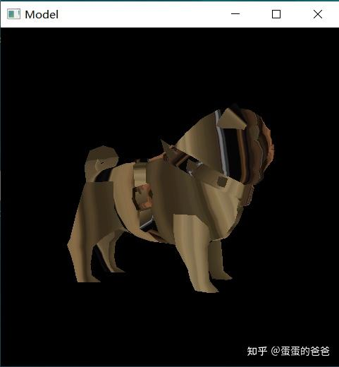

# Vulkan从入门到精通21-显示模型

这篇话题回到模式显示上面。

内容没有什么心意，直接放代码和显示结果就可以了

```cpp
#include <iostream>
#include <cstring>
#include <chrono>
#include <glm/mat4x4.hpp>
#include <glm/gtx/transform.hpp>
#include "VK_UniformBuffer.h"
#include "VK_Context.h"
#include "VK_Image.h"
#include "VK_Texture.h"

using namespace std;

VK_Context *context = nullptr;

uint32_t updateUniformBufferData(char *&data, uint32_t size)
{
    static auto startTime = std::chrono::high_resolution_clock::now();
    auto currentTime = std::chrono::high_resolution_clock::now();
    float time = std::chrono::duration<float, std::chrono::seconds::period>(currentTime - startTime).count();
    glm::mat4 model = glm::rotate(glm::mat4(1.0f), glm::radians(90.0f), glm::vec3(1.0f, 0.0f, 0.0f));
    model *= glm::rotate(glm::mat4(1.0f), time * glm::radians(30.0f), glm::vec3(0.0f, 1.0f, 0.0f));
    auto view = glm::lookAt(glm::vec3(0.0f, 4.0f, 0.0f), glm::vec3(0.0f, 0.0f, 0.0f), glm::vec3(0.0f, 0.0f, 1.0f));
    auto proj = glm::perspective(glm::radians(45.0f), context->getSwapChainExtent().width / (float)context->getSwapChainExtent().height, 0.1f, 10.0f);
    proj[1][1] *= -1;

    model = proj * view * model;
    memcpy(data, &model[0][0], size);
    time = sin(time);
    memcpy(data + sizeof(float) * 16, (void *)&time, sizeof(float));
    return 17 * sizeof(float);
}

void onFrameSizeChanged(int width, int height)
{
    auto vp = VK_Viewports::createViewport(width, height);
    VK_Viewports vps;
    vps.addViewport(vp);
    context->setViewports(vps);
}

int main()
{
    VK_ContextConfig config;
    config.debug = false;
    config.name = "Model";

    context = createVkContext(config);
    context->createWindow(480, 480, true);
    context->setOnFrameSizeChanged(onFrameSizeChanged);

    VK_Context::VK_Config vkConfig;
    context->initVulkanDevice(vkConfig);

    auto shaderSet = context->createShaderSet();
    shaderSet->addShader("../shader/model/vert.spv", VK_SHADER_STAGE_VERTEX_BIT);
    shaderSet->addShader("../shader/model/frag.spv", VK_SHADER_STAGE_FRAGMENT_BIT);

    shaderSet->appendAttributeDescription(0, sizeof (float) * 3);
    shaderSet->appendAttributeDescription(1, sizeof (float) * 2);
    shaderSet->appendAttributeDescription(2, sizeof (float) * 3);

    VkDescriptorSetLayoutBinding uniformBinding = VK_ShaderSet::createDescriptorSetLayoutBinding(0,
            VK_DESCRIPTOR_TYPE_UNIFORM_BUFFER, VK_SHADER_STAGE_VERTEX_BIT);
    shaderSet->addDescriptorSetLayoutBinding(uniformBinding);

    auto samplerBinding = VK_ShaderSet::createDescriptorSetLayoutBinding(1,
                          VK_DESCRIPTOR_TYPE_COMBINED_IMAGE_SAMPLER, VK_SHADER_STAGE_FRAGMENT_BIT);
    shaderSet->addDescriptorSetLayoutBinding(uniformBinding);
    auto samplerCreateInfo  = VK_Sampler::createSamplerCreateInfo();
    auto samplerPtr = context->createSampler(samplerCreateInfo);
    VkSampler sampler = samplerPtr->getSampler();
    samplerBinding.pImmutableSamplers = &sampler;

    shaderSet->addDescriptorSetLayoutBinding(samplerBinding);

    if (!shaderSet->isValid()) {
        std::cerr << "invalid shaderSet" << std::endl;
        shaderSet->release();
        context->release();
        return -1;
    }

    auto ubo = context->createUniformBuffer(0, sizeof(float) * 17);
    ubo->setWriteDataCallback(updateUniformBufferData);
    context->addUniformBuffer(ubo);

    auto buffer = context->createVertexBuffer("../model/pug.obj", true);
    context->addBuffer(buffer);

    auto image = context->createImage("../model/PUG_TAN.tga");

    auto imageViewCreateInfo = VK_ImageView::createImageViewCreateInfo(image->getImage(),
                               VK_FORMAT_R8G8B8A8_SRGB);
    auto imageView = context->createImageView(imageViewCreateInfo);
    context->addImageView(imageView);

    context->initVulkanContext(shaderSet);

    auto rasterCreateInfo = context->getPipelineRasterizationStateCreateInfo();
    rasterCreateInfo.cullMode = VK_CULL_MODE_NONE;
    context->setPipelineRasterizationStateCreateInfo(rasterCreateInfo);

    context->initPipeline();
    context->createCommandBuffers();

    context->run();
    context->release();

    return 0;
}
```

运行效果



vulkan显示小狗模型