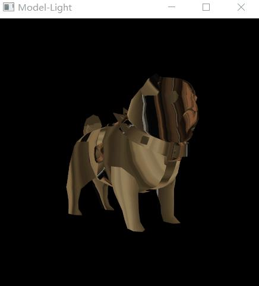

# Vulkan从入门到精通30-光照

本文来聊聊使用Vulkan显示光照。Vulkan中的光照和OpenGL区别不大，主要计算都是在shader中完成的，程序中要做的只是传入数据信息即可。

程序还是在之前模型的基础上修改。程序代码如下

```cpp
Context *context = nullptr;
VK_Pipeline* pipeline = nullptr;

struct UBO {
    glm::mat4 modelView;
    glm::mat4 projection;
};

UBO ubo;

uint32_t updateUniformBufferData(char *&data, uint32_t size)
{
    assert(size == sizeof(UBO));
    static auto startTime = std::chrono::high_resolution_clock::now();
    auto currentTime = std::chrono::high_resolution_clock::now();
    float time = std::chrono::duration<float, std::chrono::seconds::period>(currentTime - startTime).count();
    glm::mat4 model = glm::rotate(glm::mat4(1.0f), glm::radians(90.0f), glm::vec3(1.0f, 0.0f, 0.0f));
    model *= glm::rotate(glm::mat4(1.0f), time * glm::radians(30.0f), glm::vec3(0.0f, 1.0f, 0.0f));
    auto view = glm::lookAt(glm::vec3(0.0f, 4.0f, 0.0f), glm::vec3(0.0f, 0.0f, 0.0f), glm::vec3(0.0f, 0.0f, 1.0f));
    auto proj = glm::perspective(glm::radians(45.0f), context->getSwapChainExtent().width / (float)context->getSwapChainExtent().height, 0.1f, 10.0f);
    proj[1][1] *= -1;

    ubo.modelView = view * model;
    ubo.projection = proj;
    memcpy(data, &ubo, sizeof(UBO));
    time = sin(time);
    return size;
}

void onFrameSizeChanged(int width, int height)
{
    pipeline->getDynamicState()->applyDynamicViewport({0, 0, (float)width, (float)height, 0, 1});
}

int main()
{
    VK_ContextConfig config;
    config.debug = false;
    config.name = "Model-Light";

    context = createVkContext(config);
    context->createWindow(480, 480, true);
    context->setOnFrameSizeChanged(onFrameSizeChanged);

    VK_Context::VK_Config vkConfig;
    context->initVulkanDevice(vkConfig);

    auto shaderSet = context->createShaderSet();
    shaderSet->addShader("../shader/model-light/vert.spv", VK_SHADER_STAGE_VERTEX_BIT);
    shaderSet->addShader("../shader/model-light/frag.spv", VK_SHADER_STAGE_FRAGMENT_BIT);

    shaderSet->appendAttributeDescription(0, sizeof (float) * 3);
    shaderSet->appendAttributeDescription(1, sizeof (float) * 2);
    shaderSet->appendAttributeDescription(2, sizeof (float) * 3);

    VkDescriptorSetLayoutBinding uniformBinding = VK_ShaderSet::createDescriptorSetLayoutBinding(0,
            VK_DESCRIPTOR_TYPE_UNIFORM_BUFFER, VK_SHADER_STAGE_VERTEX_BIT);
    shaderSet->addDescriptorSetLayoutBinding(uniformBinding);

    auto samplerBinding = VK_ShaderSet::createDescriptorSetLayoutBinding(1,
                          VK_DESCRIPTOR_TYPE_COMBINED_IMAGE_SAMPLER, VK_SHADER_STAGE_FRAGMENT_BIT);
    shaderSet->addDescriptorSetLayoutBinding(uniformBinding);
    auto samplerCreateInfo  = VK_Sampler::createSamplerCreateInfo();
    auto samplerPtr = context->createSampler(samplerCreateInfo);
    VkSampler sampler = samplerPtr->getSampler();
    samplerBinding.pImmutableSamplers = &sampler;

    shaderSet->addDescriptorSetLayoutBinding(samplerBinding);

    if (!shaderSet->isValid()) {
        std::cerr << "invalid shaderSet" << std::endl;
        shaderSet->release();
        context->release();
        return -1;
    }

    auto ubo = context->createUniformBuffer(0, sizeof(UBO));
    ubo->setWriteDataCallback(updateUniformBufferData);
    context->addUniformBuffer(ubo);

    auto image = context->createImage("../model/PUG_TAN.tga");

    auto imageViewCreateInfo = VK_ImageView::createImageViewCreateInfo(image->getImage(),
                               VK_FORMAT_R8G8B8A8_SRGB);
    auto imageView = context->createImageView(imageViewCreateInfo);
    context->addImageView(imageView);

    context->initVulkanContext();

    float consts[8] = {-20, 20, 0, 1, 1, 1, 1, 1};

    context->addPushConstant({VK_SHADER_STAGE_FRAGMENT_BIT, 0, sizeof(float) * 8}, (const char*)consts);
    context->initVulkanContext();

    pipeline = context->createPipeline();

    auto rasterCreateInfo = pipeline->getRasterizationStateCreateInfo();
    rasterCreateInfo.cullMode = VK_CULL_MODE_NONE;
    pipeline->setRasterizationStateCreateInfo(rasterCreateInfo);
    pipeline->create();

    auto buffer = context->createVertexBuffer("../model/pug.obj", true);
    pipeline->addRenderBuffer(buffer);

    context->createCommandBuffers();

    context->run();
    context->release();

    return 0;
}
```

推送常量给[片段着色器](https://zhida.zhihu.com/search?content_id=190444316&content_type=Article&match_order=1&q=片段着色器&zhida_source=entity)，一个光源位置，一个环境光颜色。

顶点shader如下

```cpp
#version 450
layout(location = 0) in vec3 inPosition;
layout(location = 1) in vec2 coord;
layout(location = 2) in vec3 inNormal;
layout(binding = 0) uniform UniformBufferObject {
    mat4 modelView;
    mat4 projection;
} mvp;

layout(location = 0) out vec3 fragNormal;
layout(location = 1) out vec2 fragTexCoord;
layout(location = 2) out vec3 fragPosition;

void main() {
    gl_Position = mvp.projection*mvp.modelView*vec4(inPosition, 1.0);
    fragNormal = mat3(mvp.modelView) * inNormal;
    fragPosition = vec3(mvp.modelView * vec4(inPosition,1.0));
    fragTexCoord = coord;
}
```

片段

```cpp
#version 450
layout(binding = 1) uniform sampler2D texSampler;
layout(location = 0) in vec3 fragNormal;
layout(location = 1) in vec2 fragTexCoord;
layout(location = 2) in vec3 fragPosition;
layout(location = 0) out vec4 outColor;

layout(push_constant) uniform PushConsts {
    vec4 position;
    vec4 lightColor;
} pushConsts;

void main() {
    vec3 intensity = vec3(1.0,1.0,1.0);
    vec3 kd = vec3(pushConsts.lightColor);
    vec3 ka = texture(texSampler, fragTexCoord).rgb;
    vec3 ks = vec3(0,1,0);

    float shininess = 64.0;
    vec3 n = normalize(fragNormal);
    vec3 s = normalize(vec3(pushConsts.position) - fragPosition);
    vec3 v = normalize(vec3(-fragPosition));
    vec3 r = reflect(-s,n);

    outColor = vec4(intensity * (ka + kd * max(dot(s,n),0.0) +
           ks * pow(max(dot(r,v),0.5),shininess)),1.0);
}
```

显示效果




vulkan光照

