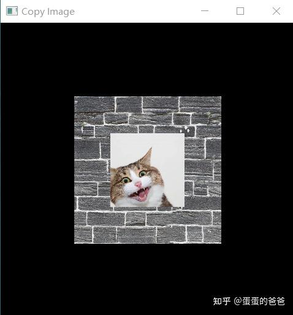
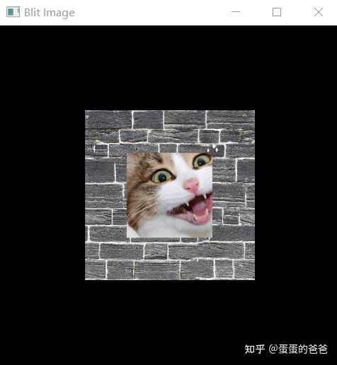

# Vulkan从入门到精通40-Image Blit/Copy

看看本系列能写多少篇？

在前文 - [蛋蛋的爸爸：](https://zhuanlan.zhihu.com/p/464134337/edit)Vulkan从入门到精通37-管线屏障和vkCmdClearColorImage 介绍了使用指定颜色清空VkImage的函数vkCmdClearColorImage。

本文介绍Image的复制和块传输函数 vkCmdCopyImage、vkCmdBlitImage

前者[函数原型](https://zhida.zhihu.com/search?content_id=207141930&content_type=Article&match_order=1&q=函数原型&zhida_source=entity)和介绍如下

vkCmdCopyImage - 在Image之间进行复制操作

```cpp
void vkCmdCopyImage(
    VkCommandBuffer                             commandBuffer,
    VkImage                                     srcImage,
    VkImageLayout                               srcImageLayout,
    VkImage                                     dstImage,
    VkImageLayout                               dstImageLayout,
    uint32_t                                    regionCount,
    const VkImageCopy*                          pRegions);
```

参数VkImageCopy用于指定复制区域。

```cpp
typedef struct VkImageCopy {
    VkImageSubresourceLayers    srcSubresource;
    VkOffset3D                  srcOffset;
    VkImageSubresourceLayers    dstSubresource;
    VkOffset3D                  dstOffset;
    VkExtent3D                  extent;
} VkImageCopy;
```

这个结构看上去是不是有点发昏？

用一个例子来说明吧

```cpp
#include <iostream>
#include <cstring>
#include <glm/mat4x4.hpp>
#include <glm/gtx/transform.hpp>
#include "VK_UniformBuffer.h"
#include "VK_Context.h"
#include "VK_Image.h"
#include "VK_Texture.h"
#include "VK_Pipeline.h"
#include "VK_DynamicState.h"
#include "VK_CommandPool.h"
#include <fstream>

using namespace std;

const std::vector<float> vertices = {
    -0.5f, -0.5, 0.0f, 1.0f, 0.0f, 0.0f, 0.0f, 1.0f, 0.0f,
        0.5f, -0.5f, 0.0f, 0.0f, 1.0f, 0.0f, 0.0f, 0.0f, 0.0f,
        0.5f, 0.5f, 0.0f, 0.0f, 0.0f, 0.0f, 1.0f, 0.0f, 1.0f,
        -0.5f, 0.5f, 0.0f, 1.0f, 1.0f, 0.0f, 1.0f, 1.0f, 1.0f
    };

const std::vector<uint32_t> indices = {
    0, 1, 2, 2, 3, 0
};

VK_Context *context = nullptr;
VK_Pipeline *pipeline = nullptr;

uint32_t updateUniformBufferData(char *&data, uint32_t size)
{
    glm::mat4 model = glm::identity<glm::mat4>();
    memcpy(data, &model[0][0], size);
    return sizeof(model);
}

void onFrameSizeChanged(int width, int height)
{
    pipeline->getDynamicState()->applyDynamicViewport({0, 0, (float)width, (float)height, 0, 1});
}

int main()
{
    VK_ContextConfig config;
    config.debug = true;
    config.name = "Copy Image";

    context = createVkContext(config);
    context->createWindow(480, 480, true);
    context->setOnFrameSizeChanged(onFrameSizeChanged);

    VK_Context::VK_Config vkConfig;
    context->initVulkanDevice(vkConfig);

    auto shaderSet = context->createShaderSet();
    shaderSet->addShader("../shader/texture/vert.spv", VK_SHADER_STAGE_VERTEX_BIT);
    shaderSet->addShader("../shader/texture/frag.spv", VK_SHADER_STAGE_FRAGMENT_BIT);

    shaderSet->appendVertexAttributeDescription(0, sizeof (float) * 3, VK_FORMAT_R32G32B32_SFLOAT, 0);
    shaderSet->appendVertexAttributeDescription(1, sizeof (float) * 4, VK_FORMAT_R32G32B32A32_SFLOAT,
            sizeof(float) * 3);
    shaderSet->appendVertexAttributeDescription(2, sizeof (float) * 2, VK_FORMAT_R32G32_SFLOAT,
            sizeof(float) * 7);

    shaderSet->appendVertexInputBindingDescription(9 * sizeof(float), 0, VK_VERTEX_INPUT_RATE_VERTEX);

    VkDescriptorSetLayoutBinding uniformBinding = VK_ShaderSet::createDescriptorSetLayoutBinding(0,
            VK_DESCRIPTOR_TYPE_UNIFORM_BUFFER, VK_SHADER_STAGE_VERTEX_BIT);
    shaderSet->addDescriptorSetLayoutBinding(uniformBinding);

    auto samplerBinding = VK_ShaderSet::createDescriptorSetLayoutBinding(1,
                          VK_DESCRIPTOR_TYPE_COMBINED_IMAGE_SAMPLER,
                          VK_SHADER_STAGE_FRAGMENT_BIT);
    auto samplerCreateInfo  = VK_Sampler::createSamplerCreateInfo();
    auto samplerPtr = context->createSampler(samplerCreateInfo);
    VkSampler sampler = samplerPtr->getSampler();
    samplerBinding.pImmutableSamplers = &sampler;

    shaderSet->addDescriptorSetLayoutBinding(samplerBinding);

    if (!shaderSet->isValid()) {
        std::cerr << "invalid shaderSet" << std::endl;
        shaderSet->release();
        context->release();
        return -1;
    }

    auto ubo = shaderSet->addUniformBuffer(0, sizeof(float) * 16);
    ubo->setWriteDataCallback(updateUniformBufferData);

    auto cat = context->createImage("../images/cat.png");
    auto wall = context->createImage("../images/wall.png");

    auto command = context->getCommandPool()->beginSingleTimeCommands();

    adjustImageLayout(command, cat->getImage(), VK_IMAGE_LAYOUT_SHADER_READ_ONLY_OPTIMAL,
                      VK_IMAGE_LAYOUT_TRANSFER_SRC_OPTIMAL);
    adjustImageLayout(command, wall->getImage(), VK_IMAGE_LAYOUT_SHADER_READ_ONLY_OPTIMAL,
                      VK_IMAGE_LAYOUT_TRANSFER_DST_OPTIMAL);

    VkImageCopy cregion;
    cregion.srcSubresource.aspectMask = VK_IMAGE_ASPECT_COLOR_BIT;
    cregion.srcSubresource.mipLevel = 0;
    cregion.srcSubresource.baseArrayLayer = 0;
    cregion.srcSubresource.layerCount = 1;
    cregion.srcOffset.x = 0;
    cregion.srcOffset.y = 0;
    cregion.srcOffset.z = 0;
    cregion.dstSubresource.aspectMask = VK_IMAGE_ASPECT_COLOR_BIT;
    cregion.dstSubresource.mipLevel = 0;
    cregion.dstSubresource.baseArrayLayer = 0;
    cregion.dstSubresource.layerCount = 1;
    cregion.dstOffset.x = 256;
    cregion.dstOffset.y = 256;
    cregion.dstOffset.z = 0;
    cregion.extent.width = 512;
    cregion.extent.height = 512;
    cregion.extent.depth = 1;

    vkCmdCopyImage(command, cat->getImage(), VK_IMAGE_LAYOUT_TRANSFER_SRC_OPTIMAL, wall->getImage(),
                   VK_IMAGE_LAYOUT_TRANSFER_DST_OPTIMAL,
                   1, &cregion);

    adjustImageLayout(command, wall->getImage(), VK_IMAGE_LAYOUT_TRANSFER_DST_OPTIMAL,
                      VK_IMAGE_LAYOUT_SHADER_READ_ONLY_OPTIMAL);

    context->getCommandPool()->endSingleTimeCommands(command, context->getGraphicQueue());

    auto imageViewCreateInfo = VK_ImageView::createImageViewCreateInfo(wall->getImage(),
                               VK_FORMAT_R8G8B8A8_SRGB);
    auto imageView = context->createImageView(imageViewCreateInfo);
    shaderSet->addImageView(imageView, 1);

    context->initVulkanContext();
    pipeline = context->createPipeline(shaderSet);
    pipeline->getDynamicState()->addDynamicState(VK_DYNAMIC_STATE_VIEWPORT);
    pipeline->create();
    pipeline->getDynamicState()->applyDynamicViewport({0, 0, 480, 480, 0, 1});

    auto buffer = context->createVertexBuffer(vertices, 9, indices);
    pipeline->addRenderBuffer(buffer);

    context->createCommandBuffers();

    context->run();
    context->release();

    return 0;
}
```

cat是源Image，wall是目标Image。在copy前需要先把前者从*VK_IMAGE_LAYOUT_SHADER_READ_ONLY_OPTIMAL布局转换为VK_IMAGE_LAYOUT_TRANSFER_SRC_OPTIMAL。后者则是VK_IMAGE_LAYOUT_SHADER_READ_ONLY_OPTIMAL 到* *VK_IMAGE_LAYOUT_TRANSFER_DST_OPTIMAL。*

VkImageCopy中的srcSubresource设置源资源布局，这里的Image是普通Image，而非深度或者模板，所以设置为*VK_IMAGE_ASPECT_COLOR_BIT。不需要mipLevel，所以设置为0.*

srcOffset设置的是源Image偏移。dstOffset为目标Image位置偏移。extent为copy区域大小。

上边代码显示效果如下



vkCmdCopyImage

复制完成后由于要使用wall作为纹理，所以需要把他的布局[类型转换](https://zhida.zhihu.com/search?content_id=207141930&content_type=Article&match_order=1&q=类型转换&zhida_source=entity)回去，也就是*VK_IMAGE_LAYOUT_TRANSFER_DST_OPTIMAL 到* *VK_IMAGE_LAYOUT_SHADER_READ_ONLY_OPTIMAL。*

*对于blit.关键代码段是*

```cpp
  VkImageBlit region;
    region.srcSubresource.aspectMask = VK_IMAGE_ASPECT_COLOR_BIT;
    region.srcSubresource.mipLevel = 0;
    region.srcSubresource.baseArrayLayer = 0;
    region.srcSubresource.layerCount = 1;
    region.srcOffsets[0].x = 256;
    region.srcOffsets[0].y = 256;
    region.srcOffsets[0].z = 0;
    region.srcOffsets[1].x = 512;
    region.srcOffsets[1].y = 512;
    region.srcOffsets[1].z = 1;
    region.dstSubresource.aspectMask = VK_IMAGE_ASPECT_COLOR_BIT;
    region.dstSubresource.mipLevel = 0;
    region.dstSubresource.baseArrayLayer = 0;
    region.dstSubresource.layerCount = 1;
    region.dstOffsets[0].x = 256;
    region.dstOffsets[0].y = 256;
    region.dstOffsets[0].z = 0;
    region.dstOffsets[1].x = 768;
    region.dstOffsets[1].y = 768;
    region.dstOffsets[1].z = 1;

    vkCmdBlitImage(command, cat->getImage(), VK_IMAGE_LAYOUT_TRANSFER_SRC_OPTIMAL, wall->getImage(),
                   VK_IMAGE_LAYOUT_TRANSFER_DST_OPTIMAL,
                   1, &region, VK_FILTER_LINEAR);
```

srcOffsets是个包含2个元素的数组，指定的分别是源Image开始偏移和范围大小。dstOffsets含义类似。

显示效果如下



vkCmdBlitImage

vkCmdCopyImage和vkCmdBlitImage区别在于后者使用的srcImage 待copy尺寸和dstImage copy区域不一样药一样的，也就是自动会做缩放处理。