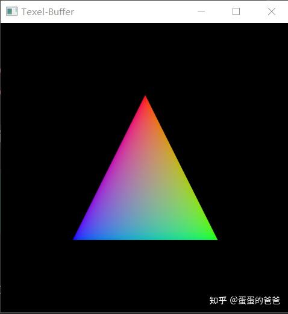

# Vulkan从入门到精通41-Texel Buffer

除了普通的uniform buffer，vulkan还提供动态uniform buffer和texel buffer。本文来介绍后者。

texel buffer 可以让我们以类似于图像读取数据的方式读取数据，它们的内容不是解释为单个（标量）值的数组，而是解释为具有一个、两个、三个或四个组件的格式化像素（纹素）。通过这样的缓冲区，我们可以访问比通常图像提供的数据大得多的数据。简单的说就是texel buffer可以让我们把图像等比较大的数据传输给shader以供后者使用。

------

做法如下，增加VK_TexelBuffer

```cpp
class VK_TexelBuffer : public VK_UniformBuffer
{
    friend class VK_ContextImpl;
public:
    VK_TexelBuffer() = delete;
    VK_TexelBuffer(VK_ContextImpl *vkContext, uint32_t binding, uint32_t bufferSize);
    ~VK_TexelBuffer();
public:
    void initBuffer(uint32_t swapImageChainSize)override;

    [[nodiscard]] VkWriteDescriptorSet createWriteDescriptorSet(uint32_t index,
                                                                VkDescriptorSet descriptorSet)const override;

    void clearBuffer()override;
    void release()override;

    void setWriteDataCallback(std::function<uint32_t(char *&, uint32_t)> cb)override;
    void update(uint32_t index)override;
protected:
    VK_ContextImpl *context = nullptr;
    uint32_t bindingId = 0;
    uint32_t bufferSize = 0;

    std::function<uint32_t(char *&, uint32_t)> writeDataCallback;

    std::vector<char> bufferData;
    std::vector<VkBuffer> uniformBuffers;
    std::vector<VkDeviceMemory> uniformBuffersMemory;
    std::vector<VkDescriptorBufferInfo> bufferInfos;

    std::vector<std::shared_ptr<VK_BufferView>> bufferViews;

    bool needClear = false;
};
```

实现是

```cpp
VK_TexelBuffer::VK_TexelBuffer(VK_ContextImpl *vkContext, uint32_t binding,
                               uint32_t uboSize):
    context(vkContext),
    bindingId(binding),
    bufferSize(uboSize)
{
    bufferData.resize(bufferSize);
}

VK_TexelBuffer::~VK_TexelBuffer()
{
}

void VK_TexelBuffer::initBuffer(uint32_t swapImageChainSize)
{
    clearBuffer();

    uniformBuffers.resize(swapImageChainSize);
    uniformBuffersMemory.resize(swapImageChainSize);
    bufferInfos.resize(swapImageChainSize);

    bufferViews.resize(swapImageChainSize);

    for (size_t i = 0; i < swapImageChainSize; i++) {
        context->createBuffer(bufferSize,
                              VK_BUFFER_USAGE_UNIFORM_TEXEL_BUFFER_BIT,
                              VK_MEMORY_PROPERTY_HOST_VISIBLE_BIT | VK_MEMORY_PROPERTY_HOST_COHERENT_BIT, uniformBuffers[i],
                              uniformBuffersMemory[i]);
        bufferInfos[i].buffer = uniformBuffers[i];
        bufferInfos[i].offset = 0;
        bufferInfos[i].range = bufferSize;

        bufferViews[i] = std::make_shared<VK_BufferViewImpl>(context, uniformBuffers[i],
                                                             VK_FORMAT_R32_SFLOAT, bufferSize);

    }

    needClear = true;
}

VkWriteDescriptorSet VK_TexelBuffer::createWriteDescriptorSet(uint32_t index,
                                                              VkDescriptorSet descriptorSet) const
{
    assert(index < bufferInfos.size());
    VkWriteDescriptorSet descriptorWrite{};
    descriptorWrite.sType = VK_STRUCTURE_TYPE_WRITE_DESCRIPTOR_SET;
    descriptorWrite.dstSet = descriptorSet;
    descriptorWrite.dstBinding = bindingId;
    descriptorWrite.dstArrayElement = 0;
    descriptorWrite.descriptorType =
        VK_DESCRIPTOR_TYPE_UNIFORM_TEXEL_BUFFER;
    descriptorWrite.descriptorCount = 1;
    descriptorWrite.pBufferInfo = &bufferInfos[index];

    descriptorWrite.pTexelBufferView = bufferViews[index]->getBufferView();
    return descriptorWrite;
}

void VK_TexelBuffer::release()
{
    clearBuffer();
    uniformBuffers.clear();
    uniformBuffersMemory.clear();
    delete this;
}

void VK_TexelBuffer::setWriteDataCallback(std::function<uint32_t (char *&, uint32_t)> cb)
{
    if (cb)
        writeDataCallback = cb;
}

void VK_TexelBuffer::update(uint32_t index)
{
    if (!writeDataCallback) {
        std::cerr << "please set write data callback function" << std::endl;
    }

    char *userData = bufferData.data();
    uint32_t size = writeDataCallback(userData, bufferData.size());
    if (size != bufferData.size()) {
        std::cerr << "write data callback size error" << std::endl;
        return;
    }

    void *gpuData = nullptr;
    vkMapMemory(context->getDevice(), uniformBuffersMemory[index], 0, bufferSize, 0, &gpuData);
    memcpy(gpuData, userData, bufferSize);
    vkUnmapMemory(context->getDevice(), uniformBuffersMemory[index]);
}

void VK_TexelBuffer::clearBuffer()
{
    bufferViews.clear();

    for (size_t i = 0; i < uniformBuffers.size(); i++) {
        vkDestroyBuffer(context->getDevice(), uniformBuffers[i], context->getAllocation());
        uniformBuffers[i] = VK_NULL_HANDLE;
    }
    for (size_t i = 0; i < uniformBuffers.size(); i++) {
        vkFreeMemory(context->getDevice(), uniformBuffersMemory[i], context->getAllocation());
        uniformBuffersMemory[i] = nullptr;
    }
}
```

uniform buffer和texel buffer的区别是后者的VkBufferCreateInfo.usage位是VK_BUFFER_USAGE_UNIFORM_TEXEL_BUFFER_BIT，前者是VK_BUFFER_USAGE_UNIFORM_BUFFER_BIT。


在创建对应的Buffer后，texel buffer需要引入VkBufferView。如下

```cpp
class VK_BufferViewImpl : public VK_BufferView
{
public:
    VK_BufferViewImpl() = delete;
    VK_BufferViewImpl(VK_Context *inputContext, VkBuffer buffer, VkFormat format, VkDeviceSize size);

    ~VK_BufferViewImpl();
public:
    VkBufferView *getBufferView() override;
private:
    VK_Context *vkContext = nullptr;
    VkBufferView bufferView = nullptr;
};

VK_BufferViewImpl::VK_BufferViewImpl(VK_Context *inputContext, VkBuffer buffer, VkFormat format,
                                     VkDeviceSize size)
{
    VkBufferViewCreateInfo viewInfo = {};
    viewInfo.sType = VK_STRUCTURE_TYPE_BUFFER_VIEW_CREATE_INFO;
    viewInfo.pNext = NULL;
    viewInfo.buffer = buffer;
    viewInfo.format = format;
    viewInfo.offset = 0;
    viewInfo.range = size;

    vkContext = inputContext;
    auto result = vkCreateBufferView(vkContext->getDevice(), &viewInfo, vkContext->getAllocation(),
                                     &bufferView);
    assert(result == VK_SUCCESS);
}

VK_BufferViewImpl::~VK_BufferViewImpl()
{
    vkDestroyBufferView(vkContext->getDevice(), bufferView, vkContext->getAllocation());
}

VkBufferView *VK_BufferViewImpl::getBufferView()
{
    return &bufferView;
}
```

在TexelBuffer 的InitBuffer函数中创建了对应的VK_BufferView列表。在函数*createWriteDescriptorSet中把*VkWriteDescriptorSet中描述付类型设置为*VK_DESCRIPTOR_TYPE_UNIFORM_TEXEL_BUFFER。同时*pTexelBufferView设置为buffer view 句柄地址。

其他用法和uniform buffer一致

------

实例代码判断如下

```cpp
const float texels[] = {1.0f, 0.0f, 0.0f,
                        0.0f, 1.0f, 0.0f,
                        0.0f, 0.0f, 1.0f
                       };
auto ubo = shaderSet->addTexelBuffer(0, sizeof(texels));
ubo->setWriteDataCallback(updateUniformBufferData);

//写数据回调
uint32_t updateUniformBufferData(char *&data, uint32_t size)
{
    int length = sizeof(texels);
    memcpy(data, texels, length);
    return length;
}
```

对应的vert shader

```glsl
#version 400
#extension GL_ARB_separate_shader_objects : enable
#extension GL_ARB_shading_language_420pack : enable
layout(location = 0) in vec3 position;
layout(location = 1) in vec4 color;

layout (binding = 0) uniform samplerBuffer texels;
layout (location = 0) out vec4 outColor;
 
void main() {
    float r = texelFetch(texels, gl_VertexIndex*3).r;
    float g = texelFetch(texels, gl_VertexIndex*3+1).r;
    float b = texelFetch(texels, gl_VertexIndex*3+2).r;
    outColor = vec4(r, g, b, 1.0);
    gl_Position = vec4(position, 1.0);
}
```



vulkan texel-buffer

在shader中对应的texelbuffer 标识是samplerBuffer。

使用时通过texelFetch(buffer,index).r,g,b来取值。