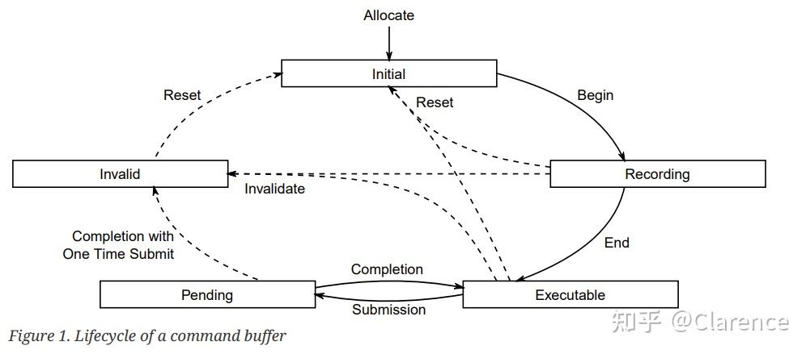

# Vulkan Command Buffers

### Overview

Command buffers 对象是用来记录指令的，这些被记录的指令随后会提交到device queue执行。

有两个等级的command buffers

1. primary command buffers ：其中的指令可以用来执行secondary command，并且可以submitted到queues中去。
2. secondary command buffers ： 可以被primary command buffers中的指令执行，不能直接submit到queue中。

被记录的指令包括

1. 绑定 pipelines 以及descriptor set到command buffer的指令
2. 修改dynamic state的指令
3. draw指令
4. commands to dispatch(for compute)
5. commands to copy buffers and images
6. other commands

command buffer之间的关系以及改变的状态是相互独立的，其实这里说的独立是针对primary 以及secondary command buffer之间相对独立，上述两种command buffer之间不存在任何继承的状态。当然同一个primary buffer或者同一个secondary buffer之间的不同指令，相互之间也是不会继承任何状态。

当command buffer 开始 记录指令，所有的在command buffer中的状态都是处于undefined的状态，当secondary buffer由于primary buffer得到原因开始被执行的时候，secondary buffer不会继承任何primary buffer的状态，并且此时所有的状态都是处于未知的。这样的规则存在一个例外，如果primary command buffer 已经在一个render pass instance中了，那么此时运行secondary command buffer不会影响到render pass的状态。

### Command Buffer Lifecycle

每个command buffer 一定会处于下述的几种状态之一

1. Initial状态

当command buffer被分配(allocated)，他就一定处于Initial状态。有一些指令可以reset command buffer或者干脆可以设置command buffer到initial状态（从executable，recording或者invalid state几种状态中转变）。如果 command buffer处于initial状态，那么他只能转移到recording状态，或者被free销毁。

2. Recording

**vkBeginCommandBuffer** change the state of a command buffer from the initial state to the recoding state. Once a command buffer is in the recording state, vkCmd* commands can be used to record to the command buffer.通过vkBeginCommandBuffer函数可以将command buffer的状态从initial状态转变到Recording状态，在这个状态下就可以开始记录指令了。

3. Executable

vkEndCommandBuffer ens the recording of a command buffer, and moves it from the recording state to the executable state. Executable command buffers can be submitted,reset,or recorded to another command buffer.

4. Pending

当讲command buffer使用Queue submission提交相关的api 提交给queue后，此时的command buffer就处于pending的状态，当处于pending的状态的时候，APP不应该试图去改变command buffer中的内容。因为此时device正准备将你记录的指令一句句的执行。一旦记录在command buffer里的指令被执行完毕了，此时的command buffer将会回到executable状态，或者根据VK_COMMAND_BUFFER_USAGE_ONE_TIME_SUBMIT_BIT 的设定情况，将会返回到invalid状态。

5. Invalid

有一些指令，例如存放在command buffer中的修改或者删除resource的指令，将会转变command buffer的状态到invalid状态，当command buffers状态进入到invalid，那么这个command buffer只能被reset 或者free.

每个存入command buffer中等待执行的command都有自己的执行条件和约束，各个指令都不相同。

resetting a command buffer这个操作会丢弃所有之前记录的commands并且讲command buffer复位到initial state。三种方式可以触发reset command buffer操作。（vkResetCommandBuffer or vkResetCommandPool）

Secondary command buffers里面的指令可以record到primary command buffer中通过vkCmdExecuteCommand指令。此时，secondary command buffer的状态是随着primary command buffer的状态一同变化的。

> This partially ties the lifecycle of the two command buffers together - if the primary is submitted to a queue, both the primary and any secondaries recorded to it move to the pending state. Once execution of the primary completes, so it does for any secondary recorded within it. After all executions of each command buffer complete, they each move to their appropriate completion state (either to the executable state or the invalid state, as specified above)

If a secondary moves to the invalid state or the initial state, then all primary buffers it is recorded in move to the invalid state. A primary moving to any other state does not affect the state of a secondary recorded in it.

### Command Pools

Commands Pools是一个不透明的对象(opaque objects)，可以从这个对象里面分配出一个command buffer。设计的目的是，希望通过多个command buffers来分摊创建资源的成本(allow the implementation to amortize the cost of resource creation across multiple command buffers)。

接下来介绍了一些API，包括如何创建Command pools以及从command pool里申请一个command buffer，这些API的[函数原型](https://zhida.zhihu.com/search?content_id=224896302&content_type=Article&match_order=1&q=函数原型&zhida_source=entity)。

### Secondary Command Buffer Execution

Secondary buffer 记录的指令不能直接提交给queue，但是secondary command buffers可以被记录为一个执行command在primary command buffer中以达到执行的目的。

