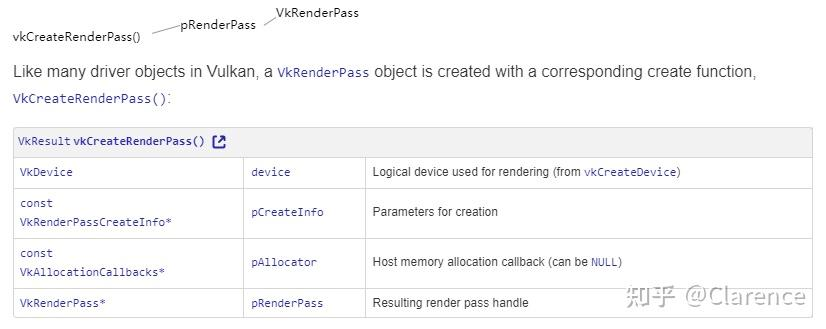
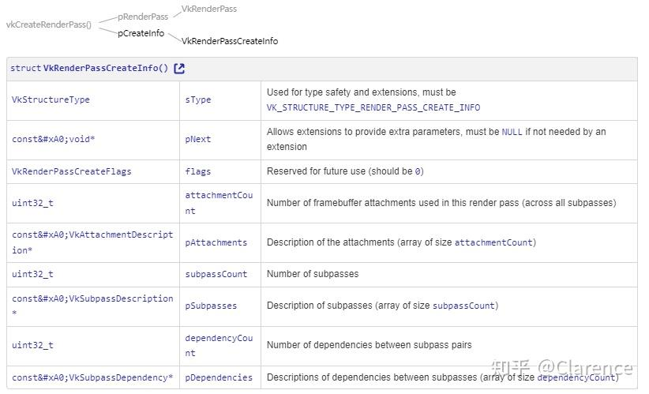
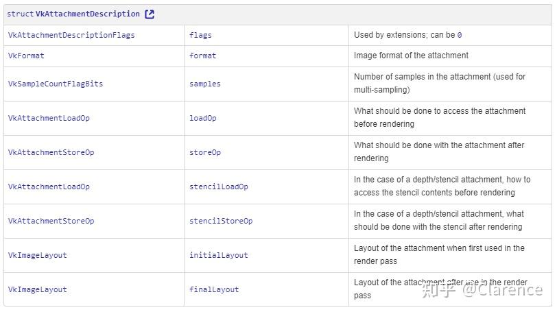
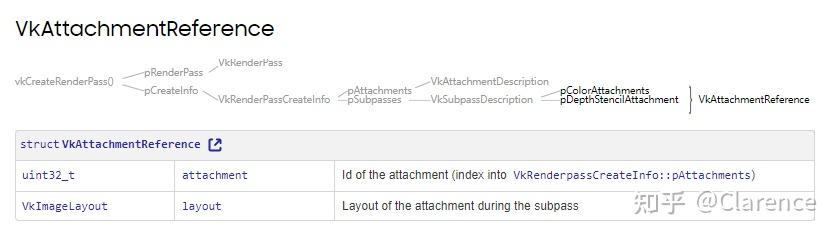
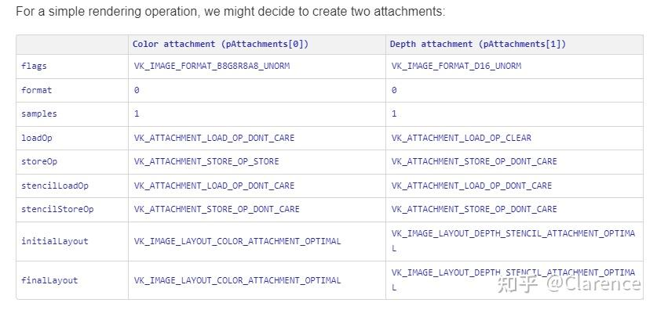
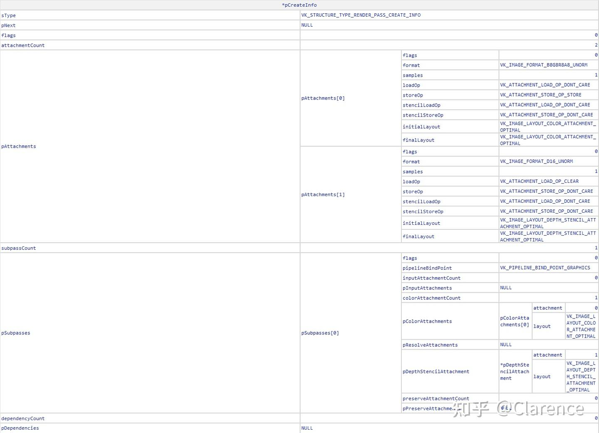

# Vulkan Render Pass介绍

Vulkan的[图像渲染](https://zhida.zhihu.com/search?content_id=225325205&content_type=Article&match_order=1&q=图像渲染&zhida_source=entity)是由 render passes以及subpasses 两部分组成的。这篇文章提供了上述两个概念的介绍，帮助用户理解如何使用render passes和subpass来完成Vulkan实现的图像渲染。

### Renderpass

如果用Khronos的术语来描述，当我们想用GPU去渲染一个复杂常见，我们会需要使用一个或多个render targets或者一个或多个framebuffer attachement。Attachemnt的格式和尺寸决定了GPU如何根据自身的并行能力将其合理的绘制出来。例如，在tile-based render([Tile-Based Deferred Rendering - 知乎 (zhihu.com)](https://zhuanlan.zhihu.com/p/26279464)) 中，attachment的集合是用来决定图片是如何划分为tiles的。

在Vulkan中，**一个render pass 是一系列attachment以及这些attachment的使用方法，以及记录如何使用这些attachment完成rendering工作的信息**。在传统API中(例如 OpenGL)，如果想要改变attachment的使用方法是需要重新创建一个framebuffer并且为其绑定的。

看到 Bill Licea-Kane 在 Vulkan Developer Day 是这样定义 RenderPass的

> "A render pass represent a collection of attachements , subpasses , and dependencies between the subpasses and describes how the attachements are used over the course of subpasses. The use of a render pass in a command buffer is a render pass instance."

小结下来， render pass 首先是一系列的attachments，以及subpasses的集合。并且他包含了dependencies用来描述这些subpasses是如何交互attachement的，上一次subpass的输出信息可以作为下一次subpass的输入信息进行进一步渲染，我们必须告诉renderpass不同的subpass之间的依赖关系。

在记录command到command buffer中的时候，renderpass是一个不可缺少的组件，表现在在record command的时候需要调用vkCmdBeginRenderpass，绝大多数的编程范例是下面这样的。

```text
vkBeginCommandBuffer(cmd,renderpassInfo ...); //这里就需要有一个完整的renderpass object

vkCmdBeginRenderPass(cmd, ...);

//rendering commands go here

vkCmdEndRenderPass(cmd);

vkEndCommandBuffer(cmd)
```

当然，renderpass在创建pipeline object的时候以及 创建framebuffer object的时候都有作用。

### Subpasses

因为GPUs有一些优化的[硬件算法](https://zhida.zhihu.com/search?content_id=225325205&content_type=Article&match_order=1&q=硬件算法&zhida_source=entity)，当用户想要对attachement进行写操作的时候，需要使用特定的attachement接口，因此，在一些传统API渲染的过程中，很难在fragment shader中去访问正在被渲染的attachment。

有一些常规的算法，比如 deferred shading([延迟着色法 - LearnOpenGL CN (learnopengl-cn.github.io)](https://link.zhihu.com/?target=https%3A//learnopengl-cn.github.io/05%20Advanced%20Lighting/08%20Deferred%20Shading/))，这种算法就会出现当前渲染需要依赖上一次渲染的情况。OGL中会创建两次FBO，来实现这个算法，但是Vulkan可以使用Subpasses来更好的处理此类问题。

对于tile-based render 渲染算法，如果后续的渲染操作和前一次的渲染操作有着相同的分辨率，并且这一块的数据需要被显示，那么前一次的渲染结果会选择高效的保存在on-chip memory上，这样的算法也需要访问上一次的渲染结果，作为下一次渲染的输入判断依据。tile-based render 用在移动端的GPU渲染比较多,桌面GPU用的较少。因此在桌面GPU环境下，经常只使用一条subpasses。

为了去帮助优化deferred shading on tile-based renders , Vulkan 把renderpass拆分成了一系列subpasses。所有的在renderpass中的subpasses有着相同的分辨率和tile[管理方法](https://zhida.zhihu.com/search?content_id=225325205&content_type=Article&match_order=1&q=管理方法&zhida_source=entity)，并且重要的是，处于后端的subpasses可以访问前端得到subpasses结果。

在Vulkan中一条renderpass可以包含多个subpasses，如果想简单的处理这个问题，可以选择一个renderpass只包含一个subpass。

### Creating a VkRenderPass

render pass 由 VkRenderPass object来描述。当你想往command buffer中添加render command的时候，有必要将创建好的VkRenderPass丢入vkCmdBeginRenderPass API中。Renderpass object会和VkFrameBuffer object配合使用，framebuffer代表一系列即将用作attachement的images的集合，这些attachment将会在renderpass中使用到。

**vkCreateRenderPass**



显然，主进一步需要跟进的是VkRenderPassCreateInfo *pCreateInfo，这里记录了创建VkRenderPass的具体信息


**VkRenderPassCreateInfo**



创建一个renderpass需要VkAttachmentDescription（attachement相关）以及VkSubpassDescription（subpass相关）VkSubpassDependency(subpass之间的依赖关系相关)，信息汇总。


**VkAttachementDescription**

一个attachment是会和一个VkImageView相互联系的，一个描述attachment的对象必须在create renderpass的时候就传进去，这样可以使得vulkan在创建renderpass的时候，创建出来的renderpass是符合attachement的要求的。在renderpass被使用的时候，一个真正的images将会由VkFrameBuffer对象来提供。

VkRenderPassCreateInfo 成员中的 pAttachements 指明了 attachmentCount 数量的attachement属性。





VkAttachmentReference 实际上就是VkRenderPassCreateInfo结构体中对应pAttachments的索引。那么现在我们举个例子，假设我们在VkRenderPassCreateInfo的pAttachment中放入了两个attachement的描述结构体



此时我们可以通过设置VkAttachementReference来决定哪个attachement用作subpass的什么用途。


完整的renderpass的数据概览如下



可以看出，在pAttachments中定义的两个attachment，他是如何使用在subpass的，每个attachment是作为subpass的color attachment 还是depth attachment都在（pSubpasses[0]）中做了定义。


### 参考文档

[Introduction to Vulkan Render Passes | Samsung Developers](https://link.zhihu.com/?target=https%3A//developer.samsung.com/galaxy-gamedev/resources/articles/renderpasses.html)