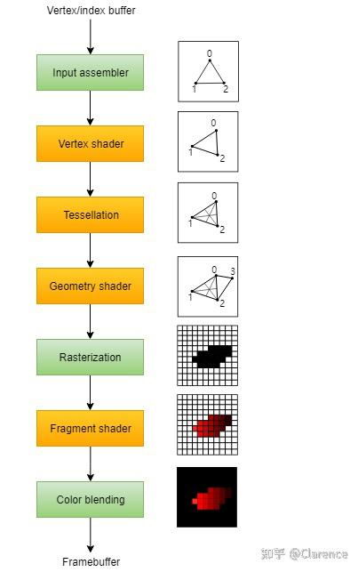
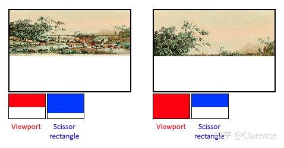

# Vulkan : pipeline object 如何抽象GPU硬件流水线

## 前言

本文目的是结合Vulkan的spec以及官方Vulkan教程，深入探究vulkan创建pipeline object的过程，以及理解vulkan是如何通过pipeline object去抽象硬件GPU流水线的各项功能的。

参考： [Introduction - Vulkan Tutorial](https://vulkan-tutorial.com/)

## 正文

现代GPU的流水线如下图所示，Vulkan的pipeline object就是试图在抽象下述流水线的各个功能。



绿色的部分是fix function部分的结构，也就是用户没法编程，无法更加灵活的去配置的组件，并且也是必不可少的。相对的概念是黄色部分，是可以通过着色器编程语言进行编程的组件，更加灵活，Vulkan使用(Shader modules)去抽象。

最终Vulkan在构建pipeline object的时候，会将所有流水线相关的配置“烘培”起来，一起配置传入给GPU，包括各个流水线模块的配置信息，着色器编程信息等。

于是，适当的抽象流水线的各个功能是非常必要的，vulkan做的也是非常好。

### Dynamic state

Vulkan在初始化的时候，就已经将流水线的配置都配置好了，体现在创建pipeline object的时候就已经确定好将来使用这个pipeline object配置进行draw的时候，GPU各个寄存器该如何配置。这样的好处，显然在于，可以减少draw的时候切换pipeline状态所需要的性能消耗。这样带来的现象就是，加载游戏的时候，第一次加载的时间会长一点，但是游戏运行的时候非常流畅。

这样的设计会存在一个缺点，那就是每次想要微调pipeline 的配置的时候，都需要重新创建一个pipeline object，因此vulkan给出了dynamic state。把一些经常会被修改到的pipeline state拿出来，在创建pipeline object的时候不对他进行初始化，但是相对的，要求用户一定要在draw的时候把这些没有做好的工作做完。

例如，

1. viewport
2. line width
3. blend constants

这几类pipeline state 是可以动态的在draw的时间改变的。

用户需要做的就是创建pipeline object之前，告知哪些状态，你想把他设置为dynamic state，并且填充`VkPipelineDynamicStateCreateInfo` 数据类型，将来在创建pipeline object的时候作为参数传入。

```c
std::vector<VkDynamicState> dynamicStates = {
    VK_DYNAMIC_STATE_VIEWPORT,
    VK_DYNAMIC_STATE_SCISSOR
};

VkPipelineDynamicStateCreateInfo dynamicState{};
dynamicState.sType = VK_STRUCTURE_TYPE_PIPELINE_DYNAMIC_STATE_CREATE_INFO;
dynamicState.dynamicStateCount = static_cast<uint32_t>(dynamicStates.size());
dynamicState.pDynamicStates = dynamicStates.data();
```

### Vertex input

`VkPipelineVertexInputStateCreateInfo` 描述了输入到整个流水线的vertex data的format，决定了第一个接收到vertex data的着色器（vs着色器）如何解析这些vertex data。

他会描述下述两种信息

1. Bindings ：每个数据之间的间距，以及这个vertex数据是per-vertex还是per-instance的
2. Attribute descriptions ：描述vertex的数据排布，例如offset，format之类的信息，和OGL的操作一致。

```text
VkPipelineVertexInputStateCreateInfo vertexInputInfo{};
vertexInputInfo.sType = VK_STRUCTURE_TYPE_PIPELINE_VERTEX_INPUT_STATE_CREATE_INFO;
vertexInputInfo.vertexBindingDescriptionCount = 0;
vertexInputInfo.pVertexBindingDescriptions = nullptr; // Optional
vertexInputInfo.vertexAttributeDescriptionCount = 0;
vertexInputInfo.pVertexAttributeDescriptions = nullptr; // Optional
```

### Input assembly

`VkPipelineInputAssemblyStateCreateInfo` 描述了两件时间

1. 需要画的geometry的类型是什么，是点还是线或者是三角形，这些合法的topology，OGL是在调用DRAW相关的API的时候才会传进去primtive的类型，但是vulkan在这里指定。
2. 是否需要启动primitive restart功能

可以选择的geometry类型如下

> `VK_PRIMITIVE_TOPOLOGY_POINT_LIST`: points from vertices
> `VK_PRIMITIVE_TOPOLOGY_LINE_LIST`: line from every 2 vertices without reuse
> `VK_PRIMITIVE_TOPOLOGY_LINE_STRIP`: the end vertex of every line is used as start vertex for the next line
> `VK_PRIMITIVE_TOPOLOGY_TRIANGLE_LIST`: triangle from every 3 vertices without reuse
> `VK_PRIMITIVE_TOPOLOGY_TRIANGLE_STRIP`: the second and third vertex of every triangle are used as first two vertices of the next triangle

正常情况下是按顺序去使用vertex array的数据，但是当然也可以使用element buffer，element buffer里面存放了vertex的array index。当出现重复的顶点数据的时候，使用element buffer可以通过复用vertex data达到减少vertex array的size的目的。是否使用element buffer的开关也在这里指定。如下代码所示，例子没有使用EBO，因此inputAssembly.primitiveRestartEnable = false，图元类型选定为VK_PRIMITIVE_TOPOLOGY_TRIANGLE_LIST

```text
VkPipelineInputAssemblyStateCreateInfo inputAssembly{};
inputAssembly.sType = VK_STRUCTURE_TYPE_PIPELINE_INPUT_ASSEMBLY_STATE_CREATE_INFO;
inputAssembly.topology = VK_PRIMITIVE_TOPOLOGY_TRIANGLE_LIST;
inputAssembly.primitiveRestartEnable = VK_FALSE;
```

**这里实际是抽象了GPU的input assembly组件，将离散的vertex点数据，按照topology的选择，组装成一个个的primitive。**

### Viewports and scissors

viewport 描述了将会把渲染结果输出到framebuffer的哪个区域，一般来说，如果将framebuffer设置为(width,height)那么viewport就是(0,0)到(width,height)，也就是把整个framebuffer都当作了画板。

```text
VkViewport viewport{};
viewport.x = 0.0f;
viewport.y = 0.0f;
viewport.width = (float) swapChainExtent.width;
viewport.height = (float) swapChainExtent.height;
viewport.minDepth = 0.0f;
viewport.maxDepth = 1.0f;
```

viewport是对图片相对于framebuffer的位置进行了一次transform，有可能是平移或者拉伸。而scissor就是对framebuffer中的图片进行剪裁，这个过程实是在[光栅化](https://zhida.zhihu.com/search?content_id=226268236&content_type=Article&match_order=1&q=光栅化&zhida_source=entity)的过程中去做的，可以把scissor的过程当作一次filter，而viewport则是进行transform。

Viewport是记录将这个大画板(framebuffer)哪些部分用来作为这一次draw的画板。而scissor就是对这个大画板(framebuffer)的剪切。



上图显然的看出，左图把相片拉伸填充到了framebuffer的上半部分，然后剪裁了下面的一段空白部分。右图，把整个图片完全平铺在framebuffer上，然后剪裁了下半部分。生动的表现了两个概念的区别。

因为，到目前为止，我不希望做任何剪裁操作和transform的操作，因此，viewport的大小配置完全配的和framebuffer的大小一样，然后scirssor也不做任何操作。

```text
VkRect2D scissor{};
scissor.offset = {0, 0};
scissor.extent = swapChainExtent;
```

scissor和viewport经常会变化，因此可以将这两个属性作为dynamic state，在draw的时候确定其值，而不是在创建pipeline object。

如果你希望将这两个state用作dynamic state

那么在创建pipeline的时候只需要填入数量即可

```text
VkPipelineViewportStateCreateInfo viewportState{};
viewportState.sType = VK_STRUCTURE_TYPE_PIPELINE_VIEWPORT_STATE_CREATE_INFO;
viewportState.viewportCount = 1;
viewportState.scissorCount = 1;
```

如果，你不希望将其作为dynamic state

需要在这里给入希望的配置

```text
VkPipelineViewportStateCreateInfo viewportState{};
viewportState.sType = VK_STRUCTURE_TYPE_PIPELINE_VIEWPORT_STATE_CREATE_INFO;
viewportState.viewportCount = 1;
viewportState.pViewports = &viewport;
viewportState.scissorCount = 1;
viewportState.pScissors = &scissor;
```

### Rasterizer

光栅化的过程是，使用经过vs transform处理后的primitive，然后根据ps的编程情况，对每个光栅后的fragment进行shading(着色)。

在光栅化过程中还会去做 深度测试(depth testing)，面剔除(face culling)，以及剪切测试(scissor test)，并且可以在这个阶段选择着色的方式，是完全填充primitive内部的所有fragment，还是只是填充边缘(wireframe rendering)。这些配置通过`VkPipelineRasterizationStateCreateInfo` 来承载。

```text
 VkPipelineRasterizationStateCreateInfo rasterizer{};
rasterizer.sType = VK_STRUCTURE_TYPE_PIPELINE_RASTERIZATION_STATE_CREATE_INFO;
rasterizer.depthClampEnable = VK_FALSE;
rasterizer.rasterizerDiscardEnable = VK_FALSE;
rasterizer.polygonMode = VK_POLYGON_MODE_FILL;
rasterizer.lineWidth = 1.0f;
rasterizer.cullMode = VK_CULL_MODE_BACK_BIT;
rasterizer.frontFace = VK_FRONT_FACE_CLOCKWISE;
```

rasterizer.polygonMode 选择着色方式，rasterizerDiscardEnable 选择是否需要打开光栅器，如果是TRUE那么将不会有任何fragment通过rasterizer。

### Multisampling

`VkPipelineMultisampleStateCreateInfo` 配置了multisamping，这个是用来[抗锯齿](https://zhida.zhihu.com/search?content_id=226268236&content_type=Article&match_order=1&q=抗锯齿&zhida_source=entity)的方法之一。 会比较关心每个primitive的边缘绘制，因为这是锯齿经常出现的地方，会在primitive边缘放置多个采样点，配合着色器的输出来决定pixel的着色结果（通常是多个采样点着色输出的均值）。

### Color blending

有两个类型用来描述 color blending的属性

`VkPipelineColorBlendAttachmentState` 包含了每个framebuffer对于的blending信息

`VkPipelineColorBlendStateCreateInfo` 包含了global color blending seeting。

也就是可以单独framebuffer 有一个blending配置，也可以完全使用相同的一套配置。

第一套配置如下

```text
VkPipelineColorBlendAttachmentState colorBlendAttachment{};
colorBlendAttachment.colorWriteMask = VK_COLOR_COMPONENT_R_BIT | VK_COLOR_COMPONENT_G_BIT | VK_COLOR_COMPONENT_B_BIT | VK_COLOR_COMPONENT_A_BIT;
colorBlendAttachment.blendEnable = VK_FALSE;
colorBlendAttachment.srcColorBlendFactor = VK_BLEND_FACTOR_ONE; // Optional
colorBlendAttachment.dstColorBlendFactor = VK_BLEND_FACTOR_ZERO; // Optional
colorBlendAttachment.colorBlendOp = VK_BLEND_OP_ADD; // Optional
colorBlendAttachment.srcAlphaBlendFactor = VK_BLEND_FACTOR_ONE; // Optional
colorBlendAttachment.dstAlphaBlendFactor = VK_BLEND_FACTOR_ZERO; // Optional
colorBlendAttachment.alphaBlendOp = VK_BLEND_OP_ADD; // Optional
```

### Pipeline Layout

你可以使用uniform变量，在着色器程序中，类似dynamic state的作用，你可以在draw之前动态的改变uniform 变量的值，而不需要重新编译着色器程序。常用在更新transformation 矩阵。

这些uniform values 需要通过创建vkpipelinelayout对象来指定，也就是在创建pipeline的时候，你需要提前知会，我将会有哪些uniform在这里面。

