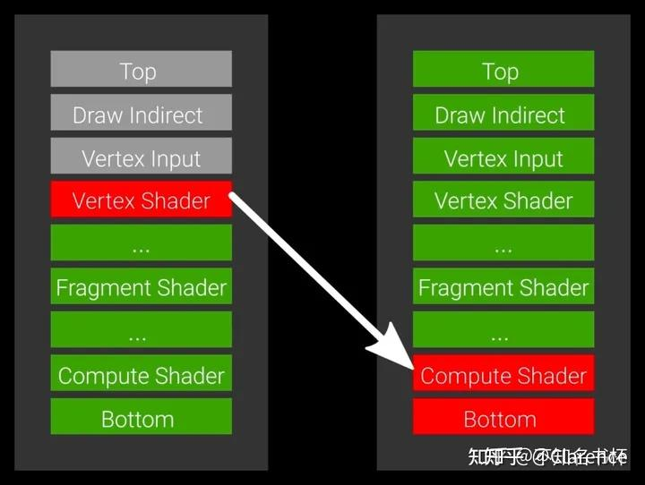

# Vulkan: Pipeline barriers笔记

vulkan中支持两种pipeline barrier

- Execution barriers
- Memory barriers

都是使用相同的API进行记录

```c
void vkCmdPipelineBarrier(
   VkCommandBuffer                             commandBuffer,
   VkPipelineStageFlags                        srcStageMask,
   VkPipelineStageFlags                        dstStageMask,
   VkDependencyFlags                           dependencyFlags,
   uint32_t                                    memoryBarrierCount,
   const VkMemoryBarrier*                      pMemoryBarriers,
   uint32_t                                    bufferMemoryBarrierCount,
   const VkBufferMemoryBarrier*                pBufferMemoryBarriers,
   uint32_t                                    imageMemoryBarrierCount,
   const VkImageMemoryBarrier*                 pImageMemoryBarriers);
```

### Execution barriers

barriers 是屏障的意思，GPU中[并行执行](https://zhida.zhihu.com/search?content_id=227528128&content_type=Article&match_order=1&q=并行执行&zhida_source=entity)的任务很多，barriers负责解决并行任务之间访问相同资源的时候，产生的竞争问题。

例如，两个任务A 和 B ， B任务需要获得A任务的运行结果。在GPU中A和B是并行运行的，显然A还没有运行结束，输出结果的时候，如果B就把A的运行结果拿走了，就会出错。

正确的顺序是A执行完成了之后，B再去执行。于是，需要用到execution barriers来规范两个任务之间的执行顺序。

- A
- PB
- B

当我们希望强制两个任务之间的顺序的时候，需要在两个任务之间插入一个pipeline barriers（PB），并且去指定第一个A任务需要达到什么样的pipeline state之后，后面的B任务才能继续运行。

当上述的两个指令夹着一个pipeline barriers被记录到command buffer并submit之后，最有可能的行为是，A和B一样继续运行，但是B运行到dst state的时候就停住了，等待A运行到src state，B才会继续往下运行。

这里的dst state 和 src state就是API中的**srcStageMask** 以及 **dstStageMask** 参数。

举个例子，当src设置为VERTEX_SHADER_BIT，dst设置为COMPUTE_SHADER_BIT的时候,如下图所示

pipeline barriers的行为是，首先src会往前扩展，扩展到最开始的TOP，也就是VERTEX_SHADER_BIT之前所有的state都是src，dst会向后扩展，扩展到bottom，COMPUTE_SHADER_BIT之后所有的state都是dst。

然后左边的任务A，与右边的任务B都会经历相同的pipeline state，但是由于barriers的缘故，A,B任务会同时进行，但是B任务当执行到COMPUTE_SHADER_BIT状态之后，就会停住。然后等待A任务执行到VERTEX_SHADER_BIT才会继续执行。



这样做的好处在于，显然的解决了B任务依赖A任务输出的问题，B任务可以等待在即将使用到A任务结果的pipeline state，等待A任务完成（也就是进入到某个代表输出结果已经完成的pipeline state），以此来完成两个任务的执行依赖。

### Memory barriers

GPU有两个级别的cache ，也就是L1/L2 cache。GPU有许多core，这些core只能将数据写入到L1 cache中，在同一个SM里面的core，可以访问到同一个L1 cache的数据，但是不同的SM块之间是不能通过L1 交互数据的，需要用到L2 cache。

> When one core writes to memory (to a render target, for example), the updates could still only exist in a cache and not be available or visible to another core ready to work with it.

正是因为GPU的memory构造，当core去写memory的时候，最新的数据都只会保存在离core最近的L1 cache中，对于其他SM的cores来说对这个内存的更新是"not available"并且 "not visible"的。

> Memory barriers are the **tools** we can use to ensure that caches are **flushed** and our memory writes from commands executed before the barrier are available **to** the **pending** after-barrier commands.

在barrier之前的command产生了一次对内存的写操作，那么这个写操作一定被保证完成一次flush操作，从L1 cache flush到L2 cache使得其他SM的core可以访问到。在上述flush操作没有完成之前，处于barrier后面的command是处于pending状态的。

> They are also the **tool** we can use to **invalidate** caches so that the latest data is visible to the cores that will execute after-barrier commands.

对于其他SM中的core来说，如果他想获得来自另外一个SM core更新来的数据，那么他必须将自身所在的SM的L1 cache置为invalidate，这样的话，下一次读取操作的时候，L1 cache就会去从L2 cache拿到来自另外一个SM中的core更新的数据。在memory barrier 后面的command，如果需要读取某段内存，将会保证一定会去做invalidate的操作，以保证不同SM的core数据正确交互。

> In addition to the pipeline stage masks specified for execution barriers, memory barriers specify both the type of memory accesses to wait for, and the types of accesses that are blocked at the specified pipeline stages.

pipeline stage mask(**srcStageMask ordstStageMask** ) 是用来指定execution barreris的，而想要完成一个memory barriers，我们不仅需要指定pipeline stage mask 还要去指定 等待的memory访问类型(type of memory accesses)

> Each memory barrier below contains a source access mask (**srcAccessMask**) and a destination access mask (**dstAccessMask**) to specify that **the source accesses (typically writes) by the source stages in previous commands are available and visible to the destination accesses by the destination stages in subsequent commands.**

memory barrier 包含了一个source access mask 以及 destination access mask 去指定，barriers的前一个命令中的资源访问（通常来说是写），对于barriers后面的指令来说是available 以及visible的。

和execution barriers不同的是 access mask只会应用于用户指定的pipeline stage set in the stage masks，不会向前或向后展开。

有三种类型的memory barriers可用

- global,
- buffer,
- image

> Each of these defines the accesses which will be ensured to be available (the source access by the source stage) and the stages and accesses types to which these accesses will be visible (the destination access by the destination stage).

保证memory barriers之前的command对内存的操作available(也就是将core对L1 cache的写操作，flush到L2 cache)，同时保证memory barriers之后对内存的操作visible（也就是对core所在的SM对应的L1 cache进行invalid，以便于下一次read的时候出现miss，L1从L2中读到最新的数据）

不同的memory barriers使用不同的结构体指针去初始化，针对vkBuffer和vkImage做了区分。

> Global memory barriers are added via the **pMemoryBarriers** parameter and **apply to all memory objects**.
> Buffer memory barriers are added via the **pBufferMemoryBarriers** parameter and only apply to device memory bound to **VkBuffer objects**..
> Image memory barriers are added via the **pImageMemoryBarriers** parameter and only apply to device memory bound to **VkImage objects**.


### ChatGPT view

Q: what is pipeline barriers in vulkan

A: In Vulkan, a pipeline barrier is a synchronization primitive used to **ensure that certain operations are completed before other operations begin**. A pipeline barrier can be used to block execution of a sequence of commands until all previously submitted commands have finished execution.

Pipeline barriers are used to synchronize **access to resources** like buffers, images, and memory. They can be used to ensure that a memory write by one operation is **visible** to a subsequent operation that **reads from the same memory location**. Pipeline barriers can also modify the state of the command pipeline, such as the pipeline layout, descriptor sets, and shader resources.

Pipeline barriers can be controlled with **memory and pipeline stage flags**, which specify the set of memory access and pipeline stages that are to be synchronized. The pipeline barriers in Vulkan provide flexible and powerful synchronization mechanisms that allow efficient use of multiple CPU cores and Vulkan rendering stages.

gpt简明的概括了pipeline barrier的作用，那就是协调不同的operation之间的执行顺序，并且保证后执行的command在访问与先前执行的command相同的memory地址的时候，拿到的是较新的正确数据（如果添加了memory barrier的条件下）。

Pipeline barriers 可以由memory stage和pipeline stage flag共同配置。

### 小结

总的来说，execution barrier就是为了解决多个任务之间竞争资源的问题而提出的，memory barrier是为了GPU处于不同SM的core共享正确即时的信息的工具，用户做了这个事情之后，GPU vendor对这个事实进行保证，保证处于barrier之后的command能获取到在barrier之前command的正确输出。

### 参考资料

[不知名书杯：理解Vulkan同步(Synchronization)](https://zhuanlan.zhihu.com/p/625089024)

[Khronos Blog - The Khronos Group Inc](https://www.khronos.org/blog/understanding-vulkan-synchronization)