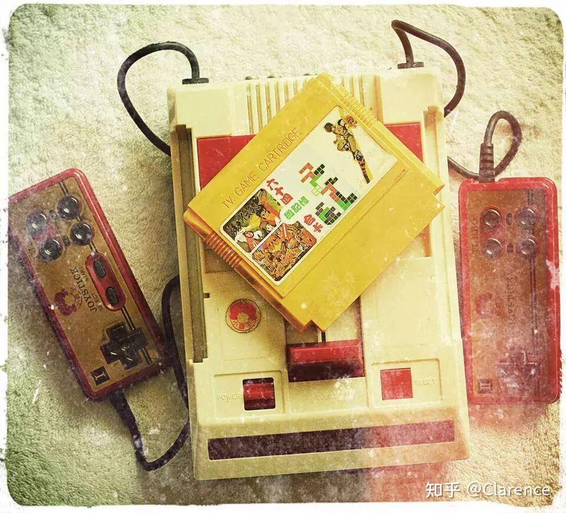
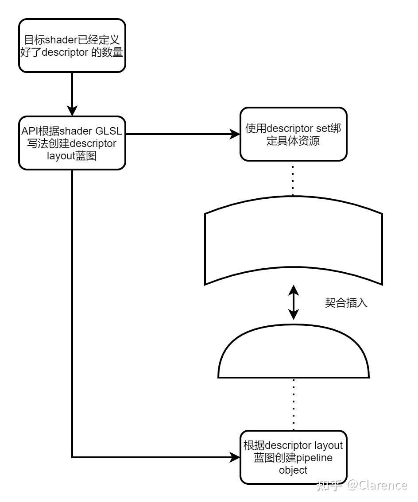

# Vulkan:实现资源插槽设计的天才创造 -- descriptor

## 前言

小时候，我玩过小霸王学习机，那时候每个游戏都会有一个游戏卡，把游戏卡插在小霸王学习机的插槽上，就可以玩一整个暑假。



这个是我在理解[vulkan](https://zhida.zhihu.com/search?content_id=234995549&content_type=Article&match_order=1&q=vulkan&zhida_source=entity)是如何管理资源(image or buffer)与 graphics/compute pipeline之间绑定机制的时候，第一个想起来的在成长过程中经历的类似机制。resource就如同游戏卡一样，当他被创建好了之后，他会有一个描述访问此resource的接口，也就是layout，这个layout将这个资源的蓝图进行描述，不牵扯到其具体的数据信息。这个layout蓝图，将会分配给小霸王学习机(pipeline object)，使得后期对资源进行绑定的时候，可以正确的将资源插入到对应的插槽中。

本文将会从vulkan API的角度来整理和归纳，阐述 Vulkan 使用[descriptor](https://zhida.zhihu.com/search?content_id=234995549&content_type=Article&match_order=1&q=descriptor&zhida_source=entity)相关的API 传入shader 中某个uniform或者其他的descriptor的值是如何完成的。

## 正文

假设vertex shader写法如下

```text
#version 450
layout(binding = 0) uniform UniformBufferObject {
    mat4 model;
    mat4 view;
    mat4 proj;
} ubo;

layout(location = 0) in vec2 inPosition;
layout(location = 1) in vec3 inColor;
layout(location = 2) in vec2 inTexCoord;

layout(location = 0) out vec3 fragColor;
layout(location = 1) out vec2 fragTexCoord;

void main() {
    gl_Position = ubo.proj * ubo.view * ubo.model * vec4(inPosition, 0.0, 1.0);
    fragColor = inColor;
    fragTexCoord = inTexCoord;
}
```

假设fragment shader写法如下

```text
#version 450
layout(location = 0) in vec2 fragTexCoord;
layout(location = 0) out vec4 outColor;
layout(binding = 1) uniform sampler2D texSampler;

void main() {
    outColor = texture(texSampler, fragTexCoord);
}
```

观察下，ps&vs shader有两类descriptor type。

1. 是vs的uniform UniformBufferObject；需要driver传入对应的uniform buffer数据，
2. 是ps的uniform sampler2D texSampler，需要driver传入Sampler需要sample哪个image，以及sample的采样模式信息。

### 创建沟通pipeline object与shader的descript layout(蓝图)

[shader](https://zhida.zhihu.com/search?content_id=234995549&content_type=Article&match_order=6&q=shader&zhida_source=entity) 显然是使用了GLSL来描述所使用的descriptor type有两类，也就是代码里面就包含了此信息。

Application这边需要显然的创建这个蓝图与我即将使用的shader相对应。

```text
VkDescriptorSetLayout descriptorSetLayout;
void createDescriptorSetLayout() {

    /*
     * there are many discriptor type ,uniform is one of the descriptor type
     * wehen wen create a descriptor set we should point out which descriptor type it is , just like buffer type
     * it can support create many descript use count.
     */
    VkDescriptorSetLayoutBinding uboLayoutBinding{};
    uboLayoutBinding.binding = 0;
    uboLayoutBinding.descriptorType = VK_DESCRIPTOR_TYPE_UNIFORM_BUFFER;
    uboLayoutBinding.descriptorCount = 1;
    /*
     * we also need to specify in which shader stages the descriptor is going to be referenced
     * in this case , only vertex shader will access uniform
     */
    uboLayoutBinding.stageFlags = VK_SHADER_STAGE_VERTEX_BIT;
    /*
     * the pImmutableSamplers filed is only relevant for image sampling related descriptors.
     */
    uboLayoutBinding.pImmutableSamplers = nullptr; // Optional


    /*now we add a new uniform descript layout for sampler*/
    VkDescriptorSetLayoutBinding samplerLayoutBinding{};
    samplerLayoutBinding.binding = 1;
    samplerLayoutBinding.descriptorCount = 1;
    samplerLayoutBinding.descriptorType = VK_DESCRIPTOR_TYPE_COMBINED_IMAGE_SAMPLER;//point out this descript type is sampler
    samplerLayoutBinding.pImmutableSamplers = nullptr;
    samplerLayoutBinding.stageFlags = VK_SHADER_STAGE_FRAGMENT_BIT;//used in ps

    /*
     * create a acutally descriptor Set layout
     * now we have two binding point
     */
    std::array<VkDescriptorSetLayoutBinding, 2> bindings = {uboLayoutBinding, samplerLayoutBinding};
    VkDescriptorSetLayoutCreateInfo layoutInfo{};
    layoutInfo.sType = VK_STRUCTURE_TYPE_DESCRIPTOR_SET_LAYOUT_CREATE_INFO;
    layoutInfo.bindingCount = 2;
    layoutInfo.pBindings = bindings.data();

    if (vkCreateDescriptorSetLayout(vulkanDevice->device, &layoutInfo, nullptr, &descriptorSetLayout) != VK_SUCCESS) {
        throw std::runtime_error("failed to create descriptor set layout!");
    }
}
```

上述过程，创建了一个VkDescriptorSetLayout descriptorSetLayout;实体，里面包含了与shader对应的descriptor信息，包含

1. binding = 0 的 VK_DESCRIPTOR_TYPE_UNIFORM_BUFFER 对象，只作用于vertex shader
2. binding = 1 的 VK_DESCRIPTOR_TYPE_COMBINED_IMAGE_SAMPLER对象，作用于fragment shader

将这两类descriptor type封装到各自的VkDescriptorSetLayoutBinding中最终汇总到VkDescriptorSetLayout中来。这样layout就配置成了和shader资源对应的，资源蓝图(**descripotor layout**)。其实从字面意思来看**descriptor** 本身就是[描述符](https://zhida.zhihu.com/search?content_id=234995549&content_type=Article&match_order=1&q=描述符&zhida_source=entity)的意思，descriptor layout意味着，记录描述符信息的排列方式。

### Descriptor set -- 记录对应资源蓝图的资源具体位置以及对资源进行汇总

descriptor layout记录了一种描述符的蓝图，但是他并没有指向任何有效的资源位置，这相当于只定义了数据的接口，但并没有指定数据本身是什么。在创建descriptor set的时候就会指定这个蓝图实际对应的数据是什么。descriptor set还做了一件重要的事情，那就是对不同的实际资源位置进行组合。好比一个游戏卡里面，有许多游戏，例如A，B，C，D游戏，我可以另外出一个新的游戏卡，里面只会包含了B，C两个游戏，我们没必要为了创建一个新的游戏卡，重新创建A，B，C，D四个游戏的游戏实体以及其对应的插槽(对应VkImage/vkBuffer 以及descript layout)。

```text
    std::vector<VkDescriptorSetLayout> layouts(MAX_FRAMES_IN_FLIGHT, descriptorSetLayout);
    VkDescriptorSetAllocateInfo allocInfo{};

    allocInfo.sType = VK_STRUCTURE_TYPE_DESCRIPTOR_SET_ALLOCATE_INFO;
    allocInfo.descriptorPool = descriptorPool;
    allocInfo.descriptorSetCount = static_cast<uint32_t>(MAX_FRAMES_IN_FLIGHT);
    allocInfo.pSetLayouts = layouts.data(); //layout has uniform format  information(descriptorSetLayout)

    //create descrpitsets array
    descriptorSets.resize(MAX_FRAMES_IN_FLIGHT);

    if (vkAllocateDescriptorSets(vulkanDevice->device, &allocInfo, descriptorSets.data()) != VK_SUCCESS) {
        throw std::runtime_error("failed to allocate descriptor sets!");
    }
```

descriptor Pool 是一个池子，我们知道我们需要多少个descriptor，因此可以按需定义这个池子的大小。然后放心的从Pool中创建一个descripotor set。

在创建descriptor set之前，我们就应该知道，这个set包含了哪个descriptor layout这里表现为allocInfo传入了layout。在上述代码完成之后，游戏卡(descriptor set)就已经创建好和layout(游戏插槽)对应的实体内容。

那么接下来，就是要去实现layout(游戏插槽)和实际游戏之间的联系了。

```text
    for (size_t i = 0; i < MAX_FRAMES_IN_FLIGHT; i++) {
        VkDescriptorBufferInfo bufferInfo{};
        bufferInfo.buffer = uniformBuffers[i];
        bufferInfo.offset = 0;
        bufferInfo.range = sizeof(UniformBufferObject);

        /*binding sampler and vkImage here*/
        VkDescriptorImageInfo imageInfo{};
        imageInfo.imageLayout = VK_IMAGE_LAYOUT_SHADER_READ_ONLY_OPTIMAL;
        imageInfo.imageView = textureImageView;
        imageInfo.sampler = textureSampler;

        //this struct link descript set we created before in this function and uniform buffer created before 
        std::array<VkWriteDescriptorSet, 2> descriptorWrites{};

        descriptorWrites[0].sType = VK_STRUCTURE_TYPE_WRITE_DESCRIPTOR_SET;
        descriptorWrites[0].dstSet = descriptorSets[i]; //get descriptor set object
        descriptorWrites[0].dstBinding = 0;//uniform buffer , now it is set as 0 in shader
        descriptorWrites[0].dstArrayElement = 0;//descriptor can be array so we specify 0
        descriptorWrites[0].descriptorType = VK_DESCRIPTOR_TYPE_UNIFORM_BUFFER;//descriptor type is uniform 
        descriptorWrites[0].descriptorCount = 1;//
        descriptorWrites[0].pBufferInfo = &bufferInfo;//link uniform buffer

        descriptorWrites[1].sType = VK_STRUCTURE_TYPE_WRITE_DESCRIPTOR_SET;
        descriptorWrites[1].dstSet = descriptorSets[i];
        descriptorWrites[1].dstBinding = 1; //binding code relate to shader code : layout(binding = 1) uniform sampler2D texSampler;
        descriptorWrites[1].dstArrayElement = 0;
        descriptorWrites[1].descriptorType = VK_DESCRIPTOR_TYPE_COMBINED_IMAGE_SAMPLER;//descriptor type is sampler 
        descriptorWrites[1].descriptorCount = 1;
        descriptorWrites[1].pImageInfo = &imageInfo;//link image info with vkImage and sampler

        //link descript set(include descript layout (uniform data format)) and uniform buffer
        vkUpdateDescriptorSets(vulkanDevice->device, static_cast<uint32_t>(descriptorWrites.size()), descriptorWrites.data(), 0, nullptr);
    }
```

在创建layout的时候，我们就已经定义了，我们需要一个VK_DESCRIPTOR_TYPE_UNIFORM_BUFFER和一个VK_DESCRIPTOR_TYPE_COMBINED_IMAGE_SAMPLER，在这里，我们将uniform 对应的vkBuffer数据类型传入 binding = 0的位置，把imageInfo传入到 binding = 1的位置。在这里指定了layout和实际资源的位置，最后通过vkUpdateDescriptorSets传入。

在这里，我把descript set比作游戏卡，layout比作小霸王学习机和游戏卡之间的插槽，vkBuffer和vkImage这样实际的资源比作游戏。那么接下来该小霸王学习机登场了pipeline object。

### 小霸王学习机 -- pipeline object

```text
VkPipeline graphicsPipeline;
VkPipelineLayout pipelineLayout;
void crateGraphicsPipeline() {
...
    /*pipeline layout related uniform related*/
 VkPipelineLayoutCreateInfo pipelineLayoutInfo{};
 pipelineLayoutInfo.sType = VK_STRUCTURE_TYPE_PIPELINE_LAYOUT_CREATE_INFO;
 pipelineLayoutInfo.setLayoutCount = 1; // number of descriptor layout(include uniform format info)
 pipelineLayoutInfo.pSetLayouts = &descriptorSetLayout; // descriptor set layout inster here, we do not use  push const now

 if (vkCreatePipelineLayout(vulkanDevice->device, &pipelineLayoutInfo, nullptr, &pipelineLayout) != VK_SUCCESS) {
 throw std::runtime_error("failed to create pipeline layout!");
    }
    /*uniform related configuration*/
 pipelineInfo.layout = pipelineLayout;
...
    //final create pipeline object
 if (vkCreateGraphicsPipelines(vulkanDevice->device, VK_NULL_HANDLE, 1, &pipelineInfo, nullptr, &graphicsPipeline) != VK_SUCCESS) {
 throw std::runtime_error("failed to create graphics pipeline!");
    }
}
```

这里在创建pipeline object的时候需要传入pipeline Layout，然而这个layout就是之前创建的descriptor layout。显然，因为我们后期希望游戏卡插入的时候，插槽能够完全插上，因此在创建pipeline object的时候会根据这个插槽(descriptor layout)来创建。

### 梳理descriptor layout / descriptor set /pipeline layout关系

1. descriptor layout：描述shader的descriptor type 情况，为后面API导入shader所需要的具体资源作保障。
2. descriptor set：描述layout对应的具体资源是什么，每个shader 的 binding绑定的内容是什么。
3. pipeline layout：其实就是descriptor layout，pipeline object会绑定shader stage这里需要做到shader和descripot layout能够契合。



### 小结

descriptor机制实际是在解决一个问题，那就是shader在运行的时候，对应的最终数据是什么。shader只会通过GLSL描述，我需要哪些数据，但是并不会告诉你我要的数据是什么，具体数据是API传入的。Vulkan提供的机制，就是很好的完成了这个[数据绑定](https://zhida.zhihu.com/search?content_id=234995549&content_type=Article&match_order=1&q=数据绑定&zhida_source=entity)的操作，在layout里面将shader需要哪些类型的数据进行较好的描述，然后在descriptor set里指定每个[layout](https://zhida.zhihu.com/search?content_id=234995549&content_type=Article&match_order=55&q=layout&zhida_source=entity)对应的实际数据是什么，之后通过draw之前bindDescriptor来实现目的。确实是非常天才的[机制设计](https://zhida.zhihu.com/search?content_id=234995549&content_type=Article&match_order=1&q=机制设计&zhida_source=entity)！