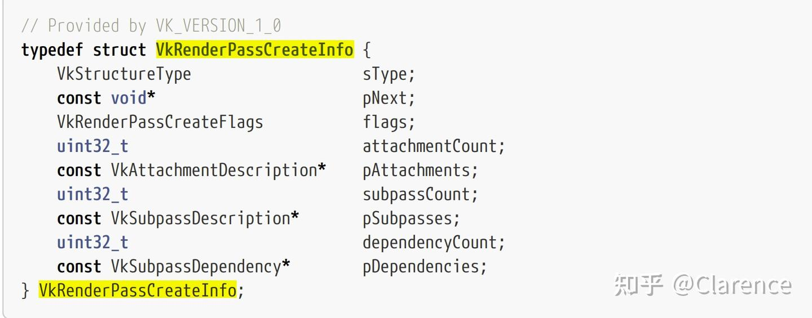
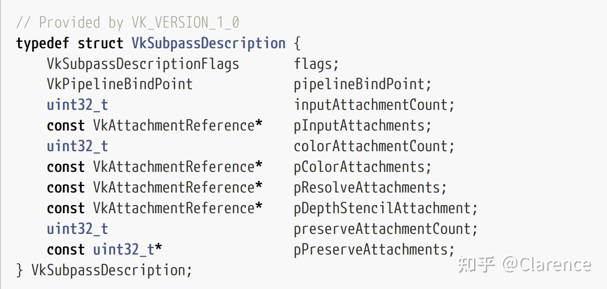
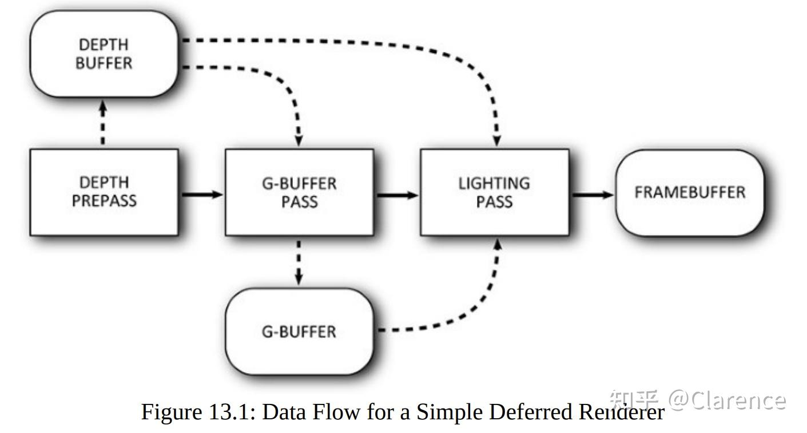

# Vulkan:实现多通道渲染的艺术 -- Renderpass

## 前言

在许多图形应用中，会在一次draw的时候同时启动多个[render pass](https://zhida.zhihu.com/search?content_id=235611790&content_type=Article&match_order=1&q=render+pass&zhida_source=entity)，这样做的目的大多数是在于提升效率，在一个draw中多个pass可以共同使用一些相同配置，避免重复的配置。或者，有一些[图形算法](https://zhida.zhihu.com/search?content_id=235611790&content_type=Article&match_order=1&q=图形算法&zhida_source=entity)，有必要将一些特定的场景按照不同的着色器算法进行着色渲染，把不同的渲染过程放在同一个draw的不同pass中，最终汇入到[framebuffer](https://zhida.zhihu.com/search?content_id=235611790&content_type=Article&match_order=1&q=framebuffer&zhida_source=entity)的多个attachment中保存起来。

Vulkan将这个多通道渲染(multiple passes)技术，收入囊中，作为一个核心标准。将多个通道渲染的规则汇总到一个Object中 ---- Graphics Pipelines，这也是为什么在创建Graphics piepline object的时候需要传入renderpass对象的原因之一。pipeline需要知道这次绘制过程，会有几个render pass会被启用。

在本章中，不同于以往的一些例子，包括Vulkan 官方的教程 [Introduction - Vulkan Tutorial (vulkan-tutorial.com)](https://vulkan-tutorial.com/)，他们为了出于简单的目的，常常只会使用单个通道进行渲染，这样可以简化对[renderpass](https://zhida.zhihu.com/search?content_id=235611790&content_type=Article&match_order=2&q=renderpass&zhida_source=entity)的配置，本文会进一步使用多通道的渲染技术，并且解释多通道渲染算法是如何实现在少数renderpass object中的。

一个renderpass可以包含多个subpasses，每个subpass都会为了最终的绘制，渲染相应的场景。在多个[subpass](https://zhida.zhihu.com/search?content_id=235611790&content_type=Article&match_order=3&q=subpass&zhida_source=entity)运行的时候，他们之间可以产生依赖关系，实现控制多个subpass的执行先后顺序，因为有可能会出现subpassA去使用subpassB渲染结果的情况。

## 正文

看下创建一个renderpass对象需要哪些信息

1. renderpass最终的结果存放在framebuffer的attachment中，attachment的数量是多少 -- attachement count
2. 当renderpass开始/结束的时候(beginRenderpass)，如何处理这些attachment？load/store的操作？举个例子，开始renderpass的时候，attachment原先的img数据怎么操作，是clear还是读过来？ -- pAttachment
3. 上文说到一个renderpass包含多个subpass，subpass的数量 -- subpassCount
4. subpass的具体创建信息 ，见下文分析 --pSubpasses
5. dependencyCount & pDependencies ，多个subpass sync相关的参数

再看看一个subpass需要哪些信息才能创建

1. pipelineBindPoint ，此subpass支持哪个类型的piepline type
2. inputAttachmentCount ，此subpass输入的attchment数量
3. pInputAttachments，这次subpass需要输入的attachement reference
4. color attachment and it's count
5. ...

重点需要琢磨的是pInputAttachment，因为一般的单个renderpass是用不到此变量的。

每个subpass都可以有多个input attachment，这些input attachment可以是你ps shader输出的任意一个attachment。Input attachment以及normal texture bound into a descriptor set 区别在于，你读取的不是上一次draw的结果，而是这一次draw不同render target的结果。

一次subpass将会写一个或多个output attachments ，这些attachment也许是color image或者ds image，subpass可以通过检查这些attachment的依赖关系，哪些是用来写的，哪些是可以用作别的subpass的读的，来在renderpass中创建一个数据流。

为了去证明这个，我们将会简单的创建一个[三通道](https://zhida.zhihu.com/search?content_id=235611790&content_type=Article&match_order=1&q=三通道&zhida_source=entity)renderpass对象，用来实现[延迟渲染](https://zhida.zhihu.com/search?content_id=235611790&content_type=Article&match_order=1&q=延迟渲染&zhida_source=entity)(deferred shading)

第一个pass，我们只会将渲染结果放到深度附件中，也就是从摄像机看过去，看到的深度图像，常常被称作[depth prepass](https://zhida.zhihu.com/search?content_id=235611790&content_type=Article&match_order=1&q=depth+prepass&zhida_source=entity)。

第二个pass，我们将会渲染所有几何体，渲染并获得这些几何体每个可见点的normal,diffuse color ,specular power以及其他信息。

在第二个pass的阶段，我们只会看[深度测试](https://zhida.zhihu.com/search?content_id=235611790&content_type=Article&match_order=1&q=深度测试&zhida_source=entity)通过的点的normal,diffuse color等信息，这样的话就不会去记录其他深度测试失败的点的信息，增加效率，这也是延迟着色的主要优势。[延迟着色法 - LearnOpenGL CN (learnopengl-cn.github.io)](https://learnopengl-cn.github.io/05 Advanced Lighting/08 Deferred Shading/)

在第三个pass中，我们执行了所有着色计算，我们读取了[depth buffer](https://zhida.zhihu.com/search?content_id=235611790&content_type=Article&match_order=1&q=depth+buffer&zhida_source=entity)为了去还原模型中每个点在摄像机空间的 位置（pass1的结果），我们读取normal等G-buffer信息，用来计算阴影算法(pass2)，我们pass3不需要做任何模型的渲染，只需要渲染一个三角形，剪裁出其中的一部分覆盖整个Viewport就行了。

上图是一个简单的例子，pass1没有任何input attachment，只是输出深度结果到depth buffer中，pass2，使用了depth buffer用作深度测试，并且将结果输出到G-BUFFER中，pass3将G-BUFFER用作input attachment并且使用了depth buffer用作深度测试，完成最终的[光照算法](https://zhida.zhihu.com/search?content_id=235611790&content_type=Article&match_order=1&q=光照算法&zhida_source=entity)。

参考

vulkan-programming-guide-the-official-guide-to-learning-vulkan