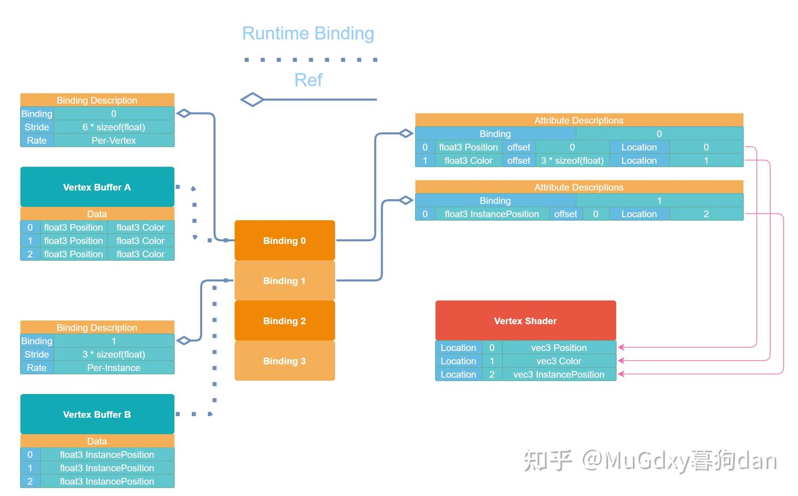

# 一张图形象理解Vulkan Vertex Input Description

在理解Vertex Input Description的时候会遇到以下三个对象：

- Binding Description
- Attribute Description
- Layout in Shader

这三者之间的关系，可以用下图来形象描述（点开大图比较清晰）。

其中，左侧 Ref 箭头表示，Binding Point根据Binding Description来解释绑定在其上的数据（Vertex Buffer）。

Runtime Binding 箭头表示，Vertex Buffer并不是预定义的，而是在运行期绑定到Binding Point上的，实际上就是由vkCmdBindVertexBuffers完成的。

右侧 Ref 箭头表示，Binding Point根据Attribute Description来解释如何填充Shader中所需的数据（Location）。

在本例中，Vertex Buffer A，绑定在Binding0上，保存了3个顶点信息，编号为0,1,2，每个[顶点](https://zhida.zhihu.com/search?content_id=188165274&content_type=Article&match_order=2&q=顶点&zhida_source=entity)信息包含：

- Position (size= 3*float)
- Color (size = 3*float)

Vertex Buffer B，绑定在Binding1上，保存了3个Instance信息，编号为0,1,2，每个Instance信息包含：

- Position (size=3*float)

Vertex Shader需要：

- 从location=0处取得Vertex Position
- 从location=1处取得Vertex Color
- 从location=2处取得Instance Position

Binding Point对Vertex Buffer的数据组织是无知的，它只关心数据块的大小和以什么样的速度（每Vertex/每Instance）更换对应的数据块，这些东西由Binding Description来解释。

Vertex Shader 对Vertex Buffer Binding是无知的，它所关心的只有Location。而Attribute Description就负责将一个Stride大小的数据块解释为Vertex Shader所关心的Location。

可以说，Binding Description对Binding Point负责，Attribute Description对Vertex Shader负责。