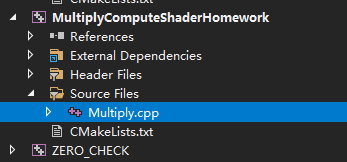

# Hello Vulkan Compute Shader

本文是一篇Step by Step，Hand by Hand Tutorial，希望与[Vulkan Tutorial](https://link.zhihu.com/?target=https%3A//vulkan-tutorial.com/) 保持风格统一。

我们将用大约1小时的时间来完成一个最简单的Compute Shader，其功能为将Buffer中的float类型数据乘以2，并写回到Buffer中。

涉及的内容包括：

- 建立Compute Pipeline
- 在Host端将待处理数据写入Buffer Memory
- 利用Compute Pipeline完成计算工作
- 在Host端从Buffer Memory读回处理后的数据
- 将数据打印在控制台上

本篇中，我们将不涉及`Fence`/`Semaphore`/`Barrier`/`Event`等[同步原语](https://zhida.zhihu.com/search?content_id=190373268&content_type=Article&match_order=1&q=同步原语&zhida_source=entity)，只使用`vkQueueWaitIdle`来实现同步。

参考资料在文末放出。

## **Start Point**

从github clone（记得star一下哦）

[https://github.com/MuGdxy/hello_compute_shadergithub.com/MuGdxy/hello_compute_shader](https://link.zhihu.com/?target=https%3A//github.com/MuGdxy/hello_compute_shader)

```text
git clone https://github.com/MuGdxy/hello_compute_shader.git
```

如果github连接不稳定可以从coding clone:

```text
 git clone https://e.coding.net/revdolgaming/musys/hello_compute_shader.git
```

git clone 后，使用cmake构建，构建完成后的打开`MultiplyComputeShaderHomework`工程。




打开`MultiplyComputeShaderHomework`

`MultiplyComputeShaderHomework-Multiply.cpp`是为大家准备好的Start Point代码。`MultiplyComputeShader-Multiply.cpp`为完成后的代码。

本文将略过：

- Vulkan Instance的创建
- Validation Layer/Debug Messenger设置
- Vulkan Physical Device的选取（实际上所有支持vulkan的显卡都支持compute queue）
- Logical Device 的创建
- Compute Queue的创建

此些操作，都已经在Multiply.cpp中实现。

首先运行工程。我们能够看到类似如下的输出，各位的GPU可能不同，但最终我们会选择一个支持Compute/Transfer Queue的设备。

```bash
 find validation layer:
         VK_LAYER_KHRONOS_validation
 available extensions:
         VK_KHR_device_group_creation<Version=1>
         VK_KHR_external_fence_capabilities<Version=1>
         VK_KHR_external_memory_capabilities<Version=1>
         VK_KHR_external_semaphore_capabilities<Version=1>
         VK_KHR_get_physical_device_properties2<Version=1>
         VK_KHR_get_surface_capabilities2<Version=1>
         VK_KHR_surface<Version=25>
         VK_KHR_win32_surface<Version=6>
         VK_EXT_debug_report<Version=9>
         VK_EXT_swapchain_colorspace<Version=3>
         VK_NV_external_memory_capabilities<Version=1>
         VK_EXT_debug_utils<Version=2>
 physical devices:
         [0] GeForce RTX 2070 with Max-Q Design
 queue families:
         family index=0
         Queue Count=16
         Flags:[Graphics][Compute][Transfer][Sparse Binding]
         family index=1
         Queue Count=1
         Flags:[Transfer]
         family index=2
         Queue Count=8
         Flags:[Compute]
 Select Physical Device:GeForce RTX 2070 with Max-Q Design
 Select Queue Index:0
 input data:
 1111111111111111111111111111111111111111111111111111111111111111
 ...(a lot of 1)
 output data:
 0000000000000000000000000000000000000000000000000000000000000000
 ...(a lot of 0)
```

在开始之前，我们先来看一下我们要使用的compute shader是什么样的。在"hello_compute_shader\shader"中，打开"multiply.comp"

```glsl
 #version 450
 //compute shader的工作组（WorkGroup）被定义为xyz三个维度的数组。
 //local_size_x为当前工作组的第一个维度的大小
 //相应的还有local_size_y local_size_z可以指定，这里不进行指定则默认为
 //local_size_y = 1, local_size_z = 1
 layout (local_size_x = 256) in;
 
 //我们用于读取和写入的Buffer
 layout(set = 0, binding = 0) buffer StorageBuffer
 {
    float data[];
 } block;
 
 
 void main()
 {
     //获取全局的ID，可以用来定位操作的数据，
     //当然也可以通过gl_LocalInvocationID来获取当前工作组内的ID
     uint gID = gl_GlobalInvocationID.x;
     //利用全局ID对buffer进行写入
     //可以这么做的原因是：
     //我们将定义一块1024*sizeof(float)大小的buffer
     //并把工作拆分为4组，每组负责256个float（与local_size_x对应）
     //由于此shader一共会被调用1024次（4 x 256）
     //他的globalID将会从0 -> 1023正好对应1024个float
     block.data[gID] *= 2.0f; 
 }
```

不难发现，这个shader仅仅只是读出StorageBuffer中的一个float数据将其乘以2再写回去。

## **Overview**

我们需要完成`/*Start Point*/`以下的函数，分别对应：

| 函数                        | 操作                                                         |
| --------------------------- | ------------------------------------------------------------ |
| createStorageBuffer()       | 创建Storage Buffer以及他所依附的Device Memory                |
| writeMemoryFromHost()       | Memory Mapping 与数据写入                                    |
| createDescriptorSetLayout() | 创建DescriptorSetLayout用于描述Storage Buffer                |
| createComputePipeline()     | 创建Compute Pipeline                                         |
| createDescriptorPool()      | 创建DescriptorPool                                           |
| createDescriptorSet()       | 从Pool中Allocate相应的DescritorSet, 届时供compute shader使用 |
| createCommandPool()         | 创建Command Pool                                             |
| execute()                   | 录制Command Buffer，Submit，等待Compute Queue完成任务，输出数据到控制台 |
| cleanUp()                   | 释放资源                                                     |

```cpp
 void Run()
 {
         createInstance();
         pickPhyscialDevice();
         createLogicalDevice();
     
         /*Start Point*/
         createStorageBuffer();
         writeMemoryFromHost();
         createDescriptorSetLayout();
         createComputePipeline();
 
         createDescriptorPool();
         createDescriptorSet();
         createCommandPool();
 
         execute();
 
         cleanUp();
  }
```

## **Create Storage Buffer**

### **Create Buffer**

```cpp
 VkBuffer storageBuffer;
 VkDeviceMemory storageBufferMemory;
 void createStorageBuffer()
 {
     VkBufferCreateInfo createInfo = MuVk::bufferCreateInfo();
     createInfo.size = inputDataSize();
     createInfo.usage = VK_BUFFER_USAGE_STORAGE_BUFFER_BIT;
     createInfo.sharingMode = VK_SHARING_MODE_EXCLUSIVE;
     createInfo.queueFamilyIndexCount = 0;
     createInfo.pQueueFamilyIndices = nullptr;
     if (vkCreateBuffer(device, &createInfo, nullptr, &storageBuffer) != VK_SUCCESS)
         throw std::runtime_error("failed to create storage buffer!");
     ...
 }
```

其中`MuVk::bufferCreateInfo()`只做了一件事情，那就是填写一下``VkBufferCreateInfo.sType`并把结构体返回，不隐藏其他任何的细节，之后出现的类似的函数也只做这一件事情。

Buffer的大小为inputData的大小。

`.usage`需要设置为`VK_BUFFER_USAGE_STORAGE_BUFFER_BIT`用于compute shader写入。

`.sharingMode`由于我们只有一个Queue，所以为Queue独占即可。

`.queueFamilyIndexCount`，`.pQueueFamilyIndices`在`VK_SHARING_MODE_EXCLUSIVE`模式下没有意义，只有当模式为`VK_SHARING_MODE_CONCURRENT`时，他们才用于描述未来会访问这个Buffer的不同的Queue Family。

### **Allocate Memory**

```cpp
 void createStorageBuffer()
 {
     ...
     if (vkCreateBuffer(device, &createInfo, nullptr, &storageBuffer) != VK_SUCCESS)
         throw std::runtime_error("failed to create storage buffer!");
 
     VkMemoryRequirements requirements = MuVk::Query::memoryRequirements(device, storageBuffer);
     std::cout << requirements << std::endl;
 
     VkMemoryAllocateInfo allocInfo = MuVk::memoryAllocateInfo();
     allocInfo.allocationSize = requirements.size;
     allocInfo.memoryTypeIndex = findMemoryType(requirements,
         VK_MEMORY_PROPERTY_HOST_VISIBLE_BIT | VK_MEMORY_PROPERTY_HOST_COHERENT_BIT);
     if (vkAllocateMemory(device, &allocInfo, nullptr, &storageBufferMemory) != VK_SUCCESS)
         throw std::runtime_error("failed to allocate storage buffer memory");
 
     vkBindBufferMemory(device, storageBuffer, storageBufferMemory, 0);
 }
```

`MuVk::Query::memoryRequirements(device, storageBuffer)`与`vkGetBufferMemoryRequirements(device, buffer, &memoryRequirements)`完全等价，他的存在仅仅为了与array类型的查询保持一致性，例如下面的`physicalDevices()`。以后出现的Query类函数，均为同一作用。

```cpp
 struct Query
 {
     static VkMemoryRequirements memoryRequirements(VkDevice device, VkBuffer buffer)
     {
         VkMemoryRequirements memoryRequirements;
         vkGetBufferMemoryRequirements(device, buffer, &memoryRequirements);
         return memoryRequirements;
     }
     ...
     static std::vector<VkPhysicalDevice> physicalDevices(VkInstance instance)
     {
         uint32_t deviceCount;
         vkEnumeratePhysicalDevices(instance, &deviceCount, nullptr);
         std::vector<VkPhysicalDevice> devices(deviceCount);
         vkEnumeratePhysicalDevices(instance, &deviceCount, devices.data());
         return devices;
     }
 }
 
```

`.allocationSize`填入Buffer Size。

`.memoryTypeIndex`则需要使用`findMemoryType()`函数来寻找合适的Index，`findMemoryType()`与Vulkan Tutorial/VkSpec保持一致。由于我们需要在Host中写入并读出，所以我们需要使得MemoryProperties满足Host可见/Host一致。

当然不要忘记了CleanUp

```cpp
 void cleanUp()
 {       
     vkDestroyBuffer(device, storageBuffer, nullptr);
     vkFreeMemory(device, storageBufferMemory, nullptr);
 
     MuVk::Proxy::DestoryDebugUtilsMessengerEXT(instance, debugMessenger, nullptr);
     vkDestroyDevice(device, nullptr);
     vkDestroyInstance(instance, nullptr);
 }
```


## **Write Memory from Host**

写入工作就非常的简单了。

```cpp
 void writeMemoryFromHost()
 {
     void* data;
     if (vkMapMemory(device, storageBufferMemory, 0, inputDataSize(), 0, &data) != VK_SUCCESS)
         throw std::runtime_error("failed to map memory");
     memcpy(data, inputData.data(), inputDataSize());
     vkUnmapMemory(device, storageBufferMemory);
 }
```

通过MapMemory来获取映射起始地址data，将inputData（1024个1.0f）写入，最后Unmap。


## **Create Descriptor Set Layout**

DescriptorSetLayout描述的是一个DescriptorSet的布局，包括：

- 有哪些binding(0/1/2/3/...)？
- binding上都绑了什么样的内容(`.descriptorType`)？
- 是不是array？`.descriptorCount`
- 都属于什么Shader阶段`.stageFlags`？

对DescriptorSetLayout缺乏直观认识的话，可以移步

[一张图形象理解Vulkan DescriptorSet134 赞同 · 15 评论文章](https://zhuanlan.zhihu.com/p/450434645)

```cpp
 void createDescriptorSetLayout()
 {
     VkDescriptorSetLayoutBinding binding;
     binding.binding = 0;
     binding.descriptorCount = 1;
     binding.descriptorType = VK_DESCRIPTOR_TYPE_STORAGE_BUFFER;
     binding.stageFlags = VK_SHADER_STAGE_COMPUTE_BIT;
 
     VkDescriptorSetLayoutCreateInfo createInfo = MuVk::descriptorSetLayoutCreateInfo();
     createInfo.bindingCount = 1;
     createInfo.pBindings = &binding;
 
     if (vkCreateDescriptorSetLayout(
         device, &createInfo, nullptr, &descriptorSetLayout) != VK_SUCCESS)
         throw std::runtime_error("failed to create descriptorSetLayout");
 }
```

由于我们只有一个storage buffer，所以我们只会占用一个set并且只占用这个set中的binding point 0，而且他的类型为VK_DESCRIPTOR_TYPE_STORAGE_BUFFER，并且只在Compute Shader阶段有效。

这里问个问题，DescriptorSetLayout会被谁引用？

如果你认真观察了[一张图形象理解Vulkan DescriptorSet](https://zhuanlan.zhihu.com/p/450434645)中的图片，你一定可以发现，我们在从 Descriptor Pool 中 Allocate Descriptor Set的时候需要引用DescriptorSetLayout，来告诉vulkan如何组装一个Descriptor Set。

除此之外，实际上Pipeline Layout也引用了DescriptorSetLayout，这个原因也很简单，创建Pipeline时候最重要的就是shaderModule，shader是那些真正使用（消耗）DescriptorSet的对象。

```glsl
 layout(set = 0, binding = 0) buffer StorageBuffer
 {
    float data[];
 } block;
```

pipeline需要保证set/binding布局的正确性，否则与之固连的shader会获得错误的数据。


不要忘记CleanUp

```cpp
 void cleanUp()
 {
     vkDestroyDescriptorSetLayout(device, descriptorSetLayout, nullptr);
     ...
 }
```


接下来我们就要开始创建Compute Pipeline了。

## **Create Compute Pipeline**

```cpp
 VkPipelineLayout pipelineLayout;
 VkPipeline computePipeline;
 void createComputePipeline()
 {
     auto computeShaderCode = MuVk::readFile(MU_SHADER_PATH "multiply.spv");
     auto computeShaderModule = createShaderModule(computeShaderCode);
     VkPipelineShaderStageCreateInfo shaderStageCreateInfo = MuVk::pipelineShaderStageCreateInfo();
     shaderStageCreateInfo.module = computeShaderModule;
     shaderStageCreateInfo.stage = VK_SHADER_STAGE_COMPUTE_BIT;
     shaderStageCreateInfo.pName = "main";
     ...
 }
```

首先和，Vulkan Tutorial中一样，读取Shader并创建ShaderModule。`MU_SHADER_PATH`为预定义宏，便于定位到"hello_compute_shader/shader/"

所有的参数和赋值都不言而喻。

接下来，来创建pipeline layout。

```cpp
 void createComputePipeline()
 {
     ...
     VkPipelineLayoutCreateInfo layoutCreateInfo = MuVk::pipelineLayoutCreateInfo();
     layoutCreateInfo.setLayoutCount = 1;
     layoutCreateInfo.pSetLayouts = &descriptorSetLayout;
     layoutCreateInfo.pushConstantRangeCount = 0;
     layoutCreateInfo.pPushConstantRanges = nullptr;
     if (vkCreatePipelineLayout(device, &layoutCreateInfo, nullptr, &pipelineLayout)
         != VK_SUCCESS)
         throw std::runtime_error("failed to create pipeline layout!");
 }
```

layout again！

之前我们碰到过的layout叫做 Descriptor Set Layout，用于描述Set内部的布局，而pipeline layout实际上描述的是：

- 一个pipeline有多少个set(`.setLayoutCount`)？
- set里都是什么(`.pSetLayouts`)？（很巧的是，set里都是什么这个问题我们之前已经回答过了，set都是Descriptor Set Layout描述的东西。）
- push constant（我们暂时忽略，它是用来向pipeline中推送常量的，也就是对应opengl中的uniform block(注意不是Uniform Buffer Object)。


现在可以来创建Compute Pipeline了。

```cpp
 void createComputePipeline()
 {
     ...
     VkComputePipelineCreateInfo createInfo = MuVk::computePipelineCreateInfo();
     createInfo.basePipelineHandle = VK_NULL_HANDLE;
     createInfo.basePipelineIndex = -1;
     createInfo.stage = shaderStageCreateInfo;
     createInfo.layout = pipelineLayout;
 
     if (vkCreateComputePipelines(device, nullptr, 1, &createInfo, nullptr, &computePipeline)
         != VK_SUCCESS)
         throw std::runtime_error("failed to create compute pipeline");
     vkDestroyShaderModule(device, computeShaderModule, nullptr);
 }
```

`.basePipelineHandle`由于我们没有什么可以继承的basePipeline，直接填写`VK_NULL_HANDLE`。

`.basePipelineIndex`根据VkSpec的要求，我们填入-1。

（虽然以上两个不填也没什么关系）

不要忘记`vkDestroyShaderModule(device, computeShaderModule, nullptr)`，当Pipeline创建完成后，shader被“固连”进了Pipeline，所谓的Module也不再被需要了。

又是CleanUp

```cpp
 void cleanUp()
 {
     vkDestroyPipeline(device, computePipeline, nullptr);
     vkDestroyPipelineLayout(device, pipelineLayout, nullptr);
     ...
 }
```

如果忘记Destroy了，[validation layer](https://zhida.zhihu.com/search?content_id=190373268&content_type=Article&match_order=2&q=validation+layer&zhida_source=entity)会直接报出错误，通过报错来进行修改也是个很好的锻炼。

## **Create Descriptor Set**

### **Create Descriptor Pool**

```cpp
 VkDescriptorPool descriptorPool;
 void createDescriptorPool()
 {
     VkDescriptorPoolSize poolSize;
     poolSize.descriptorCount = 1;
     poolSize.type = VK_DESCRIPTOR_TYPE_STORAGE_BUFFER;
 
     VkDescriptorPoolCreateInfo createInfo = MuVk::descriptorPoolCreateInfo();
     createInfo.poolSizeCount = 1;
     createInfo.pPoolSizes = &poolSize;
     createInfo.maxSets = 1;
 
     if (vkCreateDescriptorPool(device, &createInfo, nullptr, &descriptorPool)
         != VK_SUCCESS)
         throw std::runtime_error("failed to create descriptor pool!");
 }
```

Descriptor Pool中可以有多种多样的Descriptor，他们根据类型(`.type`)和数量(`.descriptorCount`)来为单位(`VkDescriptorPoolSize`)来创建。

比如，我们需要 n 个 DESCRIPTOR_TYPE_STORAGE_BUFFER 与 m个 DESCRIPTOR_TYPE_UNIFORM_BUFFER

那么Pool就如下所示：

{D1storage,D2storage,...,Dnstorage}{D1uniform,D2uniform,...,Dmuniform}

在这里我们只需要1个 DESCRIPTOR_TYPE_STORAGE_BUFFER 。

也就是：

{D1storage}

除了指定Descriptor，我们需要规定能从Pool中申请的Set的数量（很容易想到，如果Set过多，Descriptor就会不够用）

### **Create Descriptor Set**

创建Descriptor Set包含两步：

- Allocate Descriptor Set
- Write Descriptor Set

首先我们需要从Pool中申请一个Set，这个Set只包含一个Descriptor。

```cpp
 VkDescriptorSet descriptorSet;
 void createDescriptorSet()
 {
     VkDescriptorSetAllocateInfo allocInfo = MuVk::descriptorSetAllocateInfo();
     allocInfo.descriptorPool = descriptorPool;
     allocInfo.descriptorSetCount = 1;
     allocInfo.pSetLayouts = &descriptorSetLayout;
 
     if (vkAllocateDescriptorSets(device, &allocInfo, &descriptorSet)
         != VK_SUCCESS)
         throw std::runtime_error("failed to create descriptor set!");
     ...
 }
```

我们利用`descriptorSetLayout`来指导如何组装一个Set。当Vulkan拿到这个Layout的时候，他就能够到Pool中提取出一个Storage Buffer Descriptor，组装成DescriptorSet返回给我们。


然后我们来写入这个Descriptor。

```cpp
 void createDescriptorSet()
 {
     ...
     VkDescriptorBufferInfo bufferInfo;
     bufferInfo.buffer = storageBuffer;
     bufferInfo.offset = 0;
     bufferInfo.range = inputDataSize();
     
     VkWriteDescriptorSet write = MuVk::writeDescriptorSet();
     write.descriptorCount = 1;
     write.descriptorType = VK_DESCRIPTOR_TYPE_STORAGE_BUFFER;
     write.dstBinding = 0;
     write.dstArrayElement = 0;
     write.dstSet = descriptorSet;
     write.pBufferInfo = &bufferInfo;
     vkUpdateDescriptorSets(device, 1, &write, 0, nullptr);
 }
```

首先，Descriptor描述的对象是一个storage buffer(`.buffer = storageBuffer`)，我们希望这个storage buffer能在shader中从头到尾被读到（而不是只有一个部分）所以我们把`.offset`设为0，`.range`设为整个Buffer的大小。

由于Set中可能有多个binding，可能存在array，所以我们需要指定从自`.dstbinding`开始的array的第`.dstArrayElement`元素开始写入`.descriptorCount`个Descriptor。(the writing starts from the `.dstArrayElement`th element of the array whose 0th element locates at `.dstbinding`.)

在本篇中，非常简单，我们只有一个Descriptor，并且他就是binding point = 0，如果把他看做一个array，我们要写入的就是他的[0号元素](https://zhida.zhihu.com/search?content_id=190373268&content_type=Article&match_order=1&q=0号元素&zhida_source=entity)。

如果你对写入的位置不是还不是非常清楚的话，可以继续回看[一张图形象理解Vulkan DescriptorSet](https://zhuanlan.zhihu.com/p/450434645)。


CleanUp,

```cpp
 void cleanUp()
 {
     vkDestroyDescriptorPool(device, descriptorPool, nullptr);
     ...
 }
```

## **Create Command Pool**

```cpp
 VkCommandPool commandPool;
 void createCommandPool()
 {
     VkCommandPoolCreateInfo createInfo = MuVk::commandPoolCreateInfo();
     createInfo.queueFamilyIndex = queueFamilyIndex.value();
     if (vkCreateCommandPool(device, &createInfo, nullptr, &commandPool)
         != VK_SUCCESS)
         throw std::runtime_error("failed to create command pool!");
 }
```

非常直接，只是需要指定从那个QueueFamily罢了。


CleanUp,

```cpp
 void cleanUp()
 {       
     vkDestroyCommandPool(device, commandPool, nullptr);
     ...
 }
```

## **Execute**

总算到了真正执行的时候，写vulkan总是有一种憋屈的感觉，想完成目标之前总是要埋没在一堆细节中。

好在我们马上就要成功了。

这是两端写好了控制台输出的execute函数体，现在我们要在这之间完成：

- allocate command buffer
- record command buffer
- submit
- wait for queue idle
- read data back

```cpp
 VkCommandBuffer commandBuffer;
 void execute()
 {
     std::cout << "input data:\n";
     for (size_t i = 0; i < inputData.size(); ++i)
     {
         if (i % 64 == 0 && i != 0) std::cout << '\n';
         std::cout << inputData[i];
     }
     ...
     for (size_t i = 0; i < outputData.size(); ++i)
     {
         if (i % 64 == 0 && i != 0) std::cout << '\n';
         std::cout << outputData[i];
     }
 }
```


首先从Command Pool中申请一个Command Buffer。

```cpp
 void execute()
 {
     ...
 
     VkCommandBufferAllocateInfo allocInfo = MuVk::commandBufferAllocateInfo();
     allocInfo.commandBufferCount = 1;
     allocInfo.commandPool = commandPool;
     allocInfo.level = VK_COMMAND_BUFFER_LEVEL_PRIMARY;
     if (vkAllocateCommandBuffers(device, &allocInfo, &commandBuffer)
         != VK_SUCCESS)
         throw std::runtime_error("failed to create command buffer!");
 }
```

`.level`我们填入VK_COMMAND_BUFFER_LEVEL_PRIMARY，实际上只有两个选项，另一个为VK_COMMAND_BUFFER_LEVEL_SECONDARY, 后者不能直接Submit，需要通过PRIMARY-command buffer进行调用。

> A secondary command buffer **must** not be directly submitted to a queue. Instead, secondary command buffers are recorded to execute as part of a primary command buffer with the command: vkCmdExecuteCommands()


接下来开始Command Buffer的录制。

```cpp
 void execute()
 {
     ...
     VkCommandBufferBeginInfo beginInfo = MuVk::commandBufferBeginInfo();
     vkBeginCommandBuffer(commandBuffer, &beginInfo);
     
     vkCmdBindPipeline(commandBuffer, VK_PIPELINE_BIND_POINT_COMPUTE, computePipeline);
     vkCmdBindDescriptorSets(commandBuffer, VK_PIPELINE_BIND_POINT_COMPUTE, pipelineLayout,
                             0, 1, &descriptorSet, 0, nullptr);
     vkCmdDispatch(commandBuffer, 
                   static_cast<uint32_t>(inputData.size() / computeShaderProcessUnit()), //x
                   1, //y
                   1  //z
                  );
     vkEndCommandBuffer(commandBuffer);
     ...
 }
```

第一步绑定Compute Pipeline，`vkCmdBindPipeline`的第二个实参`pipelineBindPoint`需要填入VK_PIPELINE_BIND_POINT_COMPUTE，很好理解。

对于`vkCmdBindDescriptorSets`:

```cpp
 VKAPI_ATTR void VKAPI_CALL vkCmdBindDescriptorSets(
     VkCommandBuffer                             commandBuffer,
     VkPipelineBindPoint                         pipelineBindPoint,
     VkPipelineLayout                            layout,
     uint32_t                                    firstSet,
     uint32_t                                    descriptorSetCount,
     const VkDescriptorSet*                      pDescriptorSets,
     uint32_t                                    dynamicOffsetCount,
     const uint32_t*                             pDynamicOffsets);
```

`layout`，我们填入pipeline layout。pipeline layout中包含了所有的layout描述，可以说他是一棵自顶向下的树，包含了所有的信息，从set个数/位置到每个set中的binding。我们的descriptor set对pipeline layout负责，即便换了pipeline，只要他符合这个pipeline layout，我们的descriptor set就是有效的。

`firstSet`，填入0，因为在shader中：

```glsl
 layout(set = 0, binding = 0) buffer StorageBuffer{...}
```

`descriptorSetCount`自然填1，因为我们只有一个Set。

`pDescriptorSets`填入对应的descriptor set handle。

最后两个参数，我们并不使用任何的`dynamicOffset`，所以按照VkSpec填入0和nullptr。

对于 `vkCmdDispatch`:

```cpp
 VKAPI_ATTR void VKAPI_CALL vkCmdDispatch(
     VkCommandBuffer                             commandBuffer,
     uint32_t                                    groupCountX,
     uint32_t                                    groupCountY,
     uint32_t                                    groupCountZ);
```

特别要提的是，传入的不是每个工作组的大小，而是每个维度上有多少个工作组，我们的总工作量是1024个float，每个工作组负责256个float，由于我们只使用一维，所以`groupCountY`和`groupCountZ`都为1。x轴上，1024/256=4，共有4个工作组，当然这里为了防止出现magic number，用相应的变量代替了，他们分别对应了工作总量和工作组大小。


接下来，只要等待GPU完成工作，便可读回数据了。

```cpp
 void execute()
 {
     ...
     //wait the calculation to finish
     if (vkQueueWaitIdle(queue) != VK_SUCCESS)
         throw std::runtime_error("failed to wait queue idle!");
     
     void* data;
     vkMapMemory(device, storageBufferMemory, 0, inputDataSize(), 0, &data);
     memcpy(outputData.data(), data, inputDataSize());
     vkUnmapMemory(device, storageBufferMemory);
     
     std::cout << "output data:\n";
     for (size_t i = 0; i < outputData.size(); ++i)
     {
         if (i % 64 == 0 && i != 0) std::cout << '\n';
         std::cout << outputData[i];
     }
 }
```

等待Queue Idle之后，进行Memory Mapping。

和之前写入数据类似，获取Memory开始地址data，随后利用memcpy将从data位置开始复制数据回outputData。


运行。

```bash
 input data:
 1111111111111111111111111111111111111111111111111111111111111111
 ...(a lot of 1)
 output data:
 2222222222222222222222222222222222222222222222222222222222222222
 ...(a lot of 2)
```

总算是让一堆1变为了一堆2了！


如果你遇到了任何的问题，可以对比`MultiplyComputeShader`工程中的代码，以找出问题。

本人水平有限，正处于Vulkan的学习阶段，此教程本人巩固学习之用，希望能够帮到有需要的同学。如有任何错误与疏漏，望指正。

## Further

用specialization constant完成工作组大小自适应

[Hello Vulkan Compute Shader: Specialization Constant15 赞同 · 0 评论文章](https://zhuanlan.zhihu.com/p/468404001)

用Compute Shader来完成一个简单的光追渲染器吧~

[Ray Tracing In One Weekend: Vulkan Compute Shader71 赞同 · 2 评论文章](https://zhuanlan.zhihu.com/p/463099873)

## **Cite**

- [vkspec](https://link.zhihu.com/?target=https%3A//www.khronos.org/registry/vulkan/specs/1.2-extensions/html/vkspec.html)
- [glslspec4.60](https://link.zhihu.com/?target=https%3A//www.khronos.org/registry/OpenGL/specs/gl/GLSLangSpec.4.60.pdf)
- [Learn OpenGL](https://link.zhihu.com/?target=https%3A//learnopengl-cn.github.io/)
- [Vulkan 学习笔记](https://link.zhihu.com/?target=https%3A//gavinkg.github.io/ILearnVulkanFromScratch-CN/mdroot/Vulkan%20%E5%9F%BA%E7%A1%80/%E8%B5%84%E6%BA%90%E6%8F%8F%E8%BF%B0%E4%B8%8E%20Uniform%20%E7%BC%93%E5%86%B2/UBO.html)
- [SaschaWillems' vulkan examples](https://link.zhihu.com/?target=https%3A//github.com/SaschaWillems/Vulkan)

