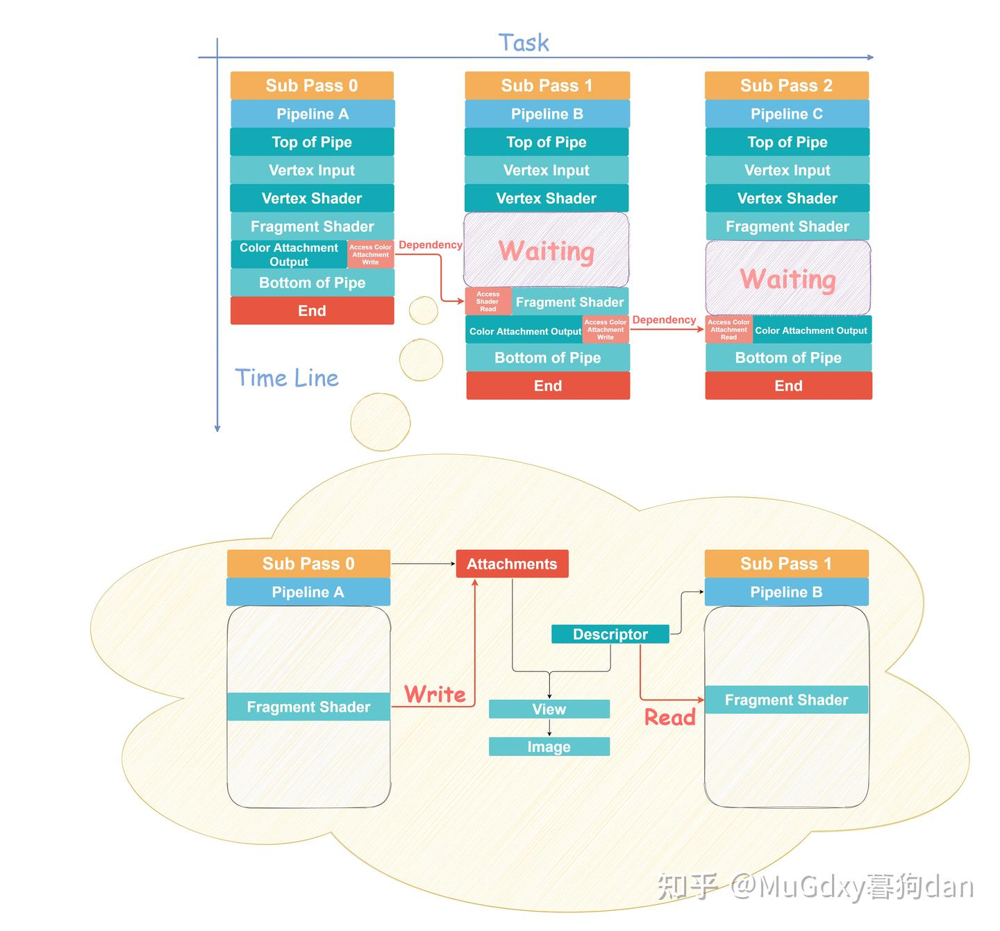

# 一张图形象理解Vulkan Sub Pass

在创建Render Pass的时候，我们会遇到Sub Pass这个概念。

一个Render Pass下的Sub Pass们共用一个Framebuffer，但可以引用（`VkAttachmentReference`）在Framebuffer中的不同Attachments。

如果他们之间有一定的数据或者执行依赖，那么这种依赖需要显式的`VkSubpassDependency` 来保证正确性（达到同步的效果）。

解释Sub Pass问题实际上是在解释同步问题，在Vulkan中绝大多数的Command是不保证执行顺序的，也就是所谓的executed out of order。但Vulkan有并不是处处都是“不保证顺序”的，Vulkan有一个重要的顺序是隐式保证的，那就是Submission Order，这看似没有什么意义的顺序为“同步命令”提供了一个最重要的机制——判断正在执行中的Command的先来后到关系——简单的可以理解为，在[同步命令](https://zhida.zhihu.com/search?content_id=190596163&content_type=Article&match_order=2&q=同步命令&zhida_source=entity)前录制的命令是被等待的命令（to be waited），记作A，在同步命令之后录制的是需要等待A的命令(waiting)，记作B。

例如：

```cpp
vkBeginCommandBuffer();
CmdA();
CmdSync();
CmdB();
vkEndCommandBuffer();
```

CmdA若满足CmdSync同步命令的srcStage/srcAccess等条件，那么他就会受到CmdSync的影响，并且他是作为被等待者。CmdB若满足CmdSync同步命令的dstStage/dstAccess等条件，那么他就会受到CmdSync的影响，并且他是作为等待者。

注意，上面的说法仅是为了理解简单，并不严谨，更多细节请参见。

[https://www.khronos.org/registry/vulkan/specs/1.2-khr-extensions/html/vkspec.html#synchronization-implicitwww.khronos.org/registry/vulkan/specs/1.2-khr-extensions/html/vkspec.html#synchronization-implicit](https://www.khronos.org/registry/vulkan/specs/1.2-khr-extensions/html/vkspec.html%23synchronization-implicit)

回到Sub Pass问题。处于同一个Render Pass的每一个Sub Pass的Submission Order是其Sub Pass Index决定的，Index小的先发出，Index大的后发出，Sub Pass Dependency正是通过这样的Submission Order来进行同步操作的。实际录制命令的时候：

```text
//Sub0
vkCmdNextSubpass(...);//index = 0
vkCmdBindPipeline(...);
vkCmdBindDescriptorSet(...);
vkCmdDrawXXX(...);
//<SubpassDependency>
//Sub1
vkCmdNextSubpass(...);//index = 1
vkCmdBindPipeline(...);
vkCmdBindDescriptorSet(...);
vkCmdDrawXXX(...);
```

(非常像利用Barrier完成同步工作，只是使用Barrier的时候我们显式的通过vkCmdPipelineBarrier(...)来同步之前发出的和之后发出的命令）

讲述了这些之后，我们来用一个实例来形象的理解Sub Pass以及Sub Pass之间的同步（大图更清晰）。



首先，横轴Task表示发出（Submit）Sub Pass的顺序，纵轴Time Line表示各Sub Pass各阶段执行的时间线。可以发现，三个Sub Pass是（几乎）同时开始执行的。（当然这是我们假设的，实际情况并非一定如此）

观察坐标系中的红色箭头，Sub Pass 0和Sub Pass 1之间有一个Dependency，srcStage为Color Attachment Output，dstStage为Fragment Shader。由于这个Dependency的存在，Sub Pass 1需要在Fragment Shader阶段等待Sub Pass 0的Color Attachment Output阶段，那么可以想象到，Sub Pass 1会有一段在Vertex Shader和Fragment Shader之间的摸鱼时间。

Sub Pass 1和Sub Pass 2之间有一个Dependency，srcStage为Color Attachment Output，dstStage为Fragment Shader。由于这个Dependency的存在，Sub Pass 2需要在Color Attachment Ouput阶段等待Sub Pass 1的Color Attachment Output阶段，同样可以想象到，Sub Pass 2也会有一段摸鱼时间。

Access Read/Write是用于保证Memory的Available与Visible的，细节参见。

[https://www.khronos.org/registry/vulkan/specs/1.2-khr-extensions/html/vkspec.html#memory-model-availability-visibilitywww.khronos.org/registry/vulkan/specs/1.2-khr-extensions/html/vkspec.html#memory-model-availability-visibility](https://www.khronos.org/registry/vulkan/specs/1.2-khr-extensions/html/vkspec.html%23memory-model-availability-visibility)

如果不过度追求细节和严谨的话，我们可以简单的认为，这样的设计是为了Local Cache的刷新，防止读到数据是过时数据，防止写入的数据无法被其他执行者看到。

那么什么时候我们会需要这样的一个Dependency来保证数据依赖呢？

图片下半部分鹅黄色的部分说，一种可能的情况是：Sub Pass 0输出的Color Attachment（Image View），同时是Sub Pass 1 中一个Descriptor上绑定的对象，这个Descriptor的类型为：`VK_DESCRIPTOR_TYPE_INPUT_ATTACHMENT` 。

若Sub Pass 0输出的Color Attachment是Framebuffer中的第一个Attachment，并且他是绑定在Sub Pass 1 DescriptorSet0 binding0上的Descriptor，则对应在Sub Pass 1 的 Fragment Shader中有：

```text
layout (input_attachment_index = 0, binding = 0) uniform subpassInput XXX;
```

可以发现，这个处于Sub Pass 0和Sub Pass 1之间的Dependency确实意义重大。

