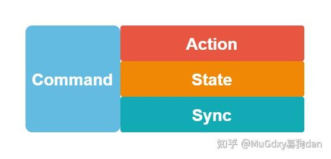
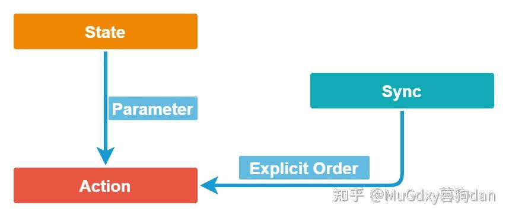

# Vulkan: Command Type & Ordering

在Vulkan Command Buffer中，记录着各种各样的Command。虽然都称为Command，但其执行是不同的，例如：

- `VkCmdBeginPipeline`是绑定Pipline，在此Command Submission的时候就立刻被执行完毕了。
- `VkCmdDrawXXX`是绘制命令，具体的执行是允许重叠（Overlap）和重排（Reorder）的。
- `VkCmdPipelineBarrier`是[同步命令](https://zhida.zhihu.com/search?content_id=192633580&content_type=Article&match_order=1&q=同步命令&zhida_source=entity)，根据上下文Command的Submission Order来确定Synchronization Scope，以完成同步工作。

在VkSpec中，其实对于这个问题有一个明确的划分：

[https://www.khronos.org/registry/vulkan/specs/1.2-extensions/html/vkspec.html#fundamentals-execmodelwww.khronos.org/registry/vulkan/specs/1.2-extensions/html/vkspec.html#fundamentals-execmodel](https://link.zhihu.com/?target=https%3A//www.khronos.org/registry/vulkan/specs/1.2-extensions/html/vkspec.html%23fundamentals-execmodel)

以下摘录了核心内容，后文会对此段进行解释和分析。

> Commands recorded in command buffers either perform actions (draw, dispatch, clear, copy, query/timestamp operations, begin/end subpass operations), set state (bind pipelines, descriptor sets, and buffers, set dynamic state, push constants, set render pass/subpass state), or perform synchronization (set/wait events, pipeline barrier, render pass/subpass dependencies). Some commands perform more than one of these tasks. State setting commands update the*current state*of the command buffer. Some commands that perform actions (e.g. draw/dispatch) do so based on the current state set cumulatively since the start of the command buffer. The work involved in performing action commands is often allowed to overlap or to be reordered, but doing so **must** not alter the state to be used by each action command. In general, action commands are those commands that alter [framebuffer](https://zhida.zhihu.com/search?content_id=192633580&content_type=Article&match_order=1&q=framebuffer&zhida_source=entity) attachments, read/write buffer or image memory, or write to query pools.

所有Command的功能可以分为：

- Perform Actions
- Set State
- Perform Synchronizations

Cmd Functions

但，一个Command的功能可能包含以上三个中的一个或者多个。

| Action            | Set State                      | Synchronization         |
| ----------------- | ------------------------------ | ----------------------- |
| Draw              | Bind Pipeline                  | Set/Wait Events         |
| Dispatch          | Bind Descriptor Sets           | Pipeline Barrier        |
| Clear             | Bind Buffers                   | Render Pass Dependencis |
| Copy              | Set Dynamic State              | Sub Pass Dependencis    |
| Query/Timestamp   | *Push Constants                |                         |
| Begin/End Subpass | Set Render Pass/Sub Pass State |                         |

其中值得注意的是Push Constant，Push Constant是推送小块数据到GPU端的方式。直觉上感觉，Push Constant和Copy/Transfer类的Command具有相似性。但根据VkSpec的说明，他是**Set State**类型的Command，即数据写入是在Command Submission的时候发生，并且全部完成的。

State的设置是累计的（cumulative），这也就自然而然的要求Set State之间不可发生Reorder和Overlap。值得注意的是State的累计以Command Buffer为单位，也就是说，所有的累计是从`VkBeginCommandBuffer`开始，不同Command Buffer之间的Set State相互不会产生影响。

Perform Action类型的Command可能会基于当前的各种State来执行，例如`VkCmdDraw`/`VkCmdDispatch`。

尽管原则上允许Perform Action发生Overlap和Reorder，`VkCmdDraw`的Framebuffer写入顺序还会受到[Primitive Order](https://link.zhihu.com/?target=https%3A//www.khronos.org/registry/vulkan/specs/1.2-extensions/html/vkspec.html%23drawing-primitive-order)的约束，实际上，Pipeline中各阶段可能会Overlap和Reorder，而最终写入Framebuffer时，会遵循各个VkCmdDraw的Submission Order来写入数据。

Perform Synchronization类型的Command，也就是我们常说的同步命令，是基于Command的Submission Order来工作的，Submission Order简单来说等价于“Command在代码中排列的顺序”（这是由Implicit Ordering Guarantees来保证的，意思是说，Vulkan向程序员保证，所有Command在代码中排列的顺序就是Command在GPU上发出的顺序）。Submission Order是Synchronization Command确定First Synchronization Scope与Second Synchronization Scope的唯一凭证。可以说，Synchronization Command是一个利用Implicit Ordering Guarantees来实现Explicit Ordering Guarantees的手段。但具体的同步操作由于篇幅和文章重点的原因这里就不再深入，有兴趣可以阅读VkSpec以下部分。

[https://www.khronos.org/registry/vulkan/specs/1.2-extensions/html/vkspec.html#synchronizationwww.khronos.org/registry/vulkan/specs/1.2-extensions/html/vkspec.html#synchronization](https://link.zhihu.com/?target=https%3A//www.khronos.org/registry/vulkan/specs/1.2-extensions/html/vkspec.html%23synchronization)

现在再来看这三种Command之间的关系:

三种Command的关系

State类型的Command实际上为Action Command提供了参数或者说更准确的来说是实参，用于控制Action类型的Command在执行时的实际表现（比如ViewPort的大小，Shader中的Constant等等）。当Action Command之间不存在隐式的顺序保证时，Synchronization Command能够为Action Command提供依赖，这种依赖包括Execution Dependencies/Memory Dependencies两种。

## Summary

三种类型的Command完成三项工作：

- 参数设定 - Set State
- 耗时操作 - Action
- 同步操作/指定依赖 - Synchronization

需要注意的点为：

1. 需要同步的只有Action Command。
2. Set State之间本身就是串行的，并且State Command对Action Command的作用域（Scope）为一个Command Buffer，State的设定与修改在此Scope中是累计的。
3. Synchronization Command，通过Command的Submission Order来确定同步作用域。

