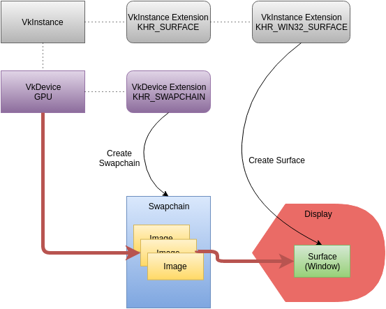
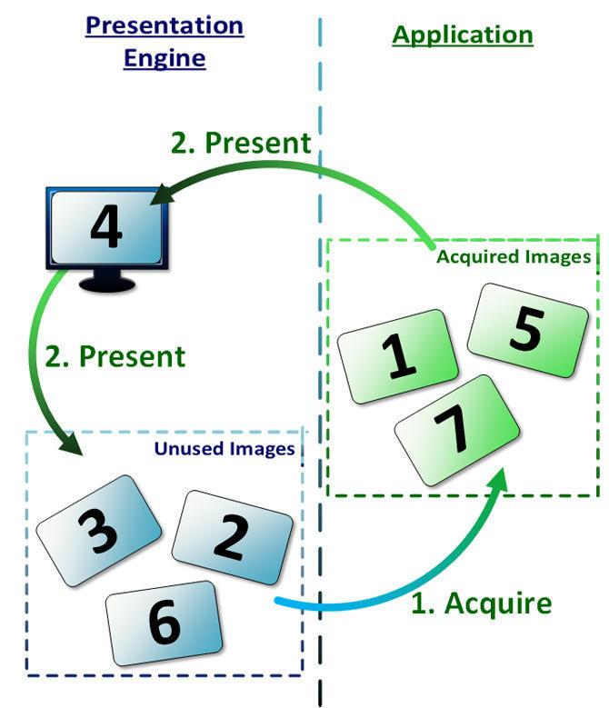
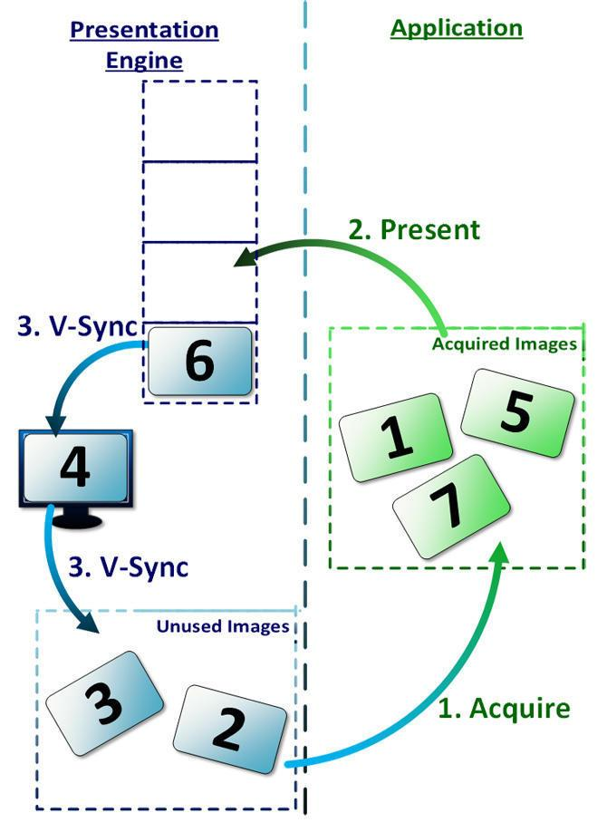
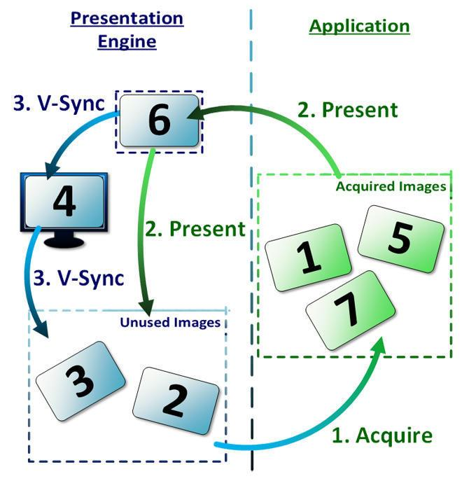
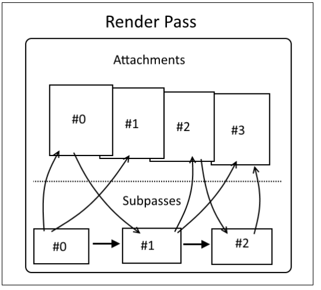
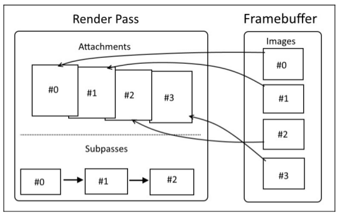
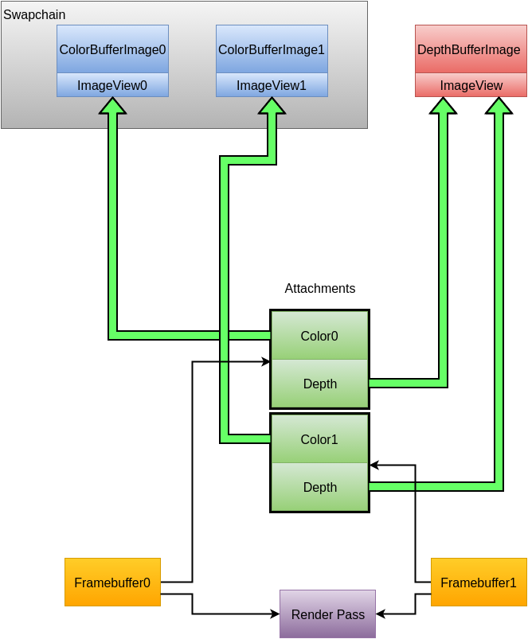

# Vulkan 绘制与显示

## 一、简介

[Vulkan API](https://zhida.zhihu.com/search?content_id=125116747&content_type=Article&match_order=1&q=Vulkan+API&zhida_source=entity)最常用的用法就是用来绘制和显示图像（Presentation）。

但是因为支持Vulkan运行的平台很多，有些以计算为目的应用也不需要把绘制的结果呈现给用户，所以显示相关的API并不是Vulkan核心API的一部分，而是通过扩展（[extensions](https://zhida.zhihu.com/search?content_id=125116747&content_type=Article&match_order=1&q=extensions&zhida_source=entity)）的方式提供。

## 二、Swap Chains

每一个支持显示的平台都有自己的窗口系统Windowing System Integration (WSI)。

Vulkan提供了Swap Chains 跟平台的窗口系统对接。

Swap Chains会向窗口系统申请一个或者多个可以用于显示的image对象。我们可以将这些image对象作为我们的绘制目标，绘制完成后通过`vkQueuePresentKHR()`函数送显。

Swapchain

## 三、显示模式

Presentation（送显）功能依赖于平台提供支持，不同平台的特性有所差异。我们在通过Swap Chains 获取用来显示的image object之后，还需要确认当前平台支持的显示模式。有些平台可能支持多种显示模式，我们需要根据自己的场景做出选择。

Vulkan API中定义了四种显示模式：

- IMMEDIATE
- FIFO
- FIFO RELAXED
- MAILBOX

### 3.1 IMMEDIATE

**IMMEDIATE**：送显之后立刻显示，替换当前正在显示的图像，不会关心vsync。

显示引擎中也没有等待队列保存图像。

这种方式不在消隐期间替换图像，很容易被用户看到撕裂现象。

img

### 3.2 FIFO 和 FIFO RELAXED

**FIFO**：每个Vulkan API的实现都必须支持FIFO模式。这种模式下，送显的图像会先被保存在一个先进先出的队列中，当vsync触发时，队列里的图像才会替换当前显示的图像，被替换的图像可以重新被应用程序申请绘制。

img

**FIFO RELAXED** 在FIFO上做了修改，当图像的显示时长超过一个vsync周期时，下一个图像不会再等待下一次vsync的到来，而是立刻显示。如果这个操作在非消隐期间，用户可以看到[撕裂现象](https://zhida.zhihu.com/search?content_id=125116747&content_type=Article&match_order=2&q=撕裂现象&zhida_source=entity)。

### 3.3 MAILBOX

**MAILBOX**：该模式下，图像仅仅在消隐期间显示，所以用户看不到撕裂现象。在显示引擎内部，只使用单个元素的队列，当有新的图像被生成时，等待队列的图像将被替换。所以这种模式下，显示的图像永远是最新的。

img

## 四、Renderpasses和FrameBuffer

### 4.1 Renderpasses

在Vulkan中，绘制命令被组织成Render Pass。Renderpass是一组subpass的集合，每个[subpass](https://zhida.zhihu.com/search?content_id=125116747&content_type=Article&match_order=2&q=subpass&zhida_source=entity)描述的是如何使用color attachments等图像资源。Renderpass管理着subpass之间的依赖关系和绘制顺序。

image-20200803212931804.png

### 4.2 FrameBuffer

FrameBuffer是一系列Image对象的集合，它是所有绘制操作的最终目标。

Swap Chains从窗口系统申请来的Image对象跟FrameBuffer绑定以后，绘制操作才能绘制到这些Image上面。

image-20200803213829034.png

如果把绘制流程比作绘画：

Swap Chains从窗口系统申请来的Image是用来作画的纸张；

FrameBuffer就是一个可以夹住多张纸的画板；

Renderpasses则表示每张纸要画什么，他们之间的绘制顺序是什么样子的，绘制时是不是要参考前一张的绘制内容。

当绘制完成后，我们就可以把Image传给平台的窗口系统进行显示了。

Framebuffers

**参考文档：**

1. Vulkan Programming Guide
2. Vulkan Cookbook
3. Learning Vulkan
4. [Vulkan® 1.1.148 - A Specification](https://www.khronos.org/registry/vulkan/specs/1.1/html/chap2.html%23introduction)
5. [Create the Framebuffers](https://vulkan.lunarg.com/doc/sdk/1.2.141.2/linux/tutorial/html/12-init_frame_buffers.html)
6. [Create a Swapchain](https://vulkan.lunarg.com/doc/sdk/1.2.141.2/linux/tutorial/html/05-init_swapchain.html)
7. [API without Secrets: Introduction to Vulkan* Part 2: Swap Chain](https://software.intel.com/content/www/us/en/develop/articles/api-without-secrets-introduction-to-vulkan-part-2.html)

**本系列文章汇总：**

- [Vulkan 简介](https://zhuanlan.zhihu.com/p/165141740)
- [Vulkan 多线程渲染](https://zhuanlan.zhihu.com/p/165341403)
- [Vulkan 内存管理](https://zhuanlan.zhihu.com/p/166387973)
- [Vulkan 绘制与显示](https://zhuanlan.zhihu.com/p/166423581)
- [Vulkan 资源绑定和状态管理](https://zhuanlan.zhihu.com/p/172479225)

