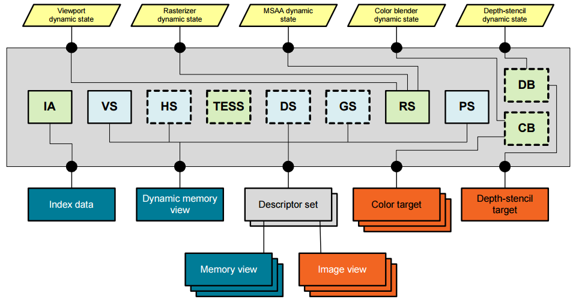

# Vulkan 资源绑定和状态管理

## 一、Pipeline简介

Vulkan中的管线分为两种：Compute Pipeline 和 Graphics Pipeline。

这两种Pipeline的作用跟其他CG API并没有太大的差别。

Compute Pipeline 用于异构并行计算，Graphics Pipeline 用于绘制渲染。

image-20200804142220705.png

### 1.1 Compute Pipeline

Vulkan在设计之时就已经将支持[异构并行计算](https://zhida.zhihu.com/search?content_id=126463673&content_type=Article&match_order=2&q=异构并行计算&zhida_source=entity)纳入考虑范围。Compute Pipeline就是为此而生。

Vulkan 的Compute Pipleline比较简单，API也比较少，基本上我们只需要关注shader本身就好。

### 1.2 Graphics Pipeline

相比于Compute Pipleline，Vulkan的Graphics Pipeline更加复杂，包含了Rasterzation(光栅化)、Shading(着色)、Geometry (几何着色)、Tessellation （细分）等可编程管线的重要环节。

image.png

在Vulkan中，配置Graphics Pipeline需要三个步骤：

- 提供shader
- 绑定资源
- 管理状态

后两者是本文要讲的重点。

## 二、Pipeline State Management

从早期开始，OpenGL 状态机就提供了更细颗粒度的状态控制。

image-20200807153712040.png

精细颗粒度的控制对[驱动程序](https://zhida.zhihu.com/search?content_id=126463673&content_type=Article&match_order=1&q=驱动程序&zhida_source=entity)带来了负担，驱动程序不得不对状态进行缓存和运行时编译（JIT）。

但是现在新的API，几乎把整个GPU state vector封装到一个object中。

比如，如果你想切换状态，是通过切换pipeline A和pipeline B。而不是想OpenGL中那样更改标志位。

这样粗颗粒度的状态对象的优势是方便驱动程序的编译和验证，有助于避免在状态改变时造成的暂停现象。

Vulkan的Pipeline状态管理参考的是Mantel，提供了Pipeline State Object（PSO）进行状态管理：

Mantle的graphic pipeline细节

- Vertex input state

- - Vertex input state用来管理Vertex数据的位置、索引、布局等信息

- Input assembly state

- - Input assembly state管理定点数据的组织方式（点、线、三角形...）

- Tessellation State

- - Tessellation State管理Tessellation control shader 和 Tessellation evaluation shader的状态

- Rasterization state

- - Rasterization state用来管理光栅化的一些状态，包括多边形的填充模式（PolygonMode）、剔除模式（正面剔除、背面剔除）、深度信息的处理

- Color Blend state

- - Color Blend是Vulkan Graphics Pipeline的最后阶段，这个阶段负责将片段写入color attachments。在许多情况下，这是一个简单的操作，仅用Fragment Shader输出的值覆盖attachments中的值。除此之外，color blend还可以将这些值与FrameBuffer中的值混合，并进行简单的逻辑运算。

- Viewport state

- - Viewport state用来管理Viewport，Viewport会将设备坐标（device coordinate）转换为窗口坐标（window coordinate），是进行光栅化之前最后一次[坐标变换](https://zhida.zhihu.com/search?content_id=126463673&content_type=Article&match_order=1&q=坐标变换&zhida_source=entity)

- Depth/Stencil state

- - Depth/Stencil state控制着Depth和Stencil测试的方式

- Multi-Sampling State

- - 多重采样的目的是为了抗锯齿，Multi-Sampling State管理多重采样

**Dynamic state**

- Graphics Pipeline很复杂，包含很多状态，一些图形应用希望能以更高的频率更改某些状态。如果每种状态更改都要创建一个新的Pipeline对象，非常不利于管理。
- Dynamic state可以管理viewport、stencil、line widths（线宽）、blending constants、stencil comparison masks等状态。应用无需重建Pipeline对象，只需要通过Command Buffer就可以实现状态更新

这张图取自论文《Getting started with computer graphics and the vulkan API》

## 三、Resource Binding

Vulkan的资源绑定涉及到以下几个概念：

- Descriptor
- Descriptor Set
- Descriptor set layout
- Descriptor binding
- Pipeline layout
- Push constant

了解DirectX12（D3D12）的同学更容易接受Descriptor Set、Descriptor binding这些概念，因为Vulkan的绑定模型（Binding model）一部分参考了DirectX12（D3D12）的设计理念。

### 3.1 Descriptor

Descriptor是一个GPU特定编码格式的数据块。Descriptor所指的内容不同，就可以表示不同的数据类型。比如指向纹理的texture descriptor可能包括指向纹理数据的指针，以及宽度/高度，格式等信息。

由于不同的GPU存储信息的方式不同，所以API中并没有对应用暴露format信息。

Descriptor的内存不可以分配和释放，只能write，copy 和 move。

### 3.2 Descriptor Set

**Descriptor Set**是一个绑定在Pipeline上资源集合。多个Descriptor Set可以同时绑定到一个Pipeline上。

每个Descriptor Set都有一个layout，Descriptor set Layout会控制当前资源集中的资源排布方式，给shader提供了读取资源的接口。

image-20200807113539692.png

**Descriptor set layout**本质上是Descriptor bindings的集合。**Descriptor binding**可以是一个 texture descriptor、buffer descriptor或者sampler descriptor等descriptor。

正是通过Descriptor binding，Descriptor Set才实现了shader和资源的绑定，方便了shader对资源的读写操作。

image-20200807125025186.png

### 3.3 Pipeline layout

Pipeline [layout](https://zhida.zhihu.com/search?content_id=126463673&content_type=Article&match_order=6&q=layout&zhida_source=entity)是由Pipeline可以访问的descriptor set layouts 和 push constant ranges组成，它表示Pipeline可以访问的完整资源集。

其中，**Push constant** 提供了一个快速更新shader中常量的方法。

img

### 3.4 Binding model

我们把上述元素组织在一起，就是vulkan资源的绑定模型。

Descriptor Set包含一组Descriptor和Descriptor Set layout：

- 每个Descriptor都可以表示不同的数据类型
- Descriptor Set Layout由Descriptor binding组成，会控制每个Descriptor的排列方式
- Descriptor binding将Descriptor和shader进行绑定，给shader提供了对资源操作的接口。

Constants register array（Root Table） 把多个Descriptor Set 和 push constant组织在一起。

Vulkan&amp;amp;amp;amp;amp;amp;amp;#39;s binding model

Pipeline layout 表示整个[渲染管线](https://zhida.zhihu.com/search?content_id=126463673&content_type=Article&match_order=1&q=渲染管线&zhida_source=entity)的资源布局。

最后我们来看一下整体架构的示意图：

image-20200807180522042.png

**参考文档：**

1. Vulkan Programming Guide
2. Vulkan Cookbook
3. Learning Vulkan
4. [Vulkan® 1.1.148 - A Specification](https://link.zhihu.com/?target=https%3A//www.khronos.org/registry/vulkan/specs/1.1/html/chap2.html%23introduction)
5. [Vulkan Rendering Interface](https://link.zhihu.com/?target=https%3A//www.carvergames.com/vulkan)
6. [Managing Descriptor Heaps](https://link.zhihu.com/?target=http%3A//diligentgraphics.com/diligent-engine/architecture/d3d12/managing-descriptor-heaps/)
7. [21-LowLevelAPIs](https://link.zhihu.com/?target=https%3A//web.eecs.umich.edu/~sugih/courses/eecs487/lectures/21-LowLevelAPIs.pdf)
8. [Vulkan Tutorial](https://link.zhihu.com/?target=https%3A//vulkan-tutorial.com/Drawing_a_triangle/Graphics_pipeline_basics/Introduction)
9. [Qualcomm Vulkan Tutorial](https://link.zhihu.com/?target=https%3A//www.youtube.com/channel/UCo22aFqG5YErI4pbexQv9gQ)
10. [Choosing a binding model](https://link.zhihu.com/?target=https%3A//github.com/gpuweb/gpuweb/issues/19)
11. [Elements of design of explicit graphics APIs](https://link.zhihu.com/?target=https%3A//docs.google.com/presentation/d/12YSEcLjyYStNDK9EwhPgRq05oIxpTIqC1GdKgJd_Jt4/edit%23slide%3Did.g1856010b44_0_1168)
12. [Binding models investigation](https://link.zhihu.com/?target=https%3A//docs.google.com/document/d/1_xeTnk6DlN7YmePQQAlnHndA043rgwBzUYtatk5y7kQ)
13. [SIGGRAPH 2015](https://link.zhihu.com/?target=http%3A//s2015.siggraph.org/)
14. [Getting started with computer graphics and the vulkan API](https://link.zhihu.com/?target=https%3A//www.semanticscholar.org/paper/Getting-started-with-computer-graphics-and-the-API-Kenwright/a3ba076d0ceb0d6d252e48d182809658121265c0%23references)
15. [Descriptor binding: DX12 and Vulkan](https://link.zhihu.com/?target=https%3A//www.gamedev.net/forums/topic/678860-descriptor-binding-dx12-and-vulkan/)

**本系列文章汇总：**

- [Vulkan 简介](https://zhuanlan.zhihu.com/p/165141740)
- [Vulkan 多线程渲染](https://zhuanlan.zhihu.com/p/165341403)
- [Vulkan 内存管理](https://zhuanlan.zhihu.com/p/166387973)
- [Vulkan 绘制与显示](https://zhuanlan.zhihu.com/p/166423581)
- [Vulkan 资源绑定和状态管理](https://zhuanlan.zhihu.com/p/172479225)

