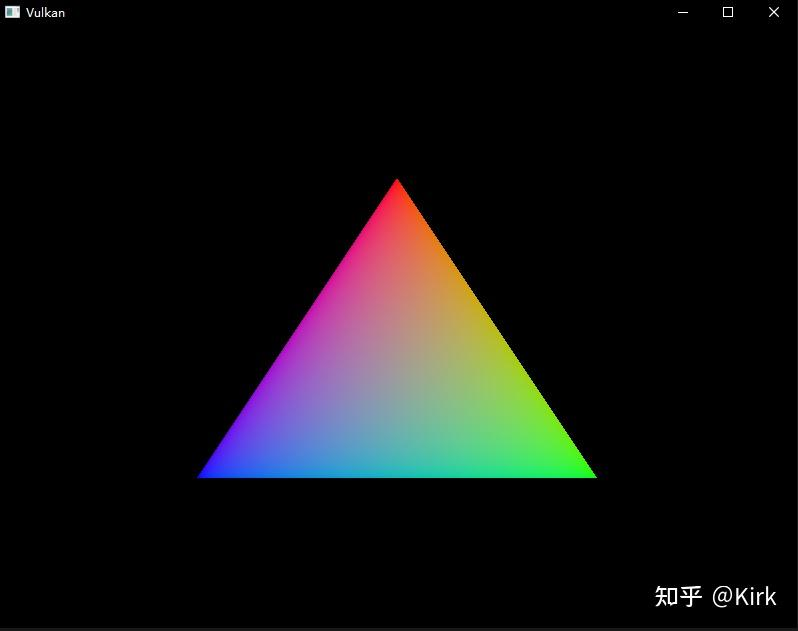
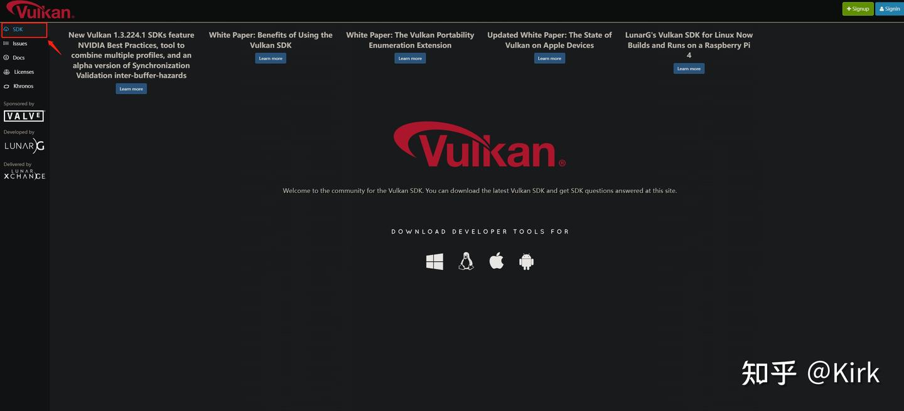
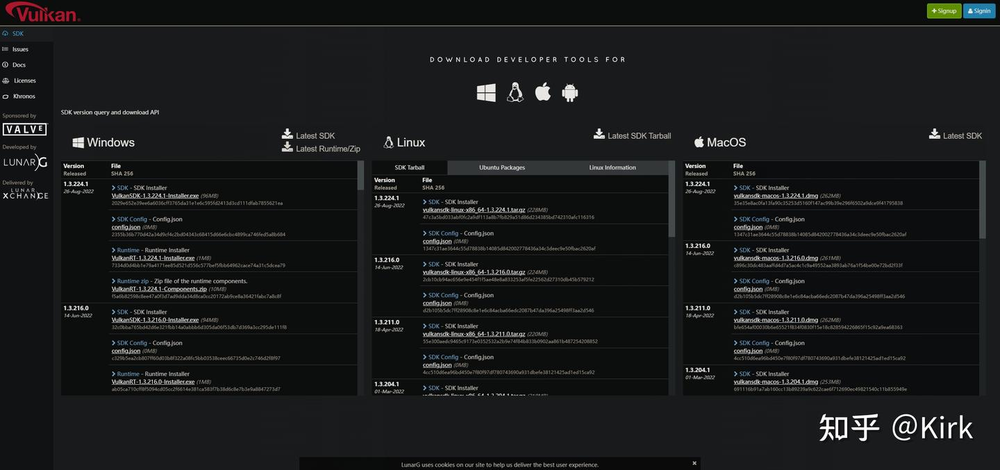
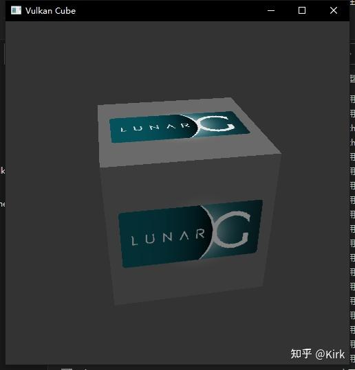
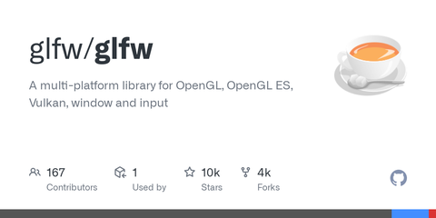
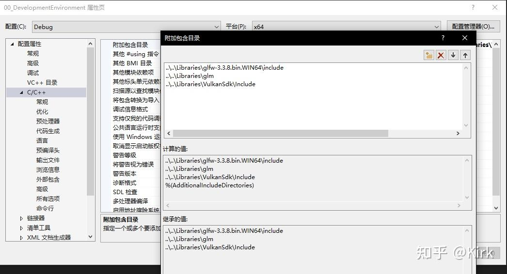
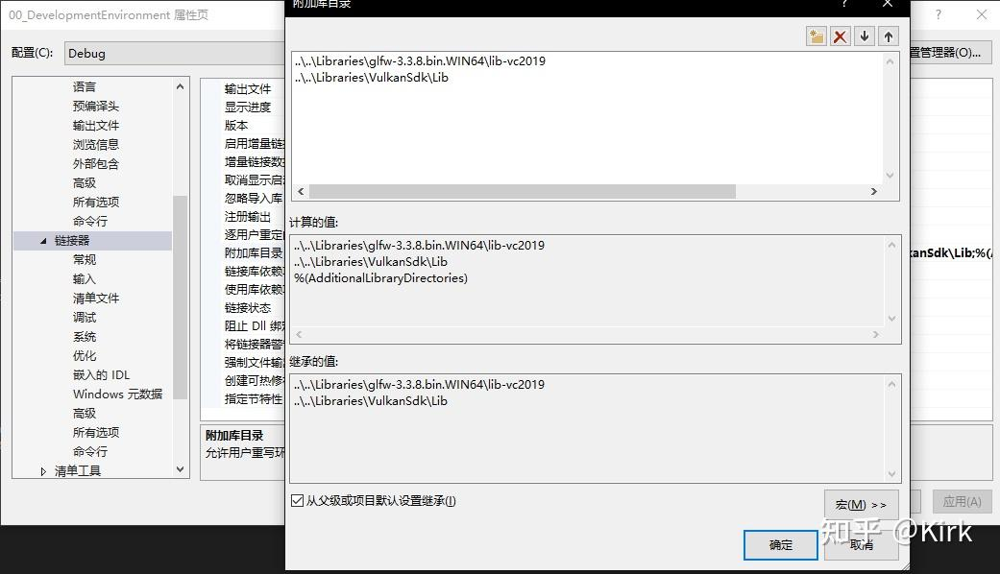
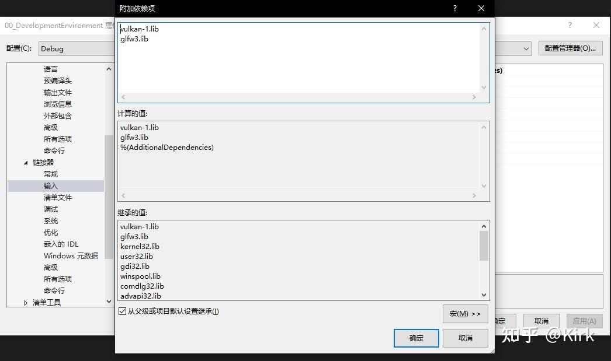

# Vulkan开发学习记录 01 - 开发环境搭建

https://zhuanlan.zhihu.com/p/573525615

## Vulkan的历史概述

**Vulkan是一个用于图形和计算设备的[编程接口](https://zhida.zhihu.com/search?content_id=215583317&content_type=Article&match_order=1&q=编程接口&zhida_source=entity)**，**Vulkan是一个跨平台的2D和3D绘图[应用程序接口](https://zhida.zhihu.com/search?content_id=215583317&content_type=Article&match_order=1&q=应用程序接口&zhida_source=entity)（API）**，最早由[科纳斯](https://zhida.zhihu.com/search?content_id=215583317&content_type=Article&match_order=1&q=科纳斯&zhida_source=entity)组织在2015年游戏开发者大会（GDC）上发表。科纳斯最先把`VulkanAPI`称为“[次世代](https://zhida.zhihu.com/search?content_id=215583317&content_type=Article&match_order=1&q=次世代&zhida_source=entity)OpenGL行动”（next generation OpenGL initiative）或“glNext”，但在正式宣布`Vulkan`之后这些名字就没有再使用了。就像`OpenGL，Vulkan`针对实时3D程序（如电子游戏）设计，`Vulkan`并计划提供高性能和低CPU管理负担（overhead），这也是`Direct3D12`和 AMD 的 Mantle 的目标。`Vulkan`兼容 Mantle 的一个分支，并使用了 Mantle 的一些组件。

## Vulkan的简介

**Vulkan是一个用于图形和计算设备的编程接口**。`Vulkan`设备通常由一个处理器和一定数量的固定功能硬件模块组成，用于加速图形和计算操作。通常，设备中的处理器是高度线程化的，所以在极大程度上`Vulkan`里的计算模型是基于[并行计算](https://zhida.zhihu.com/search?content_id=215583317&content_type=Article&match_order=1&q=并行计算&zhida_source=entity)的。`Vulkan`还可以访问运行应用程序的主处理器上的共享或非[共享内存](https://zhida.zhihu.com/search?content_id=215583317&content_type=Article&match_order=1&q=共享内存&zhida_source=entity)。`Vulkan`也会给开发人员提供这个内存。

Vulkan 是个显式的API，也就是说，几乎所有的事情你都需要亲自负责。[驱动程序](https://zhida.zhihu.com/search?content_id=215583317&content_type=Article&match_order=1&q=驱动程序&zhida_source=entity)是一个软件，用于接收API调用传递过来的指令和数据，并将它们进行转换，使得硬件可以理解。在老的API（例如OpenGL）里，驱动程序会跟踪大量对象的状态，自动管理内存和同步，以及在程序运行时检查错误。这对开发人员非常友好，但是在应用程序经过调试并且正确运行时，会消耗宝贵的[CPU性能](https://zhida.zhihu.com/search?content_id=215583317&content_type=Article&match_order=1&q=CPU性能&zhida_source=entity)。Vulkan 解决这个问题的方式是，将状态跟踪、同步和[内存管理](https://zhida.zhihu.com/search?content_id=215583317&content_type=Article&match_order=1&q=内存管理&zhida_source=entity)交给了应用程序开发人员，同时将正确性检查交给各个层进行代理，而要想使用这些层必须手动启用。这些层在正常情况下不会在应用程序里执行。

由于这些原因，Vulkan 难以使用，并且在一定程度上很不稳定。你需要做大量的工作来保证Vulkan 运行正常，并且API的错误使用经常会导致图形错乱甚至程序崩溃，而在传统的图形API里你通常会提前收到用于帮助解决问题的错误消息。以此为代价，Vulkan 提供了对设备的更多控制、清晰的线程模型以及比传统API高得多的性能。

另外，Vulkan 不仅仅被设计成图形API，它还用作异构设备，例如图形处理单元（Graphics Processing Unit，GPU）、[数字信号处理器](https://zhida.zhihu.com/search?content_id=215583317&content_type=Article&match_order=1&q=数字信号处理器&zhida_source=entity)（Digital Signal Processor，DSP）和固定功能硬件。功能可以粗略地划分为几类。Vulkan的当前版本定义了传输类别——用于复制数据；计算类别——用于运行[着色器](https://zhida.zhihu.com/search?content_id=215583317&content_type=Article&match_order=1&q=着色器&zhida_source=entity)进行计算工作；图形类别——包括[光栅化](https://zhida.zhihu.com/search?content_id=215583317&content_type=Article&match_order=1&q=光栅化&zhida_source=entity)、图元装配、混合、深度和模板测试，以及图形程序员所熟悉的其他功能。

## 工程链接

https://github.com/Kirkice/JourneyThroughVulkan




Hello Vulkan

## 环境搭建（以Windows平台为例）

### Vulkan SDK

开发Vulkan应用程序所需的最重要的组件就是SDK。它包括核心[头文件](https://zhida.zhihu.com/search?content_id=215583317&content_type=Article&match_order=1&q=头文件&zhida_source=entity)、标准的Validation layers及调试工具集、和驱动Loader，加载程序在运行时查找驱动程序中的函数，类似于 GLEW for OpenGL。

SDK 可以使用页面底部的按钮从[LunarG 网站下载。](https://link.zhihu.com/?target=https%3A//vulkan.lunarg.com/)您不必创建帐户，但它可以让您访问一些可能对您有用的附加文档。




LunarG



下载Vulkan SDK


继续安装并注意 SDK 的安装位置。我们要做的第一件事是验证您的[显卡](https://zhida.zhihu.com/search?content_id=215583317&content_type=Article&match_order=1&q=显卡&zhida_source=entity)和驱动程序是否正确支持 Vulkan。转到安装 SDK 的目录，打开`Bin`目录并运行`vkcube.exe`演示。您应该看到以下内容：



vkCube

## GLFW

如前所述，Vulkan 本身是一个与平台无关的 API，不包括用于创建窗口以显示渲染结果的工具。为了发挥 Vulkan 的跨平台优势，我们将使用GLFW 库创建一个支持 Windows、Linux 和 MacOS 的窗口。还有其他可用的库，例如SDL，但 GLFW 的优势在于它还抽象了 Vulkan 中的一些其他特定于平台的东西，而不仅仅是创建窗口。

您可以在官方网站上找到 GLFW 的最新版本。在本教程中，我们将使用 64 位二进制文件，但您当然也可以选择以 32 位模式构建。在这种情况下，请确保链接到Lib32目录中的 Vulkan SDK [二进制文件](https://zhida.zhihu.com/search?content_id=215583317&content_type=Article&match_order=1&q=二进制文件&zhida_source=entity)，而不是Lib. 下载后，将存档解压缩到方便的位置。

[GitHub - glfw/glfw: A multi-platform library for OpenGL, OpenGL ES, Vulkan, window and inputgithub.com/glfw/glfw](https://link.zhihu.com/?target=https%3A//github.com/glfw/glfw)


## GLM

与 DirectX 12 不同，Vulkan 不包含用于[线性代数](https://zhida.zhihu.com/search?content_id=215583317&content_type=Article&match_order=1&q=线性代数&zhida_source=entity)运算的库，因此我们必须下载一个。GLM是一个很好的库，旨在与图形 API 一起使用，并且通常与 OpenGL 一起使用。

GLM 是一个仅包含标头的库，因此只需下载最新版本 并将其存储在方便的位置即可。

[https://github.com/g-truc/glmgithub.com/g-truc/glm](https://link.zhihu.com/?target=https%3A//github.com/g-truc/glm)

## 设置 Visual Studio

为 Vulkan、GLFW 和 GLM 添加头目录：



接下来，打开以下库目录的编辑器`Linker -> General`，并添加 Vulkan 和 GLFW 的目标文件的位置：



输入 Vulkan 和 GLFW 目标文件的名称：




新建[cpp](https://zhida.zhihu.com/search?content_id=215583317&content_type=Article&match_order=1&q=cpp&zhida_source=entity)文件，并拷入以下代码，运行：

```cpp
#define GLFW_INCLUDE_VULKAN
#include <GLFW/glfw3.h>

#define GLM_FORCE_RADIANS
#define GLM_FORCE_DEPTH_ZERO_TO_ONE
#include <glm/vec4.hpp>
#include <glm/mat4x4.hpp>

#include <iostream>

int main() {
	glfwInit();

	glfwWindowHint(GLFW_CLIENT_API, GLFW_NO_API);
	GLFWwindow* window = glfwCreateWindow(800, 600, "Vulkan window", nullptr, nullptr);

	uint32_t extensionCount = 0;
	vkEnumerateInstanceExtensionProperties(nullptr, &extensionCount, nullptr);

	std::cout << extensionCount << " extensions supported\n";

	glm::mat4 matrix;
	glm::vec4 vec;
	auto test = matrix * vec;

	while (!glfwWindowShouldClose(window)) {
		glfwPollEvents();
	}

	glfwDestroyWindow(window);

	glfwTerminate();

	return 0;
}
```

