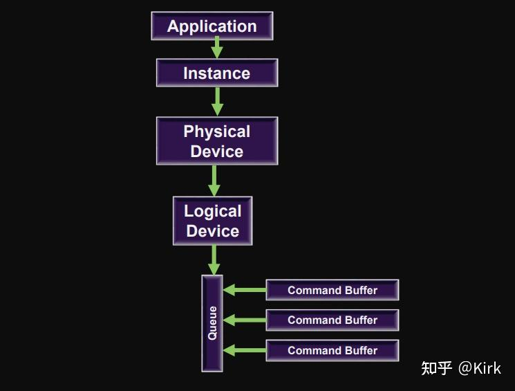

# Vulkan开发学习记录 02 - 创建实例、物理设备、设备队列

## 简述

Vulkan包含了一个层级化的功能结构，从顶层开始是实例，实例聚集了所有支持Vulkan的设备。每个设备提供了一个或者多个队列，这些队列执行应用程序请求的工作。

Vulkan实例是一个软件概念，在逻辑上将应用程序的状态与其他应用程序或者运行在应用程序环境里的库分开。系统里的物理设备表示为实例的[成员变量](https://zhida.zhihu.com/search?content_id=216109043&content_type=Article&match_order=1&q=成员变量&zhida_source=entity)，每个都有一定的功能，包括一组可用的队列。

物理设备通常表示一个单独的硬件或者互相连接的一组硬件。在任何系统里，都有一些数量固定的物理设备，除非这个系统支持重新配置，例如[热插拔](https://zhida.zhihu.com/search?content_id=216109043&content_type=Article&match_order=1&q=热插拔&zhida_source=entity)。由实例创建的逻辑设备是一个与物理设备相关的软件概念，表示与某个特定物理设备相关的预定资源，其中包括了物理设备上可用队列的一个子集。可以通过创建多个逻辑设备来表示一个物理设备，应用程序花大部分时间与逻辑设备交互。


基本的 Vulkan 架构

上图显示 Vulkan 应用程序链接到通常称为loader的 Vulkan 库。创建实例会初始化加载程序。加载程序还加载和初始化通常由 GPU 硬件供应商提供的低级图形驱动程序。

请注意，此图中描绘了一些层，它们也由[加载器](https://zhida.zhihu.com/search?content_id=216109043&content_type=Article&match_order=1&q=加载器&zhida_source=entity)加载。层通常被用于验证，这通常由[驱动程序](https://zhida.zhihu.com/search?content_id=216109043&content_type=Article&match_order=2&q=驱动程序&zhida_source=entity)来执行错误检查。在 Vulkan 中，驱动程序比其他 API（如 OpenGL）更轻量级，部分原因是它们将此验证功能委托给验证层。层是可选的，可以在每次应用程序创建实例时选择性地加载。

## Vulkan 实例

Vulkan可以被看作应用程序的子系统。一旦应用程序连接了Vulkan库并初始化，Vulkan就会追踪一些状态。因为Vulkan并不向应用程序引入任何全局状态，所以所有追踪的状态必须存储在你提供的一个对象里。这就是实例对象，**由VkInstance对象来表示**。

现在我们要要创建一个实例，并且为该[数据结构](https://zhida.zhihu.com/search?content_id=216109043&content_type=Article&match_order=1&q=数据结构&zhida_source=entity)赋予自定义应用程序的信息。这些数据从技术角度是可选择的，但是它可以为驱动程序提供一些有用的信息来优化程序特殊的使用情景，比如驱动程序使用一些[图形引擎](https://zhida.zhihu.com/search?content_id=216109043&content_type=Article&match_order=1&q=图形引擎&zhida_source=entity)的特殊行为。这个数据结构称为**VkApplicationInfo**:

```cpp
void createInstance() {
    VkApplicationInfo appInfo{};
    appInfo.sType = VK_STRUCTURE_TYPE_APPLICATION_INFO;
    appInfo.pApplicationName = "Hello Triangle";
    appInfo.applicationVersion = VK_MAKE_VERSION(1, 0, 0);
    appInfo.pEngineName = "No Engine";
    appInfo.engineVersion = VK_MAKE_VERSION(1, 0, 0);
    appInfo.apiVersion = VK_API_VERSION_1_0;
}
```

Vulkan中的大量信息通过结构体而不是函数[参数传递](https://zhida.zhihu.com/search?content_id=216109043&content_type=Article&match_order=1&q=参数传递&zhida_source=entity)，我们将填充一个结构体以提供足够的信息创建instance。下一个结构体不是可选的，它需要告知Vulkan驱动程序我们需要使用哪些全局的 extensions 和 validation layers。这里的全局意味着它适用于整个程序，而不是特定的设备。

```cpp
VkInstanceCreateInfo createInfo{};
createInfo.sType = VK_STRUCTURE_TYPE_INSTANCE_CREATE_INFO;
createInfo.pApplicationInfo = &appInfo;
```

前几个参数比较简单。接下来的两个指定需要的全局扩展，Vulakn对于平台特性是零API支持的(至少暂时这样)，这意味着需要一个扩展才能与不同平台的窗体系统进行交互。GLFW有一个方便的内置函数，返回它有关的扩展信息，我们可以传递给struct:

```cpp
unsigned int glfwExtensionCount = 0;
const char** glfwExtensions;

glfwExtensions = glfwGetRequiredInstanceExtensions(&glfwExtensionCount);

createInfo.enabledExtensionCount = glfwExtensionCount;
createInfo.ppEnabledExtensionNames = glfwExtensions;
createInfo.enabledLayerCount = 0;
```

我们现在已经指定了Vulkan创建一个实例需要的一切信息，调用vkCreateInstance创建属于我们的第一个instance:

```cpp
VkResult result = vkCreateInstance(&createInfo, nullptr, &instance);
```

如你所见，Vulkan中创建、实例化相关的函数参数一般遵循如下原则定义:

- 使用有关creation info 的结构体指针
- 使用自定义分配器回调的指针
- 使用保存新对象句柄的指针

如果一切顺利，此刻instance的句柄应该存储在VkInstance类成员中了。几乎所有的Vulkan函数都返回一个值为VK_SUCCESS或错误代码的VkResult类型的值。要检查instance是否已经成功创建，我们不需要保存结果，仅仅使用 VK_SUCCESS 值来检测即可：

```cpp
if (vkCreateInstance(&createInfo, nullptr, &instance) != VK_SUCCESS) {
    throw std::runtime_error("failed to create instance!");
}
```

## Vulkan 物理设备

一旦有了实例，就可以查找系统里安装的与Vulkan兼容的设备。Vulkan有两种设备：物理设备和逻辑设备。物理设备通常是系统的一部分——[显卡](https://zhida.zhihu.com/search?content_id=216109043&content_type=Article&match_order=1&q=显卡&zhida_source=entity)、加速器、[数字信号处理器](https://zhida.zhihu.com/search?content_id=216109043&content_type=Article&match_order=1&q=数字信号处理器&zhida_source=entity)或者其他的组件。系统里有固定数量的物理设备，每个物理设备都有自己的一组固定的功能。

逻辑设备是物理设备的软件抽象，以应用程序指定的方式配置。逻辑设备是应用程序花费大部分时间处理的对象。但是在创建逻辑设备之前，必须查找连接的物理设备。




**选择物理设备**

通过**VkInstance**初始化Vulkan后，我们需要在系统中查找并选择一个支持我们所需功能的显卡。实际上，我们可以选择任意数量的显卡并同时使用他们，但在本小节中，我们简单的设定选择规则，即将查找到的第一个[图形卡](https://zhida.zhihu.com/search?content_id=216109043&content_type=Article&match_order=1&q=图形卡&zhida_source=entity)作为我们适合的物理设备。

我们添加函数**pickPhysicalDevice**并在**initVulkan**函数中调用

```cpp
void initVulkan() {
    createInstance();
    setupDebugCallback();
    pickPhysicalDevice();
}

void pickPhysicalDevice() {

}
```

最终我们选择的图形显卡存储在类成员**VkPhysicalDevice**句柄中。当**VkInstance**销毁时，这个对象将会被隐式销毁，所以我们并不需要在**cleanup**函数中做任何操作。

```cpp
VkPhysicalDevice physicalDevice = VK_NULL_HANDLE;
```

关于获取图形卡列表的方式与获得扩展列表的方式类似。

```cpp
uint32_t deviceCount = 0;
vkEnumeratePhysicalDevices(instance, &deviceCount, nullptr);
```

如果`Vulkan`支持的设备数为0，那么没有任何意义进行下一步，我们选择抛出异常。

```cpp
if (deviceCount == 0) {
    throw std::runtime_error("failed to find GPUs with Vulkan support!");
}
```

否则我们分配数组存储所有**VkPhysicalDevice**的句柄。

```cpp
std::vector<VkPhysicalDevice> devices(deviceCount);
vkEnumeratePhysicalDevices(instance, &deviceCount, devices.data());
```

函数**vkEnumeratePhysicalDevices()**的第一个参数instance是之前创建的实例。

下一个参数pPhysicalDeviceCount是一个指向[无符号整型](https://zhida.zhihu.com/search?content_id=216109043&content_type=Article&match_order=1&q=无符号整型&zhida_source=entity)变量的指针，同时作为输入和输出。作为输出，Vulkan将系统里的物理设备数量写入该指针变量。作为输入，它会初始化为应用程序能够处理的设备的最大数量。参数pPhysicalDevices是个指向VkPhysicalDevice句柄数组的指针。

现在我们需要对它们进行评估，检查它们是否适合我们要执行的操作，因为并不是所有的显卡功能一致。为此我们添加一个新的函数:

```cpp
bool isDeviceSuitable(VkPhysicalDevice device) {
    return true;
}
```

我们将检查是否有任何物理设备符合我们的功能需求。

```cpp
for (const auto& device : devices) {
    if (isDeviceSuitable(device)) {
        physicalDevice = device;
        break;
    }
}

if (physicalDevice == VK_NULL_HANDLE) {
    throw std::runtime_error("failed to find a suitable GPU!");
}
```

## Vulkan 设备队列

Vulkan设备执行提交给队列的工作。每个设备都有一个或者多个队列，每个队列都从属于设备的某个队列簇。一个队列簇是一组拥有相同功能同时又能并行运行的队列。队列簇的数量、每个簇的功能以及每个簇拥有的队列数量都是物理设备的属性。

我们需要[检测设备](https://zhida.zhihu.com/search?content_id=216109043&content_type=Article&match_order=1&q=检测设备&zhida_source=entity)中支持的队列簇，其中哪一个队列簇支持我们想要的`commands`。为此我们添加一个新的函数**findQueueFamilies**来查找我们需要的队列簇。

此函数返回满足某个属性的队列簇索引。定义结构体，其中索引**-1**表示未找到

```cpp
struct QueueFamilyIndices {
    int graphicsFamily = -1;

    bool isComplete() {
        return graphicsFamily >= 0;
    }
};
```

现在我们实现**findQueueFamilies**函数:

```cpp
QueueFamilyIndices findQueueFamilies(VkPhysicalDevice device) {
    QueueFamilyIndices indices;

    ...

    return indices;
}
```

获取队列簇的列表函数为**vkGetPhysicalDeviceQueueFamilyProperties**:

```cpp
uint32_t queueFamilyCount = 0;
vkGetPhysicalDeviceQueueFamilyProperties(device, &queueFamilyCount, nullptr);

std::vector<VkQueueFamilyProperties> queueFamilies(queueFamilyCount);
vkGetPhysicalDeviceQueueFamilyProperties(device, &queueFamilyCount, queueFamilies.data());
```

有关队列簇，结构体**VkQueueFamilyProperties**包含了具体信息，包括支持的操作类型和基于当前队列簇可以创建的有效[队列数](https://zhida.zhihu.com/search?content_id=216109043&content_type=Article&match_order=2&q=队列数&zhida_source=entity)。我们至少需要找到一个支持**VK_QUEUE_GRAPHICS_BIT**的队列簇。

```cpp
int i = 0;
for (const auto& queueFamily : queueFamilies) {
    if (queueFamily.queueCount > 0 && queueFamily.queueFlags & VK_QUEUE_GRAPHICS_BIT) {
        indices.graphicsFamily = i;
    }

    if (indices.isComplete()) {
        break;
    }

    i++;
}
```

现在我们有了比较理想的队列簇查询功能，我们可以在isDeviceSuitable函数中使用，确保物理设备可以处理我们需要的命令:

```cpp
bool isDeviceSuitable(VkPhysicalDevice device) {
    QueueFamilyIndices indices = findQueueFamilies(device);

    return indices.isComplete();
}
```


## 工程链接

[GitHub - Kirkice/JourneyThroughVulkan: 学习Vulkan~github.com/Kirkice/JourneyThroughVulkan](https://github.com/Kirkice/JourneyThroughVulkan)

## 参考

[1]. [Physical devices and queue families](https://link.zhihu.com/?target=https%3A//vulkan-tutorial.com/Drawing_a_triangle/Setup/Physical_devices_and_queue_families)

[2]. [https://web.engr.oregonstate.edu/~mjb/vulkan/Handouts/PhysicalDevices.1pp.pdf](https://link.zhihu.com/?target=https%3A//web.engr.oregonstate.edu/~mjb/vulkan/Handouts/PhysicalDevices.1pp.pdf)

[3]. [Vulkan 物理设备与队列|极客教程](https://link.zhihu.com/?target=https%3A//geek-docs.com/vulkan/vulkan-tutorial/vulkan-physical-devices-and-queue-clusters.html)

[4].[https://github.com/fangcun010/V](https://link.zhihu.com/?target=https%3A//github.com/fangcun010/VulkanTutorialCN/blob/master/Vulkan%E7%BC%96%E7%A8%8B%E6%8C%87%E5%8D%97.pdf)

