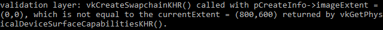

# Vulkan开发学习记录 06 - 交换链

## 简述

Vulkan 没有默认[帧缓冲](https://zhida.zhihu.com/search?content_id=217221942&content_type=Article&match_order=1&q=帧缓冲&zhida_source=entity)的概念，它需要一个能够缓冲渲染操作的组件。在Vulkan 中，这一组件就是[交换链](https://zhida.zhihu.com/search?content_id=217221942&content_type=Article&match_order=1&q=交换链&zhida_source=entity)。Vulkan 的交换链必须显式地创建，不存在默认的交换链。交换链本质上一个包含了若干等待呈现的图像的队列。
我们的应用程序从交换链获取一张图像，然后在图像上进行渲染操作，完成后，将图像返回到交换链的队列中。交换链的队列的工作方式和它呈现图像到表面的条件依赖于交换链的设置。但通常来说，交换链被用来同步
图像呈现和屏幕刷新。

### 检测交换链支持

并不是所有的[显卡](https://zhida.zhihu.com/search?content_id=217221942&content_type=Article&match_order=1&q=显卡&zhida_source=entity)设备都具有可以直接将图像呈现到屏幕的能力。比如，被设计用于服务器的显卡是没有任何显示输出设备的。此外，由于图像呈现非常依赖[窗口系统](https://zhida.zhihu.com/search?content_id=217221942&content_type=Article&match_order=1&q=窗口系统&zhida_source=entity)，以及和窗口系统有关的窗口表面，这些并非Vulkan 核心的一部分。使用交换链，我们必须保证VK_KHR_swapchain设备扩展被启用。


为了确保VK_KHR_swapchain设备扩展被设备支持，我们需要扩展VK_KHR_swapchain函数检测该扩展是否被支持。之前，我们已经介绍了列出VkPhysicalDevice对象支持的扩展列表的方法，现在只需要在这个列表中检测是否存在VK_KHR_swapchain扩展即可。Vulkan 的[头文件](https://zhida.zhihu.com/search?content_id=217221942&content_type=Article&match_order=1&q=头文件&zhida_source=entity)提供了一个VK_KHR_SWAPCHAIN_EXTENSION_NAME的宏，它等价于VK_KHR_swapchain。我们使用这个宏来做检测，而不直接使用VK_KHR_swapchain，可以保证代码具有更好的兼容性。


首先，我们定义所需的的设备扩展列表，这类似于我们之前定义的要启用的校验层列表。

```cpp
const std::vector<const char*> deviceExtensions = {
    VK_KHR_SWAPCHAIN_EXTENSION_NAME
};
```

接着，添加一个叫做checkDeviceExtensionSupport的函数，然后在isDeviceSuitable函数中调用它：

```cpp
bool isDeviceSuitable(VkPhysicalDevice device) {
    QueueFamilyIndices indices = findQueueFamilies(device);

    bool extensionsSupported = checkDeviceExtensionSupport(device);

    return indices.isComplete() && extensionsSupported;
}

bool checkDeviceExtensionSupport(VkPhysicalDevice device) {
    return true;
}
```

修改checkDeviceExtensionSupport函数的[函数体](https://zhida.zhihu.com/search?content_id=217221942&content_type=Article&match_order=1&q=函数体&zhida_source=entity)枚举设备扩展列表，检测所需的扩展是否存在：

```cpp
bool checkDeviceExtensionSupport(VkPhysicalDevice device) {
    uint32_t extensionCount;
    vkEnumerateDeviceExtensionProperties(device, nullptr, &extensionCount, nullptr);

    std::vector<VkExtensionProperties> availableExtensions(extensionCount);
    vkEnumerateDeviceExtensionProperties(device, nullptr, &extensionCount, availableExtensions.data());

    std::set<std::string> requiredExtensions(deviceExtensions.begin(), deviceExtensions.end());

    for (const auto& extension : availableExtensions) {
        requiredExtensions.erase(extension.extensionName);
    }

    return requiredExtensions.empty();
}
```

在这里，我们将所需的扩展保存在一个集合中，然后枚举所有可用的扩展，将集合中的扩展剔除，最后，如果这个集合中的元素为0，说明我们所需的扩展全部都被满足。实际上，如果设备支持呈现队列，那么它就一定支持交换链。但我们最好还是显式地进行交换链扩展的检测，然后显式地启用交换链扩展。

启用交换链扩展，只需要对逻辑设备的创建过程做很小地修改：

```cpp
createInfo.enabledExtensionCount = static_cast<uint32_t>(deviceExtensions.size());
createInfo.ppEnabledExtensionNames = deviceExtensions.data();
```

### 查询交换链支持细节

只检查交换链是否可用还不够，交换链可能与我们的窗口表面不兼容。 创建交换链所要进行的设置要比Vulkan 实例和设备创建多得多，在进行交换链创建之前需要我们查询更多的信息。

有三种最基本的属性，需要我们检查：

- 基础表面特性(交换链的最小/最大图像数量，最小/最大图像宽度、高度)
- 表面格式(像素格式，颜色空间)
- 可用的呈现模式

和findQueueFamilies函数类似，我们使用结构体来存储我们查询得到的交换链细节信息：

```cpp
struct SwapChainSupportDetails{
    VkSurfaceCapabilitiesKHR capabilities;
    std::vector<VkSurfaceFormatKHR> formats;
    std::vector<VkPresentModeKHR> presentModes;
};
```

现在，我们添加一个叫做querySwapChainSupport的函数用于填写上面的结构体：

```cpp
SwapChainSupportDetails querySwapChainSupport(VkPhysicalDevice device){
    SwapChainSupportDetails details;

    return details;
}
```

在本节，我们先介绍如何查询上面的结构体所包含的信息，在下一节再对它们的具体意义进行说明。

我们先查询基础表面特性。这一属性的查询非常简单，调用下面的函数即可：

```cpp
vkGetPhysicalDeviceSurfaceCapabilitiesKHR(device, surface, &details.capablities);
```

这一函数以VkPhysicalDevice对象和VkSurfaceKHR 作为参数来查询表面特性。与交换链信息查询有关的函数都需要这两个参数，它们是交换链的核心组件。

下一步，我们查询表面支持的格式。这一查询结果是一个结构体列表， 所以它的查询与之前设备特性查询类似，首先查询格式数量，然后分配[数组空间](https://zhida.zhihu.com/search?content_id=217221942&content_type=Article&match_order=1&q=数组空间&zhida_source=entity)查询具体信息：

```cpp
uint32_t formatCount;
vkGetPhysicalDeviceSurfaceFormatsKHR(device, surface, &formatCount, nullptr);

if (formatCount != 0) {
    details.formats.resize(formatCount);
    vkGetPhysicalDeviceSurfaceFormatsKHR(device, surface, &formatCount, details.formats.data());
}
```

确保[向量](https://zhida.zhihu.com/search?content_id=217221942&content_type=Article&match_order=1&q=向量&zhida_source=entity)的空间足以容纳所有格式结构体。最后，使用与调用`vkGetPhysicalDeviceSurfacePresentModesKHR`: 数同样的方式查询支持的呈现模式：

```cpp
uint32_t presentModeCount;
vkGetPhysicalDeviceSurfacePresentModesKHR(device, surface, &presentModeCount, nullptr);

if (presentModeCount != 0) {
    details.presentModes.resize(presentModeCount);
    vkGetPhysicalDeviceSurfacePresentModesKHR(device, surface, &presentModeCount, details.presentModes.data());
}
```

现在所有查询得到的信息已经存储在了结构体中，我可以再次扩展isDeviceSuitable 函数检测交换链的能力是否满足需求。对于我们的教程而言，我们只需要交换链至少支持一种图像格式和一种支持我们的窗口表面的呈现模式即可：

```cpp
bool swapChainAdequate = false;
if (extensionsSupported) {
    SwapChainSupportDetails swapChainSupport = querySwapChainSupport(device);
    swapChainAdequate = !swapChainSupport.formats.empty() && !swapChainSupport.presentModes.empty();
}
```

重要的是，我们仅在验证扩展可用后才尝试查询交换链支持。函数的最后一行变为：

```cpp
return indices.isComplete() && extensionsSupported && swapChainAdequate;
```

## 为交换链选择合适的设置

swapChainAdequate 为真，说明交换链的能力满足我们的需要，但仍有许多不同的优化模式需要设置。接下来，我们会编写一组函数来查找合适的设置。设置的内容如下：

- 表面格式（颜色深度）
- 演示模式（将图像“交换”到屏幕的条件）
- 交换范围（交换链中图像的分辨率）

对于上面的设置，每一个我们都有一个理想的值，如果这个理想的值 不能满足，我们会使用编写的逻辑查找一个尽可能好的[替代值](https://zhida.zhihu.com/search?content_id=217221942&content_type=Article&match_order=1&q=替代值&zhida_source=entity)。

### 表面格式

我们添加了一个叫做chooseSwapSurfaceFormat的函数来选择合适的表面格式：

```cpp
VkSurfaceFormatKHR chooseSwapSurfaceFormat(const std::vector<VkSurfaceFormatKHR>& availableFormats) {

}
```

每一个VkSurfaceFormatKHR 目包含了一个format 和colorSpace [成员变量](https://zhida.zhihu.com/search?content_id=217221942&content_type=Article&match_order=1&q=成员变量&zhida_source=entity)。format成员变量用于指定[颜色通道](https://zhida.zhihu.com/search?content_id=217221942&content_type=Article&match_order=1&q=颜色通道&zhida_source=entity)和存储类型。比如，如果format成员变量的值为VK_FORMAT_B8G8R8A8_SRGB 表示我们以R，G，B和A的顺序，每个颜色通道用8位[无符号整型](https://zhida.zhihu.com/search?content_id=217221942&content_type=Article&match_order=1&q=无符号整型&zhida_source=entity)数表示，总共每像素使用32位表示。

colorSpace成员变量用来表示SRGB颜色空间是否被支持，是否使用VK_COLOR_SPACE_SRGB_NONLINEAR_KHR。需要注意VK_COLOR_SPACE_SRGB_NONLINEAR_KHR 在之前的Vulkan 规范中叫做VK_COLORSPACE_SRGB_NONLINEAR_KHR。

对于颜色空间，如果SRGB被支持，我们就使用SRGB，使用它可以得到更加准确的颜色表示。直接使用SRGB颜色有很大挑战，所以我们使用RGB作为颜色格式，这一格式可以通过VK_FORMAT_B8G8R8A8_SRGB 宏指定。

让我们浏览一下列表，看看是否有首选组合：

```cpp
for (const auto& availableFormat : availableFormats) {
    if (availableFormat.format == VK_FORMAT_B8G8R8A8_SRGB && availableFormat.colorSpace == VK_COLOR_SPACE_SRGB_NONLINEAR_KHR) {
        return availableFormat;
    }
}
```

如果这也失败了，那么我们可以根据它们的“好”程度开始对可用格式进行排名，但在大多数情况下，只需使用指定的第一种格式就可以了。

```cpp
VkSurfaceFormatKHR chooseSwapSurfaceFormat(const std::vector<VkSurfaceFormatKHR>& availableFormats) {
    for (const auto& availableFormat : availableFormats) {
        if (availableFormat.format == VK_FORMAT_B8G8R8A8_SRGB && availableFormat.colorSpace == VK_COLOR_SPACE_SRGB_NONLINEAR_KHR) {
            return availableFormat;
        }
    }

    return availableFormats[0];
}
```

### 呈现模式

呈现模式可以说是交换链中最重要的设置。它决定了什么条件下图像 才会显示到屏幕。Vulkan 提供了四种可用的呈现模式：

- VK_PRESENT_MODE_IMMEDIATE_KHR：您的应用程序提交的图像会立即转移到屏幕上，这可能会导致撕裂。
- VK_PRESENT_MODE_FIFO_KHR：交换链是一个队列，当显示器刷新时，显示器从队列的前面获取图像，程序将渲染的图像插入到队列的后面。如果队列已满，则程序必须等待。这与现代游戏中的垂直同步最为相似。刷新显示的那一刻称为“垂直空白”。
- VK_PRESENT_MODE_FIFO_RELAXED_KHR：此模式仅在应用程序迟到并且队列在最后一个垂直空白处为空的情况下与前一种模式不同。图像最终到达时立即传输，而不是等待下一个垂直空白。这可能会导致明显的撕裂。
- VK_PRESENT_MODE_MAILBOX_KHR: 这是第二种模式的另一种变体。队列已满时不会阻塞应用程序，而是将已排队的图像简单地替换为较新的图像。此模式可用于尽可能快地渲染帧，同时仍避免撕裂，与标准垂直同步相比，延迟问题更少。这就是俗称的“[三重缓冲](https://zhida.zhihu.com/search?content_id=217221942&content_type=Article&match_order=1&q=三重缓冲&zhida_source=entity)”，虽然单独存在三个缓冲并不一定意味着帧率是解锁的。

只有VK_PRESENT_MODE_FIFO_KHR模式保证可用，所以我们必须再次编写一个函数来寻找可用的最佳模式

```cpp
VkPresentModeKHR chooseSwapPresentMode(const std::vector<VkPresentModeKHR>& availablePresentModes) {
    return VK_PRESENT_MODE_FIFO_KHR;
}
```

作者个人认为三倍缓冲综合来说表现最佳。三倍缓冲避免了撕裂现象， 同时具有较低的延迟。我们检查用于实现三倍缓冲的VK_PRESENT_MODE_FIFO_KHR模式是否可用，可用的话，就使用它：

```cpp
 VkPresentModeKHR chooseSwapPresentMode(const std::vector<VkPresentModeKHR>& availablePresentModes) {
    for (const auto& availablePresentMode : availablePresentModes) {
        if (availablePresentMode == VK_PRESENT_MODE_MAILBOX_KHR) {
            return availablePresentMode;
        }
    }

    return VK_PRESENT_MODE_FIFO_KHR;
}
```

### 交换范围

只剩下一个主要属性，我们将为此添加最后一个函数：

```cpp
VkExtent2D chooseSwapExtent(const VkSurfaceCapabilitiesKHR& capabilities) {

}
```

交换范围是交换链中图像的分辨率，它几乎总是和我们要显示图像的窗口的分辨率相同。VkSurfaceCapabilitiesKHR 结构体定义了可用的分辨率范围。Vulkan通过currentExtent成员变量来告知适合我们窗口的交换范围。一些窗口系统会使用一个特殊值，uint32_t 变量类型的最大值，表示允 许我们自己选择对于窗口最合适的交换范围，但我们选择的交换范围需要在minImageExtent与maxImageExtent的范围内。

```cpp
#include <cstdint> // Necessary for uint32_t
#include <limits> // Necessary for std::numeric_limits
#include <algorithm> // Necessary for std::clamp

...

VkExtent2D chooseSwapExtent(const VkSurfaceCapabilitiesKHR& capabilities) {
    if (capabilities.currentExtent.width != std::numeric_limits<uint32_t>::max()) {
        return capabilities.currentExtent;
    } else {
        int width, height;
        glfwGetFramebufferSize(window, &width, &height);

        VkExtent2D actualExtent = {
            static_cast<uint32_t>(width),
            static_cast<uint32_t>(height)
        };

        actualExtent.width = std::clamp(actualExtent.width, capabilities.minImageExtent.width, capabilities.maxImageExtent.width);
        actualExtent.height = std::clamp(actualExtent.height, capabilities.minImageExtent.height, capabilities.maxImageExtent.height);

        return actualExtent;
    }
}
```

代码中max和min函数用于在允许的范围内选择交换范围的高度值和宽 度值，需要在源文件中包含algorithm头文件才能够使用它们。

### 创建交换链

现在，我们已经编写了大量辅助函数帮助我们在应用程序运行时选择最合适的设置，可以开始进行交换链的创建了。

我们添加一个叫做createSwapChain的函数，它会选择合适的交换链设 置，然后，我们在InitVulkan函数中在逻辑设备创建之后调用它：

```cpp
void initVulkan() {
    createInstance();
    setupDebugMessenger();
    createSurface();
    pickPhysicalDevice();
    createLogicalDevice();
    createSwapChain();
}

void createSwapChain() {
    SwapChainSupportDetails swapChainSupport = querySwapChainSupport(physicalDevice);

    VkSurfaceFormatKHR surfaceFormat = chooseSwapSurfaceFormat(swapChainSupport.formats);
    VkPresentModeKHR presentMode = chooseSwapPresentMode(swapChainSupport.presentModes);
    VkExtent2D extent = chooseSwapExtent(swapChainSupport.capabilities);
}
```

除了这些属性之外，我们还必须决定我们希望在交换链中拥有多少张图像。该实现指定了它运行所需的最小数量：

```cpp
uint32_t imageCount = swapChainSupport.capabilities.minImageCount;
```

然而，坚持这个最小值意味着我们有时可能必须等待[驱动程序](https://zhida.zhihu.com/search?content_id=217221942&content_type=Article&match_order=1&q=驱动程序&zhida_source=entity)完成内部操作，然后才能获取另一个要渲染的图像。因此，建议至少请求一个比最小值多的图像：

```cpp
uint32_t imageCount = swapChainSupport.capabilities.minImageCount + 1;
```

我们还应该确保在执行此操作时不超过最大图像数量，其中`0`是一个特殊值，表示没有最大值：

```cpp
if (swapChainSupport.capabilities.maxImageCount > 0 && imageCount > swapChainSupport.capabilities.maxImageCount) {
    imageCount = swapChainSupport.capabilities.maxImageCount;
}
```

和其它Vulkan 对象相同，创建交换链对象需要填写一个包含大量信息的结构体。这一结构体的一些成员我们已经非常熟悉：

```cpp
VkSwapchainCreateInfoKHR createInfo{};
createInfo.sType = VK_STRUCTURE_TYPE_SWAPCHAIN_CREATE_INFO_KHR;
createInfo.surface = surface;
```

在指定交换链应绑定到哪个表面后，指定交换链图像的详细信息：

```cpp
createInfo.minImageCount = imageCount;
createInfo.imageFormat = surfaceFormat.format;
createInfo.imageColorSpace = surfaceFormat.colorSpace;
createInfo.imageExtent = extent;
createInfo.imageArrayLayers = 1;
createInfo.imageUsage = VK_IMAGE_USAGE_COLOR_ATTACHMENT_BIT;
```

imageArrayLayers指定每个图像包含的层数。通常，来 说它的值为1，但对于VR 相关的应用程序来说，会使用更多的层次。。imageUsage成员变量用于指定我们将在图像上进行怎样的操作。在本教程，我们在图像 上进行绘制操作，也就是将图像作为一个颜色附着来使用。如果读者需要对图像进行后期处理之类的操作，可以使用VK_IMAGE_USAGE_TRANSFER_DST_BIT作为imageUsage成员变量的值，让交换链图像可以作为传输的目的图像。

```cpp
QueueFamilyIndices indices = findQueueFamilies(physicalDevice);
uint32_t queueFamilyIndices[] = {indices.graphicsFamily.value(), indices.presentFamily.value()};

if (indices.graphicsFamily != indices.presentFamily) {
    createInfo.imageSharingMode = VK_SHARING_MODE_CONCURRENT;
    createInfo.queueFamilyIndexCount = 2;
    createInfo.pQueueFamilyIndices = queueFamilyIndices;
} else {
    createInfo.imageSharingMode = VK_SHARING_MODE_EXCLUSIVE;
    createInfo.queueFamilyIndexCount = 0; // Optional
    createInfo.pQueueFamilyIndices = nullptr; // Optional
}
```

接着，我们需要指定在多个队列族使用交换链图像的方式。这一设置 对于图形队列和呈现队列不是同一个队列的情况有着很大影响。我们通过 图形队列在交换链图像上进行绘制操作，然后将图像提交给呈现队列来显示。有两种控制在多个队列访问图像的方式：

- VK_SHARING_MODE_EXCLUSIVE：图像一次由一个队列族拥有，并且在将其用于另一个队列族之前，必须明确转移所有权。此选项提供最佳性能。
- VK_SHARING_MODE_CONCURRENT：图像可以在多个队列族中使用，无需显式所有权转移。

如果图形和呈现不是同一个队列族，我们使用协同模式来避免处理图像所有权问题。协同模式需要我们使用queueFamilyIndexCount和`pQueueFamilyIndices`来指定共享所有权的队列族。如果图形队列族和呈现队列族是同一个队列族(大部分情况下都是这样)，我们就不能使用协同模式，协同模式需要我们指定至少两个不同的队列族。

```cpp
createInfo.preTransform = swapChainSupport.capabilities.currentTransform;
```

我们可以为交换链中的图像指定一个固定的变换操作(需要交换链具有supportedTransforms特性)，比如顺时针旋转90度或是水平翻转。如果读者不需要进行任何变换操作，指定使用扣扵currentTransform变换即可。

```cpp
createInfo.compositeAlpha = VK_COMPOSITE_ALPHA_OPAQUE_BIT_KHR;
```

compositeAlpha成员变量用于指定[alpha通道](https://zhida.zhihu.com/search?content_id=217221942&content_type=Article&match_order=1&q=alpha通道&zhida_source=entity)是否被用来和窗口系统中 的其它窗口进行混合操作。通常，我们将其设置为VK_COMPOSITE_ALPHA_OPAQUE_BIT_KHR忽略掉alpha通道。

```cpp
createInfo.presentMode = presentMode;
createInfo.clipped = VK_TRUE;
```

presentMode成员变量用于设置呈现模式。clipped成员变量被设置为`VK_TRUE`then表 示我们不关心被窗口系统中的其它窗口遮挡的像素的颜色，这允许Vulkan 采取一定的优化措施，但如果我们回读窗口的像素值就可能出现问题。

```cpp
createInfo.oldSwapchain = VK_NULL_HANDLE;
```

最后是oldSwapChain成员变量，需要指定它，是因为应用程序在运行过程中交换链可能会失效。比如，改变窗口大小后，交换链需要重建，重建时需要之前的交换链，具体细节，我们会在之后的章节详细介绍。现在， 我们还没有创建任何一个交换链，将它设置为VK_NULL_HANDLE即可。 添加一个VkSwapchainKHR成员变量来存储交换链：

```cpp
VkSwapchainKHR swapChain;
```

调用vkCreateSwapChainKHR 函数创建交换链：

```cpp
if (vkCreateSwapchainKHR(device, &createInfo, nullptr, &swapChain) != VK_SUCCESS) {
    throw std::runtime_error("failed to create swap chain!");
}
```

vkCreateSwapChainKHR函数的参数依次是逻辑设备对象，交换链创建信息，可选的自定义内存分配器和用于存储返回的交换链对象的[内存地址](https://zhida.zhihu.com/search?content_id=217221942&content_type=Article&match_order=1&q=内存地址&zhida_source=entity)。接着，我们需要在cleanup函数中在逻辑设备被清除前调用vkDestroySwapchainKHR函数来清除交换链对象：

```cpp
void cleanup() {
    vkDestroySwapchainKHR(device, swapChain, nullptr);
    ...
}
```

现在可以编译运行程序，确保我们成功地创建了交换链。如果vkDestroySwapchainKHR[函数调用](https://zhida.zhihu.com/search?content_id=217221942&content_type=Article&match_order=1&q=函数调用&zhida_source=entity)出现错误，那么，就移除createInfo.imageExtent = extent 这行代码， 然后，启用校验层，编译运行程序，就可以捕获错误，得到一些有用地信息：



### 获取交换链图像

我们已经创建了交换链，接下来需要做地就是获取交换链图像的图像句柄。我们会在之后使用这些图像句柄进行渲染操作。现在，添加成员变量用于存储这些图像句柄：

```cpp
std::vector<VkImage> swapChainImages;
```

交换链图像由交换链自己负责创建，并在交换链清除时自动被清除， 不需要我们自己进行创建和清除操作。

我们在`createSwapChain`函数的尾部，vkCreateSwapchainKHR函数调用之后，添加代码来获取交换链图像句柄。获取它们的方法和获取其它Vulkan 对象的方法类似，首先获取交换链图像的数量，然后分配数组空间，获取交换链图像句柄。

```cpp
vkGetSwapchainImagesKHR(device, swapChain, &imageCount, nullptr);
swapChainImages.resize(imageCount);
vkGetSwapchainImagesKHR(device, swapChain, &imageCount, swapChainImages.data()); 
```

我们在创建交换链时指定了一个minImageCount 成员变量来请求最小需要的交换链图像数量。Vulkan 的具体实现可能会创建比这个最小交换链图像数量更多的交换链图像，我们在这里，我们仍然需要显式地查询交换链图像数量，确保不会出错。

最后，在成员变量中存储我们设置的交换链图像格式和范围，我们会在之后的章节使用它们。

```cpp
VkSwapchainKHR swapChain;
std::vector<VkImage> swapChainImages;
VkFormat swapChainImageFormat;
VkExtent2D swapChainExtent;

...

swapChainImageFormat = surfaceFormat.format;
swapChainExtent = extent;
```

现在，我们已经拥有了可以进行绘制操作的交换链图像，以及可以呈现图像的窗口表面。

## 工程链接

[https://github.com/Kirkice/JourneyThroughVulkangithub.com/Kirkice/JourneyThroughVulkan](https://github.com/Kirkice/JourneyThroughVulkan)

