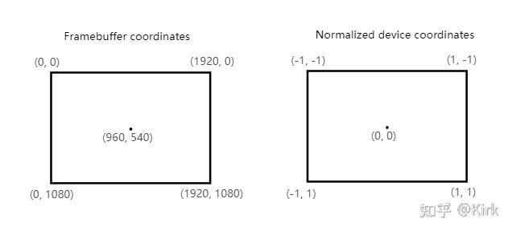
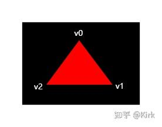
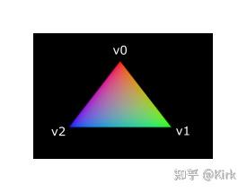

# Vulkan开发学习记录 08 - 着色器模块

## 简述

和之前的一些图形API不同，Vulkan使用的着色器代码格式是一种叫做SPIR-V的[字节码](https://zhida.zhihu.com/search?content_id=217784977&content_type=Article&match_order=1&q=字节码&zhida_source=entity)，这一字节码格式可以在Vulkan和OpenCL使用。可以用它来编写图形和计算[着色器](https://zhida.zhihu.com/search?content_id=217784977&content_type=Article&match_order=2&q=着色器&zhida_source=entity)，我们将它用于编写图形管线的着色器。

GPU厂商的编译器将字节码转换为原生代码的工作复杂度远远低于直接编译较高级的类C代码。过去的经验告诉我们使用类C代码，比如GLSL或者HLSL着色器代码，会因为不同GPU厂商对代码的不同解释而造成大量问题， 并且类C代码的编译器实现要比字节码编译器复杂的多，GPU厂商实现的编译器也极有可能存在错误，不同GPU厂商的实现也差异巨大。而使用字节码格式，上述的这些问题可以在极大程度上减少。

虽然，Vulkan使用字节码格式作为着色器代码，但这并不意味着我们要直接书写字节码来编写着色器。Khronos发布了一个独立于厂商的可以将GLSL代码转换为SPIR-V字节码的[编译器](https://zhida.zhihu.com/search?content_id=217784977&content_type=Article&match_order=5&q=编译器&zhida_source=entity)。这个编译器可以验证我们的着色器代码是否完全符合标准，将GLSL代码转换为SPIR-V字节码。我们可以在应用程序运行时调用这个编译器，动态生成SPIR-V字节码，但在本教程，我们没有这样做。这一编译器已经被包含在LunarG的Vulkan SDK中，编译器[可执行文件](https://zhida.zhihu.com/search?content_id=217784977&content_type=Article&match_order=1&q=可执行文件&zhida_source=entity)名称为glslangVaildator.exe。

## [顶点着色器](https://zhida.zhihu.com/search?content_id=217784977&content_type=Article&match_order=1&q=顶点着色器&zhida_source=entity)

顶点着色器对输入的每个顶点进行处理。它可以接收顶点属性作为输入，比如世界坐标，颜色，[法线](https://zhida.zhihu.com/search?content_id=217784977&content_type=Article&match_order=1&q=法线&zhida_source=entity)和纹理坐标。它的输出包括顶点最终的[裁剪坐标](https://zhida.zhihu.com/search?content_id=217784977&content_type=Article&match_order=1&q=裁剪坐标&zhida_source=entity)和需要传递给片段着色器的顶点属性，比如颜色和[纹理坐标](https://zhida.zhihu.com/search?content_id=217784977&content_type=Article&match_order=2&q=纹理坐标&zhida_source=entity)。这些值会被插值处理后传给顶点着色器。

裁剪坐标是一个来自顶点着色器的[四维向量](https://zhida.zhihu.com/search?content_id=217784977&content_type=Article&match_order=1&q=四维向量&zhida_source=entity)，它的四个成分会被除以第四个成分来完成规范化。规范化后的坐标被映射到帧缓冲的[坐标空间](https://zhida.zhihu.com/search?content_id=217784977&content_type=Article&match_order=1&q=坐标空间&zhida_source=entity)，如下图所示：



注意这里的Y坐标和OpenGL的Y坐标是相反方向的，Z坐标现在的范围和Direct X相同，为0到1。

对于我们的要绘制的三角形，不需要使用任何变换操作，我们直接将三角形的三个顶点的坐标作为规范化设备坐标来生成下图的三角形：



我们可以直接将顶点着色器输出的裁剪坐标的第四个成分设置为1，然后作为规范设备坐标。这样裁剪坐标到规范设备坐标就不会对坐标进行任何变换。

通常，顶点坐标被存储在一个[顶点缓冲](https://zhida.zhihu.com/search?content_id=217784977&content_type=Article&match_order=1&q=顶点缓冲&zhida_source=entity)中，但对于Vulkan来说，创建顶点缓冲，然后填入数据要进行很多操作。为了尽快让我们的三角形显示在屏幕上，我们暂时先直接将顶点坐标写入顶点着色器，就像这样：

```glsl
#version 450

vec2 positions[3] = vec2[](
    vec2(0.0, -0.5),
    vec2(0.5, 0.5),
    vec2(-0.5, 0.5)
);

void main() {
    gl_Position = vec4(positions[gl_VertexIndex], 0.0, 1.0);
}
```

着色器的[main函数](https://zhida.zhihu.com/search?content_id=217784977&content_type=Article&match_order=1&q=main函数&zhida_source=entity)对于每个顶点执行一次。GLSL内建的gl_VertexIndex变量包含了当前顶点的索引。这一索引通常来说是用来引用顶点缓冲中的顶点数据，但在这里，我们用它来引用我们在着色器中[硬编码](https://zhida.zhihu.com/search?content_id=217784977&content_type=Article&match_order=1&q=硬编码&zhida_source=entity)的顶点数据。 我们输出的裁剪坐标由代码中的positions数组给出了前两个成分，剩余两个成分被我们设置为了0.0和1.0。为了让着色器代码可以在Vulkan下工作， 我们需要使用GL_ARB_separate_shader_objects扩展。

## [片段着色器](https://zhida.zhihu.com/search?content_id=217784977&content_type=Article&match_order=2&q=片段着色器&zhida_source=entity)

我们的三角形由来自顶点着色器的三个顶点作为三角形的顶点构成， 这一三角形范围内的屏幕像素会被使用片段着色器处理后的片段进行填充。 一个非常简单的直接将片段颜色设置为红色的片段着色器代码如下所示:

```glsl
#version 450

layout(location = 0) out vec4 outColor;

void main() {
    outColor = vec4(1.0, 0.0, 0.0, 1.0);
}
```

对于每个片段着色器的main函数执行一次。GLSL的颜色是一个具有四个分量的向量，分别对应R，G，B和A通道，分量的取值范围为[0,1]。 和顶点着色器不同，片段着色器没有类似gl_Position这样的内建变量可以用于输出当前处理的片段的颜色。我们必须自己为每个使用的帧缓冲指定对应的输出变量。上面代码中的layout(location = 0)用于指定与颜色变量相关联的帧缓冲，颜色变量的颜色数据会被写入与它相关联的帧缓冲中。上面的代码，我们将红色写入和索引为0的帧缓冲相关联的颜色变量outColor。

## 逐顶点着色

整个三角形都是红色，看上去一点都不好玩，接下来，让我们尝试把 三角形变成下面这个样子：



我们需要对之前编写的顶点着色器和片段着色器进行修改才能得到上图的效果。首先，我们需要为三角形的每个顶点指定不同的颜色，我们在顶点着色器中添加一个颜色数组：

```glsl
vec3 colors[3] = vec3[](
    vec3(1.0, 0.0, 0.0),
    vec3(0.0, 1.0, 0.0),
    vec3(0.0, 0.0, 1.0)
);
```

现在，我们只需要将顶点的颜色传递给片段着色器，由片段着色器将颜色值输出到帧缓冲上。在顶点着色器中添加颜色输出变量，并在main函数中写入颜色值到颜色输出变量：

```glsl
layout(location = 0) out vec3 fragColor;

void main() {
    gl_Position = vec4(positions[gl_VertexIndex], 0.0, 1.0);
    fragColor = colors[gl_VertexIndex];
}
```

接着，我们在片段着色器中添加对应的输入变量：

```glsl
layout(location = 0) in vec3 fragColor;

void main() {
    outColor = vec4(fragColor, 1.0);
}
```

一组对应的输入和输出变量可以使用不同的变量名称，编译器可以通过定义它们时使用的location将它们对应起来。片段着色器的main函数现在被我们修改为输出输入的颜色变量作为片段颜色。三角形除了顶点之外的片段颜色会被插值处理。

## 编译着色器

现在，让我们在项目目录下创建一个叫做shaders的文件夹，然后在其 中添加一个叫shader.vert的保存有顶点着色器代码的文件，以及一个叫shader.frag的保存有片段着色器代码的文件。GLSL并没有规定着色器文件应该使用的扩展名称，上面使用的扩展名名称来源于习惯。

```glsl
#version 450

layout(location = 0) out vec3 fragColor;

vec2 positions[3] = vec2[](
    vec2(0.0, -0.5),
    vec2(0.5, 0.5),
    vec2(-0.5, 0.5)
);

vec3 colors[3] = vec3[](
    vec3(1.0, 0.0, 0.0),
    vec3(0.0, 1.0, 0.0),
    vec3(0.0, 0.0, 1.0)
);

void main() {
    gl_Position = vec4(positions[gl_VertexIndex], 0.0, 1.0);
    fragColor = colors[gl_VertexIndex];
}
```

shader.frag文件的内容如下：

```glsl
#version 450

layout(location = 0) in vec3 fragColor;

layout(location = 0) out vec4 outColor;

void main() {
    outColor = vec4(fragColor, 1.0);
}
```

接下来，我们使用glslangValidator来将着色器代码编译为SPIR-V字节码格式。

**Windows**

创建一个compile.[bat文件](https://zhida.zhihu.com/search?content_id=217784977&content_type=Article&match_order=1&q=bat文件&zhida_source=entity)，它的内容如下：

```text
C:/VulkanSDK/x.x.x.x/Bin32/glslc.exe shader.vert -o vert.spv
C:/VulkanSDK/x.x.x.x/Bin32/glslc.exe shader.frag -o frag.spv
pause
```

需要将上面代码中glslangValidator.exe的文件路径替换为自己的glslangValidator.exe所在的文件路径。双击运行这个文件，就可以完成着色器代码的编译。

## 载入着色器

我们已经得到了SPIR-V格式的着色器字节码文件，现在需要在应用程序中载入字节码文件。为了完成这项工作，我们首先编写一个用于载入[二进制文件](https://zhida.zhihu.com/search?content_id=217784977&content_type=Article&match_order=1&q=二进制文件&zhida_source=entity)的辅助函数。

```cpp
#include <fstream>

...

static std::vector<char> readFile(const std::string& filename) {
    std::ifstream file(filename, std::ios::ate | std::ios::binary);

    if (!file.is_open()) {
        throw std::runtime_error("failed to open file!");
    }
}
```

readFile函数会读取指定文件的所有字节，然后将数据保存在std::vector数组返回给调用者。上面代码中我们使用了下面两个模式打开文件：

- ate：从文件尾部开始读取
- binary：以二进制的形式读取文件(避免进行诸如行末格式是\n还是\r\n的转换)

使用ate模式，从文件尾部开始读取的原因是，我们可以根据读取位置确定文件的大小，然后分配足够的数组空间来容纳数据：

```cpp
size_t fileSize = (size_t) file.tellg();
std::vector<char> buffer(fileSize);
```

分配好足够的数组空间后，我们可以跳到文件头部，读取整个文件：

```cpp
file.seekg(0);
file.read(buffer.data(), fileSize);
```

最后，关闭文件，返回数据数组：

```cpp
file.close();

return buffer;
```

现在，我们可以在createGraphicsPipeline函数中调用readFile函数来完成着色器字节码的读取：

```cpp
 void createGraphicsPipeline() {
    auto vertShaderCode = readFile("shaders/vert.spv");
    auto fragShaderCode = readFile("shaders/frag.spv");
}
```

我们可以通过比较打印出的分配的数组大小和实际的文件大小，确保着色器字节码被正确载入。

## 创建着色器模块

要将着色器字节码在管线上使用，还需要使用VkShaderModule对象。 让我们添加一个叫做createShaderModule的函数来完成VkShaderModule对象的创建：

```cpp
 VkShaderModule createShaderModule(const std::vector<char>& code) {

}
```

createShaderModule函数使用我们读取的着色器字节码数组作为参数来创建VkShaderModule对象。

创建着色器模块非常简单，只需要通过VkShaderModuleCreateInfo结构体指定存储字节码的数组和数组长度即可。但需要注意一点，我们需要先将存储字节码的[数组指针](https://zhida.zhihu.com/search?content_id=217784977&content_type=Article&match_order=1&q=数组指针&zhida_source=entity)转换为const uint32_t* 变量类型，来匹配结构体中的字节码指针的变量类型。这里，我们使用C++的reinterpret_cast完成 变量[类型转换](https://zhida.zhihu.com/search?content_id=217784977&content_type=Article&match_order=1&q=类型转换&zhida_source=entity)。此外，我们指定的指针指向的地址应该符合uint32_t变量类型的[内存对齐](https://zhida.zhihu.com/search?content_id=217784977&content_type=Article&match_order=1&q=内存对齐&zhida_source=entity)方式。我们这里使用的std::vector，它的默认分配器分配的内存的地址符合这一要求。

```cpp
VkShaderModuleCreateInfo createInfo{};
createInfo.sType = VK_STRUCTURE_TYPE_SHADER_MODULE_CREATE_INFO;
createInfo.codeSize = code.size();
createInfo.pCode = reinterpret_cast<const uint32_t*>(code.data());
```

接着，我们调用vkCreateShaderModule函数创建VkShaderModule对象：

```cpp
VkShaderModule shaderModule;
if (vkCreateShaderModule(device, &createInfo, nullptr, &shaderModule) != VK_SUCCESS) {
    throw std::runtime_error("failed to create shader module!");
}
```

和之前调用其它创建Vulkan对象的函数相同，调用vkCreateShaderModule函数需要逻辑设备对象，指向要创建对象信息的结构体，可选的自定义分配器以及用于存储返回的创建的对象句柄的[内存地址](https://zhida.zhihu.com/search?content_id=217784977&content_type=Article&match_order=1&q=内存地址&zhida_source=entity)。调用vkCreateShaderModule函数后，我们就可以立即释放掉存储着色器字节码的数组内存。最后，不要忘记返回创建的着色器模块对象：

```cpp
 return shaderModule;
```

着色器模块对象只在管线创建时需要，所以，不需要将它定义为一个[成员变量](https://zhida.zhihu.com/search?content_id=217784977&content_type=Article&match_order=1&q=成员变量&zhida_source=entity)，我们将它作为一个局部变量定义在createGraphicsPipeline函数中：

```cpp
void createGraphicsPipeline() {
    auto vertShaderCode = readFile("shaders/vert.spv");
    auto fragShaderCode = readFile("shaders/frag.spv");

    VkShaderModule vertShaderModule = createShaderModule(vertShaderCode);
    VkShaderModule fragShaderModule = createShaderModule(fragShaderCode);
```

我们需要在createGraphicsPipeline函数返回前，也就是createGraphicsPipeline函数的尾部，清除创建的着色器模块对象：

```cpp
    ...
    vkDestroyShaderModule(device, fragShaderModule, nullptr);
    vkDestroyShaderModule(device, vertShaderModule, nullptr);
}
```

## 创建着色器阶段

VkShaderModule对象只是一个对着色器字节码的包装。我们还需要指定它们在管线处理哪一阶段被使用。指定着色器阶段需要使用VkPipelineShaderStageCreateInfo结构体。

我们首先在createGraphicsPipeline函数中为顶点着色器填写VkPipelineShaderStageCreateInfo结构体信息：

```cpp
VkPipelineShaderStageCreateInfo vertShaderStageInfo{};
vertShaderStageInfo.sType = VK_STRUCTURE_TYPE_PIPELINE_SHADER_STAGE_CREATE_INFO;
vertShaderStageInfo.stage = VK_SHADER_STAGE_VERTEX_BIT;
```

上面代码，我们首先填写了sType成员变量，然后指定了着色器在管线的哪一阶段被使用。每个可编程阶段都有一个对应这一阶段的枚举值，我们使用这一枚举值指定着色器被使用的阶段。

```cpp
vertShaderStageInfo.module = vertShaderModule;
vertShaderStageInfo.pName = "main";
```

module成员变量用于指定阶段使用的着色器模块对象，pName成员变量用于指定阶段调用的着色器函数。我们可以通过使用不同pName在同一份着色器代码中实现所有需要的着色器，比如在同一份代码中实现多个片段着色器，然后通过不同的pName调用它们。

VkPipelineShaderStageCreateInfo还有一个可选的成员变量pSpecializationInfo， 在这里，我们没有使用它，但这一成员变量非常值得我们在这里对它进行说明，我们可以通过这一成员变量指定着色器用到的常量，我们可以 对同一个着色器模块对象指定不同的着色器常量用于管线创建，这使得编译器可以根据指定的着色器常量来消除一些条件分支，这比在渲染时，使用变量配置着色器带来的效率要高得多。如果不使用着色器常量，可以将pSpecializationInfo成员变量设置为nullptr。

接下来，填写用于片段着色器的VkPipelineShaderStageCreateInfo扯结构体：

```cpp
VkPipelineShaderStageCreateInfo fragShaderStageInfo{};
fragShaderStageInfo.sType = VK_STRUCTURE_TYPE_PIPELINE_SHADER_STAGE_CREATE_INFO;
fragShaderStageInfo.stage = VK_SHADER_STAGE_FRAGMENT_BIT;
fragShaderStageInfo.module = fragShaderModule;
fragShaderStageInfo.pName = "main";
```

最后，我们定义包含上面定义的两个结构体的VkPipelineShaderStageCreateInfo数组，我们会在之后使用这一数组在管线创建时引用这两个结构体。

```cpp
VkPipelineShaderStageCreateInfo shaderStages[] = {vertShaderStageInfo, fragShaderStageInfo};
```

我们已经完成了管线的可编程阶段的设置。

## 工程链接

[https://github.com/Kirkice/JourneyThroughVulkangithub.com/Kirkice/JourneyThroughVulkan](https://github.com/Kirkice/JourneyThroughVulkan)

