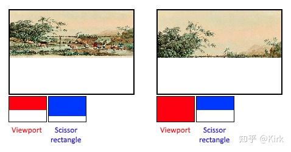

# Vulkan开发学习记录 09 - 固定功能

## 简述

之前的许多图形API会为管线提供一些默认的状态。在Vulkan不存在默认状态，所有状态必须被显式地设置，无论是视口大小，还是使用的颜色混合函数都需要显式地指定。

### 动态状态

只有非常有限的管线状态可以在不重建管线的情况下进行动态修改。 这包括视口大小，线宽和混合常量。我们可以通过填写VkPipelineDynamicStateCreateInfo扯结构体指定需要动态修改的状态，比如像这样：

```cpp
std::vector<VkDynamicState> dynamicStates = {
    VK_DYNAMIC_STATE_VIEWPORT,
    VK_DYNAMIC_STATE_SCISSOR
};

VkPipelineDynamicStateCreateInfo dynamicState{};
dynamicState.sType = VK_STRUCTURE_TYPE_PIPELINE_DYNAMIC_STATE_CREATE_INFO;
dynamicState.dynamicStateCount = static_cast<uint32_t>(dynamicStates.size());
dynamicState.pDynamicStates = dynamicStates.data();
```

这样设置后会导致我们之前对这里使用的动态状态的设置被忽略掉， 需要我们在进行绘制时重新指定它们的值。有关这一问题的细节。如果我们不需要管线创建后进行任何状态的动态修改，可以将设置这一结构体指针的[成员变量](https://zhida.zhihu.com/search?content_id=217931869&content_type=Article&match_order=1&q=成员变量&zhida_source=entity)设置为nullptr。

### 顶点输入

我们可以使用VkPipelineVertexInputState结构体来描述传递给[顶点着色器](https://zhida.zhihu.com/search?content_id=217931869&content_type=Article&match_order=1&q=顶点着色器&zhida_source=entity)的顶点数据格式。描述内容主要包括下面两个方面：

- 绑定：数据之间的间距和数据是按[逐顶点](https://zhida.zhihu.com/search?content_id=217931869&content_type=Article&match_order=1&q=逐顶点&zhida_source=entity)的方式还是按逐实例的方式进行组织。
- 属性描述：传递给顶点着色器的属性类型，用于将属性绑定到顶点着色器中的变量。

由于我们直接在顶点着色器中硬编码顶点数据，所以我们填写结构体信息时指定不载入任何顶点数据。

```cpp
VkPipelineVertexInputStateCreateInfo vertexInputInfo{};
vertexInputInfo.sType = VK_STRUCTURE_TYPE_PIPELINE_VERTEX_INPUT_STATE_CREATE_INFO;
vertexInputInfo.vertexBindingDescriptionCount = 0;
vertexInputInfo.pVertexBindingDescriptions = nullptr; // Optional
vertexInputInfo.vertexAttributeDescriptionCount = 0;
vertexInputInfo.pVertexAttributeDescriptions = nullptr; // Optional
```

pVertexBindingDescriptions和pVertexAttributeDescriptions成员变量用于指向描述顶点数据组织信息地[结构体数组](https://zhida.zhihu.com/search?content_id=217931869&content_type=Article&match_order=1&q=结构体数组&zhida_source=entity)。我们在createGraphicsPipeline函数中的shaderStages数组定义之后定义这一结构体。

### 输入装配

VkPipelineInputAssemblyStateCreateInfo 结构体用于描述两个信息：顶点数据定义了哪种类型的[几何图元](https://zhida.zhihu.com/search?content_id=217931869&content_type=Article&match_order=1&q=几何图元&zhida_source=entity)，以及是否启用几何图元重启。前一个信息通过topology成员变量指定，它的值可以是下面这些：

- VK_PRIMITIVE_TOPOLOGY_POINT_LIST：点图元
- VK_PRIMITIVE_TOPOLOGY_LINE_LIST：每两个顶点构成一个线段图元
- VK_PRIMITIVE_TOPOLOGY_LINE_STRIP：每两个顶点构成一个线段图元，除第一个线段图元外，每个线段图元使用上一个线段图元 的一个顶点。
- VK_PRIMITIVE_TOPOLOGY_TRIANGLE_LIST：每三个顶点构成 一个三角形图元。
- VK_PRIMITIVE_TOPOLOGY_TRIANGLE_STRIP：每个三角形的 第二个和第三个顶点被下一个三角形作为第一和第二个顶点使用。

一般而言，我们会通过[索引缓冲](https://zhida.zhihu.com/search?content_id=217931869&content_type=Article&match_order=1&q=索引缓冲&zhida_source=entity)来更好地复用顶点缓冲中的顶点数据。 如果将`primitiveRestartEnable`成员变量的值设置为VK_TRUE，那么如果使用带有_STRIP结尾的图元类型，可以通过一个特殊索引值0xFFFF或0xFFFFFFFF达到重启图元的目的（从特殊索引值之后的索引重置为图元的第一个顶点）。

我们的目的是绘制三角形，可以按照下面代码填写结构体：

```cpp
VkPipelineInputAssemblyStateCreateInfo inputAssembly{};
inputAssembly.sType = VK_STRUCTURE_TYPE_PIPELINE_INPUT_ASSEMBLY_STATE_CREATE_INFO;
inputAssembly.topology = VK_PRIMITIVE_TOPOLOGY_TRIANGLE_LIST;
inputAssembly.primitiveRestartEnable = VK_FALSE;
```

### 视口和裁剪

视口用于描述被用来输出渲染结果的帧缓冲区域。一般而言，会将它设置为（0，0）到（width，height），我们也采取这一设置：

```cpp
VkViewport viewport{};
viewport.x = 0.0f;
viewport.y = 0.0f;
viewport.width = (float) swapChainExtent.width;
viewport.height = (float) swapChainExtent.height;
viewport.minDepth = 0.0f;
viewport.maxDepth = 1.0f;
```

需要注意，[交换链](https://zhida.zhihu.com/search?content_id=217931869&content_type=Article&match_order=1&q=交换链&zhida_source=entity)图像的大小可能与窗口大小不同。交换链图像在之后会被用作帧缓冲，所以这里我们设置视口大小为交换链图像的大小。minDepth和maxDepth成员变量用于指定帧缓冲使用的[深度值](https://zhida.zhihu.com/search?content_id=217931869&content_type=Article&match_order=1&q=深度值&zhida_source=entity)的范围。 它们的值必须在[0.0f, 1.0f]之中，特别的，minDepth的值可以大于maxDepth的值。如果没有特殊需要，一般将它们的值分别设置为0.0和1.0。

视口定义了图像到帧缓冲的映射关系，裁剪矩形定义了哪一区域的像素实际被存储在帧缓存。任何位于裁剪矩形外的像素都会被光栅化程序丢弃。视口和裁剪的工作方式在下图中给出。



我们在整个帧缓冲上进行绘制操作，所以将裁剪范围设置为和帧缓冲大小一样：

```cpp
VkRect2D scissor{};
scissor.offset = {0, 0};
scissor.extent = swapChainExtent;
```

视口和裁剪矩形需要组合在一起，通过VkPipelineViewportStateCreateInfo结构体指定。许多[显卡](https://zhida.zhihu.com/search?content_id=217931869&content_type=Article&match_order=1&q=显卡&zhida_source=entity)可以使用多个视口和裁剪矩形，所以指定视口和裁剪矩形的成员变量是一个指向视口和裁剪矩形的结构体[数组指针](https://zhida.zhihu.com/search?content_id=217931869&content_type=Article&match_order=1&q=数组指针&zhida_source=entity)。使用多个 视口和裁剪矩形需要启用相应的特性支持。

```cpp
 VkPipelineViewportStateCreateInfo viewportState{};
viewportState.sType = VK_STRUCTURE_TYPE_PIPELINE_VIEWPORT_STATE_CREATE_INFO;
viewportState.viewportCount = 1;
viewportState.pViewports = &viewport;
viewportState.scissorCount = 1;
viewportState.pScissors = &scissor;
```

### [光栅化](https://zhida.zhihu.com/search?content_id=217931869&content_type=Article&match_order=2&q=光栅化&zhida_source=entity)

光栅化程序将来自顶点着色器的顶点构成的几何图元转换为片段交由片段着色器着色。[深度测试](https://zhida.zhihu.com/search?content_id=217931869&content_type=Article&match_order=1&q=深度测试&zhida_source=entity)，背面剔除和裁剪测试如何开启了，也由光栅化程序执行。我们可以配置光栅化程序输出整个几何图元作为片段，还是只输出几何图元的边作为片段（也就是[线框模式](https://zhida.zhihu.com/search?content_id=217931869&content_type=Article&match_order=1&q=线框模式&zhida_source=entity)）。光栅化程序的配置通过VkPipelineRasterizationStateCreateInfo结构体进行：

```cpp
VkPipelineRasterizationStateCreateInfo rasterizer{};
rasterizer.sType = VK_STRUCTURE_TYPE_PIPELINE_RASTERIZATION_STATE_CREATE_INFO;
rasterizer.depthClampEnable = VK_FALSE;
```

depthClampEnable成员变量设置为VK_TRUE表示在近平面和远平面外的片段会被截断为在近平面和远平面上，而不是直接丢弃这些片段。这对于阴影贴图的生成很有用。使用这一设置需要开启相应的GPU特性。

```cpp
rasterizer.rasterizerDiscardEnable = VK_FALSE; 
```

rasterizerDiscardEnable成员变量设置为VK_TRUE表示所有几何图元都不能通过光栅化阶段。这一设置会禁止一切片段输出到帧缓冲。

```cpp
rasterizer.polygonMode = VK_POLYGON_MODE_FILL;
```

polygonMode成员变量用于指定几何图元生成片段的方式。它可以是下面这些值：

- `VK_POLYGON_MODE_FILL`：整个多边形，包括多边形内部都产生 片段 。
- `VK_POLYGON_MODE_LINE`：只有多边形的边会产生片段。
- `VK_POLYGON_MODE_POINT`：只有多边形的顶点会产生片段。

使用除了VK_POLYGON_MODE_FILL的模式，需要启用相应的GPU特性。

```cpp
rasterizer.lineWidth = 1.0f;
```

lineWidth成员变量用于指定光栅化后的[线段宽度](https://zhida.zhihu.com/search?content_id=217931869&content_type=Article&match_order=1&q=线段宽度&zhida_source=entity)，它以线宽所占的片段数目为单位。线宽的最大值依赖于硬件，使用大于1.0f的线宽，需要启用相应的GPU特性。

```cpp
rasterizer.cullMode = VK_CULL_MODE_BACK_BIT;
rasterizer.frontFace = VK_FRONT_FACE_CLOCKWISE;
```

cullMode成员变量用于指定使用的表面剔除类型。我们可以通过它禁用表面剔除，剔除背面，剔除正面，以及剔除双面。frontFace成员变量用于指定顺时针的顶点序是正面，还是逆时针的顶点序是正面。

```cpp
rasterizer.depthBiasEnable = VK_FALSE;
rasterizer.depthBiasConstantFactor = 0.0f; // Optional
rasterizer.depthBiasClamp = 0.0f; // Optional
rasterizer.depthBiasSlopeFactor = 0.0f; // Optional
```

光栅化程序可以添加一个常量值或是一个基于片段所处线段的斜率得到的变量值到深度值上。这对于阴影贴图会很有用，但在这里，我们不使用它，所以将depthBiasEnable成员变量设置为VK_FALSE。

### [多重采样](https://zhida.zhihu.com/search?content_id=217931869&content_type=Article&match_order=1&q=多重采样&zhida_source=entity)

我们使用`VkPipelineVertexInputStateCreateInfo`结构体来对多重采样进行配置。多重采样是一种组合多个不同多边形产生的片段的颜色来决定最终的像素颜色的技术，它可以一定程度上减少多边形边缘的走样现象。 对于一个像素只被一个多边形产生的片段覆盖，只会对覆盖它的这个片段执行一次片段着色器，使用多重采样进行[反走样](https://zhida.zhihu.com/search?content_id=217931869&content_type=Article&match_order=1&q=反走样&zhida_source=entity)的代价要比使用更高的分辨率渲染，然后缩小图像达到反走样的代价小得多。使用多重采样需要启用相应的GPU特性。

```cpp
VkPipelineMultisampleStateCreateInfo multisampling{};
multisampling.sType = VK_STRUCTURE_TYPE_PIPELINE_MULTISAMPLE_STATE_CREATE_INFO;
multisampling.sampleShadingEnable = VK_FALSE;
multisampling.rasterizationSamples = VK_SAMPLE_COUNT_1_BIT;
multisampling.minSampleShading = 1.0f; // Optional
multisampling.pSampleMask = nullptr; // Optional
multisampling.alphaToCoverageEnable = VK_FALSE; // Optional
multisampling.alphaToOneEnable = VK_FALSE; // Optional
```

### 深度和模板测试

如果需要进行深度测试和模板测试，除了需要[深度缓冲](https://zhida.zhihu.com/search?content_id=217931869&content_type=Article&match_order=1&q=深度缓冲&zhida_source=entity)和模板缓冲外， 还需要通过VkPipelineColorBlendAttachmentState扯结构体来对深度测试和模板测试进行配置。

### 颜色混合

片段着色器返回的片段颜色需要和原来帧缓冲中对应像素的颜色进行 混合。混合的方式有下面两种：

- 混合旧值和新值以产生最终颜色
- 使用按[位运算](https://zhida.zhihu.com/search?content_id=217931869&content_type=Article&match_order=1&q=位运算&zhida_source=entity)组合旧值和新值

有两个用于配置颜色混合的结构体。第一个是`VkPipelineColorBlendAttachmentState`结构体，可以用它来对每个绑定的帧缓冲进行单独的颜色混合配置。第二个是`VkPipelineColorBlendStateCreateInfo`结构体，可以用它来进行全局的颜色混合配置。对于我们，只使用了一个帧缓冲：

```cpp
VkPipelineColorBlendAttachmentState colorBlendAttachment{};
colorBlendAttachment.colorWriteMask = VK_COLOR_COMPONENT_R_BIT | VK_COLOR_COMPONENT_G_BIT | VK_COLOR_COMPONENT_B_BIT | VK_COLOR_COMPONENT_A_BIT;
colorBlendAttachment.blendEnable = VK_FALSE;
colorBlendAttachment.srcColorBlendFactor = VK_BLEND_FACTOR_ONE; // Optional
colorBlendAttachment.dstColorBlendFactor = VK_BLEND_FACTOR_ZERO; // Optional
colorBlendAttachment.colorBlendOp = VK_BLEND_OP_ADD; // Optional
colorBlendAttachment.srcAlphaBlendFactor = VK_BLEND_FACTOR_ONE; // Optional
colorBlendAttachment.dstAlphaBlendFactor = VK_BLEND_FACTOR_ZERO; // Optional
colorBlendAttachment.alphaBlendOp = VK_BLEND_OP_ADD; // Optional
```

通过VkPipelineColorBlendAttachmentState 结构体，我们可以对绑定的帧缓冲进行第一类混合方式的配置。第一类混合方式的运算过程类似下面的代码：

```cpp
if (blendEnable) {
    finalColor.rgb = (srcColorBlendFactor * newColor.rgb) <colorBlendOp> (dstColorBlendFactor * oldColor.rgb);
    finalColor.a = (srcAlphaBlendFactor * newColor.a) <alphaBlendOp> (dstAlphaBlendFactor * oldColor.a);
} else {
    finalColor = newColor;
}

finalColor = finalColor & colorWriteMask;
```

如果blendEnable成员变量被设置为VK_FALSE，就不会进行混合操作。 否则，就会执行指定的混合操作计算新的颜色值。计算出的新的颜色值会按照colorWriteMask的设置决定写入到帧缓冲的[颜色通道](https://zhida.zhihu.com/search?content_id=217931869&content_type=Article&match_order=1&q=颜色通道&zhida_source=entity)。

通常，我们使用颜色混合是为了进行alpha混合来实现半透明效果。这时finalColor应该按照下面的方式计算：

```cpp
finalColor.rgb = newAlpha * newColor + (1 - newAlpha) * oldColor;
finalColor.a = newAlpha.a;
```

上面的运算，可以通过下面的设置实现：

```cpp
VkPipelineColorBlendStateCreateInfo colorBlending{};
colorBlending.sType = VK_STRUCTURE_TYPE_PIPELINE_COLOR_BLEND_STATE_CREATE_INFO;
colorBlending.logicOpEnable = VK_FALSE;
colorBlending.logicOp = VK_LOGIC_OP_COPY; // Optional
colorBlending.attachmentCount = 1;
colorBlending.pAttachments = &colorBlendAttachment;
colorBlending.blendConstants[0] = 0.0f; // Optional
colorBlending.blendConstants[1] = 0.0f; // Optional
colorBlending.blendConstants[2] = 0.0f; // Optional
colorBlending.blendConstants[3] = 0.0f; // Optional
```

如果想要使用第二种混合方式（位运算），那么就需要将logicOpEnable成员变量设置为VK_TRUE。然后使用logicOp成员变量指定要使用的位运算。需要注意，这样设置后会自动禁用第一种混合方式，就跟对每个绑定的帧缓冲设置blendEnable成员变量为VK_FALSE一样。colorWriteMask成员变量的设置在第二种混合方式下仍然起作用，可以决定哪些颜色通道能够被写入帧缓冲。我们也可以禁用所有这两种混合模式，这种情况下，片段颜色会直接覆盖原来帧缓冲中存储的颜色值。

### 管道布局

我们可以在着色器中使用uniform变量，它可以在管线建立后动态地被应用程序修改，实现对着色器进行一定程度的动态配置。uniform变量经常被用来传递[变换矩阵](https://zhida.zhihu.com/search?content_id=217931869&content_type=Article&match_order=1&q=变换矩阵&zhida_source=entity)给顶点着色器，以及传递纹理[采样器](https://zhida.zhihu.com/search?content_id=217931869&content_type=Article&match_order=1&q=采样器&zhida_source=entity)句柄给片段着色器。

我们在着色器中使用的uniform变量需要在管线创建时使用VkPipelineLayout对象定义。暂时，我们不使用uniform变量，但我们仍需要创建一个VkPipelineLayout对象，指定空的管线布局。

添加一个成员变量存储VkPipelineLayout对象，在后面我们会用到它。

```cpp
VkPipelineLayout pipelineLayout;
```

然后在`createGraphicsPipeline`函数中创建对象：

```cpp
VkPipelineLayoutCreateInfo pipelineLayoutInfo{};
pipelineLayoutInfo.sType = VK_STRUCTURE_TYPE_PIPELINE_LAYOUT_CREATE_INFO;
pipelineLayoutInfo.setLayoutCount = 0; // Optional
pipelineLayoutInfo.pSetLayouts = nullptr; // Optional
pipelineLayoutInfo.pushConstantRangeCount = 0; // Optional
pipelineLayoutInfo.pPushConstantRanges = nullptr; // Optional

if (vkCreatePipelineLayout(device, &pipelineLayoutInfo, nullptr, &pipelineLayout) != VK_SUCCESS) {
    throw std::runtime_error("failed to create pipeline layout!");
}
```

可以通过VkPipelineLayout结构体指定可以在着色器中使用的常量值。 最后，VkPipelineLayout对象需要我们在应用程序结束前自己清除它：

```cpp
void cleanup() {
    vkDestroyPipelineLayout(device, pipelineLayout, nullptr);
    ...
}
```

## 工程链接

[https://github.com/Kirkice/JourneyThroughVulkangithub.com/Kirkice/JourneyThroughVulkan](https://github.com/Kirkice/JourneyThroughVulkan)

