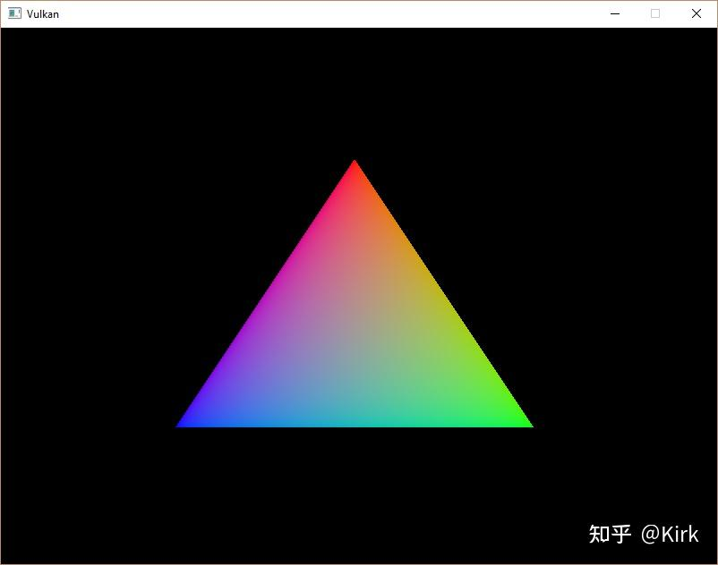
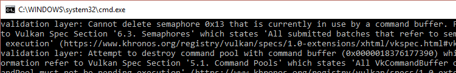

# Vulkan开发学习记录 13 - 渲染和呈现

## 配置

这一章，我们开始编写在主循环中调用的drawFrame函数，这一函数 调用会在屏幕上绘制一个三角形：

```cpp
void mainLoop() {
    while (!glfwWindowShouldClose(window)) {
        glfwPollEvents();
        drawFrame();
    }
}

...

void drawFrame() {

}
```

## 同步

我们编写的drawFrame函数用于执行下面的操作：

• 从[交换链](https://zhida.zhihu.com/search?content_id=218602732&content_type=Article&match_order=1&q=交换链&zhida_source=entity)获取一张图像

• 对[帧缓冲](https://zhida.zhihu.com/search?content_id=218602732&content_type=Article&match_order=1&q=帧缓冲&zhida_source=entity)附着执行指令缓冲中的渲染指令

• 返回渲染后的图像到交换链进行呈现操作

上面这些操作每一个都是通过一个[函数调用](https://zhida.zhihu.com/search?content_id=218602732&content_type=Article&match_order=1&q=函数调用&zhida_source=entity)设置的，但每个操作的实际执行却是异步进行的。函数调用会在操作实际结束前返回，并且操作的实际执行顺序也是不确定的。而我们需要操作的执行能按照一定的顺序，所以就需要进行[同步操作](https://zhida.zhihu.com/search?content_id=218602732&content_type=Article&match_order=1&q=同步操作&zhida_source=entity)。

有两种用于同步交换链事件的方式：栅栏（fence）和[信号量](https://zhida.zhihu.com/search?content_id=218602732&content_type=Article&match_order=1&q=信号量&zhida_source=entity)（semaphore），它们都可以完成同步操作。

栅栏（fence）和信号量（semaphore）的不同之处是，我们可以通过调用vkWhaitForFences函数查询栅栏（fence）的状态，但不能查询信号量（semaphore）的状态。通常，我们使用栅栏（fence）来对应用程序本身和渲染操作进行同步。使用信号量（semaphore）来对一个[指令队列](https://zhida.zhihu.com/search?content_id=218602732&content_type=Article&match_order=1&q=指令队列&zhida_source=entity)内的操作或多个不同指令队列的操作进行同步。这里，我们想要通过指令队列中的绘制操作和呈现操作，显然，使用信号量（semaphore）更加合适。

## 信号量

在这里，我们需要两个信号量，一个信号量发出图像已经被获取，可以开始渲染的信号；一个信号量发出渲染已经结果，可以开始呈现的信号。 我们添加了两个信号量对象作为[成员变量](https://zhida.zhihu.com/search?content_id=218602732&content_type=Article&match_order=1&q=成员变量&zhida_source=entity)：

```cpp
VkSemaphore imageAvailableSemaphore;
VkSemaphore renderFinishedSemaphore;
```

添加createSemaphores函数用于创建上面这两个信号量对象：

```cpp
void initVulkan() {
    createInstance();
    setupDebugMessenger();
    createSurface();
    pickPhysicalDevice();
    createLogicalDevice();
    createSwapChain();
    createImageViews();
    createRenderPass();
    createGraphicsPipeline();
    createFramebuffers();
    createCommandPool();
    createCommandBuffer();
    createSyncObjects();
}

...

void createSyncObjects() {

}
```

创建信号量，需要填写VkSemaphoreCreateInfo结构体，但对于目前版本的Vulkan来说，这一结构体只有一个sType成员变量需要我们填写：

```cpp
void createSyncObjects() {
    VkSemaphoreCreateInfo semaphoreInfo{};
    semaphoreInfo.sType = VK_STRUCTURE_TYPE_SEMAPHORE_CREATE_INFO;
}
```

未来版本的Vulkan扩展可能会添加新的功能设置到这一结构体的flags和pNext成员变量。

```cpp
if (vkCreateSemaphore(device, &semaphoreInfo, nullptr, &imageAvailableSemaphore) != VK_SUCCESS ||
    vkCreateSemaphore(device, &semaphoreInfo, nullptr, &renderFinishedSemaphore) != VK_SUCCESS ||
    vkCreateFence(device, &fenceInfo, nullptr, &inFlightFence) != VK_SUCCESS) {
    throw std::runtime_error("failed to create semaphores!");
}
```

信号量（semaphore）需要我们在应用程序结束前，所有它所同步的指令执行结束后，对它进行清除：

```cpp
void cleanup() {
    vkDestroySemaphore(device, imageAvailableSemaphore, nullptr);
    vkDestroySemaphore(device, renderFinishedSemaphore, nullptr);
    vkDestroyFence(device, inFlightFence, nullptr);
}
```

## 从交换链获取图像

之前提到，我们在drawFrame函数中进行的第一个操作是从交换链获取一张图像。这可以通过调用vkAcquireNextImageKHR函数完成，可以看到vkAcquireNextImageKHR函数的函数名带有一个KHR后缀，这是因为交换链是一个扩展特性，所以与它相关的操作都会有KHR这一扩展后缀：

```cpp
void drawFrame() {
    uint32_t imageIndex;
    vkAcquireNextImageKHR(device, swapChain, UINT64_MAX, imageAvailableSemaphore, VK_NULL_HANDLE, &imageIndex);
}
```

vkAcquireNextImageKHR函数的第一个参数是使用的逻辑设备对象， 第二个参数是我们要获取图像的交换链，第三个参数是图像获取的超时时间，我们可以通过使用无符号64位整型所能表示的最大整数来禁用图像获取超时。

接下来的两个函数参数用于指定图像可用后通知的同步对象，可以指定一个信号量对象或栅栏对象，或是同时指定信号量和栅栏对象进行同步操作。在这里，我们指定了一个叫做imageAvailableSemaphore的信号量对象。

vkAcquireNextImageKHR函数的最后一个参数用于输出可用的交换链图像的索引，我们使用这个索引来引用我们的swapChainImage数组中的VkImage对象，并使用这一索引来提交对应的[指令缓冲](https://zhida.zhihu.com/search?content_id=218602732&content_type=Article&match_order=2&q=指令缓冲&zhida_source=entity)。

## 提交指令缓冲

我们通过VkSubmitInfo结构体来提交信息给指令队列：

```cpp
VkSubmitInfo submitInfo{};
submitInfo.sType = VK_STRUCTURE_TYPE_SUBMIT_INFO;

VkSemaphore waitSemaphores[] = {imageAvailableSemaphore};
VkPipelineStageFlags waitStages[] = {VK_PIPELINE_STAGE_COLOR_ATTACHMENT_OUTPUT_BIT};
submitInfo.waitSemaphoreCount = 1;
submitInfo.pWaitSemaphores = waitSemaphores;
submitInfo.pWaitDstStageMask = waitStages;
```

VkSubmitInfo 结构体的waitSemaphoreCount 、pWaitSemaphores和pWaitDstStageMask 成员变量用于指定队列开始执行前需要等待的信号量，以及需要等待的管线阶段。这里，我们需要写入颜色数据到图像，所以我们指定等待图像管线到达可以写入颜色附着的管线阶段。waitStages数组中的条目和pWaitSemaphores中相同索引的信号量相对应。

```cpp
submitInfo.commandBufferCount = 1;
submitInfo.pCommandBuffers = &commandBuffer;
```

commandBufferCount和pCommandBuffers成员变量用于指定实际被提交执行的指令缓冲对象。之前提到，我们应该提交和我们刚刚获取的交换链图像相对应的指令缓冲对象。

```cpp
VkSemaphore signalSemaphores[] = {renderFinishedSemaphore};
submitInfo.signalSemaphoreCount = 1;
submitInfo.pSignalSemaphores = signalSemaphores;
```

signalSemaphoreCount和pSignalSemaphores 成员变量用于指定在指令缓冲执行结束后发出信号的信号量对象。在这里，我们使用renderFinishedSemaphore信号量对象在指令缓冲执行结束后发出信号。

```cpp
if (vkQueueSubmit(graphicsQueue, 1, &submitInfo, inFlightFence) != VK_SUCCESS) {
    throw std::runtime_error("failed to submit draw command buffer!");
}
```

现在我们可以调用vkQueueSubmit函数提交指令缓冲给图形指令队列。 vkQueueSubmit函数使用vkQueueSubmit[结构体数组](https://zhida.zhihu.com/search?content_id=218602732&content_type=Article&match_order=1&q=结构体数组&zhida_source=entity)作为参数，可以同时大批量提交数据。vkQueueSubmit函数的最后一个参数是一个可选的栅栏对象，可以用它同步提交的指令缓冲执行结束后要进行的操作。在这里，我们使用信号量进行同步，没有使用它，将其设置为VK_NULL_HANDLE。

## 子流程依赖

渲染流程的子流程会自动进行图像布局变换。这一变换过程由子流程的依赖所决定。子流程的依赖包括子流程之间的内存和执行的依赖关系。 虽然我们现在只使用了一个子流程，但子流程执行之前和子流程执行之后的操作也被算作隐含的子流程。

在渲染流程开始和结束时会自动进行图像布局变换，但在渲染流程开始时进行的自动变换的时机和我们的需求不符，变换发生在管线开始时， 但那时我们可能还没有获取到交换链图像。有两种方式可以解决这个问题。 一个是设置imageAvailableSemaphore信号量的waitStages为VK_PIPELINE_STAGE_TOP_OF_PIPE_BIT确保渲染流程在我们获取交换链图像之前不会开始。一个是设置渲染流程等待VK_PIPELINE_STAGE_COLOR_ATTACHMENT_OUTPUT_BIT管线阶段。在这里，为了让读者能够了解子流程依赖如何控制图像布局变换，我们使用第二种方式。

配置子流程依赖需要使用VkSubpassDependency 结构体。让我们在createRenderPass函数添加下面的代码：

```cpp
VkSubpassDependency dependency{};
dependency.srcSubpass = VK_SUBPASS_EXTERNAL;
dependency.dstSubpass = 0;
```

srcSubpass和dstSubpass成员变量用于指定被依赖的子流程的索引和 赖被依赖的子流程的索引。VK_SUBPASS_EXTERNAL用来指定我们之前 提到的隐含的子流程，对srcSubpass成员变量使用表示[渲染流程](https://zhida.zhihu.com/search?content_id=218602732&content_type=Article&match_order=6&q=渲染流程&zhida_source=entity)开始前的子流程，对srcSubpass成员使用表示渲染流程结束后的子流程。这里使用的索引0是我们之前创建的子流程的索引。为了避免出现[循环依赖](https://zhida.zhihu.com/search?content_id=218602732&content_type=Article&match_order=1&q=循环依赖&zhida_source=entity)，我们给dstSubpass设置的值必须始终大于srcSubpass。

```cpp
dependency.srcStageMask = VK_PIPELINE_STAGE_COLOR_ATTACHMENT_OUTPUT_BIT;
dependency.srcAccessMask = 0;
```

dstStageMask 和dstAccessMask 成员变量用于指定需要等待的管线阶段和子流程将进行的操作类型。我们需要等待交换链结束对图像的读取才能对图像进行访问操作，也就是等待颜色附着输出这一管线阶段。

```cpp
dependency.dstStageMask = VK_PIPELINE_STAGE_COLOR_ATTACHMENT_OUTPUT_BIT;
dependency.dstAccessMask = VK_ACCESS_COLOR_ATTACHMENT_WRITE_BIT;
```

dstStageMask 和dstAccessMask 成员变量用于指定需要等待的管线阶段 和子流程将进行的操作类型。在这里，我们的设置为等待颜色附着的输出阶段，子流程将会进行颜色附着的读写操作。这样设置后，图像布局变换直到必要时才会进行：当我们开始写入颜色数据时。

```cpp
renderPassInfo.dependencyCount = 1;
renderPassInfo.pDependencies = &dependency;
```

`VkRenderPassCreateInfo`结构体的dependencyCount 和pDependencies 成员变量用于指定渲染流程使用的依赖信息。

## 呈现

渲染操作执行后，我们需要将渲染的图像返回给交换链进行呈现操作。 我们在drawFrame 函数的尾部通过VkPresentInfoKHR扒结构体来配置呈现信息：

```cpp
VkPresentInfoKHR presentInfo{};
presentInfo.sType = VK_STRUCTURE_TYPE_PRESENT_INFO_KHR;

presentInfo.waitSemaphoreCount = 1;
presentInfo.pWaitSemaphores = signalSemaphores;
```

waitSemaphoreCount 和pWaitSemaphores 成员变量用于指定开始呈现操作需要等待的信号量。

```cpp
VkSwapchainKHR swapChains[] = {swapChain};
presentInfo.swapchainCount = 1;
presentInfo.pSwapchains = swapChains;
presentInfo.pImageIndices = &imageIndex;
```

接着，我们指定了用于呈现图像的交换链，以及需要呈现的图像在交换链中的索引。

```cpp
presentInfo.pResults = nullptr; // Optional
```

我们可以通过pResults 成员变量获取每个交换链的呈现操作是否成功的信息。在这里，由于我们只使用了一个交换链，可以直接使用呈现函数 的返回值来判断呈现操作是否成功，没有必要使用pResults 。

```cpp
presentInfo.pResults = nullptr; // Optional
```

调用vkQueuePresentKHR 函数可以请求交换链进行图像呈现操作。在下一章节，我们会对vkAcquireNextImageKHR 函数和vkQueuePresentKHR 函数添加错误处理的代码，应对调用它们失败后的情况。 现在如果编译运行程序，当我们关闭应用程序窗口时，我们的程序直接就奔溃了。如果开启了校验层，我们可以从控制台窗口看到调试[回调函数](https://zhida.zhihu.com/search?content_id=218602732&content_type=Article&match_order=1&q=回调函数&zhida_source=entity)打印的错误信息。





```cpp
vkQueuePresentKHR(presentQueue, &presentInfo);
```

造成这一问题的原因是扤扲扡扷扆扲扡扭扥函数中的操作是异步执行的。这意 味着我们关闭应用程序窗口跳出主循环时，绘制操作和呈现操作可能仍在 继续执行，这与我们紧接着进行的清除操作也是冲突的。

我们应该等待逻辑设备的操作结束执行才能销毁窗口：

```cpp
void mainLoop() {
    while (!glfwWindowShouldClose(window)) {
        glfwPollEvents();
        drawFrame();
    }

    vkDeviceWaitIdle(device);
}
```

我们可以使用vkQueueWaitIdle 函数等待一个特定指令队列结束执行。 现在再次编译运行程序，关闭应用程序窗口就不会造成程序直接崩溃了。

## 工程链接

[https://github.com/Kirkice/JourneyThroughVulkangithub.com/Kirkice/JourneyThroughVulkan](https://github.com/Kirkice/JourneyThroughVulkan)

