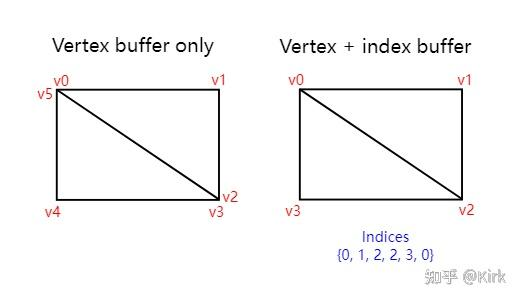

# Vulkan开发学习记录 19 - 索引缓冲

## 介绍

应用程序使用的[三维网格](https://zhida.zhihu.com/search?content_id=220908832&content_type=Article&match_order=1&q=三维网格&zhida_source=entity)的顶点通常是在多个三角形间共享的。对于绘制矩形这种简单的[几何图元](https://zhida.zhihu.com/search?content_id=220908832&content_type=Article&match_order=1&q=几何图元&zhida_source=entity)也可以共享顶点：



绘制一个矩形可以通过绘制两个三角形来实现，如果不[共享顶点](https://zhida.zhihu.com/search?content_id=220908832&content_type=Article&match_order=2&q=共享顶点&zhida_source=entity)，就需要6个顶点。共享顶点的话，只需要4个顶点就可以。可以想象对于更加复杂的三维网格，通过共享顶点可以节约大量内存资源。

[索引缓冲](https://zhida.zhihu.com/search?content_id=220908832&content_type=Article&match_order=1&q=索引缓冲&zhida_source=entity)是一个包含了指向顶点缓冲中顶点数据的[索引数组](https://zhida.zhihu.com/search?content_id=220908832&content_type=Article&match_order=1&q=索引数组&zhida_source=entity)的缓冲。 使用索引缓冲，我们可以对顶点数据进行复用。上图演示了索引缓冲的原理，顶点缓冲中包含每一个独一无二的顶点的数据，索引缓冲使用顶点缓 冲中顶点数据的索引来引用顶点数据。

## 创建索引缓冲

在本章节我们通过绘制矩形来演示索引缓冲的使用。修改顶点数据定义矩形的4个顶点：

```cpp
const std::vector<Vertex> vertices = {
    {{-0.5f, -0.5f}, {1.0f, 0.0f, 0.0f}},
    {{0.5f, -0.5f}, {0.0f, 1.0f, 0.0f}},
    {{0.5f, 0.5f}, {0.0f, 0.0f, 1.0f}},
    {{-0.5f, 0.5f}, {1.0f, 1.0f, 1.0f}}
};
```

代码中，我们将矩形左上角的顶点设置为红色，右上角的顶点设置为绿色，右下角的顶点设置蓝色，左下角的顶点设置为白色。我们添加一个新的数组indices来存储索引数据：

```cpp
const std::vector<uint16_t> indices = {
    0, 1, 2, 2, 3, 0
};
```

我们可以使用`uint16_t`或`uint32_t`变量类型作为索引的类型，对于不重复的顶点数据小于65535的情况，使用uint16_t变量类型作为索引类型可以节约一半的内存空间。

和[顶点数据](https://zhida.zhihu.com/search?content_id=220908832&content_type=Article&match_order=7&q=顶点数据&zhida_source=entity)一样，我们需要将索引数据加载到一个`VkBuffer`来让GPU可以访问它。我们定义了两个类成员变量来存储[索引缓冲对象](https://zhida.zhihu.com/search?content_id=220908832&content_type=Article&match_order=1&q=索引缓冲对象&zhida_source=entity)：

```cpp
VkBuffer vertexBuffer;
VkDeviceMemory vertexBufferMemory;
VkBuffer indexBuffer;
VkDeviceMemory indexBufferMemory;
```

添加`createIndexBuffer`函数用于索引缓冲创建，它和内容和createVertexBuffer函数的内容几乎一样：

```cpp
void initVulkan() {
    ...
    createVertexBuffer();
    createIndexBuffer();
    ...
}

void createIndexBuffer() {
    VkDeviceSize bufferSize = sizeof(indices[0]) * indices.size();

    VkBuffer stagingBuffer;
    VkDeviceMemory stagingBufferMemory;
    createBuffer(bufferSize, VK_BUFFER_USAGE_TRANSFER_SRC_BIT, VK_MEMORY_PROPERTY_HOST_VISIBLE_BIT | VK_MEMORY_PROPERTY_HOST_COHERENT_BIT, stagingBuffer, stagingBufferMemory);

    void* data;
    vkMapMemory(device, stagingBufferMemory, 0, bufferSize, 0, &data);
    memcpy(data, indices.data(), (size_t) bufferSize);
    vkUnmapMemory(device, stagingBufferMemory);

    createBuffer(bufferSize, VK_BUFFER_USAGE_TRANSFER_DST_BIT | VK_BUFFER_USAGE_INDEX_BUFFER_BIT, VK_MEMORY_PROPERTY_DEVICE_LOCAL_BIT, indexBuffer, indexBufferMemory);

    copyBuffer(stagingBuffer, indexBuffer, bufferSize);

    vkDestroyBuffer(device, stagingBuffer, nullptr);
    vkFreeMemory(device, stagingBufferMemory, nullptr);
}
```

和createIndexBuffer函数相比，只有两处明显的不同。`bufferSize`现在的值为顶点索引个数乘以[索引变量](https://zhida.zhihu.com/search?content_id=220908832&content_type=Article&match_order=1&q=索引变量&zhida_source=entity)类型所占字节大小。`indexBuffer`的用法标记为`VK_BUFFER_USAGE_INDEX_BUFFER_BIT`。除此之外的处理和顶点缓冲的创建是相同的。我们也需要创建一个暂存缓冲来存储`indices`数组中的索引数据，然后复制暂存缓冲中的索引数据到GPU能够快速访问的缓冲中。

应用程序退出前，我们需要清除创建的索引缓冲对象：

```cpp
void cleanup() {
    cleanupSwapChain();

    vkDestroyBuffer(device, indexBuffer, nullptr);
    vkFreeMemory(device, indexBufferMemory, nullptr);

    vkDestroyBuffer(device, vertexBuffer, nullptr);
    vkFreeMemory(device, vertexBufferMemory, nullptr);

    ...
}
```

## 使用索引缓冲

使用索引缓冲进行绘制操作，还需要对我们之前编写的createCommandBuffers函数进行修改。首先我们需要将索引缓冲对象绑定到指令缓冲对象上，这和绑定顶点缓冲基本类似，不同之处是我们只能绑定一个索引缓冲对象。我们不能为每个顶点属性使用不同的索引，所以即使只有一个顶点属性不同， 也要在顶点缓冲中多出一个顶点的数据。

```cpp
vkCmdBindVertexBuffers(commandBuffer, 0, 1, vertexBuffers, offsets);

vkCmdBindIndexBuffer(commandBuffer, indexBuffer, 0, VK_INDEX_TYPE_UINT16);
```

索引缓冲通过调用`vkCmdBindIndexBuffer`函数来进行绑定。`vkCmdBindIndexBuffer`函数以索引缓冲对象，索引数据在索引缓冲中的偏移，以及索引数据的类型作为参数。

仅仅绑定索引缓冲是不会起任何作用的，我们需要使用[vkCmdDrawIndexed](https://www.khronos.org/registry/vulkan/specs/1.0/man/html/vkCmdDrawIndexed.html)指令替换之前使用[vkCmdDraw](https://www.khronos.org/registry/vulkan/specs/1.0/man/html/vkCmdDraw.html)指令进行绘制操作：

```cpp
vkCmdDrawIndexed(commandBuffer, static_cast<uint32_t>(indices.size()), 1, 0, 0, 0);
```

[vkCmdDrawIndexed](https://www.khronos.org/registry/vulkan/specs/1.0/man/html/vkCmdDrawIndexed.html)函数的使用和[vkCmdDraw](https://www.khronos.org/registry/vulkan/specs/1.0/man/html/vkCmdDraw.html)函数类似。除了指令缓冲对象之外的前两个参数用于指定索引的个数和实例的个数。在这里，我们没有使用实例渲染，所以将实例个数设置为1。[偏移值](https://zhida.zhihu.com/search?content_id=220908832&content_type=Article&match_order=1&q=偏移值&zhida_source=entity)用于指定显卡开始读取索引的位置，偏移值为1对应索引数据中的第二个索引。倒数第二个参数是检索顶点数据前加到顶点索引上的数值。最后一个参数用于第一个被渲染的实例的ID，在这里，我们没有使用它。

现在编译运行程序可以看到下面的画面：


现在我们已经知道了如何使用索引缓冲来复用顶点数据。在之后的章节，我们载入的[三维模型](https://zhida.zhihu.com/search?content_id=220908832&content_type=Article&match_order=1&q=三维模型&zhida_source=entity)也需要使用索引缓冲来进行渲染。

之前提到，我们应该申请一大块内存来分配给多个缓冲对象使用，实际上，可以更进一步，使用一个缓冲对象通过偏移值来存储多个不同的顶点缓冲和索引[缓冲数据](https://zhida.zhihu.com/search?content_id=220908832&content_type=Article&match_order=1&q=缓冲数据&zhida_source=entity)。这样做之后，由于数据之间非常紧凑，可以更好地被缓存。对于没有同时进行的操作使用的内存块可以供多个对象复用， 这种复用方式也被叫做混叠，许多Vulkan函数包含有标记参数可以用于显 式地指定混叠处理。

## 工程链接

[https://github.com/Kirkice/JourneyThroughVulkangithub.com/Kirkice/JourneyThroughVulkan](https://github.com/Kirkice/JourneyThroughVulkan)

