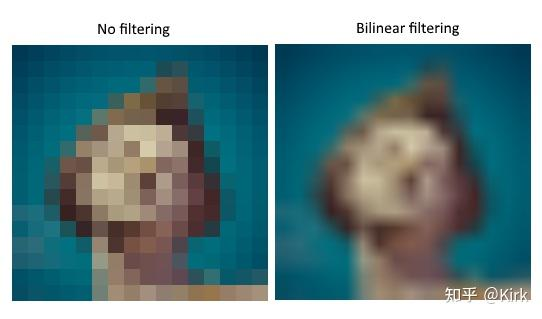
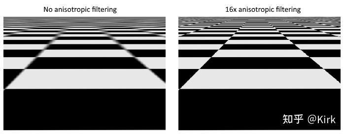
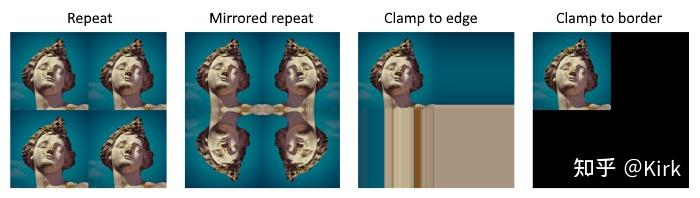

# Vulkan开发学习记录 22 - 图像视图和采样器

## 纹理图像视图

在之前的[交换链](https://zhida.zhihu.com/search?content_id=224443532&content_type=Article&match_order=1&q=交换链&zhida_source=entity)图像和帧缓冲章节，我们已经介绍过访问图像需要通过图像视图进行。对于[纹理图像](https://zhida.zhihu.com/search?content_id=224443532&content_type=Article&match_order=2&q=纹理图像&zhida_source=entity)同样需要通过图像视图来进行访问。 添加一个[类成员变量](https://zhida.zhihu.com/search?content_id=224443532&content_type=Article&match_order=1&q=类成员变量&zhida_source=entity)来存储纹理图像的图像视图对象，编写createTextureImageView函数来创建纹理图像的图像视图对象：

```cpp
VkImageView textureImageView;

...

void initVulkan() {
    ...
    createTextureImage();
    createTextureImageView();
    createVertexBuffer();
    ...
}

...

void createTextureImageView() {

}
```

createTextureImageView 函数的实现可以由createImageViews 函数修改得到。两者只有两处设置不同：format 和 image 成员变量的设置。

```cpp
VkImageViewCreateInfo viewInfo{};
viewInfo.sType = VK_STRUCTURE_TYPE_IMAGE_VIEW_CREATE_INFO;
viewInfo.image = textureImage;
viewInfo.viewType = VK_IMAGE_VIEW_TYPE_2D;
viewInfo.format = VK_FORMAT_R8G8B8A8_SRGB;
viewInfo.subresourceRange.aspectMask = VK_IMAGE_ASPECT_COLOR_BIT;
viewInfo.subresourceRange.baseMipLevel = 0;
viewInfo.subresourceRange.levelCount = 1;
viewInfo.subresourceRange.baseArrayLayer = 0;
viewInfo.subresourceRange.layerCount = 1;
```

在这里，由于VK_COMPONENT_SWIZZLE_IDENTITY的值实际上是0， 所以我们可以省略对 viewInfo.components 的[显式初始化](https://zhida.zhihu.com/search?content_id=224443532&content_type=Article&match_order=1&q=显式初始化&zhida_source=entity)，将 viewInfo.components 的成员变量都设置为0。最后，调用`vkCreateImageView` 函数创建图像视图对象：

```cpp
 if (vkCreateImageView(device, &viewInfo, nullptr, &textureImageView) != VK_SUCCESS) {
    throw std::runtime_error("failed to create texture image view!");
}
```

我们可以编写一个 createImageView 函数来简化图像视图对象的创建：

```cpp
VkImageView createImageView(VkImage image, VkFormat format) {
    VkImageViewCreateInfo viewInfo{};
    viewInfo.sType = VK_STRUCTURE_TYPE_IMAGE_VIEW_CREATE_INFO;
    viewInfo.image = image;
    viewInfo.viewType = VK_IMAGE_VIEW_TYPE_2D;
    viewInfo.format = format;
    viewInfo.subresourceRange.aspectMask = VK_IMAGE_ASPECT_COLOR_BIT;
    viewInfo.subresourceRange.baseMipLevel = 0;
    viewInfo.subresourceRange.levelCount = 1;
    viewInfo.subresourceRange.baseArrayLayer = 0;
    viewInfo.subresourceRange.layerCount = 1;

    VkImageView imageView;
    if (vkCreateImageView(device, &viewInfo, nullptr, &imageView) != VK_SUCCESS) {
        throw std::runtime_error("failed to create texture image view!");
    }

    return imageView;
}
```

现在我们可以使用createImageView 函数来简化createTextureImageView 的函数实现：

```cpp
void createTextureImageView() {
    textureImageView = createImageView(textureImage, VK_FORMAT_R8G8B8A8_SRGB);
}
```

createImageViews 的函数实现可以被简化为：

```cpp
void createImageViews() {
    swapChainImageViews.resize(swapChainImages.size());

    for (uint32_t i = 0; i < swapChainImages.size(); i++) {
        swapChainImageViews[i] = createImageView(swapChainImages[i], swapChainImageFormat);
    }
}
```

应用程序结束前，我们需要在清除图像对象之前清除与之关联的图像视图对象：

```cpp
void cleanup() {
    cleanupSwapChain();

    vkDestroyImageView(device, textureImageView, nullptr);

    vkDestroyImage(device, textureImage, nullptr);
    vkFreeMemory(device, textureImageMemory, nullptr);
}
```

## [采样器](https://zhida.zhihu.com/search?content_id=224443532&content_type=Article&match_order=1&q=采样器&zhida_source=entity)

在着色器中是可以直接访问图像数据，但当图像被作为纹理时，我们通常不这样做。通常我们使用采样器来访问纹理数据，采样器可以自动地对纹理数据进行过滤和变换处理。

采样器进行的过滤操作可以很好地处理纹理采样过密的问题。考虑一 个被映射到一个[几何图元](https://zhida.zhihu.com/search?content_id=224443532&content_type=Article&match_order=1&q=几何图元&zhida_source=entity)上的纹理，每个纹素占据了多个片段。如果我们直接采样与片段最近的纹素作为片段颜色，可能就会得到下面第一幅图的效果：



如果使用[线性插值](https://zhida.zhihu.com/search?content_id=224443532&content_type=Article&match_order=1&q=线性插值&zhida_source=entity)组合4个最近的纹素，我们可以得到上面第二幅图的效果。当然，有时候我们可能会喜欢第一幅图的效果(比如在编写类似我的世界这种游戏时)，当通常来说我们更多的想要第二幅图的效果。采样器可以自动地为我们进行上面这样的[纹理过滤](https://zhida.zhihu.com/search?content_id=224443532&content_type=Article&match_order=1&q=纹理过滤&zhida_source=entity)。

与之相反的是纹理采样过疏的问题，这种情况发生在多个纹素被映射到一个片段时。这会造成幻影现象，如下面第一幅图：



上面第二幅图，我们可以看到远处的纹理已经变得模糊不清。解决这一问题的方法是使用采样器进行各向异性过滤。

除了上面这些过滤器，采样器还可以进行变换操作。变换操作发生在采样超出纹理图像实际范围的数据时，下面这些图像就是使用采样器的变换操作产生的：



我们编写一个叫做 createTextureSampler 的函数来创建采样器对象。之 后，我们会在着色器中使用创建的采样器对象采样纹理数据。

```cpp
void initVulkan() {
    ...
    createTextureImage();
    createTextureImageView();
    createTextureSampler();
    ...
}

...

void createTextureSampler() {

}
```

采样器对象的配置需要填写`VkSamplerCreateInfo`结构体，通过它可以指定采样器使用的过滤器和变换操作。

```cpp
 VkSamplerCreateInfo samplerInfo{};
samplerInfo.sType = VK_STRUCTURE_TYPE_SAMPLER_CREATE_INFO;
samplerInfo.magFilter = VK_FILTER_LINEAR;
samplerInfo.minFilter = VK_FILTER_LINEAR;
```

magFilter 和 minFilter 成员变量用于指定纹理需要放大和缩小时使用的插值方法。纹理放大会出现采样过密的问题，纹理缩小会出现采样过疏的问题。对于这两个成员变量，设置其值为 VK_FILTER_NEAREST 或 VK_FILTER_LINEAR，分别对应上面我们讨论的两种过滤方式。

```cpp
samplerInfo.addressModeU = VK_SAMPLER_ADDRESS_MODE_REPEAT;
samplerInfo.addressModeV = VK_SAMPLER_ADDRESS_MODE_REPEAT;
samplerInfo.addressModeW = VK_SAMPLER_ADDRESS_MODE_REPEAT;
```

addressModeU、addressModeV和addressModeW用于指定寻址模式。这里的U、V、W对应X、Y和Z轴。它们的值可以是下面这些：

- `VK_SAMPLER_ADDRESS_MODE_REPEAT`：采样超出图像范围时重复纹理。
- `VK_SAMPLER_ADDRESS_MODE_MIRRORED_REPEAT`: 采样超出图像范围时重复镜像后的纹理。
- `VK_SAMPLER_ADDRESS_MODE_CLAMP_TO_EDGE`：采样超出图像范围时使用距离最近的边界纹素 。
- `VK_SAMPLER_ADDRESS_MODE_MIRROR_CLAMP_TO_EDGE`：采样超出图像范围时使用镜像后距离最近的边界纹素
- `VK_SAMPLER_ADDRESS_MODE_CLAMP_TO_BORDER`：采样超出图像返回时返回设置的边界颜色 。

在这里，我们的采样不会超出图像范围，所以暂时不用关心使用的寻址模式。通常来说，VK_SAMPLER_ADDRESS_MODE_REPEAT 模式是最常用的，可以用它来实现[平铺纹理](https://zhida.zhihu.com/search?content_id=224443532&content_type=Article&match_order=1&q=平铺纹理&zhida_source=entity)的效果。

```cpp
samplerInfo.anisotropyEnable = VK_TRUE;
samplerInfo.maxAnisotropy = 16;
```

anisotropyEnable 和 maxAnisotropy 成员变量和[各向异性过滤](https://zhida.zhihu.com/search?content_id=224443532&content_type=Article&match_order=2&q=各向异性过滤&zhida_source=entity)相关。通常来说，只要性能允许，我们都会开启各向异性过滤。maxAnisotropy 成员变量用于限定计算最终颜色使用的样本个数。maxAnisotropy 成员变量的值越小，采样的性能表现越好，但采样结果质量较低。目前为止，还没有[图形硬件](https://zhida.zhihu.com/search?content_id=224443532&content_type=Article&match_order=1&q=图形硬件&zhida_source=entity)能够使用超过16个样本，同时即使可以使用超过16个样本，采样效果的增强也开始变得微乎其微。

```cpp
samplerInfo.borderColor = VK_BORDER_COLOR_INT_OPAQUE_BLACK;
```

borderColor 成员变量用于指定使用VK_SAMPLER_ADDRESS_MODE_CLAMP_TO_BORDER 寻址模式时采样超出图像范围时返回的边界颜色。边界颜色并非可以设置为任意颜色。它可以被设置为浮点或整型格式的黑色、白色或透明色。

```cpp
samplerInfo.unnormalizedCoordinates = VK_FALSE;
```

unnormalizedCoordinates 成员变量用于指定采样使用的坐标系统。将其设置为 VK_TRUE 时，采样使用的坐标范围为`[0, texWidth)`和`[0, texHeight)`。 将其设置为VK_FALSE，采样使用的坐标范围在所有轴都是[0, 1)。通常使用 VK_FALSE 的情况更常见，这种情况下我们可以使用相同的[纹理坐标](https://zhida.zhihu.com/search?content_id=224443532&content_type=Article&match_order=1&q=纹理坐标&zhida_source=entity)采样不同分辨率的纹理。

```cpp
samplerInfo.compareEnable = VK_FALSE;
samplerInfo.compareOp = VK_COMPARE_OP_ALWAYS;
```

通过compareEnable 和compareOp 成员变量，我们可以将样本和一个设定的值进行比较，然后将比较结果用于之后的过滤操作。通常我们在进行阴影贴图时会使用它。暂时我们不使用这一功能，在之后的章节，我们会对这一功能进行更为详细地介绍。

```cpp
samplerInfo.mipmapMode = VK_SAMPLER_MIPMAP_MODE_LINEAR;
samplerInfo.mipLodBias = 0.0f;
samplerInfo.minLod = 0.0f;
samplerInfo.maxLod = 0.0f;
```

mipLodBias 、minLod 、maxLod 成员变量用于设置分级细化(mipmap)，我们会在之后的章节对分级细化进行介绍，它可以看作是过滤操作的一种。

至此，我们就完成了VkSampleCreateInfo结构体的填写。现在添加一 个类成员变量来存储我们调用VkCreateSampler函数创建的采样器对象：

```cpp
VkImageView textureImageView;
VkSampler textureSampler;

...

void createTextureSampler() {
    ...

    if (vkCreateSampler(device, &samplerInfo, nullptr, &textureSampler) != VK_SUCCESS) {
        throw std::runtime_error("failed to create texture sampler!");
    }
}
```

需要注意，采样器对象并不引用特定的VkImage对象，它是一个用于访问纹理数据的接口。我们可以使用它来访问任意不同的图像，不管图像是一维的、二维的、还是[三维](https://zhida.zhihu.com/search?content_id=224443532&content_type=Article&match_order=1&q=三维&zhida_source=entity)的。这和一些旧的图形API将纹理图像和过滤设置绑定在一起进行采样是不同的。 最后，我们需要在应用程序结束前清除我们创建的采样器对象：

```cpp
void cleanup() {
    cleanupSwapChain();

    vkDestroySampler(device, textureSampler, nullptr);
    vkDestroyImageView(device, textureImageView, nullptr);

    ...
}
```

## 各向异性设备特性

这是因为各向异性过滤实际上是一个非必需的设备特性。我们需要在创建逻辑设备时检查这一设备特性是否被设备支持才能使用它：

```cpp
VkPhysicalDeviceFeatures deviceFeatures{};
deviceFeatures.samplerAnisotropy = VK_TRUE;
```

尽管，现在大部分现代图形硬件都已经支持了这一特性，但我们最好还是以防万一对设备是否支持这一特性进行检测：

```cpp
bool isDeviceSuitable(VkPhysicalDevice device) {
    ...

    VkPhysicalDeviceFeatures supportedFeatures;
    vkGetPhysicalDeviceFeatures(device, &supportedFeatures);

    return indices.isComplete() && extensionsSupported && swapChainAdequate && supportedFeatures.samplerAnisotropy;
}
```

我们通过调用vkGetPhysicalDeviceFeatures 函数获取物理设备支持的特性信息，然后验证是否包含各向异性过滤特性。 如果不想使用各向异性过滤，可以按照下面这样设置：

```cpp
samplerInfo.anisotropyEnable = VK_FALSE;
samplerInfo.maxAnisotropy = 1.0f;
```

## [工程链接](https://zhida.zhihu.com/search?content_id=224443532&content_type=Article&match_order=1&q=工程链接&zhida_source=entity)

[https://github.com/Kirkice/JourneyThroughVulkangithub.com/Kirkice/JourneyThroughVulkan](https://link.zhihu.com/?target=https%3A//github.com/Kirkice/JourneyThroughVulkan)

## 参考

[1]. [https://vulkan-tutorial.com/Texture_mapping/Image_view_and_sampler](https://vulkan-tutorial.com/Texture_mapping/Image_view_and_sampler)