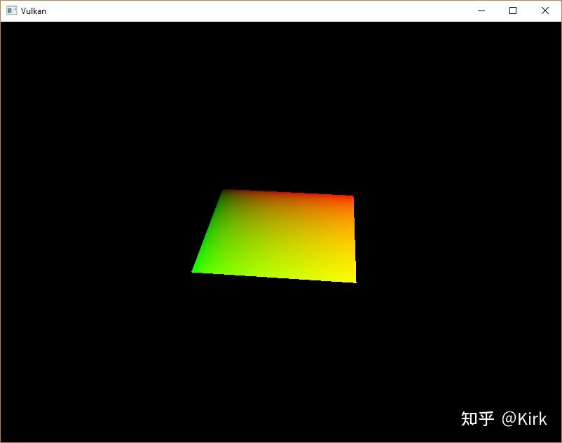
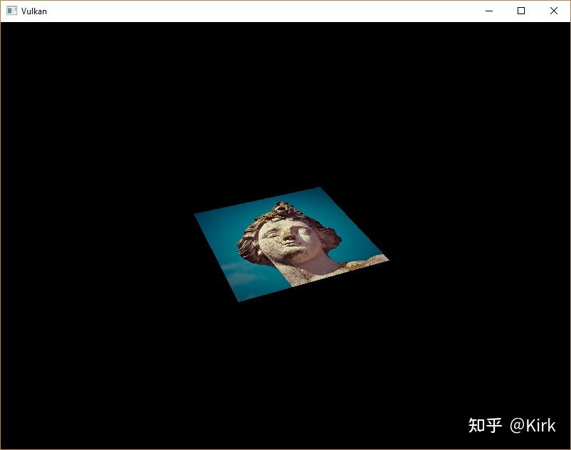
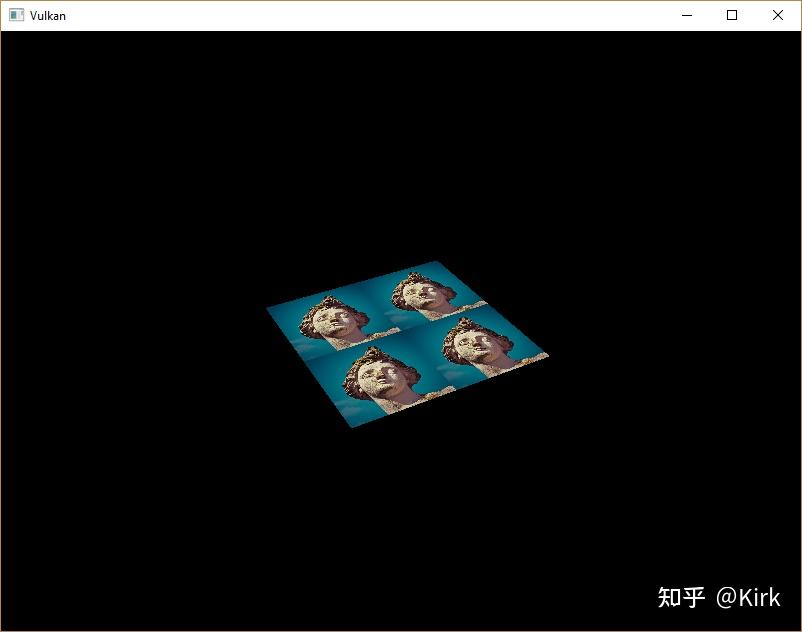
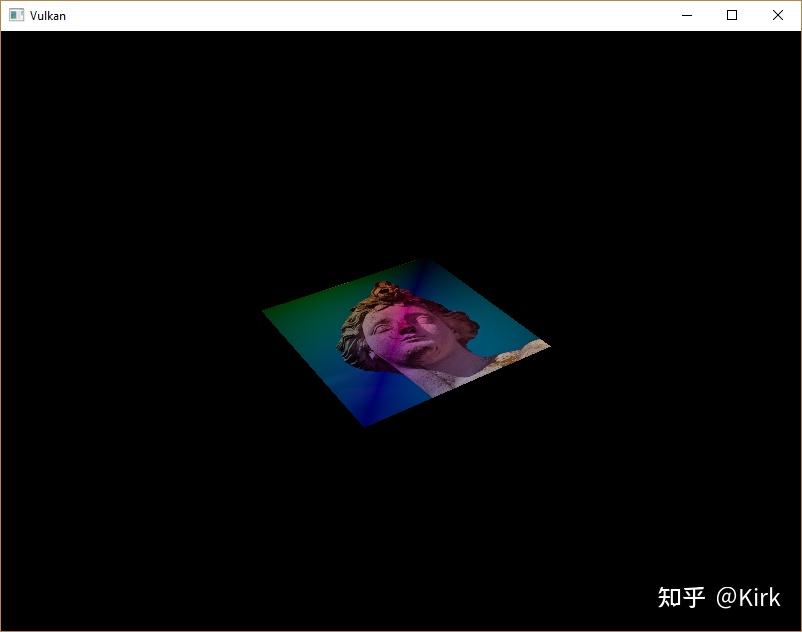

# Vulkan开发学习记录 23 - 组合图像采样器

## 更新描述符

在createDescriptorSetLayout 函数中填写用于组合图像采样器描述符的VkDescriptorSetLayoutBinding 结构体信息。将下面的代码放在uniform 缓冲绑定之后：

```cpp
VkDescriptorSetLayoutBinding samplerLayoutBinding{};
samplerLayoutBinding.binding = 1;
samplerLayoutBinding.descriptorCount = 1;
samplerLayoutBinding.descriptorType = VK_DESCRIPTOR_TYPE_COMBINED_IMAGE_SAMPLER;
samplerLayoutBinding.pImmutableSamplers = nullptr;
samplerLayoutBinding.stageFlags = VK_SHADER_STAGE_FRAGMENT_BIT;

std::array<VkDescriptorSetLayoutBinding, 2> bindings = {uboLayoutBinding, samplerLayoutBinding};
VkDescriptorSetLayoutCreateInfo layoutInfo{};
layoutInfo.sType = VK_STRUCTURE_TYPE_DESCRIPTOR_SET_LAYOUT_CREATE_INFO;
layoutInfo.bindingCount = static_cast<uint32_t>(bindings.size());
layoutInfo.pBindings = bindings.data();
```

设置 stageFlags 成员变量指明在[片段着色器](https://zhida.zhihu.com/search?content_id=224445773&content_type=Article&match_order=1&q=片段着色器&zhida_source=entity)中使用组合图像采样器描述符。在[顶点着色器](https://zhida.zhihu.com/search?content_id=224445773&content_type=Article&match_order=1&q=顶点着色器&zhida_source=entity)也可以进行纹理采样，一个常见的用途是在顶点着色器中使用高度图纹理来对顶点进行变形。

现在在开启校验层的情况下编译运行程序，我们会得到描述符池不能分配该类型的[描述符集](https://zhida.zhihu.com/search?content_id=224445773&content_type=Article&match_order=1&q=描述符集&zhida_source=entity)这一信息。这一因为我们原来创建的描述符池对象 并没有包含组合图像采样器描述符，为了解决这一问题，我们修改createDescriptorPool [函 数](https://zhida.zhihu.com/search?content_id=224445773&content_type=Article&match_order=1&q=函+数&zhida_source=entity)，添加一个用于组合图像[采样器](https://zhida.zhihu.com/search?content_id=224445773&content_type=Article&match_order=4&q=采样器&zhida_source=entity)描述符的VkDescriptorPoolSize结构体信息：

```cpp
std::array<VkDescriptorPoolSize, 2> poolSizes{};
poolSizes[0].type = VK_DESCRIPTOR_TYPE_UNIFORM_BUFFER;
poolSizes[0].descriptorCount = static_cast<uint32_t>(MAX_FRAMES_IN_FLIGHT);
poolSizes[1].type = VK_DESCRIPTOR_TYPE_COMBINED_IMAGE_SAMPLER;
poolSizes[1].descriptorCount = static_cast<uint32_t>(MAX_FRAMES_IN_FLIGHT);

VkDescriptorPoolCreateInfo poolInfo{};
poolInfo.sType = VK_STRUCTURE_TYPE_DESCRIPTOR_POOL_CREATE_INFO;
poolInfo.poolSizeCount = static_cast<uint32_t>(poolSizes.size());
poolInfo.pPoolSizes = poolSizes.data();
poolInfo.maxSets = static_cast<uint32_t>(MAX_FRAMES_IN_FLIGHT);
```

最后，我们在createDescriptorSets函数中绑定图像和采样器到描述符集中的描述符：

```cpp
for (size_t i = 0; i < MAX_FRAMES_IN_FLIGHT; i++) {
    VkDescriptorBufferInfo bufferInfo{};
    bufferInfo.buffer = uniformBuffers[i];
    bufferInfo.offset = 0;
    bufferInfo.range = sizeof(UniformBufferObject);

    VkDescriptorImageInfo imageInfo{};
    imageInfo.imageLayout = VK_IMAGE_LAYOUT_SHADER_READ_ONLY_OPTIMAL;
    imageInfo.imageView = textureImageView;
    imageInfo.sampler = textureSampler;

    ...
}
```

需要使用`VkDescriptorImageInfo` 结构体为组合图像采样器指定图像资源。

```cpp
std::array<VkWriteDescriptorSet, 2> descriptorWrites{};

descriptorWrites[0].sType = VK_STRUCTURE_TYPE_WRITE_DESCRIPTOR_SET;
descriptorWrites[0].dstSet = descriptorSets[i];
descriptorWrites[0].dstBinding = 0;
descriptorWrites[0].dstArrayElement = 0;
descriptorWrites[0].descriptorType = VK_DESCRIPTOR_TYPE_UNIFORM_BUFFER;
descriptorWrites[0].descriptorCount = 1;
descriptorWrites[0].pBufferInfo = &bufferInfo;

descriptorWrites[1].sType = VK_STRUCTURE_TYPE_WRITE_DESCRIPTOR_SET;
descriptorWrites[1].dstSet = descriptorSets[i];
descriptorWrites[1].dstBinding = 1;
descriptorWrites[1].dstArrayElement = 0;
descriptorWrites[1].descriptorType = VK_DESCRIPTOR_TYPE_COMBINED_IMAGE_SAMPLER;
descriptorWrites[1].descriptorCount = 1;
descriptorWrites[1].pImageInfo = &imageInfo;

vkUpdateDescriptorSets(device, static_cast<uint32_t>(descriptorWrites.size()), descriptorWrites.data(), 0, nullptr);
```

更新描述符需要使用图像资源信息。至此，我们就可以在着色器中使用描述符了。

## [纹理坐标](https://zhida.zhihu.com/search?content_id=224445773&content_type=Article&match_order=1&q=纹理坐标&zhida_source=entity)

我们需要使用纹理坐标来将[纹理映射](https://zhida.zhihu.com/search?content_id=224445773&content_type=Article&match_order=1&q=纹理映射&zhida_source=entity)到[几何图元](https://zhida.zhihu.com/search?content_id=224445773&content_type=Article&match_order=1&q=几何图元&zhida_source=entity)上。

```cpp
struct Vertex {
    glm::vec2 pos;
    glm::vec3 color;
    glm::vec2 texCoord;

    static VkVertexInputBindingDescription getBindingDescription() {
        VkVertexInputBindingDescription bindingDescription{};
        bindingDescription.binding = 0;
        bindingDescription.stride = sizeof(Vertex);
        bindingDescription.inputRate = VK_VERTEX_INPUT_RATE_VERTEX;

        return bindingDescription;
    }

    static std::array<VkVertexInputAttributeDescription, 3> getAttributeDescriptions() {
        std::array<VkVertexInputAttributeDescription, 3> attributeDescriptions{};

        attributeDescriptions[0].binding = 0;
        attributeDescriptions[0].location = 0;
        attributeDescriptions[0].format = VK_FORMAT_R32G32_SFLOAT;
        attributeDescriptions[0].offset = offsetof(Vertex, pos);

        attributeDescriptions[1].binding = 0;
        attributeDescriptions[1].location = 1;
        attributeDescriptions[1].format = VK_FORMAT_R32G32B32_SFLOAT;
        attributeDescriptions[1].offset = offsetof(Vertex, color);

        attributeDescriptions[2].binding = 0;
        attributeDescriptions[2].location = 2;
        attributeDescriptions[2].format = VK_FORMAT_R32G32_SFLOAT;
        attributeDescriptions[2].offset = offsetof(Vertex, texCoord);

        return attributeDescriptions;
    }
};
```

修改Vertex 结构体添加一个新的 vec2 类型变量来存储纹理坐标。添加一个新的`VkVertexInputAttributeDescription` 对象用于在顶点着色器访问顶点的纹理坐标。这样我们才能将纹理坐标传递给片段着色器使用。

```cpp
const std::vector<Vertex> vertices = {
    {{-0.5f, -0.5f}, {1.0f, 0.0f, 0.0f}, {1.0f, 0.0f}},
    {{0.5f, -0.5f}, {0.0f, 1.0f, 0.0f}, {0.0f, 0.0f}},
    {{0.5f, 0.5f}, {0.0f, 0.0f, 1.0f}, {0.0f, 1.0f}},
    {{-0.5f, 0.5f}, {1.0f, 1.0f, 1.0f}, {1.0f, 1.0f}}
};
```

在本教程，我们为渲染的矩形的四个顶点指定纹理图像的四个顶点作为纹理坐标。

## 着色器

现在可以修改着色器从纹理中采样颜色数据。我们首先需要修改顶点着色器将纹理坐标传递给片段着色器：

```cpp
layout(location = 0) in vec2 inPosition;
layout(location = 1) in vec3 inColor;
layout(location = 2) in vec2 inTexCoord;

layout(location = 0) out vec3 fragColor;
layout(location = 1) out vec2 fragTexCoord;

void main() {
    gl_Position = ubo.proj * ubo.view * ubo.model * vec4(inPosition, 0.0, 1.0);
    fragColor = inColor;
    fragTexCoord = inTexCoord;
}
```

fragTexCoord 的值会被插值后传递给片段着色器。我们可以通过将纹理坐标输出为片段颜色来形象地认知这一插值过程：

```cpp
#version 450

layout(location = 0) in vec3 fragColor;
layout(location = 1) in vec2 fragTexCoord;

layout(location = 0) out vec4 outColor;

void main() {
    outColor = vec4(fragTexCoord, 0.0, 1.0);
}
```

重新编译我们的着色器代码，然后编译运行应用程序，将会看到下面的画面：



我们这里使用绿色通道来表示扸坐标，使用红色通道来表示 y 坐标。通过上图的黑色和黄色角落，我们可以确定矩形左上角顶点的纹理坐标为(0, 0)，右下角顶点的纹理坐标为(1, 1)。这种通过将变量值作为片段颜色输出的方法是一个很有用的调试着色器的手段。

在 GLSL 中，使用[uniform变量](https://zhida.zhihu.com/search?content_id=224445773&content_type=Article&match_order=1&q=uniform变量&zhida_source=entity)来表示组合图像采样器描述符。为了在片段着色器中使用[描述符](https://zhida.zhihu.com/search?content_id=224445773&content_type=Article&match_order=14&q=描述符&zhida_source=entity)，我们需要添加下面的代码：

```cpp
layout(binding = 1) uniform sampler2D texSampler;
```

对于一维图像和二维图像需要使用对应的 sampler2D 和sampler3D变量类型来绑定描述符。

```cpp
void main() {
    outColor = texture(texSampler, fragTexCoord);
}
```

在GLSL纹理采样需要使用GLSL内建的texture函数。texture函数使用 一个采样器变量和一个纹理坐标作为参数对纹理进行采样。采样器会自动按照我们设定的过滤和变换方式对纹理进行采样。现在编译运行程序，可以看到下面的画面：



读者可以尝试通过将纹理坐标设置为大于1.0的值来观察寻址模式对纹理采样的影响。下图是使用VK_SAMPLER_ADDRESS_MODE_REPEAT 寻址模式产生的效果：

```cpp
void main() {
    outColor = texture(texSampler, fragTexCoord * 2.0);
}
```



我们还可以同时使用顶点颜色和纹理颜色来产生最终的片段颜色：

```cpp
void main() {
    outColor = vec4(fragColor * texture(texSampler, fragTexCoord).rgb, 1.0);
}
```



## [工程链接](https://zhida.zhihu.com/search?content_id=224445773&content_type=Article&match_order=1&q=工程链接&zhida_source=entity)


[https://github.com/Kirkice/JourneyThroughVulkangithub.com/Kirkice/JourneyThroughVulkan](https://link.zhihu.com/?target=https%3A//github.com/Kirkice/JourneyThroughVulkan)


## 参考

[1]. [https://vulkan-tutorial.com/Tex](https://vulkan-tutorial.com/Texture_mapping/Image_view_and_sampler)