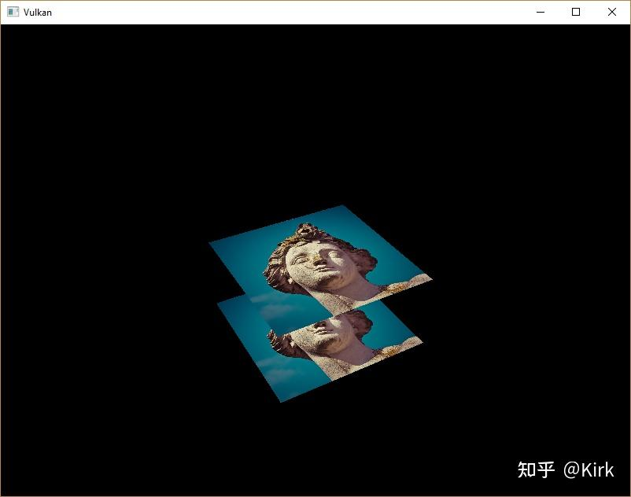

# Vulkan开发学习记录 24 - 深度缓冲

## 介绍

在本章节，我们会开始使用[三维](https://zhida.zhihu.com/search?content_id=225236786&content_type=Article&match_order=1&q=三维&zhida_source=entity)的顶点坐标。我们会放置两个 z 坐标不同的矩形来表现[深度缓冲](https://zhida.zhihu.com/search?content_id=225236786&content_type=Article&match_order=1&q=深度缓冲&zhida_source=entity)解决的问题。

## 三维几何

修改 Vertex 结构体，使用三维向量来表示顶点的位置信息，更新对应的 VkVertexInputAttributeDescription 结构体的 format 成员变量设置：

```cpp
struct Vertex {
    glm::vec3 pos;
    glm::vec3 color;
    glm::vec2 texCoord;

    ...

    static std::array<VkVertexInputAttributeDescription, 3> getAttributeDescriptions() {
        std::array<VkVertexInputAttributeDescription, 3> attributeDescriptions{};

        attributeDescriptions[0].binding = 0;
        attributeDescriptions[0].location = 0;
        attributeDescriptions[0].format = VK_FORMAT_R32G32B32_SFLOAT;
        attributeDescriptions[0].offset = offsetof(Vertex, pos);

        ...
    }
};
```

接着，修改[顶点着色器](https://zhida.zhihu.com/search?content_id=225236786&content_type=Article&match_order=1&q=顶点着色器&zhida_source=entity)接收三维顶点位置输入。最后不要忘记重新编译修改后的顶点着色器代码：

```cpp
 layout(location = 0) in vec3 inPosition;

...

void main() {
    gl_Position = ubo.proj * ubo.view * ubo.model * vec4(inPosition, 1.0);
    fragColor = inColor;
    fragTexCoord = inTexCoord;
}
```

更新 vertices 中的顶点数据，添加 z 坐标信息：

```cpp
const std::vector<Vertex> vertices = {
    {{-0.5f, -0.5f, 0.0f}, {1.0f, 0.0f, 0.0f}, {0.0f, 0.0f}},
    {{0.5f, -0.5f, 0.0f}, {0.0f, 1.0f, 0.0f}, {1.0f, 0.0f}},
    {{0.5f, 0.5f, 0.0f}, {0.0f, 0.0f, 1.0f}, {1.0f, 1.0f}},
    {{-0.5f, 0.5f, 0.0f}, {1.0f, 1.0f, 1.0f}, {0.0f, 1.0f}}
};
```

现在如果编译运行程序，我们会看到和之前一样的渲染结果。为了显示深度缓冲解决的问题，我们再添加一个矩形的数据：

```cpp
const std::vector<Vertex> vertices = {
    {{-0.5f, -0.5f, 0.0f}, {1.0f, 0.0f, 0.0f}, {0.0f, 0.0f}},
    {{0.5f, -0.5f, 0.0f}, {0.0f, 1.0f, 0.0f}, {1.0f, 0.0f}},
    {{0.5f, 0.5f, 0.0f}, {0.0f, 0.0f, 1.0f}, {1.0f, 1.0f}},
    {{-0.5f, 0.5f, 0.0f}, {1.0f, 1.0f, 1.0f}, {0.0f, 1.0f}},

    {{-0.5f, -0.5f, -0.5f}, {1.0f, 0.0f, 0.0f}, {0.0f, 0.0f}},
    {{0.5f, -0.5f, -0.5f}, {0.0f, 1.0f, 0.0f}, {1.0f, 0.0f}},
    {{0.5f, 0.5f, -0.5f}, {0.0f, 0.0f, 1.0f}, {1.0f, 1.0f}},
    {{-0.5f, 0.5f, -0.5f}, {1.0f, 1.0f, 1.0f}, {0.0f, 1.0f}}
};

const std::vector<uint16_t> indices = {
    0, 1, 2, 2, 3, 0,
    4, 5, 6, 6, 7, 4
};
```

新添加的矩形和之前的矩形除了z坐标相差0.5f外，其它数据完全一样。 另外我们将第二矩形使用的顶点索引数据添加到indices数组中。


现在编译运行程序，应该可以看到类似上图的画面。 我们会发现较低的矩形却绘制在了较高的矩形上面，这是因为较低矩形的索引数据在较高矩形的索引数据之后出现，绘图调用在绘制完较高的矩形后才绘制较低的矩形。

有两种方式可以解决这个问题：

• 按照[深度坐标](https://zhida.zhihu.com/search?content_id=225236786&content_type=Article&match_order=1&q=深度坐标&zhida_source=entity)对绘制调用进行排序

• 使用[深度测试](https://zhida.zhihu.com/search?content_id=225236786&content_type=Article&match_order=1&q=深度测试&zhida_source=entity)

通常我们使用第一种方式来绘制需要透明的对象。使用第二种方式来绘制一般对象。使用第二种方式需要用到深度缓冲。深度缓冲是用于存储片段深度值的缓冲对象。[光栅化](https://zhida.zhihu.com/search?content_id=225236786&content_type=Article&match_order=1&q=光栅化&zhida_source=entity)后生成的片段包含了一个[深度值](https://zhida.zhihu.com/search?content_id=225236786&content_type=Article&match_order=2&q=深度值&zhida_source=entity)可以被深度测试检查是否可以使用这一片段覆盖之前的数据。我们可以在片段着色器对深度值进行处理。

```cpp
#define GLM_FORCE_RADIANS
#define GLM_FORCE_DEPTH_ZERO_TO_ONE
#include <glm/glm.hpp>
#include <glm/gtc/matrix_transform.hpp>
```

默认情况下，GLM 库的[透视投影矩阵](https://zhida.zhihu.com/search?content_id=225236786&content_type=Article&match_order=1&q=透视投影矩阵&zhida_source=entity)使用OpenGL的深度值范围(-1.0f,1.0f)。我们需要定义扇`GLM_FORCE_DEPTH_ZERO_TO_ONE`宏来让它使用Vulkan的深度值范围(-0.0f,1.0f)。

## 深度图像和视图

[深度附着](https://zhida.zhihu.com/search?content_id=225236786&content_type=Article&match_order=1&q=深度附着&zhida_source=entity)和颜色附着一样都是基于图像对象。区别是，[交换链](https://zhida.zhihu.com/search?content_id=225236786&content_type=Article&match_order=1&q=交换链&zhida_source=entity)不会自动地为我们创建深度附着使用的深度图像对象。我们需要自己创建[深度图像](https://zhida.zhihu.com/search?content_id=225236786&content_type=Article&match_order=3&q=深度图像&zhida_source=entity)对象。使用深度图像需要图像、内存和图像视图对象这三种资源。

```cpp
VkImage depthImage;
VkDeviceMemory depthImageMemory;
VkImageView depthImageView;
```

添加一个叫做`createDepthResources`的函数来配置深度图像需要的资源：

```cpp
void initVulkan() {
    ...
    createCommandPool();
    createDepthResources();
    createTextureImage();
    ...
}

...

void createDepthResources() {

}
```

深度图像的创建方法相当简单。设置和颜色附着完全一样的图像分辨率，以及用于深度附着的使用标记，优化的tiling模式和设备内存。对于深度图像，只需要使用一个颜色通道。

和[纹理图像](https://zhida.zhihu.com/search?content_id=225236786&content_type=Article&match_order=1&q=纹理图像&zhida_source=entity)不同，深度图像不需要特定的图像数据格式，这是因为实际上我们不需要直接访问深度图像。只需要保证深度数据能够有一个合理的精度即可，通常这一合理精度是至少为[深度数据](https://zhida.zhihu.com/search?content_id=225236786&content_type=Article&match_order=2&q=深度数据&zhida_source=entity)提供24位的位宽，下面这些值满足24位的需求：

• VK_FORMAT_D32_SFLOAT：32位浮点深度值

• VK_FORMAT_D32_SFLOAT_S8_UINT：32位浮点深度值和8位[模板值](https://zhida.zhihu.com/search?content_id=225236786&content_type=Article&match_order=1&q=模板值&zhida_source=entity)

• VK_FORMAT_D24_UNORM_S8_UINT：24位浮点深度值和8位模板值

模板值用于模板测试，我们会在之后的章节介绍它。

我们可以直接使用 VK_FORMAT_D32_SFLOAT_S8_UINT 作为图像数据格式，目前这一图像数据格式已经被广泛支持。但我们最好还是对设备是否支持这一图像数据格式进行检测。为此我们可以编写一个findSupportedFormat 函数查找一个既符合我们需求又被设备支持的图像数据格式：

```cpp
VkFormat findSupportedFormat(const std::vector<VkFormat>& candidates, VkImageTiling tiling, VkFormatFeatureFlags features) {

}
```

可用的深度图像数据格式还依赖于tiling模式和使用标记，所以我们需要将这些信息作为函数参数，通过调用vkGetPhysicalDeviceFormatProperties 函数查询可用的深度图像数据格式：

```cpp
for (VkFormat format : candidates) {
    VkFormatProperties props;
    vkGetPhysicalDeviceFormatProperties(physicalDevice, format, &props);
}
```

上面代码中的 VkFormatProperties 结构体包含了下面这些成员变量：

• linearTilingFeatures：数据格式支持线性tiling模式

• optimalTilingFeatures：数据格式支持优化tiling模式

• bufferFeatures：数据格式支持缓冲

目前我们只用到上面前两个[成员变量](https://zhida.zhihu.com/search?content_id=225236786&content_type=Article&match_order=3&q=成员变量&zhida_source=entity)，通过它们对应的tiling模式检测数据格式是否被支持：

```cpp
if (tiling == VK_IMAGE_TILING_LINEAR && (props.linearTilingFeatures & features) == features) {
    return format;
} else if (tiling == VK_IMAGE_TILING_OPTIMAL && (props.optimalTilingFeatures & features) == features) {
    return format;
}
```

如果没有合适的格式可用，我们可以返回一个特殊值或直接抛出一个异常：

```cpp
VkFormat findSupportedFormat(const std::vector<VkFormat>& candidates, VkImageTiling tiling, VkFormatFeatureFlags features) {
    for (VkFormat format : candidates) {
        VkFormatProperties props;
        vkGetPhysicalDeviceFormatProperties(physicalDevice, format, &props);

        if (tiling == VK_IMAGE_TILING_LINEAR && (props.linearTilingFeatures & features) == features) {
            return format;
        } else if (tiling == VK_IMAGE_TILING_OPTIMAL && (props.optimalTilingFeatures & features) == features) {
            return format;
        }
    }

    throw std::runtime_error("failed to find supported format!");
}
```

我们使用findSupportedFormat函数创建一个叫做`findDepthFormat`的辅助函数来查找适合作为深度附着的图像数据格式：

```cpp
VkFormat findDepthFormat() {
    return findSupportedFormat(
        {VK_FORMAT_D32_SFLOAT, VK_FORMAT_D32_SFLOAT_S8_UINT, VK_FORMAT_D24_UNORM_S8_UINT},
        VK_IMAGE_TILING_OPTIMAL,
        VK_FORMAT_FEATURE_DEPTH_STENCIL_ATTACHMENT_BIT
    );
}
```

需要注意这里使用的是`VK_FORMAT_FEATURE_`类的标记而不是`VK_IMAGE_USAGE_`类标记，这一类标记的格式都包含了深度颜色通道，有一些还包含了模板颜色通道，但在这里，我们没有用到模板颜色通道。但如果使用的格式包 含模板颜色通道，在进行图像布局变换时就需要考虑这一点。这里我们添加一个可以用于检测格式是否包含模板颜色通道的函数：

```cpp
bool hasStencilComponent(VkFormat format) {
    return format == VK_FORMAT_D32_SFLOAT_S8_UINT || format == VK_FORMAT_D24_UNORM_S8_UINT;
}
```

我们在 findDepthFormat 函数中调用`findDepthFormat`函数来查找一个可用的深度图像数据格式：

```cpp
VkFormat depthFormat = findDepthFormat();
```

至此，我们已经具有足够的信息来创建深度图像对象，可以开始调用`createImage`和`createImageView`函数来创建图像资源：

```cpp
createImage(swapChainExtent.width, swapChainExtent.height, depthFormat, VK_IMAGE_TILING_OPTIMAL, VK_IMAGE_USAGE_DEPTH_STENCIL_ATTACHMENT_BIT, VK_MEMORY_PROPERTY_DEVICE_LOCAL_BIT, depthImage, depthImageMemory);
depthImageView = createImageView(depthImage, depthFormat);
```

但我们的 `createImageView` 函数目前假设 aspectFlags 的设置总是VK_IMAGE_ASPECT_COLOR_BIT 不符合我们的需求，我们需要进行修改将其作为一个函数参数：

```cpp
VkImageView createImageView(VkImage image, VkFormat format, VkImageAspectFlags aspectFlags) {
    ...
    viewInfo.subresourceRange.aspectMask = aspectFlags;
    ...
}
```

更新所有使用createImageView函数的地方，使用正确的aspectFlags 标记：

```cpp
swapChainImageViews[i] = createImageView(swapChainImages[i], swapChainImageFormat, VK_IMAGE_ASPECT_COLOR_BIT);
...
depthImageView = createImageView(depthImage, depthFormat, VK_IMAGE_ASPECT_DEPTH_BIT);
...
textureImageView = createImageView(textureImage, VK_FORMAT_R8G8B8A8_SRGB, VK_IMAGE_ASPECT_COLOR_BIT);
```

接着，就是创建深度图像。通常，我们在渲染流程开始后首先会清除深度附着中的数据，不需要复制数据到深度图像中。我们需要对图像布局进行变换，来让它适合作为深度附着使用。由于这一图像变换只需要进行 一次，这里我们使用管线障碍来同步图像变换：

```cpp
transitionImageLayout(depthImage, depthFormat, VK_IMAGE_LAYOUT_UNDEFINED, VK_IMAGE_LAYOUT_DEPTH_STENCIL_ATTACHMENT_OPTIMAL);
```

因为我们不需要深度图像之前的数据，所以我们使用`VK_IMAGE_LAYOUT_UNDEFINED`作为深度图像的初始布局。现在我们需要修改 transitionImageLayout 函数的部分代码来使用正确的subresource aspect：

```cpp
if (newLayout == VK_IMAGE_LAYOUT_DEPTH_STENCIL_ATTACHMENT_OPTIMAL) {
    barrier.subresourceRange.aspectMask = VK_IMAGE_ASPECT_DEPTH_BIT;

    if (hasStencilComponent(format)) {
        barrier.subresourceRange.aspectMask |= VK_IMAGE_ASPECT_STENCIL_BIT;
    }
} else {
    barrier.subresourceRange.aspectMask = VK_IMAGE_ASPECT_COLOR_BIT;
}
```

尽管这里我们没有使用模板[颜色通道](https://zhida.zhihu.com/search?content_id=225236786&content_type=Article&match_order=7&q=颜色通道&zhida_source=entity)，我们还是要对它进行变换处理。

最后，设置正确的访问掩码和管线阶段。


尽管这里我们没有使用模板颜色通道，我们还是要对它进行变换处 理。

最后，设置正确的访问掩码和管线阶段。

```cpp
if (oldLayout == VK_IMAGE_LAYOUT_UNDEFINED && newLayout == VK_IMAGE_LAYOUT_TRANSFER_DST_OPTIMAL) {
    barrier.srcAccessMask = 0;
    barrier.dstAccessMask = VK_ACCESS_TRANSFER_WRITE_BIT;

    sourceStage = VK_PIPELINE_STAGE_TOP_OF_PIPE_BIT;
    destinationStage = VK_PIPELINE_STAGE_TRANSFER_BIT;
} else if (oldLayout == VK_IMAGE_LAYOUT_TRANSFER_DST_OPTIMAL && newLayout == VK_IMAGE_LAYOUT_SHADER_READ_ONLY_OPTIMAL) {
    barrier.srcAccessMask = VK_ACCESS_TRANSFER_WRITE_BIT;
    barrier.dstAccessMask = VK_ACCESS_SHADER_READ_BIT;

    sourceStage = VK_PIPELINE_STAGE_TRANSFER_BIT;
    destinationStage = VK_PIPELINE_STAGE_FRAGMENT_SHADER_BIT;
} else if (oldLayout == VK_IMAGE_LAYOUT_UNDEFINED && newLayout == VK_IMAGE_LAYOUT_DEPTH_STENCIL_ATTACHMENT_OPTIMAL) {
    barrier.srcAccessMask = 0;
    barrier.dstAccessMask = VK_ACCESS_DEPTH_STENCIL_ATTACHMENT_READ_BIT | VK_ACCESS_DEPTH_STENCIL_ATTACHMENT_WRITE_BIT;

    sourceStage = VK_PIPELINE_STAGE_TOP_OF_PIPE_BIT;
    destinationStage = VK_PIPELINE_STAGE_EARLY_FRAGMENT_TESTS_BIT;
} else {
    throw std::invalid_argument("unsupported layout transition!");
}
```

深度缓冲数据会在进行深度测试时被读取，用来检测片段是否可以覆盖之前的片段。这一读取过程发生在`VK_PIPELINE_STAGE_EARLY_FRAGMENT_TESTS_BIT`， 如果片段可以覆盖之前的片段，新的深度缓冲数据会在VK_PIPELINE_STAGE_LATE_FRAGMENT_TESTS_BIT。我们应该使用与要进行的操作相匹配的管线阶段进行同步操作。

## 渲染流程

现在让我们修改`createRenderPass`函数，通过VkAttachmentDescription结构体设置深度附着信息：

```cpp
VkAttachmentDescription depthAttachment{};
depthAttachment.format = findDepthFormat();
depthAttachment.samples = VK_SAMPLE_COUNT_1_BIT;
depthAttachment.loadOp = VK_ATTACHMENT_LOAD_OP_CLEAR;
depthAttachment.storeOp = VK_ATTACHMENT_STORE_OP_DONT_CARE;
depthAttachment.stencilLoadOp = VK_ATTACHMENT_LOAD_OP_DONT_CARE;
depthAttachment.stencilStoreOp = VK_ATTACHMENT_STORE_OP_DONT_CARE;
depthAttachment.initialLayout = VK_IMAGE_LAYOUT_UNDEFINED;
depthAttachment.finalLayout = VK_IMAGE_LAYOUT_DEPTH_STENCIL_ATTACHMENT_OPTIMAL;
```

format 成员变量的值的设置应该和深度图像的图像数据格式相同。我们在绘制结束后不需要从深度缓冲中复制深度数据，所以将 storeOp 成员变量设置为VK_ATTACHMENT_STORE_OP_DONT_CARE。这一设置可以让驱动进行一定程度的优化。同样，我们不需要读取之前深度图像数据，所以将 initialLayout 成员变量设置为`VK_IMAGE_LAYOUT_UNDEFINED`。

```cpp
VkAttachmentReference depthAttachmentRef{};
depthAttachmentRef.attachment = 1;
depthAttachmentRef.layout = VK_IMAGE_LAYOUT_DEPTH_STENCIL_ATTACHMENT_OPTIMAL;
```

为我们仅有的子流程添加对深度附着的引用：

```cpp
VkSubpassDescription subpass{};
subpass.pipelineBindPoint = VK_PIPELINE_BIND_POINT_GRAPHICS;
subpass.colorAttachmentCount = 1;
subpass.pColorAttachments = &colorAttachmentRef;
subpass.pDepthStencilAttachment = &depthAttachmentRef;
```

和颜色附着不同，一个子流程只可以使用一个深度(或深度模板)附着。 一般而言，也很少有需要多个深度附着的情况。

```cpp
std::array<VkAttachmentDescription, 2> attachments = {colorAttachment, depthAttachment};
VkRenderPassCreateInfo renderPassInfo{};
renderPassInfo.sType = VK_STRUCTURE_TYPE_RENDER_PASS_CREATE_INFO;
renderPassInfo.attachmentCount = static_cast<uint32_t>(attachments.size());
renderPassInfo.pAttachments = attachments.data();
renderPassInfo.subpassCount = 1;
renderPassInfo.pSubpasses = &subpass;
renderPassInfo.dependencyCount = 1;
renderPassInfo.pDependencies = &dependency;
```

最后，更新 VkRenderCreateInfo 扯结构体信息引用深度附着。

## 帧缓冲

下一步就是修改创建帧缓冲的代码，绑定深度图像作为帧缓冲的深度附着。在`createFramebuffers`函数中指定深度图像视图对象作为帧缓冲的第二个附着：

```cpp
std::array<VkImageView, 2> attachments = {
    swapChainImageViews[i],
    depthImageView
};

VkFramebufferCreateInfo framebufferInfo{};
framebufferInfo.sType = VK_STRUCTURE_TYPE_FRAMEBUFFER_CREATE_INFO;
framebufferInfo.renderPass = renderPass;
framebufferInfo.attachmentCount = static_cast<uint32_t>(attachments.size());
framebufferInfo.pAttachments = attachments.data();
framebufferInfo.width = swapChainExtent.width;
framebufferInfo.height = swapChainExtent.height;
framebufferInfo.layers = 1;
```

和每个交换链图像对应不同的颜色附着不同，使用我们这里的[信号量](https://zhida.zhihu.com/search?content_id=225236786&content_type=Article&match_order=1&q=信号量&zhida_source=entity)设置，同时只会有一个子流程在执行，所以，这里我们只需要使用一个深度附着即可。

我们需要在`createFramebuffers`[函数调用](https://zhida.zhihu.com/search?content_id=225236786&content_type=Article&match_order=1&q=函数调用&zhida_source=entity)前创建深度图像相关的对象：

```cpp
void initVulkan() {
    ...
    createDepthResources();
    createFramebuffers();
    ...
}
```

## 清除值

现在我们使用了多个使用VK_ATTACHMENT_LOAD_OP_CLEAR标记的附着，这也意味着我们需要设置多个清除值。在 createCommandBuffer 函数中添加一个 VkClearValue 结构体数组：

```cpp
std::array<VkClearValue, 2> clearValues{};
clearValues[0].color = {{0.0f, 0.0f, 0.0f, 1.0f}};
clearValues[1].depthStencil = {1.0f, 0};

renderPassInfo.clearValueCount = static_cast<uint32_t>(clearValues.size());
renderPassInfo.pClearValues = clearValues.data();
```

Vulkan 的深度值范围是[0.0,1.0]，1.0 对应视锥体的远平面，0.0 对应视锥体的近平面。深度缓冲的初始值应该设置为远平面的深度值，也就是1.0。

## 深度和模板状态

至此，深度附着已经可以使用，只剩下开启图形管线的深度测试功能。 我们需要通过VkPipelineDepthStencilStateCreateInfo 结构体来设置深度测试：

```cpp
VkPipelineDepthStencilStateCreateInfo depthStencil{};
depthStencil.sType = VK_STRUCTURE_TYPE_PIPELINE_DEPTH_STENCIL_STATE_CREATE_INFO;
depthStencil.depthTestEnable = VK_TRUE;
depthStencil.depthWriteEnable = VK_TRUE;
```

`depthTestEnable`成员变量用于指定是否启用深度测试。`depthWriteEnable`成员变量用于指定片段通过深度测试后是否写入它的深度值到深度缓冲。使用这两个成员变量可以实现透明效果。透明对象的片段的深度值需要和之前不透明对象片段的深度值进行比较，但透明对象的片段的深度值不需要写入深度缓冲。

```cpp
depthStencil.depthCompareOp = VK_COMPARE_OP_LESS;
```

`depthCompareOp`成员变量用于指定深度测试使用的比较运算。这里我们指定深度测试使用小于比较运算，这一设置下，新的片段只有在它的深度值小于深度缓冲中的深度值时才会被写入颜色附着。

```cpp
depthStencil.depthBoundsTestEnable = VK_FALSE;
depthStencil.minDepthBounds = 0.0f; // Optional
depthStencil.maxDepthBounds = 1.0f; // Optional
```

depthBoundsTestEnable、`minDepthBounds`和`maxDepthBounds`成员变量用于指定可选的深度范围测试。这一测试开启后只有深度值位于指定范围内的片段才不会被丢弃。这里我们不使用这一功能。

```cpp
depthStencil.stencilTestEnable = VK_FALSE;
depthStencil.front = {}; // Optional
depthStencil.back = {}; // Optional
```

depthStencil、front 和 back 成员变量用于模板测试，在我们的教程中没有用到。如果读者想要使用模板测试，需要注意使用包含模板颜色通道的图像数据格式。

```cpp
pipelineInfo.pDepthStencilState = &depthStencil;
```

更新之前创建图形管线时填写的`VkGraphicsPipelineCreateInfo`结构体信息，引用我们刚刚设置的深度模板缓冲状态信息。如果渲染流程包含了深度模板附着，那就必须指定深度模板状态信息。

现在编译运行程序，读者就可以看到被正确渲染的几何图元：



## 处理窗口大小变化

当窗口大小变化时，需要对深度缓冲进行处理，让深度缓冲的大小和新的窗口大小相匹配。为此我们扩展recreateSwapChain函数在窗口大小改变时重建深度缓冲：

```cpp
void recreateSwapChain() {
    int width = 0, height = 0;
    while (width == 0 || height == 0) {
        glfwGetFramebufferSize(window, &width, &height);
        glfwWaitEvents();
    }

    vkDeviceWaitIdle(device);

    cleanupSwapChain();

    createSwapChain();
    createImageViews();
    createDepthResources();
    createFramebuffers();
}
```

最后，需要注意在交换链的清除函数扣 cleanupSwapChain 添加对深度缓冲相关的清除操作：

```cpp
void cleanupSwapChain() {
    vkDestroyImageView(device, depthImageView, nullptr);
    vkDestroyImage(device, depthImage, nullptr);
    vkFreeMemory(device, depthImageMemory, nullptr);

    ...
}
```

## 工程链接

[https://github.com/Kirkice/JourneyThroughVulkangithub.com/Kirkice/JourneyThroughVulkan](https://github.com/Kirkice/JourneyThroughVulkan)

## 参考

[1]. [Depth buffering - Vulkan Tutorial](https://vulkan-tutorial.com/Depth_buffering)