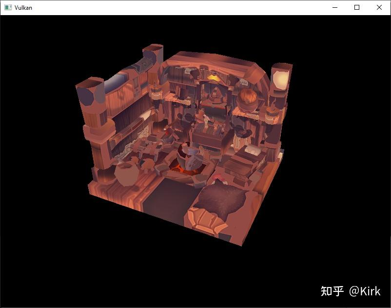
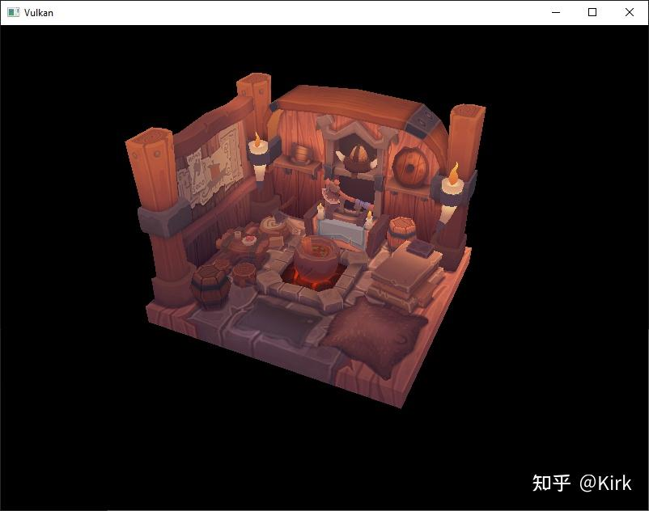

# Vulkan开发学习记录 25 - 载入模型

## 载入顶点和索引

现在我们从模型文件加载顶点数据和索引数据，删除之前我们定义的`vertices`和`indices`这两个[全局变量](https://zhida.zhihu.com/search?content_id=225239327&content_type=Article&match_order=1&q=全局变量&zhida_source=entity)，使用大小可变的向量来重新定义它们：

```cpp
std::vector<Vertex> vertices;
std::vector<uint32_t> indices;
VkBuffer vertexBuffer;
VkDeviceMemory vertexBufferMemory;
```

由于我们使用的模型包含的顶点个数远远大于65535，所以不能使用uint16_t 作为索引的数据类型，而应该使用uint32_t 作为索引的数据类型。更改索引数据类型后，还要修改我们调用vkCmdBindIndexBuffer函数时使用的参数：

```cpp
vkCmdBindIndexBuffer(commandBuffer, indexBuffer, 0, VK_INDEX_TYPE_UINT32);
```

tinyobjloader 库的使用和STB库类似，我们需要定义`TINYOBJLOADER_IMPLEMENTATION`宏来让它包含函数实现，不然就会在编译时出现链接错误：

```cpp
#define TINYOBJLOADER_IMPLEMENTATION
#include <tiny_obj_loader.h>
```

现在编写用于载入模型文件的`loadModel`函数，它负责填充模型数据到`vertices`和`indices`。我们在顶点缓冲和[索引缓冲](https://zhida.zhihu.com/search?content_id=225239327&content_type=Article&match_order=1&q=索引缓冲&zhida_source=entity)创建之前调用它来载入模型数据：

```cpp
void initVulkan() {
    ...
    loadModel();
    createVertexBuffer();
    createIndexBuffer();
    ...
}

...

void loadModel() {

}
```

模型数据的载入是通过调用tinyobj::LoadObj完成的：

```cpp
void loadModel() {
    tinyobj::attrib_t attrib;
    std::vector<tinyobj::shape_t> shapes;
    std::vector<tinyobj::material_t> materials;
    std::string warn, err;

    if (!tinyobj::LoadObj(&attrib, &shapes, &materials, &warn, &err, MODEL_PATH.c_str())) {
        throw std::runtime_error(warn + err);
    }
}
```

一个OBJ模型文件包含了模型的位置、法线、[纹理坐标](https://zhida.zhihu.com/search?content_id=225239327&content_type=Article&match_order=1&q=纹理坐标&zhida_source=entity)和表面数据。 表面数据包含了构成表面的多个顶点数据的索引。

我们在loadModel函数中使用 attrib 变量来存储载入的位置、法线和纹理坐标数据。使用shapes变量存储独立的对象和它们的表面数据。每个表面数据包含了一个顶点数组，顶点数组中的每个顶点数据包含了顶点的位置索引、法线索引和纹理坐标索引。OBJ[模型文件](https://zhida.zhihu.com/search?content_id=225239327&content_type=Article&match_order=4&q=模型文件&zhida_source=entity)格式允许为模型的每个 表面定义材质和纹理数据，但在这里，我们没有用到。

我们使用err变量来存储载入模型文件时产生的错误和警告信息，比如 载入时没有找到引用的材质信息。如果载入模型文件失败，那么tinyobj::LoadObj函数就会返回false。之前提到，OBJ模型文件中的表面数据可以包含任意数 量的顶点数据，但我们的程序只能渲染三角形表面，这就需要进行转换将OBJ模型文件中的表面数据都转换为三角形表面。tinyobj::LoadObj函数 有一个可选的默认参数，可以设置在加载OBJ模型数据时将表面[数据转换](https://zhida.zhihu.com/search?content_id=225239327&content_type=Article&match_order=1&q=数据转换&zhida_source=entity)为三角形表面。由于这一设置是默认的，所以，我们不需要自己设置它。

接着，我们将加载的表面数据复制到我们的 vertices 和 indices 向量中， 这只需要遍历 shapes 向量即可：

```cpp
for (const auto& shape : shapes) {

}
```

载入的表面数据已经被[三角形化](https://zhida.zhihu.com/search?content_id=225239327&content_type=Article&match_order=1&q=三角形化&zhida_source=entity)，所以我们可以直接将它们复制到 vertices 向量中：

```cpp
for (const auto& shape : shapes) {
    for (const auto& index : shape.mesh.indices) {
        Vertex vertex{};

        vertices.push_back(vertex);
        indices.push_back(indices.size());
    }
}
```

为了简化 indices 数组的处理，我们这里假定每个顶点都是独一无二的， 可以直接使用 indices 数组的当前大小作为顶点索引数据。上面代码中的 index 变量的类型为 tinyobj::index_t，这一类型的变量包含了 vertex_index、`normal_index`和 `texcoord_index`三个[成员变量](https://zhida.zhihu.com/search?content_id=225239327&content_type=Article&match_order=1&q=成员变量&zhida_source=entity)。我们使用这三个成员变量来检索存储在`attrib`数组变量中的顶点数据：

```cpp
vertex.pos = {
    attrib.vertices[3 * index.vertex_index + 0],
    attrib.vertices[3 * index.vertex_index + 1],
    attrib.vertices[3 * index.vertex_index + 2]
};

vertex.texCoord = {
    attrib.texcoords[2 * index.texcoord_index + 0],
    attrib.texcoords[2 * index.texcoord_index + 1]
};

vertex.color = {1.0f, 1.0f, 1.0f};
```

attrib.vertices 是一个[浮点数组](https://zhida.zhihu.com/search?content_id=225239327&content_type=Article&match_order=1&q=浮点数组&zhida_source=entity)，并非 glm::vec3 数组，我们需要在使用[索引检索](https://zhida.zhihu.com/search?content_id=225239327&content_type=Article&match_order=1&q=索引检索&zhida_source=entity)顶点数据时首先要把索引值乘以3才能得到正确的顶点数据位置。 对于纹理坐标数据，则乘以2进行检索。对于顶点位置数据，[偏移值](https://zhida.zhihu.com/search?content_id=225239327&content_type=Article&match_order=1&q=偏移值&zhida_source=entity)0对应X坐标，偏移值1对应Y坐标，偏移值2对应Z坐标。对于纹理坐标数据， 偏移值0对应U坐标，偏移值1对应V坐标。

现在使用优化模式编译我们的程序。这样做可以提高我们的模型加载速度。运行程序， 应该可以看到下面这样的画面：



看起来，模型的几何形状是正确的，但[纹理映射](https://zhida.zhihu.com/search?content_id=225239327&content_type=Article&match_order=1&q=纹理映射&zhida_source=entity)不对。这是因为Vulkan的纹理坐标的原点是左上角，而OBJ模型文件格式假设纹理坐标原点是左下角。我们可以通过反转纹理的[Y坐标](https://zhida.zhihu.com/search?content_id=225239327&content_type=Article&match_order=2&q=Y坐标&zhida_source=entity)解决这一问题：

```cpp
vertex.texCoord = {
    attrib.texcoords[2 * index.texcoord_index + 0],
    1.0f - attrib.texcoords[2 * index.texcoord_index + 1]
};
```

现在再次编译运行程序，就可以看到被正确映射纹理的模型了：



## 顶点去重

按照之前的处理，我们没有达到索引缓冲节约空间的目的。三角形表面的顶点是被多个三角形表面共用的，而我们则是每个顶点都重新定义一 次，vertices 向量包含了大量重复的顶点数据。我们可以将完全相同的顶点数据只保留一个，来解决空间。这一去重过程可以通过STL的MAP或unordered_map来实现：

```cpp
#include <unordered_map>

...

std::unordered_map<Vertex, uint32_t> uniqueVertices{};

for (const auto& shape : shapes) {
    for (const auto& index : shape.mesh.indices) {
        Vertex vertex{};

        ...

        if (uniqueVertices.count(vertex) == 0) {
            uniqueVertices[vertex] = static_cast<uint32_t>(vertices.size());
            vertices.push_back(vertex);
        }

        indices.push_back(uniqueVertices[vertex]);
    }
}
```

在从OBJ模型文件加载模型数据时，我们检查加载的顶点数据是否与已经加载的数据完全相同，如果相同，就不再将其加入vertices 向量，将已经加载的顶点数据的索引存储到 indices 向量中。如果不同，将其加入vertices 向量，并存储它对应的索引值到 uniqueVertices 容器中。然后将其索引存储在indices 向量中。

我们需要实现两个函数来让 Vertex 结构体可以作为 map 变量的键值来检索 map 变量，首先是==函数：

```cpp
bool operator==(const Vertex& other) const {
    return pos == other.pos && color == other.color && texCoord == other.texCoord;
}
```

然后是对 Vertex 结构体进行[哈希](https://zhida.zhihu.com/search?content_id=225239327&content_type=Article&match_order=1&q=哈希&zhida_source=entity)的函数：

```cpp
namespace std {
    template<> struct hash<Vertex> {
        size_t operator()(Vertex const& vertex) const {
            return ((hash<glm::vec3>()(vertex.pos) ^
                   (hash<glm::vec3>()(vertex.color) << 1)) >> 1) ^
                   (hash<glm::vec2>()(vertex.texCoord) << 1);
        }
    };
}
```

上面这两个函数的代码需要放在 Vertex 结构体的定义外。GLM 库的变量类型的[哈希函数](https://zhida.zhihu.com/search?content_id=225239327&content_type=Article&match_order=1&q=哈希函数&zhida_source=entity)可以通过下面的代码包含到我们的程序中：

```cpp
#define GLM_ENABLE_EXPERIMENTAL
#include <glm/gtx/hash.hpp>
```

GLM 库的哈希函数目前还是一个试验性的扩展，被定义在了GLM 库的gtx目录下。所以需要我们定义`GLM_ENABLE_EXPERIMENTAL`宏来启用它。作为试验性扩展意味着在未来版本的GLM库有可能发生变化，但一般而言，我们可以认为变化不会太大。

现在重新编译运行程序，查看 vertices 向量的大小，可以发现 vertices 向量的大小从1，500，000 下降到了265，645。这也说明对于我们的模型数据，每个顶点数据平均被 6 个三角形表面使用。

## 工程链接

[https://github.com/Kirkice/JourneyThroughVulkangithub.com/Kirkice/JourneyThroughVulkan](https://link.zhihu.com/?target=https%3A//github.com/Kirkice/JourneyThroughVulkan)

## 参考

[1]. [Loading models - Vulkan Tutorial](https://vulkan-tutorial.com/Loading_models)