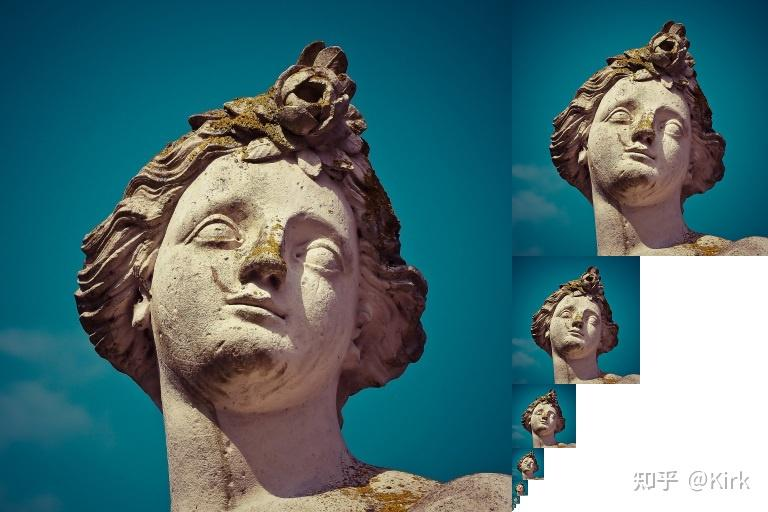
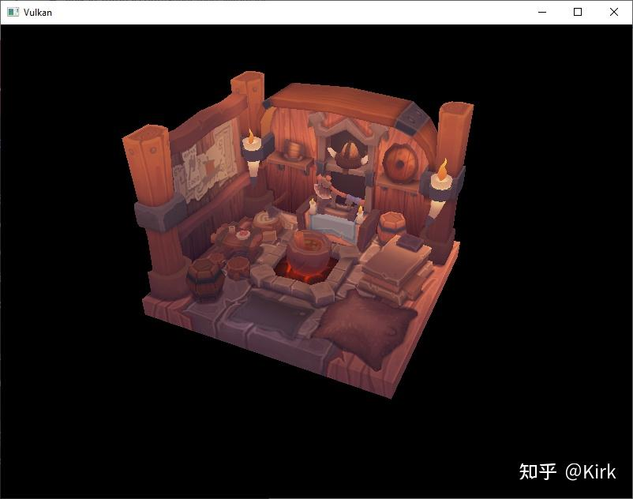
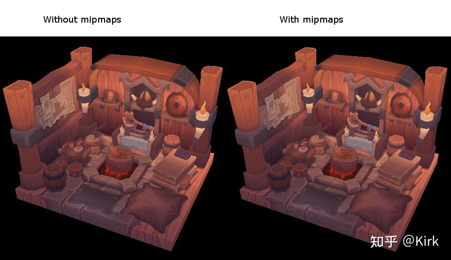
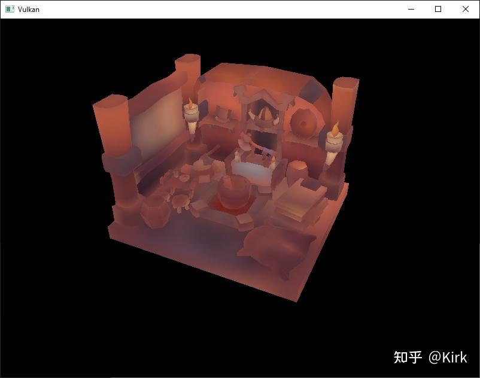

# Vulkan开发学习记录 26 - 生成细化贴图

## 介绍

在上一章节，我们成功将OBJ[模型文件](https://zhida.zhihu.com/search?content_id=225268930&content_type=Article&match_order=1&q=模型文件&zhida_source=entity)中的模型渲染出来。在这一章节，我们为我们的程序添加一个新的特性：细化贴图。细化贴图在游戏和[渲染软件](https://zhida.zhihu.com/search?content_id=225268930&content_type=Article&match_order=1&q=渲染软件&zhida_source=entity)中的应用非常广泛，Vulkan 同样支持细化贴图这一特性。

细化贴图是预先计算的不同缩放层次的一组[纹理图像](https://zhida.zhihu.com/search?content_id=225268930&content_type=Article&match_order=1&q=纹理图像&zhida_source=entity)。这一组纹理图像按照图像大小从大到小排列，每张图像的大小通常是上一张图像大小的一半。细化贴图经常被用来实现层次化细节效果(LOD)。通过对离摄像机较远的对象使用较小的纹理图像，对于较近的对象使用较精细的纹理图像， 从而达到既不损失效果，又节约计算资源的目的。

## 创建图像

对于 Vulkan 来说，一组细化贴图的每一张图像需要使用不同的细化级别设置存储在 VkImage 对象中。细化级别设置为0的 VkImage [对象存储](https://zhida.zhihu.com/search?content_id=225268930&content_type=Article&match_order=1&q=对象存储&zhida_source=entity)的是源图像，细化级别设置大于 0 的 VkImage 对象会被细化链引用使用。

细化级别是在创建 VkImage 对象时设置的，之前，我们一直将其设置为1。现在我们根据图像的尺寸来计算它。添加一个类[成员变量](https://zhida.zhihu.com/search?content_id=225268930&content_type=Article&match_order=1&q=成员变量&zhida_source=entity)来存储计算出的细化级别个数：

```cpp
...
uint32_t mipLevels;
VkImage textureImage;
...
```

mipLevels 成员变量的值可以在 createTextureImage 函数载入纹理图像时计算得到：

```cpp
int texWidth, texHeight, texChannels;
stbi_uc* pixels = stbi_load(TEXTURE_PATH.c_str(), &texWidth, &texHeight, &texChannels, STBI_rgb_alpha);
...
mipLevels = static_cast<uint32_t>(std::floor(std::log2(std::max(texWidth, texHeight)))) + 1;
```



上面代码我们通过 [max 函数](https://zhida.zhihu.com/search?content_id=225268930&content_type=Article&match_order=1&q=max+函数&zhida_source=entity)来选择纹理尺寸中较大的那个，然后对其对以 2 为底的对数，并将结果向下取整后+1得到细化级别的个数，也就是 mipLevels 的值。

我们需要对 createImage、createImageView 和 transitionImageLayout 函数进行修改为它们添加 mipLevels 参数：

```cpp
void createImage(uint32_t width, uint32_t height, uint32_t mipLevels, VkFormat format, VkImageTiling tiling, VkImageUsageFlags usage, VkMemoryPropertyFlags properties, VkImage& image, VkDeviceMemory& imageMemory) {
    ...
    imageInfo.mipLevels = mipLevels;
    ...
}

VkImageView createImageView(VkImage image, VkFormat format, VkImageAspectFlags aspectFlags, uint32_t mipLevels) {
    ...
    viewInfo.subresourceRange.levelCount = mipLevels;
    ...

void transitionImageLayout(VkImage image, VkFormat format, VkImageLayout oldLayout, VkImageLayout newLayout, uint32_t mipLevels) {
    ...
    barrier.subresourceRange.levelCount = mipLevels;
    ...
```

更新对它们进行的调用，确保使用正确的参数进行调用：

```cpp
createImage(swapChainExtent.width, swapChainExtent.height, 1, depthFormat, VK_IMAGE_TILING_OPTIMAL, VK_IMAGE_USAGE_DEPTH_STENCIL_ATTACHMENT_BIT, VK_MEMORY_PROPERTY_DEVICE_LOCAL_BIT, depthImage, depthImageMemory);
...
createImage(texWidth, texHeight, mipLevels, VK_FORMAT_R8G8B8A8_SRGB, VK_IMAGE_TILING_OPTIMAL, VK_IMAGE_USAGE_TRANSFER_DST_BIT | VK_IMAGE_USAGE_SAMPLED_BIT, VK_MEMORY_PROPERTY_DEVICE_LOCAL_BIT, textureImage, textureImageMemory);


swapChainImageViews[i] = createImageView(swapChainImages[i], swapChainImageFormat, VK_IMAGE_ASPECT_COLOR_BIT, 1);
...
depthImageView = createImageView(depthImage, depthFormat, VK_IMAGE_ASPECT_DEPTH_BIT, 1);
...
textureImageView = createImageView(textureImage, VK_FORMAT_R8G8B8A8_SRGB, VK_IMAGE_ASPECT_COLOR_BIT, mipLevels);


transitionImageLayout(depthImage, depthFormat, VK_IMAGE_LAYOUT_UNDEFINED, VK_IMAGE_LAYOUT_DEPTH_STENCIL_ATTACHMENT_OPTIMAL, 1);
...
transitionImageLayout(textureImage, VK_FORMAT_R8G8B8A8_SRGB, VK_IMAGE_LAYOUT_UNDEFINED, VK_IMAGE_LAYOUT_TRANSFER_DST_OPTIMAL, mipLevels);
```

## 生成细化贴图

我们的纹理图像现在有了多个细化级别，但我们目前还只有 0 级细化的图像数据（也就是原始图像数据），我们需要使用原始图像数据来生成其它细化级别的图像数据。这可以通过使用 `vkCmdBlitImage` 指令来完成。 `vkCmdBlitImage`指令可以进行复制，缩放和过滤图像的操作。我们会多次调用这一指令来生成多个不同细化级别的纹理图像数据。

`vkCmdBlitImage` 指令执行的是传输操作，使用这一指令，需要我们为纹理图像添加作为数据来源和接收目的使用标记。我们在 createTextureImage 函数中为创建的纹理图像添加这些使用标记：

```cpp
...
createImage(texWidth, texHeight, mipLevels, VK_FORMAT_R8G8B8A8_SRGB, VK_IMAGE_TILING_OPTIMAL, VK_IMAGE_USAGE_TRANSFER_SRC_BIT | VK_IMAGE_USAGE_TRANSFER_DST_BIT | VK_IMAGE_USAGE_SAMPLED_BIT, VK_MEMORY_PROPERTY_DEVICE_LOCAL_BIT, textureImage, textureImageMemory);
...
```

和其它图像操作一样，`vkCmdBlitImage` 指令对于它处理的图像的布局有一定的要求。我们可以将整个图像转换到 VK_IMAGE_LAYOUT_GENERAL 布局，这一图像布局满足大多数的指令需求，但使用这一图像布局进行操作 的性能表现不能达到最佳。为了达到最佳性能表现，对于源图像，应该使用VK_IMAGE_LAYOUT_TRANSFER_SRC_OPTIMAL 图像布局。对于目的图像，应该使用VK_IMAGE_LAYOUT_TRANSFER_DST_OPTIMAL图像布局。Vulkan 允许我们独立地对一张图像的不同细化级别进行布局变换。 而每个传输操作一次只会对两个细化级别进行处理，所以，我们可以在使用传输指令前，将使用的两个细化级别的图像布局转换到最佳布局。

transitionImageLayout 函数会对整个图像进行布局变换，需要我们编写管线屏障指令。将createTextureImage函数图像布局变换到`VK_IMAGE_LAYOUT_SHADER_READ_ONLY_OPTIMAL`in 的代码：

```cpp
...
transitionImageLayout(textureImage, VK_FORMAT_R8G8B8A8_SRGB, VK_IMAGE_LAYOUT_UNDEFINED, VK_IMAGE_LAYOUT_TRANSFER_DST_OPTIMAL, mipLevels);
    copyBufferToImage(stagingBuffer, textureImage, static_cast<uint32_t>(texWidth), static_cast<uint32_t>(texHeight));
//transitioned to VK_IMAGE_LAYOUT_SHADER_READ_ONLY_OPTIMAL while generating mipmaps
...
```

上面的代码会让纹理图像的每个细化级别变换为VK_IMAGE_LAYOUT_TRANSFER_DST_OPTIMAL 布局 。在传输指令读取完成后，每个细化级别会被变换到`VK_IMAGE_LAYOUT_SHADER_READ_ONLY_OPTIMAL`blit 布局。

接着，我们编写用于生成原始纹理图像不同细化级别的generateMipmaps [函 数](https://zhida.zhihu.com/search?content_id=225268930&content_type=Article&match_order=1&q=函+数&zhida_source=entity)：

```cpp
void generateMipmaps(VkImage image, int32_t texWidth, int32_t texHeight, uint32_t mipLevels) {
    VkCommandBuffer commandBuffer = beginSingleTimeCommands();

    VkImageMemoryBarrier barrier{};
    barrier.sType = VK_STRUCTURE_TYPE_IMAGE_MEMORY_BARRIER;
    barrier.image = image;
    barrier.srcQueueFamilyIndex = VK_QUEUE_FAMILY_IGNORED;
    barrier.dstQueueFamilyIndex = VK_QUEUE_FAMILY_IGNORED;
    barrier.subresourceRange.aspectMask = VK_IMAGE_ASPECT_COLOR_BIT;
    barrier.subresourceRange.baseArrayLayer = 0;
    barrier.subresourceRange.layerCount = 1;
    barrier.subresourceRange.levelCount = 1;

    endSingleTimeCommands(commandBuffer);
}
```

我们使用同一个VkImageMemoryBarrier对象对多次图像布局变换进行同步。上面代码中对于barrier的设置，只需设置一次，无需修改。subresourceRange.miplevel、oldLayout、srcAccessMask 和dstAccessMask这几个barrier的成员变量则需 要在每次变换前根据需要进行修改。

```cpp
int32_t mipWidth = texWidth;
int32_t mipHeight = texHeight;

for (uint32_t i = 1; i < mipLevels; i++) {

}
```

我们使用循环来遍历所有细化级别，记录每个细化级别使用的`VkCmdBlitImage`指令到指令缓冲中。需要注意，这里的[循环变量](https://zhida.zhihu.com/search?content_id=225268930&content_type=Article&match_order=1&q=循环变量&zhida_source=entity)扩是从1开始，不是从0开始的。

```cpp
barrier.subresourceRange.baseMipLevel = i - 1;
barrier.oldLayout = VK_IMAGE_LAYOUT_TRANSFER_DST_OPTIMAL;
barrier.newLayout = VK_IMAGE_LAYOUT_TRANSFER_SRC_OPTIMAL;
barrier.srcAccessMask = VK_ACCESS_TRANSFER_WRITE_BIT;
barrier.dstAccessMask = VK_ACCESS_TRANSFER_READ_BIT;

vkCmdPipelineBarrier(commandBuffer,
    VK_PIPELINE_STAGE_TRANSFER_BIT, VK_PIPELINE_STAGE_TRANSFER_BIT, 0,
    0, nullptr,
    0, nullptr,
    1, &barrier);
```

上面代码，我们设置将细化级别为i-1的纹理图像变换到VK_IMAGE_LAYOUT_TRANSFER_SRC_OPTIMAL布局。这一变换会在细化级别为i-1的纹理图像数据被写入后(上一次的传输指令写入或`vkCmdCopyBufferToImage`指令写入)进行。当前的传输指令会等待这一变换结束才会执行。

```cpp
VkImageBlit blit{};
blit.srcOffsets[0] = { 0, 0, 0 };
blit.srcOffsets[1] = { mipWidth, mipHeight, 1 };
blit.srcSubresource.aspectMask = VK_IMAGE_ASPECT_COLOR_BIT;
blit.srcSubresource.mipLevel = i - 1;
blit.srcSubresource.baseArrayLayer = 0;
blit.srcSubresource.layerCount = 1;
blit.dstOffsets[0] = { 0, 0, 0 };
blit.dstOffsets[1] = { mipWidth > 1 ? mipWidth / 2 : 1, mipHeight > 1 ? mipHeight / 2 : 1, 1 };
blit.dstSubresource.aspectMask = VK_IMAGE_ASPECT_COLOR_BIT;
blit.dstSubresource.mipLevel = i;
blit.dstSubresource.baseArrayLayer = 0;
blit.dstSubresource.layerCount = 1;
```

接着，我们指定传输操作使用的纹理图像范围。这里我们将srcSubresource.mipLevel成员变量设置为i-1，也就是上一细化级别的纹理图像。将dstSubresource.mipLevel成员变量设置为i，也就是我们要生成的纹理图像的细化级别。srcOffsets 数组用于指定要传输的数据所在的三维图像区域。dstOffsets数组用于指定接收数据的三维图像区域。dstOffsets[1] 的X分量和Y分量的值需要设置为上一 细化级别纹理图像的一半。由于这里我们使用的是二维图像，二维图像的 深度值都为戱，所以srcOffsets[1]和dstOffsets[1] 的Z分量都必须设置为1。

```cpp
vkCmdBlitImage(commandBuffer,
    image, VK_IMAGE_LAYOUT_TRANSFER_SRC_OPTIMAL,
    image, VK_IMAGE_LAYOUT_TRANSFER_DST_OPTIMAL,
    1, &blit,
    VK_FILTER_LINEAR);
```

现在，我们可以开始记录传输指令到[指令缓冲](https://zhida.zhihu.com/search?content_id=225268930&content_type=Article&match_order=2&q=指令缓冲&zhida_source=entity)。可以注意到我们将textureImage变量同时作为`vkCmdBlitImage`指令的源图像和目的图像。这是因为我们的传输操作是在同一[纹理对象](https://zhida.zhihu.com/search?content_id=225268930&content_type=Article&match_order=1&q=纹理对象&zhida_source=entity)的不同细化级别间进行的。传输指令开始执行时源细化级别图像布局刚刚被变换为VK_IMAGE_LAYOUT_TRANSFER_SRC_OPTIMAL， 目的细化级别图像布局仍处于创建纹理时设置的VK_IMAGE_LAYOUT_TRANSFER_DST_OPTIMAL布局。

[vkCmdBlitImage](https://link.zhihu.com/?target=https%3A//www.khronos.org/registry/vulkan/specs/1.0/man/html/vkCmdBlitImage.html) 指令的最后一个参数用于指定传输操作使用的`VkFilter` 对象。这里我们使用和`VkSampler`一样的 VK_FILTER_LINEAR 过滤设置，进行[线性插值](https://zhida.zhihu.com/search?content_id=225268930&content_type=Article&match_order=1&q=线性插值&zhida_source=entity)过滤。

```cpp
barrier.oldLayout = VK_IMAGE_LAYOUT_TRANSFER_SRC_OPTIMAL;
barrier.newLayout = VK_IMAGE_LAYOUT_SHADER_READ_ONLY_OPTIMAL;
barrier.srcAccessMask = VK_ACCESS_TRANSFER_READ_BIT;
barrier.dstAccessMask = VK_ACCESS_SHADER_READ_BIT;

vkCmdPipelineBarrier(commandBuffer,
    VK_PIPELINE_STAGE_TRANSFER_BIT, VK_PIPELINE_STAGE_FRAGMENT_SHADER_BIT, 0,
    0, nullptr,
    0, nullptr,
    1, &barrier);
```

上面代码，我们设置屏障将细化级别为i-1的图像布局变换到VK_IMAGE_LAYOUT_SHADER_READ_ONLY_OPTIMAL 这一变换会等待当前的传输指令结束会才会进行。所有采样操作需要等待这一变换结束才能进行。

```cpp
    ...
    if (mipWidth > 1) mipWidth /= 2;
    if (mipHeight > 1) mipHeight /= 2;
}
```

在遍历细化级别的循环结尾处，我们将mipWidth变量和mipHeight变量的值除以2，计算出下一次循环要使用的细化级别的图像大小。这里的代码，可以处理图像的长宽不同的情况。当图像的长或宽为1时，就不再对其缩放。

```cpp
    barrier.subresourceRange.baseMipLevel = mipLevels - 1;
    barrier.oldLayout = VK_IMAGE_LAYOUT_TRANSFER_DST_OPTIMAL;
    barrier.newLayout = VK_IMAGE_LAYOUT_SHADER_READ_ONLY_OPTIMAL;
    barrier.srcAccessMask = VK_ACCESS_TRANSFER_WRITE_BIT;
    barrier.dstAccessMask = VK_ACCESS_SHADER_READ_BIT;

    vkCmdPipelineBarrier(commandBuffer,
        VK_PIPELINE_STAGE_TRANSFER_BIT, VK_PIPELINE_STAGE_FRAGMENT_SHADER_BIT, 0,
        0, nullptr,
        0, nullptr,
        1, &barrier);

    endSingleTimeCommands(commandBuffer);
}
```

在我们开始执行指令缓冲前，我们需要插入一个管线障碍用于将最后一个细化级别的图像布局从VK_IMAGE_LAYOUT_TRANSFER_DST_OPTIMAL变换为VK_IMAGE_LAYOUT_SHADER_READ_ONLY_OPTIMAL。这样做是因为最后一个细化级别的图像不会被作为传输指令的数据来源，所以就不会将布局变换为VK_IMAGE_LAYOUT_SHADER_READ_ONLY_OPTIMAL， 需要我们手动进行变换。

最后，在createTextureImage 函数中添加对generateMipmaps 函数的调用：

```cpp
transitionImageLayout(textureImage, VK_FORMAT_R8G8B8A8_SRGB, VK_IMAGE_LAYOUT_UNDEFINED, VK_IMAGE_LAYOUT_TRANSFER_DST_OPTIMAL, mipLevels);
    copyBufferToImage(stagingBuffer, textureImage, static_cast<uint32_t>(texWidth), static_cast<uint32_t>(texHeight));
//transitioned to VK_IMAGE_LAYOUT_SHADER_READ_ONLY_OPTIMAL while generating mipmaps
...
generateMipmaps(textureImage, texWidth, texHeight, mipLevels);
```

至此，我们就生成了所有细化级别的纹理图像

## [线性过滤](https://zhida.zhihu.com/search?content_id=225268930&content_type=Article&match_order=1&q=线性过滤&zhida_source=entity)支持

虽然使用内建的`vkCmdBlitImage`指令来生成纹理的所有细化级别非常 方便，但并非所有平台都支持这一指令。它需要我们使用的纹理图像格式 支持线性过滤特性。我们可以通过调用`vkGetPhysicalDeviceFormatProperties` 函数来检查这一特性是否被支持。

首先，为 generateMipmaps 函数添加一个参数用于指定使用的纹理图像格式：

```cpp
void createTextureImage() {
    ...

    generateMipmaps(textureImage, VK_FORMAT_R8G8B8A8_SRGB, texWidth, texHeight, mipLevels);
}

void generateMipmaps(VkImage image, VkFormat imageFormat, int32_t texWidth, int32_t texHeight, uint32_t mipLevels) {

    ...
}
```

在 generateMipmaps 函数中，调用 `vkGetPhysicalDeviceFormatProperties`函数查询指定的纹理图像格式的属性：

```cpp
void generateMipmaps(VkImage image, VkFormat imageFormat, int32_t texWidth, int32_t texHeight, uint32_t mipLevels) {

    // Check if image format supports linear blitting
    VkFormatProperties formatProperties;
    vkGetPhysicalDeviceFormatProperties(physicalDevice, imageFormat, &formatProperties);

    ...
```

`VkFormatProperties`结构体包含了 linearTilingFeatures、optimalTilingFeatures 和 bufferFeatures 三个成员变量，每个成员变量描述了在使用对应模式下，可以使用的特性。我们的纹理图像使用优化的tiling模式创建，所以我们需要检查optimalTilingFeatures 成员变量来确定我们使用的纹理图像格式是否支持线性过滤特性：

```cpp
if (!(formatProperties.optimalTilingFeatures & VK_FORMAT_FEATURE_SAMPLED_IMAGE_FILTER_LINEAR_BIT)) {
    throw std::runtime_error("texture image format does not support linear blitting!");
}
```

此外，我们还可以编写一个函数[遍历](https://zhida.zhihu.com/search?content_id=225268930&content_type=Article&match_order=3&q=遍历&zhida_source=entity)常见的纹理图像格式，查找其中支持线性块传输的格式。或者使用可以生成纹理细化级别的库，比如[stb_image_resize](https://link.zhihu.com/?target=https%3A//github.com/nothings/stb/blob/master/stb_image_resize.h)来生成纹理的所有细化级别，然后使用加载源图像数据一样的方法加载它们。

通常实践中很少在运行时动态生成纹理的细化级别，而是预先生成然 后存储在文件中由程序直接加载所有细化级别的纹理图像。

## [采样器](https://zhida.zhihu.com/search?content_id=225268930&content_type=Article&match_order=1&q=采样器&zhida_source=entity)

我们需要使用`VkSampler`对象来控制读取细化级别的纹理图像数据。 Vulkan 允许我们指定minLod、maxLod、mipLodBias 和mipmapMode 参数用于对纹理进行细化级别采样。它的采样方式可以用下面的代码表示：

```cpp
lod = getLodLevelFromScreenSize(); //smaller when the object is close, may be negative
lod = clamp(lod + mipLodBias, minLod, maxLod);

level = clamp(floor(lod), 0, texture.mipLevels - 1);  //clamped to the number of mip levels in the texture

if (mipmapMode == VK_SAMPLER_MIPMAP_MODE_NEAREST) {
    color = sample(level);
} else {
    color = blend(sample(level), sample(level + 1));
}
```

如果samplerInfo.mipmapMode 变量的值为 VK_SAMPLER_MIPMAP_MODE_NEAREST， 就会根据计算出的细化级别选择对应的纹理图像进行采样。如果它的值为VK_SAMPLER_MIPMAP_MODE_NEAREST，则会使用计算出的相邻两个级别的纹理图像进行线性混合采样。

采样操作同样受上面代码中的lod变量影响：

```cpp
if (lod <= 0) {
    color = readTexture(uv, magFilter);
} else {
    color = readTexture(uv, minFilter);
}
```

如果对象离相机较近，就会使用 magFilter 的过滤设置。如果对象离相机较远，就会使用 minFilter 的过滤设置。通常，lod 的值为非负数，当 lod 的值为 0 时我们认为对象离相机较近。通过设置mipLodBias，我们可以对Vulkan 采样使用的lod和level值进行一定程度的偏移。

在这里，我们将minFilter和magFilter都指定为VK_FILTER_LINEAR。 然后使用下面代码指定其它的细化采样使用的参数：

```cpp
void createTextureSampler() {
    ...
    samplerInfo.mipmapMode = VK_SAMPLER_MIPMAP_MODE_LINEAR;
    samplerInfo.minLod = 0.0f; // Optional
    samplerInfo.maxLod = static_cast<float>(mipLevels);
    samplerInfo.mipLodBias = 0.0f; // Optional
    ...
}
```

这里，我们将minLod设置为0，maxLod设置为纹理图像的最大细化级别。我们不需要对lod的值进行偏移，所以将mipLodBias设置为0。

现在编译运行程序，可以看到下面的画面：



为了方便读者观察使用与不使用细化级别的差异，我们将它们放在下面进行对比：



可以看出，使用包含细化级别的纹理可以得到更加光滑的渲染结果。

读者可以对采样器的设置进行修改来观察它们的渲染结果的影响。比 如修minLod的值，读者可以强制采样器不使用较小细化级别的纹理图像：

```cpp
samplerInfo.minLod = static_cast<float>(mipLevels / 2);
```

下面是这一设置产生的渲染效果：




## 工程链接


[https://github.com/Kirkice/JourneyThroughVulkangithub.com/Kirkice/JourneyThroughVulkan](https://link.zhihu.com/?target=https%3A//github.com/Kirkice/JourneyThroughVulkan)


## 参考

[1]. [Generating Mipmaps](https://vulkan-tutorial.com/Generating_Mipmaps)