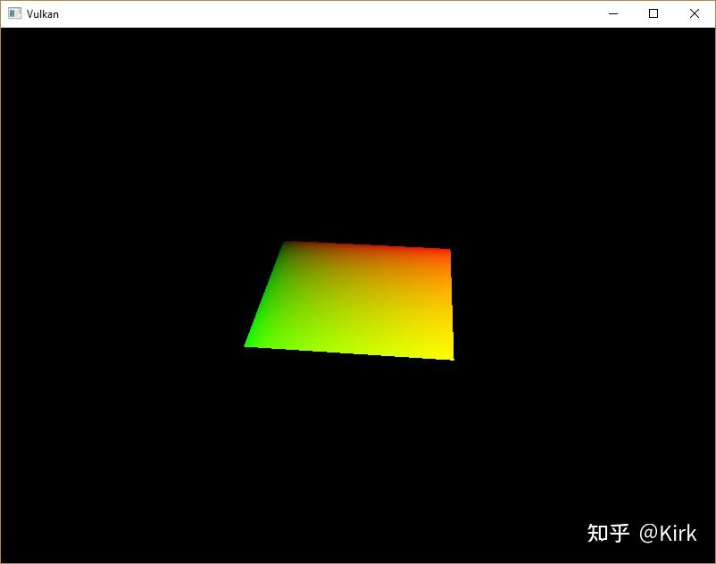
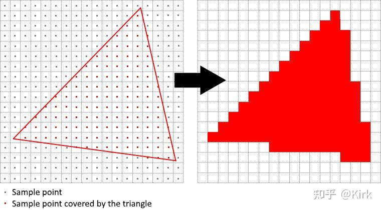
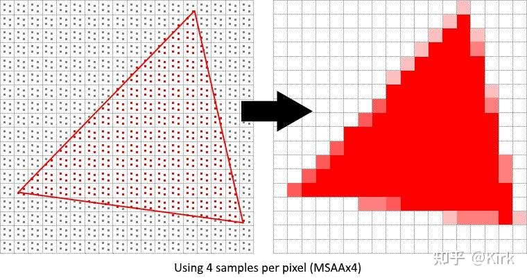
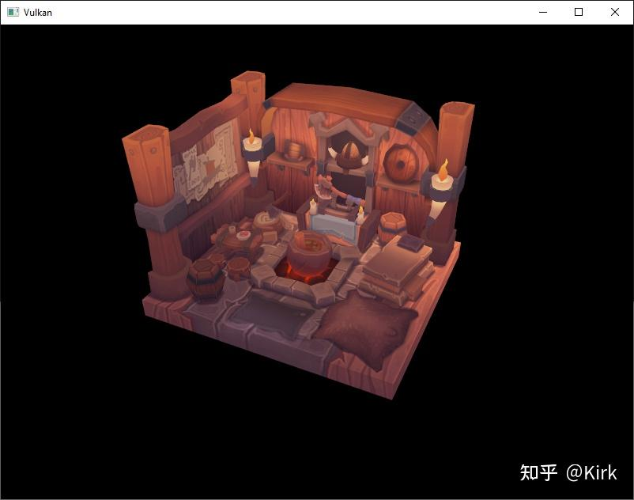
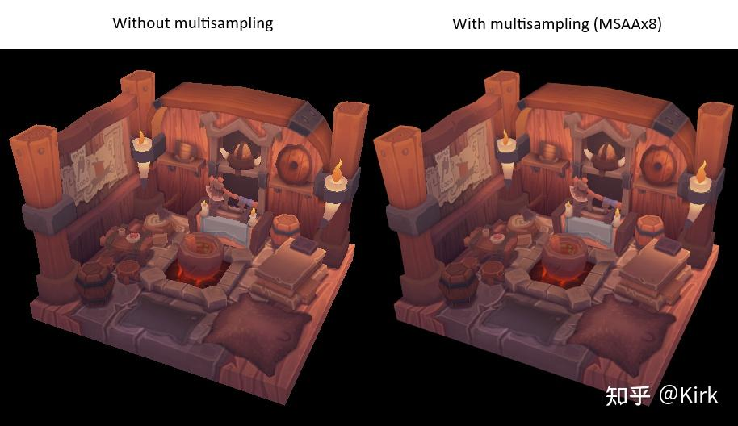
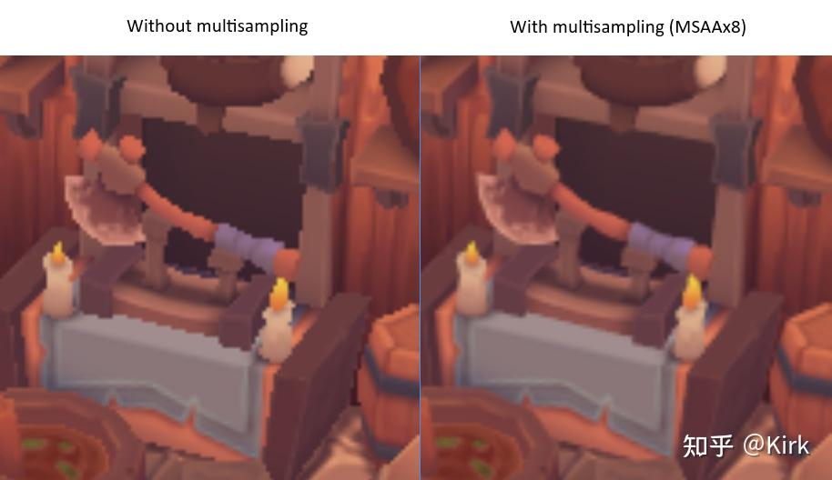
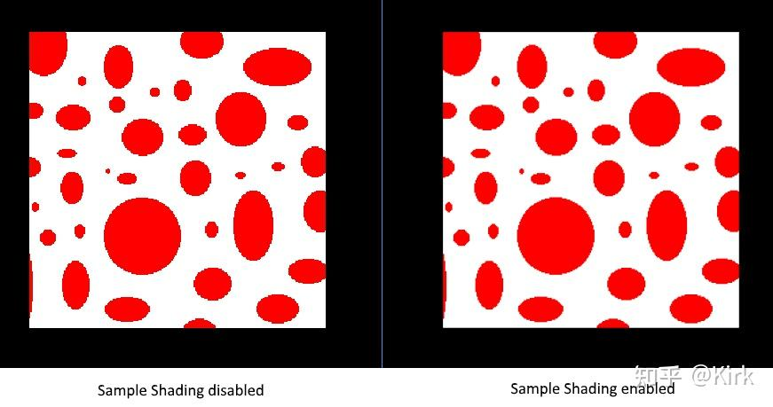

# Vulkan开发学习记录 27 - 多重采样

## 介绍

现在我们的程序已经可以使用带有细化级别的[纹理贴图](https://zhida.zhihu.com/search?content_id=225271088&content_type=Article&match_order=1&q=纹理贴图&zhida_source=entity)，可以在一定程度上解决模型贴图的走样问题。但当绘制的[几何图元](https://zhida.zhihu.com/search?content_id=225271088&content_type=Article&match_order=1&q=几何图元&zhida_source=entity)的边接近水平或接近垂直时，还是会发现明显的锯齿现象。这一想象在我们最初绘制的矩形上看来十分明显：



这类现象也被我们叫做走样，造成它的原因是显示设备的分辨率有限， 而几何图元本质上可以细分为无限的点，当构成几何图元的点粒度较大时， 倾斜的边缘就比较容易出现明显的锯齿现象。有许多改善走样现象的技术， 在本章节，我们介绍其中一种叫做多重采样的[反走样技术](https://zhida.zhihu.com/search?content_id=225271088&content_type=Article&match_order=1&q=反走样技术&zhida_source=entity)（MSAA）。

没有开启多重采样的情况下，像素的最终颜色由在像素中心的一次采样确定。如果一条线段穿过了一个像素，但没有覆盖[采样点](https://zhida.zhihu.com/search?content_id=225271088&content_type=Article&match_order=1&q=采样点&zhida_source=entity)，那么这一像素的颜色仍然保持不变，否则使用线段颜色来填充像素。这就很容易导致[锯齿现象](https://zhida.zhihu.com/search?content_id=225271088&content_type=Article&match_order=3&q=锯齿现象&zhida_source=entity)的出现。



MSAA 技术对每个像素采样多次来确定最终的像素颜色。多次采样可以带来较好的渲染结果，但需要更多的计算量。



这里，我们采用最大可用的样本数实现多重采样。这一做法并非[最佳实践](https://zhida.zhihu.com/search?content_id=225271088&content_type=Article&match_order=1&q=最佳实践&zhida_source=entity)，读者应该根据自己程序的实际需要确定多重采样的样本数。

## 获取可用样本数

我们首先需要确定硬件可以支持采样样本数。目前大多数现代GPU 支持至少8个[采样样本](https://zhida.zhihu.com/search?content_id=225271088&content_type=Article&match_order=2&q=采样样本&zhida_source=entity)，我们添加一个类成员变量来存储涉笔的最大可用采样样本数：

```cpp
...
VkSampleCountFlagBits msaaSamples = VK_SAMPLE_COUNT_1_BIT;
...
```

默认情况下，我们使用一个采样样本，这种情况下渲染的结果和不使用多重采样是一样的。最大可用采样个数可以通过调用VkPhysicalDeviceProperties 扳函数来查询。由于我们还使用了一个[深度缓冲](https://zhida.zhihu.com/search?content_id=225271088&content_type=Article&match_order=1&q=深度缓冲&zhida_source=entity)，我们能使用的最大采样样本数也会小很多。添加一个叫 getMaxUsableSampleCount 的函数查询可用采样数：

```cpp
VkSampleCountFlagBits getMaxUsableSampleCount() {
    VkPhysicalDeviceProperties physicalDeviceProperties;
    vkGetPhysicalDeviceProperties(physicalDevice, &physicalDeviceProperties);

    VkSampleCountFlags counts = physicalDeviceProperties.limits.framebufferColorSampleCounts & physicalDeviceProperties.limits.framebufferDepthSampleCounts;
    if (counts & VK_SAMPLE_COUNT_64_BIT) { return VK_SAMPLE_COUNT_64_BIT; }
    if (counts & VK_SAMPLE_COUNT_32_BIT) { return VK_SAMPLE_COUNT_32_BIT; }
    if (counts & VK_SAMPLE_COUNT_16_BIT) { return VK_SAMPLE_COUNT_16_BIT; }
    if (counts & VK_SAMPLE_COUNT_8_BIT) { return VK_SAMPLE_COUNT_8_BIT; }
    if (counts & VK_SAMPLE_COUNT_4_BIT) { return VK_SAMPLE_COUNT_4_BIT; }
    if (counts & VK_SAMPLE_COUNT_2_BIT) { return VK_SAMPLE_COUNT_2_BIT; }

    return VK_SAMPLE_COUNT_1_BIT;
}
```

我们在选择使用的物理设备时调用 getMaxUsableSampleCount 函数来查询可用采样样本数。修改pickPhysicalDevice 函数实现这一目的：

```cpp
void pickPhysicalDevice() {
    ...
    for (const auto& device : devices) {
        if (isDeviceSuitable(device)) {
            physicalDevice = device;
            msaaSamples = getMaxUsableSampleCount();
            break;
        }
    }
    ...
}
```

## 设置渲染目标

多重采样是在一个离屏缓冲中进行的。这个离屏缓冲与我们之前进行渲染的一般图像对象略有不同。它需要对每个像素保存多个样本数据。多重采样缓冲的数据需要转换后，才能写入[帧缓冲](https://zhida.zhihu.com/search?content_id=225271088&content_type=Article&match_order=1&q=帧缓冲&zhida_source=entity)。和深度缓冲一样，我们只需要一个渲染目标用作多重采样缓冲即可，因为同时只会有一个绘制操作在进行。添加下面这些类[成员变量](https://zhida.zhihu.com/search?content_id=225271088&content_type=Article&match_order=2&q=成员变量&zhida_source=entity)：

```cpp
...
VkImage colorImage;
VkDeviceMemory colorImageMemory;
VkImageView colorImageView;
...
```

我们需要修改createImage 函数，添加numSamples 参数用来指定采样个数：

```cpp
void createImage(uint32_t width, uint32_t height, uint32_t mipLevels, VkSampleCountFlagBits numSamples, VkFormat format, VkImageTiling tiling, VkImageUsageFlags usage, VkMemoryPropertyFlags properties, VkImage& image, VkDeviceMemory& imageMemory) {
    ...
    imageInfo.samples = numSamples;
    ...
```

现在，我们需要更新所有之前对 createImage 函数的调用，保证调用使用的参数正确：

```cpp
createImage(swapChainExtent.width, swapChainExtent.height, 1, VK_SAMPLE_COUNT_1_BIT, depthFormat, VK_IMAGE_TILING_OPTIMAL, VK_IMAGE_USAGE_DEPTH_STENCIL_ATTACHMENT_BIT, VK_MEMORY_PROPERTY_DEVICE_LOCAL_BIT, depthImage, depthImageMemory);
...
createImage(texWidth, texHeight, mipLevels, VK_SAMPLE_COUNT_1_BIT, VK_FORMAT_R8G8B8A8_SRGB, VK_IMAGE_TILING_OPTIMAL, VK_IMAGE_USAGE_TRANSFER_SRC_BIT | VK_IMAGE_USAGE_TRANSFER_DST_BIT | VK_IMAGE_USAGE_SAMPLED_BIT, VK_MEMORY_PROPERTY_DEVICE_LOCAL_BIT, textureImage, textureImageMemory);
```

创建多重采样颜色缓冲。添加一个叫做`createColorResources`的函数， 这里我们使用`msaaSamples`作为图像的采样个数。我们将图像的细化级别 数目设置为1。Vulkan 规范要求对于采样个数大于1的图像只能使用1个细化级别。实际上，对于多重采样颜色缓冲来说也只需要一个细化级别来存储原始图像数据，毕竟它不会被作为纹理贴图进行渲染。

```cpp
void createColorResources() {
    VkFormat colorFormat = swapChainImageFormat;

    createImage(swapChainExtent.width, swapChainExtent.height, 1, msaaSamples, colorFormat, VK_IMAGE_TILING_OPTIMAL, VK_IMAGE_USAGE_TRANSIENT_ATTACHMENT_BIT | VK_IMAGE_USAGE_COLOR_ATTACHMENT_BIT, VK_MEMORY_PROPERTY_DEVICE_LOCAL_BIT, colorImage, colorImageMemory);
    colorImageView = createImageView(colorImage, colorFormat, VK_IMAGE_ASPECT_COLOR_BIT, 1);
}
```

我们在创建深度缓冲资源的[函数调用](https://zhida.zhihu.com/search?content_id=225271088&content_type=Article&match_order=1&q=函数调用&zhida_source=entity)之前调用createColorResources 函数创建多重采样缓冲：

```cpp
void initVulkan() {
    ...
    createColorResources();
    createDepthResources();
    ...
}
```

现在我们需要修改createDepthResources 函数，更新深度缓冲使用的采样个数：

```cpp
void createDepthResources() {
    ...
    createImage(swapChainExtent.width, swapChainExtent.height, 1, msaaSamples, depthFormat, VK_IMAGE_TILING_OPTIMAL, VK_IMAGE_USAGE_DEPTH_STENCIL_ATTACHMENT_BIT, VK_MEMORY_PROPERTY_DEVICE_LOCAL_BIT, depthImage, depthImageMemory);
    ...
}
```

最后，不要忘记在清除[交换链](https://zhida.zhihu.com/search?content_id=225271088&content_type=Article&match_order=1&q=交换链&zhida_source=entity)时，清除我们创建的与多重采样缓冲相关的资源：

```cpp
void cleanupSwapChain() {
    vkDestroyImageView(device, colorImageView, nullptr);
    vkDestroyImage(device, colorImage, nullptr);
    vkFreeMemory(device, colorImageMemory, nullptr);
    ...
}
```

修改`recreateSwapChain` 函数，在窗口大小变化时重建多重采样缓冲：

```cpp
void recreateSwapChain() {
    ...
    createImageViews();
    createColorResources();
    createDepthResources();
    ...
}
```

至此，我们就完成了多重采样缓冲的设置，可以在图形管线中使用它了。

## 添加附着

修改createRenderPass函数，更新对颜色附着和深度附着的设置

```cpp
void createRenderPass() {
    ...
    colorAttachment.samples = msaaSamples;
    colorAttachment.finalLayout = VK_IMAGE_LAYOUT_COLOR_ATTACHMENT_OPTIMAL;
    ...
    depthAttachment.samples = msaaSamples;
    ...
```

读者可能已经注意到，我们将`VK_IMAGE_LAYOUT_PRESENT_SRC_KHR`布局改为VK_IMAGE_LAYOUT_COLOR_ATTACHMENT_OPTIMAL。这样做是因为多重采样缓冲不能直接用于呈现操作。我们需要先把它转换为普通的图形形式。对于深度缓冲，不需要进行呈现操作，也就不需要对其进行转换。添加一个新的颜色附着用于转换多重采样缓冲数据：

```cpp
    ...
    VkAttachmentDescription colorAttachmentResolve{};
    colorAttachmentResolve.format = swapChainImageFormat;
    colorAttachmentResolve.samples = VK_SAMPLE_COUNT_1_BIT;
    colorAttachmentResolve.loadOp = VK_ATTACHMENT_LOAD_OP_DONT_CARE;
    colorAttachmentResolve.storeOp = VK_ATTACHMENT_STORE_OP_STORE;
    colorAttachmentResolve.stencilLoadOp = VK_ATTACHMENT_LOAD_OP_DONT_CARE;
    colorAttachmentResolve.stencilStoreOp = VK_ATTACHMENT_STORE_OP_DONT_CARE;
    colorAttachmentResolve.initialLayout = VK_IMAGE_LAYOUT_UNDEFINED;
    colorAttachmentResolve.finalLayout = VK_IMAGE_LAYOUT_PRESENT_SRC_KHR;
    ...
```

设置渲染流程引用这一新添加的附着。使用一个VkAttachmentReference结构体引用我们刚刚创建的颜色附着：

```cpp
    ...
    VkAttachmentReference colorAttachmentResolveRef{};
    colorAttachmentResolveRef.attachment = 2;
    colorAttachmentResolveRef.layout = VK_IMAGE_LAYOUT_COLOR_ATTACHMENT_OPTIMAL;
    ...
```

设置扰`pResolveAttachments`成员变量指向刚刚添加的VkAttachmentReference结构体。

```cpp
    ...
    subpass.pResolveAttachments = &colorAttachmentResolveRef;
    ...
```

更新渲染流程结构体信息，包含新得颜色附着：

```cpp
    ...
    std::array<VkAttachmentDescription, 3> attachments = {colorAttachment, depthAttachment, colorAttachmentResolve};
    ...
```

修改`createFramebuffers` 函数，添加新的图像视图到attachment中：

```cpp
void createFramebuffers() {
        ...
        std::array<VkImageView, 3> attachments = {
            colorImageView,
            depthImageView,
            swapChainImageViews[i]
        };
        ...
}
```

最后，修改createGraphicsPipeline函数，设置图像管线使用的采样样本数：

```cpp
void createGraphicsPipeline() {
    ...
    multisampling.rasterizationSamples = msaaSamples;
    ...
}
```

现在编译运行程序就可以看到下面的画面：



我们与之前不使用多重采样的结果进行对比：



在模型的边缘处可以看到明显的不同：




## 提升质量

我们目前实现的多重采样还有很大的提升空间。比如，由[着色器](https://zhida.zhihu.com/search?content_id=225271088&content_type=Article&match_order=1&q=着色器&zhida_source=entity)造成的走样我们还没有处理。MSAA只对几何图元的边缘进行平滑处理，但不会对图元的内部进行处理。这就造成几何图元上的贴图仍会出现走样现象。 可以通过开启采样着色来解决这一问题，但这样做会造成一定的性能损失：

在本例，我们关闭了采样着色。但在某些情况下，开启它后[渲染质量](https://zhida.zhihu.com/search?content_id=225271088&content_type=Article&match_order=1&q=渲染质量&zhida_source=entity)的改善会很明显：



## [工程链接](https://zhida.zhihu.com/search?content_id=225271088&content_type=Article&match_order=1&q=工程链接&zhida_source=entity)


[https://github.com/Kirkice/JourneyThroughVulkangithub.com/Kirkice/JourneyThroughVulkan](https://link.zhihu.com/?target=https%3A//github.com/Kirkice/JourneyThroughVulkan)


## 参考

[1]. [Multisampling - Vulkan Tutorial](https://vulkan-tutorial.com/Multisampling)

