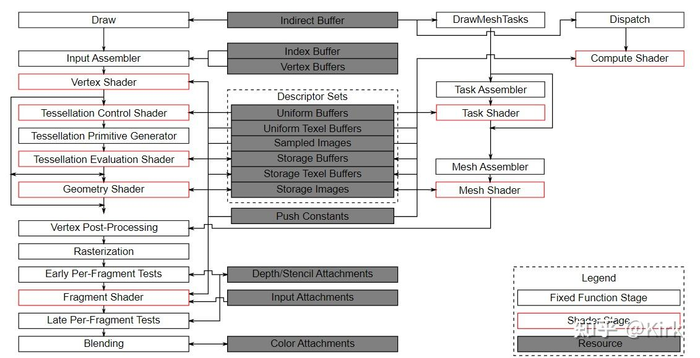
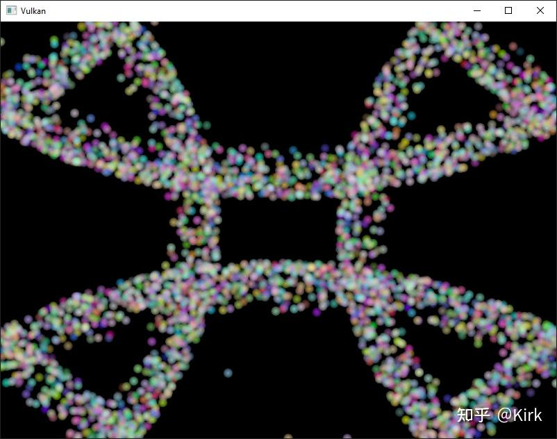
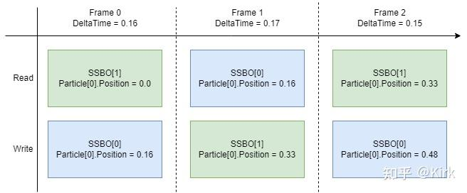
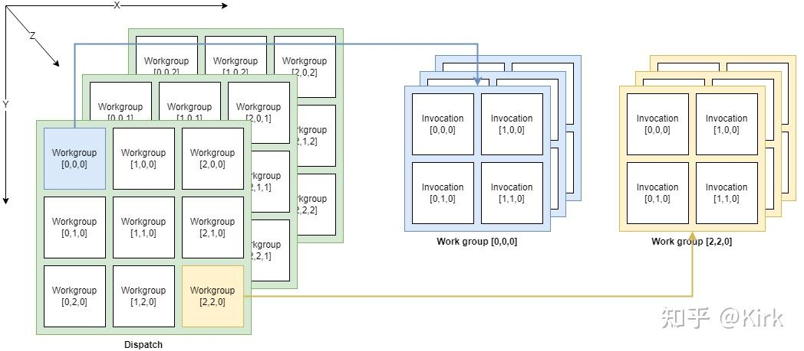

# Vulkan开发学习记录 28 - 计算着色器

## 介绍

在这个额外章节中，我们将会介绍[计算着色器](https://zhida.zhihu.com/search?content_id=225271956&content_type=Article&match_order=1&q=计算着色器&zhida_source=entity)（compute shaders）。迄今为止，所有之前的章节都涉及到了 Vulkan 管道中传统的图形部分。但与 OpenGL 等旧的 API 不同的是，在 Vulkan 中，计算着色器的支持是强制性的。这意味着您可以在任何可用的 Vulkan 实现上使用计算着色器，无论是高端台式机 GPU 还是低功耗嵌入式设备。

这为在图形处理器单元（GPGPU）上进行通用计算打开了世界，无论您的应用在哪里运行。GPGPU 意味着您可以在 GPU 上进行通用计算，这在传统上一直是 CPU 的领域。但是随着 GPU 变得越来越强大和更加灵活，许多需要 CPU 的通用目的能力的工作负载现在可以实时在 GPU 上完成。

GPU 的计算能力可以用于许多地方，例如图像操作、可见性测试、后处理、高级光照计算、动画、物理学（例如粒子系统）等等。甚至可以将计算用于仅需要进行非视觉计算的工作，而不需要任何图形输出，例如数字计算或人工智能相关任务。这被称为“[无头计算](https://zhida.zhihu.com/search?content_id=225271956&content_type=Article&match_order=1&q=无头计算&zhida_source=entity)”（headless compute）。

## 优势

在 GPU 上进行计算密集型计算有几个优势。最明显的优势是将工作从 CPU 上卸载下来。另一个优势是不需要在 CPU 的主内存和 GPU 的内存之间移动数据。所有数据都可以留在 GPU 上，而无需等待来自主内存的缓慢传输。

除此之外，GPU 具有强大的并行性，其中一些 GPU 拥有数万个小的计算单元。这通常使它们比具有少量大型计算单元的 CPU 更适合高度并行的工作流程。

## Vulkan 管道

重要的是要知道，计算完全与管道的图形部分分开。这在来自官方规范的 Vulkan 管道的以下块图中是可见的：



在这个图示中，我们可以看到管道左侧的传统图形部分，以及右侧的几个阶段，它们不是这个图形管道的一部分，其中包括计算着色器（阶段）。由于计算着色器阶段与图形管道分离，我们可以在任何需要的地方使用它。这与例如片段着色器非常不同，后者总是应用于顶点着色器的转换输出。

图示的中心还显示，例如描述符集（descriptor sets）也被计算使用，因此我们学习的关于描述符布局、描述符集和描述符的所有内容也适用于这里。

## 例子

在本章中，我们将实现一个易于理解的例子，即基于GPU的粒子系统。这样的系统在许多游戏中使用，通常由数千个粒子组成，需要以交互帧率更新。渲染这样的系统需要两个主要组件：作为顶点缓冲传递的顶点以及一种基于某个方程式更新它们的方法。

“经典的”基于CPU的粒子系统会将粒子数据存储在系统的主内存中，然后使用CPU对它们进行更新。更新后，顶点需要再次传输到GPU的内存中，以便在下一帧中显示更新后的粒子。最简单的方法是每帧都使用新数据重新创建顶点缓冲。这显然非常昂贵。根据您的实现，还有其他选项，例如映射GPU内存以便CPU可以写入它（在桌面系统上称为“可调整大小的BAR”或在集成GPU上称为统一内存），或仅使用主机本地缓冲区（这将是由于PCI-E带宽而最慢的方法）。但无论您选择哪种缓冲区更新方法，都需要进行“往返”到CPU以更新粒子。

在基于GPU的粒子系统中，不再需要进行这种往返。顶点仅在开始时上传到GPU，并且所有更新都在GPU的内存中使用计算着色器完成。这是更快的主要原因之一是GPU与其本地内存之间的带宽更高得多。在基于CPU的场景中，您将受到主内存和PCI-Express带宽的限制，这通常仅是GPU内存带宽的一小部分。

在具有专用计算队列的GPU上执行此操作时，您可以并行更新图形管道的渲染部分中的粒子。这称为“异步计算”，是本教程未涉及的高级主题。

以下是本章代码的截图。这里显示的粒子是由计算着色器直接在GPU上更新的，没有任何CPU交互：



## 数据操作

在本教程中，我们已经学习了不同的缓冲区类型，如用于传递基元的顶点和索引缓冲区以及用于将数据传递到着色器的统一缓冲区。我们还使用了图像来进行纹理映射。但是到目前为止，我们总是使用 CPU 写入数据，并且只在 GPU 上读取数据。

计算着色器引入的一个重要概念是可以任意地从缓冲区中读取和写入数据。为此，Vulkan 提供了两种专用存储类型。

## 着色器存储缓冲对象（Shader Storage Buffer Objects，SSBO）

着色器存储缓冲（SSBO）允许着色器从缓冲区中读取和写入数据。使用它们与使用统一缓冲区对象类似。最大的区别是您可以将其他缓冲区类型别名为 SSBO 并且它们可以任意大。

回到基于 GPU 的粒子系统，您现在可能会想知道如何处理由计算着色器更新（写入）并由顶点着色器读取（绘制）的顶点，因为这两个用途似乎需要不同的缓冲区类型。

但事实并非如此。在 Vulkan 中，您可以为缓冲区和图像指定多个用途。因此，为了将粒子顶点缓冲区用作顶点缓冲区（在图形通道中）和存储缓冲区（在计算通道中），只需使用这两个用途标志创建缓冲区：

```cpp
VkBufferCreateInfo bufferInfo{};
...
bufferInfo.usage = VK_BUFFER_USAGE_VERTEX_BUFFER_BIT | VK_BUFFER_USAGE_STORAGE_BUFFER_BIT | VK_BUFFER_USAGE_TRANSFER_DST_BIT;
...

if (vkCreateBuffer(device, &bufferInfo, nullptr, &shaderStorageBuffers[i]) != VK_SUCCESS) {
    throw std::runtime_error("failed to create vertex buffer!");
}
```

在bufferInfo.usage中设置的VK_BUFFER_USAGE_VERTEX_BUFFER_BIT和VK_BUFFER_USAGE_STORAGE_BUFFER_BIT两个标志表明，我们要在两个不同的场景中使用这个缓冲区：在顶点着色器中使用它作为顶点缓冲区，以及在存储缓冲区中使用它。请注意，我们还添加了VK_BUFFER_USAGE_TRANSFER_DST_BIT标志，这样我们就可以将数据从主机传输到GPU。这很关键，因为我们希望着色器存储缓冲区仅保留在GPU内存中（VK_MEMORY_PROPERTY_DEVICE_LOCAL_BIT），我们需要将数据从主机传输到该缓冲区。

以下是使用createBuffer辅助函数的相同代码：

```cpp
createBuffer(bufferSize, VK_BUFFER_USAGE_STORAGE_BUFFER_BIT | VK_BUFFER_USAGE_VERTEX_BUFFER_BIT | VK_BUFFER_USAGE_TRANSFER_DST_BIT, VK_MEMORY_PROPERTY_DEVICE_LOCAL_BIT, shaderStorageBuffers[i], shaderStorageBuffersMemory[i]);
```

访问这样一个缓冲区的 GLSL 着色器声明如下：

```cpp
struct Particle {
  vec2 position;
  vec2 velocity;
  vec4 color;
};

layout(std140, binding = 1) readonly buffer ParticleSSBOIn {
   Particle particlesIn[ ];
};

layout(std140, binding = 2) buffer ParticleSSBOOut {
   Particle particlesOut[ ];
};
```

在这个示例中，我们有一个具有位置和速度值（参见 Particle 结构体）的类型化 SSBO。然后，SSBO 包含未绑定数量的粒子，如 [] 所示。不需要在 SSBO 中指定元素的数量是与例如 uniform buffer 相比的优点之一。std140 是内存布局限定符，用于确定 shader storage buffer 的成员元素在内存中的对齐方式。这为我们提供了某些保证，需要在主机和 GPU 之间映射缓冲区。

在计算着色器中写入此类存储缓冲区对象非常简单，类似于您在 C++ 端写入缓冲区的方式：

```cpp
particlesOut[index].position = particlesIn[index].position + particlesIn[index].velocity.xy * ubo.deltaTime;
```

## 存储图像

请注意，本章节我们不会介绍图像操作。本段落的目的是让读者了解计算着色器也可以用于图像操作。

存储图像允许你从图像中读取和写入像素。典型的用例是将图像效果应用于纹理、进行后处理（其本质上也非常类似）或生成 mip-map。

存储图像的使用方式与存储缓冲对象类似：

```cpp
VkImageCreateInfo imageInfo {};
...
imageInfo.usage = VK_IMAGE_USAGE_SAMPLED_BIT | VK_IMAGE_USAGE_STORAGE_BIT;
...

if (vkCreateImage(device, &imageInfo, nullptr, &textureImage) != VK_SUCCESS) {
    throw std::runtime_error("failed to create image!");
}
```

使用imageInfo.usage设置的两个标志VK_IMAGE_USAGE_SAMPLED_BIT和VK_IMAGE_USAGE_STORAGE_BIT告诉实现我们想要在两个不同的场景中使用该图像：在片段着色器中作为采样图像，在计算着色器中作为存储图像。

用于存储图像的GLSL着色器声明类似于在片段着色器中使用的采样图像：

```cpp
layout (binding = 0, rgba8) uniform readonly image2D inputImage;
layout (binding = 1, rgba8) uniform writeonly image2D outputImage;
```

在这里的一些区别是额外的属性，比如rgba8用于指定图像的格式，readonly和writeonly限定符表示我们只会从输入图像中读取数据或者向输出图像中写入数据。最后，我们需要使用image2D类型来声明存储图像。
然后，在计算着色器中从存储图像中读取和写入数据是通过imageLoad和imageStore函数实现的：

```cpp
vec3 pixel = imageLoad(inputImage, ivec2(gl_GlobalInvocationID.xy)).rgb;
imageStore(outputImage, ivec2(gl_GlobalInvocationID.xy), pixel);
```

## 计算队列族

在物理设备和队列族一章节中，我们已经学习了关于队列族的知识以及如何选择图形队列族。计算使用队列族属性标志位VK_QUEUE_COMPUTE_BIT。因此，如果我们想要进行计算工作，我们需要从一个支持计算的队列族中获取队列。

需要注意的是，Vulkan要求支持图形操作的实现至少具有一个支持图形和计算操作的队列族，但也有可能实现提供专用的计算队列。这个专用的计算队列（没有图形标志位）暗示了一个异步计算队列。但为了使本教程适合初学者，我们将使用一个可以进行图形和计算操作的队列，这也将使我们避免涉及多个高级同步机制。

对于我们的计算示例，我们需要稍微更改一下设备创建的代码：

```cpp
uint32_t queueFamilyCount = 0;
vkGetPhysicalDeviceQueueFamilyProperties(device, &queueFamilyCount, nullptr);

std::vector<VkQueueFamilyProperties> queueFamilies(queueFamilyCount);
vkGetPhysicalDeviceQueueFamilyProperties(device, &queueFamilyCount, queueFamilies.data());

int i = 0;
for (const auto& queueFamily : queueFamilies) {
    if ((queueFamily.queueFlags & VK_QUEUE_GRAPHICS_BIT) && (queueFamily.queueFlags & VK_QUEUE_COMPUTE_BIT)) {
        indices.graphicsAndComputeFamily = i;
    }

    i++;
}
```

更改后的队列系列索引选择代码现在将尝试查找同时支持图形和计算的队列系列。

然后我们可以从这个队列族中得到一个计算队列`createLogicalDevice`：

```cpp
vkGetDeviceQueue(device, indices.graphicsAndComputeFamily.value(), 0, &computeQueue);
```

## 计算着色器阶段

在图形示例中，我们使用不同的管线阶段来加载着色器并访问描述符。通过使用VK_SHADER_STAGE_COMPUTE_BIT管线，可以类似地访问计算着色器。因此，加载计算着色器与加载顶点着色器相同，但使用了不同的着色器阶段。我们将在下一段详细讨论此内容。计算还引入了一个名为VK_PIPELINE_BIND_POINT_COMPUTE的描述符和管线的新绑定点类型，我们稍后需要使用它。

## 加载计算着色器

在我们的应用程序中，加载计算着色器与加载任何其他着色器相同。唯一真正的区别是我们需要使用上面提到的VK_SHADER_STAGE_COMPUTE_BIT。

```cpp
auto computeShaderCode = readFile("shaders/compute.spv");

VkShaderModule computeShaderModule = createShaderModule(computeShaderCode);

VkPipelineShaderStageCreateInfo computeShaderStageInfo{};
computeShaderStageInfo.sType = VK_STRUCTURE_TYPE_PIPELINE_SHADER_STAGE_CREATE_INFO;
computeShaderStageInfo.stage = VK_SHADER_STAGE_COMPUTE_BIT;
computeShaderStageInfo.module = computeShaderModule;
computeShaderStageInfo.pName = "main";
...
```

## 准备着色器存储缓冲区

之前我们学习过，我们可以使用着色器存储缓冲区将任意数据传递给计算着色器。对于这个示例，我们将上传一个粒子数组到GPU，这样我们就可以直接在GPU的内存中操作它。

在多帧同时进行的章节中，我们讨论了针对每一帧复制资源的方式，这样我们就可以让CPU和GPU保持繁忙状态。首先，我们声明一个用于缓冲对象和支持其的设备内存的向量：

```cpp
std::vector<VkBuffer> shaderStorageBuffers;
std::vector<VkDeviceMemory> shaderStorageBuffersMemory;
```

在 `createShaderStorageBuffers` 函数中，我们将这些向量的大小调整为最大的 frame 数量：

```cpp
shaderStorageBuffers.resize(MAX_FRAMES_IN_FLIGHT);
shaderStorageBuffersMemory.resize(MAX_FRAMES_IN_FLIGHT);
```

有了这个设置，我们就可以开始将初始粒子信息移动到GPU上了。我们首先在主机端初始化一个粒子向量：

```cpp
    // Initialize particles
    std::default_random_engine rndEngine((unsigned)time(nullptr));
    std::uniform_real_distribution<float> rndDist(0.0f, 1.0f);

    // Initial particle positions on a circle
    std::vector<Particle> particles(PARTICLE_COUNT);
    for (auto& particle : particles) {
        float r = 0.25f * sqrt(rndDist(rndEngine));
        float theta = rndDist(rndEngine) * 2 * 3.14159265358979323846;
        float x = r * cos(theta) * HEIGHT / WIDTH;
        float y = r * sin(theta);
        particle.position = glm::vec2(x, y);
        particle.velocity = glm::normalize(glm::vec2(x,y)) * 0.00025f;
        particle.color = glm::vec4(rndDist(rndEngine), rndDist(rndEngine), rndDist(rndEngine), 1.0f);
    }
```

接下来，我们在主机内存中创建一个临时缓冲区来保存初始粒子属性：

```cpp
    VkDeviceSize bufferSize = sizeof(Particle) * PARTICLE_COUNT;

    VkBuffer stagingBuffer;
    VkDeviceMemory stagingBufferMemory;
    createBuffer(bufferSize, VK_BUFFER_USAGE_TRANSFER_SRC_BIT, VK_MEMORY_PROPERTY_HOST_VISIBLE_BIT | VK_MEMORY_PROPERTY_HOST_COHERENT_BIT, stagingBuffer, stagingBufferMemory);

    void* data;
    vkMapMemory(device, stagingBufferMemory, 0, bufferSize, 0, &data);
    memcpy(data, particles.data(), (size_t)bufferSize);
    vkUnmapMemory(device, stagingBufferMemory);
```

使用这个暂存缓冲作为源，我们接着创建每帧着色器存储缓冲，并将粒子属性从暂存缓冲复制到每个着色器存储缓冲中：

```cpp
  for (size_t i = 0; i < MAX_FRAMES_IN_FLIGHT; i++) {
        createBuffer(bufferSize, VK_BUFFER_USAGE_STORAGE_BUFFER_BIT | VK_BUFFER_USAGE_VERTEX_BUFFER_BIT | VK_BUFFER_USAGE_TRANSFER_DST_BIT, VK_MEMORY_PROPERTY_DEVICE_LOCAL_BIT, shaderStorageBuffers[i], shaderStorageBuffersMemory[i]);
        // Copy data from the staging buffer (host) to the shader storage buffer (GPU)
        copyBuffer(stagingBuffer, shaderStorageBuffers[i], bufferSize);
    }
}
```

## 描述符

设置计算的描述符与图形描述符几乎完全相同。唯一的区别在于描述符需要设置VK_SHADER_STAGE_COMPUTE_BIT以使它们可以被计算阶段访问：

```cpp
std::array<VkDescriptorSetLayoutBinding, 3> layoutBindings{};
layoutBindings[0].binding = 0;
layoutBindings[0].descriptorCount = 1;
layoutBindings[0].descriptorType = VK_DESCRIPTOR_TYPE_UNIFORM_BUFFER;
layoutBindings[0].pImmutableSamplers = nullptr;
layoutBindings[0].stageFlags = VK_SHADER_STAGE_COMPUTE_BIT;
...
```

请注意，您可以在此处组合着色器阶段，因此如果您希望描述符可以从顶点和计算阶段访问，例如用于在它们之间共享参数的统一缓冲区，您只需要为两个阶段设置位即可：

```cpp
layoutBindings[0].stageFlags = VK_SHADER_STAGE_VERTEX_BIT | VK_SHADER_STAGE_COMPUTE_BIT;
```

以下是我们样例的描述符设置。布局如下：

```cpp
std::array<VkDescriptorSetLayoutBinding, 3> layoutBindings{};
layoutBindings[0].binding = 0;
layoutBindings[0].descriptorCount = 1;
layoutBindings[0].descriptorType = VK_DESCRIPTOR_TYPE_UNIFORM_BUFFER;
layoutBindings[0].pImmutableSamplers = nullptr;
layoutBindings[0].stageFlags = VK_SHADER_STAGE_COMPUTE_BIT;

layoutBindings[1].binding = 1;
layoutBindings[1].descriptorCount = 1;
layoutBindings[1].descriptorType = VK_DESCRIPTOR_TYPE_STORAGE_BUFFER;
layoutBindings[1].pImmutableSamplers = nullptr;
layoutBindings[1].stageFlags = VK_SHADER_STAGE_COMPUTE_BIT;

layoutBindings[2].binding = 2;
layoutBindings[2].descriptorCount = 1;
layoutBindings[2].descriptorType = VK_DESCRIPTOR_TYPE_STORAGE_BUFFER;
layoutBindings[2].pImmutableSamplers = nullptr;
layoutBindings[2].stageFlags = VK_SHADER_STAGE_COMPUTE_BIT;

VkDescriptorSetLayoutCreateInfo layoutInfo{};
layoutInfo.sType = VK_STRUCTURE_TYPE_DESCRIPTOR_SET_LAYOUT_CREATE_INFO;
layoutInfo.bindingCount = 3;
layoutInfo.pBindings = layoutBindings.data();

if (vkCreateDescriptorSetLayout(device, &layoutInfo, nullptr, &computeDescriptorSetLayout) != VK_SUCCESS) {
    throw std::runtime_error("failed to create compute descriptor set layout!");
}
```

看到这个设置，你可能会想知道为什么我们为着色器存储缓冲对象有两个布局绑定，即使我们只渲染一个粒子系统。这是因为粒子位置是基于增量时间逐帧更新的。这意味着每一帧都需要知道上一帧的粒子位置，以便使用新的增量时间更新它们并将它们写入自己的SSBO中：



为此，计算着色器需要访问上一帧和当前帧的 SSBO。我们在描述符设置中通过将两个 SSBO 传递给计算着色器来完成这个操作。请参见 storageBufferInfoLastFrame 和 storageBufferInfoCurrentFrame：

```cpp
for (size_t i = 0; i < MAX_FRAMES_IN_FLIGHT; i++) {
    VkDescriptorBufferInfo uniformBufferInfo{};
    uniformBufferInfo.buffer = uniformBuffers[i];
    uniformBufferInfo.offset = 0;
    uniformBufferInfo.range = sizeof(UniformBufferObject);

    std::array<VkWriteDescriptorSet, 3> descriptorWrites{};
    ...

    VkDescriptorBufferInfo storageBufferInfoLastFrame{};
    storageBufferInfoLastFrame.buffer = shaderStorageBuffers[(i - 1) % MAX_FRAMES_IN_FLIGHT];
    storageBufferInfoLastFrame.offset = 0;
    storageBufferInfoLastFrame.range = sizeof(Particle) * PARTICLE_COUNT;

    descriptorWrites[1].sType = VK_STRUCTURE_TYPE_WRITE_DESCRIPTOR_SET;
    descriptorWrites[1].dstSet = computeDescriptorSets[i];
    descriptorWrites[1].dstBinding = 1;
    descriptorWrites[1].dstArrayElement = 0;
    descriptorWrites[1].descriptorType = VK_DESCRIPTOR_TYPE_STORAGE_BUFFER;
    descriptorWrites[1].descriptorCount = 1;
    descriptorWrites[1].pBufferInfo = &storageBufferInfoLastFrame;

    VkDescriptorBufferInfo storageBufferInfoCurrentFrame{};
    storageBufferInfoCurrentFrame.buffer = shaderStorageBuffers[i];
    storageBufferInfoCurrentFrame.offset = 0;
    storageBufferInfoCurrentFrame.range = sizeof(Particle) * PARTICLE_COUNT;

    descriptorWrites[2].sType = VK_STRUCTURE_TYPE_WRITE_DESCRIPTOR_SET;
    descriptorWrites[2].dstSet = computeDescriptorSets[i];
    descriptorWrites[2].dstBinding = 2;
    descriptorWrites[2].dstArrayElement = 0;
    descriptorWrites[2].descriptorType = VK_DESCRIPTOR_TYPE_STORAGE_BUFFER;
    descriptorWrites[2].descriptorCount = 1;
    descriptorWrites[2].pBufferInfo = &storageBufferInfoCurrentFrame;

    vkUpdateDescriptorSets(device, 3, descriptorWrites.data(), 0, nullptr);
}
```

记得我们还要从描述符池中请求 SSBO 的描述符类型：

```cpp
std::array<VkDescriptorPoolSize, 2> poolSizes{};
...

poolSizes[1].type = VK_DESCRIPTOR_TYPE_STORAGE_BUFFER;
poolSizes[1].descriptorCount = static_cast<uint32_t>(MAX_FRAMES_IN_FLIGHT) * 2;
```

`VK_DESCRIPTOR_TYPE_STORAGE_BUFFER`我们需要将池中请求的类型数量加倍，因为我们的集合引用了最后一帧和当前帧的 SSBO。

## 计算管线

由于计算不是图形管线的一部分，我们不能使用vkCreateGraphicsPipelines。相反，我们需要使用vkCreateComputePipelines创建专用的计算管线来运行计算命令。由于计算管线不涉及任何光栅化状态，因此其状态要比图形管线少得多：

```cpp
VkComputePipelineCreateInfo pipelineInfo{};
pipelineInfo.sType = VK_STRUCTURE_TYPE_COMPUTE_PIPELINE_CREATE_INFO;
pipelineInfo.layout = computePipelineLayout;
pipelineInfo.stage = computeShaderStageInfo;

if (vkCreateComputePipelines(device, VK_NULL_HANDLE, 1, &pipelineInfo, nullptr, &computePipeline) != VK_SUCCESS) {
    throw std::runtime_error("failed to create compute pipeline!");
}
```

设置起来简单得多，因为我们只需要一个着色器阶段和一个管线布局。管线布局的设置与图形管线相同：

```cpp
VkPipelineLayoutCreateInfo pipelineLayoutInfo{};
pipelineLayoutInfo.sType = VK_STRUCTURE_TYPE_PIPELINE_LAYOUT_CREATE_INFO;
pipelineLayoutInfo.setLayoutCount = 1;
pipelineLayoutInfo.pSetLayouts = &computeDescriptorSetLayout;

if (vkCreatePipelineLayout(device, &pipelineLayoutInfo, nullptr, &computePipelineLayout) != VK_SUCCESS) {
    throw std::runtime_error("failed to create compute pipeline layout!");
}
```

## 计算空间

在我们深入探讨计算着色器的工作原理和如何提交计算负载到GPU之前，我们需要谈论两个重要的计算概念：工作组和调用。它们以三维（x、y和z）定义了GPU的计算硬件如何执行计算工作负载的抽象执行模型。

工作组定义了GPU如何组织和处理计算工作负载。您可以将其视为GPU需要处理的工作项。工作组的维度由应用程序在命令缓冲区时使用调度命令设置。

每个工作组都是执行相同计算着色器的调用的集合。调用可以潜在地并行运行，并且它们的维度在计算着色器中设置。单个工作组内的调用具有访问共享内存的权限。

以下图片显示了这两者在三维空间中的关系：



举个例子：如果我们使用一个计算着色器本地大小为[32, 32, ,1]，调度一个工作组计数为[64, 1, 1]，那么我们的计算着色器将被调用64x32x32 = 65,536次。

请注意，工作组和本地大小的最大计数因实现而异，因此您应始终检查VkPhysicalDeviceLimits中的与计算相关的maxComputeWorkGroupCount，maxComputeWorkGroupInvocations和maxComputeWorkGroupSize限制。

## 计算着色器

现在我们已经学习了设置计算着色器管线所需的所有部分，是时候来看一下计算着色器了。使用GLSL着色器（例如顶点和片段着色器）的所有内容也适用于计算着色器。语法相同，许多概念，例如在应用程序和着色器之间传递数据，也相同。但是有一些重要的区别。

用于更新粒子线性数组的基本计算着色器可能如下所示：

```cpp
#version 450

layout (binding = 0) uniform ParameterUBO {
    float deltaTime;
} ubo;

struct Particle {
    vec2 position;
    vec2 velocity;
    vec4 color;
};

layout(std140, binding = 1) readonly buffer ParticleSSBOIn {
   Particle particlesIn[ ];
};

layout(std140, binding = 2) buffer ParticleSSBOOut {
   Particle particlesOut[ ];
};

layout (local_size_x = 256, local_size_y = 1, local_size_z = 1) in;

void main() 
{
    uint index = gl_GlobalInvocationID.x;  

    Particle particleIn = particlesIn[index];

    particlesOut[index].position = particleIn.position + particleIn.velocity.xy * ubo.deltaTime;
    particlesOut[index].velocity = particleIn.velocity;
    ...
}
```

着色器的顶部包含了输入声明。首先是绑定0的统一缓冲对象，这是本教程中已经学习的内容。下面我们声明了一个粒子结构，该结构与C++代码中的声明相匹配。绑定1指的是存储在上一帧粒子数据中的着色器存储缓冲对象（参见描述符设置），而绑定2则指向当前帧的SSBO，我们将使用该着色器来更新该缓冲对象。

一个有趣的事情是与计算空间相关的仅适用于计算的声明：

```cpp
layout (local_size_x = 256, local_size_y = 1, local_size_z = 1) in;
```

这定义了当前工作组中此计算着色器的调用次数。正如前面提到的，这是计算空间的局部部分，因此使用了 local_ 前缀。由于我们在一个线性的一维粒子数组上工作，因此只需要在 local_size_x 中为 x 维度指定一个数字。

然后，主函数从上一帧的 SSBO 中读取数据，并将更新后的粒子位置写入当前帧的 SSBO 中。与其他着色器类型类似，计算着色器有它们自己的一组内置输入变量。内置变量的前缀始终为 gl_。其中之一是 gl_GlobalInvocationID，它是一个变量，用于唯一标识当前计算着色器在当前调度中的调用。我们使用它来索引我们的粒子数组。

## 运行计算命令

### 调度

现在是真正告诉 GPU 进行一些计算的时候了。这可以通过在命令缓冲区内调用 vkCmdDispatch 来完成。尽管不完全正确，但调度对于计算而言就像 vkCmdDraw 对于图形一样。这会在最多三个维度中分派给定数量的计算工作项。

```cpp
VkCommandBufferBeginInfo beginInfo{};
beginInfo.sType = VK_STRUCTURE_TYPE_COMMAND_BUFFER_BEGIN_INFO;

if (vkBeginCommandBuffer(commandBuffer, &beginInfo) != VK_SUCCESS) {
    throw std::runtime_error("failed to begin recording command buffer!");
}

...

vkCmdBindPipeline(commandBuffer, VK_PIPELINE_BIND_POINT_COMPUTE, computePipeline);
vkCmdBindDescriptorSets(commandBuffer, VK_PIPELINE_BIND_POINT_COMPUTE, computePipelineLayout, 0, 1, &computeDescriptorSets[i], 0, 0);

vkCmdDispatch(computeCommandBuffer, PARTICLE_COUNT / 256, 1, 1);

...

if (vkEndCommandBuffer(commandBuffer) != VK_SUCCESS) {
    throw std::runtime_error("failed to record command buffer!");
}
```

vkCmdDispatch 将在 x 维度中分派 PARTICLE_COUNT / 256 个本地工作组。由于我们的粒子数组是线性的，我们将其他两个维度保留在 1，结果为一维分派。但是为什么要将粒子数量（在我们的数组中）除以 256？这是因为在上一段中，我们定义了每个工作组中的每个计算着色器将执行 256 次调用。因此，如果我们有 4096 个粒子，则会分派 16 个工作组，每个工作组运行 256 个计算着色器调用。通常，根据您的工作负载和运行的硬件，获取这两个数字通常需要一些调试和分析。如果您的粒子大小是动态的，不能总是被 256 整除，您可以始终在计算着色器的开头使用 gl_GlobalInvocationID，并在全局调用索引大于您的粒子数时从中返回。

就像计算管线一样，计算命令缓冲区包含的状态比图形命令缓冲区少得多。没有必要开始渲染通道或设置视口。

## 提交任务

由于我们的示例同时进行计算和图形操作，因此每帧将对图形和计算队列进行两个提交（请参见 drawFrame 函数）：

```cpp
...
if (vkQueueSubmit(computeQueue, 1, &submitInfo, nullptr) != VK_SUCCESS) {
    throw std::runtime_error("failed to submit compute command buffer!");
};
...
if (vkQueueSubmit(graphicsQueue, 1, &submitInfo, inFlightFences[currentFrame]) != VK_SUCCESS) {
    throw std::runtime_error("failed to submit draw command buffer!");
}
```

第一个提交到计算队列使用计算着色器更新粒子位置，第二个提交将使用更新后的数据绘制粒子系统。

## 图形和计算的同步

同步是 Vulkan 的一个重要部分，特别是在与图形同时进行计算时更为重要。错误或缺乏同步可能导致顶点阶段开始绘制（=读取）粒子，而计算着色器尚未完成更新（=写入）它们（读写后危害），或者计算着色器可能会开始更新仍在管线的顶点部分中使用的粒子（写入后读取危害）。

因此，我们必须通过适当地同步图形和计算负载来确保不会发生这些情况。具体方法因您提交计算工作负载的方式而异，但在我们的情况下，我们将使用信号量和栅栏来确保顶点着色器不会在计算着色器完成更新之前开始获取顶点。

这是必要的，因为尽管两个提交是按顺序进行的，但不能保证它们在 GPU 上按此顺序执行。添加等待和信号信号量可以确保执行顺序。

因此，我们首先在 createSyncObjects 中为计算工作添加一组新的同步原语。计算栅栏与图形栅栏一样，被创建为信号状态，否则第一个绘制将在等待栅栏被信号详细说明的同时超时：

```cpp
std::vector<VkFence> computeInFlightFences;
std::vector<VkSemaphore> computeFinishedSemaphores;
...
computeInFlightFences.resize(MAX_FRAMES_IN_FLIGHT);
computeFinishedSemaphores.resize(MAX_FRAMES_IN_FLIGHT);

VkSemaphoreCreateInfo semaphoreInfo{};
semaphoreInfo.sType = VK_STRUCTURE_TYPE_SEMAPHORE_CREATE_INFO;

VkFenceCreateInfo fenceInfo{};
fenceInfo.sType = VK_STRUCTURE_TYPE_FENCE_CREATE_INFO;
fenceInfo.flags = VK_FENCE_CREATE_SIGNALED_BIT;

for (size_t i = 0; i < MAX_FRAMES_IN_FLIGHT; i++) {
    ...
    if (vkCreateSemaphore(device, &semaphoreInfo, nullptr, &computeFinishedSemaphores[i]) != VK_SUCCESS ||
        vkCreateFence(device, &fenceInfo, nullptr, &computeInFlightFences[i]) != VK_SUCCESS) {
        throw std::runtime_error("failed to create compute synchronization objects for a frame!");
    }
}
```

我们接着使用这些同步对象来同步计算缓冲区的提交和图形的提交：

```cpp
// Compute submission
vkWaitForFences(device, 1, &computeInFlightFences[currentFrame], VK_TRUE, UINT64_MAX);

updateUniformBuffer(currentFrame);

vkResetFences(device, 1, &computeInFlightFences[currentFrame]);

vkResetCommandBuffer(computeCommandBuffers[currentFrame], /*VkCommandBufferResetFlagBits*/ 0);
recordComputeCommandBuffer(computeCommandBuffers[currentFrame]);

submitInfo.commandBufferCount = 1;
submitInfo.pCommandBuffers = &computeCommandBuffers[currentFrame];
submitInfo.signalSemaphoreCount = 1;
submitInfo.pSignalSemaphores = &computeFinishedSemaphores[currentFrame];

if (vkQueueSubmit(computeQueue, 1, &submitInfo, computeInFlightFences[currentFrame]) != VK_SUCCESS) {
    throw std::runtime_error("failed to submit compute command buffer!");
};

// Graphics submission
vkWaitForFences(device, 1, &inFlightFences[currentFrame], VK_TRUE, UINT64_MAX);

...

vkResetFences(device, 1, &inFlightFences[currentFrame]);

vkResetCommandBuffer(commandBuffers[currentFrame], /*VkCommandBufferResetFlagBits*/ 0);
recordCommandBuffer(commandBuffers[currentFrame], imageIndex);

VkSemaphore waitSemaphores[] = { computeFinishedSemaphores[currentFrame], imageAvailableSemaphores[currentFrame] };
VkPipelineStageFlags waitStages[] = { VK_PIPELINE_STAGE_VERTEX_INPUT_BIT, VK_PIPELINE_STAGE_COLOR_ATTACHMENT_OUTPUT_BIT };
submitInfo = {};
submitInfo.sType = VK_STRUCTURE_TYPE_SUBMIT_INFO;

submitInfo.waitSemaphoreCount = 2;
submitInfo.pWaitSemaphores = waitSemaphores;
submitInfo.pWaitDstStageMask = waitStages;
submitInfo.commandBufferCount = 1;
submitInfo.pCommandBuffers = &commandBuffers[currentFrame];
submitInfo.signalSemaphoreCount = 1;
submitInfo.pSignalSemaphores = &renderFinishedSemaphores[currentFrame];

if (vkQueueSubmit(graphicsQueue, 1, &submitInfo, inFlightFences[currentFrame]) != VK_SUCCESS) {
    throw std::runtime_error("failed to submit draw command buffer!");
}
```

类似于信号量章节中的示例，由于我们没有指定任何等待信号量，因此此设置将立即运行计算着色器。这是可以接受的，因为我们在计算提交之前等待当前帧的计算命令缓冲区执行完毕，使用vkWaitForFences命令进行等待。

另一方面，图形提交需要等待计算工作完成，这样它就不会在计算缓冲区仍在更新顶点时开始获取顶点。因此，我们在当前帧的computeFinishedSemaphores上等待，并在VK_PIPELINE_STAGE_VERTEX_INPUT_BIT阶段等待图形提交，该阶段消耗顶点。

但是，它还需要等待图像呈现，以使片段着色器在图像呈现之前不会输出到颜色附件。因此，我们还在当前帧的imageAvailableSemaphores上等待，在VK_PIPELINE_STAGE_COLOR_ATTACHMENT_OUTPUT_BIT阶段等待。

## 绘制粒子系统

我们前面学到，在Vulkan中，缓冲区可以有多个用途，因此我们使用了既包含着色器存储缓冲区位又包含顶点缓冲区位的着色器存储缓冲区来存储粒子。这意味着我们可以像使用“纯”顶点缓冲区一样使用着色器存储缓冲区进行绘制。

我们首先设置顶点输入状态以匹配我们的粒子结构：

```cpp
struct Particle {
    ...

    static std::array<VkVertexInputAttributeDescription, 2> getAttributeDescriptions() {
        std::array<VkVertexInputAttributeDescription, 2> attributeDescriptions{};

        attributeDescriptions[0].binding = 0;
        attributeDescriptions[0].location = 0;
        attributeDescriptions[0].format = VK_FORMAT_R32G32_SFLOAT;
        attributeDescriptions[0].offset = offsetof(Particle, position);

        attributeDescriptions[1].binding = 0;
        attributeDescriptions[1].location = 1;
        attributeDescriptions[1].format = VK_FORMAT_R32G32B32A32_SFLOAT;
        attributeDescriptions[1].offset = offsetof(Particle, color);

        return attributeDescriptions;
    }
};
```

请注意，我们不添加`velocity`到顶点输入属性，因为这仅由计算着色器使用。

然后我们像使用任何顶点缓冲区一样绑定和绘制它：

```cpp
vkCmdBindVertexBuffers(commandBuffer, 0, 1, &shaderStorageBuffer[currentFrame], offsets);

vkCmdDraw(commandBuffer, PARTICLE_COUNT, 1, 0, 0);
```

## 工程链接

[https://github.com/Kirkice/JourneyThroughVulkangithub.com/Kirkice/JourneyThroughVulkan](https://link.zhihu.com/?target=https%3A//github.com/Kirkice/JourneyThroughVulkan)

参考

[1]. [Compute Shader - Vulkan Tutorial](https://vulkan-tutorial.com/Compute_Shader)