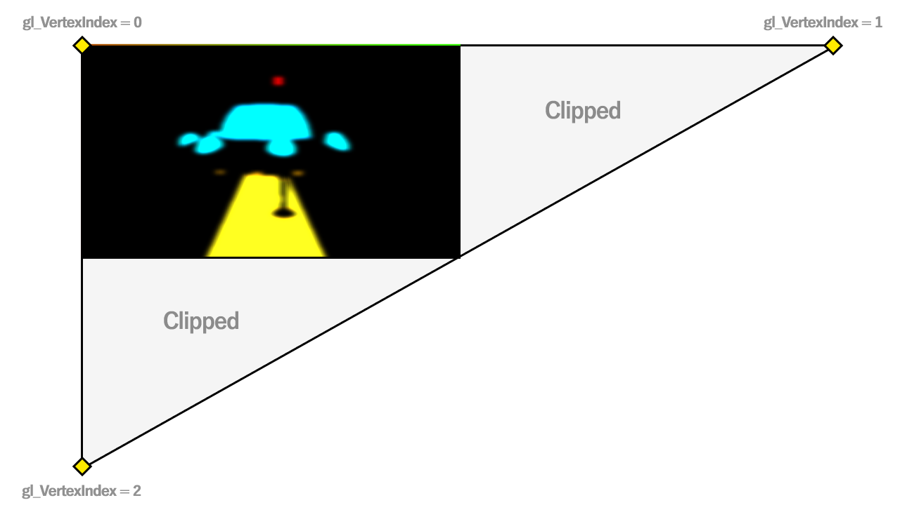

# Vulkan 教程：无缓冲区渲染全屏四边形

https://www.saschawillems.de/blog/2016/08/13/vulkan-tutorial-on-rendering-a-fullscreen-quad-without-buffers/


# 轻松渲染全屏四边形*

*(\*) 实际上只是一个巨大的三角形*

在 3D 实时图形中，渲染全屏四边形（或填满整个屏幕的物体）是一项常见任务，因为许多效果依赖于在整个屏幕上渲染纹理，并使用 [0..1] 范围内的适当 UV 坐标。这适用于后期处理（辉光、模糊、SAO）、延迟着色或程序生成的输出。

渲染这种全屏四边形的最有效方法是设置包含顶点（可选纹理坐标）和索引的缓冲区，用于渲染由两个三角形组成的四边形，绑定这些缓冲区，并将它们作为着色器的输入属性。虽然这在 OpenGL 中只需几行代码即可完成，但在 Vulkan 中则需要大量的样板代码。

## 技术背景

因此，无需使用缓冲区中的顶点（和索引）来渲染填充屏幕的内容，而是可以使用**gl_VertexIndex** （参见[GL_KHR_vulkan_GLSL](https://www.khronos.org/registry/vulkan/specs/misc/GL_KHR_vulkan_glsl.txt)）顶点输入变量（类似于 OpenGL 的[gl_VertexID](https://www.opengl.org/sdk/docs/man/html/gl_VertexID.xhtml)）在顶点着色器中轻松生成顶点和纹理坐标。虽然这有点简化，但它基本上保存了调用顶点着色器的当前顶点的索引。

我们将使用它来生成一个**全屏三角形**，其作用类似于全屏四边形。为什么是三角形？因为它只需要 3 次顶点着色器调用（而对于由两个三角形组成的四边形则需要 6 次）。

生成的三角形将如下所示：

[](https://www.saschawillems.de/images/2016-08-13-vulkan-tip-for-rendering-a-fullscreen-quad-without-buffers/fullscreentriangle_clipped.png)

这个三角形包含整个屏幕，以及 [0..1] 的整个 UV 范围，因此我们可以像普通的全屏四边形一样使用它来应用后期处理效果。由于 GPU 会裁剪屏幕边界之外的所有顶点，我们实际上得到了一个只需要 3 个顶点的四边形。而且由于裁剪是免费的，我们不会浪费带宽，因为三角形被裁剪的部分（灰色部分）不会被采样。

## Vulkan 部分

在 Vulkan 应用程序中使用此功能非常简单，而且由于我们不需要任何缓冲区，因此可以节省大量样板代码（包括描述符集和布局）。因此，将其添加到现有的 Vulkan 应用程序中非常简单，但如果您之前从未在 Vulkan 中进行过任何“无缓冲”渲染，则需要考虑一些事项。

### 图形管线

**VkPipeline**的**pVertexInputState**成员指定顶点输入属性和顶点输入绑定。由于我们不向着色器传递任何顶点，因此需要为全屏管线设置一个空的顶点输入状态，该状态不包含任何输入或属性绑定：

```cpp
VkPipelineVertexInputStateCreateInfo emptyInputState;
emptyInputState.sType = VK_STRUCTURE_TYPE_PIPELINE_VERTEX_INPUT_STATE_CREATE_INFO;
emptyInputState.vertexAttributeDescriptionCount = 0;
emptyInputState.pVertexAttributeDescriptions = nullptr;
emptyInputState.vertexBindingDescriptionCount = 0;
emptyInputState.pVertexBindingDescriptions = nullptr;
...
pipelineCreateInfo.pVertexInputState = &emptyInputState;
...
vkCreateGraphicsPipelines(device, pipelineCache, 1, &pipelineCreateInfo;, nullptr, &fullscreenPipeline;));
```

### 剔除

请注意，顶点是按顺时针顺序排列的（见上图），因此如果您使用剔除，则需要考虑到这一点，例如以下管道设置：

```cpp
rasterizationState.cullMode = VK_CULL_MODE_FRONT_BIT;
rasterizationState.frontFace = VK_FRONT_FACE_COUNTER_CLOCKWISE;
```

### 渲染

通过为全屏管道设置上述顶点输入状态，我们现在可以绘制某些内容，而不必像从缓冲区渲染几何体时那样预先绑定顶点（和索引）缓冲区：

```cpp
vkCmdBindPipeline(commandBuffer, VK_PIPELINE_BIND_POINT_GRAPHICS, fullscreenPipeline);
vkCmdDraw(commandBuffer, 3, 1, 0, 0);
```

只需将管道与空顶点输入状态绑定，并发出顶点数为 3 的绘制命令（非索引）。如果您使用正确的管道，这将不会生成任何验证层错误，即使（技术上）没有要实际渲染的顶点。

### 顶点着色器

有趣的部分是顶点着色器将根据 gl_VertexIndex 生成顶点：

```cpp
#version 450 
...
layout (location = 0) out vec2 outUV;
... 
void main() 
{
    outUV = vec2((gl_VertexIndex << 1) & 2, gl_VertexIndex & 2);
    gl_Position = vec4(outUV * 2.0f + -1.0f, 0.0f, 1.0f);
}
```

该着色器不包含任何输入属性，并且仅基于 gl_VertexIndex 生成位置和纹理坐标（传递给片段着色器），其中纹理坐标在三角形可见部分的 [0..1] 范围内。

### 示例代码

虽然在我的 Vulkan 存储库中没有此技术的明确示例，但如果您想查看其实际效果，可以在某些后期处理示例中使用它，例如[径向模糊示例。](https://github.com/SaschaWillems/Vulkan/blob/master/examples/radialblur/radialblur.cpp)


# Vulkan tutorial on rendering a fullscreen quad without buffers

 *Posted on August 13, 2016  | Sascha*

# Rendering a fullscreen quad* the easy way

*(\*) Which is actually just a huge triangle*

Having to render a fullscreen quad (or something that fills the whole screen) is a common task in 3D real time graphics, as many effects rely on rendering a texture over the whole screen with proper uv coordinates in the [0..1] range. This applies to post processing (glow, blur, ssao), deferred shading or procedurally generated output.

The most forward way of rendering such a fullscreen quad is to setup buffers containing vertices (optional texture coordinates) and indices for rendering a quad made up of two triangles, bind these buffers and have these as input attributes for your shaders. While this can be done with only a few lines in OpenGL, this requires lots of boiler plate in Vulkan.

## Technical background

So instead of using vertices (and indices) from a buffer to render something that fills the screen, the vertices and texture coordinates can easily be generated in your vertex shader using the **gl_VertexIndex** (see [GL_KHR_vulkan_GLSL](https://www.khronos.org/registry/vulkan/specs/misc/GL_KHR_vulkan_glsl.txt)) vertex input variable (similar to OpenGL [gl_VertexID](https://www.opengl.org/sdk/docs/man/html/gl_VertexID.xhtml)). Although that’s a bit simplified, it basically holds the index of the current vertex for which the vertex shader is invoked.

We will be using it to generate a **fullscreen triangle** that acts like a fullscreen quad. Why a triangle? Because it only requires 3 vertex shader invocations (instead of 6 for a quad made up of two triangles).

The triangle generated will look like this:

[](https://www.saschawillems.de/images/2016-08-13-vulkan-tip-for-rendering-a-fullscreen-quad-without-buffers/fullscreentriangle_clipped.png)

The triangle contains our whole screen and with that the whole uv range of [0..1] so that we can use it like a normal fullscreen quad for applying a post processing effect. Thanks to the GPU clipping everything outside of the screen boundaries we actually get a quad that only requires 3 vertices. And since clipping is for free, we won’t waste bandwitdh as the clipped parts of the triangle (grayed out parts) are not sampled.

## The Vulkan part

Using this in a Vulkan application is pretty simple, and as we don’t require any buffers we save a lot of boiler plate (including descriptor sets and layouts). So adding this to an existing Vulkan application is pretty straightforward, though there are a few things to consider if you haven’t done any “bufferless” rendering in Vulkan before.

### Graphics pipeline

The **pVertexInputState** member of the **VkPipeline** specifies the vertex input attributes and vertex input bindings. As we don’t pass any vertices to our shaders, we need to setup an empty vertex input state for the fullscreen pipeline that doesn’t contain any input or attribute bindings:

```cpp
VkPipelineVertexInputStateCreateInfo emptyInputState;
emptyInputState.sType = VK_STRUCTURE_TYPE_PIPELINE_VERTEX_INPUT_STATE_CREATE_INFO;
emptyInputState.vertexAttributeDescriptionCount = 0;
emptyInputState.pVertexAttributeDescriptions = nullptr;
emptyInputState.vertexBindingDescriptionCount = 0;
emptyInputState.pVertexBindingDescriptions = nullptr;
...
pipelineCreateInfo.pVertexInputState = &emptyInputState;
...
vkCreateGraphicsPipelines(device, pipelineCache, 1, &pipelineCreateInfo;, nullptr, &fullscreenPipeline;));
```

### Culling

Note that the vertices are in clock-wise order (see illustration above), so if you use culling you need to take this into account with e.g the following pipeline setup:

```cpp
rasterizationState.cullMode = VK_CULL_MODE_FRONT_BIT;
rasterizationState.frontFace = VK_FRONT_FACE_COUNTER_CLOCKWISE;
```

### Rendering

With the above vertex input state setup for the fullscreen pipeline we’re now able to draw something without having to bind a vertex (and index) buffer upfront like you’d do when rendering geometry from a buffer:

```cpp
vkCmdBindPipeline(commandBuffer, VK_PIPELINE_BIND_POINT_GRAPHICS, fullscreenPipeline);
vkCmdDraw(commandBuffer, 3, 1, 0, 0);
```

Just bind the pipeline with the empty vertex input state and issue a draw command (non-indexed) with a vertex count of 3. If you’re using the correct pipeline this will not generate any validation layer errors, even though there are (technically) no vertices to actually render.

### The vertex shader

The interesting part is the vertex shader that will generate the vertices based on the gl_VertexIndex:

```cpp
#version 450 
...
layout (location = 0) out vec2 outUV;
... 
void main() 
{
    outUV = vec2((gl_VertexIndex << 1) & 2, gl_VertexIndex & 2);
    gl_Position = vec4(outUV * 2.0f + -1.0f, 0.0f, 1.0f);
}
```

This shader does not contain any input attributes and generates the position and the texture coordinate (passed to the fragment shader) solely based on the gl_VertexIndex with the texture coordinates being in the [0..1] range for the visible part of the triangle.

### Example code

While there is no explicit example for this technique in my Vulkan repository, this is used in some of the post processing examples like the [radial blur one](https://github.com/SaschaWillems/Vulkan/blob/master/examples/radialblur/radialblur.cpp) if you want to see this in action.

