# 理解Vulkan资源绑定(Resource Binding)

## 前言

之前笔者在Vulkan的资源绑定问题上，也遇到了很多的理解难题(新概念很多)，本文希望能够去帮助新手去理解Vulkan资源绑定概念以及在实践当中如何更好的去完成资源绑定。(本文需要一定Vulkan基础，可以翻翻笔者之前的文章)

Vulkan的资源绑定涉及到以下几个概念：

- Descriptor
- Descriptor Set
- Descriptor Set Layout
- Descriptor Binding
- Pipeline Layout
- Push Constant

## 什么是Descriptor？

首先描述符(Descriptor，后文中继续使用Descriptor代替)是一个在现代图形API才有的概念，在OpenGL或者DirectX的较低版本是没有该概念的。这也是现代图形API将更多底层功能开放给开发者，那么带来更多的新概念以及更重的心智负担。之前更多隐藏的细节全部暴露出来，这样更加考验开发者本身的素质。那么Descriptor到底是什么呢？

Descriptor是一个不透明的数据结构，代表一个着色器资源，如Buffer、Buffer View、Imgae、Sampler、Combined Image Sampler。Descriptor不是无意义的概念，Vulkan将通过Descriptor告诉GPU这些资源在哪里，以及着色器该如何访问这些资源。其实也就是认为Descriptor为一个句柄(Handle)或者一个指向资源的指针。

Descriptor会被组织成DescriptorSet，在Command Record过程中被绑定，以便在随后的DrawCall中使用。每个DescriptorSet的内容安排是由DescriptorSet Layout决定的，它决定了哪些Descriptor可以被存储在其中。如下图所示：

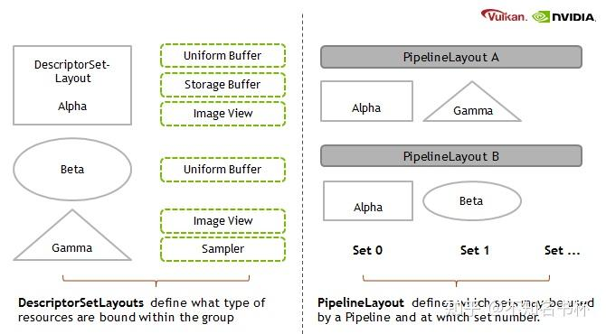

**DescriptorSet Layout**：该对象描述了每个着色器阶段的DescriptorSet中的包含哪些Binding。例如在Binding 0 处定义一个由顶点和片段阶段使用的Uniform Buffer，在Binding1处定义一个Storage Buffer，在Binding2处定义一个仅用于片段阶段的Image。

**PipelineLayout**：由于一个Pipeline可以绑定多个DescriptorSet，这个对象定义了每个DescriptorSet对应哪些DescriptorSetLayout。

这些概念都会后续详细介绍。

## 为什么需要Descriptor ?

这种使用Descriptor设计背后的动机是什么？首先Vulkan Descriptor概念是在开发过程中经常遇到的[性能瓶颈](https://zhida.zhihu.com/search?content_id=225042410&content_type=Article&match_order=1&q=性能瓶颈&zhida_source=entity)以及硬件商希望能足够的灵活的前提下设计的。在很多有性能问题的场景中，在渲染场景的主循环中它们具有以不同频率发生的资源绑定。尤其是当场景特别复杂的时候(几何多，材质复杂，参数多)的情况下同时带来了很多的资源绑定以及渲染状态设置行为，在复杂场景的情况下这个资源绑定的性能损耗也不能够忽视。但是场景复杂，大量几何，材质复杂等，正是现代高质量渲染所需的。[伪代码](https://zhida.zhihu.com/search?content_id=225042410&content_type=Article&match_order=1&q=伪代码&zhida_source=entity)如下。

```cpp
// example for typical loops in rendering
for each view {
  bind view resources          // camera, environment...
  for each shader {
    bind shader pipeline  
    bind shader resources      // shader control values
    for each material {
      bind material resources  // material parameters and textures
      for each object {
        bind object resources  // object transforms
        draw object
      }
    }
  }
}
```

与传统图形API基于插槽的绑定模型不同。在Vulkan中如何将资源传递给着色器方面有更多的自由。资源将组合为DescriptorSet并具有指定的布局，并且每个着色器可以使用多个DescriptorSet并可以单独绑定(DescriptorSet最少需要一个Descriptor)。开发者有责任管理DescriptorSet，以确保CPU不会更新GPU正在使用的DescriptorSet，并提供DescriptorSet Layout，在CPU端更新成本和GPU端访问成本之间实现最佳平衡。

那么通过正确使用DescriptorSet绑定和PipelineLayout，可以预先告诉[驱动程序](https://zhida.zhihu.com/search?content_id=225042410&content_type=Article&match_order=1&q=驱动程序&zhida_source=entity)需要使用那些资源。可以降低运行时成本，减少各种检验成本，显着降低了图形驱动程序的CPU开销。代价是要求预先确定它需要的状态，以便构建状态对象并从减少的开销中受益。传统的API将不得不在改变着色器时检查所有的资源绑定，而对哪些是被覆盖的，哪些是需要保留的，因为它没有足够信息可以用来判断并做出优化。如下图所示，DescriptorSet还允许你有部分兼容的PipelineLayout，只要这些PipelineLayout使用的DescriptorSet是相同的，已绑定DescriptorSet就会保持使用。这将大大减少资源绑定的次数。

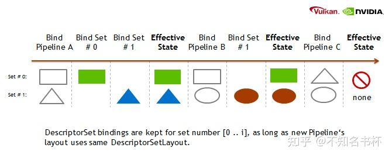

建议利用不同的DescriptorSet以避免多余的资源绑定更新。把许多更新频率非常不同的资源放在同一个DescriptorSet中对整体性能不利。比如一个DescriptorSet有几个Texture和Uniform Buffer，其中只有一个资源需要变化，但仍需要更新整个DescriptorSet这将导致大量的数据被发送到GPU，而这些大部分数据实际上什么都没有修改。并且假如有大量资源需要绑定的话，可以通过一个DescriptorSet即可完成绑定。

## 创建DescriptorPool

那就接下来看看如何使用Descriptor吧。首先要知道如何分配DescriptorSet，在Vulkan当中是通过VkDescriptorPool来管理所有的DescriptorSet并分配DescriptorSet。并且DescriptorPool是外部同步的，这意味不能在多个线程中同时分配和/或释放同一池中的DescriptorSet。关于VkDescriptorPool创建过程参与如下流程图。通过VkDescriptorPoolCreateInfo来创建VkDescriptorPool，maxSets限制该pool最多能够分配多少个DescriptorSet。VkDescriptorPoolSize则限制VkDescriptorPool中能够分配的Descriptor类型和数量。

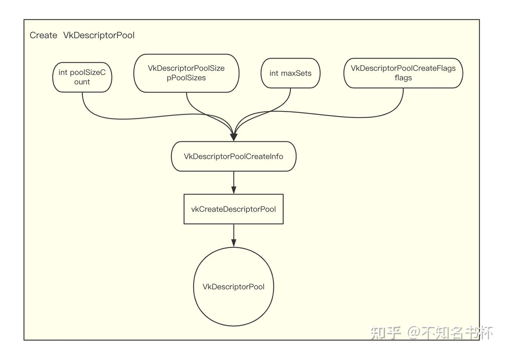

## 创建DescriptorSetLayout

DescriptorSetLayout是由零个或多个DescriptorBinding定义的。每个DescriptorBinding由VkDescriptorType代表什么类型的Descriptor、DescriptorCount(数组大小)、可以访问该绑定的着色器阶段stageFlags。还有binding字段是对应该绑定DescriptorSet其中的Index。可以对应于着色器阶段中不同binding的资源。DescriptorSetLayout的创建流程图如下所示：

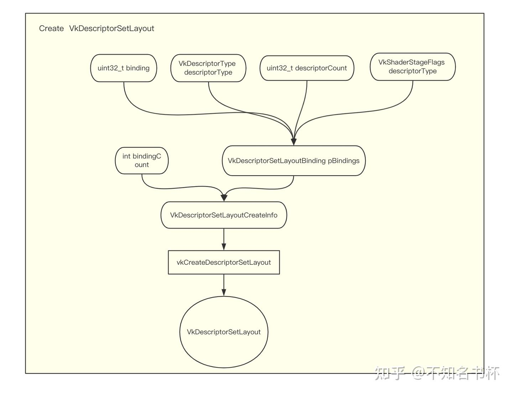

**DescriptorSetLayout**本质上是DescriptorBindings的集合。**Descriptor binding**可以是一个Texture Descriptor、Buffer Descriptor或者Sampler Descriptor等等。正是通过DescriptorBinding，DescriptorSet才实现了Shader和资源的绑定，方便了Shader对资源的读写操作。在Shader可以根据相对应的Binding去访问到相应的数据。如下图所示：

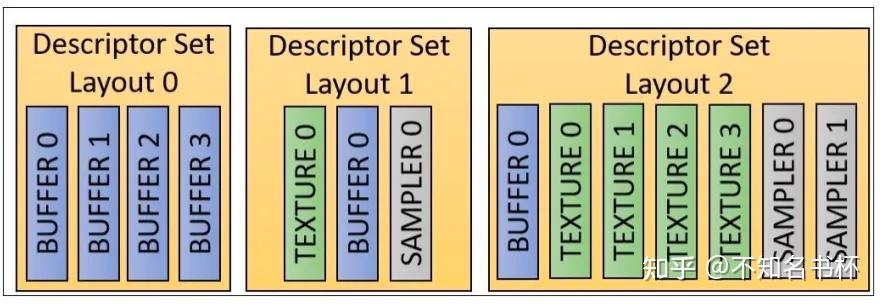

## 分配DescriptorSet

现在开始分配DescriptorSet，通过VkDescriptorSetAllocateInfo指定相应的VkDescriptorSetLayout和VkDescriptorPool。以及descriptorSetCount代表需要创建DescriptorSet的个数。

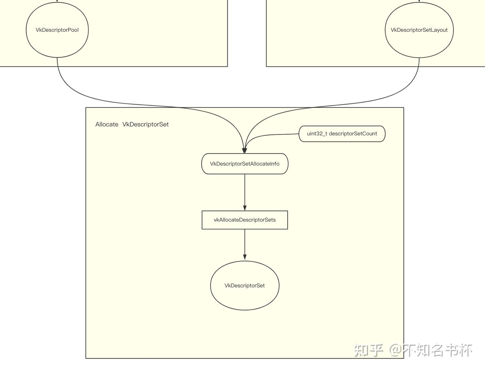

## DescriptorSet绑定

已经完成分配DescriptorSet但是还没有真正的[数据绑定](https://zhida.zhihu.com/search?content_id=225042410&content_type=Article&match_order=1&q=数据绑定&zhida_source=entity)，接下来将数据绑定到DescriptorSet上。如下流程图所示。通过VkWriteDescriptorSet将真实的资源(Buffer,Image，Sampler)绑定到DescriptorSet中Binding中。最后通过vkUpdateDescriptorSets更新该DescriptorSet。到这里就完成了整个关于DescriptorSet的设置。

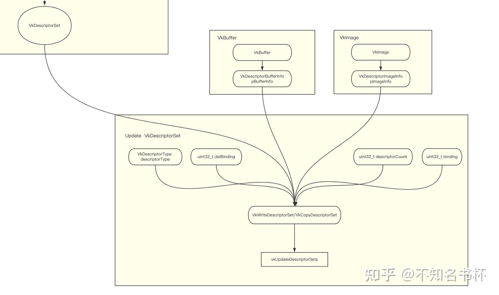

## PipeLineLayout

还有一个问题需要解决，就是不同Pipeline会需要用到什么DescriptorSet。以及Pipeline怎么知道DescriptorSetLayout？这个时候就需要请出PipelineLayout了。从Pipeline能够绑定DescriptorSet是通过PipelineLayout完成的。零个或多个DescriptorSetLayout和PushConstRange组合起来就是一个PipelineLayout如下图所示，PipelineLayout也就是描述可以被Pipeline访问的所有资源。每个Pipeline都是使用PipelineLayout创建的。在着色器当中只能够访问到在PipelineLayout中DescriptorSet中绑定的资源。

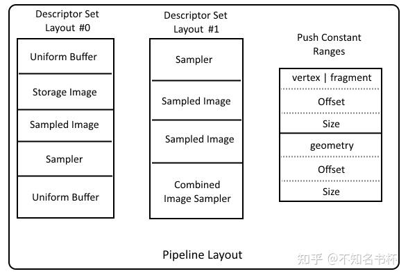

创建PipelineLayout的流程图如下所示：

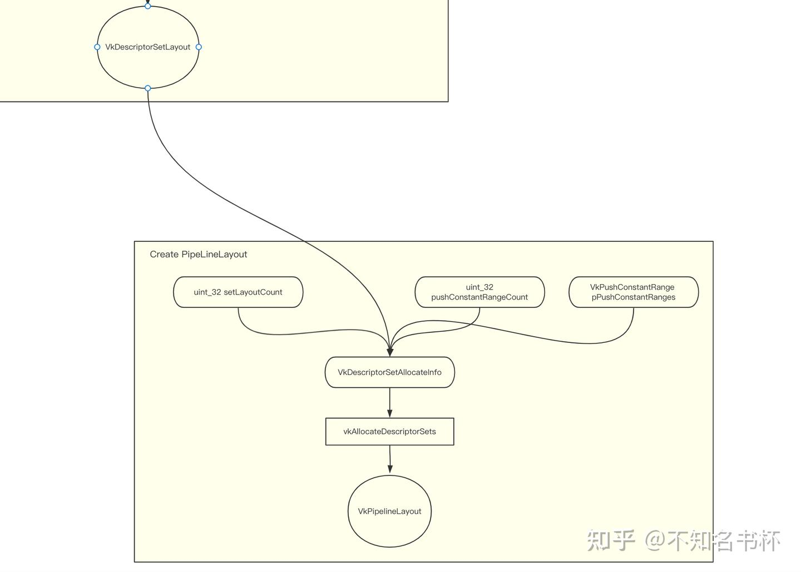

## Push Constant

在PipelineLayout当中有看到一个VkPushConstantRange结构，也就是指定Push Constant布局。先介绍Push Constant。Push Constant可以让一种非常简单和有效的方式向着色器发送少量的数据(它有大小限制)。Push Constant可以向任何着色器阶段发送数据，并存储在CommandBuffer本身。Push Constant比UBO/SSBO快得多，但一个巨大的限制是数据的大小,规范要求Push Constant范围必须在128字节以内。不同的硬件供应商可能会支持更多，但与其他手段(UBO)相比，它能够传递的数据量仍然是非常小的。流程图如下：

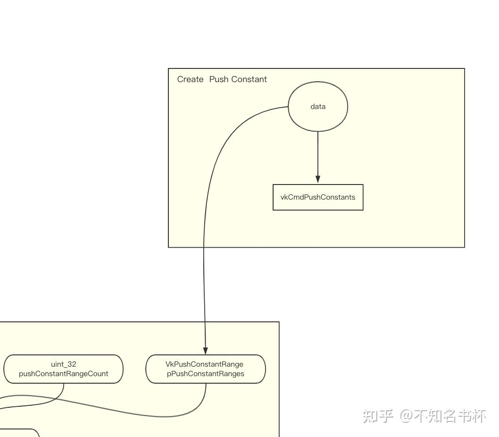

## Vulkan Binding Model

理解完上面概念后，现在将其组合起来就可以初步整理出Vulkan的Binding Model。

- DescriptorSetLayout由Descriptor Binding组成，会控制每个Descriptor的排列方式。
- Descriptor Binding将Descriptor和shader进行绑定，给shader提供了对资源操作的接口。
- DescriptorSet需要指定DescriptorSetLayout最后由DescriptorPool来真正分配出来。
- 通过VkWriteDescriptorSet/VkCopyDescriptorSet来真正将资源绑定或者更新数据。
- PipelineLayout通过DescriptorSetLayout以及PushConst创建并完成整个PipeLine的数据绑定。
- 最后使用vkCmdBindDescriptorSets完成对于DescriptorSet的绑定。

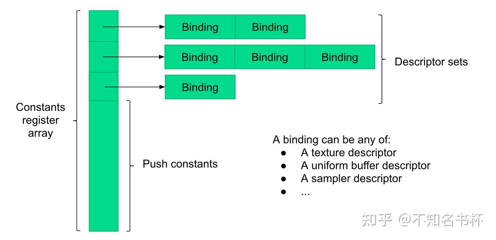

整体架构图：

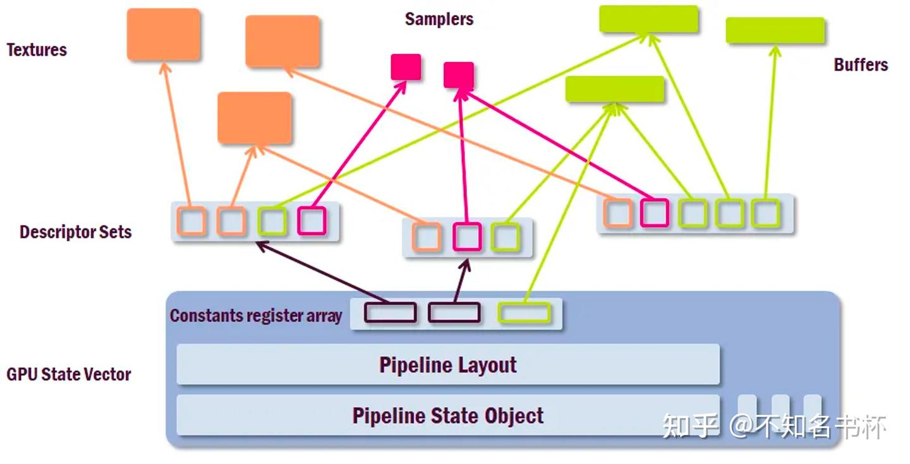

关于整体资源绑定的流程图：

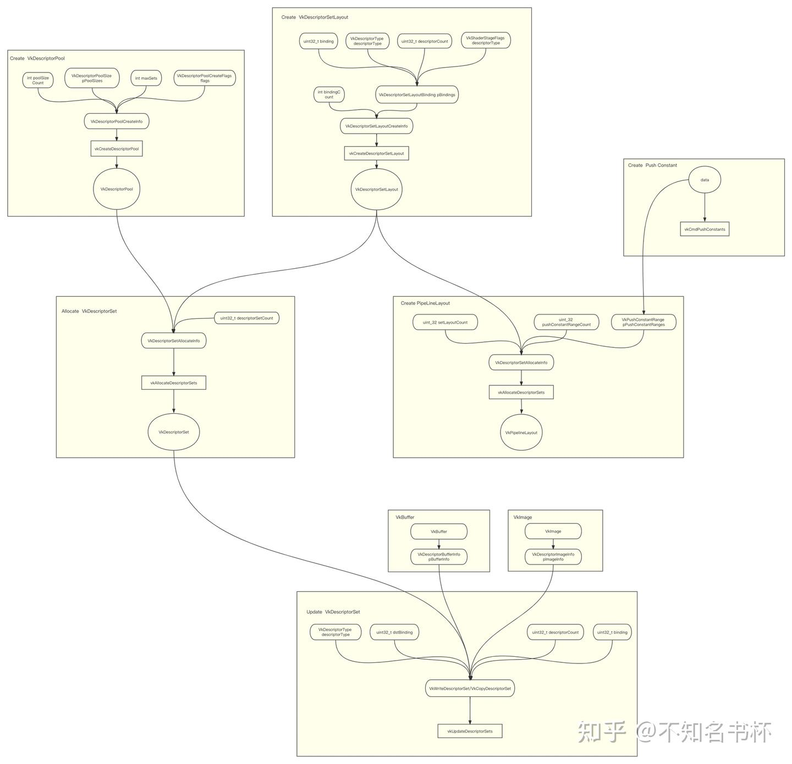

## 在Shader中获取数据的漫漫长路

在已经完成了在CPU侧的资源绑定之后，但是还没有讲到如何在Shader取用这些数据，不过可以先看看在Shader当中读取一张纹理需要做什么？请欣赏Shader读取数据的漫漫长路。

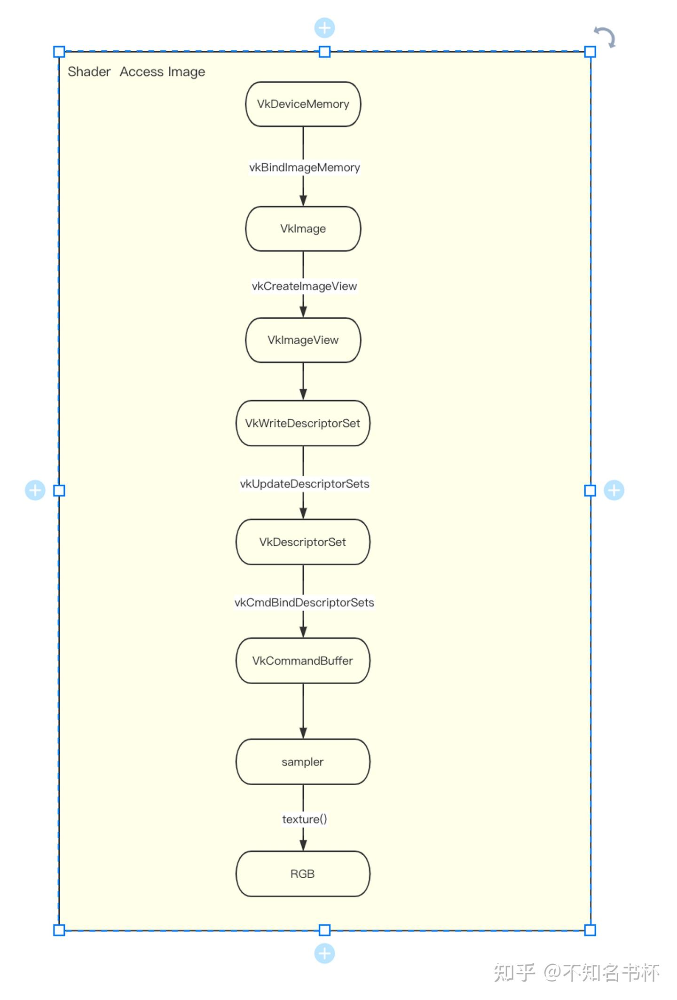

接下来来看看如何在GLSL当中使用到这些数据。根据不同的描述符类型需要通过不同的访问方式。

### Imgae以及Sampler

```cpp
#version 450
// VK_DESCRIPTOR_TYPE_SAMPLER
layout (set = 1, binding = 0) uniform sampler2D combinedImageSampler;
// VK_DESCRIPTOR_TYPE_COMBINED_IMAGE_SAMPLER
layout (set = 0, binding = 1) uniform texture2D sampledImage;
// VK_DESCRIPTOR_TYPE_SAMPLER
layout (set = 0, binding = 0) uniform sampler s;

vec4 rgba = texture(sampler2D(sampledImage, s), vec2(0.5, 0.5));
vec4 rgba = texture(combinedImageSampler, vec2(0.5, 0.5));
```

### Uniform/Storage Buffer

```cpp
#version 450
// VK_DESCRIPTOR_TYPE_UNIFORM_BUFFER/VK_DESCRIPTOR_TYPE_UNIFORM_BUFFER_DYNAMIC
layout (set = 5, binding = 0) uniform UniformBuffer
{
        mat4 projection;
        mat4 view;
        mat4 model;
} uniformBuffer;

layout (set = 5, binding = 0) uniform UniformBuffer {
        float deltaTime;
} uniformBuffer;

struct Particle {
        vec4 position;
        vec4 velocity;
};

layout (set = 5, binding = 1) buffer StorageBuffer {
        Particle particles[];
} storageBuffer;

mat4 M = uniformBuffer.projection * uniformBuffer.view * uniformBuffer.model;

int i = 0;
vec3 p = storageBuffer.particles[i].position.xyz;
vec3 v = storageBuffer.particles[i].velocity.xyz;
float dt = uniformBuffer.deltaTime;
storageBuffer.particles[i].position.xyz = p + p * v * dt;
```

### Push Constant

```cpp
struct DrawCullData
{
    mat4 view;
    float P00, P11, znear, zfar; // symmetric projection parameters
    float frustum[4]; // data for left/right/top/bottom frustum planes
    float lodBase, lodStep; // lod distance i = base * pow(step, i)
    float pyramidWidth, pyramidHeight; // depth pyramid size in texels
    uint drawCount;
    int cullingEnabled;
    int lodEnabled;
    int occlusionEnabled;
    int distCull;
    int AABBcheck;
    float aabbmin_x;
    float aabbmin_y;
    float aabbmin_z;
    float aabbmax_x;
    float aabbmax_y;
    float aabbmax_z;

};
layout(push_constant) uniform  constants{   
   DrawCullData cullData;
};

vec3 center = sphereBounds.xyz;
// 将该center转到视线空间下
center = (cullData.view * vec4(center,1.f)).xyz;
```

## Descriptor优化原则

在这里将探讨一些关于Descriptor的使用原则，能够让程序更高效率的运行。

### DescriptorSet管理

首先回到DescriptorSet管理，在Vulkan当中都是通过DescriptorPool来管理DescriptorSet的分配。在复杂场景的渲染当中，有很多不同的材质需要渲染，与此对应需要更多DescriptorSet。并且这些DescriptorSet可能需要即时更新或者改变。最简单的方法是每一帧有一个或多个VkDescriptorPools，在帧开始时重置它们，并重新从中分配需要的DescriptorSet。这种方法包括在开始时调用vkResetDescriptorPool()，然后是一系列的vkAllocateDescriptorSets()和vkUpdateDescriptorSets()来填充数据。但是这样就带来CPU开销大量zeng，在最坏的情况下，例如为每次DrawCall都调用vkUpdateDescriptorSets()，更新DescriptorSet的时间可能比绘制本身的时间还长。

也可以将VkDescriptorPool的flag设置为VK_DESCRIPTOR_POOL_CREATE_FREE_DESCRIPTOR_SET_BIT，通过vkFreeDescriptorSets可以满足在池中删除单个DescriptorSet的。但是如果不设置该flag，内部实现可以使用更简单的分配器，依靠池内存只在块中回收的事实。这使驱动程序端的[内存管理](https://zhida.zhihu.com/search?content_id=225042410&content_type=Article&match_order=1&q=内存管理&zhida_source=entity)变得复杂，不建议使用。并且需要手动的来跟踪DescriptorSet的资源状态，进行更新或者删除的操作，整体来说复杂度增高并且容易出错，整体效率不高。

当VkDescriptorPool被创建时，需要指定从中分配的DescriptorSet的最大数量，以及可以从中分配的每种类型的Descriptor的最大数量。在Vulkan 1.1中可以不必处理这些限制的。因为它可以直接调用vkAllocateDescriptorSets并会返回VK_ERROR_OUT_OF_POOL_MEMORY标识，并通过切换到一个新的DescriptorPool来处理该调用带来的错误。但是在Vulkan 1.0中，如果DescriptorPool没有可用空间，调用vkAllocateDescriptorSets是一个错误，所以必须跟踪每种类型的DescriptorSet和Descriptor的数量，以便事先知道何时切换到一个有足够容量的DescriptorPool。

还有关于DescriptorPool的maxSets参数问题，由于不同的Pipeline可能使用不同数量的Descriptor。一个直接的方法是用相同的配置创建所有的池子，使用每种类型的Descriptor的最坏情况数量。例如每个集合最多使用16个Texture Descriptor和8个Buffer Descriptor，可以用maxSets=1024来分配所有的池子，Texture Descriptor的池子大小为16X1024*，*Buffer **Descriptor为8X1024。但是如果在实践当中，这样可能会造成很大的内存浪费。所以如果大多数Pipeline只使用4个Texture，你将会浪费75%的Texuter Descriptor的内存空间。

关于内存使用平衡的两个选择如下所示：

- 首先可以对一个特定场景获取所有Pipeline的所需的Descriptor数量，并根据这个来完成DescriptorPool的设置。比如需要3000个DescriptorSet，13400个Texuter Descriptor和1700个Buffer Descriptor，那么每组Descriptor的平均数量是4.47个Texutre Descriptor和0.57个Buffer Descriptor，所以池的合理配置是maxSets=1024，5*1024个Texuter Descriptor和1024个Buffer Descriptor。当一个池子里的某个类型的Descriptor用完了，就会分配一个新的Descriptor。所以这个方案是可以保证工作的，而且平均来说应该是相当有效的。
- 还有一个方案是将不同的Pipeline归类，然后根据不同的类型选择不同的DescriptorPool。比如在一个场景中，典型的情况是有大量的Shadow/PreDepth 的DrawCall以及大量的正常DrawCall。但这两种需要不同的Descriptor类型和数量，Shadow DrawCall通常每组需要0到1个Texture，以及需要0到1个Buffer。为了优化内存使用，为Shadow/PreDepth和其他DrawCall分别分配不同的DescriptorPool是比较合适的。类似于通用分配器做到更好根据不同的类型来分配，这仍然可以在较低级别的DescriptorSet管理层中进行管理，只要事先配置好特定应用的DescriptorSet使用。

还有一个问题是关于如何复用DescriptorSet，也就是将其DescriptorSet缓存下来，在这里将其Hash存入一个对象当中。然后每次去需要的时候去获取相应的DescriptorSet，然后使用vkUpdateDescriptorSets去更新DescriptorSet，无需重新绑定，对于DescriptorSet也无需Clear或手动释放。可以减少大量绑定操作。也是典型的空间换时间的做法，看具体项目情况使用。但是需要跟踪假如有几帧都还没使用的DescriptorSet可以将其清空处理。

### 选择合适Descriptor类型

对于每一种资源类型，Vulkan都提供了几个选项以便在着色器中访问这些资源，那么应该选择一个合适的Descriptor类型。首先就是Buffer的选择，主要就是UBO和SSBO的选择。Uniform Buffer和普通的Uniform变量相比，就像是一个结构体，可以容纳更多变量，存储在显存的常量区，速度较快，编译时大小是确定的，而且大小是有限制的(比如64KB)，在着色器里可读但不可写。但是SSBO是可读可写的，并且相对于UBO容量大了很多(比如128MB)。但是速度相比于UBO是更慢的。但是其大小可以在编译时不确定，而且大小基本没有限制。但是如果是一些比较小数据其实可以使用PushConstant来满足，可以减少一个Descriptor。但是Push Constant的容量是比较小的，可以通过VkPhysicalDeviceLimits**::**maxPushConstantsSize获取到相应的大小。从小数据来看PushConstant>UBO>SSBO。但是假如数据量比较大的话，SSBO的速度会胜出。

对于纹理来说，如果需要过滤的话可以选择组合图像/采样器Descriptor。或者单独的texture和Sampler Descriptor，以及带有不可改变的Sampler Descriptor的Texture Descriptor，其中Sampler属性必须在管道对象创建时指定。一般来说，不可变的Descriptor更适合现代图形API中的推荐使用模式，并给驱动程序更多的自由来优化着色器。

### 利用PipelineLayout兼容性

如果两个PipelineLayout在创建时具有相同的PushConstant范围，那么被定义为 "对PushConstant兼容"。如果两个PipelineLayout在创建时具有相同的0到N号的DescriptorSetLayout，并且如果它们都不是用VK_PIPELINE_LAYOUT_CREATE_INDEPENDENT_SETS_BIT_EXT创建的，并且它们是同样是对PushConstant兼容的，则定义为 "对于N号集是兼容的"。并且当绑定N号DescriptorSet的时候，如果是先前绑定的0到N-1的DescriptorSet的PipelineLayout都是兼容，那么这个绑定操作不会干扰任何0到N-1的DescriptorSet。如果之前为N组绑定的DescriptorSet是使用与N组兼容的PipelineLayout绑定的，那么编号大于N的组中的绑定也不会受到干扰。

同样地，当绑定Pipeline时只要所有较低编号的DescriptorSet也是用兼容的PipelineLayout绑定的，Pipeline就可以正确地访问任何先前绑定的DescriptorSet无需重新绑定，可以提高效率。布局兼容性意味着DescriptorSet可以被绑定到一个Command Buffer，供任何用兼容的PipelineLayout创建的Pipeline使用，而不需要先绑定一个特定的Pipeline。这也意味着DescriptorSet可以在Pipeline切换时保持有效，并且新绑定的Pipeline可以访问相同的资源。

可以通过PipelineLayout 兼容性设置合理的DescriptorSet槽位。在做PipeLine切换时可以减少所需要的绑定次数。将变化最少的DescriptorSet放在PipelineLayout的起点附近，而将代表变化最频繁DescriptorSet放在终点附近。当Pipeline切换时，只有已经失效的DescriptorSet绑定需要更新，其余的DescriptorSet绑定将保持原位。

### 选择正确的槽位

在Vulkan中一个Pipeline能够绑定的DescriptorSet的数量是有上限的，通过VkPhysicalDeviceLimits::maxBoundDescriptorSet查询到。在这里就以4个DescriptorSet为上限举例。最方便的映射选项是让资源在所有阶段(顶点、像素、计算着色器)都可以使用匹配--例如一个槽位3将包含相同的纹理资源，无论它从哪个阶段访问，并为不同的类型使用不同的DescriptorSet，例如(DS代指DescriptorSet)DS0用于Buffer，DS1用于Texture，DS2用于Sampler。并且在每个阶段使用一个DS3，并执行静态槽位重映射(例如，0-16槽用于Texture，17-24槽用于Uniform Buffer等等)但是会使用更多的Descriptor内存，因此不推荐。可以为每个着色器阶段实现最佳的紧凑的动态槽位重映射（例如，如果一个[顶点着色器](https://zhida.zhihu.com/search?content_id=225042410&content_type=Article&match_order=1&q=顶点着色器&zhida_source=entity)使用纹理槽0、4、5，那么它们映射到DS0中的索引0、1、2槽位，并且在运行时应用程序使用这个重映射表提取相关的纹理信息。

但是还存在一个问题，在完成上面纹理重映射的操作中，只需要更新资源绑定。但是就在调用DrawCall之前，需要分配一个DescriptorSet，用新的DescriptorSet更新它，并使用vkCmdBindDescriptorSets绑定所有DescriptorSet。比如整个DescriptorSet中有五个资源但是只是重新映射或者更新其中一个数据。仍然需要用5个资源分配一个新的DescriptorSet而且上传全部Descriptor的数据并更新。

如果DescriptorSet中没有任何变化就不要分配或更新DescriptorSet。在不同阶段共享槽的模型中，这可能意味着如果在两次DrawCall之间没有设置纹理，你就不需要用Texture Descriptor分配/更新DescriptorSet。 如果可能的话批量调用vkAllocateDescriptorSets，在某些驱动上，每次调用都有可观的开销，所以如果需要更新或者分配多个DescriptorSet，在一次调用中分配多个DescriptorSet更快一些。

与更新Uniform/Storage Buffer的Descriptor相比，更加推荐使用Dynamic Uniform/Storage Buffer,Dynamic Uniform/Storage Buffer允许使用vkCmdBindDescriptorSets的pDynamicOffsets参数来指定Buffer的偏移量，而不需要在每次改变绑定偏移时更新或创建一个新的DescriptorSet对象。这个模型的优点是我们只需要为所需数据准备一次DescriptorSet。然后可以在绑定时让DescriptorSet中的每个Buffer绑定指向Buffer中的不同[内存位置](https://zhida.zhihu.com/search?content_id=225042410&content_type=Article&match_order=1&q=内存位置&zhida_source=entity)，而不必通过昂贵的vkUpdateDescriptorSet或vkAllocateDescriptorSets调用来更新Offset。大大减少了CPU的开销，并且在GPU上可以更有效率。虽然在某些GPU上，Dynamic Uniform/Storage Buffer的数量必须保持较小，以避免驱动中的额外开销，但在所有架构上一个或两个Dynamic Uniform/Storage Buffer在这个方案中应该很好地工作。使用不使用Dynamic Uniform/Storage Buffer如下所示：

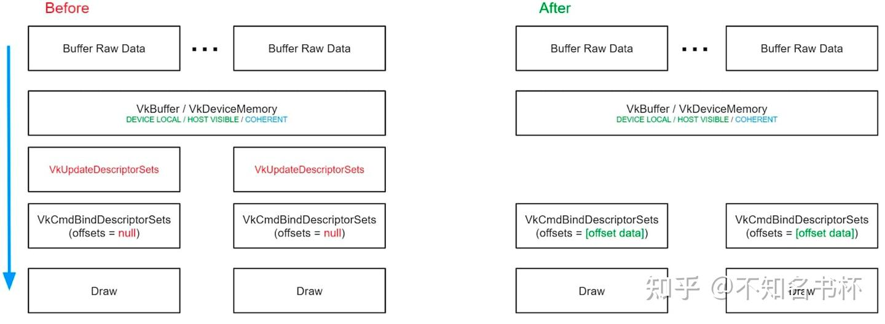

### 合适的更新频率

在上面谈到如何更好的设置DescriptorSet以及内部的资源绑定以获得更好的性能。另外一个方面也就是从DescriptorSet的更新频率下手，一个以Vulkan为中心的渲染器会将着色器需要访问的数据按照变化频率组织成一组，并为各个更新频率使用单独的DescriptorSet，DS0代表变化频率最低，DS3代表变化频率最高。例如一个典型的设置是DS0用于比如全局的、每一帧或每一视角的数据(比如摄像机的矩阵之类)以及全局可用的纹理，如阴影贴图纹理阵列/图集。DS1包含Uniform Buffer和每个材质数据的Texture Descriptor如反照率图、[菲涅尔](https://zhida.zhihu.com/search?content_id=225042410&content_type=Article&match_order=1&q=菲涅尔&zhida_source=entity)系数等。DescriptorSet2包含Dynamic Uniform/Storage Buffer和每个渲染所需数据(比如[模型变换](https://zhida.zhihu.com/search?content_id=225042410&content_type=Article&match_order=1&q=模型变换&zhida_source=entity)阵列)。对于DS0期望它每帧只变化几次，使用上面的动态分配DescriptorSet方案就足够。

对于DS1，我们希望对于大多数对象来说，材质数据在帧之间是持续存在的，因此只有在[游戏代码](https://zhida.zhihu.com/search?content_id=225042410&content_type=Article&match_order=1&q=游戏代码&zhida_source=entity)改变材质数据时才可以分配和更新。

对于DS2，数据将是完全动态的，由于使用了Dynamic Uniform/Storage Buffer，很少需要分配和更新这个DS2。所需数据会上传到一些容量大的每帧Buffer，对于大多数DrawCall，假如需要用新的数据只需要新的offsets调用vkCmdBindDescriptorSets。

由于PipelineLayout兼容性规则，在大多数情况下，当材质发生变化时只需绑定DS1和DS2即可，而当材质与前一次DrawCal的材质相同时，只需重新绑定DS2。这导致每次DrawCal只需要调用一次vkCmdBindDescriptorSets，可以减少绑定次数。

对于一个复杂的渲染器，不同的着色器可能需要使用不同的布局(大概率会不同)，不是所有的着色器都需要对材质数据的布局达成一致。在极少数情况下，根据[框架结构](https://zhida.zhihu.com/search?content_id=225042410&content_type=Article&match_order=1&q=框架结构&zhida_source=entity)，使用4个以上的DescriptorSet可能也是有意义的(前提是一个Pipeline允许绑定这么多)。此外考虑到Vulkan的灵活性，并不严格要求对场景中的所有DrawCall都使用相同的资源绑定系统。例如，后处理的DrawCal调用往往是高度动态的，纹理/数据在单个DrawCal之间完全改变。一些渲染器最初实现了基于槽位的[动态绑定](https://zhida.zhihu.com/search?content_id=225042410&content_type=Article&match_order=1&q=动态绑定&zhida_source=entity)模型，然后继续为世界渲染额外实现基于频率的DescriptorSet，以最大限度地减少对DescriptorSet管理的性能损耗，同时在渲染管道的更多动态部分仍然保持基于槽位模型的简单性。

### 使用Descriptor Templete

还有一个可以优化的点也就是vkUpdateDescriptorSets更新操作本身，如何更新DescriptorSet更快并且消耗的更少。首先更新一个大的VkDescriptorSet数组可能是一个昂贵的操作。因为必须为要更新的Descriptor或Descriptor数组指定VkWriteDescriptorSet结构，在更新多个DescriptorSet中的相同Descriptor时，每个结构都要重新指定相同的状态。下图是一个VkWriteDescriptorSet结构体所需的大小。更新一个Descriptor至少需要64字节，而且是必填的。并且可能每一帧都要重新创建DescriptorSet，那么内存以及[内存带宽](https://zhida.zhihu.com/search?content_id=225042410&content_type=Article&match_order=1&q=内存带宽&zhida_source=entity)的消耗都是很大的。

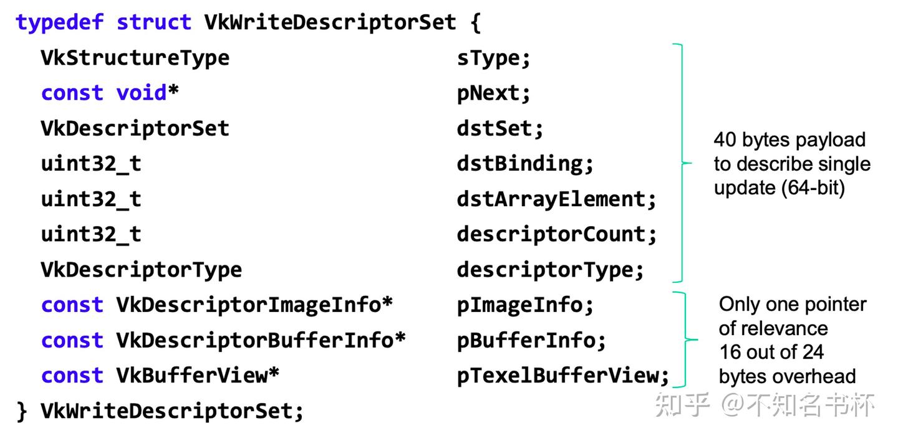

针对这种情况一般会采用两种策略：

暴力法：

```cpp
std::vector<VkWriteDescriptorSet> writes;
writes.reserve(renderEntities.size() * descriptorCount);
for (entity const &: renderEntities) {
for (resource const &: entity.resources) {
    // VkWriteDescriptorSet content nearly the same for each entity
        writes.push_back(createUpdate(resources));
    }
}
vkUpdateDescriptorSets(..., writes.size(), writes.data(), ...);
```

优点：只需要一次绑定

缺点：必须每个renderEntity重复填充N个64字节的结构体；10k实体乘以10个描述符 -> 6.4Mb；大量的内存和带宽消耗；

缓存法：

```cpp
std::vector<VkWriteDescriptorSet> writes();
for (resourceDescription const & : resourceDescriptions) {
        writes.push_back(generateWriteDescriptorInformation(resource));
}
for (entity : renderEntities) {
    for (size_t i = 0; i < writes.size();++i) {
        // write only pImageInfo, pBufferInfo, or pTexelBufferView
        writeEntityDescriptorInformation(entity.res[i],write[i]);
    }
    vkUpdateDescriptorSets(..., writes.size(), writes.data(), ...);
}
```

优点：每次10个Descriptor更新所需内存消耗降至640字节

缺点：对驱动程序的绑定操作达到10k次；

在这里为了解决这个性能问题，在这里提出了DescriptorUpdateTemplate的方案。

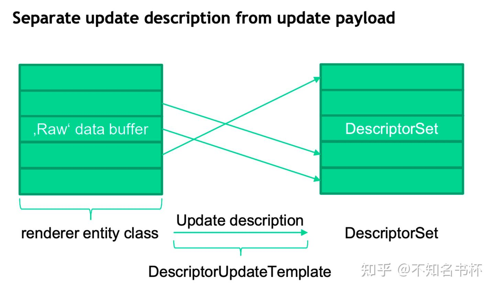

在当中于DescriptorUpdateTemplate等同于VkWriteDescriptorSet的结构是VkDescriptorUpdateTemplateEntry，如下图所示：

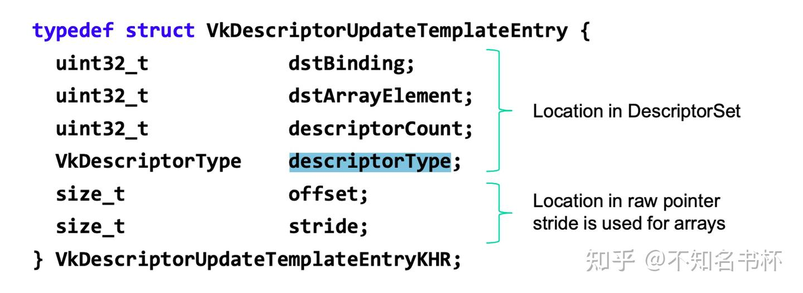

关于VkDescriptorUpdateTemplateEntry的使用方法如下所示：

```cpp
std::vector<VkDescriptorUpdateTemplateEntry> entries(descriptors.size());
for(size_t i = 0;i < descriptors.size();++i) {
    createUpdateTemplateEntry(i, entries[i]);
}
VkDescriptorUpdateTemplate dut;
VkDescriptorUpdateTemplateCreateInfo createInfo;
// fill createInfo here
vkCreateDescriptorUpdateTemplate(..., &createInfo, ..., &dut);

// 现在每个renderEntity都需要一个单独的调用。
for (entity const &: renderEntities) {
        vkUpdateDescriptorSetWithTemplate(
        device, descriptorSet, dut, &entity
        );
}
```

在这里VkDescriptorUpdateTemplate允许实现将对单个DescriptorSet的相关Descriptor更新操作转换为内部格式。结合vkUpdateDescriptorSetWithTemplate比vkUpdateDescriptorSets效率更高。Descriptor本身并没有在VkDescriptorUpdateTemplate中指定，而是指定了的内存指针的偏移量，这些偏移量与传递给vkUpdateDescriptorSetWithTemplate的指针相结合。这允许大批量的更新被执行，而不需要将应用[数据结构转换](https://zhida.zhihu.com/search?content_id=225042410&content_type=Article&match_order=1&q=数据结构转换&zhida_source=entity)为严格定义的Vulkan数据结构。以减少内存消耗。

使用DescriptorUpdateTemplate方案不需要中间副本会对于内存和内存带宽友好。并且可以一次性获得更多的数据，为驱动程序内部更有效的更新提供机会。总的来说DescriptorUpdateTemplates消除了VkDescriptorSet更新时复制多个Descriptor的需要。

VK_KHR_descriptor_update_template在Vulkan >= 1.0.37中的扩展当中。在Vulkan1.1中被纳入核心当中，请根据当前的Vulkan版本来使用。

## 开喷Descriptor

首先就是Descriptor本身还是一个不透明的结构，从旧的API中继承下来的不透明模型是有原因的。GPU以各种方式引用资源，包括将Descriptor存储在固定的寄存器中而不是内存中。使它们(以及它们被分配的池)不透明是必要的，以隐藏这些差异。这个在BingdingModel以及架构图中均有体现。

### VkDescriptorPool

DescriptorPool完完全全是Vulkan的一个新概念，其他的API根据找不到相对应的概念。它们的行为类似于命令池，因为它们抽象出确切需要多少内存，但与Command Pool不同，DescriptorPool不是无底的。这很难找到正确的权衡。

1. 首先是否需要回收DescriptorSet的问题，这就取决于谁还在依赖该DescriptorSet,那这就是牵扯到了在多线程环境下跟踪该DescriptorSet的状态，并且进行销毁的操作。这个方案在大部分情况下效率都不高。而且容易出错，debug也比较困难。并且开启能够单独回收的操作的话DescriptorPool的创建加上VK_DESCRIPTOR_POOL_CREATE_FREE_DESCRIPTOR_SET_BIT才可以使用，但是会影响到分配DescriptorSet的效率。现在大部分的方案是通过将DescriptorSet结构体Hash之后缓存，但是肯定会造成内存的浪费，很难说两种方案哪个更好。
2. VkDescriptorPoolCreateInfo中关于maxSets的设置也是很难选择，还需要设置每个Descriptor类型和数量。这个就令人迷惑。因为不一定知道在渲染过程中需要多少个DescriptorSetLayout。现在有各种创建策略比如针对每一个不同的DescriptorSetLayout创建一个DescriptorPool这样就可以约束好相应的Descriptor类型和个数以及maxSets的设置并且可以直接回收VkDescriptorSet对象本身，而不是一直进行分配。但是显而易见的DescriptorPool的数量在不断增加。另外一个方案就是在一个池子当中设置足够多的maxSets以及对应的Descriptor，DescriptorPool更少并且对可以DescriptorSet做缓存策略。但是感觉都不尽人意。
3. 如果一个场景中有足够多的Descriptor，最终会遇到这样的情况：Descriptor内存会成为实现的一个问题。作为开发者，没有任何机制可以控制Descriptor内存的位置或它实际消耗多少内存。因为Descriptor是不透明的结构，这对于后续的性能优化也是一种阻碍。
4. 还有关于多线程的问题，Vulkan是支持多线程渲染的，现在的情况是必须为每一个线程单独创建DescriptorPool来分配DescriptorSet，因为在没有锁的情况下多线程使用一个DescriptorPool是不可能的。这很快就会造成浪费。

## References

[So many descriptors in Vulkan - One line to rule them all](https://zhangdoa.com/posts/so-many-descriptors-in-vulkan)

[Vulkan Mobile Best Practice - Descriptor and Buffer Management](https://community.arm.com/arm-community-blogs/b/graphics-gaming-and-vr-blog/posts/vulkan-descriptor-and-buffer-management)

[Vulkan: Long way to access data](https://www.asawicki.info/news_1707_vulkan_long_way_to_access_data)

[VK_EXT_descriptor_buffer](https://www.khronos.org/blog/vk-ext-descriptor-buffer)

[Writing an efficient Vulkan renderer](https://zeux.io/2020/02/27/writing-an-efficient-vulkan-renderer/)

[Vulkan Shader Resource Binding](https://developer.nvidia.com/vulkan-shader-resource-binding)

[Why are Resource Descriptors needed?](https://stackoverflow.com/questions/73042074/why-are-resource-descriptors-needed)

[https://docs.google.com/presentation/d/12YSEcLjyYStNDK9EwhPgRq05oIxpTIqC1GdKgJd_Jt4/edit#slide=id.g17c6be9a5e_1_183](https://docs.google.com/presentation/d/12YSEcLjyYStNDK9EwhPgRq05oIxpTIqC1GdKgJd_Jt4/edit%23slide=id.g17c6be9a5e_1_183)

[Vulkan 资源绑定和状态管理](https://zhuanlan.zhihu.com/p/172479225)

[Vulkan: Uniform Buffers versus Push Constants for static data](https://computergraphics.stackexchange.com/questions/5536/vulkan-uniform-buffers-versus-push-constants-for-static-data)

[A tour of Granite’s Vulkan backend – Part 3](http://themaister.net/blog/2019/04/20/a-tour-of-granites-vulkan-backend-part-3/)

[GameDev | Samsung Developers](https://developer.samsung.com/galaxy-gamedev/gamedev-blog/traha.html)