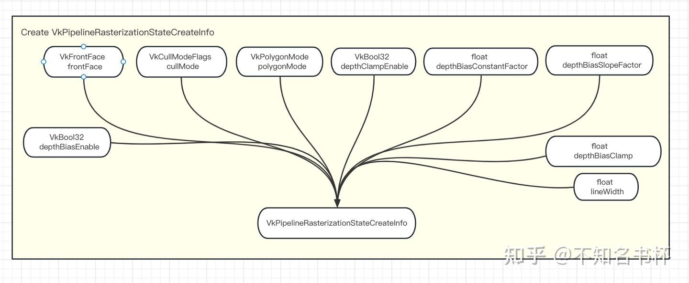

# 理解Vulkan管线(Pipeline)

## 前言

本文介绍Vulkan中Pipeline概念以及如何管理好Pipeline，希望能够帮助他人理解这一概念(需要一定的Vulkan的基础知识，可以参考笔者的其他Vulkan文章)

[不知名书杯：Vulkan文章汇总169 赞同 · 7 评论文章](https://zhuanlan.zhihu.com/p/616082929)

## 什么是Pipeline？

Pipeline是在新一代图形API中提出的概念，在Vulkan中Pipeline是一个大对象，它代表了整个PipeLine的配置。在Vulkan主要有三种类型的管线ComputePipeline和GraphicsPipeline和Ray tracing pipeline(在这不过多介绍)。三种Pipeline其中包含了PipelineLayout，PipelineLayout指定了Pipeline使用那些DescriptorSetLayout和Push Constant的。计算管线(Compute Pipeline)是比较简单的一种，因为它所支持的都是只计算的程序(称为Computer Shader)。GraphicsPipeline要复杂得多如下图所示，因为它包含了所有的参数，如顶点、片段、几何、计算和[曲面细分](https://zhida.zhihu.com/search?content_id=225310433&content_type=Article&match_order=1&q=曲面细分&zhida_source=entity)着色器(如果启用了该功能的话)，再加上像顶点属性、输入装配、图元结构、[光栅化](https://zhida.zhihu.com/search?content_id=225310433&content_type=Article&match_order=1&q=光栅化&zhida_source=entity)参数、深度/模板测试参数、面剔除和Blend Const、视口(ViewPort)参数还有RenderPass等，Vulkan会将这些状态固定成一个大的、不可更改的对象。 这样所有的状态组合的验证和编译都可以在初始化的时候完成，运行时不会再因为这些操作有任何性能上的浪费。对于渲染过程中需要的每一组不同的参数，必须创建一个新的Pipeline。可以通过调用函数vkCmdBindPipeline将其设置该CommandBuffer Scope内绑定该Pipeline。并且提供了Dynamic State给Pipeline提供了一定的灵活性,修改Dynamic State可以避免重新创建一个Pipeline以减少开销。


下图是Pipeline的运行流程图。一些Vulkan命令指定了要绘制的几何对象或者需要执行的计算工作，而其他命令则指定了控制对象如何被各个Pipeline阶段处理的状态，或者控制作为Image和Buffer的内存之间的数据传输。命令实际上是通过一个处理管线发送的，要么是图形管线，要么是[光线追踪](https://zhida.zhihu.com/search?content_id=225310433&content_type=Article&match_order=1&q=光线追踪&zhida_source=entity)管线，要么是计算管线。


## 为什么需要这样设计Pipeline？

在之前OpenGL的使用中都是全局状态，每一次的API调用你都需要知道将要设置的OpenGL状态，所有的状态都由OpenGL的VM进行管理，因此在使用OpenGL时需要时刻将VM的状态熟记于心。不然很容易出错，但是可以不考虑底层硬件的设计或复杂性。不幸的是，这种模式与硬件通常使用的模式并不匹配，可能会出现一些性能隐患：

虽然一个单独的状态对象应该是对GPU状态的部分建模，并且可以直接转移到设置GPU状态的命令，但在一些GPU上，GPU状态的配置需要来自多个不同状态块的数据。正因为如此，驱动程序通常必须保留所有状态的副本，并在Draw/DrawIndexed时将状态转换为实际的GPU命令。

随着Pipeline越来越复杂，获得了更多的可编程阶段，一些GPU没有将它们直接映射到硬件阶段，这意味着着色器代码可能取决于其他特定着色器阶段是否处于活动状态，这意味着驱动程序可能必须只有在Draw/DrawIndexed时才能发现的状态中编译新的着色器代码。

同样在一些GPU上API描述中的固定功能单元被实现为着色器阶段的一部分比如改变顶点输入格式、Blend设置或Render Target格式都会影响着色器代码。由于只有在Draw/DrawIndexed时才知道状态，这也是最终的着色器代码必须被编译的地方。

虽然第一个多余的状态副本问题是比较良性的，但第二和第三个关于到Shader编译的问题可能会导致渲染过程中的严重卡顿，因为现代着色器和着色器编译的复杂性，着色器的编译可能需要几十到几百毫秒，这取决于硬件。为了解决这个问题，Vulkan和其他新的API引入了Pipeline的概念。它封装了大多数GPU状态，包括顶点输入格式、[渲染目标](https://zhida.zhihu.com/search?content_id=225310433&content_type=Article&match_order=1&q=渲染目标&zhida_source=entity)格式、所有阶段的状态和所有阶段的Shader Module。期望是在每一个支持的GPU上，这种状态足以建立最终的着色器微代码和设置状态所需的GPU命令，因此驱动程序永远不必在绘制时编译微代码，并尽可能地优化Pipeline的设置。

虽然Pipeline会带来性能上的提升，但是同时也带来了复杂状态的设置。并且对应在每一个Pipeline都相当复杂并且所有的状态都需要开发者去决定是否开启。并且关于Pipeline的创建带来的Shader编译也会造成卡顿。每个Shader或者不同的状态(Blend参数设置或者MSAA设置)都要对应一个完整的Pipeline，这同样带来Pipeline管理的问题，因为每一个Pipiline所需要的内存不小。为了达到这个目标，你必须牺牲所有的灵活性概念，没有最后一分钟的决定，一切都必须提前详细计划。有很多状态被拉到一起，形成一个VkPipeline。这种模式在Vulkan之上实现渲染器时带来了挑战。有多种方法来解决这个问题，在复杂性、效率和渲染器设计方面有不同的权衡。后面也会进行介绍。

## Pipeline创建流程

创建一个Pipeline需要完善VkGraphicsPipelineCreateInfo，在这里可以看出Pipeline的创建是相当繁琐的，需要设置很多的GPU状态。在Vulkan中需要设置好这些渲染状态。相比于在OpenGL，你需要记住你之前设置了什么状态，所有的状态都由OpenGL的VM进行管理，因此在使用OpenGL时需要时刻将VM的状态熟记于心。 很难说那种更好。

```cpp
typedef struct VkGraphicsPipelineCreateInfo {
    VkStructureType                                  sType;
    const void*                                      pNext;
    VkPipelineCreateFlags                            flags;
    uint32_t                                         stageCount;
    const VkPipelineShaderStageCreateInfo*           pStages;
    const VkPipelineVertexInputStateCreateInfo*      pVertexInputState;
    const VkPipelineInputAssemblyStateCreateInfo*    pInputAssemblyState;
    const VkPipelineTessellationStateCreateInfo*     pTessellationState;
    const VkPipelineViewportStateCreateInfo*         pViewportState;
    const VkPipelineRasterizationStateCreateInfo*    pRasterizationState;
    const VkPipelineMultisampleStateCreateInfo*      pMultisampleState;
    const VkPipelineDepthStencilStateCreateInfo*     pDepthStencilState;
    const VkPipelineColorBlendStateCreateInfo*       pColorBlendState;
    const VkPipelineDynamicStateCreateInfo*          pDynamicState;
    VkPipelineLayout                                 layout;
    VkRenderPass                                     renderPass;
    uint32_t                                         subpass;
    VkPipeline                                       basePipelineHandle;
    int32_t                                          basePipelineIndex;
} VkGraphicsPipelineCreateInfo;
```

### Vertex Input State

VkPipelineVertexInputStateCreateInfo结构体如下所示，这个主要是指定顶点数据相关

- VkVertexInputBindingDescription：数据之间的间隔以及数据，按顶点还是按实例化通过VkVertexInputRate区分。
- VkVertexInputAttributeDescription：传递给[顶点着色器](https://zhida.zhihu.com/search?content_id=225310433&content_type=Article&match_order=1&q=顶点着色器&zhida_source=entity)的属性类型，从哪个绑定处加载它们，在哪个偏移处加载。

```cpp
typedef struct VkVertexInputBindingDescription {
    uint32_t             binding;
    uint32_t             stride;
    VkVertexInputRate    inputRate;
} VkVertexInputBindingDescription;

typedef struct VkVertexInputAttributeDescription {
    uint32_t    location;
    uint32_t    binding;
    VkFormat    format;
    uint32_t    offset;
} VkVertexInputAttributeDescription;

typedef struct VkPipelineVertexInputStateCreateInfo {
    VkStructureType                             sType;
    const void*                                 pNext;
    VkPipelineVertexInputStateCreateFlags       flags;
    uint32_t                                    vertexBindingDescriptionCount;
    const VkVertexInputBindingDescription*      pVertexBindingDescriptions;
    uint32_t                                    vertexAttributeDescriptionCount;
    const VkVertexInputAttributeDescription*    pVertexAttributeDescriptions;
} VkPipelineVertexInputStateCreateInfo;
```


### Input Assembly State

该状态一般也缩写为IA，VkPipelineInputAssemblyStateCreateInfo结构描述了两件事：

- topology字段将决定从顶点绘制什么样的几何图形，如Point, Line, TriangleList等。
- primitiveRestartEnable字段决定是否应启用图元复用，可以配合Index Buffer使用来复用顶点数据。

```cpp
typedef struct VkPipelineInputAssemblyStateCreateInfo {
    VkStructureType                            sType;
    const void*                                pNext;
    VkPipelineInputAssemblyStateCreateFlags    flags;
    VkPrimitiveTopology                        topology;
    VkBool32                                   primitiveRestartEnable;
} VkPipelineInputAssemblyStateCreateInfo;
```


### **Viewports and Scissors**

VkPipelineViewportStateCreateInfo结构是用来描述Viewport属性以及Scissors属性。

- pViewport字段描述了渲染结果输出将被渲染到的FrameBuffer的区域。minDepth和maxDepth值指定了用于Frame Buffer的深度值的范围。
- pScissors字段定义了像素将被实际存储在哪些区域。剪切矩形之外的任何像素都会被光栅化器丢弃。它们的功能就像一个过滤器，而不是一个转换。

```cpp
typedef struct VkPipelineViewportStateCreateInfo {
    VkStructureType                       sType;
    const void*                           pNext;
    VkPipelineViewportStateCreateFlags    flags;
    uint32_t                              viewportCount;
    const VkViewport*                     pViewports;
    uint32_t                              scissorCount;
    const VkRect2D*                       pScissors;
} VkPipelineViewportStateCreateInfo;
```


### Rasterization State

VkPipelineRasterizationStateCreateInfo结构描述了光栅化如何处理顶点着色器中获取由顶点形成的几何体并且会将其转化为像素的过程，从它还执行Depth Test、Face Cull和Scissors Test，它可以被配置为输出填充整个多边形或只是边缘的片段(线框渲染）。

- rasterizerDiscardEnable字段如果设置为VK_TRUE，那么将不会有任何几何体能够通过光栅化阶段。
- depthClampEnable字段被设置为VK_TRUE，那么超出近平面和远平面的片段就会被夹在其中，而不是丢弃。在生成ShadowMap的过程会被用到。
- polygonMode字段决定了如何为几何体填充像素区域。如果需要线框渲染可以通过将polygonMode设为VK_POLYGON_MODE_LINE来实现。
- cullMode字段决定了面剔除的配置，可以禁用或者背面剔除或者前面剔除或两者兼用。frontFace变量规定了被视为正面的顶点顺序，可以是顺时针或逆时针。这将影响面剔除的结果。
- depthBiasEnable字段决定是否开启深度偏置，
- depthBiasConstantFactor是一个常量，控制添加到每个片段的的固定深度值。
- depthBiasClamp是一个片段的最大(或最小)深度偏差。depthBiasSlopeFactor是一个常量，在深度偏差计算中应用于片段的斜率。这个将会在软阴影的实现中用到。

```cpp
typedef struct VkPipelineRasterizationStateCreateInfo {
    VkStructureType                            sType;
    const void*                                pNext;
    VkPipelineRasterizationStateCreateFlags    flags;
    VkBool32                                   depthClampEnable;
    VkBool32                                   rasterizerDiscardEnable;
    VkPolygonMode                              polygonMode;
    VkCullModeFlags                            cullMode;
    VkFrontFace                                frontFace;
    VkBool32                                   depthBiasEnable;
    float                                      depthBiasConstantFactor;
    float                                      depthBiasClamp;
    float                                      depthBiasSlopeFactor;
    float                                      lineWidth;
} VkPipelineRasterizationStateCreateInfo;
```



### Multisample State

VkPipelineMultisampleStateCreateInfo配置了MSAA是否开启以及Sample数量的设置，这是[反走样](https://zhida.zhihu.com/search?content_id=225310433&content_type=Article&match_order=1&q=反走样&zhida_source=entity)的经典方法之一。

- rasterizationSamples字段是一个VkSampleCountFlagBits值，指定在光栅化中使用的样本数。
- sampleShadingEnable字段决定是否启用Sample Shading。Sample Shading可以完成平滑颜色变化过大的锯齿。
- minSampleShading字段指定了在sampleShadingEnable设置为VK_TRUE的情况[下采样](https://zhida.zhihu.com/search?content_id=225310433&content_type=Article&match_order=1&q=下采样&zhida_source=entity)着色的最小次数。
- pSampleMask字段是一个指针，指向用于采样Mask测试的VkSampleMask值数组。
- alphaToCoverageEnable字段控制是否根据多样本覆盖部分中指定的片段的第一颜色输出的alpha分量生成临时覆盖值。
- alphaToOneEnable字段控制是否按照多样本覆盖部分所述，将片段的第一个颜色输出的alpha分量替换成一个。

```cpp
typedef struct VkPipelineMultisampleStateCreateInfo {
    VkStructureType                          sType;
    const void*                              pNext;
    VkPipelineMultisampleStateCreateFlags    flags;
    VkSampleCountFlagBits                    rasterizationSamples;
    VkBool32                                 sampleShadingEnable;
    float                                    minSampleShading;
    const VkSampleMask*                      pSampleMask;
    VkBool32                                 alphaToCoverageEnable;
    VkBool32                                 alphaToOneEnable;
} VkPipelineMultisampleStateCreateInfo;
```


### Depth Stencil State

VkPipelineDepthStencilStateCreateInfo用来描述深度/模板测试的配置。

- depthTestEnable字段指定是否应将新片段的深度与Depth Buffer进行比较，看它们是否应被丢弃。
- depthWriteEnable字段指定是否应将通过深度测试的新片段的深度实际写入Depth Buffer。
- depthCompareOp字段指定了为保留或丢弃片段所进行的如何去比较。一般来说较低的深度=较近的惯例，所以新片段的深度应该较小。
- depthBoundsTestEnable字段用于可选的深度边界测试是否开启。基本上，这允许你只保留落在指定深度范围内的片段。
- minDepthBounds字段用于深度边界测试的最小深度。
- maxDepthBounds字段用于深度边界测试的最大深度。
- stencilTestEnable字段指定是否开启Stencil Test。
- fron和back字段指定关于StencilTest的配置。

```cpp
typedef struct VkPipelineDepthStencilStateCreateInfo {
    VkStructureType                           sType;
    const void*                               pNext;
    VkPipelineDepthStencilStateCreateFlags    flags;
    VkBool32                                  depthTestEnable;
    VkBool32                                  depthWriteEnable;
    VkCompareOp                               depthCompareOp;
    VkBool32                                  depthBoundsTestEnable;
    VkBool32                                  stencilTestEnable;
    VkStencilOpState                          front;
    VkStencilOpState                          back;
    float                                     minDepthBounds;
    float                                     maxDepthBounds;
} VkPipelineDepthStencilStateCreateInfo;
```


### Shader Module

在Pipeline当中通过VkPipelineShaderStageCreateInfo字段设置Shader。Vulkan与早期的API不同，Vulkan中的着色器代码必须以字节码格式指定，而不是像GLSL和HLSL那样的人类可读语法。这种字节码格式被称为SPIR-V。使用字节码格式的好处是，由GPU供应商编写的将着色器代码转化为本地代码的编译器的复杂程度明显降低。将Shader转成SPIR-V之后，需要将其转化为VkShaderModule才可以在Vulkan中使用，

通过VkShaderModuleCreateInfo来创建VkShaderModule，指定一个指向带有字节码指针pCode和它的长度codeSize。然后通过vkCreateShaderModule得到VkShaderModule，接下来继续瞄准VkPipelineShaderStageCreateInfo。

- stage字段指定是一个VkShaderStageFlagBits值，指定一个Pipeline阶段(比如顶点着色器或者片段着色器或者曲面细分)。
- module字段是一个VkShaderModule对象，包含这个阶段的Shader。
- pName字段是一个指向空尾UTF-8字符串的指针，指定此阶段的Shader的主函数名称。
- pSpecializationInfo字段是一个指向VkSpecializationInfo结构的指针或者为空。

```cpp
typedef struct VkShaderModuleCreateInfo {
    VkStructureType              sType;
    const void*                  pNext;
    VkShaderModuleCreateFlags    flags;
    size_t                       codeSize;
    const uint32_t*              pCode;
} VkShaderModuleCreateInfo;

typedef struct VkPipelineShaderStageCreateInfo {
    VkStructureType                     sType;
    const void*                         pNext;
    VkPipelineShaderStageCreateFlags    flags;
    VkShaderStageFlagBits               stage;
    VkShaderModule                      module;
    const char*                         pName;
    const VkSpecializationInfo*         pSpecializationInfo;
} VkPipelineShaderStageCreateInfo;
```


### PipelineLayout

Pipeline还需要PipelineLayout来指定相应Push Const的使用以及VkDescriptorSetLayout,相当于指定了这个Pipeline能够使用的资源是什么。关于资源绑定的详细流程可以看笔者的另外一篇文章。


### RenderPass and Subpass

在Pipeline的同样需要Renderpass作为参数以及指定使用的是哪个subpass来生成。


### 整体流程图


## Pipeline优化原则

### Dynamic State

在Pipeline中包含了很多的GPU状态并且不可改变，每当涉及到需要修改Pipeline的某一些属性的时候，就需要一个新的Pipeline。从结果上来看这是不够灵活的。所有在Pipeline当中提供了Dynamic State来提供一部分的灵活性。减少需要创建的Pipeline数量。Dynamic State可以从VK_EXT_extended_dynamic_state、VK_EXT_extended_dynamic_state2、VK_EXT_vertex_input_dynamic_state和VK_EXT_color_write_enable这些扩展当中查询可以动态设置的属性。

当Pipeline通过vkCmdBindPipeline绑定到某个Command Buffer时，任何未被指定为动态的Pipeline状态会被立马应用到Command Buffer中。被指定为动态Pipeline状态此时不会应用到Command Buffer状态。相反，动态状态可以在任何时候被修改，并且在Command Buffer的生命周期内持续存在，或者直到被另一个动态状态设置命令修改，或者被重新使用了一个静态Pipeline绑定使其失效。

当一个Pipeline被绑定时，以下情况适用于每个状态参数：

- 如果某些状态在新的Pipeline中没有被指定为动态，那么Command Buffer的状态将被新的Pipeline的状态所覆盖。在使用该Pipeline进行任何渲染命令调用之前，在该Pipeline被绑定后，必须没有调用过任何相应的动态状态设置命令。
- 如果状态在新Pipeline中被指定为动态，那么该Command Buffer的状态就不会被干扰。在用该Pipeline进行渲染命令调用之前，必须至少有一次对相应的动态状态设置命令的调用。这些状态设置命令必须在Command Buffer记录开始(调用vkBeginCommandBuffer)后，或者在最后一次绑定一个将该状态指定为静态的管线对象之后，以较晚者为准。
- 如果在新的Pipeline中不包括该状态(VkGraphicsPipelineCreateInfo中的相应指针为NULL或被忽略)，那么该Command Buffer状态不会被干扰。例如，网格着色Pipeline不包括Vertex Input状态，因此不会干扰任何此类Command Buffer状态。

不影响操作结果的动态状态可以不被定义。例如，如果Blend被Pipeline的状态所禁止，那么动态ColorBlendConstant就不需要在Command Buffer中指定，即使这个状态在Pipeline中被指定为动态。

流程图如下所示：


### Pipeline Cache

### 缓存各类状态对象

在每次需要新的Pipeline的时候。虽然即时编译可以工作，但它在游戏过程中会导致大量的卡顿现象(可能需要百毫秒)。每当一个具有新的着色器/状态集的对象进入画面时，都需要重建一个Pipeline，这会很慢并导致画面的卡顿。在这里渲染后端会收集创建Pipeline的所需状态，作为各种状态设置调用的结果。然后，就在知道完整状态的绘制/调度之前，所有单独的状态位将被分组并在一个哈希表中查找。如果Cache中已经有一个Pipeline，就可以直接使用，否则就可以创建一个新Pipeline。

这样会存在一些问题，首先需要一起哈希的状态设置可能很大。当Cache已经包含了所有相关的对象时，为每一次调用做这个可能很耗时。这一点可以通过将状态分组到对象中并对这些对象的指针进行散列来缓解，一般来说，从高层API的角度简化状态规范。

还有一个问题那就是新建一个Pipeline的速度很慢，主要就是在编译Shader的速度上，并且这个Cache模式也不是多线程的最佳处理方案。如果应用程序只用一个线程进行命令提交，这个线程通常也会编译Pipeline。即使有多个线程，往往多个线程会请求同一个Pipeline，进行序列化编译，或者一个线程需要几个新的Pipeline，这就增加了提交的整体延迟，因为其他线程会先完成，没有工作可做。

对于多线程的提交，访问Cache会导致竞争，即使Cache是满的。幸运的是，这可以通过如下的两级Cache方案来解决：

Cache将有两部分在框架内永不改变的不可变部分以及可变部分。为了进行Pipeline Cache查询，我们首先检查不可变Cache是否有该对象，这是在没有任何同步的情况下完成的。在Cache缺失的情况下，锁定一个关键部分，并检查易变Cache是否有该对象。如果没有则解锁关键部分并创建Pipeline，然后再次锁定，并将该对象放入Cache，可能会取代另一个对象(如果两个线程请求同一个对象时，只向驱动程序发出一个编译请求，则可能需要额外或同步)。在这一帧结束时，所有来自易变Cache的Pipeline都被添加到不可变的Cache中，易变的Cache被清空，这样在下一帧对这些对象的访问就可以自由线程化了。

### 使用VkPipelineCache

Vulkan提供了一个VkPipelineCache对象来减少创建Pipeline的时间，它可以存储驱动程序特定的状态位和着色器微代码，通过在创建多个相关Pipeline时传递相同的VkPipelineCache，实现Pipeline间的重用。通过在应用程序的一次运行中检索VkPipelineCache的内容并保存下来，并在随后的运行中使用它们来预初始化VkPipelineCache，从而实现应用程序的跨运行重复使用。VkPipelineCache的内容是由实现管理的。可以管理VkPipelineCache所消耗的主机内存，并控制从VkPipelineCache中检索的数据量。不过在两次调用中向vkCreateGraphicsPipelines传递相同的VkPipelineCache，在这种情况下，第一次调用将编译着色器微代码，第二次调用将能够重新使用它。如果这些调用在不同的线程中同时发生，那么驱动程序可能仍然会编译两次着色器，因为数据只有在其中一个调用完成后才会被添加到缓存中。所以最好要尽早的创建出VkPipelineCache，可以减少创建Pipeline的开销。下图是一个使用VkPipelineCache和不使用的所需的耗时对比。


流程图如下所示：


### Pipeline Warmup

在上面介绍了Pipeline Cache，但是还是会遇到一些问题，也就是在第一次着色器编译时，停顿仍然会发生，因为Pipeline Cache不会包含所有使用的组合。此外即使Pipeline Cache包含了必要的微代码，vkCreateGraphicsPipelines也不是免费的，因此新的Pipeline的编译仍然会增加帧时间的差异。为了解决这个问题，可以在加载时间内对VkPipeline和VkPipelineCache进行预热(WarmUp)。

比如缓存Pipeline所需的所有状态，在游戏环节结束或者开启到下一个关卡时，渲染器可以将内存中的VkPipelineCache数据并且哪些着色器被用于哪些状态的记录全部保存到数据库中。在游戏过程中，这个数据库可以用不同图形设置下的多次游戏数据进行填充。有效地收集可能在实际游戏过程中使用的状态集(比如不同的关卡，需要不同的状态以及Pipeline)。可以通过使用[https://github.com/ValveSoftware/Fossilize](https://github.com/ValveSoftware/Fossilize)来完成对于各种状态对象的序列化并且将其存入本地数据中。

在游戏启动或开启下一关的时间点，缓存可以预先填充所有使用该数据库的数据创建的状态(根据Pipeline状态的数量以及预计这个场景会需要的状态来预热对应的数据)。这应该发生在多个线程上，以减少对加载时间的影响.第一次运行仍然会有较长的加载时间，但由于临时创建Pipeline而导致停顿可以大部分避免。

### Special Constant

在很多情况下需要在运行时设置Shader内的值时，一般都是通过UBO或者Push Constant来完成。但是通过Special Constant性能会更好。特殊常量(Special Constant)是一种机制，SPIR-V模块中的常量可以在创建VkPipeline的时候指定其常量值。这使得SPIR-V模块的常量可以在执行使用Vulkan API的应用程序时被修改。

UBO在着色器执行之前被推送到Shader中，这是在vkCreateGraphicsPipelines期间发生的Shader编译之后。因此驱动程序的Shader编译器在编译期间对Shader进行优化的范围有限。这是因为诸如[循环展开](https://zhida.zhihu.com/search?content_id=225310433&content_type=Article&match_order=1&q=循环展开&zhida_source=entity)或未使用的代码删除以及if判断的优化等等优化需要编译器了解控制它们的值，而这在UBO中是不可能的。Push Constant也存在与UBO相同的问题，因为它们也是在Shader被编译后提供的。

与UBO不同的是，Special Constant是在Pipeline创建之前设置的，这意味着这些值在Shader编译过程中是已知的，这使得驱动程序的Shader编译器可以进行优化。在这个优化过程中，编译器有能力移除未使用的代码块，并静态展开一些循环之类的从而提高性能。这可能会导致着色器使用的指令和寄存器的数量减少。减少Shader的编译时间。

使用Special Constant需要在VkPipelineShaderStageCreateInfo中填充VkSpecializationInfo该结构。

- mapEntryCount字段是pMapEntries数组中的大小。
- pMapEntries字段是一个指向VkSpecializationMapEntry结构数组的指针，它将constantID映射到pData中的偏移量。
- dataSize字段是pData缓冲区的字节大小。
- pData字段是包含实际的常量数据。

还有VkSpecializationMapEntry结构

- constantID字段是SPIR-V中Special Constant的ID。
- offset字段是Special Constant在所提供的数据缓冲区中的offset
- size字段是所提供的数据缓冲区中Special Constant所占的字节大小。

如果一个constantID值不是着色器中使用的Special ConstantID，那么该映射不会影响Pipeline的行为。

流程图如下：


**VK_EXT_graphics_pipeline_library**

在Vulkan1.3中，提出一个新的扩展就是VK_EXT_graphics_pipeline_library**，**VK_EXT_graphics_pipeline_library扩展允许对Graphics Pipeline的不同部分进行单独编译。有了它，现在可以将单体Pipeline的创建拆分成不同的步骤，并重新使用不同Pipeline之间共享的共同部分。与单体Pipeline相比，这导致了更快的Pipeline创建时间，使这个扩展很适合在运行时进行大量Pipeline创建的程序。

### 问题背景

在Vulkan中Pipeline被设计为一个大的状态对象里面包含了所需的所有数据，即着色器编译工作在Pipeline创建时发生，并能看到所有需要的状态。从而避免驱动程序在记录Draw Call时动态编译和修补着色器，从而避免意外的卡顿。在Vulkan中，在VK_EXT_graphics_pipeline_library之前，我们这时真正能做的只有vkCreateShaderModule。这将SPIR-V交给了驱动，但实际上并没有触发任何重要的着色器编译(最耗时的阶段)，因为Vulkan驱动需要在PSO创建时进行编译，这时所有的着色器阶段、DescriptorSetLayout和所需状态都是已知的。

但是从现实情况来看，对于许多游戏引擎，要求提前提供大部分状态要么无法消除卡顿，要么需要预编译如此多的状态组合，以至于Pipeline Cache的大小几乎难以管理。游戏引擎通常仍然需要管理大量的状态和着色器组合，这不是一个纯技术问题。仍然期望并鼓励开发者限制这些数量，但这并不能改变至少在短期到中期内，开发者面临着无法通过告诉他们减少Pipeline数量来解决的真正问题。 这个扩展并不旨在完全解决这些问题，而是提供了解决它所需的关键基础设施。这个提案的主要目的是降低在渲染循环中加载新的状态和着色器组合的成本，可以，从而避免卡顿。

### 拆分Pipeline状态

其拆分目的是允许其中的每一个尽可能地独立编译，以及可能需要匹配的最终链接Pipeline的相关状态。已确定的经常被应用程序重新组合的四组状态是:

**顶点输入接口(Vertex Input Interface)**

顶点输入接口库通常包含以下两个状态：

- VkPipelineVertexInputStateCreateInfo
- VkPipelineInputAssemblyStateCreateInfo

对于引擎来说，这些信息在绘制时才会知道，这个阶段的Pipeline状态仍然在绘制时被hash并缓存下来。然而这个阶段没有着色器代码，因此驱动程序可以快速创建它，而且这些对象的数量也相当少。


**预光栅化(Pre-rasterization)**

一个预光栅化库是由以下状态定义的：

- 为每个使用的预光栅化着色器阶段提供一个有效的 VkPipelineShaderStageCreateInfo。
- 在VkPipelineLayout中，如果指定了 VK_PIPELINE_LAYOUT_CREATE_INDEPENDENT_SETS_BIT_EXT，则所有具有预光栅化前着色器绑定的DescriptorSet。如果没有指定VK_PIPELINE_LAYOUT_CREATE_INDEPENDENT_SETS_BIT_EXT，必须指定完整的PipelineLayout。
- 同样包含VkPipelineViewportStateCreateInfo然而该结构中的所有功能除了标志之外都是动态的，这个扩展允许省略该结构，这样它就像被零初始化了一样。
- 包含VkPipelineDynamicStateCreateInfo状态。
- 包含VkPipelineRasterizationStateCreateInfo，如果包含曲面细分阶段，则需要 VkPipelineTessellationStateCreateInfo。
- 包含VkRenderPass参数和subpass参数


**片段着色器(Fragment Shader)**

一个片段着色器库是由以下状态定义的：

- 一个有效的 VkPipelineShaderStageCreateInfo 用于片段着色器阶段。
- 在VkPipelineLayout中，如果指定了 VK_PIPELINE_LAYOUT_CREATE_INDEPENDENT_SETS_BIT_EXT，则所有具有片段着色器绑定的DescriptorSet。如果没有指定VK_PIPELINE_LAYOUT_CREATE_INDEPENDENT_SETS_BIT_EXT，必须指定完整的PipelineLayout。
- 包含了VkPipelineDepthStencilStateCreateInfo状态
- 包含VkRenderPass和subpass参数
- 如果Sample Enable被启用或renderpass不是VK_NULL_HANDLE则包含VkPipelineMultisampleStateCreateInfo。


**片段输出接口(Fragment Output Interface)**

- 包含VkPipelineColorBlendStateCreateInfo
- 包含VkPipelineMultisampleStateCreateInfo
- 包含VkRenderPass参数和subpass参数

和顶点输入接口一样，这个阶段需要的信息是我们在绘制时才知道的，所以这个状态也是hash缓存的，片段输出接口库是在绘制时创建的。预计它的创建会非常快，而且数量也相对较少。


Pipeline library还是通过正常的Pipeline的创建流程，但是只需要设置部分状态，并且添加VkGraphicsPipelineLibraryCreateInfoEXT结构，通过flag字段指定是什么类型的Pipeline library并且将其显示设置为VkGraphicsPipelineCreateInfo中的pNext字段。并且在VkGraphicsPipelineCreateInfo中将其flag设置为VK_PIPELINE_CREATE_LIBRARY_BIT_KHR。Pipeline library是为指定的部分创建的，创建包含这些部分的库所需的任何参数都必须提供。

对于所有Pipeline library的VkPipelineCache，basePipelineHandle，basePipelineIndex，VkPipelineFeedBackCreateInfo是独立消耗的，不需要在library之间或任何最终Pipeline之间匹配。VkPipelineCreateFlag也是独立的，尽管VK_PIPELINE_CREATE_LIBRARY_BIT_KHR对于所有Pipeline library都是必需的。只有影响library所需状态的Dynamic State才会被使用，其他Dynamic State将被忽略，并且在Link Pipeline过程中不起作用。当多个Pipeline library使用相同的必需状态部分构建时，这些状态在链接在一起时必须完全匹配。

### 链接管道(Linked Pipeline)

在所有四个阶段都准备好后，可以在使链接创建好的Pipeline library。在创建最终的链接好的Pipeline时，有一些决策需要做，这些决策可能会在CPU上快速链接的时间和降低GPU性能之间进行权衡。也就是说假设用VK_PIPELINE_CREATE_RETAIN_LINK_TIME_OPTIMIZATION_INFO_BIT_EXT创建了各个Pipeline library,这个设置将指定Pipeline library应该保留任何必要的信息以便后续的优化，你可以选择是否要让驱动程序用跨阶段优化来创建最终的Pipeline。预计进行跨阶段优化会增加CPU的构建时间，而GPU性能的提高会带来好处(降低运行时的成本)。

目标是实现没有绘制时间的卡顿，所以最初创建链接库时没有设置VK_PIPELINE_CREATE_LINK_TIME_OPTIMIZATION_BIT_EXT。在没有设置该位的情况下，预计在驱动中创建链接Pipeline library的速度会非常快。在设置了VkPhysicalDeviceGraphicsPipelineLibraryPropertiesEXT.graphicsPipelineLibraryFastLinking(至少对所有的桌面厂商--NVIDIA、AMD和Intel都是如此)的实现上，它将特别快。即使在不设置graphicsPipelineLibraryFastLinking的实现上，预计Pipeline library的链接也会比完全的PSO链接过程快很多。

在创建没有优化的快速链接的Pipeline library后，我们在后台线程上用VK_PIPELINE_CREATE_LINK_TIME_OPTIMIZATION_BIT_EXT启动Pipeline library的编译，并在创建完成好后将其换入。通过这种方式避免了第一次创建Pipeline library时的麻烦，但一旦有时间在后台进行跨阶段优化，就可以重新获得完整的GPU性能。这种选择完全取决于应用程序：一些对卡顿不太敏感的应用程序可能会选择始终创建跨阶段链接的Pipeline library。应该期望比创建一个完整的PSO有显著的CPU改进，因为大部分的编译工作将提前进行。

在这里填充VkPipelineLibraryCreateInfoKHR结构体，将之前创建的Pipeline Library填充进去。然后继续调用vkCreateGraphicsPipelines最终的完整Pipeline。


还有需要注意的一点。在这里都只提供了VkPipelineShaderStageCreateInfo并不是之前完整PSO中的VkShaderModule。为了使着色器编译一致，Shader Module将被弃用，允许VkShaderMouduleCreateInfo直接链接到VkPipelineShaderStageCreateInfo，并允许VkShaderModule在这种情况下为 VK_NULL_HANDLE。应用程序可以继续使用Shader Module，因为它们没有被移除。但强烈建议不要使用它们。这样做的主要原因是为了允许绕过在许多情况下是无用的复制，以及如果它们被保留可能造成的存储浪费。

### 总结

总的来说VK_EXT_graphics_pipeline_library提供了一种方法，通过提前编译着色器来避免在绘制的时候由于创建Pipeline的停顿。虽然它有一系列的权衡，但我们相信对于一些受现有内容/设计限制的引擎来说，它对减少创建Pipeline带来的停顿的有很大帮助。Pipeline Library和Dynamic State的结合提供了更大的灵活性，可以让引擎避免将着色器的编译推迟到绘制时间。但仍然建议你在设计中提前创建完整的PSO，但对于不能这样做的应用，这个扩展将非常有用。并且由于拆分开了Pipeline的各个阶段也可以提供各个部分的复用性。与单体管道状态相比，这导致了更快的管道创建时间，使这个扩展很适合在运行时进行大量管道创建的应用程序和游戏。

## 自问自答

### 为什么Pipeline的创建需要RenderPass以及指定对应Subpass?

首先介绍一下RenderPass。当GPU渲染一个场景时，它被配置了一个或多个Render Target，或者是Vulkan中的Frame Buffer Attachment。Attachment的大小和格式决定了图形工作在所有现代GPU上配置方式。例如在Tile Base的渲染器上，Attachment被用来决定图像被分割成Tile的方式。在Vulkan中，RenderPass是对你的绘图命令所划分的步骤以及渲染过程中所使用的资源(Attachment)的一般描述。如果没有Renderpass都不可以渲染出任何结果。

在了解Renderpass概念之后，可以明确感觉到Pipeline的创建和Renderpass以及使用哪个subpass并没有任何关系。但是Pipeline却需要这些参数，这是十分反直觉的。这是因为首先是Shader编译器通常需要知道哪些Render Target格式正在被使用，以便生成最终的ISA。这就是开始遇到问题的地方。没有明显的理由将RenderPass和ShaderModule结合在一起。在正常思维模式中，这两个模块应该是解耦的，但是实际驱动程序真的需要这些隐含的数据。

PSO定义了整个Pipeline状态，图形硬件和配套的驱动程序可能会存储一些额外的信息，将片段着色器输出、光栅化和深度测试状态与和指定subpass定义的附件联系起来。例如，它可以将片段着色器输出与subpass的Color Attachment联系起来(有些驱动程序可能会将片段着色器输出的ID编译到着色器中)。而且很可能也需要为不同的subpass创造新的Pipeline，因为假如需要不一样的Subpass操作那么对应的Attachment或Shader都需要修改。这就是为什么需要在创建Pipeline时提供一个RenderPass和其Subpass的索引。

这里还会有一个RenderPass兼容性的问题存在，RenderPass也有很多组合性的爆炸。如果我们把MSAA 2x改为MSAA 4x，那就意味着新的RenderPass(因为需要操作Attachment)，以及与这些RenderPass兼容的新的Pipeline。很明显，我们可以看到，像改变大多数游戏的选项菜单中的一个设置这样的小事，会使所有的材质都变成一套完全不同的Pipeline。

### Pipeline Derivatives 真的有用吗？

还有一个疑问是Pipeline Derivatives有性能优势吗？先来看看Pipeline Derivatives是什么吧。管线衍生(Pipeline Derivatives)是指从父Pipeline创建的子Pipeline，其中子Pipeline和父Pipeline预计有很多共同点。Pipeline Derivatives的目标是，使用父Pipeline作为起点创建Pipeline的成本更低，并且(在主机或设备上)在同一父Pipeline的子Pipeline之间切换/绑定的效率更高。

通过在VkPipelineCreateInfo结构中设置VK_PIPELINE_CREATE_DERIVATIVE_BIT标志来创建一个衍生Pipeline。如果这被设置，那么该结构中的basePipelineHandle或basePipelineIndex成员中必须有一个有效的句柄/索引，并指定父Pipeline。如果使用basePipelineHandle，父Pipeline必须已经被创建。如果使用basePipelineIndex，那么在同一命令中正在创建Pipeline。VK_NULL_HANDLE作为basePipelineHandle的无效句柄，而-1是basePipelineIndex的无效索引。如果使用basePipelineIndex，父Pipeline必须出现在子Pipeline前创建。并且父Pipeline在创建时必须设置VK_PIPELINE_CREATE_ALLOW_DERIVATIVES_BIT标志。

Pipeline Derivatives在描述上来看是能够提高创建Pipeline速度或者是在Pipeline切换/绑定减少开销。但是在NV或者Samsung的Tips和Trick当中都提到了不推荐使用Pipeline Derivatives这个特性。第一是因为有VkPipelineCache的使用，可以抹平Pipeline Derivatives的创建速度优势，并且VkPipelineCache可以一开始做好预热。还有关于这个父子Pipeline之间的切换速度优势，一般也用不到。一般如果需要新建一个Pipeline情况下都需要替换Shader，所以也快不起来。大部分的情况都可以通过Dynamic State满足使用。另外，如果驱动程序应该从多条Pipeline的共同父Pipeline中受益，驱动应该完全能够自动检测该Pipeline，以提供最佳的速度。为什么要通过API明确指定呢？

所以说这个Pipeline Derivatives特性有点鸡肋，完全可以通过其他更好的方案来完成。

## 总结

在本文中介绍了Pipeline是什么？以及为什么需要这样设计的缘由。从中也可以看出Vulkan的设计哲学，强调开发者自己控制一切。开发者需要去了解这些所有的状态。某种程度上这些是繁琐的，并随着复杂场景越来越多并难以管理，更需要开发者自己去控制着色器组合爆炸的情况。也同样提到了如何去管理好Pipeline，利用Pipeline Cache减少创建Pipeline所需时间。使用Dynamic State避免创建新的Pipeline，提高Pipeline的灵活性。并且做好Pipeline预热同样能够得到的好的性能。

但是Vulkan相比于比如DirectX的Shader编译是有明确的时机的，也就是在PSO创建的时候开始编译并能看到所有需要的状态。虽然DirectX11驱动提供了完全用着色器字节代码进行编译的假象，但事实是在驱动内部发生了大量的Magic操作来实现这一点。驱动程序经常在多个线程上进行后台编译，事实上DirectX11不能保证着色器的编译不会在绘制时间发生。不过在实践中，GPU供应商已经非常擅长这些Magic操作，在DirectX11驱动上的典型用户体验比我们没有完全预热Pipeline Cache的Vulkan渲染器的撞车现象要少很多。然而，能够提前知道所有着色器和Pipeline状态的Vulkan应用程序可以保证避免撞车，因为着色器的编译工作完全发生在PSO创建时。而对于DirectX11，则没有这样的保证。

有了这样的明确时间节点也就可以开始做优化，就VK_EXT_graphics_pipeline_library可以将其Pipeline状态拆分为几个部分，可以提早完成编译过程，避免停顿。同样提高一定的灵活性和复用性。

## References

[Tips and Tricks: Vulkan Dos and Don’ts | NVIDIA Technical Blogdeveloper.nvidia.com/blog/vulkan-dos-donts/](https://developer.nvidia.com/blog/vulkan-dos-donts/)

[A tour of Granite’s Vulkan backend – Part 6themaister.net/blog/2019/05/01/a-tour-of-granites-vulkan-backend-part-6/](https://themaister.net/blog/2019/05/01/a-tour-of-granites-vulkan-backend-part-6/)

[Robust pipeline cache serializationzeux.io/2019/07/17/serializing-pipeline-cache/](https://zeux.io/2019/07/17/serializing-pipeline-cache/)

[GameDev | Samsung Developersdeveloper.samsung.com/galaxy-gamedev/resources/articles/usage.html](https://developer.samsung.com/galaxy-gamedev/resources/articles/usage.html)

[Writing an efficient Vulkan rendererzeux.io/2020/02/27/writing-an-efficient-vulkan-renderer/](https://zeux.io/2020/02/27/writing-an-efficient-vulkan-renderer/)

[Vulkan: Creating and benefit of pipeline derivativesstackoverflow.com/questions/37135130/vulkan-creating-and-benefit-of-pipeline-derivatives](https://stackoverflow.com/questions/37135130/vulkan-creating-and-benefit-of-pipeline-derivatives)

[vulkan_best_practice_for_mobile_developersarm-software.github.io/vulkan_best_practice_for_mobile_developers/samples/performance/pipeline_cache/pipeline_cache_tutorial.html](https://arm-software.github.io/vulkan_best_practice_for_mobile_developers/samples/performance/pipeline_cache/pipeline_cache_tutorial.html)

[Vulkan-Docs/VK_EXT_graphics_pipeline_library.adoc at main · KhronosGroup/Vulkan-Docsgithub.com/KhronosGroup/Vulkan-Docs/blob/main/proposals/VK_EXT_graphics_pipeline_library.adoc](https://github.com/KhronosGroup/Vulkan-Docs/blob/main/proposals/VK_EXT_graphics_pipeline_library.adoc)

[Reducing Draw Time Hitching with VK_EXT_graphics_pipeline_librarywww.khronos.org/blog/reducing-draw-time-hitching-with-vk-ext-graphics-pipeline-library](https://www.khronos.org/blog/reducing-draw-time-hitching-with-vk-ext-graphics-pipeline-library)

[Vulkan-Samples/samples/extensions/graphics_pipeline_library at main · KhronosGroup/Vulkan-Samplesgithub.com/KhronosGroup/Vulkan-Samples/tree/main/samples/extensions/graphics_pipeline_library](https://github.com/KhronosGroup/Vulkan-Samples/tree/main/samples/extensions/graphics_pipeline_library)

[A tour of Granite’s Vulkan backend – Part 6themaister.net/blog/2019/05/01/a-tour-of-granites-vulkan-backend-part-6/](https://themaister.net/blog/2019/05/01/a-tour-of-granites-vulkan-backend-part-6/)

[Vulkan: Creating and benefit of pipeline derivativesstackoverflow.com/questions/37135130/vulkan-creating-and-benefit-of-pipeline-derivatives](https://stackoverflow.com/questions/37135130/vulkan-creating-and-benefit-of-pipeline-derivatives)

