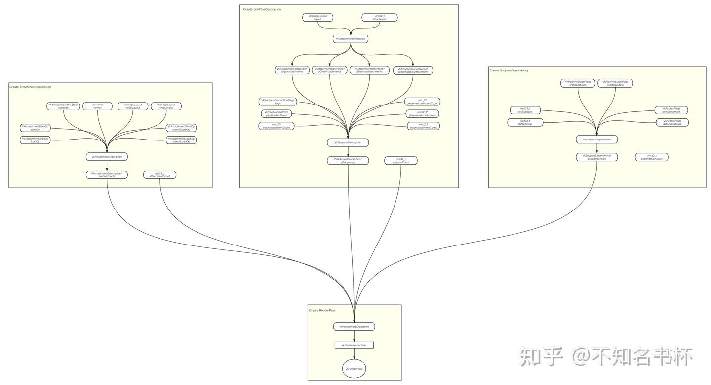

# 理解Vulkan渲染通道(RenderPass)

## 前言

本文是针对在[Vulkan中RenderPass](https://zhida.zhihu.com/search?content_id=225752644&content_type=Article&match_order=1&q=Vulkan中RenderPass&zhida_source=entity)概念的一个学习，希望能够帮助到其他的Vulkan苦手。有讲的不对也请多多指正。
其他Vulkan文章汇总

[不知名书杯：Vulkan文章汇总169 赞同 · 7 评论文章](https://zhuanlan.zhihu.com/p/616082929)

本文中涉及到的概念如下:

- RenderPass
- SubPass
- Attachment
- Framebuffer
- Subpass Dependency

## 什么是RenderPass？

RenderPass同样是现代图形API提出的新概念，简单来说RenderPass是整个Render Pipeline的一次执行。RenderPass本质是定义一个完整的渲染流程以及使用的所有资源的描述，可以理解为是一份元数据或者占位符的概念其中不包含任何真正的数据。

在Vulkan中不能在没有RenderPass的情况下渲染任何东西。而且每个RenderPass必须有一个或多个子步骤。这些子步骤被称为SubPass(在这不展开，下面会讲),每个SubPass都是使用RenderPass中定义的资源描述。RenderPass的资源可能包括 Color、Depth/Stencil、Resolve Attachment和Input Attachment(潜在地在同一RenderPass的上一个SubPass中产出的同样属于RenderPass的资源)，而这些资源被称为Attachment。为什么不直接把它们叫做RenderTarget呢？因为Attachment只是资源描述(元数据)定义一些加载/存储操作以及相应资源的格式。RenderPass其实是通过Framebuffer中包含的ImageView拿到真正的数据(牢记RenderPass只是元数据)。并且之后的RenderPass中只要满足Vulkan定义的Render Pass Compatibility要求的Framebuffer，Framebuffer就能通过RenderPass渲染出相应的结果。

## 为什么需要设计出RenderPass？

在传统的图形API当中，可以随意渲染任何想要的东西到Framebuffer上，并且由于传统图形API提供的抽象表现得好像命令是立即执行的。但是Vulkan会向开发者暴露真实的情况，事实上GPU执行放置在内存中的命令可能是乱序的，而且这些CommandBuffer可能是在许多线程上并行构建的。此外大量的相互关联的状态通过一个大的状态对象同时呈现给图形驱动程序。这为驱动程序提供了一个机会，在渲染之前充分优化GPU状态以便最大化性能，而不会出现卡顿和其他与即时优化相关的问题。最终的结果是更低、更一致的帧时间和更低的CPU开销。

并且由于移动端所占用户增多，相比于桌面端GPU的IMR(立即渲染)架构，移动端GPU是Tile Base架构。于是在Vulkan当中提出了RenderPass这一概念。旨在让应用程序将一帧的[高层结构](https://zhida.zhihu.com/search?content_id=225752644&content_type=Article&match_order=1&q=高层结构&zhida_source=entity)传递给驱动程序更加明确渲染执行步骤，而不是让随意地渲染到Framebuffer中去。并且可以帮助Tile Base架构的GPU驱动程序可以使用这些信息来确定何时将数据进入或者离开On-Chip内存，并且判断是否需要将数据放置到内存或丢弃Tile内的全部内容，甚至做一些其他事情比如用于binding大小的内存分配和其他内部操作。

一个Tile Base GPU架构会批量处理几何图形并确定每块Tile(FrameBuffer会分为很多块Tile)会被那些几何图形覆盖，然后渲染覆盖在该Tile上的几何图形。这使得对Framebuffer访问非常连贯，在许多情况下GPU会在On Chip内存中上完成一个Tile的渲染再移动到下一个Tile继续处理，可以减少带宽的损耗。但是如果是IMR架构则意味着当一个绘制的令进来时，GPU会将它渲染到它在什么，并在处理下一个命令之前完成它。事情是流水线化的，命令被一个接一个的处理。

那么对于IMR架构来说RenderPass会带来什么好处呢？比如告诉驱动程序一个SubPass不依赖于另一个SubPass的结果。因此有时可以并行或者乱序地渲染这些SubPass并且不需要同步。如果一个SubPass依赖于前一个SubPass的结果，那么使用传统的图形API，驱动程序需要在GPU管线中插入一个气泡(浪费GPU效率)，以便将渲染后端的输出缓存与[纹理单元](https://zhida.zhihu.com/search?content_id=225752644&content_type=Article&match_order=1&q=纹理单元&zhida_source=entity)的输入缓存同步。然而通过重新调度可以指示渲染后端刷新它们的缓存，处理其他不相关的工作，然后在启动SubPass之前使纹理缓存失效。这消除了气泡并节省了GPU时间。因为每个SubPass都包含了关于如何处理它的Attachment信息，可以知道是否要清除一个Attachment之前的内容以及是否关心那个Attachment内容。这允许驱动程序提前安排清除工作，或者智能地决定使用什么方法来清除一个Attachment(例如使用[计算着色器](https://zhida.zhihu.com/search?content_id=225752644&content_type=Article&match_order=1&q=计算着色器&zhida_source=entity)、固定功能硬件或DMA引擎)。如果一个应用程序说它不需要一个Attachment有定义的数据，那么可以将Attachment带入一个部分压缩的状态。这是指它包含的数据是未定义的，但它的状态就硬件而言这就是最佳的渲染状态。在某些情况下数据在内存中的布局对于最佳渲染和通过纹理单元读取是不同的。通过分析应用程序提供的数据依赖关系，驱动程序可以决定何时最好执行布局变化、解压缩、[格式转换](https://zhida.zhihu.com/search?content_id=225752644&content_type=Article&match_order=1&q=格式转换&zhida_source=entity)等操作。它还可以将一些操作分成几个阶段，将它们与应用程序提供的渲染工作交错进行，这也消除了管线气泡并提高了效率。 总的来说RenderPass无论对于移动端GPU还是桌面GPU都能够为GPU的优化和效率提供很多作用。一个明确的渲染流程是现在不可或缺的。

## Subpass

SubPass在不同的GPU架构会有不一样的意义，在传统的桌面IMR架构GPU上，SubPass只不过是[语法糖](https://zhida.zhihu.com/search?content_id=225752644&content_type=Article&match_order=1&q=语法糖&zhida_source=entity)，本质上可以认为是一个一个RenderPass还会拿一整张FrameBuffer来进行操作。但是到了Tile Base GPU架构之下。SubPass就会有重要的性能优化作用。

由于在Tile Base 架构中本身按顺序执行一块一块Tile的计算，在这个Tile中首先完成DrawCall中的所有[顶点着色器](https://zhida.zhihu.com/search?content_id=225752644&content_type=Article&match_order=1&q=顶点着色器&zhida_source=entity)计算，然后是完成DrawCall中的[片段着色器](https://zhida.zhihu.com/search?content_id=225752644&content_type=Article&match_order=1&q=片段着色器&zhida_source=entity)计算。RenderPass定义了被认为是所有DrawCal的边界(不在这个边界内，全部不渲染)，而SubPass则对特定的DrawCal进行批处理和排序。它基本上是通过将顶点着色器的输出分到整个渲染区域的每个Tile中(通常每个Tile是16x16或32x32像素)，然后每个Tile作为一个整体单元执行，基本上就像计算调度中的线程组。

因为每个Tile就像一个线程组，在Tile Base架构下它们可以访问一小块极快的[共享内存](https://zhida.zhihu.com/search?content_id=225752644&content_type=Article&match_order=1&q=共享内存&zhida_source=entity)(On-Chip Memory)。一旦整体Tile绘制完成那么该内存就不会被维护，但由于SubPass内的所有片段着色器基本上都是一起执行的，而且一个Tile上的多个SubPass都是按顺序执行的，所以可以利用这一点来实现任何一种需要Input Attachment的效果并且可以得到上一个SubPass的结果。有些需求中可以用到比如延迟着色则依赖于能够在着色过程中访问之前的渲染结果。对于Tile Base渲染器来说如果后续的渲染操作是在相同的分辨率下进行的，并且只需要当前正在渲染的像素中的数据，那么之前的渲染结果就可以在On-Chip Memory中处理避免回传到内存当中减少带宽的消耗。并且假如并不在意渲染结束后的该Attachment中的结果，指定是否存储该Attachment内容。如果不需要的话可以被释放掉(比如对于大多数的Depth Attachment都可以不存储)，这个存储的内存消耗在移动设备上还是很可观的。

还有一个问题，那么就是SubPass在当前Tile是无法访问到其他的Tile的像素，只能访问Tile内部的像素。如果你真的想访问另外一个Tile下的像素，那么必须渲染完整个图像才能做到这一点，这一点想必是很慢的。


## 创建RenderPass

需要填充VkRenderPassCreateInfo结构体来创建VkRenderPass。

```cpp
typedef struct VkRenderPassCreateInfo {
    VkStructureType                   sType;
    const void*                       pNext;
    VkRenderPassCreateFlags           flags;
    uint32_t                          attachmentCount;
    const VkAttachmentDescription*    pAttachments;
    uint32_t                          subpassCount;
    const VkSubpassDescription*       pSubpasses;
    uint32_t                          dependencyCount;
    const VkSubpassDependency*        pDependencies;
} VkRenderPassCreateInfo;
```

### VkAttachmentDescription

一个Attachment对应于一个VkImageView。在创建RenderPass时需要提供Attachment描述，VkAttachmentDescription结构就是对应Attachment描述，这样可以对RenderPass进行适当的配置。RenderPass可以通过Framebuffer来获得实际的Image。可以将多个Attachment与一个RenderPass联系起来。这些Attachment可以作为多个RenderTarget或者用于单独的SubPass。在Vulkan中Color 和Depth是相互独立的Attachment。因此VkRenderPassCreateInfo的pAttachments成员指向一个Attachment数组。用来指定RenderPass内包含所有的Attachment描述。

- format字段制定该Attachment的格式。
- samples字段是一个VkSampleCountFlagBits值，指定图像的Sample Count属性。为了配合MSAA使用。
- loadOp字段是一个VkAttachmentLoadOp值，指定在首次使用Attachment的SubPass加载时如何处理的Color或者Depth组件的内容。
- storeOp字段是一个VkAttachmentStoreOp值，指定在最后使用该Attachment的SubPass结束时如何存储其Color或者Depth组件的内容。
- stencilLoadOp字段是一个VkAttachmentLoadOp值，指定在第一次使用的SubPass加载时如何处理Attachment的Stencil组件的内容。
- stencilStoreOp是一个VkAttachmentStoreOp值，指定在最后一个使用SubPass结束时如何存储Attachment的Stencil组件的内容。
- initialLayout字段是指RenderPass实例开始时Attachment Image子资源的布局。
- finalLayout字段是指当RenderPass实例结束时Attachment Image子资源将被转换到的布局。

在这里有一些需要注意的点，在这里当format字段是Color Attachment相关的设置，那么只会使用loadOp和storeOp处理其Color组件，stencilLoadOp和stencilStoreOp则会被忽略。如果format是Depth/Stencil Attachment相关则loadOp和storeOp处理其Depth组件，而stencilLoadOp和stencilStoreOp定义如何处理Stencil数据。

如果一个Attachment不被任何SubPass使用，那么对于该Attachment的loadOp、storeOp、stencilStoreOp和stencilLoadOp将被忽略，并且不会执行任何加载或存储操作。但是initialLayout和finalLayout指定的布局过渡仍将被执行。

```cpp
typedef struct VkAttachmentDescription {
    VkAttachmentDescriptionFlags    flags;
    VkFormat                        format;
    VkSampleCountFlagBits           samples;
    VkAttachmentLoadOp              loadOp;
    VkAttachmentStoreOp             storeOp;
    VkAttachmentLoadOp              stencilLoadOp;
    VkAttachmentStoreOp             stencilStoreOp;
    VkImageLayout                   initialLayout;
    VkImageLayout                   finalLayout;
} VkAttachmentDescription;
```


### VkAttachmentLoadOp

- VK_ATTACHMENT_LOAD_OP_LOAD指定了在渲染区域内图像的先前内容将被保留。对于Depth/Stencil Attachment则使用VK_ACCESS_DEPTH_STENCIL_ATTACHMENT_READ_BIT访问类型。对于Color Attachment则使用VK_ACCESS_COLOR_ATTACHMENT_READ_BIT访问类型。
- VK_ATTACHMENT_LOAD_OP_CLEAR指定了在渲染区域内图像将被清除为指定值。对于Depth/Stencil Attachment则使用VK_ACCESS_DEPTH_STENCIL_ATTACHMENT_WRITE_BIT访问类型。对于Color Attachment则使用VK_ACCESS_COLOR_ATTACHMENT_WRITE_BIT访问类型。
- VK_ATTACHMENT_LOAD_OP_DONT_CARE指定了在渲染区域内前一次内容不需要被保留。其中Attachment的内容将未定义。对于具有Depth/Stencil Attachment则使用VK_ACCESS_DEPTH_STENCIL_ATTACHMENT_WRITE_BIT访问类型。对于Color Attachment则使用VK_ACCESS_COLOR_ATTACHMENT_WRITE_BIT访问类型。
- VK_ATTACHMENT_LOAD_OP_NONE_EXT指定了在渲染区域内图像的先前内容将被保留，但Attachment的内容在RenderPass内将是未定义的。由于不访问图像，因此不使用任何访问类型。

### VkAttachmentStoreOp

- VK_ATTACHMENT_STORE_OP_STORE指定了在渲染区域中的内容将被写入内存。对于Depth/Stencil Attachment则使用VK_ACCESS_DEPTH_STENCIL_ATTACHMENT_WRITE_BIT访问类型。对于Color Attachment使用VK_ACCESS_COLOR_ATTACHMENT_WRITE_BIT访问类型。
- VK_ATTACHMENT_STORE_OP_DONT_CARE指定了在渲染区域内的内容在渲染后不再需要并可以被丢弃。区域内的Attachment内容将未定义。对于Depth/Stencil Attachment使用VK_ACCESS_DEPTH_STENCIL_ATTACHMENT_WRITE_BIT访问类型。对于Color Attachment使用VK_ACCESS_COLOR_ATTACHMENT_WRITE_BIT访问类型。
- VK_ATTACHMENT_STORE_OP_NONE指定渲染区域内的内容不被存储操作所访问。然而，如果Attachment在渲染过程中被写入，那么Attachment内容在渲染区域内将是未定义的。

VK_ATTACHMENT_STORE_OP_DONT_CARE可能会导致在到达内存之前丢弃在之前的RenderPass中生成的内容，即使在当前RenderPass中未对Attachment进行写入操作。

这个机制有一个需要注意的复杂问题：考虑一下渲染一个有两个RenderPass的场景，第二个RenderPass将第一个RenderPass的结果(用STORE_OP_STORE)作为Input Attachment(LOAD_OP_LOAD)但不向它写入。如果这个Input Attachment在第二个RenderPass之后仍然需要，那么它必须仍然与STORE_OP_STORE相关联：使用STORE_OP_DONT_CARE会导致一些硬件进行优化并在第二个RenderPass结束后丢弃该Attachment内容，即使第一个RenderPass使用了STORE_OP_STORE标识。可以将其视为第一个RenderPass输出内容被丢弃，尽管之前该内容是被认为有效的。这是一种潜在的良好性能提升，但这意味着用户需要准备好接受出乎意料的行为！

### VkSubpassDescription

在这里通过VkSubpassDescription来描述RenderPass中的每个SubPass的属性。

- flags字段是一个VkSubpassDescriptionFlagBits的[位掩码](https://zhida.zhihu.com/search?content_id=225752644&content_type=Article&match_order=1&q=位掩码&zhida_source=entity)，用于指定SubPass的用途。
- pipelineBindPoint是一个VkPipelineBindPoint值，指定该SubPass支持的Pipeline类型。
- inputAttachmentCount字段是指InputAttachment的数量。
- pInputAttachments字段是一个指向VkAttachmentReference数组的指针，定义该SubPass需要的Input Attachment及对应布局。
- colorAttachmentCount字段是指Color Attachment的数量。
- pColorAttachments字段是一个指向VkAttachmentReference数组的指针，该结构定义了该SubPass需要的Color Attachment及对应布局。
- pResolveAttachments字段是NULL或一个指向VkAttachmentReference[结构数组](https://zhida.zhihu.com/search?content_id=225752644&content_type=Article&match_order=1&q=结构数组&zhida_source=entity)的指针，该结构定义了该SubPass的Resolve Attachment及其布局。在开启MSAA时会用到。
- pDepthStencilAttachment字段是一个指向VkAttachmentReference指针，指定该SubPass的Depth/Stencil Attachment及其布局。
- preserveAttachmentCount字段是需要保留Attachment数量。
- pPreserveAttachments字段是一个指向Attachment数组的指针，这些Attachment在当前的SubPass中未使用，但其内容必须在整个SubPass期间保持不变。

pInputAttachments数组中的每个元素对应于片段着色器中的一个InputAttachment索引。如果索引为X那么它使用pInputAttachments[X]中对应的Attachment。InputAttachment还必须在DescriptorSet中绑定到Pipeline才可以供SubPass内使用。如果pInputAttachments中的Attachment为VK_ATTACHMENT_UNUSED，则片段着色器不可以从InputAttachment索引读取内容。片段着色器可以使用SubPass输入变量来访问InputAttachment在片段的(x, y, layer)Frame Buffer中坐标处的内容。注意InputAttachment是不可寻址的。简单而言就说InputAttachment在SubPass只能获取到前一次SubPass处理后的Framebuffer内对应坐标点的内容。

pColorAttachments数组中的每个元素对应片段着色中的一个输出位置，即如果着色器声明了一个用Location为X的输出变量，那么它使用pColorAttachments[X]中的Attachment。如果pColorAttachments中Attachment为VK_ATTACHMENT_UNUSED或者如果对应Attachment禁用了Color Write则该着色器写入将会被丢弃。

如果flags不包含VK_SUBPASS_DESCRIPTION_SHADER_RESOLVE_BIT_QCOM并且pResolveAttachments不为NULL，则它的每个元素对应于一个Color Attachment(与pColorAttachments中相同索引处的元素)，并且为每个Attachment定义了一个多重采样Resolve操作。在每个SubPass结束时，多重采样Resolve操作读取SubPass的Color Attachment，并将渲染区域内每个像素的Sample解析到相应Resolve Attachment中相同像素位置，除非ResolveAttachment为VK_ATTACHMENT_UNUSED。这个主要用来完成MSAA的最后一步Resolve操作。

关于Depth/Stencil的Resolve设置需要在pNext中补充一个VkSubpassDescriptionDepthStencilResolve结构。depthResolveMode和stencilResolveMode分别指定Resolve操作是怎么样的。并且需要检测pDepthStencilResolveAttachment的VkFormat是否有Depth组件或者Stencil组件，如果没有则对应的Resolve操作也会被忽略。pDepthStencilResolveAttachment同样需要不为空并且不为VK_ATTACHMENT_UNUSED。并且depthResolveMode或者stencilResolveMode如果是VK_RESOLVE_MODE_NONE，那么对应组件Resolve结果不会被写入，对应Attachment中的内容会被保留。

对于pDepthStencilAttachment为NULL，或者其Attachment设置为VK_ATTACHMENT_UNUSED，则表示在SubPass中不使用Depth/Stencil Attachment。

### VkAttachmentReference

在这里通过VkAttachmentReference结构为SubPass指定使用在RenderPass中包含的具体的哪个Attachment。并且SubPass之间Attachment的布局可能会发生变化，因此需要在每个SubPass的基础上通过layout字段来描述。

- attachment是一个整数值，用于识别VkRenderPassCreateInfo::pAttachments中相应索引的Attachment或者是VK_ATTACHMENT_UNUSED，表示这个Attachment没有被使用。
- layout字段是一个VkImageLayout值，指定该Attachment在该SubPass中使用的布局。

```cpp
typedef struct VkAttachmentReference {
    uint32_t         attachment;
    VkImageLayout    layout;
} VkAttachmentReference;

typedef struct VkSubpassDescriptionDepthStencilResolve {
    VkStructureType                  sType;
    const void*                      pNext;
    VkResolveModeFlagBits            depthResolveMode;
    VkResolveModeFlagBits            stencilResolveMode;
    const VkAttachmentReference2*    pDepthStencilResolveAttachment;
} VkSubpassDescriptionDepthStencilResolve;

typedef struct VkSubpassDescription {
    VkSubpassDescriptionFlags       flags;
    VkPipelineBindPoint             pipelineBindPoint;
    uint32_t                        inputAttachmentCount;
    const VkAttachmentReference*    pInputAttachments;
    uint32_t                        colorAttachmentCount;
    const VkAttachmentReference*    pColorAttachments;
    const VkAttachmentReference*    pResolveAttachments;
    const VkAttachmentReference*    pDepthStencilAttachment;
    uint32_t                        preserveAttachmentCount;
    const uint32_t*                 pPreserveAttachments;
} VkSubpassDescription;
```


### **VkSubpassDependency**

到现在为止已经指定了RenderPass的所有Attachment描述以及SubPass描述，现在还没有指定SubPass之间的依赖描述。在这里通过VkSubpassDependency来描述RenderPass中不同SubPass之间或同一个SubPass的内存和执行同步依赖。

- srcSubpass字段是第一个SubPass的索引或者是VK_SUBPASS_EXTERNAL。
- dstSubpass字段是第二个SubPass的索引。
- srcStageMask字段是一个VkPipelineStageFlagBits，用于指定源阶段掩码。
- dstStageMask字段是一个VkPipelineStageFlagBits，用于指定目标阶段掩码。
- srcAccessMask字段是VkAccessFlagBits，用于指定源访问掩码。
- dstAccessMask字段是VkAccessFlagBits，用于指定目标访问掩码。

通过srcSubpas和dstSubpass可以段指定了依赖关系和依赖SubPass的索引。其中VK_SUBPASS_EXTERNAL是RenderPass之前或之后的隐式SubPass。dstSubpass必须总是比srcSubpass高，以防止依赖中的循环(除非其中一个SubPass是VK_SUBPASS_EXTERNAL)。并且如果 srcSubpass等于dstSubpass，那么 VkSubpassDependency就不会直接定义一个依赖关系。如果srcSubpass和dstSubpass不相等，当一个包含SubpassDependency的RenderPass实例被提交到一个队列时，它定义了由srcSubpass和dstSubpass标识的SubPass之间的依赖关系。

关于srcStageMask，dstStageMask，srcAccessMask，dstAccessMask相关在这里不展开，这是属于Vulkan同步的范围(要专门开一篇文章，在这不展开)。

```cpp
typedef struct VkSubpassDependency {
    uint32_t                srcSubpass;
    uint32_t                dstSubpass;
    VkPipelineStageFlags    srcStageMask;
    VkPipelineStageFlags    dstStageMask;
    VkAccessFlags           srcAccessMask;
    VkAccessFlags           dstAccessMask;
    VkDependencyFlags       dependencyFlags;
} VkSubpassDependency;
```


### VkFrameBuffer

RenderPass需要与Framebuffer获取到真正的Image才可以渲染出真正的结果。Framebuffer代表了RenderPass所使用的特定内存的集合，也就是Attachment真正对应的内存。已经了解到RenderPass只是元数据，真正的Image需要从Framebuffer中获取。Framebuffer会定义了哪个ImageView是对应到RenderPass的哪个Attachment。ImageView定义了要使用Image的哪一部分。Image定义了哪个物理内存被使用以及Texel的格式。整体的流程如下图所示：


接下来目光转向VkFramebufferCreateInfo结构：

- renderPass是一个VkRenderPass并且定义了Framebuffer将与哪些RenderPass兼容。
- attachmentCount是指Attachment的数量。
- pAttachments是一个指向VkImageView数组的指针，每个句柄将被用作RenderPass中的相应Attachment。如果flags包括VK_FRAMEBUFFER_CREATE_IMAGELESS_BIT，这个参数会被忽略。
- width, height则定义了Framebuffer的尺寸。

Framebuffer中使用的所有Attachment都具有相同的width, height。这个RenderPass是解耦的牢记RenderPass只是元数据，所以同一个RenderPass可以用于不同尺寸的Framebuffer。只要满足RenderPass兼容性即可。

```cpp
typedef struct VkFramebufferCreateInfo {
    VkStructureType             sType;
    const void*                 pNext;
    VkFramebufferCreateFlags    flags;
    VkRenderPass                renderPass;
    uint32_t                    attachmentCount;
    const VkImageView*          pAttachments;
    uint32_t                    width;
    uint32_t                    height;
    uint32_t                    layers;
} VkFramebufferCreateInfo;
```


整体流程图：



## 使用RenderPass

### 开启RenderPass

在上面已经创建RenderPass，那么接下来说说如何使用RenderPass。在这里通过vkCmdBeginRenderPass调用来创建一个RenderPass实例。并且如果一旦一个RenderPass要在Command Buffer中开始，提交给该Command Buffer的后续命令将在该RednerPass实例的第一个SubPass中执行。vkCmdBeginRenderPass需要填充一个VkRenderPassBeginInfo结构用来指定要开始的RenderPass实例以及该实例使用的Framebuffer。

VkRenderPassBeginInfo结构如下：

- renderPass是要开始使用的RenderPass。
- framebuffer是指包含RenderPass所使用的全部Attachment的Framebuffer。
- renderArea是指受RenderPass影响的渲染区域。
- clearValueCount是pClearValues中元素的数量。
- pClearValues是一个指向VkClearValue结构数组的指针，其中包含每个Attachment的Clear Value，如果Attachment使用了loadOp值为VK_ATTACHMENT_LOAD_OP_CLEAR或者如果Attachment有Depth/Stencil格式并且使用了stencilLoadOp值为VK_ATTACHMENT_LOAD_OP_CLEAR。这个数组是以Attachment编号为索引的。只有对应于已清除的VkClearValue的元素被使用。pClearValues的其他元素被忽略。

renderArea用于渲染Framebuffer的一个子集，例如对屏幕上部分区域进行更新。应用程序负责将渲染结果剪切到这个区域，如果renderArea和Framebuffer没有对齐，这会导致性能下降，这可以通过vkGetRenderAreaGranularity来确定。对于Tile Base渲染器来说，它可能对应于Tile Grid的对齐。在大多数情况下，renderArea可以被设置为Framebuffer的全部宽度和高度。

```cpp
typedef struct VkRenderPassBeginInfo {
    VkStructureType        sType;
    const void*            pNext;
    VkRenderPass           renderPass;
    VkFramebuffer          framebuffer;
    VkRect2D               renderArea;
    uint32_t               clearValueCount;
    const VkClearValue*    pClearValues;
} VkRenderPassBeginInfo;
```


### 切换SubPass

在一个RenderPass当中会有一个或者多个SubPass，从上面的vkCmdBeginRenderPass创建RenderPass实例，并且隐式的从第一个SubPass开始运行，但是假如RenderPass内有多个SubPass，如何去切换到下一个SubPass呢。可以通过vkCmdNextSubpass来完成这个操作。RenderPass的SubPass索引从记录vkCmdBeginRenderPass时的零开始，每次记录vkCmdNextSubpass时都会递增。


移动到下一个SubPass的操作是会自动执行被结束的SubPass中的任何多重采样Resolve操作。出于同步的目的，SubPass结束时的多重采样Resolve被视为Color Attachment的写入。这适用于Color,Depth/Stencil Attachment的Resolve操作。也就是说，它们被认为是在 VK_PIPELINE_STAGE_COLOR_ATTACHMENT_OUTPUT_BIT管道阶段执行的，它们的写入与 VK_ACCESS_COLOR_ATTACHMENT_WRITE_BIT同步。SubPass内的渲染和SubPass结束时的任何Resolve操作之间的同步会自动发生，不需要明确的依赖关系或Pipeline Barrier。然而如果Resolve Attachment也被用于不同的SubPass，则需要一个显式的依赖关系。

在过渡到下一个SubPass后，应用程序可以记录该SubPass的命令。比如重新绑定一个Pipeline(一般不同的SubPass也要对应不同的Pipeline)或者调整动态属性或者是提交一些DrawCall。

### 结束RenderPass

在开始RenderPass之后开始记录命令，在全部命令提交到了Command Buffer之后。现在应该就可以结束RenderPass。在这里通过vkCmdEndRenderPass来完成，结束一个RenderPass实例。

### 流程图


## **RenderPass兼容性**

在这里一直提到RenderPass只是元数据只包含了Attachment的使用方式和格式。随之而来就是RenderPass兼容性问题。Framebuffer以及Pipeline都需要RenderPass作为参数创建，它们只能与创建参数中包含的RenderPass一起使用或者与之兼容的对象。

两个AttachmentReference如果其Format和SampleCount匹配或者两者都为VK_ATTACHMENT_UNUSED或指向该引用的指针为NULL则它们是兼容的。如果两个AttachmentReference数组的长度不同，则较小数组中不存在的Attachment Reference将被视为VK_ATTACHMENT_UNUSED。如果两个数组内相对应的Attachment都是兼容的，那么这两个AttachmentReference数组是兼容的。

如果两个RenderPass具有相应的Color、Input、Resolve和Depth/Stencil Attachment Reference，并且在所有方面除了Attachment描述中的初始和最终图像布局、Attachment描述中的loadOp和storeOp以及Attachment Reference中的图像布局之外，其他方面都是相同的话则这两个RenderPass是兼容的。还有一种特殊情况是，如果两个RenderPass有一个相同的SubPass，则会忽略对Resolve Attachment Reference的兼容性的要求。

这样意味着满足RenderPass兼容性的话，可以减少一些Framebuffer对象和Pipeline对象的创建成本以及重新绑定Pipeline的成本。

## RenderPass 优化原则

### Loadop和StoreOp的设置

在RenderPass中的重要功能就是是能够指定Attachment的loadoOp/storeOp。通过这些操作驱动程序可以选择是否需要清除Framebuffer的初始内容，从内存中加载，或者保持未指定和未被应用程序使用以及在RenderPass结束后是否需要将Attachment内容存储到内存中。

这些操作在不同的GPU架构上有着不同的权衡，这些操作的正确性非常重要。在Tile Base架构中如果使用了错误的LoadOp或StoreOp会导致浪费带宽，降低性能并增加功耗。在IMR架构GPU上驱动程序仍然可以使用这些操作来执行某些用于后续渲染的优化。比如之某个Attachment的先前内容不关心，但Attachment具有相关的压缩元数据，则驱动程序可以清除此元数据以使后续渲染更加高效。

为了让驱动程序有最大的自由度，指定最低限度的loadOp/storeOp是很重要的。例如当渲染一个全屏quad到一个Attachment中时，在Tile Base GPU中使用VK_ATTACHMENT_LOAD_OP_CLEAR可能比VK_ATTACHMENT_LOAD_OP_LOAD更快，而在IMR架构的GPU上LOAD可能更快，指定VK_ATTACHMENT_LOAD_OP_DONT_CARE很重要，这样驱动程序可以执行一个最佳选择。在某些情况下VK_ATTACHMENT_LOAD_OP_DONT_CARE可能比LOAD或CLEAR更好，因为它允许驱动程序避免对图像内容进行昂贵的清除操作，但仍然清除图像元数据以加速后续渲染。

同样VK_ATTACHMENT_STORE_OP_DONT_CARE应该在应用程序不期望读取渲染到Attachment的数据的情况下使用，这对于Depth Buffer和MSAA来说通常是这样的。请不要为那些在RenderPass中实际上不需要的Attachment设置loadOp或storeOp，如果设置的不正确，会多一个带宽的损耗，带来不必要的性能损耗。

### Color Attachment

首先就是Color Attachment用来承载经过RenderPass渲染出的结果并且之后之后会被丢给SwapChain去展示，由于在RenderPass开始的时候不需要关心之前的内容，因此使用LOAD_OP_DONT_CARE以避免花费时间加载它是有意义的。 如果不在整个Framebuffer上绘制，帧可能会在没有绘制的区域上显示随机颜色。此外它会显示在前一帧中绘制的像素。解决方案包括使用LOAD_OP_CLEAR使用指定的颜色清除Framebuffer的内容。确保不会有上一帧的渲染结果留存在上面。

不可使用LOAD_OP_LOAD，在这里一般是不需要用到上一帧的内容的，但是假如使用LOAD_OP_LOAD则需要消耗大量的带宽从内存拉取过来，这对于Tile Base架构的GPU是十分影响性能的。

### Depth Attachment

可以根据下一个RenderPass是否需要Depth Attachment来选择设置什么storeOp，如果在后续的RenderPass不需要该Depth Attachment内容的话可以将其设置为STORE_OP_STORE，否则应该选择为STORE_OP_DONT_CARE。主要也就是避免将Depth Attachment的内容存入到内存当中，增高带宽损耗。

### 避免使用vkCmdClearXXX

可以使用vkCmdClearXXX来清除Attachment内容，但是在这里并不推荐使用这个能力来清除Attachment。建议是通过设置loadOp来完成都可以得到相同的结果。虽然vkCmdClearXXX函数可用于显式清除图像内容，但在某些移动设备上这不是免费的。与CLEAR或DONT_CARE的loadOp不同，vkCmdClearXXX通过使用像素着色器来手动写入一个常量颜色来清除一个RenderPass中的Attachment内容。这将带来不必要的性能损耗，但是假如你的需求是清除Attachment中的部分区域的内容，那还是需要通过这个能力来实现。

### **Transient Attachment**

在Tile Base GPU架构下对于大部分场景来说Framebuffer中的某些Attachment在根本用不到，比如正常的Depth Attachment或者是延迟渲染中的GBuffer。由于深度信息也不需要手动初始化，大部分情况根本也不会去读取正常的Depth Attachment的内容，至于GBuffer在RenderPass开始时被清空(不需要读取内存)并且storeOp设置为DONT_CARE不需要存储到内存中，由Geometry SubPass写入并且由Lighting SubPass读取并在RenderPass结束时被丢弃。如果GPU有足够的内存可以将它们存储在Tile内存(On-Chip)上，就不需要将它们写回外部内存。对于这些情况提出Transient Attachment概念来进一步的优化性能。

在实践中可以将对这些图像设置如下属性：

- imageUsage = VK_IMAGE_USAGE_TRANSIENT_ATTACHMENT_BIT
- memoryProperty = VK_MEMORY_PROPERTY_LAZILY_ALLOCATED_BIT

LAZILY_ALLOCATED意味着只有当使用它时，它才会被GPU分配，并且只允许被绑定到flags包括VK_IMAGE_USAGE_TRANSIENT_ATTACHMENT_BIT的Image。指定为TRANSIENT_ATTACHMENT表示它将只在一次RenderPass中存在。配合LAZILY_ALLOCATED表示并不需要在主存里面创建的对象。可以减少带宽的损耗。

### SubPass Merge

在Tile Base架构中还有一个关于SubPass的优化也就是SubPass Merge。具有简单的Framebuffer依赖性的SubPass可以被合并到一个的RenderPass中，在RenderPass的持续时间内保持On-Chip的Attachment数据。由于SubPass的信息是提前知道的，驱动程序能够检测到两个或多个SubPass是否可以合并在一起。那么其实vkCmdNextSubpass是一个空操作。但是想要SubPass Merge同样需要满足于一些条件：

- VK_DEPENDENCY_BY_REGION_BIT的依赖关系。

- 没有影响SubPass Merge的外部因素。

- - Color Attachment数据格式是否可以合并。
  - 是否需要保存写入/读回，两个不共享任何数据的SubPass不会从中受益，也不会被合并。
  - 需要合并的SubPass使用的Attachment的Sample Count是否一致。
  - SubPass是否需要使用超过每像素128位(根据GPU不同的型号有不同的现在)的Tile Buffer Color Storage。

本质上SubPassMerge通过设置VK_DEPENDENCY_BY_REGION_BIT来利用了Framebuffer Local的特性，它可以将Framebuffer完全保留在On-Chip寄存器中，从而避免外部带宽跨越这种依赖。

**VK_DEPENDENCY_BY_REGION_BIT补充(2023.06.23)**

在Tile Base 架构GPU，有一类硬件分两次对三角形进行[光栅化](https://zhida.zhihu.com/search?content_id=225752644&content_type=Article&match_order=1&q=光栅化&zhida_source=entity)处理。第一道过程是将三角形分解多个小的Screen Space的Tile bin。第二个过程是在每个Tile的基础上对每个分到给定Tile上的三角形执行完整的图形管道。如果没有设置VK_DEPENDENCY_BY_REGION_BIT，中间的[渲染目标](https://zhida.zhihu.com/search?content_id=225752644&content_type=Article&match_order=1&q=渲染目标&zhida_source=entity)必须完全同步，并在每次绘制时刷新，无论它们影响的是哪块Tile。如果设置了这个VK_DEPENDENCY_BY_REGION_BIT，就可以告知驱动程序，对某个Framebuffer的依赖性的交互是完全基于Tile被绘制的地方进行本地化的。这允许各种优化的产生，包括减少TransientFramebuffer存储的内存需求。当然如果你对Framebuffer的依赖性的使用事实上不是Framebuffer Local，就不要设置这个标志。比如在片段着色器中对Framebuffer进行采样以进行SSR，那么无论你在哪里渲染都可能会访问Framebuffer的任意位置的像素，所有不要设置为VK_DEPENDENCY_BY_REGION_BIT。

### 合适的ImageLayout

在RenderPass创建过程中需要指定initialLayout和finalLayout是很重要，首先为Image设置正确的ImageLayout是很重要的。因为选择不同的layout会影响到像素在内存中的组织方式。由于图形硬件的工作方式，简单地逐行存储像素可能不会带来最好的性能。设置好正确的layout可以让驱动程序更有效地管理内存和缓存内容。通过为Attachment指定initialLayout和finalLayout可以为驱动实现提供信息，告诉它如何在整个RenderPass中最优化地操作Attachment内容，这可以导致更有效的内存管理和更有效地利用硬件资源。

如果RenderPass很复杂将每个图像转换到正确的布局并不容易，因为它需要某种状态跟踪。如果不需要以前的图像内容，有一个简单的方法，那就是将oldLayout/initLayout设置为VK_IMAGE_LAYOUT_UNDEFINED。虽然这在功能上是正确的，但它可能会影响性能，因为它可能会阻止GPU执行一些优化。

**Transaction Elimination**

这里介绍一个Mail GPU的特殊Featrue，Transaction Elimination(事务消除，TE)是Arm Mali Midgard和Bifrost GPU架构的一个关键节省带宽的功能，它可以在[片上系统](https://zhida.zhihu.com/search?content_id=225752644&content_type=Article&match_order=1&q=片上系统&zhida_source=entity)(SoC)层面上显著节省能源。而且TE可以用于GPU支持的所有Framebuffer格式，对精度并没有要求。

在执行TE时，GPU将当前的Framebuffer与先前渲染的帧(以Tile 为单位)进行比较，只对其中被修改的特定部分进行部分更新，从而大大减少每帧需要传输到外部存储器的数据量。在许多其他流行的应用中，Framebuffer的大部分在两个连续帧之间保持静止，TE节省的Framebuffer带宽可以达到99%。

**如何使用Transaction Elimination**

TE在以下条件下用于Image：

- SampleCount为1
- mipmap级别为1
- 图像使用COLOR_ATTACHMENT_BIT
- 图像不使用TRANSIENT_ATTACHMENT_BIT
- 使用单一Color Attachment。不适用于Mali G51 GPU或更高版本。
- 有效Tile大小为16x16像素。像素数据的存储决定了有效Tile的大小。

驱动程序会为图像保留一个Signature Buffer，以检查多余的Frame Buffer写入。Signature Buffer必须始终与图像的实际内容同步，当图像只在Tile写入内使用时就是这种情况。在实践中这相当于只使用只读的布局或者只能通过片段着色来写入。这些 "安全 "布局是：

- COLOR_ATTACHMENT_OPTIMAL
- SHADER_READ_ONLY_OPTIMAL
- TRANSFER_SRC_OPTIMAL
- PRESENT_SRC_KHR

所有其他布局包括UNDEFINED布局都被认为是 "不安全 "的，因为它们允许在Tile写入之外的路径对图像进行写入。当一个图像通过一个"不安全"的布局进行转换时，Signature Buffer必须无效以防止签名和数据变得不同步。请注意Swapchain图像是一个稍微特殊的情况，因为它被认为是"安全的"即使是从UNDEFINED布局过渡的。

尽量对Color Attachment保持在一个"安全"布局中，以避免不必要的Signature无效，包括避免通过UNDEFINED布局进行不必要的转换。通过设置storeOp为DONT_CARE 而不是UNDEFINED布局来跳过不需要的RenderTarget写入。避免将Color Attachment使用”不安全“布局。

### MSAA Resolve

在启用MSAA的时候，也需要有些注意的地方，在将数据渲染到MSAA纹理后，通常会将其Resolve到非MSAA纹理中进行进一步处理。如果固定功能的Resolve功能已经足够，在Vulkan中有两种方法可以实现：

- 对MSAA纹理使用VK_ATTACHMENT_STORE_OP_STORE，在RenderPass结束后使用vkCmdResolveImage。
- 对MSAA纹理使用VK_ATTACHMENT_STORE_OP_DONT_CARE，并通过VkSubpassDescription的pResolveAttachments成员指定Resolve目标。 在后一种情况下，驱动程序将执行必要的工作来Resolve MSAA内容，作为SubPass/RenderPsass结束时工作的一部分。

显然第二种方法可以提高效率。在Tile Base架构上使用第一种方法需要将整个MSAA纹理存储到内存中，然后从内存中读取并Resolve到另外一张纹理中。第二种方法可以以最有效的方式执行Resolve。在IMR架构上一些实现可能不支持使用传输阶段读取压缩的MSAA纹理，API要求在调用vkCmdResolveImage之前过渡到VK_IMAGE_LAYOUT_TRANSFER_SRC_OPTIMAL布局，这可能导致MSAA纹理的解压，浪费带宽和性能。有了pResolveAttachments，驱动可以以最大的性能执行Resolve操作，而不考虑架构。

在某些情况下，固定功能的MSAA Resolve是不够的。在这种情况下有必要将纹理过渡到VK_IMAGE_LAYOUT_SHADER_READ_ONLY_OPTIMAL，并在一个单独的RenderPass中进行Resolve。在Tile Base架构上这与使用vkCmdResolveImage固定函数方法都有相同的效率问题也就是多余的带宽损耗。在IMR架构上，效率取决于GPU和驱动。一个可能的选择是使用一个额外的SubPass并通过Input Attachment读取MSAA纹理。

要做到这一点，首先渲染到MSAA纹理SubPass必须通过pColorAttachments指定MSAA纹理，并将storeOp设置为VK_ATTACHMENT_STORE_OP_DONT_CARE。第二个执行Resolve的SubPass需要通过pInputAttachments指定MSAA纹理，并通过pColorAttachments指定Resolve目标。然后该SubPass需要用一个使用subpassInputMS资源读取MSAA数据的着色器渲染一个全屏四边形或三角形。此外应用程序需要指定两个SubPass之间的依赖关系并指定依赖标志为VK_DEPENDENCY_BY_REGION_BIT。驱动应该有足够的信息来安排执行，在Tile Base架构上MSAA的内容永远不会离开On-Chip内存中，而是在On-Chip中被Resolve，Resolve结果被写入主内存。请注意这是否会发生取决于驱动程序，并且不太可能在IMG架构 GPU上导致显著的节省。

### RenderPass和Secondary Command Buffer

多个RenderPass可以被插入到同一个Command Buffer中，只要在开始下一个RenderPass之前结束即可。一个RenderPass必须在一个Primary Command Buffer内开始和结束(也就是说一个RenderPass不能跨越多个Primary CommandBuffer)，所以这种方法中的Command Buffer构建的并行性依赖于多个RenderPass的并行构建。在许多渲染框架中，这种水平的并行性仍然足以让CPU核心保持忙碌，并且简化了资源管理和状态跟踪的任务。

在这里还有一个问题，在上面结束RenderPass已经提到了一个RenderPass必须在Primary Command Buffer开始和结束。那么意味着RenderPass在Primary Command Buffer之间是无法并行的。如果要在Primary Command Buffer中塞入多个RenderPass，那么就需要频繁的开始结束每个RenderPass，这会很影响性能。于是Vulkan提出了Secondary Command Buffer方案，如下所示：

- Secondary Command Buffer可以用来并行化RenderPass执行从而提高性能。例如可以记录多个Secondary Command Buffer，以并发地执行不同的RenderPass，稍后把它们都在一个Primary Command Buffer当中执行。
- Secondary Command Buffer可以被单独记录和存储，以便以后重复使用。这可以节省时间和资源，因为Command Buffer可以在多个帧甚至一个应用程序的不同部分中重复使用。
- 有了Secondary Command Buffer复杂的渲染任务可以被分解成更小、更容易管理的部分。这可以使代码更加模块化，更容易长期维护。

Secondary Command Buffer由vkAllocateCommandBuffers使用VkCommandBufferAllocateInfo创建，其level设置为VK_COMMAND_BUFFER_LEVEL_SECONDARY。

Secondary Command Buffer使用VkCommandBufferInheritanceInfo从Primary Command Buffer继承RenderPass状态，该结构作为VkCommandBufferBeginInfo的一部分传递给vkBeginCommandBuffer，同时还有flag为VK_COMMAND_BUFFER_USAGE_RENDER_PASS_CONTINUE_BIT。就可以同时记录Secondary Command Buffer。Primary Command Buffer必须在vkCmdBeginRenderPass中使用标志VK_SUBPASS_CONTENTS_SECONDARY_COMMAND_BUFFERS。

### VK_KHR_dynamic_rendering

在这里我们已经领略到了RenderPass的复杂性，而且RenderPass设置相当的复杂，这还没包括关于SubPass之间的同步相关设置，这些繁琐的设置步骤以及概念的复杂都在无时不刻的在折磨Vulkan开发者。

首先是就是SubPass的复杂性，RenderPass内部会细分为SubPass，本质上为了能够过此概念可以覆盖所有设备并最大化实现最佳性能。说的就是Tile Base架构(移动端)GPU设备。RenderPass 的执行主体其实是 Subpass，每个RenderPass至少包含一个 Subpass，类比于进程与线程的关系。正因为 Subpass 是执行主体，因此具有复杂的功能，例如用于 Subpass之间同步依赖、RenderPass 与外部同步的 Dependency、还有在SubPass之间传递相应的数据(Input Attachment)以及对应MSAA的Resolve功能，这些机制确实强大并且对于Tile Base确实能够带来很多的收益，但对于简单的渲染情况(仅有一个 Subpass)或非TileBase架构 GPU 来说，这种方式并没有带来性能提升，反而会带来由于严苛的校验而无法使用，复杂的参数设置也成为使用上的阻碍。这对于任何Vulkan开发者都是有一定的上手难度的。

然后就是无处不在的RenderPass，在Framebuffer和Pipeline当中都会需要RenderPass作为参数，在Pipeline还需要SubPass Index参数。这都带来了复杂的对象管理，此外Vulkan继承了OpenGL的Framebuffer，因此也需要对VkFramebuffer对象进行管理，而这个对于 D3D12、Metal来说是不存在 FrameBuffer 的，只需指定 RenderPass Descriptor（数据结构）即可完成设置工作。

Pipeline创建需要RenderPass以及SubPass Index的理由已经在Pipeline的文章以及提到了。虽然这样的方式符合 Vulkan 的提前验证、消除运行时校验开销的理念，但是也大大增加了使用上的复杂度，由于这种[强关联](https://zhida.zhihu.com/search?content_id=225752644&content_type=Article&match_order=1&q=强关联&zhida_source=entity)机制，还需要对这两个 API 对象的生命周期进行监控，防止删除被另一个 API 对象使用的 API 对象而导致崩溃的问题。其实这个RenderPass只要在创建的Pipeline的时候保持存在就可以了。其实Pipeline创建之后就所有的状态就完全固化了。

对于这些开发者的意见，Vulkan提出了一个新的扩展也就是VK_KHR_dynamic_rendering。该扩展专用于只有一个 Subpass的RenderPass。总体来说 Dynamic Rendering 不需要创建和维护 VkRenderPass、VkFrameBuffer、Subpass、Dependency 等对象，只需指定 VkRenderingInfoKHR数据结构即可。也就是说简化了只有一个SubPass的RenderPass。如果有多个SubPass的需求，VK_KHR_dynamic_rendering还是不能够满足的。还是需要按部就班创建多个SubPass。

在这里列出了和VK_KHR_dynamic_rendering相关的结构体。

```cpp
VKAPI_ATTR void VKAPI_CALL vkCmdBeginRenderingKHR(
    VkCommandBuffer                             commandBuffer,
    const VkRenderingInfoKHR*                   pRenderingInfo);

VKAPI_ATTR void VKAPI_CALL vkCmdEndRenderingKHR(
    VkCommandBuffer                             commandBuffer);

typedef struct VkRenderingInfoKHR {
    VkStructureType                     sType;
    const void*                         pNext;
    VkRenderingFlagsKHR                 flags;
    VkRect2D                            renderArea;
    uint32_t                            layerCount;
    uint32_t                            viewMask;
    uint32_t                            colorAttachmentCount;
    const VkRenderingAttachmentInfoKHR* pColorAttachments;
    const VkRenderingAttachmentInfoKHR* pDepthAttachment;
    const VkRenderingAttachmentInfoKHR* pStencilAttachment;
} VkRenderingInfoKHR;

typedef struct VkRenderingAttachmentInfoKHR {
    VkStructureType          sType;
    const void*              pNext;
    VkImageView              imageView;
    VkImageLayout            imageLayout;
    VkResolveModeFlagBits    resolveMode;
    VkImageView              resolveImageView;
    VkImageLayout            resolveImageLayout;
    VkAttachmentLoadOp       loadOp;
    VkAttachmentStoreOp      storeOp;
    VkClearValue             clearValue;
} VkRenderingAttachmentInfoKHR;

typedef struct VkPipelineRenderingCreateInfoKHR {
    VkStructureType    sType;
    const void*        pNext;
    uint32_t           colorAttachmentCount;
    const VkFormat*    pColorAttachmentFormats;
    VkFormat           depthAttachmentFormat;
    VkFormat           stencilAttachmentFormat;
    uint32_t           viewMask;
} VkPipelineRenderingCreateInfoKHR;
```

在这里可以看到这些结构体中都没有对RenderPass进行任何引用，现在RenderPass是完全动态的。这些命令可以在Secondary Command Buffer内调用，但是vkCmdEndRenderingKHR和vkCmdBeginRenderingKHR必须总是作为一对出现在同一个Command Buffer内。在这里可以看到Dynamic Rendering中已经去掉了SubPass以及SubPass Dependency还有Framebuffer和Input Attachment等概念。只保留了RenderPass只有一个SubPass所需的所有的信息。并且这是支持MSAA的Resolve操作，因为Attachment中还保留Resolve的相关设置。这些操作大大增加了使用层面上的灵活性。并且由于并没有真正的RenderPass对象。在Pipeline中可以无需传递RenderPass以及SubPass Index等数据。这样还彻底消除了 VkPipeline 与 RenderPass 的强关联，减少了 Pipeline 的实例化，更进一步的提高了灵活性。

使用例子如下所示：

```cpp
// 创建Pipeline
VkGraphicsPipelineCreateInfo createInfo = {
    .sType = VK_STRUCTURE_TYPE_GRAPHICS_PIPELINE_CREATE_INFO,
    .pNext = &rfInfo,
    .renderPass = VK_NULL_HANDLE,
    .... };

VkPipeline graphicsPipeline;

vkCreateGraphicsPipelines(device, pipelineCache, 1, &createInfo, NULL, &graphicsPipeline);

VkRenderingAttachmentInfoKHR colorAttachments[2] = {...};
VkRenderingAttachmentInfoKHR depthStencilAttachment = {... };

VkRenderingInfoKHR renderingInfo = {
    .sType = VK_STRUCTURE_TYPE_RENDERING_INFO_KHR,
    .pNext = NULL,
    .flags = 0,
    .renderArea = { ... },
    .layerCount = 1,
    .colorAttachmentCount = 2,
    .pColorAttachments = colorAttachments,
    .pDepthAttachment = &depthStencilAttachment,
    .pStencilAttachment = &depthStencilAttachment };

vkCmdBeginRenderingKHR(commandBuffer, &renderingInfo);
vkCmdDraw(commandBuffer, ...);
...
vkCmdDraw(commandBuffer, ...);
vkCmdEndRenderingKHR(commandBuffer);
```

VK_KHR_dynamic_rendering显然带来了更好的开发体验和易用性，那么代价是什么？显然这带来了运行时的校验开销。这包括检 RenderPass参数有效性、Pipeline 与 RenderPass 的隐式关联的有效性等，这些校验必然需要一定的额外开销。使用Dynamic Rendering需要在易用性和性能之间进行权衡。

## 总结

在这里接触到了Vulkan的核心概念之一RenderPass，RenderPass描述了所有使用的资源描述(也就是Attachment)并且定义一个明确的渲染流程，这给驱动程序足够的信息去做一些优化。尤其是在Attachment相关设置能够使用驱动程序对于内存开销做出更多的优化。并且面对Tile Base 架构GPU提出了SubPass概念。RenderPass被分为一个或多个SubPass，SubPass之间有明确定义的依赖关系。这种显式配置的VkRenderPass可以在渲染操作之间共享，这可以限制对现实世界的复杂应用的影响。并且SubPass对于Tile Base架构下的GPU有很大的优势，可以通过SubPass可以将其操作全部都On-Chip内存上完成，不仅速度快而且避免了带宽的损耗并提高整体性能。并且在不同的移动端的硬件中也有着不同的优化Feature，在这里SubPass各种优化手段是碎片化的(比如Mail的TE)。要根据不同的GPU做不同的设置需要去兼容。

## References

[GameDev | Samsung Developersdeveloper.samsung.com/galaxy-gamedev/resources/articles/renderpasses.html#Using-a-VkRenderPass](https://developer.samsung.com/galaxy-gamedev/resources/articles/renderpasses.html%23Using-a-VkRenderPass)

[Vulkan® Renderpassesgpuopen.com/learn/vulkan-renderpasses/](https://gpuopen.com/learn/vulkan-renderpasses/)

[r/vulkan - Cannot understand RenderPass, and how Subpass relate to themwww.reddit.com/r/vulkan/comments/noi5dg/cannot_understand_renderpass_and_how_subpass/](https://www.reddit.com/r/vulkan/comments/noi5dg/cannot_understand_renderpass_and_how_subpass/)

[https://github.com/ARM-software/vulkan_best_practice_for_mobile_developers/blob/master/samples/performance/layout_transitions/layout_transitions_tutorial.md#layout-transitionsgithub.com/ARM-software/vulkan_best_practice_for_mobile_developers/blob/master/samples/performance/layout_transitions/layout_transitions_tutorial.md#layout-transitions](https://github.com/ARM-software/vulkan_best_practice_for_mobile_developers/blob/master/samples/performance/layout_transitions/layout_transitions_tutorial.md%23layout-transitions)

[Vulkan-Docs/VK_KHR_dynamic_rendering.adoc at main · KhronosGroup/Vulkan-Docsgithub.com/KhronosGroup/Vulkan-Docs/blob/main/proposals/VK_KHR_dynamic_rendering.adoc](https://github.com/KhronosGroup/Vulkan-Docs/blob/main/proposals/VK_KHR_dynamic_rendering.adoc)

[Writing an efficient Vulkan rendererzeux.io/2020/02/27/writing-an-efficient-vulkan-renderer/](https://zeux.io/2020/02/27/writing-an-efficient-vulkan-renderer/)

[GameDev | Samsung Developersdeveloper.samsung.com/galaxy-gamedev/resources/articles/renderpasses.html#Using-a-VkRenderPass](https://developer.samsung.com/galaxy-gamedev/resources/articles/renderpasses.html%23Using-a-VkRenderPass)

[https://github.com/KhronosGroup/Vulkan-Docs/issues/1147github.com/KhronosGroup/Vulkan-Docs/issues/1147](https://github.com/KhronosGroup/Vulkan-Docs/issues/1147)

[丛越：游戏引擎随笔 0x27：现代图形 API 的最新进展（2022年2月）307 赞同 · 27 评论文章](https://zhuanlan.zhihu.com/p/466258173)


