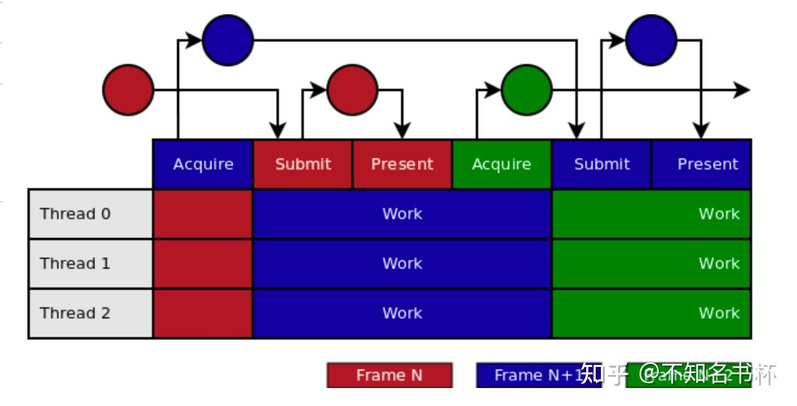

# 理解Vulkan 命令缓冲区(Command Buffer)

## 前言

这里是记录笔者在学习Vulkan中Command Buffer概念中的一些总结希望能够帮助到也在学习Vulkan的同学们，如果发现有讲的不对的地方请多多指正。

本文中会出现如下概念：

- Command Buffer
- Secondary Command Buffer

如果还想了解Vulkan的其他概念，可以看看笔者的Vulkan文章汇总。

[不知名书杯：Vulkan文章汇总169 赞同 · 7 评论文章](https://zhuanlan.zhihu.com/p/616082929)

## 什么是Command Buffer？

OpenGL的状态和绘制命令通常是即时的，而对于Vulkan来说这些操作大多是延迟的。因为Vulkan通过Command Buffer完成Record Command的操作。这些Commnad之后会通过Command Buffer被提交到Queue再被提交到GPU中执行。需要被Record的Command包括将Pipeline和DescriptorSet绑定到Command Buffer的命令、修改Dynamic State、以及DrawCall相关的Command(用于图形渲染),Dispatch的命令(用于计算)、执行Secondary Command Buffer的(仅用于Primary Command Buffer)、复制Buffer和Image的Command以及其他VkCmdXXXX所有的调用如下图所示。


这样做的好处是，当准备告诉Vulkan我们想要做什么的时候，所有的Command都会一起提交并且在发送给GPU之前会由[驱动程序](https://zhida.zhihu.com/search?content_id=226106488&content_type=Article&match_order=1&q=驱动程序&zhida_source=entity)进行小规模的翻译和优化。Vulkan可以更有效地处理这些Command。并且Command Buffer是支持多线程操作的，每一个线程都可以使用Commnad Buffer来Record Command。

## 为什么设计出Command Buffer？

为什么要抛弃OpenGL的即时[命令模式](https://zhida.zhihu.com/search?content_id=226106488&content_type=Article&match_order=1&q=命令模式&zhida_source=entity)，而是改用了Command Buffer来完成Record Command的操作，实际上就是延迟了Command的执行。首要的问题是OpenGL对于多线程模式并不友好并且对于CPU何时提交命令给GPU没有精确的控制，而且驱动程序要对命令流使用的内存以及提交点进行最佳管理。并且传统图形API都包含一个Context概念。Context包括当前Pipeline中的所有状态包括Shader以及Render Target等。在OpenGL中Context和单一线程是绑定的，所有需要作用于Context的操作都只能在单一线程上进行。如下所示，可以看到只有一个线程在完成CPU侧的渲染前的处理(渲染状态设置，DrawCall提交等等)，其他的线程都在看戏这造成了CPU侧的瓶颈以及GPU占用率低下的问题。


所以Vulkan的[设计理念](https://zhida.zhihu.com/search?content_id=226106488&content_type=Article&match_order=1&q=设计理念&zhida_source=entity)首先就是对于多线程友好，充分发挥多线程的优势以减少CPU侧的压力并且可以充分压榨GPU的性能，于是设计出了Command Buffer的概念并且抛弃了Context以及渲染线程等概念。在Vulkan中必须自己管理Command Buffer的内存并且每个线程都可以通过Command Buffer来完成Record Command操作，并以适当的粒度提交执行给Queue中让GPU开始执行避免浪费GPU的性能，如下图所示。但是单线程的Vulkan渲染器的速度仍然可以明显快于传统API，但通过利用系统中的许多核心进行Record Coomand，可以获得峰值效率和最小延迟，但这需要精细的[内存管理](https://zhida.zhihu.com/search?content_id=226106488&content_type=Article&match_order=1&q=内存管理&zhida_source=entity)。


简单来说Vulkan极大的解放了CPU侧的压力，这对于很多面临CPU侧瓶颈的游戏的性能有很大的提升，如果游戏本身是GPU的瓶颈则并无太大提升(不过也可以通过精细的内存控制以及同步来提高整体效率)。尤其是在复杂场景中可以并行生成渲染任务并且记录在各自线程中的Command Buffer中而且不需要线程之间的任何同步。可以同时将其提交给Queue去让GPU执行。这样的模式达到了计算资源利用的最大化，多个CPU都参与了场景的渲染，并且有大量的渲染任务同时递交给GPU去执行，最大化了GPU的吞吐量。这是整体效率的提升。

### 缺点

这样的设计让Vulkan有了更加干净的线程模型以及相比于其他传统图形API的CPU侧压力的解放。但是同样让开发者挠挠了头，现在资源内存管理以及[线程同步](https://zhida.zhihu.com/search?content_id=226106488&content_type=Article&match_order=1&q=线程同步&zhida_source=entity)成为Vulkan开发者的梦魇。虽然这可以让Vulkan实现高度的控制和微调，但是同样在不当的处理下变成一种负优化。对于任何开发者都是不小的挑战。并且需要注意如果是是GPU侧的瓶颈，很难从Vulkan中获得收益。

## 创建Command Buffer

### 创建Command Pool

在Vulkan中Command Buffer是通过Command Pool来分配的。但Command Pool是一个不透明的对象，由它来分配Command Buffer从而来实现在多个Command Buffer中摊平资源创建的成本。Command Pool是外部同步的这意味着一个Command Pool不能在多个线程中同时使用。这包括从Pool中分配的任何Command Buffer的使用以及分配、释放和重置Command Pool/Buffer本身的操作。

创建Command Pool需要填充VkCommandPoolCreateInfo结构体，并通过调用vkCreateCommandPool来创建真正的Command Pool。

- queueFamilyIndex字段指定一个Queue Family。

- flags字段是VkCommandPoolCreateFlagBits值，分别如下：

- - VK_COMMAND_POOL_CREATE_TRANSIENT_BIT 指定从Pool中分配的Command Buffer将是短暂的，这意味着它们将在相对较短的时间内被重置或释放。这个标志可以被用来控制Pool的[内存分配](https://zhida.zhihu.com/search?content_id=226106488&content_type=Article&match_order=1&q=内存分配&zhida_source=entity)。
  - VK_COMMAND_POOL_CREATE_RESET_COMMAND_BUFFER_BIT允许从Pool中分配的任何Command Buffer被单独重置到Inital状态，可以通过调用vkResetCommandBuffer或者调用vkBeginCommandBuffer时的隐式重置。如果在一个Pool上没有设置这个flag，那么对于从该Pool中分配的任何Command Buffer都不能调用vkResetCommandBuffer。
  - VK_COMMAND_POOL_CREATE_PROTECTED_BIT 指定从Pool中分配的Command Buffer是受保护的Command Buffer。

```cpp
typedef struct VkCommandPoolCreateInfo {
    VkStructureType             sType;
    const void*                 pNext;
    VkCommandPoolCreateFlags    flags;
    uint32_t                    queueFamilyIndex;
} VkCommandPoolCreateInfo;
```


### 分配Command Buffer

在创建Command Pool之后，就可以开始着手创建Command Buffer啦，来填充VkCommandBufferAllocateInfo这个结构体吧。

- commandPool字段是指定用于分配该Command Buffer的Command Pool。

- level字段是一个VkCommandBufferLevel值，指定Command Buffer的级别。

- - VK_COMMAND_BUFFER_LEVEL_PRIMARY指定一个Primary Command Buffer。
  - VK_COMMAND_BUFFER_LEVEL_SECONDARY指定一个Secondary Command Buffer。

- commandBufferCount字段是指定要从Pool中分配的Command Buffer的数量。

```cpp
typedef struct VkCommandBufferAllocateInfo {
    VkStructureType         sType;
    const void*             pNext;
    VkCommandPool           commandPool;
    VkCommandBufferLevel    level;
    uint32_t                commandBufferCount;
} VkCommandBufferAllocateInfo;
```

填充完该结构体之后可以通过vkAllocateCommandBuffers来分配Command Buffer。并且vkAllocateCommandBuffers可以一次性分配多个Command Buffer。如果这些Command Buffer其中任何一个分配失败，那么之前已经创建成功的Command Buffer也会被释放掉，将pCommandBuffers数组的所有元素设置为NULL并返回错误。


整体流程图如下：


## 使用Command Buffer

在上面已经完成了Command Buffer创建，那么现在来看看怎么使用Command Buffer来完成Record Command吧。

### Record Command

在这里可以通过vkBeginCommandBuffer方法来让Command Buffer准备好Record Command。在这里同样需要填充该结构体。

- flags字段是一个VkCommandBufferUsageFlagBits类型用于指定Command Buffer的使用行为。

- - VK_COMMAND_BUFFER_USAGE_ONE_TIME_SUBMIT_BIT指定Command Buffer的每个Record Command只会提交一次，不会去复用其中任何Command，在每次提交之间Command Buffer将被重置并再次进入Recording状态。
  - VK_COMMAND_BUFFER_USAGE_RENDER_PASS_CONTINUE_BIT指定其中的Secondary Command Buffer被认为是完全在一个RenderPass内。如果这是一个Primary Command Buffer那么这个将会被忽略。
  - VK_COMMAND_BUFFER_USAGE_SIMULTANEOUS_USE_BIT指定一个Command Buffer在Pending状态时可以重新提交给队列，并记录到多个Primary Command Buffer。

- pInitanceInfo是一个指向VkCommandBufferInheritanceInfo结构的指针，如果Command Buffer是一个Secondary Command Buffer则需要使用它。如果这是一个Primary Command Buffer那么这个值将被忽略。后续将会介绍Secondary Command Buffer。

如果Command Buffer处于Inital或Executable状态，并且Command Buffer是从设置了VK_COMMAND_POOL_CREATE_RESET_COMMAND_BUFFER_BIT标志的Command Pool中分配的，那么vkBeginCommandBuffer会隐式重置Command Buffer，其行为就像在没有设置VK_COMMAND_BUFFER_RESET_RELEASE_RESOURCES_BIT的情况下调用vkResetCommandBuffer。在隐式重置后Command Buffer被移到Recording状态。

```cpp
typedef struct VkCommandBufferBeginInfo {
    VkStructureType                          sType;
    const void*                              pNext;
    VkCommandBufferUsageFlags                flags;
    const VkCommandBufferInheritanceInfo*    pInheritanceInfo;
} VkCommandBufferBeginInfo;
```


在调用vkBeginCommandBuffer之后并且Record Command完毕之后便可以结束这个Record，在Vulkan中可以通过调用vkEndCommandBuffer来代表完成Record。整体流程如下图所示，在调用vkBeginCommandBuffer之后可以调用VkCmdXXXX等各种命令。均会被该Command Buffer记录下来。


### Submit Command

结束Command Buffer的Record Command之后，需要将Command Buffer中的命令提交到Queue当中去执行,在这里可以先补充一下Queue的相关前置知识。

### Queue

Queue通常代表一个GPU线程，GPU执行的就是提交到Queues中的工作。物理设备中Queue可能不止一个，每一个Queue都被包含在Queue Families中。Queue Families是一个有相同功能的Queue的集合，但是一个物理设备中可以存在多个Queue Families，不同的Queue Families有不同的特性。相同Queue Families中的Queues所有功能都相同并且可以并行运行，但是会有一个优先级的问题，这个需要慎重考虑(优先级较低的Queue可能会等待很长时间都不会处理)。不同的Queue Families主要分为以下几类(通过VkQueueFlagBits来分类)：

- VK_QUEUE_GRAPHICS_BIT代表其中的Queue都支持图形操作。
- VK_QUEUE_COMPUTE_BIT指代表其中的Queue都支持计算操作。
- VK_QUEUE_TRANSFER_BIT指代表其中的Queue都支持传输操作。
- VK_QUEUE_TRANSFER_BIT指代表其中的Queue都支持稀疏内存管理操作。
- VK_QUEUE_VIDEO_DECODE_BIT_KHR指代表其中的Queue都支持视频解码操作。
- VK_QUEUE_VIDEO_ENCODE_BIT_KHR指代表其中的Queue都支持[视频编码](https://zhida.zhihu.com/search?content_id=226106488&content_type=Article&match_order=1&q=视频编码&zhida_source=entity)操作。

在这里大部分的情况都只需要一个Queue就可以满足需求，Queue基本上是 "提交工作 "和 "等待空闲”的状态。一般来说Command Buffer就会被提交到Queue。Queue再将Command提交到GPU中去执行。

### Queue Submit

在这里通过vkQueueSubmit来完成Command Buffer的提交，需要填充VkSubmitInfo该结构体。

- waitSemaphoreCount是在提交Command Buffer之前要等待的Semaphore的数量。
- pWaitSemaphores是一个指向VkSemaphore数组的指针，在这个Command Buffer前要等待该其中的Semaphore。如果提供了Semaphore则定义了一个等待该Semaphore信号操作。
- pWaitDstageMask是一个指向管道阶段数组的指针，在这个数组中每个相应的semaphore等待将发生。
- commandBufferCount是要在批处理中执行的Command Buffer的数量。
- pCommandBuffers是一个指向在批处理中执行的VkCommandBuffer数组的指针。
- signalSemaphoreCount是在pCommandBuffers中指定的命令执行完毕后，要发出信号的semaphores的数量。
- pSignalSemaphores是一个指向VkSemaphore数组的指针，当这个Command Buffer完成执行时将对其发出信号。如果提供了Semaphore则定义了一个Semaphore发信号的操作。

```cpp
typedef struct VkSubmitInfo {
    VkStructureType                sType;
    const void*                    pNext;
    uint32_t                       waitSemaphoreCount;
    const VkSemaphore*             pWaitSemaphores;
    const VkPipelineStageFlags*    pWaitDstStageMask;
    uint32_t                       commandBufferCount;
    const VkCommandBuffer*         pCommandBuffers;
    uint32_t                       signalSemaphoreCount;
    const VkSemaphore*             pSignalSemaphores;
} VkSubmitInfo;
```


在这里被提交的Command Buffer在pCommandBuffers中出现的顺序被用来确定提交顺序，因此所有尊重它的隐式排序保证但是这个只是保证开始的顺序，结束执行的顺序不保证。除了这些隐式排序保证和任何显式[同步原语](https://zhida.zhihu.com/search?content_id=226106488&content_type=Article&match_order=1&q=同步原语&zhida_source=entity)外，这些Command Buffer可能会重叠或以其他方式不按顺序执行(也就是乱序执行)。

接下来看到vkQueueSubmit函数吧，这里同样提供了submitCount和pSubmits参数，可以一次性提交多个VkSubmitInfo结构体。vkQueueSubmit是一个很耗时的操作，所以在这里尽量选择一次性提交，避免多次调用vkQueueSubmit。

```cpp
VkResult vkQueueSubmit(
    VkQueue                                     queue,
    uint32_t                                    submitCount,
    const VkSubmitInfo*                         pSubmits,
    VkFence                                     fence);
```

在这里可以看到VkFence和VkSemaphore这两个对象，这都是Vulkan中的同步原语如下图所示，在这里就只先简单介绍Semaphore和Fence。


从图中可以看出Semaphores主要用于Queue之间的同步工作，或在向单个Queue提交的粗粒度文件之间的同步工作(也就是GPU之中的同步)。而Fence用来同步Device和Hosts之间的工作，也就是CPU和GPU之间的同步。在VkSubmitInfo中看到了pWaitSemaphores以及pSignalSemaphores字段。pWaitSemaphores字段指定了这次Submit需要等待这些Semaphores发出信号之后才可执行。则pSignalSemaphores则制定了如果该批次完成了Command Buffer命令执行之后，则这些Semaphores发出信号。在这里主要通过Semaphores来显示控制Command Buffer的执行顺序。

在这里vkQueueSubmit还提供一个VkFence的位置，这个Fence可以处理一个多线程录制的问题。在CPU Record Command的过程中会被这个Fence所阻拦。这个vkQueueSubmit的Fence触发时机是在所有的绘制命令全部执行完毕，也就是渲染结果已经出来了之后将Fence放开。则这个线段可以重新开始Record Command，避免一个正在被执行的Command Buffer还被线程用于Record Command。

## Secondary Command Buffer

如果需要创建一个Secondary Command Buffer首先需要在创建Command Buffer的时候需要将level字段设置为VK_COMMAND_BUFFER_LEVEL_SECONDARY代表需要创建的是一个Secondary Command Buffer。

如何使用一个Secondary Command Buffer呢？首先是在Secondary Command Buffer的vkBeginCommandBuffer调用中flags需要设置为VK_COMMAND_BUFFER_USAGE_RENDER_PASS_CONTINUE_BIT，并且需要填充VkCommandBufferInheritanceInfo该结构。这个结构是用于指定将从Primary Command Buffer继承的任何状态。

```cpp
typedef struct VkCommandBufferInheritanceInfo {
    VkStructureType                  sType;
    const void*                      pNext;
    VkRenderPass                     renderPass;
    uint32_t                         subpass;
    VkFramebuffer                    framebuffer;
    VkBool32                         occlusionQueryEnable;
    VkQueryControlFlags              queryFlags;
    VkQueryPipelineStatisticFlags    pipelineStatistics;
} VkCommandBufferInheritanceInfo;
```

在Secondary Command Buffer完成了Record Command之后，可以开启Primary Command Buffer并开始Record Command，并且在vkCmdBeginRenderPass的时候传入VkSubpassContents字段为VK_SUBPASS_CONTENTS_SECONDARY_COMMAND_BUFFERS，这个字段指定内容被记录在Secondary Command Buffer中，将从Primary Command Buffer中调用，并且vkCmdExecuteCommands是Command Buffer上的唯一有效命令，直到vkCmdNextSubpass或vkCmdEndRenderPass。

之后可以通过vkCmdExecuteCommands将Secondary Command Buffer塞入Primary Command Buffer中。之后当Primary Command Buffer被提交到Queue被GPU其中的Secondary Command Buffer同样会被执行。如下图所示：


## Command Buffer生命周期

在了解Command Buffer创建和使用之后，每个Command Buffer都会在某个操作后有着不同的状态，这些状态如下所示：

- Inital: 当一个Command Buffer刚被被分配时它处于Inital状态。一些操作能够将一个Command Buffer(或一组Command Buffer)从Executable、Recording或Invalid状态中的任何一个重新设置到这个状态。处于Inital状态的Command Buffer只能被移动到Recording状态或者被释放。在调用vkBeginCommandBuffer会转换到Recording状态
- Recording**:** vkBeginCommandBuffer将Comma Buffer的状态从Inital状态变为Recording状态。在Recording状态就可以使用vkCmdXXXX命令来记录到Command Buffer。
- Executable: vkEndCommandBuffer调用后Command Buffer会从Recording状态移到Executable状态。那么该Command Buffer可以被提交、重置或记录到另一个Command Buffer。
- Pending: 在完成vkQueueSubmit之后Command Buffer会转换到Pending状态。在Pending状态下不得以任何方式试图修改Command Buffer，因为设备正在处理其中的命令。一旦Command Buffer的执行完毕,Command Buffer要么恢复到Executable状态，如果该Command Buffer是通过VK_COMMAND_BUFFER_USAGE_ONE_TIME_SUBMIT_BIT开始Record的，它将移动到Invalid状态。应使用同步命令来检测何时发生这种情况。
- Invalid: 修改或删除记录在Command Buffer中的资源等的一些操作，将使该Command Buffer的状态过渡到Invalid状态。Invalid状态的Command Buffer只能被重置或释放。


重置Command Buffer是一种操作，它抛弃了之前Record的任何Command，并将Command Buffer置于Inital状态。重置是作为vkResetCommandBuffer或vkResetCommandPool的结果发生的，或者被vkBeginCommandBuffer隐式重置(并且后续将Command Buffer置于Recording状态)。

Secondary Command Buffer可以通过vkCmdExecuteCommands记录到Primary Command Buffer内。这将两个Command Buffer的生命周期联系在一起，如果Primary Command Buffer被提交到Queue中，全部Command Buffer(包括Secondary Command Buffer)都会移动到Pending状态。一旦Primary Command Buffer执行完成，在其中的任何Secondary Command Buffer也会完成执行。在每个Command Buffer的所有执行完成后，它们各自移动到其适当的完成状态（如上所述，移动到Executable状态或Invalid状态）。

如果一个Secondary Command Buffer移动到Invalid状态或者Inital状态，那么它所记录的Primary Command Buffer所有都移动到Invalid状态。一个Primary Command Buffer移动到任何其他状态并不影响记录在其中的一个Secondary Command Buffer的状态。并且重置或释放一个Primary Command Buffer会删除与所有录入该[缓冲区](https://zhida.zhihu.com/search?content_id=226106488&content_type=Article&match_order=1&q=缓冲区&zhida_source=entity)的Secondary Command Buffer的生命周期联系。

## Command Buffer使用建议

### Command Buffer 分配与管理

### Allocate and free

Command Buffer都是从Command Pool分配出来的。既然是分配出来的那肯定也可以手动释放。管理每一帧的Command Buffer的一个可能的方法是一旦Command Buffer被执行完毕后进入Invaild状态，就可以使用vkFreeCommandBuffers来释放。

如果Command Pool是在没有RESET_COMMAND_BUFFER_BIT标志的情况下创建的，Command Pool将不会自动回收被删除的Command Buffer的内存。然而这个标志将强制为池中的每个Command Buffer使用单独的内部分配器，与整个Pool重置相比这会增加CPU开销。

这是性能最差的管理Command Buffer的方法，因为它涉及到频繁分配和释放内存会导致大量CPU侧的开销。与其释放和重新分配Command Buffer所使用的内存，不如回收它来重新Record Command，这样更有效率。

### Reset Buffer

还有一种方式就是不释放Command Buffer而是通过vkResetCommandBuffer单独重置某个Command Buffer。并且Command Buffer就会保存其内存资源但是会清空其中Command，那么该Command Buffer就可以在Record Command时可以重复使用。但是注意需要将创建Command Pool参数中需要设置为VK_COMMAND_POOL_CREATE_RESET_COMMAND_BUFFER_BIT才可以通过vkResetCommandBuffer来单独重置一个Command Buffer。这样的方式就避免了上面的频繁的分配和释放Command Buffer导致的CPU侧开销的问题。但是频繁调用vkResetCommandBuffer比重置Command Pool更耗费性能。

### Reset Pool

可以通过vkResetCommandPool来重置整个Command Pool的操作。这样会自动重置它所分配的所有Command Buffer。这样可以让Pool重新使用分配给Command Buffer的内存可以降低CPU的开销。但是创建Pool的时候不要使用VK_COMMAND_POOL_CREATE_RESET_COMMAND_BUFFER_BIT，如果不设置该位，一些实现可能会对Pool使用一个大的分配器，可以减少内存管理的开销。

### Single Use

在这还有一个用法也就是通过VK_COMMAND_POOL_CREATE_TRANSIENT_BIT作为Command Pool的创建参数。这个参数指定从Pool中分配的Command Buffer将是短暂的，这意味着它们将在相对较短的时间内被重置或释放。这个标志可以被实现者用来控制Pool内的内存分配。并且在VkCommandBufferBeginInfo中使用VK_COMMAND_BUFFER_USAGE_ONE_TIME_SUBMIT_BIT指定Command Buffer只会被提交一次并且其中的Command不会被复用，在每次提交之间Command Buffer将被重置并再次记录。

### 对比结果


这是上面不同方案对比的结果。显然Reset Pool是简单又高效的方案。

### 多线程Record Command

首先Vulkan当中是鼓励使用多线程来完成Record Command的，这样能够大大减少CPU侧的压力，这也是Vulkan的优势之一。但是Command Buffer和Command Pool在多线程中使用是有限制的，首先就是Command Pool是外部同步的这意味着一个Command Pool不能在多个线程中同时使用。并且在一个Pool中分配出Command Buffer也不能用于多个线程同时来Record Command。因为当Command Buffer被提交到Queue后会进入Pending状态，GPU正在处理提交的命令，所以在这个状态下不得以任何方式试图修改Command Buffer的状态。因为这些原因那么每一个线程都会需要一个Command Pool来创建Command Buffer用于Record Command。总的来说一般程序中需要包含FrameNum*ThreadNum数量的Command Pool(其中FrameNum是帧的数量一般是2或者3，一帧在GPU执行另外一帧在Record Command，ThreadNum就是是可以并发来Record Command的线程数 )。如下图所示。


至于为啥要使用多个帧的问题，首先来看看单帧的情况，不同帧之间的工作没有重叠。因此即使是使用多线程中使用Command Buffer来Record Commmand，但是仍然有一定的时间让CPU线程闲置以等待渲染完成的信号才可以开始下一帧的工作。


当增加同时在运行的帧数时如下图所示。在向Queue提交当前帧的Command Buffer后立即开始Record下一帧的所需的Command。这里所有的同步都是用Semaphores完成的。vkAcquireNextImageKHR将在Swapchain图像准备好后向Semaphores发出信号，vkQueueSubmit将在处理任何命令前等待这个Semaphores，并在提交的命令完成后向另一个Semaphores发出信号。最后，vkQueuePresentKHR将把图像呈现给显示器，但在这样做之前，它会等待vkQueueSubmit的Semaphores发出的信号。这样将消除CPU侧的空转气泡，提高CPU效率。



那么当从一个线程使用Command Buffer开始Record Command时，该线程需要使用与当前帧和线程相关的一个Command Pool并分配Command Buffer接着开始Record Command。假设该Command Buffer没有在被多个帧之间使用，而且会等待Queue中的最后一帧完成执行来强制执行的，那么就可以释放为该帧分配的所有Command Buffer或者重置使用的Command Buffer或者是重置所有相关的Command Pool(简单高效)。

但是这样带来一个新的问题，那就是线程之间的[负载均衡](https://zhida.zhihu.com/search?content_id=226106488&content_type=Article&match_order=1&q=负载均衡&zhida_source=entity)问题。例如ShadowPass调用通常需要较少的状态设置和较少的命令。当与许多[任务调度](https://zhida.zhihu.com/search?content_id=226106488&content_type=Article&match_order=1&q=任务调度&zhida_source=entity)器产生的跨线程的有效随机工作负载分配相结合时，这可能导致所有Command Pool的大小都是被设置为最坏情况下的消耗。假如内存比较有限的情况下这种策略会存在问题，可以限制每个单独Pass[并行性](https://zhida.zhihu.com/search?content_id=226106488&content_type=Article&match_order=1&q=并行性&zhida_source=entity)，并根据什么类型的Pass选择对应Command Buffer/Pool来限制Command Pool的内存浪费。

还有就是渲染命令的数量来选择放入不同的Command Buffer也就是根据根据DrawCall的数量(如"<100"，"100-400"等等)和/或单个DrawCall的复杂性(仅Depth，gbuffer)来定义一个渲染命令类，每个线程都有的Command Pool和并且使用Allocate and free Command Buffer策略，就有可能为每个渲染命令类保留一个空闲列表，根据预期DrawCall的量来挑选使用哪个Command Buffer会导致更稳定的内存消耗。此外对于包含太少DrawCall的渲染命令类，在Record Command时值得减少并行性。例如有一个类有<100个DrawCall，与其在4核系统上把它分成4个记录作业，不如在一个线程一次性中记录它，因为这样可以减少Command Buffer内存管理和提交Command Buffer到Queue的开销。

### Command Buffer提交

通过多线程来Record Command会提高CPU侧的效率，但是由于状态不会跨Command Buffer重用。所以会造成有很多的Command Buffer同时需要被提交，Command Buffer中是通过vkQueueSubmit提交给Queue再被提交到GPU真正的被执行。但是vkQueueSubmit本身就是一个很耗时的操作。而且还有其他的调度限制，所以每次Command Buffer需要合理的大(保证足够多的命令)，以确保GPU在命令处理期间不会空闲。

一般来说Vulkan程序目标应该是每帧<10次提交(每次提交占GPU工作量的0.5ms或以上)，每帧<100个Command Buffer(每个Command Buffer占GPU工作量的0.1ms或以上)。这可能需要调整单个Pass的Record Command的并发限制，例如，如果一个ShadowPass其中包含有<100个 DrawCall，可能有必要将这个Pass的Record Command限制在一个线程上完成。此外对于需要较少DrawCall的Pass将它们与邻近的Pass合并为使用一个Command Buffer来Record更有利于性能。最后一帧中的提交数量越少越好。这需要与在帧中较早提交足够的GPU工作以增加CPU和GPU并行性相平衡，例如在该帧在Record其他部分的Command之前，提交所有用于Shadow渲染的Command Buffer可能是合理的，因为该Pass并不依赖其他资源(也就是RenderPass之间的并发执行)。

重要的是提交的数量是指在一帧中所有vkQueueSubmit调用中提交的VkSubmitInfo结构的数量，而不是vkQueueSubmit调用本身的数量。例如当提交 10 个Command Buffer时，使用一个提交10个Command Buffer的 VkSubmitInfo比使用10个每个有一个Command Buffer的 VkSubmitInfo 结构要有效率的多，即使在这两种情况下都是只执行一次vkQueueSubmit，但是提交的Command数量完全不同。从本质上讲VkSubmitInfo是GPU上的一个同步/调度单元，因为它有自己的一套Fence/Semaphores。

从这里可以看出在完成Record Command后多次提交一个Command Buffer变得不切实际。一般来说为部分场景预先录制Command Buffer的方法是适得其反的，因为它们会因为保持Command Buffer工作量大所需的低效删减而导致GPU负载过大。相反应用程序应该专注于改善CPU上的线程和Draw Call提交成本。因此应该使用VK_COMMAND_BUFFER_USAGE_ONE_TIME_SUBMIT_BIT来确保驱动程序可以自由生成不需要多次复用的命令。

### 使用Secondary Command Buffer

现在还有一个问题那就是假如一个RenderPass中包含大量的DrawCall时，也希望利用上多线程来完成这个RenderPass内的Record Command。这里有两种方案来完成这个操作。

- 多线程使用同一帧的Command Pool生成的的Primary Command Buffer来Record Command，然后使用vkQueueSubmit执行来一次性的提交所有的Primary Command Buffer(批处理提交以提高效率)。
- 多线程使用同一帧的Command Pool来创建Secondary Command Buffer并且分别各自Record Command，将RenderPass与VK_COMMAND_BUFFER_USAGE_RENDER_PASS_CONTINUE_BIT一起传递给vkBeginCommand，在Primary Command Buffer中使用带有VK_SUBPASS_CONTENTS_SECONDARY_COMMAND_BUFFERS的vkCmdBeginRenderPass，然后使用vkCmdExecuteCommand执行所有完成Record Command的Secondary Command Buffer。

虽然在IMR架构GPU上，第一种方法是可行的而且在CPU上管理同步也比较容易，但在使用Tile Base架构GPU上使用第二种方法是至关重要的。在Tile Base架构中上使用第一种方法需要将渲染结果放入内存中，并在每个Command Buffer之间从内存加载回来，这对Tile Base架构的性能来说是灾难性的。并且第一种方案在IMR中也需要频繁的开始和结束同一个RenderPass实例，这同样是浪费性能的。使用Secondary Command Buffer的方式如下图所示


其实还有一个Secondary Command Buffer的应用场景，理想情况下你可以在一个RenderPass内完成所有的渲染，但是在某些情况下，不同的阶段不能在同一个RenderPass中进行。这个情况可以使用Secondary Command Buffer来完成没有依赖关系之间RenderPass的并行渲染来提高效率。当然假如说两个RenderPass也有依赖关系的时候(比如ShadowMap的生成和Forward渲染需要用到该ShadowMap)，同样可以使用Secondary Command Buffer来完成加速，但是其中的同步不能通过VkSubpassDependency来完成因为这是两个独立的RenderPass，而是要通过其他的方式来同步比如VkImageMemoryBarrier。

Secondary Command Buffer可以被单独Record Command和存储，假如说有一些可以复用的Command可以放在Secondary Command Buffer来制作半永久或永久Command Buffer避免重复Record浪费CPU性能。并且Secondary Command Buffer可以将复杂的渲染任务可以被分解成更小、更容易管理的部分。这可以使代码更加模块化，更容易长期维护。

### 注意事项

需要注意使用Secondary Command Buffer数量问题。在分割一个RenderPass中的所有DrawCall的也要注意负载均衡，不要创建过多的Secondary Command Buffer一是内存损耗二是假如一次提交的Command不够多同样会导致GPU占用率不高，让GPU处于空闲状态浪费了性能。在任何情况下超过CPU的并行度水平，即使用比线程更多的Command Buffer是没有好处的。同样地线程多于Command Buffer也会对性能产生影响。要注意一个平衡度。

## Q&A

### Secondary Command Buffer是鸡肋？

对于现在CPU和GPU来说是鸡肋的。可以来讨论一下Secondary Command Buffer的使用场景，再看看是不是鸡肋。

第一个是拆分一个RenderPass中过多DrawCall的作用，那么是问题来了多少个DrawCall情况下来拆分能得到性能收益？起码得100个DrawCall往上才可以有收益，并且这个DrawCall得十分稳定(摄像机转动一下就有可能有很多的DrawCall变动，动态变化)。 那么现在的场景真的有这个多DrawCall吗？如果有这么多的DrawCall的话，一般我们也会使用Indirect Draw来减少大量的DrawCall。所以说在桌面级GPU中Secondary Command Buffer的使用场景是相当的苛刻的。那么移动端呢？那还是有一定的意义的，第一是Indirect Draw在移动端的使用现在还不多的。还有的就是拆分DrawCall在Tile Base架构中的带宽的优化等等，在移动端可能还是有一定的应用场景。

第二个并行多RenderPass的渲染，首先是在渲染中能够并行无依赖的RenderPass能够有多少？如果是两个有一定的依赖的关系的RenderPass通过Secondary Command Buffer来[并行执行](https://zhida.zhihu.com/search?content_id=226106488&content_type=Article&match_order=1&q=并行执行&zhida_source=entity)，那么还要通过手动同步来保证依赖关系的正确。这个同步损耗的性能和并行能够得到收益还需要进行一定的比较，这个很难说有什么很大的收益，还凭空增加了同步的复杂度。

## 总结

在本文中提到了关于Command Buffer的基本概念以及Command Buffer的由来，也同样了解Command Buffer的使用流程以及使用原则，这是Vulkan对于多线程友好的基础设施。可以帮助大伙去Vulkan是怎么利用多线程来解放CPU侧的压力，当然不使用多线程同样可以利用Vulkan开放的内存控制能力来获取相对于传统图形API更好的性能。希望可以帮到和我一样的Vulkan苦手。

## References

[Writing an efficient Vulkan rendererzeux.io/2020/02/27/writing-an-efficient-vulkan-renderer/](https://zeux.io/2020/02/27/writing-an-efficient-vulkan-renderer/)

[What are the advantages of secondary command buffers?community.khronos.org/t/what-are-the-advantages-of-secondary-command-buffers/6977](https://community.khronos.org/t/what-are-the-advantages-of-secondary-command-buffers/6977)

[Tips and Tricks: Vulkan Dos and Don’ts | NVIDIA Technical Blogdeveloper.nvidia.com/blog/vulkan-dos-donts/](https://developer.nvidia.com/blog/vulkan-dos-donts/)

[Multi-Threading in Vulkancommunity.arm.com/arm-community-blogs/b/graphics-gaming-and-vr-blog/posts/multi-threading-in-vulkan](https://community.arm.com/arm-community-blogs/b/graphics-gaming-and-vr-blog/posts/multi-threading-in-vulkan)

[Simon.Miao：Vulkan 多线程渲染119 赞同 · 3 评论文章](https://zhuanlan.zhihu.com/p/165341403)

[Engaging the Voyage to Vulkandeveloper.nvidia.com/engaging-voyage-vulkan](https://developer.nvidia.com/engaging-voyage-vulkan)

[Vulkan-Samples/README.md at main · KhronosGroup/Vulkan-Samplesgithub.com/KhronosGroup/Vulkan-Samples/blob/main/samples/performance/command_buffer_usage/README.md](https://github.com/KhronosGroup/Vulkan-Samples/blob/main/samples/performance/command_buffer_usage/README.md)

[Vulkan-Samples/README.md at main · KhronosGroup/Vulkan-Samplesgithub.com/KhronosGroup/Vulkan-Samples/blob/main/samples/performance/multithreading_render_passes/README.md](https://github.com/KhronosGroup/Vulkan-Samples/blob/main/samples/performance/multithreading_render_passes/README.md)

