# 理解Vulkan同步(Synchronization)

前言

本篇文章是针对Vulkan中的同步概念以及各种同步原语的学习和总结，篇幅比较长。希望能够帮助大伙理解Vulkan的同步概念，讲得不对的地方也请多多指正。本文涉及到的概念如下所示：

- Pipeline Stage
- Command and Operation
- Command Buffer and Queue
- Semaphore
- Fence
- Pipeline Barrier
- Event
- SubPass Dependency
- Timeline Semaphore

## 为什么需要同步(**Synchronization**)?

### 执行模型差异

对于之前传统图形API(比如OpenGL)，OpenGL是一种同步(Synchronous)模型去执行的，这意味着 API 调用必须表现得好像所有先前的API调用都已被处理。实际上没有任何GPU是以[同步模型](https://zhida.zhihu.com/search?content_id=227039634&content_type=Article&match_order=1&q=同步模型&zhida_source=entity)的方式去执行Command而是全部都是异步执行的。同步模型是由驱动程序维护的精心制作的假象，厚重的驱动程序在为你负重前行。为了保持这种错觉，驱动程序必须跟踪Queue中的每个渲染Command读取或写入了哪些资源确保所有Command以合法顺序运行以避免渲染结果错乱，并确保需要数据资源的API调用被阻塞并等待资源是安全可用才可继续运行。

那么这种同步模型带来了什么问题呢？第一是某些耗时的操作触发时机并不稳定并且全部由驱动来确定，比如当切换了一个Pipeline时触发一个耗时的Shader编译操作或者加载资源等等，这些操作什么时候会去做，是不是已经做完了？这些对于开发者来说都一无所知并且全部由驱动决定。简单来说就是开发者无法精细的控制当前渲染过程中的所有状态，虽然每个图形API提供了获取当前状态接口，但几乎所有的官方文档中都建议不要频繁调用这些接口以避免由于获取状态导致额外的调用开销。可能造成的结果就是CPU卡顿，但是却不知道卡顿是发生在什么时候，可能会发现切换一个Pipeline或者是加载一个资源卡顿就出现了。并且由于每个厂商的GPU处理这些工作的方式都不一样，在不同的GPU上可能会有不同的表现，想专门优化的话都会被这些拦路虎(黑盒)拦住而无从下手。

Vulkan使用异步(ASynchronous)渲染模型，首先是符合GPU的工作方式的。Vulkan通过Command Buffer来Record Commmand之后就塞入Queue，使用显式调度依赖关系来控制渲染任务执行顺序以及CPU和GPU之间的同步以及[依赖关系管理](https://zhida.zhihu.com/search?content_id=227039634&content_type=Article&match_order=1&q=依赖关系管理&zhida_source=entity)等，通过精心调控的同步可以提高渲染Command执行的整体并行度。 减少Pipeline的气泡并提高整体性能。并且结合了之前的关于提前创建Pipeline对象以并绑定。在渲染时可以切换不同的Pipeline而只需要很小的开销而无需像传统API那样校验Pipeline状态有效性以及动态合并一些状态，从而降低了Draw Call开销，并且可以大幅增加每帧可以调用的DrawCall上限。

### 内存模型差异

传统图形API(比如OpenGL)使用Client-Server内存模型。该模型明确划分了可在客户端(CPU)和服务器(GPU)上可以访问的资源，并提供了在两者之间移动数据的函数。这有两个主要的副作用：首先开发者不能直接分配或管理GPU端资源的内存。驱动程序将使用内部的内存分配器单独管理所有的GPU资源，并且驱动程序不知道任何可以利用来降低内存成本的上层信息。其次在CPU和GPU之间同步资源是有代价的，特别是在API的同步渲染模型和GPU异步处理现实之间存在冲突的情况下。 Vulkan是为现代GPU设计的，并假定CPU和GPU可见的内存设备之间存在某种程度的硬件支持的内存一致性。这使得API能够让应用程序更直接地控制内存资源比如分配/更新数据。对内存一致性的支持允许Buffer在应用[地址空间](https://zhida.zhihu.com/search?content_id=227039634&content_type=Article&match_order=1&q=地址空间&zhida_source=entity)中保持持久的映射，避免了传统图形API为注入手动一致性操作而需要的[连续映射](https://zhida.zhihu.com/search?content_id=227039634&content_type=Article&match_order=1&q=连续映射&zhida_source=entity)-解映射周期。这些更改的影响是减少驱动程序的CPU开销并让开发者更好地控制内存管理。并且可以进一步减少CPU负载，例如通过将具有相同生命周期的对象分组到一个分配中并跟踪它，而不是单独跟踪它们。

传统的图形API还有一个问题存在，那就是传统图形API的逻辑资源与支持它的物理内存紧密结合起来。这在使用上非常简单，但意味着很多中间存储(例如FrameBuffer的Attachment)只用于一个帧内。而Vulkan将资源的概念如Image或者Buffer与支持它的物理内存分开。这使得在渲染过程中的不同时间节点上为多个不同的资源重复使用相同的物理内存成为可能(也就是Memory Alias)。

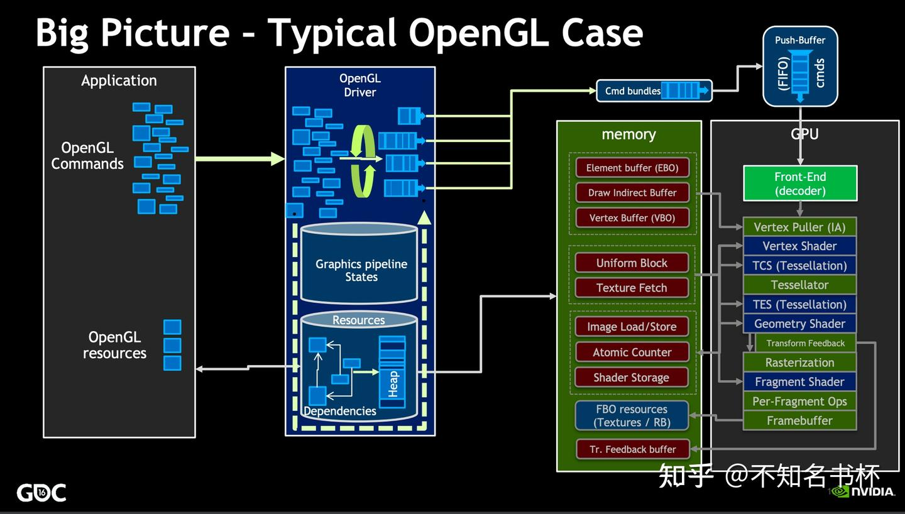

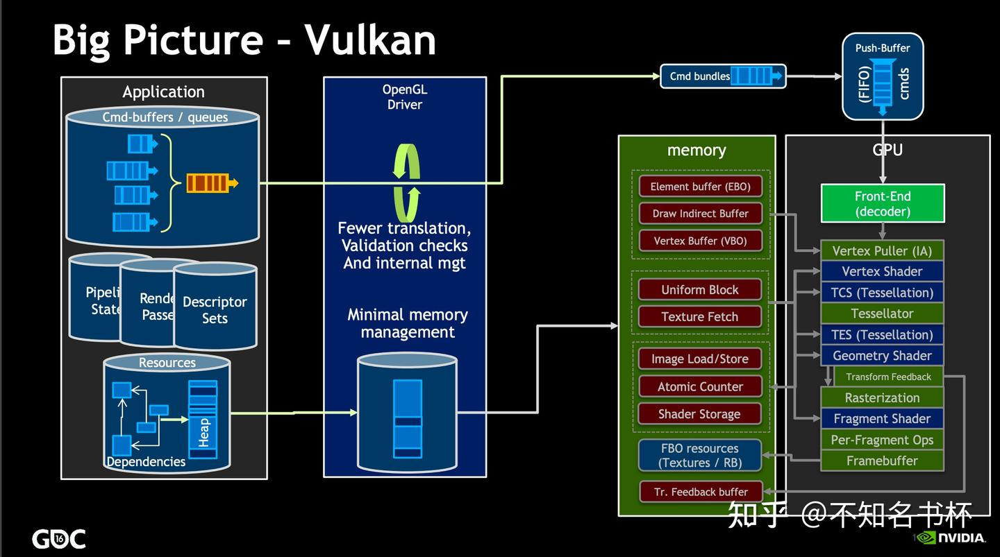

### 同步做了什么？

既然在上面提到了传统和现代图形API在执行模型和内存模型上的差异，显然现代图形API对于内存模型和执行模型的改变都会带来性能上的提升，更加符合GPU的工作模式，那么这些好处的代价是什么？就是原本在驱动程序内部小心翼翼的维护的执行顺序和内存资源的同步都没啦(同步在传统图形API也一直都有，只不过同步都在驱动程序内搞定对开发者并无负担)，这是因为驱动程序无法了解全部的渲染流程，所以只能根据之前的设置过的状态以及传入的资源等来做一些启发式的同步操作，这增加了驱动程序的复杂度(驱动程序负重前行的来源之一)，而且很难通过一些通用的[同步处理](https://zhida.zhihu.com/search?content_id=227039634&content_type=Article&match_order=1&q=同步处理&zhida_source=entity)来面对各种不同的渲染逻辑。对于某些渲染逻辑来说，驱动程序可能做的还是负优化(驱动程序让你负重前行)很难做到同步的极致的优化。但是到了Vulkan中现在所有的同步都要由开发者自己来完成并且开发者对于所有的渲染逻辑应该是已知并且可以做更加合理的同步操作来提高性能。所有Command的执行顺序几乎没有隐含的保证都需要明确指定。内存依赖和其他优化也是明确管理的。

Vulkan可以提供开发者对整个渲染流程更加精细控制的能力，并且Vulkan对于多线程更好的支持可以充分发挥CPU多核的能力使得可以多线程录制减少CPU侧瓶颈并且可以提高GPU的占用率。那么和并行与之而来的就是同步。想要掌握现代图形API的精髓就必须要理解同步和用好同步(不会同步寸步难行啊)，这是提高整体性能的关键点，比如GPU和CPU可以独立运行当前帧和下一帧的各种片段和顶点操作。通过明确哪些操作需要相互等待，哪些操作不需要等待，Vulkan可以以最大的效率和最小的等待时间渲染场景。通过CPU和GPU之间的协作可以榨干GPU以获取最大的性能。关键是要确保任何[并行任务](https://zhida.zhihu.com/search?content_id=227039634&content_type=Article&match_order=1&q=并行任务&zhida_source=entity)只在需要时才等待，而且只等待必要的步骤和时间。这就是同步的作用。

同步是很复杂的，首先同步和 GPU 硬件架构直接相关与多核 CPU 下的[多线程编程](https://zhida.zhihu.com/search?content_id=227039634&content_type=Article&match_order=1&q=多线程编程&zhida_source=entity)的[线程同步](https://zhida.zhihu.com/search?content_id=227039634&content_type=Article&match_order=1&q=线程同步&zhida_source=entity)类似，同步本质上是GPU的并行机制在软件层面的体现，需要对 GPU 的并行机制甚至是硬件架构有一定的了解才能理解同步。另外一个原因是同步的使用相当的繁琐，在API的使用注意到每一个参数的设置协同，需要配合很多的[同步原语](https://zhida.zhihu.com/search?content_id=227039634&content_type=Article&match_order=2&q=同步原语&zhida_source=entity)的配合才能够顺利的执行下去，使用起来十分碎片化的，这也是让人学习现代图形API望而生畏的原因之一。

另外在Vulkan当中同步原语是所有现代图形API中种类最多的也是最繁琐的，分别有Fence/Semaphores/Event/Pipeline Barrier/Timeline/Subpass Dependency，并且各自同步的粒度和使用方式都不同，我们需要理解每种同步原语使用的最优场景是什么。同步是难于优化而且错误的使用同步反而会降低 GPU 的[并行性](https://zhida.zhihu.com/search?content_id=227039634&content_type=Article&match_order=1&q=并行性&zhida_source=entity)，增大渲染任务串行执行的概率，甚至会造成GPU停顿或者是Pipeline气泡这些都会严重降低 GPU 的性能，如果没有优化好同步在性能上甚至还不如使用传统图形API(毕竟驱动程序也不是吃素的)。所以如何使用和优化同步也是使用现代图形API开发者必须需要花时间去思考的。

## 基础概念补充

### Command Buffer

在这里先介绍Vulkan对于多线程支持的基础设施Command Buffer，所有的Command全部会通过Command Buffer来记录，在完成Record Command后将所有的Command Buffer提交给Queue后再被提交到GPU中执行。在Spec中被提交的Command会按提交顺序开始执行，但是什么时候完成是没有顺序保证的，但是实际上在GPU中的执行并非如此，不要被这个误导了。这只是Spec中方便他人理解而写成这样。除非是开发者自己手动设置的同步Command，否则所有的在Queue中Command的执行是没有顺序可言的。那在这里可以得出以下结论，在Command Buffer中所有的Command是[无序执行](https://zhida.zhihu.com/search?content_id=227039634&content_type=Article&match_order=1&q=无序执行&zhida_source=entity)并且整批提交到Queue中的Command Buffer也是无序执行。不同的Queue提交的Command同样也是无序执行。这也体现了GPU的工作方式都是异步并且[并行执行](https://zhida.zhihu.com/search?content_id=227039634&content_type=Article&match_order=1&q=并行执行&zhida_source=entity)。唯一的例外是：在[渲染流程](https://zhida.zhihu.com/search?content_id=227039634&content_type=Article&match_order=3&q=渲染流程&zhida_source=entity)内的关于Framebuffer操作是按顺序完成的。

### Queue

所有的Command最后还是要通过Queue给GPU来执行，但是在硬件上有着不同的种类Queue并能够支持不同的功能(比如图形/计算/传输等等)。所以可以利用这一点，创建多个Queue可以来完成Queue级别的并行，并且可以通过不同种类的Queue来做特殊操作，比如一边使用Computer Queue来进行数据处理，另外一边用Graphics Queue来完成渲染。如下图所示，这被称为[异步计算](https://zhida.zhihu.com/search?content_id=227039634&content_type=Article&match_order=1&q=异步计算&zhida_source=entity)可以提高GPU的占用率。

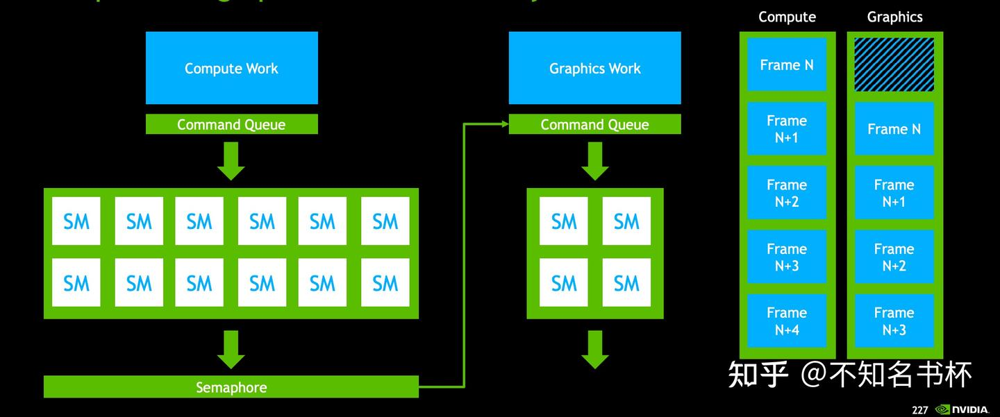

对于Transfer Queue也是一样，可以用Transfer Queue一边来Copy数据另外一边用Graphics Queue来完成渲染，这也就是[异步传输](https://zhida.zhihu.com/search?content_id=227039634&content_type=Article&match_order=1&q=异步传输&zhida_source=entity)。

### Command 和 Operation

在这里先介绍一下同步的基础概念比如Operation和Command等概念，这对于你理解Vulkan中同步的使用很有帮助(不然你会感觉再看天书结合Spec关于同步的内容本来就不讲人话)。

在Command Buffer中被Record的Command主要可以分为三种用途分别是Perform Actions/Set State/Perform Synchronizations。

- Perform Actions Command也被称为Action Command一般包含draw, dispatch, clear, copy, query/timestamp operations, begin/end subpass主要是有关DrawCall的操作。一些常见的Action Command是根据调用VkBeginCommandBuffer后的当前各种State来执行(通过Set State Command设置的)。执行Action Command所涉及的工作通常允许并行或乱序执行，但不能改变每个执行Action Command所要使用的状态。一般来说Action Command是会涉及到改变Framebuffer中的Attachment或者Read/Write Buffer或Image，或写入Query Pool的Command等Operation。
- Set State Command包含bind pipelines, descriptor sets, and buffers, set dynamic state, push constants, set render pass/[subpass](https://zhida.zhihu.com/search?content_id=227039634&content_type=Article&match_order=2&q=subpass&zhida_source=entity) state可以用来设置状态(资源绑定等等)。并且这个状态设置是累计的但是是以Command Buffer为单位。并且从VkBeginCommandBuffer开始，不同的Command Buffer之间状态设置不会互相影响。
- Perform Synchronization Command包括set/wait events, pipeline barrier, render pass/subpass dependencies，其实也就是同步Command。在这里只有Aciton Command需要同步操作。

在Vulkan中的Operation代表了在CPU、GPU或外部实体(如演示引擎)上执行的任意数量的工作。而Action Command会包含多个Operation。

同步Command通过同步作用域(synchronization scopes)为两组Operation之间引入了内存依赖和执行依赖(后面会讲到)。同步作用域定义了一个同步Command能够与哪些Operation建立执行依赖关系。任何不在同步Command的同步作用域中的Operation类型都不会被包括在所产生的依赖关系中。通过同步Command对于Operation的控制，那么同步Command就能够在在两组Action Command之间引入了明确的执行和内存依赖关系。这些依赖关系强制要求后一组某些Operation的执行发生在前一组的某些Operation执行之后以及某些Operation执行的内存访问的效果按顺序发生并且保证彼此内存可见。如果没有明确的依赖关系或隐含的排序保证，Action Command可能会重叠执行或乱序执行，也可能看不到彼此的内存访问导致的副作用导致脏数据等等。

另外同步Command来保证两组Action Command的是基于Command的Submission Order来工作的，Submission Order是Vulkan提供一个[隐式排序](https://zhida.zhihu.com/search?content_id=227039634&content_type=Article&match_order=1&q=隐式排序&zhida_source=entity)保证。确保提交Command的顺序是有意义的。赋予了Action Command和同步Command按顺序被Record并提交到单个Queue的意义。Command之间的显式和隐式排序保证都是以Submission Order有意义为前提的。这种顺序本身并不定义任何执行或内存依赖，同步Command和API中的其他顺序使用Submission Order来定义它们的使用范围。

执行依赖是对于两组Operation来说是第一组某个Operation必须在第二组某个Operation之前发生，更确切地说：

- 首先是第一组Operation为Ops1，第二组Operation为Ops2。
- Sync代表一个同步Command。Scope1st和Scope2nd是Sync的同步作用域。
- ScopedOps1是Ops1和Scope1st集合的交集，ScopedOps2是Ops2和Scope2st集合的交集

按照这个顺序提交Ops1、Sync和Ops2。执行依赖会保证其ScopedOps1比ScopedOps2先执行完毕。在这里你可能会这对这个交集的概念有一些疑惑，说人话也就是从一组Operation中挑选和同步作用域能够匹配上的一个Operation。大部分情况不希望(有时也不能)与之前提交的所有东西同步(并行度太低)，所以只选择一组Operation的一些子集，做一个类似[集合交集](https://zhida.zhihu.com/search?content_id=227039634&content_type=Article&match_order=1&q=集合交集&zhida_source=entity)的概念!

### Pipeline Stage

在Vulkan内定义了一组Operation，这些Operation作为逻辑上独立的步骤执行并且被称为Pipeline Stage。会执行的哪些Pipeline Stage取决于所使用的特定Command以及Record Command时的当前Command Buffer状态。而且针对不同的Command还会有这一些特定的Pipeline Stage，有些同步Command会包含Pipeline Stage参数将该Command的同步范围限制在这些Pipeline Stage内。这允许对Action Command所执行的Operation有确切的执行顺序和内存访问进行精细的控制，程序中的实现应该使用这些Pipeline Stage以避免不必要的停顿或Cache刷新。同样需要注意使用不当很有可能会出现Pipeline气泡影响执行效率。并且某些Pipeline Stage只在支持特定Operation的Queue上可用。

在这里就使用渲染Command来举例子，如下所示：

- TOP_OF_PIPE_BIT
- DRAW_INDIRECT_BIT
- VERTEX_INPUT_BIT
- VERTEX_SHADER_BIT
- TESSELLATION_CONTROL_SHADER_BIT
- TESSELLATION_EVALUATION_SHADER_BIT
- GEOMETRY_SHADER_BIT
- FRAGMENT_SHADER_BIT
- EARLY_FRAGMENT_TESTS_BIT
- LATE_FRAGMENT_TESTS_BIT
- COLOR_ATTACHMENT_OUTPUT_BIT
- TRANSFER_BIT
- COMPUTE_SHADER_BIT
- BOTTOM_OF_PIPE_BIT

请注意上面列举不一定是按照真正Command的执行顺序进行的，有些Pipeline Stage可以合并，有些Pipeline Stage可以缺失，但总的来说这些是一个渲染Command要经过的Pipeline Stage。简单来说Pipeline Stage为同步Command提供了更细粒度的支持。后面说到各种不同的同步原语以及Pipeline Barrier会着重讲到。

下面是使用Pipeline Stage来设置执行依赖的例子，在同步Command中设置同步作用域分别为VERTEX_SHADER_BIT和COMPUTE_SHADER_BIT。然后同步Command塞入在两组Action Command(比如两个Draw相关的命令)之间。能够保证的执行依赖如下所示：

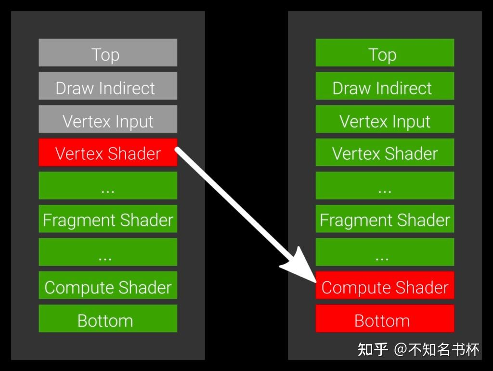

### 内存可见和内存可用

在GPU执行过程中有责任保证接下来访问的这块内存是保证有效的，也就是确保先前写入的数据对目标单元可见。简单介绍一下GPU Cache体系，平时听得比较多的是[CPU Cache](https://zhida.zhihu.com/search?content_id=227039634&content_type=Article&match_order=1&q=CPU+Cache&zhida_source=entity)，但是GPU同样有着自己的Cache体系。如下图所示，在这里可以看GPU同样是有着L1/L2 Cache的架构。

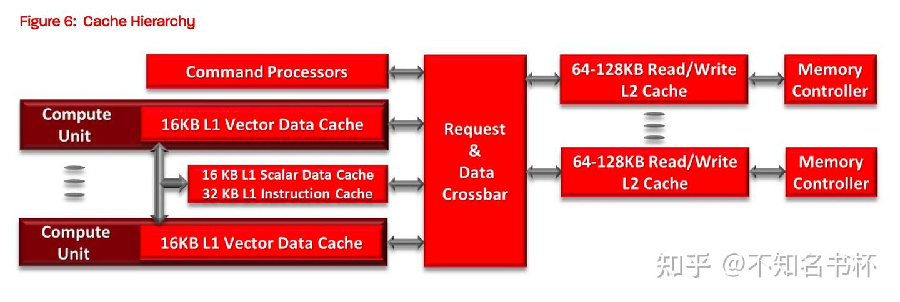

那么在GPU中是如何保证先前写入的数据保证对目标单元可见呢？答案是通过L1/L2 Cache的配合来完成，首先L1 Cache用于存储SM(Streaming multiprocessor，可以认为一个大的计算单元)内的数据，在SM内的[运算单元](https://zhida.zhihu.com/search?content_id=227039634&content_type=Article&match_order=1&q=运算单元&zhida_source=entity)能够共享该L1 Cache但是跨SM之间的L1 Cache不能相互访问。而L2 Cache是全部SM都可以访问。根据这个特性L1 Cache可以通过L2 Cache来保证Cache一致性。当一个SM完成计算时将其结果写入L1 Cache中。后续将其结果更新到L2 Cache中。其它 L1 Cache通过特定的一致性指令从L2 Cache中获取最新写入的数据，确保使用最新的数据保证了其数据一致性。

那么对于Vulkan来说这个代表了什么？别忘了同步也需要保证内存依赖，那么在每个不同的Pipeline Stage的执行过程中也需要保证使用的数据是最新(避免脏数据)，在Pipeline Stage中执行的操作都可能会在L1 Cache中写入数据，但是并不会保证更新到L2 Cache中，只有当某个Pipeline Stage真正的要使用的时候从更新到L2 Cache中再更新到L1 Cache中才可以使用到最新的数据。

回到这里现在来总结这一小节的名称，当L1 Cache写入新数据时，那么L2 Cache中的数据就已经失效。其他SM中的L1 Cache需要从L2 Cache中拉取最新数据这个过程被称为内存可见，将L1 Cache最新的写入内容更新到L2 Cache的过程被称为内存可用。更简单的说内存可见使Cache无效**，**内存可用使Cache更新。在Vulkan中可以通过Memory Barrier来保证内存依赖的正确。

下面就是一个内存可见和内存可用的全过程，在这里就是将最新L1 Cache更新到了L2 Cache中，这也就是内存可用的过程。

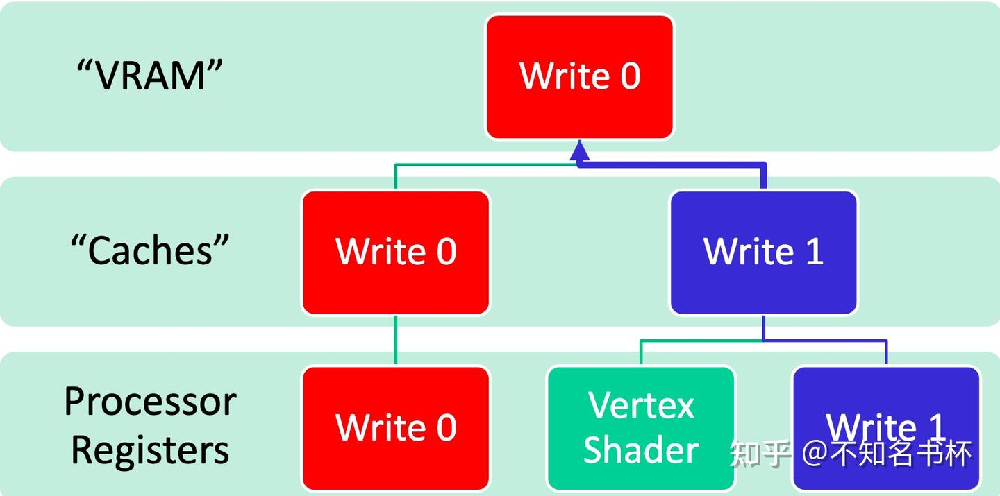

接着其他的SM从L2 Cache获取最新的数据并更新到当前SM内的L1 Cache，使得新的内存写入更新到其他的SM中。也就是内存可见的过程。

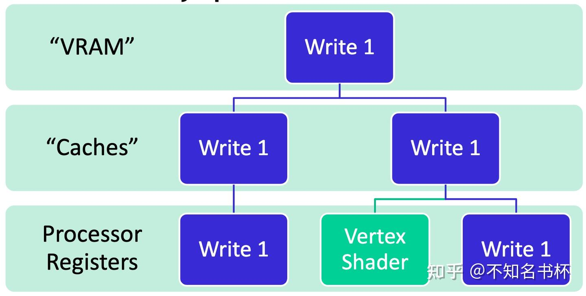

### Image Layout 和 **Layout Transition**

在RenderPass创建参数中需要指定RenderPass开始时和RenderPass结束时的ImageLayout也就是initLayout和finalLayout。因为不同的ImageLayout会影响到像素在内存中的组织方式。由于图形硬件的工作方式，对于Image来说线性布局往往不是性能最优的(Buffer一般都是选择线性布局，无需选择各种Layout)。选择正确的ImageLayout对于性能很重要。当这个Image使用于不同的用途是往往要切换到最优的ImageLayout，这样可以获得最佳的性能并且可以让驱动程序更好的管理和优化内存，比如要给Shader使用时则需要转换为Shader只读最优的ImageLayout。但是这些不同的ImageLayout对于开发者来说是一个黑盒，对于不同的GPU会有不同的实现。

但是在不同的时刻Image会有着不一样的用途，也就是需要Layout Transition操作将其过渡正确的ImageLayout才能够使用。如果在内存依赖中指定了Layout Transition。它必须发生在内存依赖中的内存可用之后(也就是所有的L1 Cache已经把最新的数据更新到了L2 Cache中)，并且发生在内存可见操作之前。因为Layout Transition是一个会对内存进行读写访问，所以必须保证在Layout Transition之前所有内存可用，并且会自动对Layout Transition内存可见，并且Layout Transition执行的写入会自动完成内存可用。从Layout Transition的执行过程也可以看出都是在L2 Cache完成操作并且立即完成。对于Layout Transition也需要合理使用，不然会明显明显的额外开销拉低GPU的性能。

### 同步类型

在Vulkan中会有很多的不同的粒度的同步，主要是分为CPU和GPU之间的同步以及GPU内部的同步。同步的内容分别为指令同步和内存同步。

### CPU和GPU之间的同步

CPU和GPU之间的同步在实践中主要是关于多个帧同时存在的问题，比如第N帧正在提交Command给GPU去渲染，在这个时间内N+1帧正在Record Command并提交或者在等待是否可以清空Command Buffer(N+1帧可能还没执行完毕)，但是这个时候需要等待正在渲染的帧完毕，这N+1帧才可以去真正去完成渲染。还有一个实际需求是截图功能，则个同样需要等待GPU渲染完毕之后拿到渲染结果后，CPU才可以继续往下执行。所以需要提供CPU和GPU之间的同步机制，一般Vulkan中通过Fence来满足这个功能。

### GPU内的同步

GPU内的同步主要是就是在Queue内部或者多个Queue之间的同步，当有执行依赖的时候，那么就需要Queue内或者多个Queue的同步，比如上面提到的异步计算或者异步传输等等，Graphics Queue需要等待Transfer Queue/Computer Queue完成执行之后再开始执行渲染命令。比如是ShadowMap的使用必须要在ShadowMap生成之后。在GPU内的同步在Vulkan中有多种同步方式，可以通过Pipeline Barrier/Events/Subpass Dependency/Semaphore来实现。

### 指令同步—保证执行依赖

在Command Buffer中某些Command开始执行时机是依赖其他Command完成某个的Operation前提的话那么则需要指令同步。但是注意这些Command并不需要在同一个Command Buffer内，只要是被一次性的提交到Queue的都可以反正都是并行执行。

### 内存同步—保证内存依赖

这也就是上面提到的在Pipeline Stage执行中可能需要使用其他Pipeline Stage的输出数据时，需要内存可见和内存可用来保证内存依赖(保证读取的Cache是有效的)。指令同步并不能保证其内存依赖，需要通过内存可见和内存可用才能保证Cache一致性。

## 同步原语

在这里会介绍不同的同步原语以及它们各自的作用以及控制粒度可以参考下图。

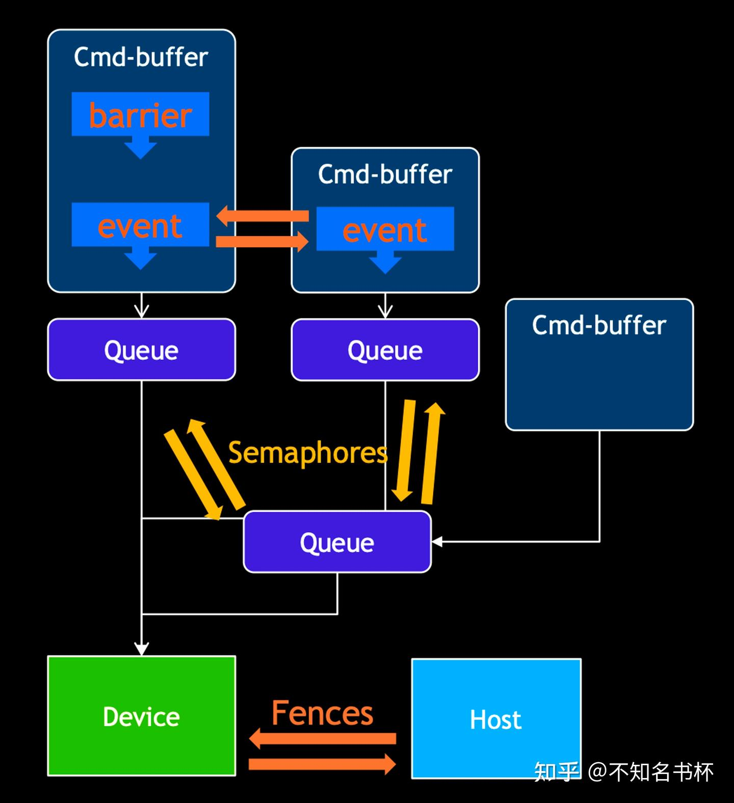

### Fence

Fence是一种同步原语，主要被用来完成CPU和GPU之间的同步。Fence可以在CPU和GPU之间插入一个依赖关系，Fence一般是有两种状态分别是Unsignaled或者Signaled。CPU侧可以调用vkWaitForFences来等待Fence变成Signaled状态在此期间CPU侧的执行将被堵塞，并且可以用vkGetFenceStatus查询当前Fence的状态。CPU侧可以通过vkResetFences方法来重置该Fence的状态。

一般来说Fence最典型的用途就是用于等待一次vkQueueSubmit提交的所有的Command全部执行完毕，如下[伪代码](https://zhida.zhihu.com/search?content_id=227039634&content_type=Article&match_order=1&q=伪代码&zhida_source=entity)所示，

```cpp
// 等待该帧的Fence状态变成signaled
vkWaitForFence(currentFrame.fence); 
vkResetFences(currentFrame.fence);
// Record Command 
.................
vkQueueSubmit(work: A, fence: currentFrame.fence);

// 切换到下一帧
currentFrame++;
```

在这里是一个多帧同时运行执行流程如下(在这里是同时跑两帧的情况)：

1. 第0帧的Fence是Unsignaled状态，vkWaitForFence不会堵塞执行，完成Record Command并调用vkQueueSubmit。
2. 切换到第1帧。
3. 第1帧的Fence还是Unsignaled状态，vkWaitForFence不会堵塞执行，完成Record Command并调用vkQueueSubmit。
4. 重新切换到第0帧。
5. 假如之前的Fence还没转化为Signaled状态则CPU侧会被堵塞。等待vkQueueSubmit触发Fence做出Signaled操作才会继续往下执行。如果已经完成了的话则重复以上流程。

创建Fence还是需要填充VkFenceCreateInfo结构体，并且通过vkCreateFence来创建Fence。

- flags字段用于指定使用哪种VkFenceCreateFlags

- - VK_FENCE_CREATE_SIGNALED_BIT指定将在signaled状态下创建Fence。否则它将在Unsignaled状态下创建。

```cpp
typedef struct VkFenceCreateInfo {
    VkStructureType       sType;
    const void*           pNext;
    VkFenceCreateFlags    flags;
} VkFenceCreateInfo;
```

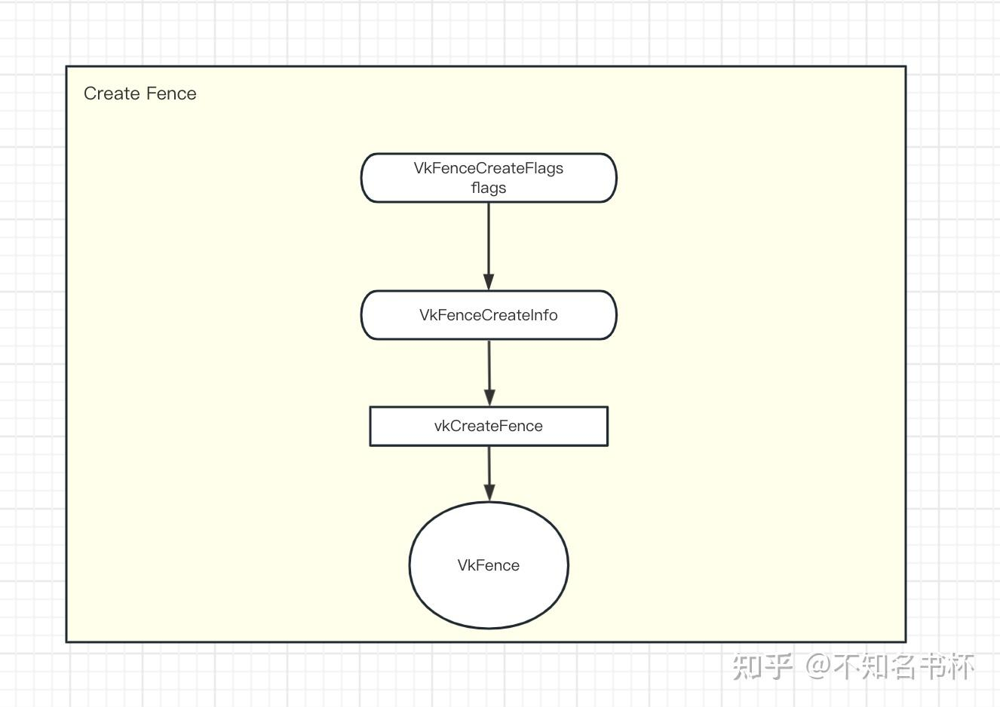

### Semaphore

Semaphore是一种同步原语主要被用来完成GPU内的同步，可以是Queue内的同步也可以在Queue之间完成同步。Semaphore同样也可以被用作在CPU和GPU之间的同步，不过这个能力在Vulkan1.2之后才可以使用(也就是后面会讲到的Timeline Semaphore)。类似于Fence，Semaphore也有Signaled和Unsignaled的状态之分。关于Semaphore在GPU内的同步的经典用途比如完成一帧的渲染的伪代码如下：

```cpp
vkAcquireNextImageKHR(swapchain,Semaphore:currentFrame.SemaphoreA);
//Record Command
.................
vkQueueSubmit(work: A, waitSemaphore: currentFrame.SemaphoreA,singleSemaphore：currentFrame.SemaphoreA);
vkQueuePresentKHR(work:A,WaitSemaphores:currentFrame.SemaphoreB)
```

- 首先通过vkAcquireNextImageKHR获取到SwapChain完成此操作后，让SemaphoreA做出Signaled操作。
- vkQueueSubmit则等待SemaphoreA的完成，提交的所有Command执行完成后让SemaphoreB做出Signaled操作。
- vkQueuePresentKHR等待SemaphoreB变成Signaled状态之后便可真正展示渲染结果。

通过Semaphore便可以确保是在Queue中渲染Command全部执行完之后展示其渲染结果。Semaphore当然可以用来Queue之间的同步，比如在上面提到的异步计算以及异步传输都少不了Semaphore来完成同步。

需要注意的是，Fence和Semaphores既是内存同步也是指令同步也就是两者都包含了隐式的内存同步，所以Fence和Semaphores也被称为粗粒度的同步原语，Fence 是CPU和GPU之间的同步，Semaphores是Queue之间的同步。

创建Semaphore还是老规矩，需要填充VkSemaphoreCreateInfo该结构体。并通过vkCreateSemaphore完成创建。现在flag字段还没有任何作用。

```cpp
typedef struct VkSemaphoreCreateInfo {
    VkStructureType           sType;
    const void*               pNext;
    VkSemaphoreCreateFlags    flags;
} VkSemaphoreCreateInfo;
```

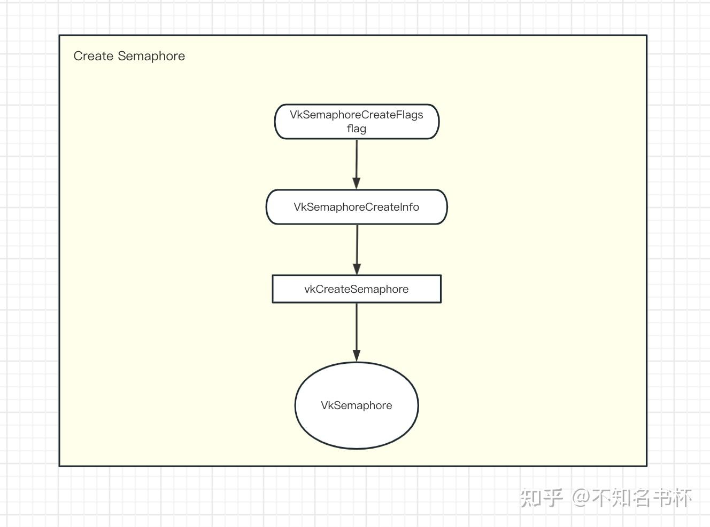

### **Pipeline Barrier**

Pipeline Barrier同样是Vulkan中的一个同步原语，它能够提供更细粒度的控制，并且只能完成Queue内的同步不能够跨Queue。Pipeline Barrier可以被译为管线屏障，顾名思义Pipeline Barrier在Pipeline Stage之间树立一个Barrier，要求Barrier前后保持一定的顺序执行。Pipeline Barrier被可以用来保证内存依赖或者执行依赖。所以是更加细粒度的同步手段。那现在让我们来看看如何创建一个Pipeline Barrier。

在这里Pipeline Barrier的使用无需创建一个Pipeline Barrier对象，而是直接调用vkCmdPipelineBarrier，这和Fence/Semaphore不同，并且这是vkCmd开头的意味它执行的主体是一个Command Buffer。

- commandBuffer是记录该命令的Command Buffer。
- srcStageMask是一个VkPipelineStageFlagBits类型字段，用于指定Source Pipeline Stage。
- dstStageMask是VkPipelineStageFlagBits类型字段，用于指定Destinition Pipeline Stage。
- memoryBarrierCount是pMemoryBarriers数组的长度。
- pMemoryBarriers是一个指向VkMemoryBarrier结构数组的指针。
- bufferMemoryBarrierCount是pBufferMemoryBarriers数组的长度。
- pBufferMemoryBarriers是一个指向VkBufferMemoryBarrier结构数组的指针。
- imageMemoryBarrierCount是pImageMemoryBarriers数组的长度。
- pImageMemoryBarriers是一个指向VkImageMemoryBarrier结构数组的指针。

```cpp
void vkCmdPipelineBarrier(
    VkCommandBuffer                             commandBuffer,
    VkPipelineStageFlags                        srcStageMask,
    VkPipelineStageFlags                        dstStageMask,
    VkDependencyFlags                           dependencyFlags,
    uint32_t                                    memoryBarrierCount,
    const VkMemoryBarrier*                      pMemoryBarriers,
    uint32_t                                    bufferMemoryBarrierCount,
    const VkBufferMemoryBarrier*                pBufferMemoryBarriers,
    uint32_t                                    imageMemoryBarrierCount,
    const VkImageMemoryBarrier*                 pImageMemoryBarriers);
```

### Execution Barrier

在这里先来聊聊Execution Barrier，在这里可以先忽略关于任何Memory Barrier相关参数的设定并将其置为空，那么在这里已经创建了一个Execution Barrier。只用于完成执行依赖，对于内存依赖没有任何操作。那么现在就只剩下srcStageMask和dstStageMask等着咱们去填充。

srcStageMask代表了所有在Source Pipeline Stage以及其[逻辑顺序](https://zhida.zhihu.com/search?content_id=227039634&content_type=Article&match_order=1&q=逻辑顺序&zhida_source=entity)之前的Pipeline Stage都被保证在 Destinition Pipeline Stage之前完成执行，Vulkan不允许你在单个命令之间添加细粒度的依赖关系。相反可以控制在某些Pipeline Stage发生的所有工作。也就是说Vulkan的Pipeline Barrier的控制粒度在Pipeline Stage之间。

dstStageMask则指定了Barrier的后半部分，在指定该Destinition Pipeline Stage以及逻辑顺序之后提交的任何工作都需要等待srcStageMask执行完毕后才能执行。只有指定Pipeline Stage的执行会受到影响。例如如果dstStageMask是FRAGMENT_SHADER_BIT，那么后续Command的顶点着色可以提前开始执行，只需要在达到执行FRAGMENT_SHADER_BIT后等待即可。

那么从srcStageMask和dstStageMask的定义可以看出，两个参数设置的Pipeline Stage在整个Pipeline Stage流程重合的阶段越多，则并行度越高，那么相对应的性能更好，有些参数设置可能也能够完成需求，但是并行度不够性能没有最优。所以对于Pipeline Stage需要精心设置以获取最好的性能。

下面是一个例子，在这里会有两个RenderPass的场景(ShadowPass以及MainScenePass)，如下图所示。在这里Pipeline Barrier的srcStageMask设置为VK_PIPELINE_STAGE_BOTTOM_OF_PIPE_BIT，dstStageMask设置为VK_PIPELINE_STAGE_TOP_OF_PIPE_BIT。

在这里补充一下关于这两个特殊Pipeline Stage的作用。它们本质上是 "辅助 "阶段不做实际工作，但有一些重要的作用。每个命令都会首先执行TOP_OF_PIPE阶段。这基本上是GPU上的命令处理器在解析这个Command也就是整个执行的起始点。BOTTOM_OF_PIPE是Command在完成所有工作后退出的地方。TOP_OF_PIPE和BOTTOM_OF_PIPE在特定情况下很有用。

在这里的操作也就是先执行ShadowPass后执行MainScenePass。但是这个设置下的性能并不好，因为引入了一个Pipeline气泡。

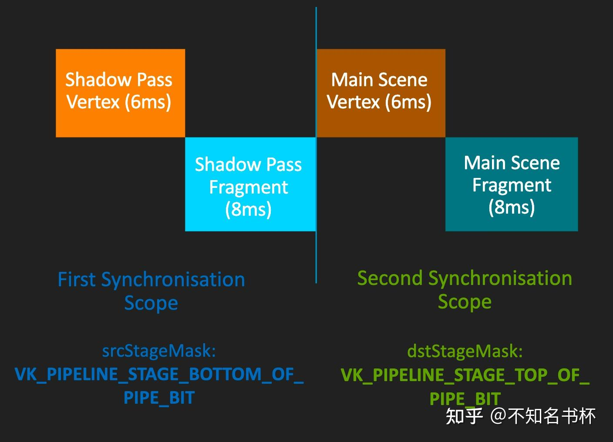

接下来对srcStageMask和dstStageMask参数做了修改，让srcStageMask为COLOR_ATTACHMENT_OUTPUT而dstStageMask为FRAGMENT_SHADER_BIT。可以让MainScenePass的Vertex阶段也同时并行。直到让ShadowMap真正生成出来之后再执行MainScenePass的像素着色器阶段，提高了并行度。如下图所示：

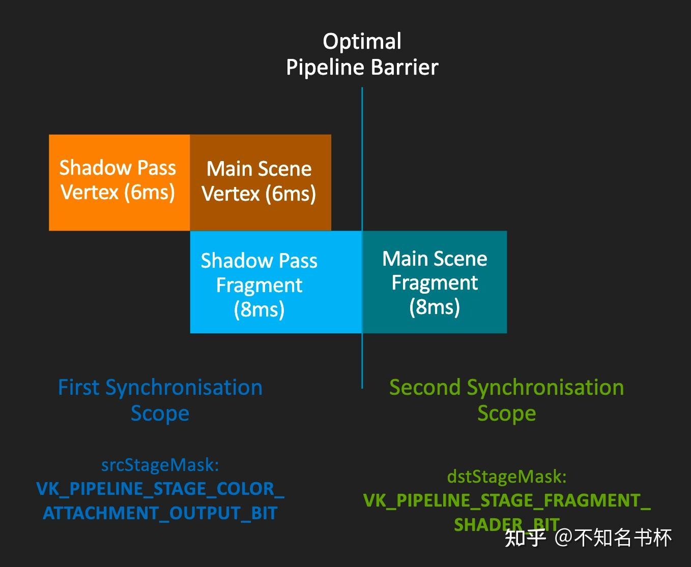

调整后的执行流程如下所示，可以看的出正确的srcStageMask和dstStageMask参数设置，可以提高其并行度并且性能更好。

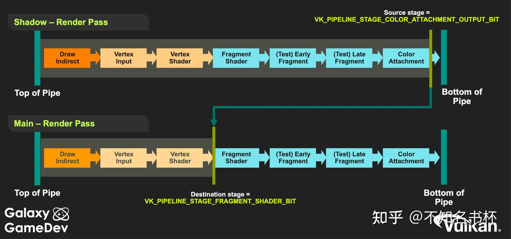

只是通过设置正确的srcStageMask和dstStageMask来完成执行依赖，但是对于内存依赖来说这些毫无帮助。比如在上面这个例子这里，在ShadowPass中完成对于ShadowMap的生成，之后MainScene Pass在运行像素着色器时就可以立马获取到最新的ShadowMap纹理。这是理想内存模型，但实际上由于现代GPU复杂的Cache[层次模型](https://zhida.zhihu.com/search?content_id=227039634&content_type=Article&match_order=1&q=层次模型&zhida_source=entity)，这个理想模型是不存在的。只有最有可能的是MainScene Pass去读取ShadowMap的时候，这个时候ShadowMap对于现在的MainScenePass实际还是不可见的状态。这是很有可能的。

究其原因是因为Execution Barrier只能保证执行依赖的正确，而无法保证对于内存操作的顺序。为了补足这个缺点，让我们看向Memory Barrier。

### **Memory Barrier**

首先Memory Barrier是一个更加严格的Barrier。Memory Barrier同时也兼具Execution Barrier的语义，Memory Barrier主要是解决Execution Barrier存在的问题，也就是无法保证内存依赖的正确性(也就是会说仅仅是Execution Barrier并不足以确保GPU上的不同单元能够在它们之间保证数据的正确性)。在这里可以将所有的Memory Barrie来代替Execution Barrier来使用。但是这样也就是失去一部分更加细粒度的控制能力无法获得极致的性能。

理解Memory Barrier需要先理解GPU Cache中内存可见和内存可用的概念，它们将会保证其Cache一致性(可以回到GPU Cache小节观看)。在Memory Barrier也有两个重要的字段，那就是srcAccessMask和dstAccessMask字段，它们都是VkAccessFlags类型的枚举并且都以VK_ACCESS_开头，这些flag代表可以执行的内存访问。srcAccessMask通常用来保证Source Stage以及之前的操作的全部写入操作(通常是写操作)内存可用，dstAccessMask用来保证Destinition Stage以及之后的操作保证内存可见。每个Pipeline Stage都可以执行某些内存访问，因此将Pipeline Stage+ AccessMask结合起来，用来控制执行到了某个Pipeline Stage的内存情况(保证是否是最新的数据)。

在这里Memory Barrier分为三种类型：

- VkMemoryBarrier
- VkBufferMemoryBarrier
- VkImageMemoryBarrier

### **VkMemoryBarrier**

VkMemoryBarrier是一个最简单Memory Barrier，它是一个全局的Memory Barrier会处理对任何资源的访问。它会刷新和无效整个Cache，这个最好在有多个资源需要转换时使用，这比单个资源一个一个来转换性能更好。在这里的执行步骤很简单如下所示：

- 首先是等待 srcStageMask 指定的Pipeline Stage执行完毕。
- 使所有在 srcStageMask + srcAccessMask 的组合中执行的写操作的内存可用(也就是从L1 Cache写入到L2 Cache中)。
- 使可用的内存对dstStageMask + dstAccessMask的可能组合的内存可见(最新的从L2 Cache更新到L1 Cache中)。
- 解除对dstStageMask中限制继续往下执行。

```cpp
typedef struct VkMemoryBarrier {
    VkStructureType sType；
    const void* pNext；
    VkAccessFlags srcAccessMask；
    VkAccessFlags dstAccessMask；
} VkMemoryBarrier
```

这里有一个需要注意的点，那就是AccessMask不要和VK_PIPELINE_STAGE_BOTTOM_OF_PIPE_BIT/VK_PIPELINE_STAGE_TOP_OF_PIPE_BIT搭配使用，这些阶段不执行内存访问，所以任何srcAccessMask和dstAccessMask与这两个阶段的组合都是没有意义的，并且Vulkan不允许这样做。TOP_OF_PIPE和BOTTOM_OF_PIPE纯粹是为了Execution Barrier而存在，而不是Memory Barrier。

还有一个是srcAccessMask可能会被设置为XXX_READ的flag，这是完全多余的。让读操作做一个内存可用的过程是没有意义的(因为没有数据需要更新)，也就是说是读取数据的时候并没有刷新Cache的需要，这可能会浪费一部分的性能。

### VkBufferMemoryBarrier

VkBufferMemoryBarrier用于保证Buffer的内存依赖，可以通过指定offset和size参数对Buffer上某一段区域的保证其内存依赖。对于VkBufferMemoryBarrier来说，提供了srcQueueFamilyIndex和dstQueueFamilyIndex来转换该Buffer的所有权。这是VkMemoryBarrier没有的功能。实际上如果不是为了转换Buffer的所有权的话的，其他的有关Buffer的同步需求完全可以VkMemoryBarrier来完成，一般来说VkBufferMemoryBarrier用的很少。

```cpp
typedef struct VkBufferMemoryBarrier {
    VkStructureType    sType;
    const void*        pNext;
    VkAccessFlags      srcAccessMask;
    VkAccessFlags      dstAccessMask;
    uint32_t           srcQueueFamilyIndex;
    uint32_t           dstQueueFamilyIndex;
    VkBuffer           buffer;
    VkDeviceSize       offset;
    VkDeviceSize       size;
} VkBufferMemoryBarrier;
```

### VkImageMemoryBarrier

VkImageMemoryBarrier用于保证Image的内存依赖，可以通过指定subresourceRange参数对Image上某个子资源保证其内存依赖，通过指定 oldLayout、newLayout参数用于执行Layout Transition。并且和VkBufferMemoryBarrier类似同样能够完成转换该Image的所有权的功能。这是这两种Barrier相比于VkMemoryBarrier的优势所在。但是VkImageMemoryBarrier还有着Layout Transition的作用(可以回到Layout Transition的小节)，这是会经常用到的功能。

```cpp
typedef struct VkImageMemoryBarrier {
    VkStructureType sType;
    const void* pNext;
    VkAccessFlags srcAccessMask;
    VkAccessFlags dstAccessMask;
    VkImageLayout oldLayout;
    VkImageLayout newLayout;
    uint32_t srcQueueFamilyIndex;
    uint32_t dstQueueFamilyIndex;
    VkImage image;
    VkImageSubresourceRange subresourceRange;
} VkImageMemoryBarrier;
```

在这里有一些关于VkImageMemoryBarrier的例子，比如当分配了一张Image并且开始使用它，那么则需要根据相应的用途将来Layout Transition到最优的ImageLayout。在这里的需求是需要进行Layout Transition但是无需等待任何Pipeline Stage的执行的话，那就是可以体现VK_PIPELINE_STAGE_TOP_OF_PIPE_BIT的用处。

分配一个新的Image将在计算着色器中往其中写入一定的数据，那么就是需要转化为适合的Layout。那么这次的Barrier设置如下：

- srcStageMask = TOP_OF_PIPE(代表无需等待任何Pipeline Stage)，dstStageMask = COMPUTE(在完成Layout Transition后解除对计算阶段的等待)。
- srcAccessMask = 0(这是关键，这里没有待处理的写操作需要内存可用)，dstAccessMask = SHADER_READ | SHADER_WRITE(在计算器着色器读或写之前保证内存可见).
- oldLayout = UNDEFINED(并不在意原本的内容)，newLayout = GENERAL(存储图像兼容布局) 。这是在Memory Barrier中使用TOP_OF_PIPE的唯一方法。

另外一个例子是设置SwapChain中Image的Layout Transition：

- oldLayout = COLOR_ATTACHMENT_OPTIMAL(在RenderPass渲染出的结果，作为Color Attachemt输出)，newLayout = PRESENT_SRC_KHR( 最适合Present的格式)。
- srcStageMask = COLOR_ATTACHMENT_OUTPUT_BIT，dstStageMask = BOTTOM_OF_PIPE_BIT(完成全部Pipeline Stage执行)。
- src_access_mask = COLOR_ATTACHMENT_WRITE_BIT(需要将最新的Color Attachmen更新到L1 Cache中保证内存可用)，dstAccessMask = 0(后续并不需要保证其内存可见)。

还有一个ShadowMap的Layout Transition例子：

- oldLayout = UNDEFINED(新创建的Image，并且一开始无内容)，newLayout = DEPTH_STENCIL_ATTACHMENT_OPTIMAL( 最适合存储深度值的格式)。
- srcStageMask = TOP_OF_PIPE_BIT(无需等待任何Pipeline Stage)，dstStageMask = EARLY_FRAGMENT_TESTS_BIT| LATE_FRAGMENT_TESTS_BIT(完成深度测试后再继续往下执行)。
- src_access_mask = 0(并不在意原本的内容)，dstAccessMask = DEPTH_STENCIL_ATTACHMENT_READ_BIT| DEPTH_STENCIL_ATTACHMENT_WRITE_BIT(在读写其中的深度之前保证其内存可见)。

### Event

Event也是一个功能强大的同步原语，可用于在提交给同一Queue的Command之间或在CPU和GPU之间插入细粒度的依赖关系。但是不能被用来在提交给不同Queue的Command之间插入依赖关系。Event同样有两种状态Signaled和Unsignaled。一个应用程序可以在CPU或GPU上对Event做出Signaled或Unsignaled操作。GPU可以在执行进一步的操作之前等待一个Event变成Signaled状态才可以继续往下执行。在CPU侧上不存在等待Event成为Signaled状态的函数，但可以查询Event的当前状态。

在这里Event的创建很简单，填充VkEventCreateInfo并通过vkCreateEvent创建真正的Event。

- flag字段是一个VkEventCreateFlags类型的参数。

- - VK_EVENT_CREATE_DEVICE_ONLY_BIT指定CPU命令将不被用于此Event，也就是否用于CPU和GPU之间的同步。

```cpp
typedef struct VkEventCreateInfo {
    VkStructureType       sType;
    const void*           pNext;
    VkEventCreateFlags    flags;
} VkEventCreateInfo;
```

在这里需要着重介绍的是vkCmdSetEvent和vkCmdWaitEvents等操作。

```cpp
void vkCmdSetEvent(
    VkCommandBuffer                             commandBuffer,
    VkEvent                                     event,
    VkPipelineStageFlags                        stageMask);

void vkCmdWaitEvents(
    VkCommandBuffer                             commandBuffer,
    uint32_t                                    eventCount,
    const VkEvent*                              pEvents,
    VkPipelineStageFlags                        srcStageMask,
    VkPipelineStageFlags                        dstStageMask,
    uint32_t                                    memoryBarrierCount,
    const VkMemoryBarrier*                      pMemoryBarriers,
    uint32_t                                    bufferMemoryBarrierCount,
    const VkBufferMemoryBarrier*                pBufferMemoryBarriers,
    uint32_t                                    imageMemoryBarrierCount,
    const VkImageMemoryBarrier*                 pImageMemoryBarriers);
```

一个Eevnt是通过调用vkCmdSetEvent来设置的，有一个stageMask参数标记了在这之前被提交的Command需要中等待该Pipeline Stage执行完毕后Event便可完成Signaled操作。vkCmdWaitEvents的参数和Pipeline Barrier的参数基本一致。如果没有Memory Barrier则vkCmdWaitEvents会使在这之后提交的Command中的dstStageMask等待直到pEvents中的所有Event完成Signaled操作再继续执行。调用vkCmdSetEvent将之前提交的Command和在vkCmdWaitEvents之后提交Command中之间建立了一个Execution Barrier。

那么为什么需要Event同步原语的出现?，Pipeline Barrier像是在两个Command的执行中立了一个栅栏，保证上一个Command执行到了某个Pipeline Stage才让后一条的Command的往下执行对应的Pipeline Stage。但是假如中间还有一条Command和其他两个Command并且没有任何的依赖关系，但这个Command也会被堵塞需要等待上面两个Command执行完毕，那么这就是一个Pipeline气泡。所以Vulkan提出来了Event可以看成分成前后两端的Pipeline Barrier但是控制粒度更细，只等待Event完成Signale操作，而不需要停滞GPU使 GPU 的并行性更强。可以从下图更加直观的看出来Event和Pipeline Barrier的区别。

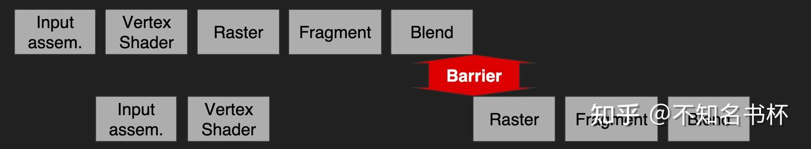

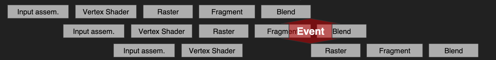

先来一个简单的例子如下所示：

```cpp
vkCmdDispatch(1)
vkCmdDispatch(2)
vkCmdSetEvent(event, srcStageMask = COMPUTE)
vkCmdDispatch(3)
vkCmdWaitEvent(event, dstStageMask = COMPUTE)
vkCmdDispatch(4)
vkCmdDispatch(5)
```

在这里执行顺序是首先通过vkCmdSetEvent让{1,2}执行到COMPUTE阶段，vkCmdWaitEvent让{4,5}等待{1,2}的COMPUTE阶段结束才可以开始{4,5}的COMPUTE阶段。但是对于{3}来说则没有被任何同步操作影响。这就是Event的作用，更加细粒度的控制并且可以填补Pipeline气泡的时间。

这下面还有一个更加复杂的例子，如下所示：

```cpp
vkCmdDispatch( 1 );
vkCmdDispatch( 2 );
vkCmdDispatch( 3 );
vkCmdSetEvent( A, srcStageMask = COMPUTE );
vkCmdDispatch( 4 );
vkCmdDispatch( 5 );
vkCmdDispatch( 6 );
vkCmdSetEvent( B, srcStageMask = COMPUTE );
vkCmdWaitEvents( A, dstStageMask = COMPUTE );
vkCmdDispatch( 7 );
vkCmdDispatch( 8 );
vkCmdWaitEvents( B, dstStageMask = COMPUTE );
vkCmdDispatch( 9 );
```

在这里其实理解很简单了，注意vkCmdSetEvent和vkCmdWaitEvents分别是针对哪个Event和Pipeline Stage即可。首先来看看Event A做了什么，{1,2,3}在前{7,8}在后，这里就很简单明了。{1,2,3}完成了COMPUTE阶段后，{7,8}才可以运行COMPUTE阶段。那Event B也是类似的情况，先{4,5,6}后{7,8}最后就是{9}，{4,5,6}执行完COMPUTE之后{7,8}开始执行COMPUTE，执行完毕之后开始{9}。

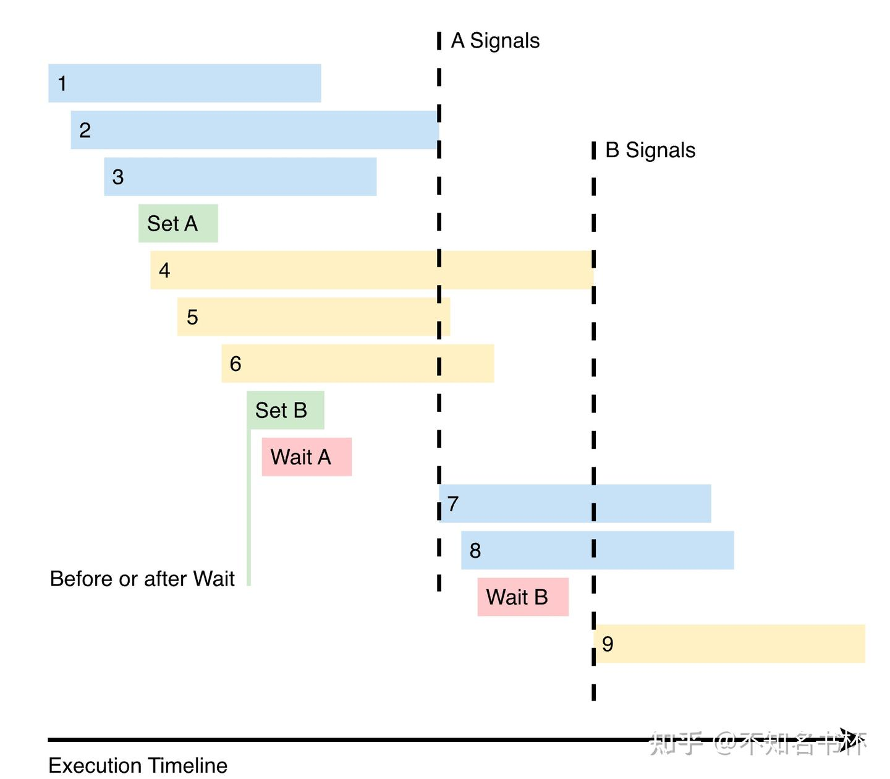

### SubPass Dependency

在Vulkan中除了显示的同步原语以外还存在着隐式同步原语。那就是在RenderPass中的SubPassDependency来体现，与Pipeline Barrier类似，但专门用于表达SubPass之间的依赖关系以及RenderPass中的Command和外部Command的依赖关系，无论是在RenderPass开始前还是结束后。

```cpp
typedef struct VkSubpassDependency {
            uint32_t srcSubpass;
            uint32_t dstSubpass;
            VkPipelineStageFlags srcStageMask;
            VkPipelineStageFlags dstStageMask;
            VkAccessFlags srcAccessMask;
            VkAccessFlags dstAccessMask;
            VkDependencyFlags dependencyFlags;
} VkSubpassDependency;
```

在SubPassDependency中同样需要指定srcStageMask/dstStageMask/srcAccessMask/dstAccessMask等属性。那么SubpassDependency拥有Memory Barrier和Execution Barrier的作用。在这里还有一个VkDependencyFlags这主要是关于移动端的优化(后面展开)。并且假如srcSubpass和dstSubpass相等则不会直接定义其依赖关系，相反它使Pipeline Barrier能够在确定的SubPass内的RenderPass实例中使用。如果 srcSubpass 和 dstSubpass 不相等，当包括SubPassDependency的RenderPass实例被提交到Queue时，它将在 srcSubpass 和 dstSubpass 所代表的两个SubPass之间定义一个依赖关系。

在SubPassDependency有许多需要的注意的点，首先就是VK_SUBPASS_EXTERNAL用于表示给定RenderPass之外的任何内容。当用于srcSubpass时，它指定RenderPass之前发生的任何事情。当VK_SUBPASS_EXTERNAL用于dstSubpass时，它指定RenderPass之后发生的任何事情。这意味着同步机制需要包含在RenderPass之前或之后发生的操作。它可能是另一个RenderPass，但也可能是其他一些操作不一定与RenderPass相关。

如果 srcSubpass等于VK_SUBPASS_EXTERNAL，则第一同步范围包括在提交顺序中早于调用vkCmdBeginRenderPass。否则第一组Command包括作为由 srcSubpass 识别 SubPass实例的一部分提交的所有Command以及 srcSubPass 中使用的对Attachemnt的任何加载、存储或多样本解析操作。在这两种情况下第一同步范围被限制在由 srcStageMask 所指定的Pipeline Stage，对于srcAccessMask也是同样如此。

如果 dstSubpass 等于 VK_SUBPASS_EXTERNAL，则第二同步范围包括在提交顺序上晚于调用vkCmdEndRenderPass。否则第二组Command包括作为由 dstSubpass识别的SubPass实例的一部分提交的所有Commmand以及在 dstSubpass 中使用的Attachemnt上的任何加载、存储或多样本解析操作。在这两种情况下第二同步范围限于对由dstStageMask指定的Pipeline Stage，对于dstAccessMask也是同样如此。

但是在这里还涉及一个问题，那也就是implicit SubPass dependency。并且该操作主要目的是为了处理的initialLayout和finalLayout的正确性。RenderPass就会执行隐式Layout Transition会有三种情况出现：

- External至SubPass(srcSubpass设置为VK_SUBPASS_EXTERNAL)
- SubPass与SubPass之间
- SubPass至External(dstSubpass 设置为VK_SUBPASS_EXTERNAL)

分别对应下面这些情况(implicit SubPass dependency只存在于ImageLayout不一致的情况才会出现)

- RenderPass中Attachment的VkAttachmentDescription的initialLayout和使用该Attachment的第一个SubPass所需ImageLayout不一致(Attachment的Layout在VkAttachmentReference指定)。
- 两个 SubPass 读取同一个Attachement，并且两个SubPass所需的ImageLayout不同。
- RenderPass中Attachment的VkAttachmentDescription中的finalLayout 和使用该 Attachment 的最后一个SubPass所需ImageLayout不一致。

由于SubPass可能会与其他SubPass并行或者乱序执行除非有SubPassDependency指定依赖，因此SubPass之间所需的Layout Transition不能为应用程序所知。相反RenderPass提供了每个Attachment在的开始和结束时必须处于的ImageLayout以及它在SubPass中使用时必须处于的ImageLayout。假如在SubPass之间遇到ImageLayout不一致的情况则会在SubPass之间执行隐式Layout Transition以保证Image处于SubPass所要求的ImageLayout中，并在RenderPass结束时过渡到finalLayout。

在srcSubpass设置为VK_SUBPASS_EXTERNAL保证现有的Attachment的ImageLayout自动Layout Transition到initLayout的过程中，那么就要保证在srcSubpass执行到srcStageMask之后有关写操作全部内存可用后才可以开始Layout Transition。Layout Transition在上面介绍过本质上一个读写操作所以要保证内存可见，dstSubpass就可以用到过渡后的ImageLayout。而在dstSubpass等于VK_SUBPASS_EXTERNAL的情况下，那么在相关内存依赖的完成内存可见之前需要自动Layout Transition到finalLayout。

举一些简单的例子，比如在当前SubPass当中读取上一个SubPass在Color Attachemnt写入的数据，需要通过Input Attachmen来完成这个需求。在这里主要关注VkSubpassDependency设置。

```cpp
dependency.srcSubpass = 0;
dependency.dstSubpass = 1;
dependency.srcStageMask = VK_PIPELINE_STAGE_COLOR_ATTACHMENT_OUTPUT_BIT;
dependency.dstStageMask = VK_PIPELINE_STAGE_FRAGMENT_SHADER_BIT;
dependency.srcAccessMask = VK_ACCESS_COLOR_ATTACHMENT_WRITE_BIT;
dependency.dstAccessMask = VK_ACCESS_SHADER_READ_BIT;
dependency.dependencyFlags = VK_DEPENDENCY_BY_REGION_BIT;
```

srcSubpass指定Source SubPass的索引，在这里就是第一个SubPass，dstSubpass指定Destinition SubPass的索引，在这里就是第二个SubPass。在这里是在第一个SubPass内写入Color，srcStageMask那么选择COLOR_ATTACHMENT_OUTPUT即可满足。要在第二个SubPass中需要在像素着色器中读取Color Attachment。所以dstStageMask选择STAGE_FRAGMENT_SHADER即可。srcAccessMask设置为COLOR_ATTACHMENT_WRITE保证Color Attachemnt写操作之后的内存可用。dstAccessMask为SHADER_READ保证在第二个SubPass的Shader读取时内存可见。

在这里还将dependencyFlags设置为了VK_DEPENDENCY_BY_REGION_BIT，首先要介绍Framebuffer Region Dependency概念，首先对Framebuffer进行操作或与之相关的Pipeline Stage统称为Framebuffer-Space Pipeline Stage。这些Pipeline Stage分别是：

- VK_PIPELINE_STAGE_FRAGMENT_SHADER_BIT
- VK_PIPELINE_STAGE_EARLY_FRAGMENT_TESTS_BIT
- VK_PIPELINE_STAGE_LATE_FRAGMENT_TESTS_BIT
- VK_PIPELINE_STAGE_COLOR_ATTACHMENT_OUTPUT_BIT

对于这些Pipeline Stage，从第一组操作到第二组操作的执行或内存依赖可以是一个Framebuffer-Global依赖，也可以分割成多个Framebuffer-Local依赖。一个具有非Framebuffer-Space Pipeline Stages的依赖既不是Framebuffer-Global的也不是Framebuffer-Local的。

如果一个同步Command包括一个dependencyFlags参数并指定为VK_DEPENDENCY_BY_REGION_BIT，那么它就为该同步Command中的Framebuffer-Space Pipeline Stage定义了Framebuffer-Local依赖并且适用于所有Framebuffer区域。如果没有包含dependencyFlags参数或者没有指定VK_DEPENDENCY_BY_REGION_BIT，那么将为这些Framebuffer-Space Pipeline Stage指定一个Framebuffer-Global依赖。VK_DEPENDENCY_BY_REGION_BIT标志不影响非Framebuffer-Space Pipeline Stage之间的依赖，也不影响不管是不是Framebuffer-Space Pipeline Stage之间的依赖。

对于大多数架构来说Framebuffer-Local依赖更有效。特别是Tile Base架构可以将Framebuffer完全保留在On-Chip寄存器中，从而避免外部带宽跨越这种依赖。在你的渲染中包括一个Framebuffer-Global依赖，通常会迫使所有的实现将数据需要放到到内存中或者到更高级别的缓存中，破坏任何潜在的[内存优化](https://zhida.zhihu.com/search?content_id=227039634&content_type=Article&match_order=1&q=内存优化&zhida_source=entity)。

### WaitIdle

在这里可以使用vkQueueWaitIdle和vkDeviceWaitIdle完成来粗粒度的同步， vkQueueWaitIdle可以用来等待指定的Queue全部执行完其中的Command，而vkDeviceWaitIdle则相当于所有的Queue全都执行vkQueueWaitIdle操作。

```cpp
VkResult vkQueueWaitIdle(VkQueue queue);

VkResult vkDeviceWaitIdle(VkDevice device);
```

大多数用于Debug或者在关闭应用程序之前删除所有的Vulkan有关对象等。最好不要将其用在渲染循环当中，这将是巨大的性能损耗。

### Execution Dependency Chain

执行依赖链(Execution Dependency Chain)同样是一个令人难以理解的概念(Spec不讲人话)，它代表的是一连串的执行依赖关系，同时可以作为一个单一的执行依赖关系。原文如下所示：

> An execution dependency chain is a sequence of execution dependencies that form a happens-before relation between the first dependency’s ScopedOps1 and the final dependency’s ScopedOps2. For each consecutive pair of execution dependencies, a chain exists if the intersection of Scope2nd in the first dependency and Scope1st in the second dependency is not an empty set. The formation of a single execution dependency from an execution dependency chain can be described by substituting the following in the description of execution dependencies: - Let Sync be a set of synchronization commands that generate an execution dependency chain. - Let Scope1st be the first synchronization scope of the first command in Sync. - Let Scope2nd be the second synchronization scope of the last command in Sync.

在一个执行依赖序列中，对于每一对连续的执行依赖关系，如果第一个依赖关系中的Scope2nd和第二个依赖关系中的Scope1st的交集不是一个空集，则存在一个执行依赖链。

从一个执行依赖链中形成一个执行依赖可以通过中替换以下内容来描述：

- 设Sync是一组产生执行依赖关系链的同步Command。
- 让Scope1st是Sync中第一个命令的第一个同步作用域(first synchronization scope)。
- 让Scope2nd是Sync中最后一条命令的第二个同步作用域(second synchronization scope)。

可能会比较让人难以理解，可以看下面这个例子:

```cpp
vkCmdDispatch
vkCmdDispatch
vkCmdPipelineBarrier(srcStageMask = COMPUTE, dstStageMask = TRANSFER)
vkCmdPipelineBarrier(srcStageMask = TRANSFER, dstStageMask = COMPUTE)
vkCmdDispatch
vkCmdDispatch
```

在这里使用两个Pipeline Barrier构成了一个执行依赖链，第一个同步Command的dstStageMask和第二个同步Command的srcStageMask有所交集。那么在这个例子中实际上得到了{1, 2}和{5, 6}之间的执行依赖，这是因为我们在COMPUTE -> TRANSFER -> COMPUTE之间建立了一个执行依赖链。

对于上面一个例子做了一个简单的改动，如下所示可能会更加便于理解。

```cpp
vkCmdDispatch
vkCmdDispatch
vkCmdPipelineBarrier(srcStageMask = COMPUTE, dstStageMask = TRANSFER)
vkCmdMagicDummyTransferOperation
vkCmdPipelineBarrier(srcStageMask = TRANSFER, dstStageMask = COMPUTE)
vkCmdDispatch
vkCmdDispatch
```

在这种情况下，很明显{4}必须等待{1，2}。而{6，7}必须等待{4}。因此创建了一个执行依赖链，其中{1, 2}->{4} -> {6，7}不过由于{4}是空的，{1，2}->{6，7}就实现了。但是假如vkCmdMagicDummyTransferOperation中有任何的需要等待TRANSFER的操作的话，那么{6,7}的执行需要等待目前阻挡TRANSFER的任何操作的完成。

回到第一个例子。在这里是各自有两次vkCmdDispatch的调用，通过等待TRANSFER操作让这两组操作具有执行依赖。但是假如vkCmdDispatch没有任何的TRANSFER操作的话，这个执行依赖还会成立吗？答案是的，即时没有这个操作这个执行依赖同样是成立的。可以翻看到老版本的Spec找到如下原文：

> A pair of consecutive execution dependencies in an execution dependency chain accomplishes a dependency between the stages A and B via intermediate stages C, even if no work is executed between them that uses the pipeline stages included in C.

也就是说在执行依赖链可以利用Pipeline Stage C完成了A和B之间的依赖关系。即时即使它们之间没有执行任何使用C中的Pipeline Stage的操作。

## 同步指南

### 了解同步层(Synchronization Validation)

在Vulkan当中同步是相当重要的话题，所以同步管理和调试至关重要，以确保Command和Operation按照正确的顺序顺序执行以及防止资源在并发访问时发生错误。但是我们可以看到上面同步的各种和繁多的同步方式而且加上Vulkan 低级别的抽象和复杂性，同步错误可以很容易地引入程序并导致很难调试。于是Vulkan提出Synchronization Validation 的方法，来帮助开发者Debug同步的各种问题。

Synchronization Validation可以帮助我们做到如下这些：

- 发现同步错误：例如资源读写顺序，操作顺序等可能导致问题的同步错误。
- 优化性能：同步验证可以帮助找到过度同步的地方，并提醒开发者哪些错误的操作，帮助优化其性能。
- 减少调试时间：通过自动检测错误使得开发者可以迅速找到问题所在和解决问题。

### 报错信息格式

所有同步错误信息都以SYNC-开头。信息主体是这样构成的：

```cpp
<cmd name>: Hazard <hazard name> <command specific details> Access info (<...>)
```

Access info包含关于当前和先前使用的信息(格式为SYNC__)和任何间隔的同步。内存或子资源使用的范围在特定命令的细节和其他信息中给出。 其中hazard name主要包括以下这几种：

- Read-after-write (RAW): 直接读取前一个操作的结果，但是没有等待写入内存完成。
- Write-after-read (WAR)： 读取操作还没完成，但还在往读取的内存写入数据。
- Write-after-write (WAW): 前一次操作的写入还没完成，继续在同样的内存位置写入数据。
- Write-racing-write (WRW): 未同步的 SubPass/Queue对同一位置的内存同时执行写操作时发生。
- Read-racing-write (RRW)：未同步的 SubPass/Queue 对同一位置的内存同时执行读写操作时发生。

接下来是command specific details通常包括当前Command中访问的详细信息。 Comman类型和详细信息示例如下：

- Copy or blit：包括Source和Destination以及Copy或者Blit的区域索引。
- Draw or dispatch：包括使用的Descriptor和Attachment以及在本次Draw或者Dispatch使用的Buffer。
- ImageBarriers：包括Image资源和 Layout Transition中的oldLayout，newLayout。
- Render pass：包括RenderPass中的Layout Transition中的oldLayout，newLayout以及对应Attachment中的load/store/resovle等操作。

Access info 对于所有同步验证错误消息都是通用的。 具体信息如下：

- usage：当前Command的Stage/Access使用的内存范围。
- prior_usage：前一次(危险的)内存使用的Stage/Access(与usage同名)。
- read_barrier：对于读属性的usage，在prior_usage和usage之间有Execution Barriers的Stages列表。
- write_barrier: 对于写属性的usage，在prior_usage和usage之间有Memory Barriers的Stages/Access列表。
- command：执行prior_usage的命令。
- seq_no: 在Command Buffer中索引为零的Command将被记录这里。
- reset_no： Command Buffer的reset次数将被记录在这。

下面有一个关于报错信息的例子，如下所示在上面展示的hazard name和command specific details和Access info等都有体现。

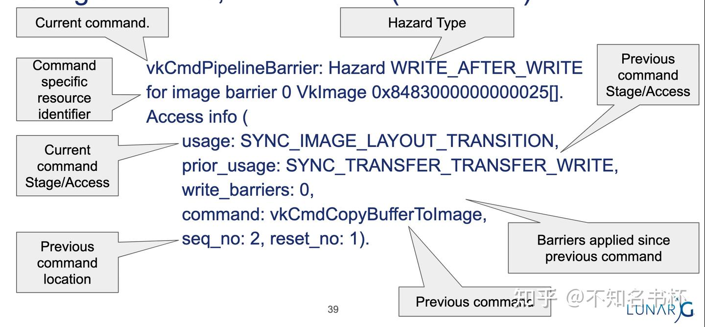

如果在调试一些同步有关的问题，毫无疑问Synchronization Validation能够帮上你的大忙，并且将同步慢慢调试到最优状态。在Vulkan中需要同步来防止数据损坏，但是过度的或者不合理的同步会通过在执行中引入停顿而对性能产生负面影响。Synchronization Validation可以用来识别最小需要的Barriers和依赖性。要做到这一点，可以慢慢减少Barrier的数量和依赖关系的范围，并注意Synchronization Validation所报告的Warning警告。通过添加消除危险错误信息所需的Barriers，你可以建立一套最小的同步Barrier和依赖关系。显然我们必须小心翼翼地测试所有可能产生不同危险的Command序列，以确保缩小的同步范围保持正确性。

建立的最小化同步操作集可能是相当广泛的(就大量的Stage和Access的保护而言)。当Vulkan的使用模式在同步操作前后变化很大时，就会出现这种情况。在这些情况下，应用程序为各种使用模式定制Barrier可能是有用的。此外重新安排执行步骤以减少对同步的需求可能是有价值的。在评估是否需要进一步优化同步时，可以也应该使用性能测试工具。然而在每个步骤中可以用Synchronization Validation进行测试可以保证同步正确性。

### Timeline Semaphore

### 问题背景

在最初的Vulkan1.0中，引入了粗粒度的VkSemaphore和VkFence同步原语，这两个都是可重复使用的二元状态对象其目的和行为略有不同。VkSemaphore允许应用程序在Queue中(也就是GPU内)完成同步操作。VkFence促进了CPU到GPU的同步。它们一起使应用程序能够观察和控制Command Buffer和其他Queue的执行，但它们继承了当时底层操作系统和设备机制的各种限制，使它们在使用上有些困难。

虽然现在的VkSemaphore(这种Semaphore被称为Binary Semaphore)在可以正常工作，但是当应用程序学会利用异步计算、异步传输和其他高级同步用例时，会出现一些难以忽视的问题。

最初的VkSemaphore现在被称为Binary Semaphore，因为Semaphore的Signals和Wait的操作必须总是以一一对应。在VkQueue在完成对一个Semaphore的Wait操作后Semaphore也被会重置为Unsignaled状态。这对于更高级的用例来说是有问题的，因为我们希望创造一个单一的生产者但是有多个消费者的场景。为了使Binary Semaphore能够满足需求，所以必须在一个vkQueueSubmit中让多个Semaphore做出Signals操作，然后给每个需要执行的Queue分配一个Semaphore并Wait。这就比较尴尬了，为了这种情况创建N个Semaphore并不优雅，而且不便于管理。

在处理N个Semaphore的时候也可能发生Semaphore不被需要的情况，那么现在就面临着一个问题现在正有一个已完成Signals操作的Semaphore，除非我们先Wait它，否则它不能被回收和再次完成Signals操作。这里的解决方案是直接销毁这种 "被挂起 "的Semaphore，这是很烂的处理。理想情况下我们也可以在CPU上重置Semaphore，但是Vulkan并不提供这样的API，并且为了回收Semaphore而向GPU提交一次Wait的操作是很愚蠢的，并且十分影响其性能。

还有一个管理Semaphore复杂以及Semaphore数量膨胀的问题。通常在GPU上有许多正在运行的提交，为了能够完成每个提交同步需求则必须跟踪任何时候都在运行中的一定数量的Semaphore。这是可行的但不优雅。VkFence也有类似的问题。

最后一个问题是缺乏支持无序的Signals和Wait操作。这是一个有点小众的问题，但在一个有自由线程任务图的引擎中，能够不按顺序提交工作并让同步对象处理GPU上的同步问题是有意义的。但是Binary Semaphore必须Signals保证在Wait之前在Queue中提交，这保证了前进的进度，但也导致了引擎中的卡顿。这种限制当然有很好的理由，但它失去了一些灵活性。

### 如何解决？

那么作为Vulkan1.2中的核心内容，Timeline Semaphore是如何解决这些问题的呢？首先是转换思路，用计数器的方式思考问题。为了让VkQueue上做出Signals操作，我们要等待在Signals操作在之前发生的一切。这也意味着未来的Signals操作将等待之前发出Signals中的操作的超集。在这个意义上可以不考虑对单个提交进行同步，而是考虑 "等待计算队列中的第134号提交完成 "这样的事情，也就是说我们只是将一个单调增加的数字与Queue相关联。现在向VkQueue提交可以被认为是单调递增数字的简单增量。这就是Timeline Semaphore的基础，现在一个VkSemaphore可以有一个64位的计数器与之相关联。

那么现在使用Timeline Semaphore可以做到如下操作，比如在作为一个需要做出Signals操作的Semaphore，等待Queue中的所有事情执行完毕后，然后单调地将计数器的值加上一个值，这个值通常为1(不过你想加多少根据自己的需求设置即可)。作为一个需要Wait的Semaphore，等待Semaphore的计数器至少达到Wait所需的数值即可继续往下运行。从应用程序的角度来看不再需要拥有同步对象，应用程序可以转而使用64位的计数器来完成同步。并且可以实现CPU和GPU之间的全方位同步。那么也就是说Timeline Semaphore连带着之前的Binary Semaphore和Fence都能够代替。

首先来看看Timeline Semaphore是怎么解决上面说的这么问题的，首先是Semaphore对象膨胀的问题，如果有多个Queue需要同步的话需要的Semaphore是很多的，但是现在换成了Timeline Semaphore也就是计数器的思维的话，这个问题是不存在的。如下图所示。只需要一个Timeline Semaphore就可以完成多个Binary Semaphore和Fence的作用。还有就是上面的Semaphore不被需要的情况销毁处理，在这里全部可以通过Timeline Semaphore解决即可无需回收。

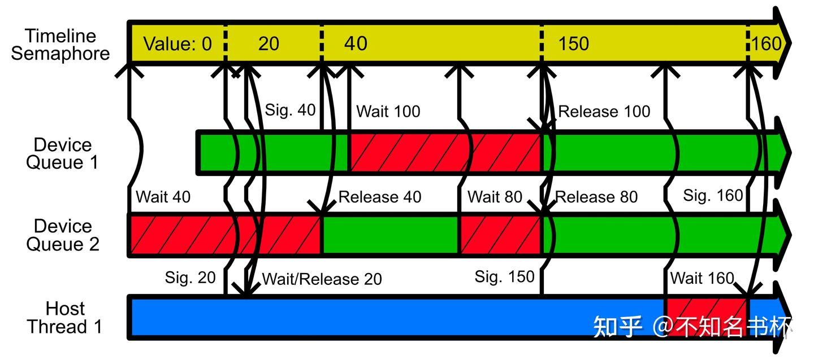

还有就是Binary Semaphore必须Signals和Wait的操作必须总是以一一对应，在Timeline Semaphore中无序一一对应，一个Signals可以和多个或者零个Wait对应并且重复使用前不需要重置等操作。如下图所示：

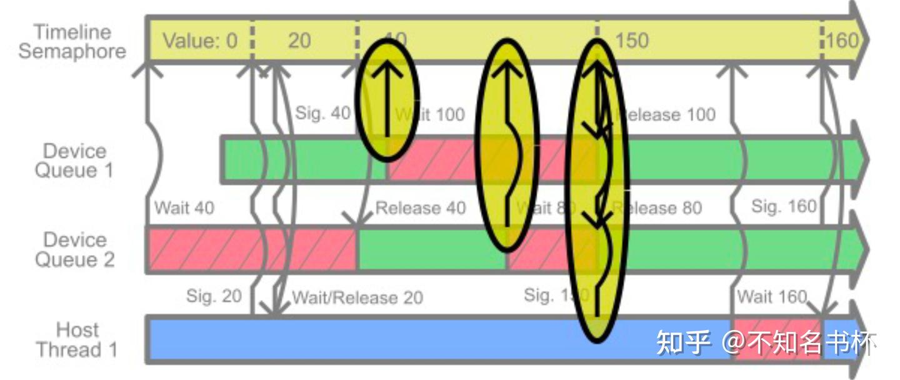

并且在Timeline Semaphore中的CPU/GPU Wait操作可以在在Signal操作之前，不需要额外的锁来保护提交/等待顺序。如下所示：

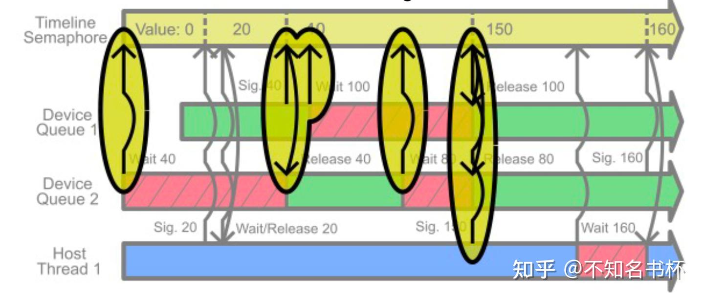

并且在Timeline Semaphore中后续的Signal操作不会影响到已有的/对之前Signal的Wait操作。简单来说Timeline Semaphore解决了Binary Semaphore现存的不少问题，并且增加了对于CPU和GPU之间的同步的功能甚至可以代替VkFence，现在来看看怎么使用Timeline Semaphore吧。

### 创建和使用Timeline Semaphore

和之前的Binary Semaphore创建方式大致相同，也是通过填充VkSemaphoreCreateInfo结构体然后通过vkCreateSemaphore方法来真正的创建一个Semaphore。但是创建Timeline Semaphore还需要额外填充一个VkSemaphoreTypeCreateInfo结构体来创建，并且通过pNext传递到vkCreateSemaphore中。如下所示：

- semaphoreType是一个VkSemaphoreType类型的字段，用来表现创建的Semaphore类型。

- - VK_SEMAPHORE_TYPE_BINARY：代表这是一个Binary Semaphore。
  - VK_SEMAPHORE_TYPE_TIMELINE：代表是一个Timeline Semaphore。

- initialValue是一个uint64_t类型，用来指定Timeline Semaphore中计数器的初始值。

```cpp
typedef struct VkSemaphoreTypeCreateInfo {
    VkStructureType    sType;
    const void*        pNext;
    VkSemaphoreType    semaphoreType;
    uint64_t           initialValue;
} VkSemaphoreTypeCreateInfo;
```

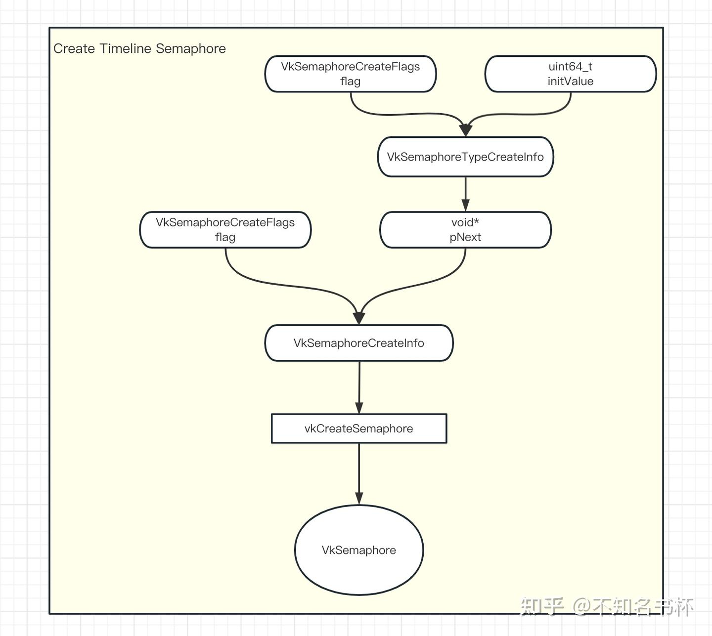

在这里已经创建了一个Timeline Semaphore了，在这里Vulkan还扩展了VkTimelineSemaphoreSubmitInfo结构体替代在VkSubmitInfo中关于Binary Semaphore的设置。如下所示：

- waitSemaphoreValueCount是在pWaitSemaphoreValues中指定的所有Wait值的数量。
- pWaitSemaphoreValues是一个指向在pWaitSemaphores中对应的Semaphores的 Wait值数组的指针。
- signalSemaphoreValueCount是pSignalSemaphoreValues中指定所有Singal值的数量。
- pSignalSemaphoreValues是一个指向数组signalSemaphoreValueCount值的指针，用于VkSubmitInfo::pSignalSemaphores中的相应的Semaphores，以便在做出Signal时设置相应大小。

当然如果在VkSubmitInfo中pWaitSemaphores或者pSignalSemaphores指定的不是用VK_SEMAPHORE_TYPE_TIMELINE的VkSemaphoreType创建的Semaphore；则该VkTimelineSemaphoreSubmitInfo会被忽略，并且VkTimelineSemaphoreSubmitInfo会被填充到VkSubmitInfo的pNext才可使用。

```cpp
typedef struct VkTimelineSemaphoreSubmitInfo {
    VkStructureType    sType;
    const void*        pNext;
    uint32_t           waitSemaphoreValueCount;
    const uint64_t*    pWaitSemaphoreValues;
    uint32_t           signalSemaphoreValueCount;
    const uint64_t*    pSignalSemaphoreValues;
} VkTimelineSemaphoreSubmitInfo
```

下面就是一个使用Timeline Semaphore的例子，在这里设置了必须要等待timelineSemaphore中的计数器为2后本次Queue提交才可以开始执行,Queue执行完毕后便会将timelineSemaphore中的计数器设置为3。

```cpp
const uint64_t waitValue = 2; // Wait until semaphore value is >= 2
const uint64_t signalValue = 3; // Set semaphore value to 3

VkTimelineSemaphoreSubmitInfo timelineInfo;
timelineInfo.sType = VK_STRUCTURE_TYPE_TIMELINE_SEMAPHORE_SUBMIT_INFO;
timelineInfo.pNext = NULL;
timelineInfo.waitSemaphoreValueCount = 1;
timelineInfo.pWaitSemaphoreValues = &waitValue;
timelineInfo.signalSemaphoreValueCount = 1;
timelineInfo.pSignalSemaphoreValues = &signalValue;

VkSubmitInfo submitInfo;
submitInfo.sType = VK_STRUCTURE_TYPE_SUBMIT_INFO;
submitInfo.pNext = &timelineInfo;
submitInfo.waitSemaphoreCount = 1;
submitInfo.pWaitSemaphores = &timelineSemaphore;
submitInfo.signalSemaphoreCount  = 1;
submitInfo.pSignalSemaphores = &timelineSemaphore;
submitInfo.commandBufferCount = 0;
submitInfo.pCommandBuffers = 0;

vkQueueSubmit(queue, 1, &submitInfo, VK_NULL_HANDLE);
```

由于Timeline Semaphore还支持在CPU和GPU之间完成同步，所以Timeline Semaphore还需要满足在CPU侧也能够做到Singal操作，可以通过vkSignalSemaphore来完成，需要填充VkSemaphoreSignalInfo结构体，

- semaphore用来指定需要操作哪一个Timeline Semaphore。
- value被用来指示将Timeline Semaphore计数器中的值改为多少。

```cpp
typedef struct VkSemaphoreSignalInfo {
    VkStructureType    sType;
    const void*        pNext;
    VkSemaphore        semaphore;
    uint64_t           value;
} VkSemaphoreSignalInfo;

VkSemaphoreSignalInfo signalInfo;
signalInfo.sType = VK_STRUCTURE_TYPE_SEMAPHORE_SIGNAL_INFO;
signalInfo.pNext = NULL;
signalInfo.semaphore = timelineSemaphore;
signalInfo.value = 2;

vkSignalSemaphore(dev, &signalInfo);
```

为了CPU和GPU之间的同步，Timeline Semaphore还提供堵塞CPU侧执行的方法是vkWaitSemaphores，可以通过vkWaitSemaphores来阻止CPU侧的继续往下执行，表现上和VkFence一致。

- semaphoreCount是一个uint32_t字段，代表需要等待的Timeline Semaphore数量是多少

- pSemaphores是指向VkSemaphore的数组指针。

- pValues是指向uint64_t数组指针，这个和pSemaphores中的VkSemaphore一一对应，代表每个Timeline Semaphore的Wait值。

- flags是一个VkSemaphoreWaitFlags字段，代表其vkWaitSemaphores等待的策略。

- - VK_SEMAPHORE_WAIT_ANY_BIT指定的Semaphore等待条件是在pSemaphores中至少有一个Semaphore达到了pValues中相应元素指定的值。如果没有设置VK_SEMAPHORE_WAIT_ANY_BIT，那么Semaphore等待条件是pSemaphores中的所有Semaphore都达到了由pValues的相应元素指定的值。

```cpp
typedef struct VkSemaphoreWaitInfo {
    VkStructureType         sType;
    const void*             pNext;
    VkSemaphoreWaitFlags    flags;
    uint32_t                semaphoreCount;
    const VkSemaphore*      pSemaphores;
    const uint64_t*         pValues;
} VkSemaphoreWaitInfo;

const uint64_t waitValue = 1;
VkSemaphoreWaitInfo waitInfo;
waitInfo.sType = VK_STRUCTURE_TYPE_SEMAPHORE_WAIT_INFO;
waitInfo.pNext = NULL;
waitInfo.flags = 0;
waitInfo.semaphoreCount = 1;
waitInfo.pSemaphores = &timelineSemaphore;
waitInfo.pValues = &waitValue;
vkWaitSemaphores(dev, &waitInfo, UINT64_MAX);
```

还可以在CPU侧查询当前Timeline Semaphore中计数器的值，通过vkGetSemaphoreCounterValue方法来查询。

```cpp
uint64_t value;
vkGetSemaphoreCounterValue(dev, timelineSemaphore, &value)
```

### 总结

总的来说Timeline Semaphore可以大大代替Fence在于CPU侧同步的地位以及需要跟踪的同步对象的数量，从而减少CPU侧的停顿和应用程序的复杂性，这反过来应该提高性能和质量。并且更加灵活了并且简化了许多事情。所以Vulkan官方也是建议多多使用Timeline Semaphore来代替之前的Binary Semaphore以及Fence概念。但是Timeline Semaphore也存在着一点限制，目前Vulkan的WSI[交换链](https://zhida.zhihu.com/search?content_id=227039634&content_type=Article&match_order=1&q=交换链&zhida_source=entity)并不支持Timeline Semaphore的操作，也就是vkQueuePresentKHR和vkAcquireNextImageKHR都还是只能用Binary Semaphore来操作。但是这并不是什么特别大的问题。还有一个问题操作系统对于Timeline Semaphore支持还不太广泛。这个需要注意。

### Pipeline Barrier优化

在实践中如何优化Pipeline Barrier的使用呢？那么首先是Pipeline Barrier它的作用什么？

- 保证执行依赖：Pipeline Barrier可以做到的是保证多个Command之间的执行依赖，主要是通过设置srcStageMask和dstStageMask指定Command之间需要等待某个Pipeline Stage执行完毕后，下一条Command的某些Pipeline Stage才可以开始运行。例如一个RenderPass将数据渲染到纹理上，而随后的RenderPass使用[顶点着色器](https://zhida.zhihu.com/search?content_id=227039634&content_type=Article&match_order=1&q=顶点着色器&zhida_source=entity)从这个纹理中中读取数据，那么GPU必须等待上一个Command的片段着色器和ROP工作完成，然后再启动后续RenderPass中的顶点工作。大多数Barrier将导致某些Pipeline Stage的执行停滞。
- 保证内存依赖：Pipeline Barrier可以做到的是保证多个Command之间操作的内存依赖，主要是刷新或者无效GPU侧Cache并等待内存写入的完成，以确保另一个阶段可以读取结果的工作。主要是通过设置srcAcessMask和dstAcessMask指定Command之间需要等待某个内存操作执行完毕后，下一条Command的某些内存操作才可以开始执行。并且不是所有的Pipeline Barrier都有内存依赖，这一点需要注意。
- 转换资源的存储格式保证目标单元兼容，这个是在之前没有讲到的，最常见的是对资源存储进行解压。例如某些架构上的MSAA纹理是以压缩形式存储的，每个像素都有一个Sample Mask，表明这个像素包含多个Sample本身的Color，还有一个单独的Sample Data。Transfer或者Shader阶段可能无法直接从压缩纹理中读取，所以从VK_IMAGE_LAYOUT_COLOR_ATTACHMENT_OPTIMAL过渡到VK_IMAGE_LAYOUT_SHADER_READ_ONLY_OPTIMAL或VK_IMAGE_USAGE_TRANSFER_SRC_BIT的Barrier可能需要解压纹理，将所有像素的所有Sample写入内存。大多数Barrier操作不需要这样做，但那些需要这样做的操作可能是非常损耗性能的。

现在我们已经知道使用Pipeline Barrier的时候GPU会发生什么了，请注意GPU的行为当然取决于具体的供应商和不同的架构，但是将抽象的Barrier映射到更具体的结构中，有助于理解其性能影响。现在来了解如何最优的使用Pipeline Barrier。

### Barrier 合批

当为每个单独的Command生成Barrier的时候，开发者只对Barrier有一个局部信息，而对之前或未来的Barrier信息并不了解。正因为如此第一条重要的规则是Barrier需要尽可能积极地批次处理。比如在一个需要保证像素着色器读取的纹理是内存可见并且ImageLayout是正确的，给定一个Barrier它意味着像素着色器阶段执行的等待和L2 Texture Cache的刷新，驱动程序会在你每次调用vkCmdPipelineBarrier时中插入这个Barrier。如果在一次vkCmdPipelineBarrier调用中指定了多个资源，驱动程序将只生成一个L2 Texture Cache刷新命令从而降低了成本。下图就是合批Barrier和非合批Barrier的差距所示。对整体的渲染执行影响还是挺大的，这造成了挺多的Pipeline气泡。


### 合理设置Barrier

在Barrier中需要设置srcStageMask和dstStageMask，当然还有srcAcessMask和dstAcessMask。需要合理设置这些Stage。以确保两个Command之间的执行的并行度最高。例如最常见的Barrier类型之一是将一个资源从VK_IMAGE_LAYOUT_COLOR_ATTACHMENT_OPTIMAL过渡到VK_IMAGE_LAYOUT_SHADER_READ_ONLY_OPTIMAL。在指定这个Barrier时应该通过dstStageMask指定实际读取这个资源的着色器阶段，但是其他的阶段都可以并行，也可以将指定StageMask为VK_PIPELINE_STAGE_ALL_COMMANDS_BIT以支持计算着色器或顶点着色器的读取。然而这样做将意味着来自后续绘制命令的顶点着色器工作都会被堵塞住，这是有问题的也会造成Pipeline气泡影响效率。

并且在没有依赖的Command之间最好不要插入Barrier，而是将其并发执行充分拉满GPU的占用率。如下图所示，分别是不合理的Barrier插入会导致什么情况。

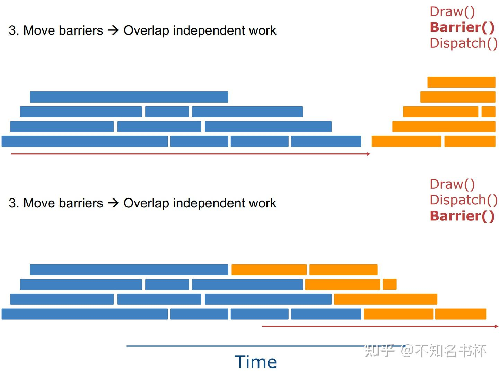

### 使用Event代替Pipeline Barrier

在某些情况下Pipeline Barrier设置的都很正确，但是Pipeline Barrier的控制粒度还不够导致Pipeline的并行度不够，比如这个例子一个ShadowPass被用来生成ShadowMap，后续的MainScenePass需要依赖该ShadowPass的ShadowMap生成完毕后才可以进入像素着色器阶段。在这里通过插入一个Pipeline Barrier来表达其依赖关系。假如这个时候有一个单独的计算Command需要执行，但指定一个Pipeline Barrier只能保证前面有依赖关系的两个Command先执行完，这会完全耗尽GPU的计算工作，全部执行完毕之后再用计算Command填满GPU的工作负载。在这里Pipeline Barrier并不能满足需求并且导致了Pipeline气泡。所以在这个场景下我们可以通过Event来代替Pipeline Barrier。比如在ShadowPass写入ShadowMap的操作完成后使用vkCmdSetEvent，并在MainScenePass中的读操作开始前使用vkCmdWaitEvents，这样计算Command就可以在这中间执行。当然在vkCmdSetEvent之后立即使用vkCmdWaitEvents会适得其反，而且会比vkCmdPipelineBarrier更慢。相反应该尝试重组你的算法，确保在Set和Wait之间有足够的工作提交，这样当GPU需要处理Wait时，Event很可能已经完成Signal操作，则不会有效率损失。反而能够提高GPU占用率。如下图所示。

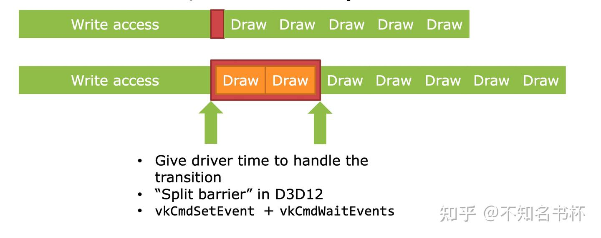

### 合理的ImageLayout

在使用Pipeline Barrier的场景中还有不少的情况是被用来当做Layout Transition使用比如使用ImageMemroyBarrier，一个正确的ImageLayout的选择也很重要，在某些情况下也许可以调整处理方式使其首先Image不需要解压，例如将工作移到不同的Pipeline Stage。当然应该注意的是资源解压可能发生在完全没有必要的情况下，并且是过度指定Barrier的结果。例如如果你渲染到一个包含Depthbuffer的Framebuffer，并且在未来从不读取Depth数据的情况下。你应该把Depthbuffer留在VK_IMAGE_LAYOUT_DEPTH_STENCIL_OPTIMAL中，而不是不必要地把它过渡到VK_IMAGE_LAYOUT_SHADER_READ_ONLY_OPTIMAL中。这可能会触发解压浪费性能。(因为驱动程序不知道你将来是否会读取该资源!）

### 获取更多上层帧信息

上面说了这么多的建议，但是在实际很难做到这些。问题主要出在你很难获得到全部资源或者流程的依赖关系。比如为了确保Pipeline Stage和Layout Transition被合理设置，了解资源在未来的使用情况是非常重要的。如果你想在RenderPass结束后设置一个Pipeline Barrier，如果没有这些前置信息，一般会被迫设置一个dstPipelineStage为VK_PIPELINE_STAGE_ALL_COMMANDS_BIT的的Barrier以及一个ImageLayout比如GENERAL等，这将造成性能浪费。

为了解决这个问题，很诱人的做法是在资源被读取之前就设置Barrier，因为这时有可能知道资源是如何被使用的。然而很难完成上面提到的合批Barrier的操作。例如在一个有A、B、C三个RenderPass的帧中，C在两个单独的DrawCall中读取A的输出和B的输出，为了尽量减少Texture Cache的刷新次数和其他Barrier工作，一般来说在C读取A和B输出之前指定一个Pipeline Barrier，正确对A和B的输出完成Layout Transition是有益的。相反的情况是在C的每个DrawCall之前都有一个Barrier来。在某些情况下使用Event代替Barrier可以减少相关的成本，但一般来说一个一个Barrier会过于昂贵。

此外使用即时Barrier需要跟踪资源状态并且了解之前的ImageLayout设置。这在多线程系统中很难正确做到，因为只有在所有Command被记录和线性化之后，才能知道GPU上的最终执行顺序。由于上述问题许多现代渲染器开始尝试使用Frame Graph作为声明性地指定帧资源之间所有依赖关系的方法。基于由此产生的DAG结构，可以帮助建立正确的Barrier包括在多个Queue中同步工作所需的Barrier，并以最小的物理内存使用量分配瞬时资源(也就是Memory Alias)。

这也就是最早在Frostbite在GDC中分享的Frame Graph。Frame Graph由RenderPass以及其依赖的Resource组成。RenderPass定义了一个完整的渲染操作，Resource 包括了RenderPass使用的 PSO、Texture、RenderTarget、ConstantBuffer、Shader 等资源。每个 RenderPass 都有 Input 和 Output资源，这样 RenderPass 和 Resource 就形成了有向非循环图(DAG)结构，因为描述的是引擎在一帧内的渲染流程，所以称之为 Frame Graph。也就是可以获得到所有的资源依赖关系和RenderPass。所以拥有足够信息来做一些Barrier优化。如下图所示，可以对不同时间点的Barrier向前搜寻前面资源的Barrier，找到这些Barrier的共同时间点，迁移后面Barrier到同一时间点执行合批Barrier提高效率。

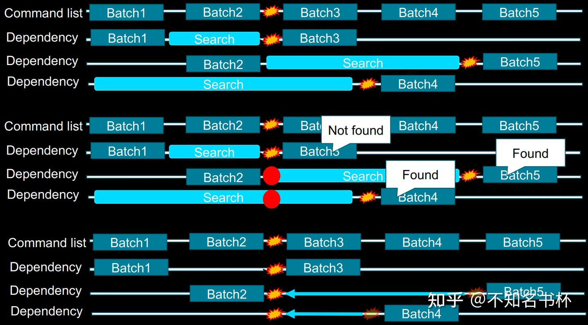

关于Frame Graph更多内容在这里并不展开这个内容，可看笔者关于FrameGraph的文章

[不知名书杯：理解FrameGraph87 赞同 · 5 评论文章](https://zhuanlan.zhihu.com/p/639001043)

## 总结

在本篇文章当中主要是讲述了Vulkan中最难的同步的基础概念和各个同步原语，在Vulkan中想用好同步可不简单(加上Spec关于同步相关的不讲人话问题)，可以说Vulkan同步是精髓所在，能够同步到极致也就是能够榨干GPU极致的性能。并且Vulkan有着最多的同步原语并且有着更细粒度的控制能力。使得让人理解Vulkan的同步成为了难题。在关于同步怎么优化的时候还是要用好Synchronization Validation和各家的Profile，这能够帮助你debug哪些同步点并不合理。这篇还是花了很多时间的，希望可以帮助到大家。

## References

[Vulkan synchronisation and graphics-compute-graphics hazards: Part 2 - Imagination](https://blog.imaginationtech.com/vulkan-synchronisation-and-graphics-compute-graphics-hazards-part-2/)

[Vulkan synchronisation and graphics-compute-graphics hazards: Part I - Imagination Developers](https://blog.imaginationtech.com/vulkan-synchronisation-and-graphics-compute-graphics-hazards-part-i)

[Vulkan synchronisation and graphics-compute-graphics hazards: Part 2 - Imagination](https://blog.imaginationtech.com/vulkan-synchronisation-and-graphics-compute-graphics-hazards-part-2/)

[Vulkan® Barriers Explained](https://gpuopen.com/learn/vulkan-barriers-explained/)

[游戏引擎随笔 0x07：现代图形 API 的同步](https://zhuanlan.zhihu.com/p/100162469)

[Yet another blog explaining Vulkan synchronization](http://themaister.net/blog/2019/08/14/yet-another-blog-explaining-vulkan-synchronization/)

[Understanding Vulkan Synchronization](https://www.khronos.org/blog/understanding-vulkan-synchronization)

[剖析虚幻渲染体系（13）- RHI补充篇：现代图形API之奥义与指南 - 0向往0 - 博客园](https://www.cnblogs.com/timlly/p/15680064.html%231343-synchronization)

[https://github.com/David-DiGioia/vulkan-diagrams](https://github.com/David-DiGioia/vulkan-diagrams)

[Vulkan: Command Type & Ordering](https://zhuanlan.zhihu.com/p/470261316)

[https://github.com/KhronosGroup/Vulkan-Docs/issues/1815](https://github.com/KhronosGroup/Vulkan-Docs/issues/1815)

[关于 Vulkan Tutorial 中同步问题的解释](https://zhuanlan.zhihu.com/p/350483554)

[Writing an efficient Vulkan renderer](https://zeux.io/2020/02/27/writing-an-efficient-vulkan-renderer/%23fn:6)

[游戏引擎随笔 0x11：现代图形 API 特性的统一：Attachment Fetch](https://zhuanlan.zhihu.com/p/131392827)

[Vulkan-Samples/samples/performance/pipeline_barriers at main · KhronosGroup/Vulkan-Samples](https://github.com/KhronosGroup/Vulkan-Samples/tree/main/samples/performance/pipeline_barriers)

