# 理解FrameGraph

## 前言

本文是关于Frame Graph的学习和理解，希望可以帮助其他同学学习此概念。

## 为什么需要Frame Graph？

渲染管线在游戏引擎当中是指完成一帧渲染流程逻辑。这将包括了游戏引擎所支持的渲染Feature以及资源管理等等。在游戏引擎中这些一般都是固化下来的，比如游戏引擎中的Forward或者Deferred Render Path，这些大部分游戏引擎都会支持。当然还有各种后处理Feature(比如Blomm或者DOF等等)。这些都是固化在游戏引擎中，但是随着越来越多的渲染需求来说，现在这种将渲染管线固化在游戏引擎的做法无法满足现有需求并且十分不灵活并难以扩展。这些可以以下几点体现：

- 首先现在游戏的渲染风格就很多样，比如偏写实或者偏卡通或者是每个游戏都有着各自的风格化渲染等，这种固化的渲染管线将无法满足多种不同的风格化渲染的需求。需要更好[扩展性](https://zhida.zhihu.com/search?content_id=230131324&content_type=Article&match_order=1&q=扩展性&zhida_source=entity)才能够满足开发者的需求。
- 硬件差异的问题，现在游戏大多都会多平台上线包括PC和移动端乃至是主机，但是每个硬件差异很大包括硬件Feature支持程度的不同以及GPU架构差异导致的优化手段和侧重点不同。在固化的渲染管线当中将会出现大量的[条件编译](https://zhida.zhihu.com/search?content_id=230131324&content_type=Article&match_order=1&q=条件编译&zhida_source=entity)和路径选择来适配不同平台，这将导致整体渲染管线的维护越来越难。对于移动端来说，由于硬件和图形API的限制不可能达到 PC 和主机相同的画质，并且由于 CPU\GPU 架构不同，整体渲染流程也和PC和主机有所差异。需要不同的渲染管线才可以在移动端平台上获得最大的性能。这些也都需要灵活可配置的渲染管线来支持。
- 在之前在游戏引擎中已经内置的Forward和Deferred Render Path，但是现在各种Render Path正在飞速的发展，比如后续的Foward+以及对应的Tile Base Deferred，还有Clustered Forward以及Clustered Deferred这些不同的Render Path，那么对应的渲染管线也需要修改，整体的维护成本也很高。

复杂的渲染系统如下所示，在这一套渲染系统中[耦合](https://zhida.zhihu.com/search?content_id=230131324&content_type=Article&match_order=1&q=耦合&zhida_source=entity)相当严重导致维护、扩展和合并/整合的成本很高。并且这一套渲染管线功能繁多十分复杂，一旦出了Bug并难以定位。如果需要扩展新的功能的话，需要修改大量的代码导致难以维护。

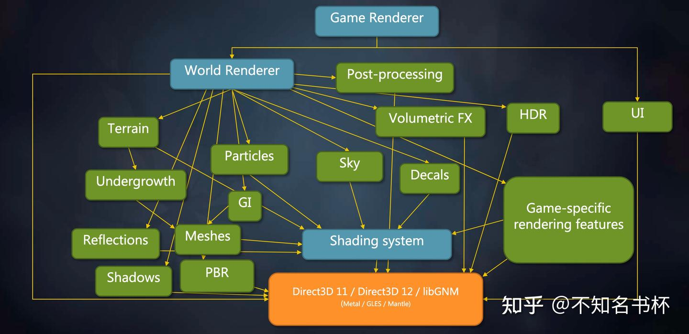

并且之前的渲染架构对于现代图形API是不合适的，比如是执行模型(同步和异步)/多线程/内存模型(现代图形API可以自己完成[内存管理](https://zhida.zhihu.com/search?content_id=230131324&content_type=Article&match_order=1&q=内存管理&zhida_source=entity))问题等等。现代图形API向开发者开放了相当多的能力，如果这些全部向游戏开发者开放这些细节，这些细节将淹没无数的开发者。游戏引擎作为抹平这些信息的中间层，也需要一个新的渲染架构来面对现代图形API的挑战。所以游戏引擎非常有必要实现一种机制可以良好地掌控现代图形API带来的性能优势，并且尽量隐藏现代图形API的复杂性并且让整体渲染架构更加可扩展和便于调试。

## 什么是Frame Graph？

首先Frame Graph是建立在现代图形API之上，Frame Graph是一个新的渲染框架并在GDC2017中由Frostbite提出，Frame Graph由RenderPass和以及Resource构成。其中RenderPass的概念和Vulkan基本是一致它们都是一份元数据定义了一个完整的渲染流程需要用到的所有资源。Resource则代表了RenderPass使用的 Pipeline State Object、Texture、RenderTarget、ConstantBuffer、Shader等资源。每个RenderPass都会指定对应的Input和Output资源，这样RenderPass和Resource就形成了[有向非循环图](https://zhida.zhihu.com/search?content_id=230131324&content_type=Article&match_order=1&q=有向非循环图&zhida_source=entity)（DAG）结构。并且Frame Graph可以获得一帧的所有的信息，所以也被成为Frame Graph。如下图所示：

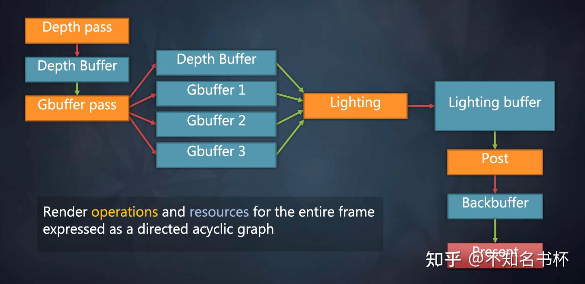

并且由于Frame Graph有着完整一帧的全部信息，可以通过分析的各个RenderPass之间依赖关系来完成一些优化的操作。由于RenderPass和Resource的依赖关系是一个DAG的形式也可以很方便的做到可视化，这将对现代游戏的复杂渲染管线的调试来说有着很大的帮助。并且拥有一帧的完整信息可以帮助简化渲染管线的配置，允许渲染模块更加独立和高效。

拥有完整的一帧的所有信息还可以帮助解决一个在现代图形API中棘手的问题那就是同步，首先拥有所有的Pass信息可以知道Pass之间的执行依赖关系以及它们各自的Input和Output资源可以确定其中的资源依赖。在这里就可以做很多关于Barrier的优化，可以合理按批次的处理Barrier。并且选择最优的同步点，保证并行度尽量高的方案以减少GPU侧的停顿。如下所示，在这里可以分析各个Pass的依赖关系，可以批次处理Barrier或者Resource的布局过渡的情况减少GPU的停顿。

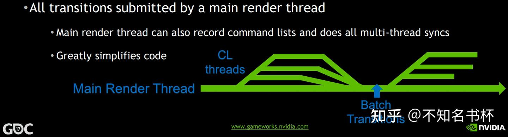

Frame Graph还可以很好的处理Async Compute，Async Compute也就是使用Computer Queue的来完成某些计算，并且Computer Queue是和Graphics Queue是并行的，两者互补干扰，这样就完成一些额外的计算逻辑(比如一些耗时的并且本帧用不到的数据，可以通过Async Compute提前计算)，如下所示可以同时计算一些SSAO相关的数据可以和其他的渲染命令并行，打满GPU侧的负载。

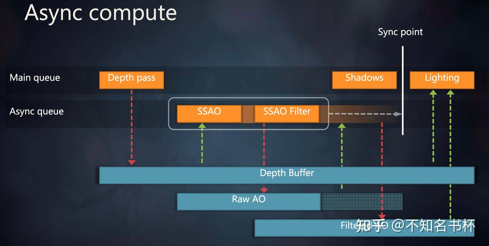

但是这就带来了同步的问题，因为将SSAO 与 SSAO Filter和MainPass异步执行，由于两个Pass异步执行就无法在异步执行的过程中对Raw AO进行内存回收。但是通过FrameGraph有一帧的完整信息也可以推导出相应依赖的关系，控制这个Sync Point放在另外一个Queue使用该资源的时机以获取最佳性能。并且这些资源的生命周期会被延长到这个Sync Point，保证数据的正确性。

此外Frame Graph还有Transient Resources System来帮助分配和调度资源，并且在现代图形API中可以利用其物理内存和[逻辑内存](https://zhida.zhihu.com/search?content_id=230131324&content_type=Article&match_order=1&q=逻辑内存&zhida_source=entity)相分离的特性通过Memory Aliasing充分复用物理内存以减少整体的内存占用。在这里可以通过例子来结合理解。如下所示，这是一些内存依赖关系，需要保证写后读内存可用，并且在读取前内存可见以避免读取到不正确的数据。并且这里用到三块不同的物理内存。

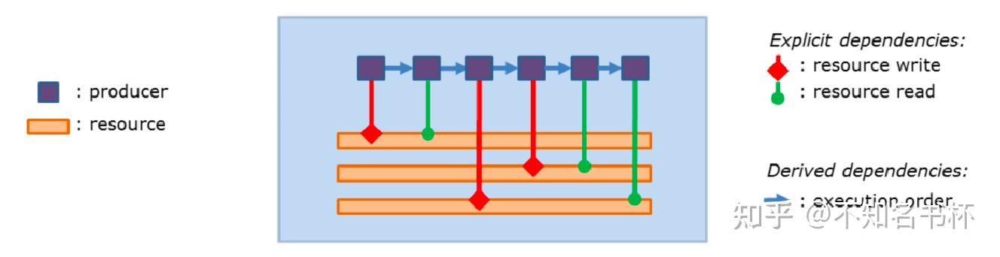

首先还是分析各个Pass之间的依赖关系，然后可以确定每个Resource生命周期的范围。如下所示可以看到有两块逻辑内存是可以通过使用Memory Aliasing来共用同一个物理内存的，这样就可以减少内存的占用。

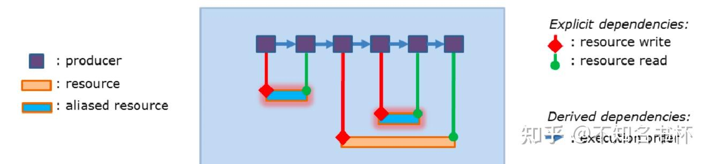

所以通过FrameGraph可以实现精确的自动化的资源跟踪和执行依赖以及内存依赖管理，自动跟踪资源生命周期以确定是否可以启用Memory Aliasing的选项，自动跟踪资源访问同步，用户也可以添加手动同步，以更好地匹配工作负载。如下所示：

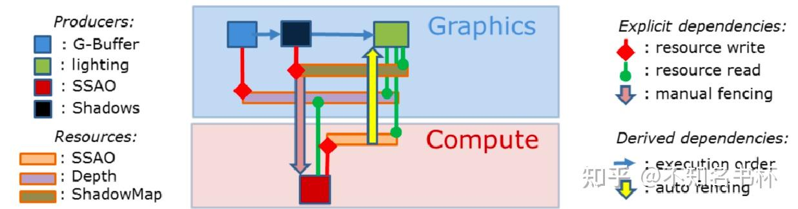

## Frame Graph 设计

Frame Graph的运行流程主要为三个阶段分别为Setup/Compile/Execute。如下所示：

- Setup 阶段：主要用于来收集RenderPass中定义Input和Output所使用的Resource。
- Compile 阶段：根据 Setup阶段获取的所定义的Resource来决定真正需要执行的[渲染命令](https://zhida.zhihu.com/search?content_id=230131324&content_type=Article&match_order=2&q=渲染命令&zhida_source=entity)，并且裁剪掉不被执行的命令所依赖资源等等。
- Execute 阶段：是真正执行渲染逻辑的阶段。在这个阶段可以直接调用图形API将渲染命令和 GPU 资源提交到GPU中完成真正的渲染。

如下图所示，接下来会详细介绍这每一步都做了什么。

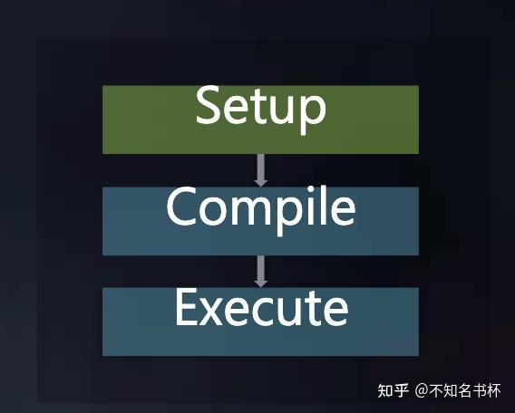

### Setup

Frame Graph是由多个RenderPass来组成的，并且通过RenderPass来组织整体渲染流程，这些RenderPass都需要定义Input和Output的Resource参数设置以及对这些Resource会做什么操作(读写操作等等)。每个RenderPass都需要在Frame Graph提前注册声明这些Resource，并且RenderPass只会使用本身声明过的Resource，其他Pass的输出数据对当前Pass应该是只读且数据安全性不可保证的，并且绝对不应该定义[全局静态数据](https://zhida.zhihu.com/search?content_id=230131324&content_type=Article&match_order=1&q=全局静态数据&zhida_source=entity)。如果一个Render Pass需要使用另一个Render Pass的数据，则必须调用[多线程系统](https://zhida.zhihu.com/search?content_id=230131324&content_type=Article&match_order=1&q=多线程系统&zhida_source=entity)使被依赖的Render Pass确保在依赖的Render Pass之前执行完毕以保证执行依赖和内存依赖的正确性。这些原则是保证Frame Graph是Code-driven甚至是[Data-driven](https://zhida.zhihu.com/search?content_id=230131324&content_type=Article&match_order=1&q=Data-driven&zhida_source=entity)的基础，在这里只会让逻辑跟逻辑之间相互依赖，而数据(比如内存数据)和相关逻辑解耦。

### 为什么这样处理？

定义好这些Resource的信息和操作是为了什么呢？因为并不希望开发者来手动管理这些Resource，如果需要手动管理这对于程序员来说无疑是痛苦的，尤其是管理这些Resource的同步，首先是基础做法是将这些同步即时处理，每当开始对Resource开始操作时都需要开发者问自己一个问题，那就是这个资源是否有需要同步来完成一些操作？ 如果是的话则立马处理。这种对于资源状态的跟踪显然会变得非常痛苦，因为可能会读取一个资源1000多次，但是只对它写一次，如果即时同步的话，这肯定消耗不少性能。并且在多线程的情况下如果两个线程发现需要一个Barrier怎么办？总有一个线程需要"赢"得这个资源，反而多了更多的跨[线程同步](https://zhida.zhihu.com/search?content_id=230131324&content_type=Article&match_order=1&q=线程同步&zhida_source=entity)情况需要处理。如果真的需要这样的同步的话等于开历史倒车(不是)。在OpenGL的驱动中这些优化已经做的很好了，为啥还需要自己再重新实现一遍？

另外一个问题是现代图形API让开发者自己显示控制每一个[同步点](https://zhida.zhihu.com/search?content_id=230131324&content_type=Article&match_order=2&q=同步点&zhida_source=entity)，这对于一些简单的渲染管线来说是没问题的，但是在渲染管线十分复杂的情况下，渲染管线会被分割成不同的部分，每当你在这里和那里添加了一个新Feature或者一些新的步骤，那么必须意识到需要重做你的同步策略。这是十分低效率的，并且会导致你的渲染管线难以扩展，这些都是难以接受的。

通过Frame Graph在RenderPass中提前声明这些Resource的状态和操作，所有Resource的管理全部交给Frame Graph。Frame Graph可以确定这个Resource的生命周期，什么时候会被回收或者拥有足够信息来判断是否可以使用Memory Aliasing来节省内存占用等等。通过这个Setup阶段，FrameGraph便可以获取到完整的一帧所有信息，可以利用这些信息来做到很多优化，可以推导Resource在最终创建时的各种参数，比如可以根据Input Resource的format/size来推导最佳的参数等等。

但是需要注意的是在Setup阶段这些Resource来说是没有真正申请对应的物理内存的。这里可能只是一个handle，当然有一些特例的存在，有些永久资源会直接通过API创建(包括不会改变的全局常量、每帧会复用的数据等等)，它们会被放入到Frame Graph中一起进行管理。

### [伪代码](https://zhida.zhihu.com/search?content_id=230131324&content_type=Article&match_order=1&q=伪代码&zhida_source=entity)

```cpp
RenderGraph graph;
graph.set_device(device);
AttachmentInfo emissive, albedo, normal, pbr, depth; 
// 设置这些Attachment的信息
.........
// 提前声明对应的light Pass
auto &lighting = graph.add_pass("lighting", VK_PIPELINE_STAGE_ALL_GRAPHICS_BIT);
// 声明所需要的
lighting.add_color_output("HDR", emissive, "emissive");
lighting.add_attachment_input("albedo");
lighting.add_attachment_input("normal");
lighting.add_attachment_input("pbr"));
lighting.add_attachment_input("depth");
lighting.set_depth_stencil_input("depth");
```

上面做的这些就是完成了一个简单的Setup阶段。定义好了对应的RenderPass以及Input和Output的Resource的状态和操作，如下所示：

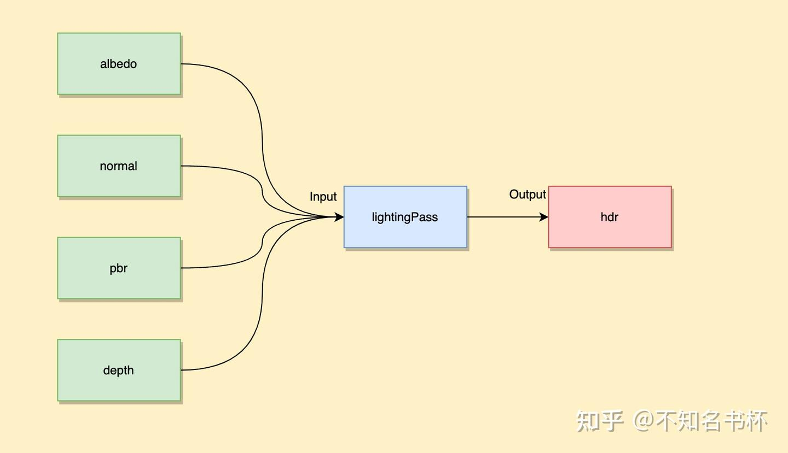

### Compile

在完成了Setup阶段之后接着就是Compile阶段，Compile阶段是不开放给开发者控制的并且所有工作全部都是自动完成。在Frame Graph中没有引用到Resource以及RenderPass都会被裁剪掉。首先这对于Setup阶段的各种设置可以稍微放宽一点，因为多余的Resource和RenderPass会被剔除掉并不会真正的进入渲染流程中。同时也简化了Debug流程，如下所示。在Frame Graph会有一个Debug模块，假如不需要的时候，这些Debug模块依赖的Resoruce和RenderPass都会被裁剪掉。当需要Debug时，只需要加上Move Pass，这样Lighting Pass和Post Pass和与之依赖Resoruce都会自动被裁剪掉，这会帮助更好的解耦每个Pass。

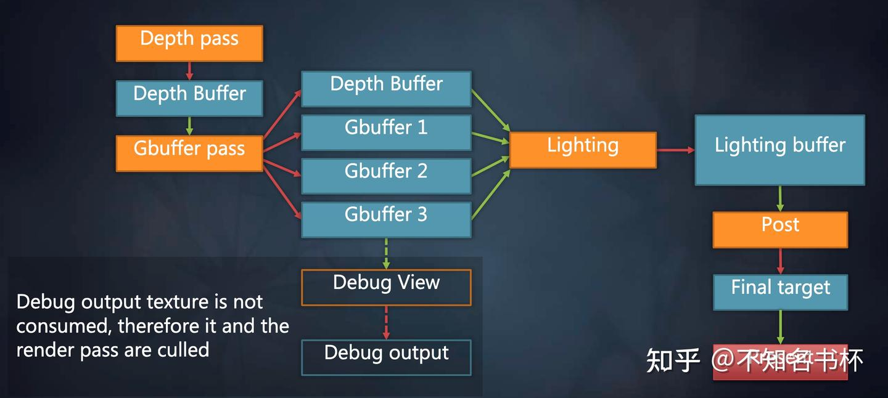

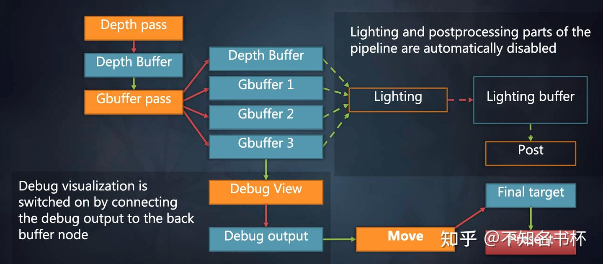

并且在Setup阶段中Frame Graph已经掌握了完整的一帧信息，还可以做到如下操作：

- 自动分析Setup阶段设置的Resource以及RenderPass参数是否合理，并且推导出在该Resource创建时的最佳参数设置。
- 自动分析各个Pass之间的依赖关系，自动进行可能的Pass的重新调度(Pass重排序或者Pass合并，比如在Tile Base中将其多个RenderPass视为为多个Subpass合并为一个RenderPass。这会在带宽上会获取到收益，这对于Tile Base的GPU至关重要)。
- 检查同步问题，在确保执行和内存依赖关系正确的前提，寻找最优同步点，提高整体图形管线的并行度以减少GPU侧的停顿。
- 自动分析Resource的生命周期，确定其Resource释放时机，可以判断是否可用于Memory Aliasing来复用物理内存。

### Execute

到了Execute阶段反而是最简单的了。在完成Compile阶段之后，在Execute阶段只需要申请好真正GPU内存并且调用各个Pass的Execute函数即可(也就是调用各种set State以及Draw或者Dispatch各种命令)。但是在这个阶段就需要创建真正的GPU资源了。

## FrameGraph实现

关于FrameGraph的实现部分，可以参考笔者的其他文章。

[不知名书杯：FrameGraph实现(一)24 赞同 · 0 评论文章](https://zhuanlan.zhihu.com/p/639806366)

[不知名书杯：理解FrameGraph实现(二)16 赞同 · 0 评论文章](https://zhuanlan.zhihu.com/p/649610416)

## 总结

Frame Graph总的来说像是DSL语言一样，开发者这只需要定义好这些Pass希望执行的渲染逻辑和各个Pass使用到的Resource。其他的都可以一概不管都可以交给Frame Graph来完成，Frame Graph最后会编译成能够在现代图形API上正确运行的代码一样。其实也就是再加了一层抽象层(计算机届的银弹，不够就在加，加到够为止)。莫名的有一种将Opengl或者dx11中图形驱动做的事，重新搬到这一层实现了一样(实际并不是)。但是Frame Graph还是解决了很多问题的，如下所示：

- 构建了高层的[帧信息](https://zhida.zhihu.com/search?content_id=230131324&content_type=Article&match_order=2&q=帧信息&zhida_source=entity)，简化资源管理和管线配置。这或许是后续走向渲染管线走向Date-Drivern的基础。
- 解决了之前的固化渲染管线的不能够灵活扩展的问题，现在Frame Graph中各个RenderPass之间互相解耦，可以进行复用。方片运行编写独立的高性能渲染模块。
- Frame Graph能够对于整体渲染流程提供一个可视化操作，可以让渲染流程更加的直观，更加方便去Debug一个极其复杂的渲染管线。可以随意改变渲染流程以供Debug及其他需求。
- 解决现代图形API棘手的同步问题，通过高层帧信息能够很好的寻找最佳同步点。

但是Frame Graph也不是万能的，有一些特殊的需求还是需要通过全局设置来开洞决定并不能将在一个RenderPass的范围内解决。并且Frame Graph关于在Compile阶段如何得出一个更好的渲染流程，这是一个很大的问题。这还需要在实践中不断摸索以寻找更好的优化方式。并且对于Frame Graph的Compile阶段的实现只有具体思路而没有实践，可能每个引擎的实现都不相同，如何寻找一个较优解是个难题。可以多看看不同的引擎是怎么处理的，相信应该能给我们很多的灵感。

业界已经有很多的游戏引擎都已经用上了Frame Graph，比如Unreal或者是[育碧](https://zhida.zhihu.com/search?content_id=230131324&content_type=Article&match_order=1&q=育碧&zhida_source=entity)的Anvil Next当然还有寒霜啦 (不过有些都改了名，比如Render Graph)。后续也会补充一个Frame Graph实现相关的文章(先挖一个坑)。

## References

[游戏引擎随笔 0x03：可扩展的渲染管线架构](https://zhuanlan.zhihu.com/p/70668533)

[Render graphs and Vulkan — a deep dive](https://link.zhihu.com/?target=https%3A//themaister.net/blog/2017/08/15/render-graphs-and-vulkan-a-deep-dive/)

[FrameGraph|设计&基于DX12实现](https://zhuanlan.zhihu.com/p/147207161)

[极简 Frame Graph](https://zhuanlan.zhihu.com/p/618401627)

[Render Graph in DirectX 12](https://zhuanlan.zhihu.com/p/101318415)

[FrameGraph: Extensible Rendering Architecture in Frostbite](https://link.zhihu.com/?target=https%3A//www.gdcvault.com/play/1024612/FrameGraph-Extensible-Rendering-Architecture-in)

