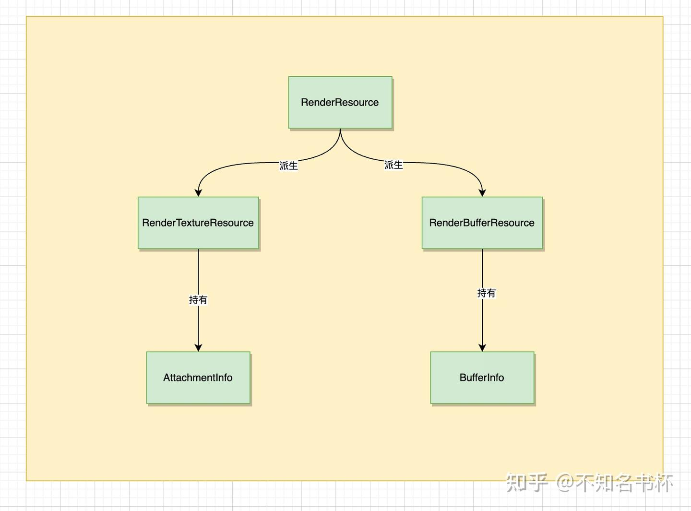
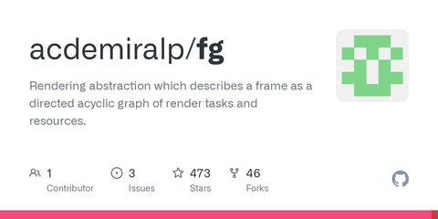
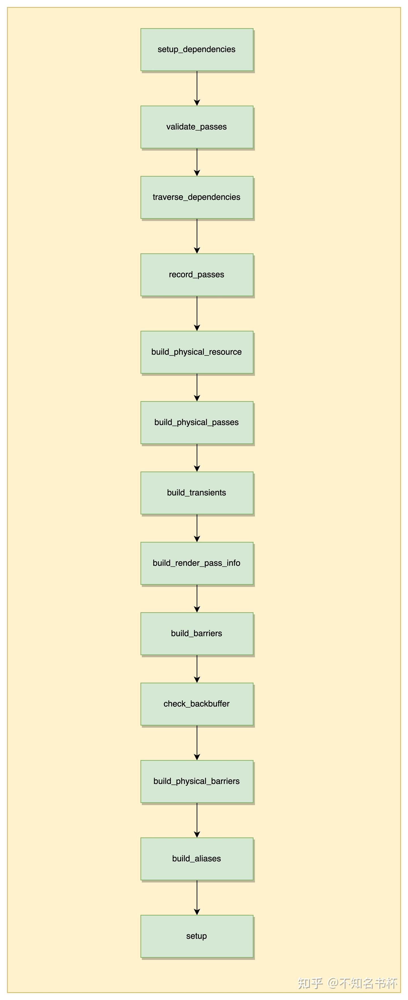

# 理解FrameGraph实现(一)

## 前言

本文是关于Granite中FrameGraph实现细节的记录，希望可以帮助到同学们理解FrameGraph的实现。关于FrameGraph是什么，可以参考笔者上一篇文章。

[不知名书杯：理解FrameGraph87 赞同 · 5 评论文章](https://zhuanlan.zhihu.com/p/639001043)

并且Granite的Frame Graph还是只围绕Vulkan作为后端来实现的。所以部分概念会比较贴近于Vulkan，如果没有相关Vulkan基础读起来可能会一头雾水，建议看看笔者之前有关Vulkan的文章。

[不知名书杯：Vulkan文章汇总169 赞同 · 7 评论文章](https://zhuanlan.zhihu.com/p/616082929)

## Frame Graph实现

Frame Graph实现是Granite的，该仓库链接如下：

[https://github.com/Themaister/Granitegithub.com/Themaister/Granite](https://link.zhihu.com/?target=https%3A//github.com/Themaister/Granite)

关于Frame Graph的代码主要集中在render_graph.hpp以及render_graph.cpp这两个文件内。建议大家还是对照源码来阅读哦。

### RenderResource

首先来看看如何来封装Resource概念。整体结构如下所示：



RenderTextuerResource/RenderBufferResource由RenderResource派生而来，对应到Texture和Buffer。Attachment和BufferInfo也就是是Resource本身的属性设置(比如Buffer的size或者是usage，再者是Texture的format和usage等，在这不多赘述)。接下来看看RenderResource是如何设计的吧。

```cpp
enum RenderGraphQueueFlagBits
{
    RENDER_GRAPH_QUEUE_GRAPHICS_BIT = 1 << 0,
    RENDER_GRAPH_QUEUE_COMPUTE_BIT = 1 << 1,
    RENDER_GRAPH_QUEUE_ASYNC_COMPUTE_BIT = 1 << 2,
    RENDER_GRAPH_QUEUE_ASYNC_GRAPHICS_BIT = 1 << 3
};

class RenderResource
{
public:
    enum class Type
    {
        Buffer,
        Texture,
        Proxy
    };
    enum { Unused = ~0u };
    RenderResource(Type type_, unsigned index_)
        : resource_type(type_), index(index_)
    virtual ~RenderResource() = default;
    Type get_type() const
    void written_in_pass(unsigned index_)
    void read_in_pass(unsigned index_)
    const std::unordered_set<unsigned> &get_read_passes() const
    const std::unordered_set<unsigned> &get_write_passes() const
    std::unordered_set<unsigned> &get_read_passes()
    std::unordered_set<unsigned> &get_write_passes()
    unsigned get_index() const
    void set_physical_index(unsigned index_)
    unsigned get_physical_index() const
    void set_name(const std::string &name_)
    const std::string &get_name() const
    void add_queue(RenderGraphQueueFlagBits queue)
    RenderGraphQueueFlags get_used_queues() const

private:
    Type resource_type;
    unsigned index;
    unsigned physical_index = Unused;
    std::unordered_set<unsigned> written_in_passes;
    std::unordered_set<unsigned> read_in_passes;
    std::string name;
    RenderGraphQueueFlags used_queues = 0;
};
```

在这里来解释各个对象属性和方法的各自作用如下：

- written_in_passes和written_in_pass() 方法主要是用于记录该RenderResource被多少的RenderPass执行写操作，每个RenderPass调用written_in_pass()传入的index都是独一无二的，会持续递增。
- read_in_passes和read_in_pass()和上面written_in_passes功能基本一致，不过记录的是该RenderResource被哪些RenderPass执行读操作。
- type：代表的是该Resource的类型主要分为三种Buffer/Texture/Proxy(用于Async Compute)，可通过get_type()获取，构造RenderResource后便不可修改。
- name：代表是该Resource的名称，RenderGraph有一个map容器来管理所有的RenderResource，并且会根据name来获取到对应RenderResource。通过set_name()和get_name()操作该字段。
- index：代表是该RenderResource的索引，在构造RenderResource对象会被传入该index(每多创建一个RenderResource，构造时传入的index会递增)，可通过get_index()获取。
- used_queues：代表是该Resource将被用于的操作，如果是被用于Async Computer或者Graphics，对应的used_queues也会不同。
- physical_index：代表是该RenderResource的索引，后续用于获取对应的ResourceDimensions。

RenderResource基本设计就是如此，可以看出Frame Graph的一些设计原则了，首先是确定了Resource的用途，在不同的RenderPass当中可能会有不同的操作(读或写)。并且使用了一个used_queues字段来区分会被什么形式使用，如果是被使用于Async Computer，那么该Resource的生命周期可能需要被延长。RenderBufferResource和RenderTextureResource也只是衍生出容纳各自Buffer或者Texture信息的相关方法和容器。

### ResourceDimensions

```cpp
struct ResourceDimensions
{
    VkFormat format = VK_FORMAT_UNDEFINED;
    BufferInfo buffer_info;
    unsigned width = 0;
    unsigned height = 0;
    unsigned depth = 1;
    unsigned layers = 1;
    unsigned levels = 1;
    unsigned samples = 1;
    AttachmentInfoFlags flags = ATTACHMENT_INFO_PERSISTENT_BIT;
    VkSurfaceTransformFlagBitsKHR transform = VK_SURFACE_TRANSFORM_IDENTITY_BIT_KHR;
    RenderGraphQueueFlags queues = 0;
    VkImageUsageFlags image_usage = 0;
     bool operator==(const ResourceDimensions &other) const{
		return format == other.format &&
		       width == other.width &&
		       height == other.height &&
		       depth == other.depth &&
		       layers == other.layers &&
		       levels == other.levels &&
		       buffer_info == other.buffer_info &&
		       flags == other.flags &&
		       transform == other.transform;
		// image_usage is deliberately not part of this test.
		// queues is deliberately not part of this test.
     }

}
```

顾名思义这个结构用来表达RenderResource的尺寸或者是说维度，为什么需要一个这样的结构体呢？这是因为后续会将所有的RenderResource都处理为ResourceDimensions。这也是为后续的Memory Ailas做准备，因为不同资源的逻辑内存并不相同，但是只要对应的ResourceDimensions相同，则代表所示的物理内存的大小也是相同，这便是Memory Alias的基础。注意这里image_usage和queues并不在ResourceDimensions是否相等的判断内。

### RenderPass

在RenderPass中主要处理各种Resource的设置和各种[回调函数](https://zhida.zhihu.com/search?content_id=230309940&content_type=Article&match_order=1&q=回调函数&zhida_source=entity)的设置，以便后续在Compile阶段中的操作。

```cpp
class RenderPass
{
public:
    RenderPass(RenderGraph &graph_, unsigned index_, RenderGraphQueueFlagBits queue_)
        : graph(graph_), index(index_), queue(queue_)

    enum { Unused = ~0u };

    RenderTextureResource &set_depth_stencil_input(const std::string &name);
    RenderTextureResource &set_depth_stencil_output(const std::string &name, const AttachmentInfo &info);
    RenderTextureResource &add_color_output(const std::string &name, const AttachmentInfo &info, const std::string &input = "");
    RenderTextureResource &add_resolve_output(const std::string &name, const AttachmentInfo &info);
    RenderTextureResource &add_attachment_input(const std::string &name);
    RenderTextureResource &add_history_input(const std::string &name);
    RenderTextureResource &add_texture_input(const std::string &name,
                                             VkPipelineStageFlags2 stages = 0);
    RenderTextureResource &add_blit_texture_read_only_input(const std::string &name);
    RenderBufferResource &add_uniform_input(const std::string &name,
                                            VkPipelineStageFlags2 stages = 0);
    RenderBufferResource &add_storage_read_only_input(const std::string &name,
                                                      VkPipelineStageFlags2 stages = 0);
    RenderBufferResource &add_storage_output(const std::string &name, const BufferInfo &info, const std::string &input = "");
    RenderBufferResource &add_transfer_output(const std::string &name, const BufferInfo &info);
    RenderTextureResource &add_storage_texture_output(const std::string &name, const AttachmentInfo &info, const std::string &input = "");
    RenderTextureResource &add_blit_texture_output(const std::string &name, const AttachmentInfo &info, const std::string &input = "");
    RenderBufferResource &add_vertex_buffer_input(const std::string &name);
    RenderBufferResource &add_index_buffer_input(const std::string &name);
    RenderBufferResource &add_indirect_buffer_input(const std::string &name);
    void add_proxy_output(const std::string &name, VkPipelineStageFlags2 stages);
    void add_proxy_input(const std::string &name, VkPipelineStageFlags2 stages);
    void add_fake_resource_write_alias(const std::string &from, const std::string &to);
    RenderBufferResource &add_generic_buffer_input(const std::string &name,
                                                       VkPipelineStageFlags2 stages,
                                                       VkAccessFlags2 access,
                                                       VkBufferUsageFlags usage);

private:
    RenderGraph &graph;
    unsigned index;
    unsigned physical_pass = Unused;
    RenderGraphQueueFlagBits queue;
    RenderPassInterfaceHandle render_pass_handle;
    std::function<void (Vulkan::CommandBuffer &)> build_render_pass_cb;
    std::function<bool (VkClearDepthStencilValue *)> get_clear_depth_stencil_cb;
    std::function<bool (unsigned, VkClearColorValue *)> get_clear_color_cb;
    std::vector<RenderTextureResource *> color_outputs;
    std::vector<RenderTextureResource *> resolve_outputs;
    std::vector<RenderTextureResource *> color_inputs;
    std::vector<RenderTextureResource *> color_scale_inputs;
    std::vector<RenderTextureResource *> storage_texture_inputs;
    std::vector<RenderTextureResource *> storage_texture_outputs;
    std::vector<RenderTextureResource *> blit_texture_inputs;
    std::vector<RenderTextureResource *> blit_texture_outputs;
    std::vector<RenderTextureResource *> attachments_inputs;
    std::vector<RenderTextureResource *> history_inputs;
    std::vector<RenderBufferResource *> storage_outputs;
    std::vector<RenderBufferResource *> storage_inputs;
    std::vector<RenderBufferResource *> transfer_outputs;
    std::vector<AccessedTextureResource> generic_texture;
    std::vector<AccessedBufferResource> generic_buffer;
    std::vector<AccessedProxyResource> proxy_inputs;
    std::vector<AccessedProxyResource> proxy_outputs;
    RenderTextureResource *depth_stencil_input = nullptr;
    RenderTextureResource *depth_stencil_output = nullptr;
    std::vector<std::pair<RenderTextureResource *, RenderTextureResource *>> fake_resource_alias;
    std::string pass_name;
};
```

可以看出RenderPass的整体设计，在RenderPass主要用于处理各种RenderResource状态并存入对应的容器当中。并且在RenderPass还有诸多回调函数，将在不同的时机被调用，如下所示：

- build_render_pass_cb： 相当于Frame Graph中的每个RenderPass的Execute函数，会执行具体的渲染逻辑(Draw/Dispatch 命令等等)。
- get_clear_depth_stencil_cb： 用于设置该RenderPass的VkClearDepthStencilValue值。
- get_clear_color_cb： 用于设置该RenderPass的VkClearColorValue值。

### RenderPassInterface

关于这些回调函数内部还封装了一个RenderPassInterface对象用于设置各种回调函数以便于复用。如下所示：

```cpp
class RenderPassInterface : public Util::IntrusivePtrEnabled<RenderPassInterface,
        std::default_delete<RenderPassInterface>,
        Util::SingleThreadCounter>
{
public:
    virtual ~RenderPassInterface() = default;
    // This information must remain fixed.
    virtual bool render_pass_is_conditional() const;
    virtual bool render_pass_is_separate_layered() const;
    // Can change per frame.
    virtual bool need_render_pass() const;
    virtual bool get_clear_depth_stencil(VkClearDepthStencilValue *value) const;
    virtual bool get_clear_color(unsigned attachment, VkClearColorValue *value) const;
    // Called once before bake().
    virtual void setup_dependencies(RenderPass &self, RenderGraph &graph);
    // Called once after bake().
    virtual void setup(Vulkan::Device &device);
    // Called every frame, useful for building dependent resources like custom views, etc.
    virtual void enqueue_prepare_render_pass(RenderGraph &graph, TaskComposer &composer);
    virtual void build_render_pass(Vulkan::CommandBuffer &cmd);
    virtual void build_render_pass_separate_layer(Vulkan::CommandBuffer &cmd, unsigned layer);
};
```

- render_pass_is_conditional被用于判断是否要启用Alias。
- render_pass_is_separate_layered 和 build_render_pass_separate_layer都是和MultiView的情况下有关，在这不过多赘述。
- need_render_pass用于判断最后是否需要将该RenderPass提交给GPU去执行。
- get_clear_depth_stencil 和 get_clear_color 和上面的提到的get_clear_depth_stencil_cb和get_clear_color_cb类似，不再赘述。
- setup_dependencies是在bake()执行之前会被调用。
- setup则是在bake()执行完毕后会被调用。
- build_render_pass和build_render_pass_separate_layer则是对应到每个RenderPass的Execute函数，执行对应的渲染逻辑。

### RenderPass操作

RenderPass中处理各种Resource的状态，主要可以分为两种分别是add_xxx_input和add_xxx_output(还有一个特殊是Depth/Stencil的设置，因为在一个RenderPass中只会有一个固定的Depth/Stencil的Input和Output，所以是单独的set_depth_stencil_input和set_depth_stencil_output)。各个函数中的操作(下方演示都只是一个通用操作，某些特别RenderResource的还有其他逻辑在这不一一展示)如下所示：

### add_xxx_input

**Texture**

```cpp
auto &res = graph.get_texture_resource(name);
res.add_queue(queue);
res.read_in_pass(index);
res.add_image_usage(usage);
XXXX_inputs.push_back(&res);
return res;
```

**Buffer**

```cpp
auto &res = graph.get_buffer_resource(name);
res.add_queue(queue);
res.read_in_pass(index);
res.add_buffer_usage(usage);
XXXX_inputs.push_back(&res);
return res;
```

### add_xxx_output

**Texture**

```cpp
auto &res = graph.get_texture_resource(name);
res.add_queue(queue);
res.written_in_pass(index);
res.set_attachment_info(info);
res.add_image_usage(usage);
XXXX_outputs.push_back(&res);
return res;
```

**Buffer**

```cpp
auto &res = graph.get_buffer_resource(name);
res.add_queue(queue);
res.set_buffer_info(info);
res.written_in_pass(index);
res.add_buffer_usage(usage);
XXXX_outputs.push_back(&res);
return res;
```

### RenderGraph

现在到了RenderGraph(Frame Graph这个名字不得人心，大多引擎实现时都重新改名为了RenderGraph)，完成了RenderResourceResource和RenderPass的封装。以下是RenderGraph的一些重要属性和方法(其他的方法将在RenderGraph的具体执行中介绍)。

```cpp
class RenderGraph : public Vulkan::NoCopyNoMove, public EventHandler
{
public:
    RenderGraph();

    void set_device(Vulkan::Device *device_)
    {
        device = device_;
    }

    Vulkan::Device &get_device()
    {
        assert(device);
        return *device;
    }
    RenderPass &add_pass(const std::string &name, RenderGraphQueueFlagBits queue);
    RenderPass *find_pass(const std::string &name);
    RenderTextureResource &get_texture_resource(const std::string &name);
    RenderBufferResource &get_buffer_resource(const std::string &name);
    void set_backbuffer_source(const std::string &name);
    void bake();
    void reset();
    void log();
    void enqueue_render_passes(Vulkan::Device &device, TaskComposer &composer);
private:
    Vulkan::Device *device = nullptr;
    std::vector<std::unique_ptr<RenderPass>> passes;
    std::vector<std::unique_ptr<RenderResource>> resources;
    std::unordered_map<std::string, unsigned> pass_to_index;
    std::unordered_map<std::string, unsigned> resource_to_index;
    std::vector<std::unordered_set<unsigned>> pass_dependencies;
    std::vector<std::unordered_set<unsigned>> pass_merge_dependencies;
    std::string backbuffer_source;
};
```

- add_pass()会返回一个RenderPass对象，所有的RenderPass都通过passes容器中来管理，RenderPass的索引和name的映射关系将通过pass_to_index来存储。如果pass_to_index中没有对应name，则会创建新的RenderPass。
- get_texture_resource()和get_buffer_resource()负责获取对应的RenderResource，所有的RenderResource都会存储在resources容器，RenderResource和name的关系将通过resource_to_index来存储。如果resource_to_index中没有对应name，则会创建新的RenderResource。
- 在这里还有一个特殊的点，RenderGraph负责分配Resource和调用这些回调，并最终以适当的顺序将其提交给GPU。但是Render Graph同样需要一个终点，在这里会将一个特定的资源提升为backbuffer用于最后的给SwapChain去展示。可通过set_backbuffer_source来设置，backbuffer_source存储其RenderResource的name。
- bake()也就是代表Frame Graph中整个Compile阶段的工作。这也是后续讲解的重点。
- enqueue_render_passes()会真正开启向GPU提交Command的流程，每个RenderPass的Exexcute函数也就在这里被调用。
- log()可以在bake()调用完毕之后输出所有相关的帧信息。

## RenderGraph执行流程

现在就到了重头戏了也就是RenderGraph[执行流程](https://zhida.zhihu.com/search?content_id=230309940&content_type=Article&match_order=2&q=执行流程&zhida_source=entity)，在这个部分可能不同引擎的实现都不一样。大家也可以多看看其他引擎的实现。应该也能学到不少。在这里先补充几个Frame Graph的库供大伙参考，如下所示：

[GitHub - acdemiralp/fg: Rendering abstraction which describes a frame as a directed acyclic graph of render tasks and resources.github.com/acdemiralp/fg](https://link.zhihu.com/?target=https%3A//github.com/acdemiralp/fg)

[https://github.com/azhirnov/FrameGraphgithub.com/azhirnov/FrameGraph](https://link.zhihu.com/?target=https%3A//github.com/azhirnov/FrameGraph)

[https://github.com/google/filamentgithub.com/google/filament](https://link.zhihu.com/?target=https%3A//github.com/google/filament)

下图是一张总览介绍了bake函数执行全流程，步骤可能比较多。接下来介绍各自都做了什么。



## 相关数据结构

### Barrier

在这里Barrier也就是可以理解为是Vulkan中的各种Barrier比如VkMemoryBarrier等等，但是在这里Barrier只是抽象了一部分，比如Barrier在VkMemoryBarrier可能只是代表srcStageMask和srcAccessMask或者是dstAccessMask和dstStageMask。只能代表一个过程(内存可见或者内存可用)，后续的Barriers才是代表Vulkan中的Pipeline Barrier。主要是分为了两个Barrier容器，分别是invalidate用于存储完成内存可见的过程(代表dstAccessMask和dstStageMask的参数设置)，另外一个flush用于存储完成内存可用的过程(代表srcStageMask和srcAccessMask的参数设置)。

```cpp
struct Barrier
{
    unsigned resource_index;
    VkImageLayout layout;
    VkAccessFlags2 access;
    VkPipelineStageFlags2 stages;
    bool history;
};

struct Barriers
{
    std::vector<Barrier> invalidate;
    std::vector<Barrier> flush;
};
```

- resource_index: 用于标记于是哪个RenderResource需要这些同步。
- layout：也就是该RenderResource后续对应的Layout，Layout Transition也是需要对内存进行读写的，所以需要Barrier来同步。
- access： 保证在某些操作之前内存可见或者是在某些操作后内存可用，根据你将它放在Barrier中srcAccessMask还是dstAccessMask中决定。
- stages： 用于保证其执行依赖的Pipeline Stage。

### PhysicalPass

首先RenderPass代表了一个渲染流程，但是在实际的Vulkan的VkRenderPass中实际上可能会有多个SubPass(最少一个)，实际上PhysicalPass也就是代表VkRenderPass，而RenderPass某种意义上其实是SubPass也可以是一个单独的VkRenderPass，这个转变取决于在什么环境。但是SubPass在移动端上比较重要，因为可以保持是在On Tile上完成渲染便可以节省很多的带宽。而在PC上两者相差不大。所以会尽可能将其合并处理。所以在这里会设计为拥有一个Subpass容器(里面包含一个或者多个Subpass)。

```cpp
struct PhysicalPass{
        std::vector<unsigned> passes;
        std::vector<unsigned> discards;
        std::vector<Barrier> invalidate;
        std::vector<Barrier> flush;
        std::vector<Barrier> history;
        std::vector<std::pair<unsigned, unsigned>> alias_transfer;

        Vulkan::RenderPassInfo render_pass_info;
        std::vector<Vulkan::SubpassInfo> subpasses;
        std::vector<unsigned> physical_color_attachments;
        unsigned physical_depth_stencil_attachment = RenderResource::Unused;

        std::vector<ColorClearRequest> color_clear_requests;
        DepthClearRequest depth_clear_request;

        std::vector<std::vector<ScaledClearRequests>> scaled_clear_requests;
        std::vector<MipmapRequests> mipmap_requests;
        unsigned layers = 1;
};
```

### ResourceState

用于表达每个RenderResource的状态，将在build_physical_barriers被用到。

```cpp
struct ResourceState
{
    VkImageLayout initial_layout = VK_IMAGE_LAYOUT_UNDEFINED;
    VkImageLayout final_layout = VK_IMAGE_LAYOUT_UNDEFINED;
    VkAccessFlags2 invalidated_types = 0;
    VkAccessFlags2 flushed_types = 0;

    VkPipelineStageFlags2 invalidated_stages = 0;
    VkPipelineStageFlags2 flushed_stages = 0;
};
```

## 相关数据容器

- pass_stack: 存储写入backbuffer以及相关依赖的pass
- pass_dependencies: 该容器根据pass中的index获取到unordered_[set容器](https://zhida.zhihu.com/search?content_id=230309940&content_type=Article&match_order=1&q=set容器&zhida_source=entity)，unordered_set其中包含是该Pass所依赖的其他Pass。
- pass_merge_dependencies: 该容器根据pass中的index获取到unordered_set容器，unordered_set其中包含是该Pass可以合并的pass(通过Subpass合并)。
- physical_dimensions：用于存储所有的ResourceDimensions的容器，通过RenderResource的physical_index来索引。
- swapchain_dimensions： 对应SwapChain的ResourceDimensions。
- physical_passes：储存PhysicalPass的容器，在后续会讲到。

## 执行流程

### setup_dependencies

首先先调用所有RenderPass的RenderPassInterfaceHandle::setup_dependencies。将在bake中所有的操作之前完成该函数。因为封装了RenderPassInterfaceHandle类作为更为状态化的回调函数，可以在多个Pass中复用。因此可以对RenderPassInterfaceHandle做一些扩展或者某些RenderPass在bake前需要做的通用操作都可以放置在setup_dependencies来完成。

### validate_passes

validate_passes的作用是对各个RenderPass的Resource设置检验以确保RenderPass的参数正确，首先是对ColorAttachment/BlitTexture/StorageBuffer/StorageTexture判断是Output和Input的Resource数量是否一致，还有Resolve Output的数量是否是Color Output数量一致，当然还少不了的Depth Stencil。随后是针对相应的设置进行检验，比如如果有Intput的Resource，对应的Output的Resource的设置需要保持一致(Texutre的尺寸和Buffer的size等属性)。这里有一个特殊设置，就是检查Color Input的尺寸是否与Color Output相匹配。如果它们不一致，就不直接做loadOp = LOAD，而是在RenderPass开始时做一个缩放的Blit操作。 这种情况下的loadOp变成了DONT_CARE。

### traverse_dependencies

首先是针对于backbuffer(最后用于展示的图片)有写入操作的RenderPass依次放入pass_stack。通过traverse_dependencies来分析每个Pass之间的依赖关系。通过depend_passes_recursive将递归遍历所有对本RenderPass所有Input Resource有过写入操作的RenderPass并将依赖Pass全部放入pass_stack中。并且统计各个Pass的依赖并放入pass_dependencies。并且针对Color/Input/Depth Attachment做检验以判断是否可以完成合并操作(RenderPass作为VkSubpass合并到一个VkRenderPass中)比不过记录在pass_merge_dependencies中。完成这些操作后pass_stack会按顺序存储所有Pass。但是现在pass_stack中有些Pass是会重复出现的，并且pass之间的顺序是反的(正常的应该是Pass→Pass→backbuffer)。

### depend_passes_recursive

将这个函数将通过written_passes来判断到该Pass依赖written_passes中所有Pass，并且如果特殊的Attachment比如(Color/Input/Depth)则需要额外记录到pass_merge_dependencies当中。并且将该Pass放入pass_stack当中，并且继续调用traverse_dependencies遍历该Pass。

### filter_passes

在这里将对上一步的生成的pass_stack做进一步的处理，清理pass_stack中重复的Pass并且倒置pass_stack。以保证pass_stack中的pass执行顺序是正确的，无依赖的Pass应该提前，有依赖其他Pass的Pass应该在前置Pass之后。

### reorder_passes

reorder_passes将对pass_dependencies和pass_merge_dependencies处理以分析出最好的Pass执行顺序。首先是针对pass_merge_dependencies处理，这会将需要合并的两个Pass，并且合并双方的前置Pass依赖。因为如果需要合并的话则需要两个Pass的所有前置依赖Pass都准备完毕。比如Pass1和Pass5可以合并，但是Pass1可能会依赖其他的Pass。在这里会为Pass5加上Pass1所依赖的Pass。

接下来就是开始Pass的重排序。[伪代码](https://zhida.zhihu.com/search?content_id=230309940&content_type=Article&match_order=1&q=伪代码&zhida_source=entity)如下所示：

```cpp
std::vector<unsigned> flattened_passes {begin(pass_stack)};
std::vector<unsigned> unscheduled_passes {begin(pass_stack)+1, end(pass_stack)};
while(!unscheduled_passes.empty()){
        unsigned best_candidate = 0;
        unsigned best_overlap_factor = 0;
        for (unsigned i = 0; i < unscheduled_passes.size(); i++){
                // 代表可以和其他pass重叠的程度
                unsigned overlap_factor = 0;
                if(pass_merge_dependencies[unscheduled_passes[i]].count(flattened_passes.back())){
                        overlap_factor = Math.max();
                }else{
                  // 判断在flattened_passes中的pass是否有依赖关系，无依赖关系则累加overlap_factor
                    for (auto itr = flattened_passes.rbegin(); itr != flattened_passes.rend(); ++itr)
                    {
                        if (depends_on_pass(unscheduled_passes[i], *itr))
                                break;
                                overlap_factor++;
                    }
                }
                // 不是最合适的话直接忽略
                if(overlap_factor<= best_overlap_factor){
                    continue;
                }
                // 判断该Pass是否和unscheduled_passes中之前的Pass有所依赖
                // 如果依赖则不可以选择
                bool possible_candidate = true;
                for (unsigned j = 0; j < i; j++)
                {
                    if (depends_on_pass(unscheduled_passes[i], unscheduled_passes[j]))
                    {
                        possible_candidate = false;
                        break;
                    }
                }

                if (!possible_candidate)
                    continue;
                best_candidate = i;
                best_overlap_factor = overlap_factor;
        }
        // 将在unscheduled_passes内对应best_candidate的Pass放入flattened_passes中。
        ..........
}
```

### build_physical_resources

在很多情况下，RenderPass对于一个RenderResource来说会有读写修改等操作，比如LightPass中收到一个名为Color的Input，但是输出的可能是名为HDR的Output，但是很显然其实这都是使用的同一个资源，只是用这种抽象的方式来弄清依赖关系，给RenderResource起一些描述性的名字，避免循环。所以在RenderResource中设置一个physical_index字段，并为那些做读-修改-写的RenderResource分配[唯一索引](https://zhida.zhihu.com/search?content_id=230309940&content_type=Article&match_order=1&q=唯一索引&zhida_source=entity)。

build_physical_resources处理的也就是RenderResource中的physical_index和physical_dimensions，在这里会遍历每一个RenderPass使用到所有的RenderResource。通过RenderResource获取到对应的ResourceDimension。并且设置其physical_index(每设置一个RenderResource将递增)，具体伪代码如下所示：

```cpp
for(auto &pass_index: pass_stack){
    auto &pass = *passes[pass_index];
    for (auto &input : pass.get_XXX_inputs()){
            // 如果成立则代表该RenderResource还没被使用过
            if (input.texture->get_physical_index() == RenderResource::Unused)
            {
                // 记录该ResourceDimension
                physical_dimensions.push_back(get_resource_dimensions(*input.texture));
                // 设置新的physical_index
                input.texture->set_physical_index(phys_index++);
            }
            else
            {
                // 用过的资源更新其queues以及image_usage
                physical_dimensions[input.texture->get_physical_index()].queues |= input.texture->get_used_queues();
                physical_dimensions[input.texture->get_physical_index()].image_usage |= input.texture->get_image_usage();
            }
            // 针对Color Input和Output或者Storage Texture Input和Output等等
            // Input和Outout共用同一个physical_index，因为本来就是同一个资源使用
            if (pass.get_XXX_outputs()[i]->get_physical_index() == RenderResource::Unused)
                        pass.get_XXX_outputs()[i]->set_physical_index(input->get_physical_index());
                    else if (pass.get_XXX_outputs()[i]->get_physical_index() != input->get_physical_index())
                        throw std::logic_error("Cannot alias resources. Index already claimed.");
    }

    for (auto &input : pass.get_XXX_outputs()){
            if (output->get_physical_index() == RenderResource::Unused)
            {
                physical_dimensions.push_back(get_resource_dimensions(*output));
                output->set_physical_index(phys_index++);
            }
            else
            {
                physical_dimensions[output->get_physical_index()].queues |= output->get_used_queues();
                physical_dimensions[output->get_physical_index()].image_usage |= output->get_image_usage();
            }
    }
}
```

### build_physical_passes

build_physical_passes主要是针对physical_pass中的passes完成填充。并且将会尝试多个RenderPass合并到一个PhysicalPass处理，后续将会将RenderPass作为SubPass处理以获取在移动端的带宽优势。接下来看看怎么判断一个RenderPass是否可以合并吧，在这里主要通过should_merge函数来判断。整体流程如下所示：

### shoule_merge

- 首先是上一个Pass的Color Output是否需要mipmap处理，如果需要则不可合并。

- 以下是关于能否使用VK_DEPENDENCY_BY_REGION_BIT的判断，除了Color/Depth/Input Attachment以外的依赖都不可以，会破坏Framebuffer Local的特性。

- - 判断上一个Pass的Color/Resolve/Storage Texture/Depth Stencil/ Blit Texture Output和下一个Pass的Generic Texture Input是否使用同一个RenderResource。
  - 判断上一个Pass的Generic Buffer Output和下一个Pass的Generic Buffer Input 是否使用同一个RenderResource。
  - 判断上一个Pass的StorageBuffer Output和下一个Pass的StorageBuffer Input 是否使用同一个RenderResource。
  - 判断上一个Pass的Blit Texture Output和下一个Pass的Blit Texture Input 是否使用同一个RenderResource。
  - 判断上一个Pass的Storage Texutre Output和下一个Pass的Storage Texutre Input 是否使用同一个RenderResource。
  - 判断上一个Pass的Color/Resolve/Storage Texture/Blit Texture Output和下一个Pass的ColorScale Input是否使用同一个RenderResource。

- 判断上一个Pass和下一个Pass的Depth Stencil Input或者Output 是否使用的不是同一个RenderResource。

- 判断上一个Pass的Storage Texture/Blit Texture Output和下一个Pass的Color Input是否使用的同一个RenderResource。

以上情况都是不可合并的情况，排除这些情况后，以下条件满足即可合并：

- 上一个Pass的Color/Resolve Output和下一个Pass的Color Input是否有重合，如有重合则可合并。
- 上一个Pass的Depth Stencil Output和下一个Pass的Depth Stencil Input是否有重合，如有重合则可合并。
- 上一个Pass的Color/Resolve/Depth Stencil Output和下一个Pass的Input Attachment是否有重合，如有重合则可合并。

通过should_merge将可以合并的Pass作为全部塞入physical_passes的pass，并且给处理完的physical_pass设置对应的physical_pass_index。到这里每个physical_pass已经包括一个或者多个的RenderPass。

### build_transients

build_transients将完成对于physical_dimensions中每个ResourceDimensions是否启用transients的判断。首先transients可以节省大量的内存使用，如果该Attachment在RenderPass开始时被需要被Clear或者是在RenderPass结束无需Store，那么该Attachment可以启用transients。比如正常的Depth Attachment或者是延迟渲染中的GBuffer，这将节省运行时的大量内存。这在移动端是很重要的，可以将内存完全存储在On-Chip内存并且使用完之后便可销毁可以大大减少带宽的损耗。

对physical_dimensions中的所有ResourceDimensions进行遍历，完成如下操作：

- 给所有的Buffer的ResourceDimensions取消其ATTACHMENT_INFO_INTERNAL_TRANSIENT_BIT标志，Buffer无需transients。
- 对于是历史帧RenderResource使用的ResourceDimensions取消其ATTACHMENT_INFO_INTERNAL_TRANSIENT_BIT，因为历史帧需要保存给其他Pass使用。
- 根据功能开关(用户自己控制)决定是否取消Color/Depth Stencil的ATTACHMENT_INFO_INTERNAL_TRANSIENT_BIT标志。

使用physical_pass_used容器用于存放每个RenderPass被哪个Pass引用(使用RenderResource的physical_pass字段作为索引)，随后遍历所有的RenderResource做如下操作：

- 判断是否是Texture资源或者该RenderResource有没有被写操作，如果满足这些情况则直接跳过不处理。
- 通过get_write_passes获取到所有对该Resource有写入的Pass，首先判断该Pass是否可用，如果可用并且physical_pass_used中的对应Resource内存储physical_pass可用，并且不等于当前遍历到的Pass则取消对应ResourceDimensions的transients标志，如果不是则设置physical_pass_used[]。
- 通过get_write_passes获取到所有对该Resource有读取的Pass，首先判断该Pass是否可用，如果可用并且physical_pass_used中的对应Resource内存储physical_pass可用，并且不等于当前遍历到的Pass则取消对应ResourceDimensions的transients标志。

### build_render_pass_info

在完成上面的步骤后已经能够清晰了解整体的RenderPass情况以及它们之间的依赖关系，build_render_pass_info完成对于所有physical_pass中render_pass_info填充，在这里会完成SubpassInfo、Color/Input/Resolve Attachment等数据的补充。具体结构如下所示：

```cpp
struct RenderPassInfo{
    std::vector<Attachment> color_attachments;
    Attachment *depth_stencil;
    unsigned num_color_attachments = 0;
    RenderPassOpFlags op_flags = 0;
    uint32_t clear_attachments = 0;
    uint32_t load_attachments = 0;
    uint32_t store_attachments = 0;
    uint32_t base_layer = 0;
    uint32_t num_layers = 1;
    VkRect2D render_area = { { 0, 0 }, { UINT32_MAX, UINT32_MAX } };
    VkClearColorValue clear_color[VULKAN_NUM_ATTACHMENTS] = {};
    VkClearDepthStencilValue clear_depth_stencil = { 1.0f, 0 };
    const SubpassInfo* subpasses = nullptr;
    unsigned num_subpasses = 0;
};

struct SubpassInfo
{
    std::vector<uint32_t> color_attachments;
    std::vector<uint32_t> input_attachments;
    std::vector<uint32_t> output_attachments;
    std::vector<uint32_t> color_resolve_attachments;
    bool disable_depth_stencil_attachment;
    uint32_t depth_stencil_resolve_attachment;
    VkResolveModeFlagBits depth_stencil_resolve_mode;
    std::string debug_name;
    // 代表了对应的处理
    DepthStencil depth_stencil_mode = DepthStencil::ReadWrite;
};
```

开始遍历每一个physical_pass，开始如下操作：

- 首先处理Color Attachment，通过SubPass的Color Output获取到对应的Color Attachment索引并且设置对应的color_attachments字段，还要判断该Color Attachment是不是首次被处理则还需要额外处理。额外处理为首先判断是否有对应的Color Input或者是Color Scale Input。如果两者都没有的话，则可以进行clear操作无需load。如果有Color input则需load，Color Scale Input则需额外处理。
- 接着处理Resolve Attachment，通过SubPass的Resolve Output获取到对应的Resolve Attachment索引并且设置对应的color_resolve_attachments字段。注意Resolve Attachment无需设置任何Load或者Clear操作，因为最后都会设置为Don’t Care。
- 接着DepthStencil Attachment，通过SubPass来填充depth_stencil_resolve_attachment字段，首先判断DepthStencil Input和Out是否都存在。首先是两者都存在的情况下，判断是否是首次使用，如果不是首次使用还需要加上Load操作，并且设置为Store因为其他的SubPass还会用到，并将该depth_stencil_mode设置为ReadWrite。只有DepthStencil Output的情况下，如果是首次使用DepthStencil Attachment则需要完成Clear操作。并且设置为Store因为其他的SubPass还会用到，并将depth_stencil_mode设置为ReadWrite。最后便是只有DepthStencil Input的情况下，如果是首次使用DepthStencil Attachment则需要完成Load操作并不需要设置为Store，这里还有一个需要注意的点，那就是这个假如是一个preserve_depth Pass的话则还需要设置为Store，因为后续的Pass会用到。并将depth_stencil_mode设置为ReadOnly。
- 最后处理Input Attachment，通过Subpass的Input Attachment索引来设置input_attachments字段，同样是首次使用需要先Load操作。

### build_barriers

对于一个RenderPass中的所有RenderResource都有可能会遇到以下三种情况：

- 需要Layout Transition，因为Layout Transition也是一个内存读写的操作，需要保证其内存可见。
- RenderPass被使用(发生读取和/或写入)，读取之前需要保证内存可见，写入之后需要保证内存可用。
- RenderPass在新的布局中结束有潜在的写入，需要保证内存可用。

所以针对这些情况为每一个RenderPass都准备一个Barriers对象，如果需要对一个资源需要读取修改并且写入的话则需要在invalidate和flush中各塞入一个Barrier，以保证内存依赖的正确性。

build_barriers将针对每个RenderPass的Input和Output RenderResource，首先是Input的RenderResource，伪代码如下所示，主要是处理不同Attacment加上不同的access以及stage字段。针对于Input的RenderResource主要是保证其内存可见以确保能够读取到最新的数据，也就是设置dstAccessMask和dstStageMask。

```cpp
Barriers barriers;
for (auto &input : pass.get_XXXX_inputs())
{
        // 通过get_invalidate_access
        auto &barrier = get_invalidate_access(input->get_physical_index(), false);
        // 不同的Input RenderResource处理
        ........
        if (barrier.layout != VK_IMAGE_LAYOUT_UNDEFINED){
                        throw std::logic_error("Layout mismatch.");
        }
        barrier.layout = input.layout;
}

// generic_buffer/generic_textures/proxy 处理
{
    // generic_buffer和generic_textures需要设置access。
    // proxy无需设置该access，因为proxy将使用semaphores来完成同步
    if(!proxy){
        barrier.access |= input.access;
    }
    barrier.stages |= input.stages;
}
// storage_buffer/storage_texture/history/blit_texture 处理
{
        if ((pass.get_queue() & compute_queues) == 0){
            // 这个是有问题，应该提供更加扩展的做法，直接强行设置为像素着色器阶段
            barrier.stages |= VK_PIPELINE_STAGE_FRAGMENT_SHADER_BIT; 
        } else{
            barrier.stages |= VK_PIPELINE_STAGE_COMPUTE_SHADER_BIT;
        }
        if(storage_buffer || storage_texture){
            barrier.access |= VK_ACCESS_2_SHADER_STORAGE_READ_BIT | VK_ACCESS_2_SHADER_STORAGE_WRITE_BIT;
        }else if (blit_texture){
            barrier.access |= VK_ACCESS_TRANSFER_WRITE_BIT;
            barrier.stages |= VK_PIPELINE_STAGE_2_BLIT_BIT;
        }
        else{
            // history通常作为纹理被采样，所以设置为SHADER_SAMPLED_READ。
            barrier.access |= VK_ACCESS_2_SHADER_SAMPLED_READ_BIT
        }
}
// input Attachment 处理
{
        barrier.access |= VK_ACCESS_INPUT_ATTACHMENT_READ_BIT;
        barrier.stages |= VK_PIPELINE_STAGE_FRAGMENT_SHADER_BIT;
        // 判断是不是Depth Stencil Attachment
        // 这里需要注意因为Input Attachment可能会被当做Color/Depth Attachment处理，所以要设置好对应的stage和acess。
        if (Vulkan::format_has_depth_or_stencil_aspect(input->get_attachment_info().format))
        {
            barrier.access |= VK_ACCESS_DEPTH_STENCIL_ATTACHMENT_READ_BIT;
            barrier.stages |= VK_PIPELINE_STAGE_EARLY_FRAGMENT_TESTS_BIT | VK_PIPELINE_STAGE_LATE_FRAGMENT_TESTS_BIT;
        }
        else
        {
            barrier.access |= VK_ACCESS_COLOR_ATTACHMENT_READ_BIT;
            barrier.stages |= VK_PIPELINE_STAGE_COLOR_ATTACHMENT_OUTPUT_BIT;
        }
        barrier.layout = VK_IMAGE_LAYOUT_SHADER_READ_ONLY_OPTIMAL;
}

// color Attachment 处理
{
        barrier.access |= VK_ACCESS_COLOR_ATTACHMENT_WRITE_BIT | VK_ACCESS_COLOR_ATTACHMENT_READ_BIT;
        barrier.stages |= VK_PIPELINE_STAGE_COLOR_ATTACHMENT_OUTPUT_BIT;
        // 如果Color Attachment同时被作为Input Attachment 则需要设置为VK_IMAGE_LAYOUT_GENERAL
        if (barrier.layout == VK_IMAGE_LAYOUT_SHADER_READ_ONLY_OPTIMAL)
            barrier.layout = VK_IMAGE_LAYOUT_GENERAL;
        else if (barrier.layout != VK_IMAGE_LAYOUT_UNDEFINED)
            throw std::logic_error("Layout mismatch.");
        else
            barrier.layout = VK_IMAGE_LAYOUT_COLOR_ATTACHMENT_OPTIMAL;
}
```

接下来是Output的处理，针对Output的RenderResource主要是保证其内存可用以保证其写入的数据刷新，也就是设置srcStageMask和srcAccessMask。

```cpp
for (auto &input : pass.get_XXXX_outputs())
{
        // 通过get_invalidate_access
        auto &barrier = get_flush_access(input->get_physical_index(), false);
        // 不同的Input RenderResource处理
        ........
        if (barrier.layout != VK_IMAGE_LAYOUT_UNDEFINED){
                        throw std::logic_error("Layout mismatch.");
        }
        barrier.layout = input.layout;
}
// color_output
{
            // 需要mipmap
            if ((physical_dimensions[output->get_physical_index()].levels > 1) &&
                (physical_dimensions[output->get_physical_index()].flags & ATTACHMENT_INFO_MIPGEN_BIT) != 0)
            {
                // 在这里应该是设置为0，但是为了解决验证层的检验问题，设置为VK_ACCESS_TRANSFER_READ_BIT
                barrier.access |= VK_ACCESS_TRANSFER_READ_BIT; 
                barrier.stages |= VK_PIPELINE_STAGE_2_BLIT_BIT;
                if (barrier.layout != VK_IMAGE_LAYOUT_UNDEFINED)
                    throw std::logic_error("Layout mismatch.");
                barrier.layout = VK_IMAGE_LAYOUT_TRANSFER_SRC_OPTIMAL;
            }
            else
            {
                // 保证写入Color Attachment的内存可用
                barrier.access |= VK_ACCESS_COLOR_ATTACHMENT_WRITE_BIT;
                barrier.stages |= VK_PIPELINE_STAGE_COLOR_ATTACHMENT_OUTPUT_BIT;
                // 因为可能要被作为Input Attachemnt所以设置为VK_IMAGE_LAYOUT_GENERAL
                if (barrier.layout == VK_IMAGE_LAYOUT_SHADER_READ_ONLY_OPTIMAL ||
                    barrier.layout == VK_IMAGE_LAYOUT_GENERAL)
                {
                    barrier.layout = VK_IMAGE_LAYOUT_GENERAL;
                }
                else if (barrier.layout != VK_IMAGE_LAYOUT_UNDEFINED)
                    throw std::logic_error("Layout mismatch.");
                else{
                    barrier.layout = VK_IMAGE_LAYOUT_COLOR_ATTACHMENT_OPTIMAL;
                }
            }
}
// storage_texture/storage_buffer/transfer
{
            if(transfer){
                barrier.access |= VK_ACCESS_TRANSFER_WRITE_BIT;
                barrier.stages |= VK_PIPELINE_STAGE_2_COPY_BIT | VK_PIPELINE_STAGE_2_CLEAR_BIT;
            }else{
              // 在Shader完成写入之后，保证其内存可用
                barrier.access |= VK_ACCESS_2_SHADER_STORAGE_WRITE_BIT;
            }

            if ((pass.get_queue() & compute_queues) == 0){
                barrier.stages |= VK_PIPELINE_STAGE_FRAGMENT_SHADER_BIT;
            } else{
                barrier.stages |= VK_PIPELINE_STAGE_COMPUTE_SHADER_BIT;
            }

}
```

还有关于Depth Stencil Input和Output的Barrier的相关设置，基本处理都大同小异，不再赘述。

### build_backbuffer

build_backbuffer完成backbuffer参数检查以防止SwapChain与backbuffer的尺寸不匹配。假如不一致的话后续还需要进行Blit操作做缩放。并且还需要判断backbuffer是否可以开启transients操作。只有backbuffer对应的ResourceDimensions本身带有transients标志并且backbuffer对应的ResourceDimensions和swapchain_dimensions保持一致才可以启用transients。

### build_physical_barriers

在之前的build_barriers中已经处理好每个RenderPass的Barrier，在介绍PhysicalPass中已经谈到过，一个PhysicalPass会包含多个RenderPass。在最后的Vulkan的VkRenderPass中RenderPass其实会被作为Subpass。所以RenderPass之间中的同步后续会通过VkSubpassDependency来解决。所以在这里关心的是在PhysicalPass中的第一个使用资源的RenderPass的invalidate Barrier以及资源最后一次被使用的Flush Barrier。

首先是遍历每个PhysicalPass中每个SubPass开始遍历，并且根据Barrier中的resource_index索引到physical_dimensions中具体的ResourceDimensions。

- 首先是遍历从invalidate Barrier开始，首先是ResourceDimensions启用了transients或者SwapChain相关的invalidate操作全部忽略。后续找到在PhysicalPass首次被使用的资源，设置相应的invalidated_types和invalidated_stages以及initial_layout，并且如果是该资源是StorageImage的话则会将initial_layout和final_layout都设置为VK_IMAGE_LAYOUT_GENERAL，在只读的情况下为了防止read after wirte的问题，需要让其他Pass知道在开始对资源进行写入之前，需要等待该Pass完成执行。实现的方法是执行一个access=0的flush Barrier，所以将flushed_types和flushed_stages都设置为0，也就代表了这里并没有写操作。这样便可以保证读取数据前内存可见，并没有其他的影响。
- 接着是遍历Flush Barrier，同样是ResourceDimensions启用了transients或者SwapChain相关的invalidate操作全部忽略。还是设置同一个ResourceState对应的flushed_types和flushed_stages字段。如果是该资源是StorageImage则将final_layout都设置为VK_IMAGE_LAYOUT_GENERAL。如果首次flush之前没有进行invalidate操作，则必须先进行invalidate操作。只有RenderPass中的首次flush需要一个匹配的invalidate操作。这是因为在只写的情况下，可以通过从UNDEFINED过渡来丢弃资源。然而仍然需要一个invalidate Barrier，因为需要在开始RenderPass之前完成Layout Transition，并且缓存需要被内存可见。所以只是在这里注入一个invalidate Barrier，layout和access与flush Barrier相同，其实也就是一个无效的Barrier。
- 通过遍历invalidate和flush，可以得到在PhysicalPass中被使用的所有资源的ResourceState。接着来填充PhysicalPass中的invalidate和flush容器。首先是判断该资源的final_layout和initial_layout是否是VK_IMAGE_LAYOUT_UNDEFINED，如果都是则直接忽略。然后可直接使用initial_layout和invalidated_types和invalidated_stages来填充invalidate容器，后续来填充flush，假如flushed_types是不为0，则使用final_layout和flushed_types和flushed_stages来填充，但是flushed_types为0但是invalidated_types不为0的情况下，将设置一个access为0，stage设置为对应invalidate操作保持一致的Barrier塞入flush中，这个flush Barrier的唯一目的是设置该资源作为本阶段的最后一次使用。

### build_aliases

现在便到了最后一步，在这里build_aliases将完成对于RenderResource在时间维度上是否可以alias的判断(也就是说在一帧当中会有多个资源在不同时间点上，考虑alias以减少内存占用)。

首先是遍历每一个RenderPass，做如下操作：

- 通过每个RenderPass所有的Input资源，获取到哪个RenderPass首次或者是最后读取这个资源。
- 通过每个RenderPass所有的Output资源，获取到哪个RenderPass首次或者是最后写入这个资源。
- 通过已经收集到的每个Resource的第一次和最后一次的读写操作的Pass。从第一个的资源开始做是否能够alias的判断，首先是Buffer或者历史帧资源是无需alias的。并且两个资源之间的Queue是必须是一致的才可alias，并且不建议Computer和Graphics之间跨Queue之间的alias,确保只在单一Queue下才可以alias。最后判断使用该Resource的Pass是否有交集即可。无交集即可alias。
- 最后来填充PhysicalPass中的alias_transfer容器，比如alias#0用于Pass#1和#2，alias#1用于Pass#3和#4，alias#2用于Pass#5和#7。在Pass#2结束时，与alias#0相关的障碍被复制到alias#1，并且layout被强制设置为UNDEFINED。当我们开始执行Pass#3时，将等待Pass#2完成，然后将Image过渡到新的布局。在Pass#4之后，alias#1会移交给alias#2，以此类推。Pass#7在下一帧中以类似 "环 "的方式将控制权交还给alias#0。

另一个考虑是增加alias可能会增加所需的Barrier数量，降低GPU的吞吐量。也许在这里需要更多的考虑alias带来的成本，至少如果在调用bake的时候知道你的VRAM大小，就能很好地知道RenderGraph的所有资源，是否真的需要alias。或者优化依赖图以获得最大的重叠度也大大减少了alias的机会，所以如果想把内存考虑进去，这个算法很容易就会变得更加复杂。

## 总结

本文主要是Granite针对于Frame Graph的部分实现细节进行解析，看得出来这是一个不小的工程量，不过能坚持下来应该对于Frame Graph有着更深的理解(还是推荐大家搞个源码自己一步一步调试)，并且在Granite的bake应该还是相对简易的处理(作者尽量还是想保持不要太复杂)，部分算法还有很多优化的空间。如果有兴趣的话可以看看其他的引擎是如何实现的(货比三家)，应该能够收获更多。剩下一部分关于多线程(是多线程菜鸡，得现学)以及 Execute部分还没有提起，后续争取再学一篇水文。本文如果有讲的不清楚或者不对的地方也请多多提问或者指正。

----- 2023.08.14-----
第二篇已出

[不知名书杯：理解FrameGraph实现(二)16 赞同 · 0 评论文章](https://zhuanlan.zhihu.com/p/649610416)

## References

[Render graphs and Vulkan — a deep dive](https://link.zhihu.com/?target=https%3A//themaister.net/blog/2017/08/15/render-graphs-and-vulkan-a-deep-dive/)

[FrameGraph: Extensible Rendering Architecture in Frostbite](https://link.zhihu.com/?target=https%3A//www.gdcvault.com/play/1024612/FrameGraph-Extensible-Rendering-Architecture-in)

