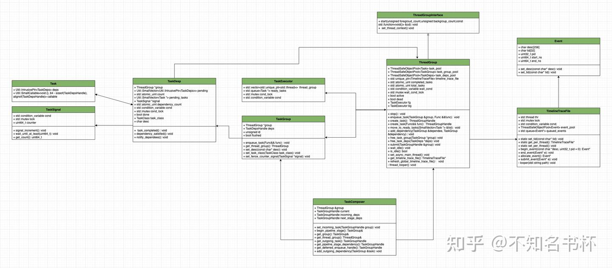
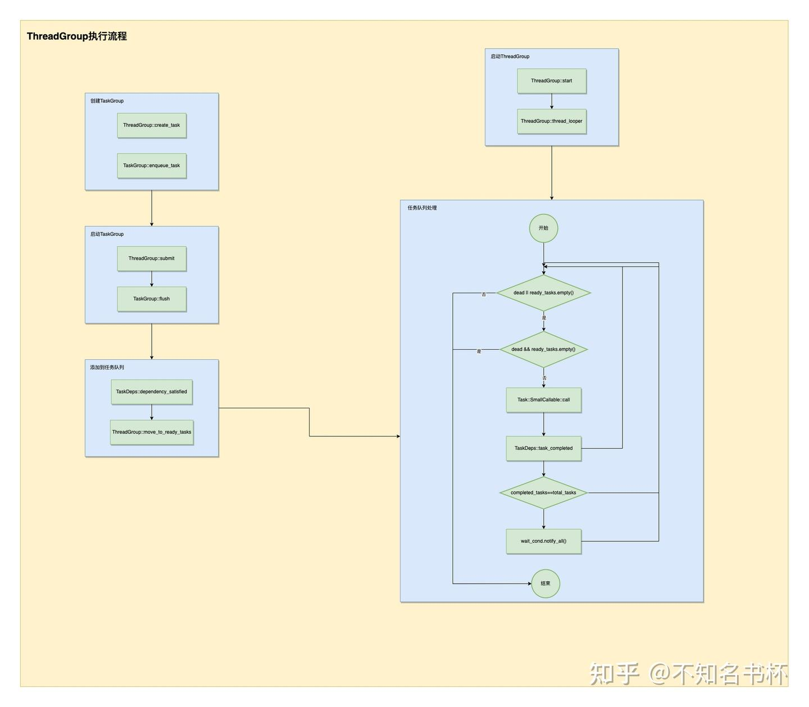

# 理解FrameGraph实现(二)

## 前言

本文主要是关于Granite中FrameGraph中多线程部分实现的学习和记录，如果有写的不对的地方，也请在多多评论指正。

## 多线程相关

FrameGraph实现中肯定是少不了多线程编程的，因为想要利用好多核的优势就必须使用多线程编程，这样可以大大缩减在CPU侧的耗时(也是Vulkan的优势所在)，但是同时需要为了多线程编程付出更多的精力，Granite中实现了一个简单的[线程池](https://zhida.zhihu.com/search?content_id=232487681&content_type=Article&match_order=1&q=线程池&zhida_source=entity)，具有任务调度和依赖跟踪功能，将用于多线程提交Vulkan渲染命令的操作。这部分的代码主要集中在项目中threading文件夹下，还是建议大伙尽量还是对照源码来理解学习。

所以理解这部分需要一定多线程编程基础，推荐看笔者关于多线程编程基础的文章，应该可以帮助大伙理解基础的多线程编程。

[不知名书杯：理解C++ 多线程编程(一)5 赞同 · 3 评论文章](https://zhuanlan.zhihu.com/p/644671456)

[不知名书杯：理解C++ 多线程编程(二)4 赞同 · 2 评论文章](https://zhuanlan.zhihu.com/p/646259706)

### 总览



### Task

Task是线程池中最基础的组件，每一个Task中都包含了SmallCallable对象以及TaskDeps对象，其中SmallCallable对象被用来保存本次Task所要执行的逻辑，而TaskDeps对象则被用来维护Task之间的相互依赖。确保在执行当前Task之前，所有的前置依赖Task都已经被执行完成。

Task对象便将需要执行函数的所有信息(包括需要调用的函数和其依赖关系)都封装为一个独立对象来管理，后续方便将多个Task放入执行队列中由线程池来进行管理。保证多个Task可并行执行，其中TaskDeps对象来管理依赖关系。具体代码如下所示：

```cpp
struct Task
{
    template <typename Func>
    Task(TaskDepsHandle deps_, Func&& func)
        : callable(std::forward<Func>(func)), deps(std::move(deps_))
    {
    }

    Task() = default;

    Util::SmallCallable<void (), 64 - sizeof(TaskDepsHandle), alignof(TaskDepsHandle)> callable;
    TaskDepsHandle deps;
};
```

这里选择SmallCallable来存储一个[可调用对象](https://zhida.zhihu.com/search?content_id=232487681&content_type=Article&match_order=1&q=可调用对象&zhida_source=entity)，SmallCallable旨在对于那些小且可复制的可调用对象，并且不需要在SmallCallable对象的生命周期之外存在的场景来说(即抛即用的场景)并且可以避免内存分配，这是对std::function的一种改进。这对于内存敏感和性能要求特别高的场景下比较有用，并且将其设置为64-sizeof(TaskDepsHandle)该参数是为了限制SmallCallable对象内部嵌入的可调用对象的大小。它规定了SmallCallable为内部的可调用对象分配的内存大小，该参数可以防止用户试图在SmallCallable对象中存储过大的可调用对象，如果对象太大超出了设定的数值，那么在编译时就会产生错误。

### TaskSignal

TaskSignal其设计目的是用于控制线程间的并发访问以及同步，这提供了一种多线程编程中常用的信号模式。通过TaskSignal让多个线程通过计数器中的值满足某个条件来判断是否需要堵塞或者执行。这样就能够保证Task之间的执行顺序的正确性。具体代码如下所示：

```cpp
struct TaskSignal
{
    std::condition_variable cond;
    std::mutex lock;
    uint64_t counter = 0;

    void signal_increment();
    void wait_until_at_least(uint64_t count);
    uint64_t get_count();
};
```

- uint64_t counter：是一个计数器，用于记录任务完成的个数。
- std::condition_variable cond,std::mutex lock: 来协调和控制多线程间的同步。
- signal_increment(): 每当一个任务完成时将调用此函数。会给counter加一，并通知等待在此条件变量上的线程(如果有的话)。
- wait_until_at_least(): 这个函数允许线程等待直到count达到指定的值。正常情况下cond会释放锁并挂起正在执行的线程，直到被通知可以继续执行(前提是需要满足计数器的值达到某个指定数值)。
- get_count(): 返回当前count的值，并通过std::mutex保证多线程之间数据安全。

### TaskDeps

设计TaskDeps的主要目的是管理多个Task之间的依赖关系，并且为Task的并行执行提供支持。具体代码如下所示：

```cpp
struct TaskDeps : Util::IntrusivePtrEnabled<TaskDeps, TaskDepsDeleter, Util::MultiThreadCounter>
{
    explicit TaskDeps(ThreadGroup *group_)
        : group(group_)
    {
        count.store(0, std::memory_order_relaxed);
        // One implicit dependency is the flush() happening.
        dependency_count.store(1, std::memory_order_relaxed);
        desc[0] = '\0';
    }

    ThreadGroup *group;
    Util::SmallVector<Util::IntrusivePtr<TaskDeps>> pending;
    std::atomic_uint count;

    Util::SmallVector<Task *> pending_tasks;
    TaskSignal *signal = nullptr;
    std::atomic_uint dependency_count;

    void task_completed();
    void dependency_satisfied();
    void notify_dependees();

    std::condition_variable cond;
    std::mutex cond_lock;
    bool done = false;
    TaskClass task_class = TaskClass::Foreground;

    char desc[64];
};
```

- dependency_count：代表当前TaskDeps前置依赖的数量。
- pending：代表所有依赖该TaskDeps执行完毕的其他TaskDeps。
- done：代表TaskDeps所关联的所有Task是否全部执行完成。
- signal：可以通过TaskSignal通知所有依赖该Task的其他Task。
- 通过cond和cond_lock来管理多线程之间的同步。
- 通过count和pending_tasks代表与当前TaskDeps所需完成的所有Task对象和对应Task的数量。
- task_completed(): 当调用该函数时代表和这个TaskDeps相关联的Task已经完成，随后对count递减。当count的值为0时表示所有相关任务全部完成，那么就调用notify_dependees()去通知所有等待当前TaskDeps执行完毕的其他TaskDeps(也就是pending)。
- notify_dependees(): 调用函数会通知所有等待当前TaskDeps完成的其他TaskDeps，代表它们该前置TaskDeps依赖已经完成。如果设置了signal则调用signal的signal_increment函数来通知其他TaskDeps，再调用pending中每个TaskDeps的dependency_satisfied()。最后将done设置为true，并且唤醒所有在等待该TaskDeps完成的线程。
- dependency_satisfied(): 这个函数被调用则表示有一个当前TaskDeps所依赖的TaskDeps已经完成执行，所以递减dependency_count，如果dependency_count变为0，说明所有当前TaskDeps的前置依赖都完成。则会将pending_tasks中移动到执行就绪队列当中，如果pending_tasks为空，则调用当前TaskDeps的notify_dependees函数来让其他依赖开始执行。

### TaskGroup

TaskGroup主要目的如下：

- 是提供一种可以组合Task并发执行的机制。这样你可以一次性启动多个Task并确保完成所有任务，在TaskGroup内的所有Task没有执行依赖，这样可以最大化地利用多核处理器的并行能力。
- 提供一种管理Task之间依赖关系的机制。这可以定义复杂的依赖关系，例如只有当TaskGroup中的所有Task都已完成时，其他的TaskGroup才能开始执行。

总的来说，TaskGroup是为了简化[并发编程](https://zhida.zhihu.com/search?content_id=232487681&content_type=Article&match_order=1&q=并发编程&zhida_source=entity)以及提升代码的可读性和可维护性。

```cpp
struct TaskGroup : Util::IntrusivePtrEnabled<TaskGroup, TaskGroupDeleter, Util::MultiThreadCounter>
{
    explicit TaskGroup(ThreadGroup *group);
    ~TaskGroup();
    void flush();
    void wait();
    bool poll();

    ThreadGroup *group;
    TaskDepsHandle deps;

    template <typename Func>
    void enqueue_task(Func&& func);

    void set_fence_counter_signal(TaskSignal *signal);
    ThreadGroup *get_thread_group() const;

    void set_desc(const char *desc);
    void set_task_class(TaskClass task_class);

    unsigned id = 0;
    bool flushed = false;
};
```

- group：是指向一个ThreadGroup的指针，代表拥有管理当前TaskGroup的ThreadGroup。
- deps：是TaskGroup中管理和其他TaskGroup依赖关系的TaskDeps。
- id：是当前TaskGroup的唯一标识。
- flushed：是一个布尔变量，用于表示当前TaskGroup是否已经调用flush()。
- set_class(TaskClass task_class)：设置TaskGroup对应的TaskClass(前台线或者后台运行)，设置这个变量主要是用于后续调度线程优先级。
- set_desc(const char *desc)：设置TaskGroup的描述，并复制给当前的TaskDeps，这主要用于调试和日志记录。
- get_thread_group： 返回与之关联的ThreadGroup对象的指针。
- set_fence_counter_signal(TaskSignal *signal) ：给TaskGroup设置一个TaskSignal(会放入TaskDeps内)，当TaskGroup的所有任务都完成时，此TaskSignal将被触发。这主要用于多线程中的同步和通知机制。
- flush(): 将flushed设置为true，并且将所有Task添加到TaskGroup中，并准备好执行(通过TaskDeps的dependency_satisfied()将Task放入队列中待执行)。此后不应再向TaskGroup添加任何Task。
- poll()：检查任务组中的所有Task是否已经完成。如果所有Task都完成了，那么它将返回true，否则返回false。
- wait(): 这个方法会阻塞调用线程，直到TaskGroup中的所有Task都执行完毕。如果当前TaskGroup还未调用flush()，则调用flush()。
- enqueue_task(Func&& func))：将一个新Task添加到TaskGroup中。
- TaskGroup::~TaskGroup: TaskGroup的[析构函数](https://zhida.zhihu.com/search?content_id=232487681&content_type=Article&match_order=1&q=析构函数&zhida_source=entity)中，如果flushed不为true则主动调用flush()。

### ThreadGroup

ThreadGroup主要是用来管理多个线程，以更高效的方式对多个线程进行集中管理，使得开发者无需手动管理每一个线程的生命周期，也可以方便地派发和等待任务的完成。

```cpp
class ThreadGroup final : public ThreadGroupInterface
{
public:
    ThreadGroup();
    ~ThreadGroup();
    ThreadGroup(ThreadGroup &&) = delete;
    void operator=(ThreadGroup &&) = delete;

    void start(unsigned num_threads_foreground,
               unsigned num_threads_background,
               const std::function<void ()> &on_thread_begin) override;

    unsigned get_num_threads() const
    {
        return unsigned(fg.thread_group.size() + bg.thread_group.size());
    }

    void stop();

    template <typename Func>
    void enqueue_task(TaskGroup &group, Func&& func);
    template <typename Func>
    TaskGroupHandle create_task(Func&& func);
    TaskGroupHandle create_task();

    void move_to_ready_tasks(const Util::SmallVector<Task *> &list);

    void add_dependency(TaskGroup &dependee, TaskGroup &dependency);

    void free_task_group(TaskGroup *group);
    void free_task_deps(TaskDeps *deps);

    void submit(TaskGroupHandle &group);
    void wait_idle();
    bool is_idle();

    Util::TimelineTraceFile *get_timeline_trace_file();
    void refresh_global_timeline_trace_file();

    static void set_async_main_thread();

private:
    Util::ThreadSafeObjectPool<Task> task_pool;
    Util::ThreadSafeObjectPool<TaskGroup> task_group_pool;
    Util::ThreadSafeObjectPool<TaskDeps> task_deps_pool;

    struct TaskExecutor
    {
        std::vector<std::unique_ptr<std::thread>> thread_group;
        std::queue<Task *> ready_tasks;
        std::mutex cond_lock;
        std::condition_variable cond;
    } fg, bg;

    void thread_looper(unsigned self_index, TaskClass task_class);

    bool active = false;
    bool dead = false;

    std::condition_variable wait_cond;
    std::mutex wait_cond_lock;
    std::atomic_uint total_tasks;
    std::atomic_uint completed_tasks;

    std::unique_ptr<Util::TimelineTraceFile> timeline_trace_file;
    void set_thread_context() override;
};
```

- active: 该字段被用于判断是否已经调用start()。
- dead: 该字段用于判断是否已经调用stop()。
- wait_cond和wait_cond_lock配套使用，用于等待ThreadGroup执行完毕的操作。
- total_tasks用于记录全部的Task数量，completed_tasks记录已经完成的Task数量。
- timeline_trace_file: 可用于记录对应操作开发和结束的时间戳，从而跟踪程序的执行行为。特别是TimelineTraceFile被设计为多[线程安全](https://zhida.zhihu.com/search?content_id=232487681&content_type=Article&match_order=1&q=线程安全&zhida_source=entity)的，可以用于多线程环境。
- task_pool/task_group_pool/task_deps_pool: 多个多线程安全的[对象池](https://zhida.zhihu.com/search?content_id=232487681&content_type=Article&match_order=1&q=对象池&zhida_source=entity)，分别对应创建Task，TaskGroup，TaskDeps对象的创建。
- thread_looper(index,task_class)：会开启一个无限的循环，在循环中试图从取出TaskGroup中的Task并执行。如果没有Task就会堵塞执行，等待新的Task到来再继续执行。
- start(num_threads_foreground**,**num_threads_background,on_thread_begin): 会创建多个线程，线程数量根据参数控制。并且每个线程都会调用thread_looper函数(开始执行Task)，并且在每个线程开始时都会调用on_thread_begin。
- fg/bg: 两个都是TaskExecutor对象，是真正去执行Task的对象。包括一个线程数组、一个待执行任务队列、一个互斥量和一个[条件变量](https://zhida.zhihu.com/search?content_id=232487681&content_type=Article&match_order=2&q=条件变量&zhida_source=entity)，分别用来管理前台任务和后台任务的工作线程。
- stop(): 会设置dead为true，并向所有线程发送通知，然后等待所有线程完成Task执行，最后销毁所有线程和对应资源。
- submit(TaskGroupHandle &group): 在所有的Task被添加到TaskGroup后，驱动TaskGroup中的所有Task放入执行就绪队列中。
- create_task(): 创建一个新的TaskGroup并返回一个对应的TaskGroupHandle的指针。
- enqueue_task(TaskGroup &group,Func)：会创建一个新的Task并添加进指定的TaskGroup。
- add_dependency(TaskGroup& dependee,TaskGroup& dependency): 为TaskGroup之间添加依赖关系，首先将dependency添加到dependee的依赖列表中，并增加dependency的dependency_count。
- move_to_ready_tasks(Util::SmallVector<:task> &list): 此函数将一组任务移动到就绪任务队列中，并向线程发送通知可以让其继续处理Task。
- wait_idle()：会堵塞执行直到该ThreadGroup完成所有的Task执行。
- ThreadGroup::~ThreadGroup()：ThreadGroup的析构函数内会调用[stop函数](https://zhida.zhihu.com/search?content_id=232487681&content_type=Article&match_order=1&q=stop函数&zhida_source=entity)，确保所有Task执行完毕并且销毁所有对象以确保无[内存泄露](https://zhida.zhihu.com/search?content_id=232487681&content_type=Article&match_order=1&q=内存泄露&zhida_source=entity)。

## 使用方式

下面是ThreadGroup的使用示例，创建一个ThreadGroup并且设置了四个线程来执行Task，通过create_task创建三个TaskGroup并且设置所需要执行的逻辑。并且额外通过enqueue_task在task3中添加一个新的Task。并通过add_dependency来设置TaskGroup之间的依赖关系(task1/task2→task3，task1→task2)。最后调用ThreadGroup的submit让每个TaskGroup开始将Task塞入就绪执行队列中。可以调用ThreadGroup的wait_idle()来堵塞代码继续往下执行，直到ThreadGroup中的所有Task执行完毕才继续执行。

```cpp
void test_thread_group(){
    Lapis::ThreadGroup group;
    group.start(4, 0, {});

    auto task1 = group.create_task([]() {
        LOGI("task1!\n");
    });
    auto task2 = group.create_task([]() {
        LOGI("task2!\n");
    });
    auto task3 = group.create_task([]() {
        LOGI("task3!\n");
    });
    group.enqueue_task(*task3, []() {
        LOGI("task3 extra task \n");
    });
    group.add_dependency(*task1, *task3);
    group.add_dependency(*task2, *task3);
    group.add_dependency(*task1, *task2);
    group.submit(task1);
    group.submit(task2);
    group.submit(task3);

    group.wait_idle();
    // 其他逻辑
    ........
}
```

具体执行流程图如下所示:




在这里分为两部分:

- 首先是调用ThreadGroup::start()，确定需要开启几个线程以及设置on_thread_begin，并且调用thread_looper()开始处理队列中的Task。在thread_looper函数的循环中会不断地从ready_tasks中取出Task并且调用其中的可调用对象，如果当前ready_tasks为空并且dead为true则直接终止循环，并且每次Task调用完毕后会调用TaskDeps的task_completed()通知该Task已执行完毕。如果全部Task执行完毕，则直接唤醒被ThreadGroup::wait_cond堵塞的所有线程。
- 另外一个部分则是如何将Task塞入ready_tasks，首先创建TaskGroup只需要调用create_task并且会自动塞入一个Task，如果还需要在这个TaskGroup中添加新的Task，可通过TaskGroup::enqueue_task实现，并且通过add_dependency设置TaskGroup之间的依赖。最后通过ThreadGroup::submit提交所有的TaskGroup。最后会调用到TaskGroup::flush→TaskDeps::dependency_satisfied→ThreadGroup::move_to_ready_tasks，将所有需要的Task放入ready_tasks之后被处理。

## 配套的工具函数以及Debug相关

### thread_id

```cpp
namespace Util
{
static thread_local unsigned thread_id_to_index = ~0u;

unsigned get_current_thread_index()
{
    auto ret = thread_id_to_index;
    if (ret == ~0u)
    {
        LOGE("Thread does not exist in thread manager or is not the main thread.\n");
        return 0;
    }
    return ret;
}

void register_thread_index(unsigned index)
{
    thread_id_to_index = index;
}
}
```

首当其冲的就是thread_id，这些函数主要是用来为当前线程注册一个[唯一索引](https://zhida.zhihu.com/search?content_id=232487681&content_type=Article&match_order=1&q=唯一索引&zhida_source=entity)。这里声明了一个静态的线程局部变量thread_id_to_index并初始化为~0u，thread_local是C++11引入的一个关键字。它声明了一个线程局部的变量，也就是说每一个线程都有一份这个变量的拷贝，而不是所有线程共享同一个变量。一个线程对其进行的修改不会影响到其他线程中的thread_id_to_index。这样设计的好处是可以避免多线程编程中的数据竞争和同步问题。因为每个线程都有自己的数据拷贝，所以它们可以各自独立地操作这个数据而无需进行复杂的同步策略。也就是说通过register_thread_index可以给每个线程设置一个唯一索引。

这在多线程编程中是很有必要的，因为当在Vulkan使用多线程提交渲染命令时，这种情况下，你将需要跟踪哪个线程正在处理哪一部分的工作，以确保不会出现线程冲突和数据一致性问题。由于不同线程在处理速度上可能会有差异，因此使用线程唯一标识能够帮助编程者更好地管理线程，并确保程序的稳定运行。

在thread_looper()中注册对应的线程ID，每个线程都会调用并且传入index会递增，保证每个线程的ID是独一无二。如下所示：

```cpp
void ThreadGroup::thread_looper(unsigned index, TaskClass task_class)
{
    Util::register_thread_index(index);
    .............
}
```

### thread_name

接下来是thread_name的处理，具体操作如下所示：

```cpp
#ifdef __linux__
#include <pthread.h>
#endif

#ifdef __APPLE__
#include <pthread.h>
#endif

namespace Util
{
void set_current_thread_name(const char *name)
{
    #ifdef __linux__
            pthread_setname_np(pthread_self(), name);
    #elif __APPLE__
        pthread_setname_np(name);
    #else
    // TODO: Kinda messy.
    (void)name;
    #endif
}
}
```

通过pthread_setname_np来设置线程名，但是在linux和mac环境中调用的方式有所不同，但是需要引入的头文件都是pthread.h。在linux环境下的使用方式是`int pthread_setname_np(pthread_t thread, const char *name)`，thread参数是要设置名称的线程的线程id，这里通过pthread_self()来获取当前线程ID，第二个参数也就是设置的线程名称。在mac环境下的使用方式是`int pthread_setname_np(const char* name)`只接受一个参数，那就是想要设置的线程名称。由于此函数只能用于设置当前线程的名称，所以没有提供线程ID作为参数。其返回值为0表示成功，否则为一个错误码。

使用这段代码的目的主要是给不同的线程设置不同的名称，这在调试多线程程序时非常有用。在多线程编程中通过线程ID来理解线程的行为比较困难，如果线程有一个描述性的名字，那么调试就会容易得多。通过设置线程的名称，开发者可以更方便地在错误报告、[日志文件](https://zhida.zhihu.com/search?content_id=232487681&content_type=Article&match_order=1&q=日志文件&zhida_source=entity)以及性能剖析工具中识别线程。它可以帮助开发者更快地理解问题发生的上下文，从而更有效地调试代码。

以下代码就是在ThreadGroup关于设置线程名称的操作：

```cpp
void ThreadGroup::set_async_main_thread()
{
    Util::set_current_thread_name("MainAsyncThread");
    .......
}

static void set_main_thread_name()
{
    Util::set_current_thread_name("MainThread");
    .........
}

static void set_worker_thread_name_and_prio(unsigned index, TaskClass task_class)
{
    auto name = Util::join(task_class == TaskClass::Foreground ? "FG-" : "BG-", index);
    Util::set_current_thread_name(name.c_str());
    ...........
}
```

### thread_priority

```cpp
#if defined(__linux__)
#include <pthread.h>
#elif defined(_WIN32)
#include <windows.h>
#elif defined(__APPLE__) && defined(__MACH__)
    #include <pthread.h>
    #include <mach/thread_policy.h>
    #include <mach/thread_act.h>
#endif

void set_current_thread_priority(ThreadPriority priority)
{
#if defined(__linux__)
    if (priority == ThreadPriority::Low)
    {
        struct sched_param param = {};
        int policy = 0;
        param.sched_priority = sched_get_priority_min(SCHED_BATCH);
        policy = SCHED_BATCH;
        if (pthread_setschedparam(pthread_self(), policy, &param) != 0)
            LOGE("Failed to set thread priority.\n");
    }
#elif defined(_WIN32)
    if (priority == ThreadPriority::Low)
    {
        if (!SetThreadPriority(GetCurrentThread(), THREAD_MODE_BACKGROUND_BEGIN))
            LOGE("Failed to set background thread priority.\n");
    }
    else if (priority == ThreadPriority::Default)
    {
        if (!SetThreadPriority(GetCurrentThread(), THREAD_PRIORITY_NORMAL))
            LOGE("Failed to set normal thread priority.\n");
    }
    else if (priority == ThreadPriority::High)
    {
        if (!SetThreadPriority(GetCurrentThread(), THREAD_PRIORITY_HIGHEST))
            LOGE("Failed to set high thread priority.\n");
    }
#elif defined(__APPLE__) && defined(__MACH__)
    if (priority == ThreadPriority::Low)
    {
        sched_param schedParam;
        int policy;
        pthread_getschedparam(pthread_self(), &policy, &schedParam);
        schedParam.sched_priority = sched_get_priority_min(policy);
        if (pthread_setschedparam(pthread_self(), policy, &schedParam) != 0)
            LOGE("Failed to set thread priority.\n");
    }
    else if (priority == ThreadPriority::High)
    {
        struct sched_param param;
        int policy;
        pthread_getschedparam(pthread_self(), &policy, &param);
        param.sched_priority = sched_get_priority_max(policy);
        if(pthread_setschedparam(pthread_self(), policy, &param)) {
            LOGE("Failed to set thread priority.\n");
        }
    }
#else
#warning "Unimplemented set_current_thread_priority."
    (void)priority;
#endif
}
```

这段代码主要是在不同操作系统下设置线程优先级，线程优先级是操作系统决定哪个线程应该获得CPU资源的一个关键因素。较高优先级的线程会在可用CPU资源上优先于较低优先级的线程。在多线程编程中尤其是在需要精细控制CPU资源以提高运行效率的情况下这是很常见的技巧。可以最大利用CPU的性能。在这里主要讲解一下在Mac系统下的实现，如下所示：

- 首先通过pthread_getschedparam获取到现有的调度参数param。
- 通过sched_get_priority_min/sched_get_priority_max分别获取到最大或者最小的调度优先级，并设置param的sched_priority字段。
- 通过pthread_setschedparam设置该线程的调度优先级。

具体使用示例如下所示，这里为不同的线程设置不同的优先级会将主线程设置为最高优先级，但是对于普通的线程来说如果是前台线程则设置为默认优先级，而后台线程则是低优先级。

```cpp
void ThreadGroup::set_async_main_thread()
{
    .......
    Util::set_current_thread_priority(Util::ThreadPriority::High);
}

static void set_main_thread_name()
{
    .........
    Util::set_current_thread_priority(Util::ThreadPriority::High);
}

static void set_worker_thread_name_and_prio(unsigned index, TaskClass task_class)
{
    ...........
    Util::set_current_thread_priority(task_class == TaskClass::Foreground ?
                                      Util::ThreadPriority::Default : Util::ThreadPriority::Low);
}
```

### TimelineTraceFile

```cpp
class TimelineTraceFile
{
public:
    explicit TimelineTraceFile(const std::string &path);
    ~TimelineTraceFile();

    static void set_tid(const char *tid);
    static TimelineTraceFile *get_per_thread();
    static void set_per_thread(TimelineTraceFile *file);

    struct Event
    {
        char desc[256];
        char tid[32];
        uint32_t pid;
        uint64_t start_ns, end_ns;

        void set_desc(const char *desc);
        void set_tid(const char *tid);
    };
    Event *begin_event(const char *desc, uint32_t pid = 0);
    void end_event(Event *e);

    Event *allocate_event();
    void submit_event(Event *e);

    struct ScopedEvent
    {
        ScopedEvent(TimelineTraceFile *file, const char *tag);
        ~ScopedEvent();
        void operator=(const ScopedEvent &) = delete;
        ScopedEvent(const ScopedEvent &) = delete;
        TimelineTraceFile *file = nullptr;
        Event *event = nullptr;
    };

private:
    void looper(std::string path);
    std::thread thr;
    std::mutex lock;
    std::condition_variable cond;

    ThreadSafeObjectPool<Event> event_pool;
    std::queue<Event *> queued_events;
};
```

TimelineTraceFile的设计目标是为了提供执行追踪的能力。具体来说它允许开发者在代码中的特定位置设置时间戳以追踪和记录代码的执行时长。由于这些函数使用了[线程局部存储](https://zhida.zhihu.com/search?content_id=232487681&content_type=Article&match_order=1&q=线程局部存储&zhida_source=entity)(Thread Local Storage，TLS)，所以它们能够正确处理多线程环境，每个线程可以拥有独立的执行追踪功能。具体如下所示(上面也解释了thread_local关键字的作用，在这不在多赘述)。

```cpp
static thread_local char trace_tid[32];
static thread_local TimelineTraceFile *trace_file;

void TimelineTraceFile::set_tid(const char *tid)
{
    snprintf(trace_tid, sizeof(trace_tid), "%s", tid);
}

void TimelineTraceFile::set_per_thread(TimelineTraceFile *file)
{
    trace_file = file;
}

TimelineTraceFile *TimelineTraceFile::get_per_thread()
{
    return trace_file;
}
```

在TimelineTraceFile中每次记录操作都会新建一个Event对象，Event会包含所需的信息，如下所示：

- char desc[256]：这个字段用来保存本次操作的描述，比如函数的名称或者操作的性质等。
- char tid[32]：这个字段用来保存线程ID，以识别是在哪个线程中记录的。
- uint64_t start_ns, end_ns：这两个字段用来保存该Event的开始和结束时间戳，单位为纳秒。

接下来看看TimelineTraceFile中主要包括什么吧，如下所示：

- std::thread thr: 用于在后台异步写入追踪执行数据的线程。
- std::mutex lock 和 std::condition_variable cond：用于线程间的同步，确保Event对象在多线程环境下安全地进入队列和处理。
- ThreadSafeObjectPool event_pool：是一个存放Event的对象池。
- std::queue queued_events：是一个用于存放等待处理的Event对的队列。
- Event *begin_event(const char* desc, uint32_t pid = 0) 和 void end_event(Event *e): 是用来开始和结束一个Event的记录，begin_event会返回一个Event对象，可以用来记录的各种信息。
- Event *allocate_event()和 void submit_event(Event* e)：都是处理Event对象的函数，前者创建一个新的Event对象，后者将Event对象提交到队列中。
- void looper(std::string path)：会开启一个单独的线程中运行该函数，主要工作是从Event队列中取出Event对象处理并将数据写入到文件中。
- TimelineTraceFile(const std::string &path)：接收一个路径作为参数，这个路径是用于存放时间线追踪数据的文件路径。并将开启一个线程来执行looper函数。
- ~TimelineTraceFile()：在TimelineTraceFile对象销毁前会确保所有的Event对象都被处理，并且保证线程安全地结束。

为了使用上的便利可以利用RAII的思想封装一个ScopedEvent对象，确保当这个类对象创建的时候会自动调用begin_event来开始创建一个Event对象，在该对象析构的时候自动调用end_event。这个类的设计使得用户可以非常简洁地追踪代码执行的时间。

并且还包装一个宏来使用，这个宏的作用是创建一个ScopedEvent对象，即在代码执行的某一范围内自动记录执行的时间，让追踪代码执行时间变得更加方便。

```cpp
#define GRANITE_SCOPED_TIMELINE_EVENT(str) \
    ::Util::TimelineTraceFile::ScopedEvent _timeline_scoped_count_##__COUNTER__{GRANITE_THREAD_GROUP()->get_timeline_trace_file(), str}
#define GRANITE_SCOPED_TIMELINE_EVENT_FILE(file, str) \
    ::Util::TimelineTraceFile::ScopedEvent _timeline_scoped_count_##__COUNTER__{file, str}
```

## TaskComposer

为了在Vulkan中多线程提交渲染命令，于是设计出了TaskComposer。设计目的是简化和管理在ThreadGroup中的Task Pipeline的创建和调度。具体代码如下所示，总的来说TaskComposer提供了一种方法来封装和管理分阶段并行和依赖指定先后顺序的Task，简化在ThreadGroup中构建和调度Task Pipeline各阶段的复杂性。

```cpp
class TaskComposer
{
public:
    explicit TaskComposer(ThreadGroup &group);
    void set_incoming_task(TaskGroupHandle group);
    TaskGroup &begin_pipeline_stage();
    TaskGroup &get_group();
    TaskGroupHandle get_outgoing_task();
    TaskGroupHandle get_pipeline_stage_dependency();
    ThreadGroup &get_thread_group();
    TaskGroupHandle get_deferred_enqueue_handle();
    void add_outgoing_dependency(TaskGroup &task);

private:
    ThreadGroup &group;
    TaskGroupHandle current;
    TaskGroupHandle incoming_deps;
    TaskGroupHandle next_stage_deps;
};
```

- ThreadGroup& group：代表与之关联的ThreadGroup对象。
- TaskGroupHandle current：代表当前Pipeline Stage的TaskGroupHandle。
- TaskGroupHandle incoming_deps：作为当前Pipeline Stage(current)的前置依赖的TaskGroupHandle。
- TaskGroupHandle next_stage_deps：将作为incoming_deps的前置依赖的TaskGroupHandle。
- set_incoming_task(TaskGroupHandle group_): 设置一个TaskGroup作为整个Task Pipeline的起点。
- begin_pipeline_stage()：创建一个新的TaskGroup和TaskDeps，并将它们添加到Task Pipeline中并维护对应的依赖关系。也就是调用该函数则开始一个新的Pipeline Stage(每个Pipeline Stage都需要按顺序执行哦)，并且重新设置currtent和incoming_deps。
- get_group()：返回当前TaskGroup(也就是current)，如果当前没有任何TaskGroup，将调用begin_pipeline_stage()并返回一个TaskGroup(会赋值给current)。
- get_outgoing_task()：结束当前Pipeline Stage(也就是进入到下一个Pipeline Stage)并返回一个TaskGroup，这个TaskGroup表示了当前阶段的结束和下一阶段的开始。
- get_pipeline_stage_dependency(): 该函数返回一个当前Task Pipeline Stage所前置依赖一个的TaskGroup(也就是incoming_deps)，如果需要在当前Pipeline Stage之前补充前置操作的，可以在该TaskGroup内添加Task。
- get_thread_group()：返回与之关联的ThreadGroup。
- get_deferred_enqueue_handle()：获取一个新的TaskGroup，可以将一些在当前Pipeline Stage结束时需要执行的Task提交给它(其实也就是将其作为在下一个Pipeline Stage的前置依赖)。
- add_outgoing_dependency(TaskGroup &task);：可以添加一个Task到下一个Pipeline Stage中，这个Task将会在当前Pipeline Stage的所有Task都完成后执行。

具体用例如下所示：

```cpp
void task0()
{
  LOGI("Task 0 running...");
}

void task1()
{
  LOGI("Task 1 running...");
}

void task2()
{
  LOGI("Task 2 running...");
}

void task3()
{
  LOGI("Task 3 running...");
}

void task4()
{
  LOGI("Task 4 running...");
}

void task5()
{
  LOGI("Task 5 running...");
}

void task6()
{
  LOGI("Task 6 running...");
}

void task7()
{
  LOGI("Task 7 running...");
}

void test_task_composer(){
    Lapis::ThreadGroup group;
    Lapis::TaskComposer composer(group);
    {
      auto initialTask = group.create_task();
      initialTask->enqueue_task(task0);
      initialTask->set_desc("initialTask");
      composer.set_incoming_task(initialTask);
    }

    {  
      auto& firstStage = composer.begin_pipeline_stage();
      firstStage.set_desc("firstStage");
      firstStage.enqueue_task(task1);
      firstStage.enqueue_task(task2);
      firstStage.enqueue_task([ h = composer.get_deferred_enqueue_handle()]() mutable {
        h->set_desc("deferredHandle");
                h->enqueue_task([=]() {
          task4();
                });
          });     
    }

    {
      auto& secondStage = composer.begin_pipeline_stage();
      secondStage.set_desc("secondStage");
      secondStage.enqueue_task(task3);
    }

    {
      auto& thirdStage = composer.begin_pipeline_stage();
      thirdStage.set_desc("thirdStage");
      thirdStage.enqueue_task(task5);
    }

    auto handleToWaitFor = composer.get_outgoing_task();
    handleToWaitFor->enqueue_task(task6);

    group.start(1,0,{});
    handleToWaitFor->wait();

    task7();
}
```

首先是创建ThreadGroup对象并且做为参数来构造TaskComposer对象。并通过set_incoming_task塞入一个TaskGroup作为初始阶段，之后使用begin_pipeline_stage开启一个新的Pipeline Stage继续执行其他的TaskGroup，还通过get_deferred_enqueue_handle获取到一个TaskGroup，TaskComposer会保证在该TaskGroup在task2之后才开始执行，该TaskGroup执行完毕后才开始执行task3。(注意这里的写法每个TaskGroup都是通过析构函数来触发flush函数，如果不是这样的写法，记得需要手动调用flush)

注意如果是使用get_deferred_enqueue_handle来补充一些Task的执行的话，下面这种写法是不可以的。因为这个TaskGroup并没有被显式与某个Pipeline的TaskGroup有依赖关联(比如firstStage)。如果这种用法则需要手动维护其依赖关系(通过add_dependency来设置)。这样的写法会导致该defferedHandle会被提高到和initialTask一样首个被执行，虽然会堵塞secondStage的执行，但是和预期表现不符(预期是先执行完task1，task2，再执行task4，现在变成task0和task4并行，task1，task2反而在后面被执行)。

```cpp
auto defferedHandle = composer.get_deferred_enqueue_handle()
defferedHandle.enqueue_task(task4);
```

建议使用上面示例中的写法，将创建DeferredTaskGroupHandle和执行task4的代码放在了一个lambda函数中，并将这个lambda函数作为该阶段的一个Task来执行。通过这种方式DeferredTaskGroupHandle会在所有task0 task1和task2执行完成后再被创建，这个lambda函数启动时才被添加到任务队列中，所以task4会在这些任务完成后开始执行。这就形成了正确的前置依赖关系，同时符合预期。

## 总结

本文主要介绍了Granite中多线程部分的实现和各种封装细节，其实也就是简单的实现了一个线程池。可以添加多个Task并且保证Task之间的执行顺序的正确。在有了多线程编程基础的话，如果彻底理解这一部分的实现应该可以在里面学到很多。比如Task，TaskGroup，ThreadGroup的封装，当然还有各种有关多线程的工具函数(设置线程ID，设置线程名称，调度线程的优先级以提高效率等等)。还有多线程编程中通过TimelineTraceFile来帮助Debug，并且进一步的封装ThreadGroup变为TaskComposer更加符合在FrameGraph中提交Vulkan渲染命令的使用等等，到这里Granite中的多线程部分就告一段落，接下来就到了最后的FrameGraph的Execute阶段，请敬请期待吧。

