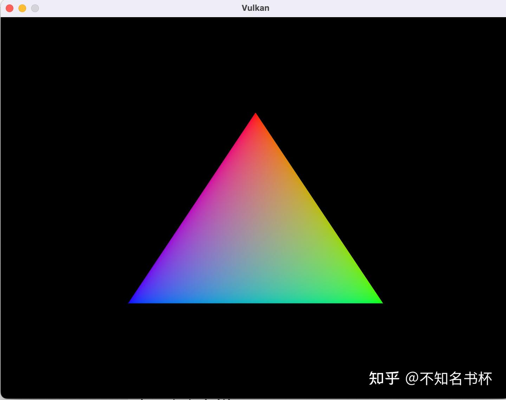

# Vulkan 三角形之旅-5

> 这里是记录笔者Vulkan的学习记录，参照该教程[vulkan-tutorial.com](https://vulkan-tutorial.com/Drawing_a_triangle/Drawing/Command_buffers)这里是记录笔者Vulkan的学习记录，如果你想识别Vulkan相比于之前的传统图形API有什么区别和优势的话，欢迎看我的另外一篇文章[初探Vulkan](https://zhuanlan.zhihu.com/p/554631289)。相信应该能够帮助你识别Vulkan的优势所在。

## OverView

笔者这里是使用Mac来进行Vulkan的学习。简单来说Vulkan如果想要在Mac上运行的话，就必须要使用MoltenVK来完成。在Mac上Vulkan代码本质上还是会转化为Metal代码在Mac、IOS以及tvOS上运行的。关于这个怎么安装编译的，我们不必在意，安装Mac版本的Vulkan SDK就可以了。SDK会帮助你解决。并且在这里我们引入了计算线性代数的GLM库以及创建窗口的GLFW库。需要的东西并不多，关于这个环境配置问题可以参考上面原教程中的操作

在Vulkan当中绘制一个三角形流程可以分为如下

- 创建一个 VkInstance
- 选择支持的硬件设备（VkPhysicalDevice）
- 创建用于Draw和Presentation的VkDevice 和 VkQueue
- 创建窗口(window)、窗口表面(window surface)和交换链 (Swap Chain)
- 将Swap Chain Image 包装到 VkImageView
- 创建一个指定Render Target和用途的RenderPass
- 为RenderPass创建FrameBuffer
- 设置PipeLine
- 为每个可能的Swap Chain Image分配并记录带有绘制命令的Command Buffer
- 通过从Swap Chain获取的图像并在上面绘制，提交正确的Commander Buffer，并将绘制完的图像返回到Swap Chain去显示。

这么多步骤这是仅仅为了画一个三角形，其中如果你对于[渲染管线](https://zhida.zhihu.com/search?content_id=211788361&content_type=Article&match_order=1&q=渲染管线&zhida_source=entity)不熟悉或者没用其他现代图形API的话，建议还是去了解了解，不然再Vulkan许多的配置会让人一知半解，这边建议如果有Mac的话。可以先上手Metal，比较易用。可以后面再来挑战Vulkan。****

## **Rendering and presentation**

会把之前的所有内容进行整合，我们将会编写`drawFrame`函数，通过主循环`main loop`将三角形绘制到屏幕。

- 等待前一帧的完成。
- 从Swap Chain中获取一个Image。
- 记录一个Command Buffer，将绘制到该Image上。
- 提交Command Buffer。
- Present我们返回Swap Chain的图像。

## **Synchronization**

这里需要补充一些关于同步的概念。Vulkan的一个核心设计理念是，在GPU上执行的同步是明确的。操作的顺序是由我们使用各种同步原语来定义的，这些原语告诉[驱动程序](https://zhida.zhihu.com/search?content_id=211788361&content_type=Article&match_order=1&q=驱动程序&zhida_source=entity)我们希望程序的运行顺序。这意味着许多在GPU上开始执行工作的Vulkan API调用是异步的，这些函数将在操作完成之前返回。

有一些事件我们需要明确排序，因为它们发生在GPU上。比如，从Swap Chain中获取一个图像。在获得的图像上执行[渲染命令](https://zhida.zhihu.com/search?content_id=211788361&content_type=Article&match_order=1&q=渲染命令&zhida_source=entity)，渲染完之后并将其返回到Swap Chain中再Present到屏幕上。这每一个事件中的都是通过一个函数调用来启动的，但都是异步执行的。函数调用将在操作实际完成之前返回，而且执行的顺序也是未定义的。这是不幸的，因为每一个操作都依赖于前一个操作的完成。因此，我们需要探索我们可以使用哪些[同步原语](https://zhida.zhihu.com/search?content_id=211788361&content_type=Article&match_order=2&q=同步原语&zhida_source=entity)来实现所需的顺序。

### **Semaphores**

Semaphores用于在GPU队列操作之间增添顺序。队列操作是指我们提交给队列的工作，可以是在Command Buffer中，也可以是在函数中，我们稍后会看到。在我们这里Queue分别是Graphics Queue和Presentation Queue。Semaphores用于对同一队列内和不同队列之间的工作进行控制。

Vulkan 中恰好有两种Semaphore，Binary和Timeline。在这里只使用Binary后续提到的Semaphore全部都是Binary类型。

Semaphore要么是无信号的，要么是有信号的。它以没有信号的方式开始。我们使用semaphore对队列操作进行排序的方式是在一个队列操作中提供发出Semaphore相同的信号量，在另一个队列操作中提供与等待semaphore相同的信号量。例如，假设我们要按顺序执行Semaphore S 和队列操作 A 和 B。我们告诉 Vulkan 的是，操作 A 将在完成执行时“发出”信号量 S，而操作 B 将在信号量 S 开始执行之前“等待”它。当操作 A 完成时， S 将发出信号，而操作 B 在发出 S 信号之前不会开始。操作 B 开始执行后，信号量 S 自动重置为无信号状态，允许再次使用。 刚才描述的伪代码：

```cpp
VkCommandBuffer A, B = ... // record command buffers
VkSemaphore S = ... // create a semaphore

// enqueue A, signal S when done - starts executing immediately
vkQueueSubmit(work: A, signal: S, wait: None)

// enqueue B, wait on S to start
vkQueueSubmit(work: B, signal: None, wait: S)
```

请注意，在此代码片段中，对 vkQueueSubmit() 的两个调用都会立即返回 - 等待仅发生在 GPU 上。 CPU 继续运行而不会阻塞。为了让 CPU 等待，我们需要一个不同的同步原语，我们现在将对其进行描述。

### **Fence**

Fence也有类似的作用，它被用来同步执行，但它是为了在CPU侧上控制执行顺序。简单地说，如果主机需要知道GPU什么时候完成了什么，我们就使用Fence。

与Semaphore类似，Fence也是处于有信号或无信号的状态。每当我们提交要执行的工作时，我们可以为该工作附加一个Fence。当工作完成后，Fence将被发出信号。然后，我们可以让主机等待Fence发出信号，保证在主机继续工作之前工作已经完成。

一个具体的例子是拍摄屏幕截图。假设我们已经在GPU上完成了必要的工作。现在需要把图像从GPU上传到主机上，然后把内存保存到文件中。我们有执行传输的Command Buffer A和Fence F。我们用 Fence F提交Command Buffer A，然后立即告诉主机等待F的信号。这导致主机阻塞，直到Command Buffer A执行完毕。因此，我们可以安全地让主机将文件保存到磁盘，因为内存传输已经完成。

上面说的的伪代码如下所示

```cpp
VkCommandBuffer A = ... // record command buffer with the transfer
VkFence F = ... // create the fence

// enqueue A, start work immediately, signal F when done
vkQueueSubmit(work: A, fence: F)

vkWaitForFence(F) // blocks execution until A has finished executing

save_screenshot_to_disk() // can't run until the transfer has finished
```

与Semaphore的例子不同，这个例子会阻止主机的执行。这意味着主机除了等待执行完毕外不会做任何事情。在这个例子中，我们必须确保在将屏幕截图保存到磁盘之前，传输已经完成。

一般来说，除非有必要，最好不要阻塞主机的执行。我们希望为GPU和主机提供有用的工作。等待Fence的信号并不是有用的工作。因此，我们更喜欢用Semaphore或其他尚未涉及的同步原语来同步我们的工作。

Fence必须被手动重置，以使其恢复到无信号的状态。这是因为Fence是用来控制主机的执行的，所以主机可以决定何时重置Fence。与此相对应的是Semaphores，它是用来命令GPU上的工作而不需要主机参与。

综上所述，Semaphores用于指定GPU上操作的执行顺序，而Fence则用于保持CPU和GPU之间的同步性。

我们有两个同步原语可以使用，并且有两个地方可以方便地应用同步：Swap Chain操作和等待前一帧完成。我们希望将Semaphore用于Swap Chain操作，因为它们发生在 GPU 上，因此如果我们可以提供帮助，我们不想让主机等待。为了等待前一帧完成，我们想使用Fence，因为我们需要主机等待。这样我们就不会一次绘制超过一帧。因为我们每帧都重新记录Command Buffer，所以在当前帧完成执行之前，我们不能将下一帧的工作记录到[命令缓冲区](https://zhida.zhihu.com/search?content_id=211788361&content_type=Article&match_order=1&q=命令缓冲区&zhida_source=entity)，因为我们不想在 GPU 使用时覆盖Command Buffer的当前内容。

### **Creating the synchronization objects**

我们需要一个Semaphores来表示已从Swap Chain获取图像并准备好渲染，另一个Semaphores表示渲染已完成并且可以进行Present，还需要一个Fence来确保一次只渲染一帧,加起来是三个原语

```cpp
VkSemaphore imageAvailableSemaphore;
VkSemaphore renderFinishedSemaphore;
VkFence inFlightFence;

void createSyncObjects() {
        // 创建semaphore需要填充VkSemaphoreCreateInfo
    VkSemaphoreCreateInfo semaphoreInfo{};
    semaphoreInfo.sType = VK_STRUCTURE_TYPE_SEMAPHORE_CREATE_INFO;
        // 创建Fence需要填充VkFenceCreateInfo
    VkFenceCreateInfo fenceInfo{};
    fenceInfo.sType = VK_STRUCTURE_TYPE_FENCE_CREATE_INFO;
    if (vkCreateSemaphore(device, &semaphoreInfo, nullptr, &imageAvailableSemaphore) != VK_SUCCESS ||
        vkCreateSemaphore(device, &semaphoreInfo, nullptr, &renderFinishedSemaphore) != VK_SUCCESS ||
        vkCreateFence(device, &fenceInfo, nullptr, &inFlightFence) != VK_SUCCESS) {
        throw std::runtime_error("failed to create semaphores!");
    }
}
```

### **Waiting for the previous frame**

在当前帧开始时，我们希望等到前一帧结束，以便Command Buffer和Semaphores可供使用。为此，我们调用 vkWaitForFences：

```cpp
void drawFrame() {
    vkWaitForFences(device, 1, &inFlightFence, VK_TRUE, UINT64_MAX);
}
```

vkWaitForFences 函数接受一个Fence数组，并在主机上等待任何或所有Fence在返回之前发出信号。我们在这里传递的 VK_TRUE 表示我们要等待所有的Fence，但在我们只使用单个Fence的情况下没关系。此函数还有一个超时参数，我们将其设置为 64 位无符号整数的最大值 UINT64_MAX，它有效地禁用了超时。

等待之后，我们需要通过调用 vkResetFences 手动将Fence重置为无信号状态：

```cpp
vkResetFences(device, 1, &inFlightFence);
```

在我们继续之前，我们的设计中有一个小问题。在第一帧我们调用 drawFrame()，它会立即等待 inFlightFence 发出信号。 inFlightFence 仅在帧完成渲染后才发出信号，但由于这是第一帧，因此没有以前的帧可以发出Fence信号！因此 vkWaitForFences() 无限期地阻塞，等待永远不会发生的事情。

在解决这一困境的众多解决方案中，API 中内置了一个巧妙的解决方法。在已经发出信号状态下创建Fence，以便第一次调用 vkWaitForFences() 立即返回，因为Fence已经发出信号。 为此，我们将 VK_FENCE_CREATE_SIGNALED_BIT 标志添加到 VkFenceCreateInfo：

```cpp
VkFenceCreateInfo fenceInfo{};
fenceInfo.sType = VK_STRUCTURE_TYPE_FENCE_CREATE_INFO;
// 添加该flag 完成如下效果在信号状态下创建Fence，以便第一次调用vkWaitForFences()立即返回，因为Fence已经发出信号。
fenceInfo.flags = VK_FENCE_CREATE_SIGNALED_BIT;
```

### **Acquiring an image from the swap chain**

我们需要在 drawFrame 函数中做的下一件事是从Swap Chain中获取图像。回想一下，Swap Chain是一个扩展功能，所以我们必须使用具有 vk*KHR 命名约定的函数：

```cpp
uint32_t imageIndex;
vkAcquireNextImageKHR(device, swapChain, UINT64_MAX, imageAvailableSemaphore, VK_NULL_HANDLE, &imageIndex);
```

vkAcquireNextImageKHR 的前两个参数是逻辑设备和我们希望从中获取图像的Swap Chain。第三个参数指定图像可用的超时时间（以纳秒为单位）。使用 64 位无符号整数的最大值意味着我们有效地禁用了超时。

接下来的两个参数指定在演示引擎完成使用图像时要发出信号的同步对象。那是我们可以开始绘制它的时间点。可以指定Semaphores、Fence或两者。我们将在这里使用我们的 imageAvailableSemaphore 来达到这个目的。

最后一个参数指定一个变量来输出已变为可用的Swap Chain图像的索引。Index指的是我们的 swapChainImages 数组中的 VkImage。我们将使用该索引来选择 VkFrameBuffer。

### **Recording the command buffer**

使用 imageIndex 指定要使用的Swap Chain图像，我们现在可以开始Record Command Buffer。首先我们在Command Buffer上调用 vkResetCommandBuffer 以确保它能够被记录。

```cpp
vkResetCommandBuffer(commandBuffer, 0);
```

vkResetCommandBuffer 的第二个参数是一个 VkCommandBufferResetFlagBits 标志。由于我们不想做任何特别的事情，所以我们将其保留为 0。

接着启用我们在之前已经完成的recordCommandBuffer函数。

```cpp
recordCommandBuffer(commandBuffer, imageIndex);
```

### **Submitting the command buffer**

队列提交和同步是通过 VkSubmitInfo 结构中的参数来配置的。

```cpp
VkSubmitInfo submitInfo{};
submitInfo.sType = VK_STRUCTURE_TYPE_SUBMIT_INFO;

VkSemaphore waitSemaphores[] = {imageAvailableSemaphore};
// 通过VK_PIPELINE_STAGE_COLOR_ATTACHMENT_OUTPUT_BIT指定我们想再写入颜色附件的图形管道阶段等待
VkPipelineStageFlags waitStages[] = {VK_PIPELINE_STAGE_COLOR_ATTACHMENT_OUTPUT_BIT};
submitInfo.waitSemaphoreCount = 1;
submitInfo.pWaitSemaphores = waitSemaphores;
submitInfo.pWaitDstStageMask = waitStages;
```

前三个参数指定在执行开始之前要等待哪些Semaphores以及要在管道的哪个阶段等待。我们希望等待将颜色写入图像，直到它可用，因此我们指定了写入颜色附件的图形管道阶段。这意味着理论上实现已经可以开始执行我们的[顶点着色器](https://zhida.zhihu.com/search?content_id=211788361&content_type=Article&match_order=1&q=顶点着色器&zhida_source=entity)等，而图像尚不可用。 waitStages 数组中的每个条目对应于 pWaitSemaphores 中具有相同索引的信号量。

```cpp
submitInfo.commandBufferCount = 1;
submitInfo.pCommandBuffers = &commandBuffer;
```

上面两个参数指定实际提交执行的Command Buffer。我们只需提交我们拥有的单个Command Buffer。

```cpp
VkSemaphore signalSemaphores[] = {renderFinishedSemaphore};
submitInfo.signalSemaphoreCount = 1;
submitInfo.pSignalSemaphores = signalSemaphores;
```

signalSemaphoreCount 和 pSignalSemaphores 参数指定Command Buffer完成执行后要发出信号的Semaphores。在我们的例子中，我们为此目的使用了 renderFinishedSemaphore。

```cpp
if (vkQueueSubmit(graphicsQueue, 1, &submitInfo, inFlightFence) != VK_SUCCESS) {
    throw std::runtime_error("failed to submit draw command buffer!");
}
```

我们现在可以使用 vkQueueSubmit 将Command Buffer提交到图形队列。当工作负载大得多时，该函数将 VkSubmitInfo [结构数组](https://zhida.zhihu.com/search?content_id=211788361&content_type=Article&match_order=1&q=结构数组&zhida_source=entity)作为效率参数。最后一个参数引用一个可选的Fence，该Fence将在Command Buffer完成执行时发出信号。这使我们能够知道何时可以安全地重用命令缓冲区，因此我们想给它 inFlightFence。现在在下一帧，CPU 将等待该命令缓冲区完成执行，然后再将新命令记录到其中。

### **Subpass dependencies**

请记住RenderPass中的SubPass会自动处理图像布局转换。这些转换由SubPass依赖关系控制，它指定SubPass之间的内存和执行依赖关系。我们现在只有一个SubPass，但是在此SubPass之前和之后的操作也算作隐式“SubPass”。 有两个[内置依赖项](https://zhida.zhihu.com/search?content_id=211788361&content_type=Article&match_order=1&q=内置依赖项&zhida_source=entity)负责在Render Pass开始和RenderPass结束时处理过渡，但前者不会在正确的时间发生。它假设过渡发生在管道的开始，但我们还没有在那个时候获取图像！有两种方法可以解决这个问题。我们可以将 imageAvailableSemaphore 的 waitStages 更改为 VK_PIPELINE_STAGE_TOP_OF_PIPE_BIT 以确保RenderPass在图像可用之前不会开始，或者我们可以让RenderPass等待 VK_PIPELINE_STAGE_COLOR_ATTACHMENT_OUTPUT_BIT 阶段。我决定在这里使用第二个选项，因为这是了解SubPass依赖关系及其工作方式的好借口。 SubPass依赖项在 VkSubpassDependency 结构中指定。转到 createRenderPass 函数并添加一个：

```cpp
VkSubpassDependency dependency{};
dependency.srcSubpass = VK_SUBPASS_EXTERNAL;
dependency.dstSubpass = 0;
```

前两个字段指定依赖和依赖SubPass的索引。特殊值 VK_SUBPASS_EXTERNAL 指的是RenderPass之前或之后的隐式SubPass，具体取决于它是在 srcSubpass 还是 dstSubpass 中指定的。索引 0 指的是我们的SubPass，它是第一个也是唯一一个。 dstSubpass 必须始终高于 srcSubpass 以防止依赖图中的循环（除非SubPass之一是 VK_SUBPASS_EXTERNAL）。

```cpp
dependency.srcStageMask = VK_PIPELINE_STAGE_COLOR_ATTACHMENT_OUTPUT_BIT;
dependency.srcAccessMask = 0;
```

接下来的两个字段指定要等待的操作以及这些操作发生的阶段。我们需要等待Swap Chain完成对图像的读取，然后才能访问它。这可以通过等待Color AttachMen t输出本身来完成。

```cpp
dependency.dstStageMask = VK_PIPELINE_STAGE_COLOR_ATTACHMENT_OUTPUT_BIT;
dependency.dstAccessMask = VK_ACCESS_COLOR_ATTACHMENT_WRITE_BIT;
```

应该在此等待的操作是在颜色附件阶段，涉及到颜色附件的写入。这些设置将阻止过渡的发生，直到它确实需要（和允许）：当我们想开始向它写入颜色时。

```cpp
renderPassInfo.dependencyCount = 1;
renderPassInfo.pDependencies = &dependency;
```

VkRenderPassCreateInfo 结构最后有两个字段来指定一个SubPass依赖。

### **Presentation**

渲染三角形的最后一步是将结果提交回Swap Chain，使其最终Present在屏幕上。演示是通过 drawFrame 函数末尾的 VkPresentInfoKHR 结构配置的。

```cpp
VkPresentInfoKHR presentInfo{};
presentInfo.sType = VK_STRUCTURE_TYPE_PRESENT_INFO_KHR;

presentInfo.waitSemaphoreCount = 1;
presentInfo.pWaitSemaphores = signalSemaphores;
```

前两个参数指定在Present之前要等待哪些信号量，就像 VkSubmitInfo 一样。由于我们想等待Command Buffer完成执行，因此我们的三角形被绘制，我们获取将发出信号的Semaphores并等待它们，因此我们使用 signalSemaphores。

```cpp
VkSwapchainKHR swapChains[] = {swapChain};
presentInfo.swapchainCount = 1;
presentInfo.pSwapchains = swapChains;
presentInfo.pImageIndices = &imageIndex;
```

接下来的两个参数指定将图像Present到的Swap Chain以及每个Swap Chain的图像索引。这几乎总是一个。

```cpp
presentInfo.pResults = nullptr; // Optional
```

最后一个可选参数称为 pResults。它允许您指定一组 VkResult 值，以检查每个单独的Swap Chain是否Present成功。如果您只使用单个Swap Chain，则没有必要，因为您可以简单地使用当前函数的返回值。

```cpp
vkQueuePresentKHR(presentQueue, &presentInfo);
```

vkQueuePresentKHR 函数向Swap Chain提交Presnet图像的请求。如果到目前为止您所做的一切都是正确的，那么您现在应该在运行程序时看到类似于以下内容：



请记住，drawFrame 中的所有操作都是异步的。这意味着当我们在 mainLoop 中退出循环时，绘图和Present操作可能仍在进行。在这种情况下清理资源是个坏主意。 为了解决这个问题，我们应该在退出 mainLoop 并销毁窗口之前等待逻辑设备完成操作：

```cpp
void mainLoop() {
    while (!glfwWindowShouldClose(window)) {
        glfwPollEvents();
        drawFrame();
    }

    vkDeviceWaitIdle(device);
}
```

您还可以使用 vkQueueWaitIdle 等待特定命令队列中的操作完成。这些函数可以用作执行同步的非常基本的方法。您会看到程序现在在关闭窗口时退出而没有报错。

## 总结

在这里经历了这么多的设置和将近1千行代码的情况下。我们终于将属于自己的第一个三角形画出来了。可以说是历经千辛万苦。不得不吐槽Vulkan APi的冗长繁琐。但是Vulkan的魅力也在这里，它几乎向开发者开放了一切的细节。将一切的控制权交由开发者。希望能够获取到更高的性能(太高看我的脑子了)。