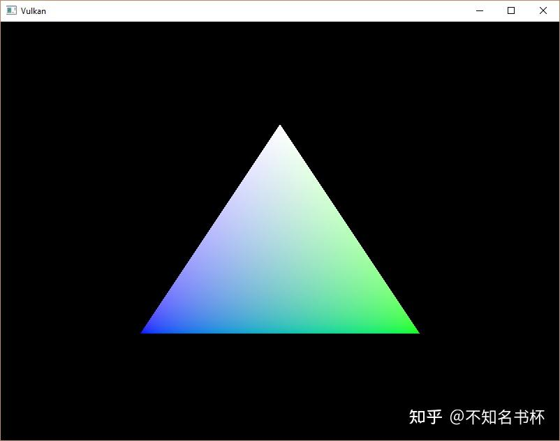
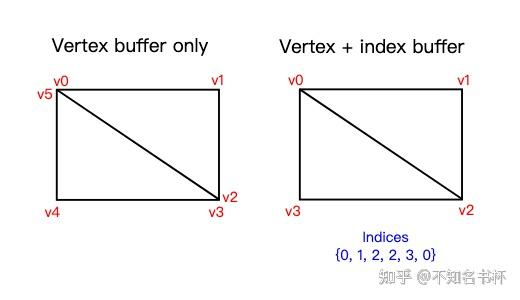
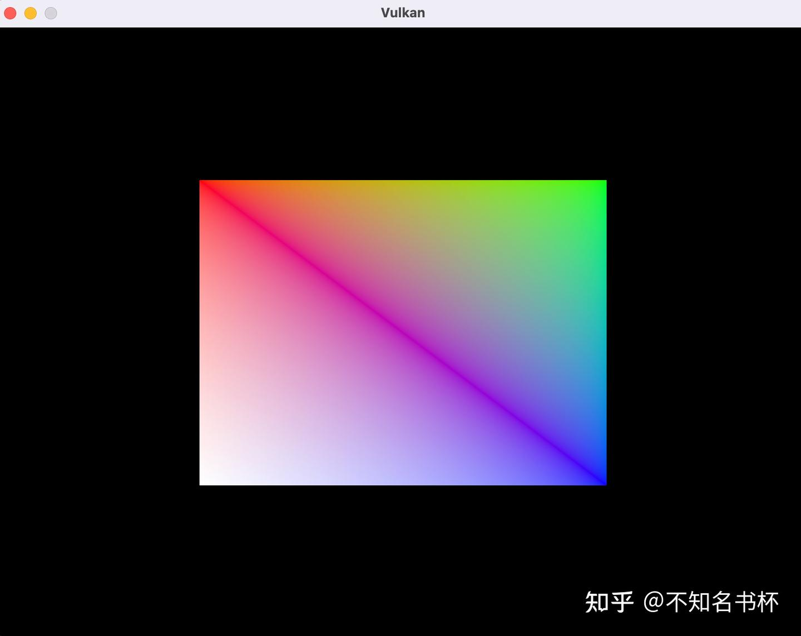

# Vulkan Vertex Buffer

> 这里是记录笔者Vulkan的学习记录，参照该教程[vulkan-tutorial.com](https://link.zhihu.com/?target=https%3A//vulkan-tutorial.com/Drawing_a_triangle/Drawing/Command_buffers)这里是记录笔者Vulkan的学习记录，如果你想识别Vulkan相比于之前的传统图形API有什么区别和优势的话，欢迎看我的另外一篇文章[初探Vulkan](https://zhuanlan.zhihu.com/p/554631289)。相信应该能够帮助你识别Vulkan的优势所在。

在接下来的内容中，我们将用内存中的Vertex Buffer来取代顶点着色器中的硬编码顶点数据。我们将从最简单的方法开始，即创建一个CPU可见的缓冲区，并使用memcpy将顶点数据直接复制到其中，之后我们将看到如何使用一个暂存缓冲区将顶点数据复制到高性能的内存。

## Vextex Shader

首先我们将修改[顶点着色器](https://zhida.zhihu.com/search?content_id=211956363&content_type=Article&match_order=2&q=顶点着色器&zhida_source=entity)的代码，我们在其中还是使用硬编码的顶点位置和[顶点色](https://zhida.zhihu.com/search?content_id=211956363&content_type=Article&match_order=1&q=顶点色&zhida_source=entity)。修改后的代码如下所示，

```cpp
layout(location = 0) in vec2 inPosition;
layout(location = 1) in vec3 inColor;
// 在这里想传递相应的变量传递到像素着色器阶段
layout(location = 0) out vec3 fragColor;

void main() {
    gl_Position = vec4(inPosition, 0.0, 1.0);
    fragColor = inColor;
}
```

在这里我们将之前的顶点数据都删除了，并且声明了inPosition 和 inColor 两个变量，用于接受从Vertex Buffer当中接收数据。这两个变量是[顶点属性](https://zhida.zhihu.com/search?content_id=211956363&content_type=Article&match_order=1&q=顶点属性&zhida_source=entity)。它们是在Vertex Buffer中为每个顶点指定的属性，就像我们使用两个数组手动指定每个顶点的位置和颜色一样。

## Vertex Data

```cpp
struct Vertex {
    glm::vec2 pos;
    glm::vec3 color;
};

const std::vector<Vertex> vertices = {
    {{0.0f, -0.5f}, {1.0f, 0.0f, 0.0f}},
    {{0.5f, 0.5f}, {0.0f, 1.0f, 0.0f}},
    {{-0.5f, 0.5f}, {0.0f, 0.0f, 1.0f}}
};
```

现在使用 Vertex 结构来指定一个顶点数据数组。我们使用与以前完全相同的Pos和Color，但现在它们被组合成一个顶点数组。这称为交错顶点属性。

### Vextex D**escriptions**

将下来我们将完成在C++程序方面的顶点数据描述以及绑定的操作。首先我们需要创建一个关于顶点数据的结构体，然后声明Vextex Description**。**代码如下所示：

```cpp
static VkVertexInputBindingDescription getBindingDescription() {
          VkVertexInputBindingDescription bindingDescription{};
          bindingDescription.binding = 0;
          bindingDescription.stride = sizeof(Vertex);
          bindingDescription.inputRate = VK_VERTEX_INPUT_RATE_VERTEX;
          return bindingDescription;
      }
```

从上面可以看出，我们在这里只设定了两个顶点属性，分别是Pos和Color。并且需要告诉Vulkan 在上传到 GPU 内存后如何将此数据格式传递给顶点着色器。首先我们需要填充**VkVertexInputBindingDescription**。VkVertexInputBindingDescription描述了以什么形式从内存中加载整个顶点的数据。它规定了不同顶点数据之间的字节数，以及是否在每个顶点之后或每个实例之后移动到下一个数据。我们所有的每个顶点数据都打包在一个数组中，所以我们只会有一个绑定。 binding 字段指定bingding数组中绑定的索引所以这里设置为0。 stride 字段指定从一个顶点数据到下一个顶点数据的字节数， inputRate 参数可以具有以下值之一：

- VK_VERTEX_INPUT_RATE_VERTEX: 在每个顶点之后移动到下一个顶点。
- VK_VERTEX_INPUT_RATE_INSTANCE: 每个实例之后移动到下一个实例。

### **Attribute Descriptions**

```cpp
static std::array<VkVertexInputAttributeDescription, 2> getAttributeDescriptions() {
        std::array<VkVertexInputAttributeDescription, 2> attributeDescriptions{};
        attributeDescriptions[0].binding = 0;
        attributeDescriptions[0].location = 0;
        attributeDescriptions[0].format = VK_FORMAT_R32G32_SFLOAT;
        attributeDescriptions[0].offset = offsetof(Vertex, pos);
        attributeDescriptions[1].binding = 0;
        attributeDescriptions[1].location = 1;
        attributeDescriptions[1].format = VK_FORMAT_R32G32B32_SFLOAT;
        // 使用offsetof来计算这个属性在结构体中的偏移量
        attributeDescriptions[1].offset = offsetof(Vertex, color);
        return attributeDescriptions;
    }
```

描述如何处理顶点输入的第二个结构是 VkVertexInputAttributeDescription。我们将来填充这个结构体。正如上面的代码所示，将有两个这样的结构。Attribute Descriptions描述了如何从源自绑定描述的顶点数据块中提取顶点属性。我们有两个属性，位置和颜色，所以我们需要两个Attribute Descriptions。

binding参数告诉Vulkan每个顶点的数据来自哪个binding。Location参数引用顶点着色器中输入的Location指令。顶点着色器中位置为0的输入是position，它是32bit单精度数据。

format参数描述了属性的数据类型。有点令人困惑的是，格式是用与颜色格式相同的枚举法来指定的。以下着色器类型和格式通常一起使用。

- float: VK_FORMAT_R32_SFLOAT
- vec2: VK_FORMAT_R32G32_SFLOAT
- vec3: VK_FORMAT_R32G32B32_SFLOAT
- vec4: VK_FORMAT_R32G32B32A32_SFLOAT

如你所见，你应该使用颜色数量与着色器数据类型中的分量个数匹配的格式。允许使用比着色器中的分量个数更大的范围，但是它将会被默认丢弃。如果低于着色器分量的数量，则BGA组件将使用默认值**(0, 0, 1)**。颜色类型(**SFLOAT**, **UINT**, **SINT**) 和位宽度应该与着色器输入的类型对应匹配。如下示例：

format参数隐含地定义了属性数据的字节大小，offset参数指定了从每个顶点数据开始读取的字节数。绑定时一次加载一个顶点，位置属性（pos）在这个结构的开始处的偏移量为0字节。这是用offsetof宏自动计算的。

### **Pipeline vertex input**

接下里需要去PipeLine的设置当中添加让图形队列能够接受这种的格式的顶点数据。

```cpp
auto bindingDescription = Vertex::getBindingDescription();
auto attributeDescriptions = Vertex::getAttributeDescriptions();

vertexInputInfo.vertexBindingDescriptionCount = 1;
vertexInputInfo.vertexAttributeDescriptionCount = static_cast<uint32_t>(attributeDescriptions.size());
vertexInputInfo.pVertexBindingDescriptions = &bindingDescription;
vertexInputInfo.pVertexAttributeDescriptions = attributeDescriptions.data();
```

管道现在已经准备好接受顶点容器格式的顶点数据并将其传递给我们的顶点着色器。如果你现在在启用验证层的情况下运行程序，我们将会看到无顶点缓冲区绑定的提示。下一步是创建一个顶点缓冲区，并将顶点数据移至其中，以便GPU能够访问它。

## **Vertex buffer**

在Vulkan 中，缓冲区是内存的一块区域，该区域用于向显卡提供预要读取的任意数据。它们可以用来存储顶点数据，也可以用于其他目的。与到目前为止我们一直在处理的 Vulkan 对象不同，缓冲区不会自动为自己分配内存。前几章的工作表明，Vulkan API 让程序员可以控制几乎所有事情，内存管理就是其中之一。

让我们来开始创建我们的VertexBuffer吧，

```cpp
void createVertexBuffer() {
    VkBufferCreateInfo bufferInfo{};
    bufferInfo.sType = VK_STRUCTURE_TYPE_BUFFER_CREATE_INFO;
    bufferInfo.size = sizeof(vertices[0]) * vertices.size();
    bufferInfo.usage = VK_BUFFER_USAGE_VERTEX_BUFFER_BIT;
    bufferInfo.sharingMode = VK_SHARING_MODE_EXCLUSIVE;

    if (vkCreateBuffer(device, &bufferInfo, nullptr, &vertexBuffer) != VK_SUCCESS) {
        throw std::runtime_error("failed to create vertex buffer!");
    }
}
```

继续Vulkan的代码风格，开始填充相应的结构体。结构体的第一个字段是 size，它指定缓冲区的大小(以字节为单位)。使用 sizeof 可以直接计算顶点数据的字节大小。

第二个字段是usage，它指示缓冲区中的数据将用于何种目的。可以使用位操作指定多个使用目的。我们的用例将是一个顶点缓冲区，所以使用VK_BUFFER_USAGE_VERTEX_BUFFER_BIT来标识。

就像Swap Chain中的Image，缓冲区也可以由特定QueueFamily拥有或同时在多个队列之间共享。缓冲区只会从图形队列中使用，所以我们可以坚持独占访问。所以在这里将 sharingMode字段设置为VK_SHARING_MODE_EXCLUSIVE

最后可以使用 vkCreateBuffer 创建缓冲区。定义一个类成员来保存缓冲区句柄并将其称为 vertexBuffer。

### **Memory requirements**

缓冲区已创建，但实际上还没有分配任何内存。为缓冲区分配内存的第一步是使用vkGetBufferMemoryRequirements 函数查询其内存需求。这也是vulkan设计思想当中关于资源复用的体现。Buffer等资源概念和实际物理内存分离开来，方便了别名复用。提高内存的复用率。

```cpp
VkMemoryRequirements memRequirements;
vkGetBufferMemoryRequirements(device, vertexBuffer, &memRequirements);
```

VkMemoryRequirements 结构具有三个字段：

- size：所需内存量的大小(以字节为单位)，可能与 bufferInfo.size 不同。
- alignment：缓冲区在分配的内存区域中开始的偏移量，取决于 bufferInfo.usage 和 bufferInfo.flags。
- memoryTypeBits：适用于缓冲区的内存类型的位字段。

显卡可以提供不同类型的内存进行分配。每种类型的内存在允许的操作和性能特征方面有所不同。我们需要结合缓冲区的需求和我们自己的应用程序需求来找到合适的内存类型来使用。让我们为此创建一个新函数 findMemoryType。

```cpp
uint32_t findMemoryType(uint32_t typeFilter, VkMemoryPropertyFlags properties) {
      VkPhysicalDeviceMemoryProperties memProperties;
      vkGetPhysicalDeviceMemoryProperties(physicalDevice, &memProperties);

      for (uint32_t i = 0; i < memProperties.memoryTypeCount; i++) {
          if ((typeFilter & (1 << i)) && (memProperties.memoryTypes[i].propertyFlags & properties) == properties) {
              return i;
          }
      }

      throw std::runtime_error("failed to find suitable memory type!");
  }
```

首先使用vkGetPhysicalDeviceMemoryProperties查询有关可用内存类型的信息。VkPhysicalDeviceMemoryProperties 结构有两个数组 memoryTypes 和 memoryHeaps。内存堆是不同的内存资源，例如专用 VRAM 和 RAM 中的[交换空间](https://zhida.zhihu.com/search?content_id=211956363&content_type=Article&match_order=1&q=交换空间&zhida_source=entity)，用于 VRAM 用完时。这些堆内存在不同类型的内存。现在我们只关心内存的类型而不是它来自的什么堆，但是你可以想象到来自于不同堆内存的区别，这肯定会影响性能。

**typeFilter**字段将以位的形式代表适合的内存类型。这意味着通过简单的迭代内存属性集合，并根据需要的类型与每个内存属性的类型进行AND操作，判断是否为**1。在将来我们可能不止一个所需属性，所以我们应该检查按位AND的结果是否为零，而不是直接等于期望的位字段。如果有一个内存类型适合我们的缓冲区，它也具有需要的所有属性，那么我们就返回它的索引，否则我们抛出一个异常信息。**

然而，我们不只是对适合顶点缓冲区的内存类型感兴趣。我们还需要能够将我们的顶点数据写入该内存。memoryTypes数组由VkMemoryType结构组成，指定了每种类型的内存的堆和属性。属性定义了内存的特殊功能，比如能够映射它，所以我们可以从CPU写入。这个属性用VK_MEMORY_PROPERTY_HOST_VISIBLE_BIT表示，但是我们还需要使用VK_MEMORY_PROPERTY_HOST_COHERENT_BIT属性。我们将在后续映射内存的过程看到原因。

### **Memory allocation**

找到了相对应的内存的属性之后，我们接下来就可以开始内存分配了。

```cpp
VkDeviceMemory vertexBufferMemory;

VkMemoryAllocateInfo allocInfo{};
allocInfo.sType = VK_STRUCTURE_TYPE_MEMORY_ALLOCATE_INFO;
allocInfo.allocationSize = memRequirements.size;
allocInfo.memoryTypeIndex = findMemoryType(memRequirements.memoryTypeBits, properties);

if (vkAllocateMemory(device, &allocInfo, nullptr, &bufferMemory) != VK_SUCCESS) {
    throw std::runtime_error("failed to allocate buffer memory!");
}
```

内存分配现在就像指定大小和类型一样简单，这两者都来自顶点缓冲区的内存需求和所需的属性。创建一个类成员将句柄存储到内存并使用 vkAllocateMemory 分配它。

如果内存分配成功，那么我们现在可以使用 vkBindBufferMemory 将此内存与缓冲区相关联：

```cpp
vkBindBufferMemory(device, vertexBuffer, vertexBufferMemory, 0);
```

前三个参数是不言自明的，第四个参数是内存区域内的offset。由于这个内存是专门为这个顶点缓冲区分配的，所以offset只是 0。如果offset不为零，那么它需要被 memRequirements.alignment 整除。

```cpp
// 不要忘记释放内存哦
void cleanup() {
    cleanupSwapChain();

    vkDestroyBuffer(device, vertexBuffer, nullptr);
    vkFreeMemory(device, vertexBufferMemory, nullptr);
```

### **Filling the vertex buffer**

现在是时候将顶点数据复制到缓冲区了。这是通过使用 vkMapMemory 将Buffer[内存映射](https://zhida.zhihu.com/search?content_id=211956363&content_type=Article&match_order=1&q=内存映射&zhida_source=entity)到 CPU 可访问内存来完成的。

```cpp
void* data;
vkMapMemory(device, stagingBufferMemory, 0, bufferSize, 0, &data);
memcpy(data, vertices.data(), (size_t) bufferSize);
vkUnmapMemory(device, stagingBufferMemory);
```

首先来看到vkMapMemory函数 .此函数允许我们访问由偏移量和大小定义的指定内存资源的区域。在这里offset和size分别是**0**和**bufferInfo.size**。也可以指定特殊值 VK_WHOLE_SIZE 来映射所有内存。倒数第二个参数可用于指定标志，但当前 API 中还没有任何可用的参数。它必须设置为值 0。最后一个参数指定指向映射内存的指针的输出。

现在你可以简单地将顶点数据memcpy到映射的内存中，然后使用vkUnmapMemory再次取消映射。不幸的是，[驱动程序](https://zhida.zhihu.com/search?content_id=211956363&content_type=Article&match_order=1&q=驱动程序&zhida_source=entity)可能不会立即将数据复制到Buffer内存中，例如，由于Cache的原因。也有可能写到缓冲区的数据在映射的内存中还不可见。有两种方法来处理这个问题。

- 使用主机一致性的内存堆，用VK_MEMORY_PROPERTY_HOST_COHERENT_BIT表示。
- 在写入映射的内存后调用vkFlushMappedMemoryRanges，并在从映射的内存中读取之前调用vkInvalidateMappedMemoryRanges

我们选择了第一种方法，它可以确保映射的内存总是与分配的内存内容相匹配。请记住，这可能会导致性能比显式刷新稍差。

刷新内存或使用一致性内存堆意味着驱动程序将意识到我们对缓冲区的写入，但这并不意味着它们在GPU上实际可见。向GPU传输数据是一个在后台发生的操作，规范只是告诉我们，在下一次调用vkQueueSubmit时，保证它已经完成。

### **Binding the vertex buffer**

现在剩下的就是在渲染操作中绑定Vertex Buffer。我们将扩展recordCommandBuffer函数来做到这一点。

```cpp
vkCmdBindPipeline(commandBuffer, VK_PIPELINE_BIND_POINT_GRAPHICS, graphicsPipeline);
VkBuffer vertexBuffers[] = {vertexBuffer};
VkDeviceSize offsets[] = {0};
vkCmdBindVertexBuffers(commandBuffer, 0, 1, vertexBuffers, offsets);
vkCmdDraw(commandBuffer, static_cast<uint32_t>(vertices.size()), 1, 0, 0);
```

vkCmdBindVertexBuffers函数用于绑定Vertex Buffer，就像我们在前一章设置的绑定。除了Command Buffer，前两个参数指定了我们要指定顶点缓冲区的offset 和绑定数量。最后两个参数指定了将要绑定的顶点缓冲区的数组及开始读取数据的起始偏移量。你也应该改变对vkCmdDraw的调用，以传递缓冲区中的顶点数量，而不是之前在Shader中硬编码顶点数据。

接下来修改这个顶点数组的数据

```cpp
const std::vector<Vertex> vertices = {
    {{0.0f, -0.5f}, {1.0f, 1.0f, 1.0f}},
    {{0.5f, 0.5f}, {0.0f, 1.0f, 0.0f}},
    {{-0.5f, 0.5f}, {0.0f, 0.0f, 1.0f}}
};
```

结果如下所示：



使用Vertex Buffer

**Staging buffer**

我们现在拥有的Vertex Buffer可以正常工作，但允许我们从CPU访问它的内存类型可能不是显卡本身读取的最理想的内存类型。最理想的内存有VK_MEMORY_PROPERTY_DEVICE_LOCAL_BIT标志，在专用显卡上通常不能被CPU访问。在后续内容中，我们将创建两个Vertex Buffer。一个在CPU可访问的内存中的Staging Buffer，用于从顶点数组中提交数据，另一个Vertex Buffer用于设备local内存。然后我们将使用缓冲区复制命令将数据从Staging Buffer移到实际的Vertex Buffer。

涉及到内存传输了，那么就必不可少的需要使用Transfer Queue了。好消息是任何具有 VK_QUEUE_GRAPHICS_BIT 或 VK_QUEUE_COMPUTE_BIT 能力的QueueFamily已经隐式支持 VK_QUEUE_TRANSFER_BIT 操作。在这些情况下，实现不需要在 QueueFlags 中明确列出它。

在这里我们由于我们需要创建多个Buffer，于是在这里将createBuffer抽成一个方法。便于使用

```cpp
void createBuffer(VkDeviceSize size, VkBufferUsageFlags usage, VkMemoryPropertyFlags properties, VkBuffer& buffer, VkDeviceMemory& bufferMemory) {
    VkBufferCreateInfo bufferInfo{};
    bufferInfo.sType = VK_STRUCTURE_TYPE_BUFFER_CREATE_INFO;
    bufferInfo.size = size;
    bufferInfo.usage = usage;
    bufferInfo.sharingMode = VK_SHARING_MODE_EXCLUSIVE;
    if (vkCreateBuffer(device, &bufferInfo, nullptr, &buffer) != VK_SUCCESS) {
        throw std::runtime_error("failed to create buffer!");
    }
    VkMemoryRequirements memRequirements;
    vkGetBufferMemoryRequirements(device, buffer, &memRequirements);
    VkMemoryAllocateInfo allocInfo{};
    allocInfo.sType = VK_STRUCTURE_TYPE_MEMORY_ALLOCATE_INFO;
    allocInfo.allocationSize = memRequirements.size;
    allocInfo.memoryTypeIndex = findMemoryType(memRequirements.memoryTypeBits, properties);
    if (vkAllocateMemory(device, &allocInfo, nullptr, &bufferMemory) != VK_SUCCESS) {
        throw std::runtime_error("failed to allocate buffer memory!");
    }
    vkBindBufferMemory(device, buffer, bufferMemory, 0);
}
```

将createVertexBuffer修改为如下所示：

```cpp
void createVertexBuffer() {
    VkDeviceSize bufferSize = sizeof(vertices[0]) * vertices.size();
    createBuffer(bufferSize, VK_BUFFER_USAGE_VERTEX_BUFFER_BIT, VK_MEMORY_PROPERTY_HOST_VISIBLE_BIT | VK_MEMORY_PROPERTY_HOST_COHERENT_BIT, vertexBuffer, vertexBufferMemory);
    void* data;
    vkMapMemory(device, vertexBufferMemory, 0, bufferSize, 0, &data);
    memcpy(data, vertices.data(), (size_t) bufferSize);
    vkUnmapMemory(device, vertexBufferMemory);
}
```

### **Using a staging buffer**

我们现在将更改 createVertexBuffer 仅使用host可见Buffer作为Staging Buffer，并且使用device Buffer作为最终Vertex Buffer。

```cpp
void createVertexBuffer() {
    VkDeviceSize bufferSize = sizeof(vertices[0]) * vertices.size();
    VkBuffer stagingBuffer;
    VkDeviceMemory stagingBufferMemory;
    createBuffer(bufferSize, VK_BUFFER_USAGE_TRANSFER_SRC_BIT, VK_MEMORY_PROPERTY_HOST_VISIBLE_BIT | VK_MEMORY_PROPERTY_HOST_COHERENT_BIT, stagingBuffer, stagingBufferMemory);
    void* data;
    vkMapMemory(device, stagingBufferMemory, 0, bufferSize, 0, &data);
    memcpy(data, vertices.data(), (size_t) bufferSize);
    vkUnmapMemory(device, stagingBufferMemory);
    createBuffer(bufferSize, VK_BUFFER_USAGE_TRANSFER_DST_BIT | VK_BUFFER_USAGE_VERTEX_BUFFER_BIT, VK_MEMORY_PROPERTY_DEVICE_LOCAL_BIT, vertexBuffer, vertexBufferMemory);
}
```

我们现在使用带有 stagingBufferMemory的StagingBuffer 来映射和复制顶点数据。在这里我们将使用两个新的缓冲区usage字段：

- VK_BUFFER_USAGE_TRANSFER_SRC_BIT：缓冲区可以用作内存传输操作中的源头。
- VK_BUFFER_USAGE_TRANSFER_DST_BIT：缓冲区可以用作内存传输操作中的目的地。

vertexBuffer 现在是从device Loacl 内存类型分配的，这通常意味着无法使用 vkMapMemory。但是我们可以将数据从Staging Buffer复制到VertexBuffer。我们必须通过指定StagingBuffer为VK_BUFFER_USAGE_TRANSFER_SRC_BIT和VertexBuffer 为VK_BUFFER_USAGE_TRANSFER_DST_BIT。

我们现在要编写一个copyBuffer函数来将数据从一个Buffer复制到另一个Buffer。如下所示:

```cpp
void copyBuffer(VkBuffer srcBuffer, VkBuffer dstBuffer, VkDeviceSize size) {
        VkCommandBufferAllocateInfo allocInfo{};
        allocInfo.sType = VK_STRUCTURE_TYPE_COMMAND_BUFFER_ALLOCATE_INFO;
        allocInfo.level = VK_COMMAND_BUFFER_LEVEL_PRIMARY;
        allocInfo.commandPool = commandPool;
        allocInfo.commandBufferCount = 1;
        VkCommandBuffer commandBuffer;
        vkAllocateCommandBuffers(device, &allocInfo, &commandBuffer);
        VkCommandBufferBeginInfo beginInfo{};
        beginInfo.sType = VK_STRUCTURE_TYPE_COMMAND_BUFFER_BEGIN_INFO;
        beginInfo.flags = VK_COMMAND_BUFFER_USAGE_ONE_TIME_SUBMIT_BIT;
        vkBeginCommandBuffer(commandBuffer, &beginInfo);
        VkBufferCopy copyRegion{};
        copyRegion.srcOffset = 0; // Optional
        copyRegion.dstOffset = 0; // Optional
        copyRegion.size = size;
        vkCmdCopyBuffer(commandBuffer, srcBuffer, dstBuffer, 1, &copyRegion);
        vkEndCommandBuffer(commandBuffer);
        VkSubmitInfo submitInfo{};
        submitInfo.sType = VK_STRUCTURE_TYPE_SUBMIT_INFO;
        submitInfo.commandBufferCount = 1;
        submitInfo.pCommandBuffers = &commandBuffer;
        vkQueueSubmit(graphicsQueue, 1, &submitInfo, VK_NULL_HANDLE);
        vkQueueWaitIdle(graphicsQueue);
        vkFreeCommandBuffers(device, commandPool, 1, &commandBuffer);

    }
```

首先内存传输操作需要使用Command Buffer执行，就像绘图命令一样。因此我们必须首先分配一个临时命令缓冲区。您可能希望为这些类型的短期缓冲区创建一个单独的命令池，因为实现可能能够应用内存分配优化。在这种情况下，您应该在Command Pool生成期间使用 VK_COMMAND_POOL_CREATE_TRANSIENT_BIT 标志代表是临时的。

因为我们将只使用一次Command Buffer，并等待从函数中返回，直到复制操作执行完毕。使用VK_COMMAND_BUFFER_USAGE_ONE_TIME_SUBMIT_BIT来告诉驱动程序我们的意图是很好的做法。

Buffer中的数据使用 vkCmdCopyBuffer 命令传输。它使用source和destination缓冲区及一个缓冲区拷贝的区域作为参数。这些区域在 VkBufferCopy 结构中定义，由源缓冲区offset、目标缓冲区offset和大小组成。与 vkMapMemory 命令不同，此处无法指定 VK_WHOLE_SIZE。

该Command Buffer仅包含传输命令，因此我们可以在此之后立即停止Record。与绘图命令不同，这次没有我们需要等待的事件。我们只想立即在Buffer上执行传输操作。还有两种可能的方法可以等待此传输完成。我们可以使用Fence并使用 vkWaitForFences 等待，或者简单地使用 vkQueueWaitIdle 等待传输队列空闲。Fence将允许您同时安排多个传输并等待所有传输完成，而不是一次执行一个。这可能会给开发者更多的优化空间。

应该注意的是，在真正的工业化工程当中，您不应该为每个单独的缓冲区实际调用 vkAllocateMemory。同时分配内存的最大数量受 maxMemoryAllocationCount 物理设备限制的限制，即使在 NVIDIA GTX 1080 等高端硬件上也可能低至 4096。同时为大量对象分配内存的正确方法是创建一个自定义分配器，通过使用我们在许多函数中看到的偏移参数在许多不同对象之间拆分单个分配。 您可以自己实现这样的分配器，也可以使用VulkanMemoryAllocator 库。但是对于这个来说可以为每个资源使用单独的分配，因为我们现在不会接近达到这些限制中的任何一个。

## **Index buffer**

在现实世界的应用中，你要渲染的三维网格往往会在多个三角形之间共享顶点。即使是画一个简单的矩形，也已经发生了这种情况。



绘制一个矩形需要两个三角形，这意味着我们需要一个有6个顶点的vertex Buffer。问题是，两个顶点的数据需要重复，导致50%的冗余。这在更复杂的网格中只会变得更糟，顶点在平均3个三角形中被重复使用。解决这个问题的方法是使用Index Buffer。

索引缓冲区(Index buffer)就是一个指向顶点缓冲区的指针数组，它允许我们重排列顶点数据，并复用多个已经存在的顶点数据。上面的插图展示了如果我们有一个包含四个顶点的Vertex Buffer，那么矩形的Index Buffer会是什么样子。如上图右侧所示，前三个index定义了右上角的三角形，后三个index定义了左下角的三角形的顶点。

### **Index buffer creation**

在本章中，我们将修改顶点数据并添加索引数据以绘制如图所示的矩形。修改顶点数据以表示四个角。左上角是红色，右上角是绿色，右下角是蓝色，左下角是白色。我们将添加一个新的数组Indices来表示Index Buffer的内容。它应该与插图中的索引相匹配，以绘制右上角的三角形和左下角的三角形。

```cpp
const std::vector<Vertex> vertices = {
    {{-0.5f, -0.5f}, {1.0f, 0.0f, 0.0f}},
    {{0.5f, -0.5f}, {0.0f, 1.0f, 0.0f}},
    {{0.5f, 0.5f}, {0.0f, 0.0f, 1.0f}},
    {{-0.5f, 0.5f}, {1.0f, 1.0f, 1.0f}}
};

const std::vector<uint16_t> indices = {
    0, 1, 2, 2, 3, 0
};
```

就像顶点数据一样，索引数据需要上传到 VkBuffer 中，以便 GPU 能够访问它们。定义两个新的类成员来保存索引缓冲区的资源：

```cpp
VkBuffer indexBuffer;
VkDeviceMemory indexBufferMemory;

void createIndexBuffer() {
    VkDeviceSize bufferSize = sizeof(indices[0]) * indices.size();

    VkBuffer stagingBuffer;
    VkDeviceMemory stagingBufferMemory;
    createBuffer(bufferSize, VK_BUFFER_USAGE_TRANSFER_SRC_BIT, VK_MEMORY_PROPERTY_HOST_VISIBLE_BIT | VK_MEMORY_PROPERTY_HOST_COHERENT_BIT, stagingBuffer, stagingBufferMemory);

    void* data;
    vkMapMemory(device, stagingBufferMemory, 0, bufferSize, 0, &data);
    memcpy(data, indices.data(), (size_t) bufferSize);
    vkUnmapMemory(device, stagingBufferMemory);

    createBuffer(bufferSize, VK_BUFFER_USAGE_TRANSFER_DST_BIT | VK_BUFFER_USAGE_INDEX_BUFFER_BIT, VK_MEMORY_PROPERTY_DEVICE_LOCAL_BIT, indexBuffer, indexBufferMemory);

    copyBuffer(stagingBuffer, indexBuffer, bufferSize);

    vkDestroyBuffer(device, stagingBuffer, nullptr);
    vkFreeMemory(device, stagingBufferMemory, nullptr);
}
```

只有两个显着的区别。 bufferSize 现在等于Index数量乘以Index类型的大小(比如uint16_t 或 uint32_t)。 Index Buffer的使用应该是 VK_BUFFER_USAGE_INDEX_BUFFER_BIT 而不是 VK_BUFFER_USAGE_VERTEX_BUFFER_BIT，除此之外过程完全相同。我们创建一个Staging Buffer 来复制Index数据，然后将其复制到最终的device Loacl Index Buffer当中。

同样需要记得销毁内存和Buffer

```cpp
*void* cleanup() {
    cleanupSwapChain();

    vkDestroyBuffer(device, indexBuffer, nullptr);
    vkFreeMemory(device, indexBufferMemory, nullptr);

    vkDestroyBuffer(device, vertexBuffer, nullptr);
    vkFreeMemory(device, vertexBufferMemory, nullptr);

    ...
}
```

### **Using an index buffer**

使用Index Buffer进行渲染涉及对 recordCommandBuffer的两个更改。我们首先需要绑定Index Buffer，就像我们为Vextex Buffer所做的那样。不同之处在于您只能有一个Index Buffer。不幸的是，不可以为每个顶点属性使用不同的索引，因此即使只有一个属性发生变化，我们仍然必须完全复制顶点数据。

```cpp
vkCmdBindVertexBuffers(commandBuffer, 0, 1, vertexBuffers, offsets);

vkCmdBindIndexBuffer(commandBuffer, indexBuffer, 0, VK_INDEX_TYPE_UINT16);
```

用vkCmdBindIndexBuffer来绑定一个Index BUffer，它有Index Buffer、其中的offset和索引数据的类型作为参数。如前所述，可能的类型是 VK_INDEX_TYPE_UINT16 和 VK_INDEX_TYPE_UINT32。

仅仅绑定一个Index Buffer还不能改变什么，我们还需要改变绘图命令来告诉Vulkan使用Index Buffer。删除vkCmdDraw一行，用vkCmdDrawIndexed取代。

```cpp
vkCmdDrawIndexed(commandBuffer, static_cast<uint32_t>(indices.size()), 1, 0, 0, 0);
```

运行结果如下所示：



使用Index Buffer

## 总结

这次我们将之前在Shader中硬编码顶点数据的方式，现在换成了使用Vertex Buffer将顶点数据传到Shader当中使用。并且在这里我们通过Staging Buffer将其复制拷贝到Device Loacl Buffer当中，使得有了更高的性能。通过使用TransferQueue完成将Staging Buffer拷贝到真正Vertex Buffer的操作，因为Device Loacl Buffer是不可以通过映射操作的。最后我们使用Index Buffer来减少Vertex Buffer中的冗余数据。

编辑