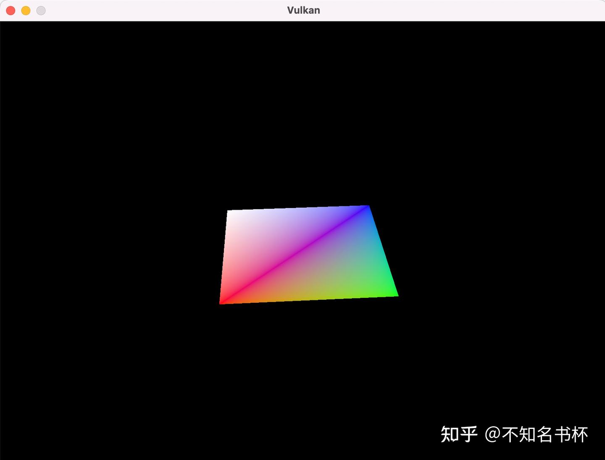

# Vulkan Descriptor Layout and Buffer

> 这里是记录笔者Vulkan的学习记录，参照该教程[vulkan-tutorial.com](https://vulkan-tutorial.com/Drawing_a_triangle/Drawing/Command_buffers)这里是记录笔者Vulkan的学习记录，如果你想识别Vulkan相比于之前的传统图形API有什么区别和优势的话，欢迎看我的另外一篇文章[初探Vulkan](https://zhuanlan.zhihu.com/p/554631289)。相信应该能够帮助你识别Vulkan的优势所在。

我们现在能够为每个顶点向顶点着色器传递任意的属性，但如果是[全局变量](https://zhida.zhihu.com/search?content_id=212067269&content_type=Article&match_order=1&q=全局变量&zhida_source=entity)呢？从这一章开始，我们将转向3D图形，这需要一个MVP矩阵。我们可以把它作为顶点数据，但这是对带宽和内存的浪费，而且每当变换发生变化时，我们都需要更新Vertex Buffer。但这些矩阵可能很容易在每一帧都发生变化。

在Vulkan中解决这个问题的正确方法是使用资源描述符(Resource Descriptors)。Descriptors是一种让着色器自由访问缓冲区和图像等资源的方式。我们将设置一个包含MVP矩阵的Buffer，让顶点着色器通过Descriptors来访问它们。Descriptors的使用流程分为以下三步:

- 在PipeLine创建过程中指定一个Descriptor Layout。
- 从Descriptor Pool中分配一个Descriptor Set。
- 在渲染过程中绑定Descriptor Set。

Descriptor Layout指定了将被PipeLine访问的资源类型，就像RenderPass指定了将相应的Attchment类型。Descriptor Set指定实际的缓冲区或图像资源将被绑定到Descriptor上，就像FrameBuffer指定实际的Image View绑定到RenderPass的 Attachment上。然后Descriptor Set就像Vertex Buffer和Frame Buffer一样被绑定到绘图命令中。

有许多类型的Descriptor，但在本章中我们将使用统一缓冲区对象(UBO）。在后续当中也会研究其他类型的[描述符](https://zhida.zhihu.com/search?content_id=212067269&content_type=Article&match_order=2&q=描述符&zhida_source=entity)，但基本过程是一样的。假设我们在一个C结构中拥有我们希望[顶点着色器](https://zhida.zhihu.com/search?content_id=212067269&content_type=Article&match_order=3&q=顶点着色器&zhida_source=entity)拥有的数据，就像这样。

```cpp
struct UniformBufferObject {
    glm::mat4 model;
    glm::mat4 view;
    glm::mat4 proj;
};
```

然后我们可以将数据复制到一个VkBuffer中，并通过UBO Descriptor从顶点着色器中访问它，像这样。

```cpp
layout(binding = 0) uniform UniformBufferObject {
    mat4 model;
    mat4 view;
    mat4 proj;
} ubo;

layout(location = 0) in vec2 inPosition;
layout(location = 1) in vec3 inColor;

layout(location = 0) out vec3 fragColor;

void main() {
        // 完成MVP变换
    gl_Position = ubo.proj * ubo.view * ubo.model * vec4(inPosition, 0.0, 1.0);
    fragColor = inColor;
}
```

注意unifrom、in和out声明的顺序并不重要。**binding**指令与**location**属性指令类似。我们要在Descriptor Layout中引用这个绑定。带有gl_Position的属性经过MVP变换来计算出在[裁剪空间](https://zhida.zhihu.com/search?content_id=212067269&content_type=Article&match_order=1&q=裁剪空间&zhida_source=entity)下顶点的最终位置。与二维三角形不同，裁剪空间坐标的最后一个分量可能不是1，需要进行透视除法，这对于使较近的物体看起来比较远的物体大是至关重要的。

## **Descriptor set layout**

下一步是在C++端定义UBO结构体，并在顶点着色器中告诉Vulkan需要使用Descriptor。在C++侧同样创建类似的数据结构。

```cpp
struct UniformBufferObject {
    glm::mat4 model;
    glm::mat4 view;
    glm::mat4 proj;
};
```

我们可以使用GLM中的数据类型完全匹配着色器中的定义。矩阵中的数据与着色器期望的方式二进制兼容，所以我们以后只需将UniformBufferObject memcpy拷贝到VkBuffer中即可。

我们需要提供在用于PipeLine创建的着色器中的每个Descriptor Binding的所有细节，就像我们必须为每个顶点属性及其位置索引做的那样。我们将设置一个新的函数来定义所有这些信息，叫做createDescriptorSetLayout。它应该在PipeLine创建之前被调用，考虑到我们会在PipeLine创建中使用。

```cpp
void createDescriptorSetLayout() {
    VkDescriptorSetLayoutBinding uboLayoutBinding{};
    uboLayoutBinding.binding = 0;
    uboLayoutBinding.descriptorType = VK_DESCRIPTOR_TYPE_UNIFORM_BUFFER;
    uboLayoutBinding.descriptorCount = 1;
}
```

每个Binding都需要通过 VkDescriptorSetLayoutBinding 结构体来描述。前两个字段指定了shader中使用的绑定和Descriptor类型，VK_DESCRIPTOR_TYPE_UNIFORM_BUFFER则代表是一个UBO。[shader变量](https://zhida.zhihu.com/search?content_id=212067269&content_type=Article&match_order=1&q=shader变量&zhida_source=entity)有可能代表一个UBO的数组，descriptorCount指定数组中的数值数量。例如，这可以用来为[骨骼动画](https://zhida.zhihu.com/search?content_id=212067269&content_type=Article&match_order=1&q=骨骼动画&zhida_source=entity)中的每块Boens指定一个变换。我们的MVP转换是在一个单UBO对象，所以我们使用descriptorCount为1。

```cpp
uboLayoutBinding.stageFlags = VK_SHADER_STAGE_VERTEX_BIT;
uboLayoutBinding.pImmutableSamplers = nullptr; // Optional
```

在这里需要指定Descriptor将在哪个着色器阶段被引用。stageFlags可以是VkShaderStageFlagBits值或VK_SHADER_STAGE_ALL_GRAPHICS值的组合。在下面例子中，我们只在顶点着色器中引用这个的Descriptor。pImmutableSamplers字段只与图像采样相关的符Descriptor关，我们在这里不需要使用，现在可以将其保留为默认值。

然后我们可以使用vkCreateDescriptorSetLayout创建它。这个函数接受一个简单的VkDescriptorSetLayoutCreateInfo这个结构体将持有一个Binding数组。

```cpp
// 类成员
VkDescriptorSetLayout descriptorSetLayout;
VkPipelineLayout pipelineLayout;

VkDescriptorSetLayoutCreateInfo layoutInfo{};
layoutInfo.sType = VK_STRUCTURE_TYPE_DESCRIPTOR_SET_LAYOUT_CREATE_INFO;
layoutInfo.bindingCount = 1;
layoutInfo.pBindings = &uboLayoutBinding;

if (vkCreateDescriptorSetLayout(device, &layoutInfo, nullptr, &descriptorSetLayout) != VK_SUCCESS) {
    throw std::runtime_error("failed to create descriptor set layout!");
}
```

我们需要在PipeLine创建过程中指定DescriptorSetLayout，以告诉Vulkan着色器将使用哪些Descriptor。DescriptorSetLayout是在PipeLine Layout对象中指定的。修改VkPipelineLayoutCreateInfo以引用PipeLine Layout对象。

```cpp
VkPipelineLayoutCreateInfo pipelineLayoutInfo{};
pipelineLayoutInfo.sType = VK_STRUCTURE_TYPE_PIPELINE_LAYOUT_CREATE_INFO;
pipelineLayoutInfo.setLayoutCount = 1;
pipelineLayoutInfo.pSetLayouts = &descriptorSetLayout;

// 当然要记得销毁上面创建的
vkDestroyDescriptorSetLayout(device, descriptorSetLayout, nullptr);
```

在PipeLineLayout中指定需要使用的DescriptorSetLayout，你可能想知道为什么可以指定多个DescriptorSetLayout，但是在这里一个单一的DescriptorSet已经包括了所有的绑定，所以我们这里只有一个DescriptorSetLayout。后续还会讨论这个问题。

## **Uniform buffer**

在这里我们将为着色器指定包含UBO Buffer数据，但我们需要先创建这个Buffer。我们将在每一帧拷贝新的数据到Uniform Buffer，所以有一个Staging Buffer并没有什么意义。在这种情况下，它只是增加了额外的开销，很可能会降低性能而不是提高性能。

我们应该有多个缓冲区，因为多个帧可能同时在运行，我们不想在为下一个帧做准备去更新Buffer。而前一个帧还在读取该Buffer，因此，我们需要有尽可能多的Uniform Buffer，所以希望写到一个目前没有被GPU读取的Uniform Buffer，避免上述的问题。

```cpp
std::vector<VkBuffer> uniformBuffers;
std::vector<VkDeviceMemory> uniformBuffersMemory;

void createUniformBuffers() {
    VkDeviceSize bufferSize = sizeof(UniformBufferObject);

    uniformBuffers.resize(MAX_FRAMES_IN_FLIGHT);
    uniformBuffersMemory.resize(MAX_FRAMES_IN_FLIGHT);

    for (size_t i = 0; i < MAX_FRAMES_IN_FLIGHT; i++) {
        createBuffer(bufferSize, VK_BUFFER_USAGE_UNIFORM_BUFFER_BIT, VK_MEMORY_PROPERTY_HOST_VISIBLE_BIT | VK_MEMORY_PROPERTY_HOST_COHERENT_BIT, uniformBuffers[i], uniformBuffersMemory[i]);
    }
}
```

我们将编写一个单独的函数用于创建和更新 Uniform Buffer，在每一帧中用新的变换来更新Uniform Buffer，所以这里将不会有vkMapMemory。Uniform 数据将被用于所有的Draw Call，所以包含它的缓冲区应该只在我们停止渲染的时候被销毁。

## **Updating uniform data**

创建一个新的函数updateUniformBuffer，并在提交下一帧之前从drawFrame函数中添加对它的调用。这个函数将在每一帧生成一个新的变换，以使几何体旋转起来。

```cpp
// 引入新的头文件.
#define GLM_FORCE_RADIANS
#include <glm/glm.hpp>
#include <glm/gtc/matrix_transform.hpp>

#include <chrono>

void updateUniformBuffer(uint32_t currentImage){
    static auto startTime = std::chrono::high_resolution_clock::now();
    auto currentTime = std::chrono::high_resolution_clock::now();
    float time = std::chrono::duration<float, std::chrono::seconds::period>(currentTime - startTime).count();
    UniformBufferObject ubo{};
    ubo.model = glm::rotate(glm::mat4(1.0f), time * glm::radians(90.0f), glm::vec3(0.0f, 0.0f, 1.0f));
    ubo.view = glm::lookAt(glm::vec3(2.0f, 2.0f, 2.0f), glm::vec3(0.0f, 0.0f, 0.0f), glm::vec3(0.0f, 0.0f, 1.0f));
    ubo.proj = glm::perspective(glm::radians(45.0f), swapChainExtent.width / (float) swapChainExtent.height, 0.1f, 10.0f);

    // 由于glw是为OpenGL设计的，其中裁剪空间坐标的Y坐标是倒置的。
        // 补偿这个问题的最简单的方法是翻转投影矩阵中Y轴的缩放系数的符号。如果你不这样做，那么图像就会被倒过来渲染。
    ubo.proj[1][1] *= -1;
    void* data;
    vkMapMemory(device, uniformBuffersMemory[currentImage], 0, sizeof(ubo), 0, &data);
    memcpy(data, &ubo, sizeof(ubo));
    vkUnmapMemory(device, uniformBuffersMemory[currentImage]);
}
```

glm/gtc/matrix_transform.hpp包含了了可用于生成[模型变换](https://zhida.zhihu.com/search?content_id=212067269&content_type=Article&match_order=1&q=模型变换&zhida_source=entity)的函数，如glm::rotate，视图变换如glm::lookAt和[投影变换](https://zhida.zhihu.com/search?content_id=212067269&content_type=Article&match_order=1&q=投影变换&zhida_source=entity)如glm::perspective。GLM_FORCE_RADIANS定义是必要的，以确保像glm::rotate这样的函数使用弧度作为参数，以避免任何可能的混淆。chrono标准库头暴露了用来做精确计时的函数。我们将使用它来确保几何体每秒钟旋转90度，而不考虑帧速率。

glm::rotate函数接收一个现有的变换、旋转角度和旋转轴作为参数。glm::mat4(1.0f)构造函数返回一个等值矩阵。使用时间*glm::radians(90.0f)的旋转角度可以完成每秒旋转90度的目的。

对于[视图矩阵](https://zhida.zhihu.com/search?content_id=212067269&content_type=Article&match_order=1&q=视图矩阵&zhida_source=entity)，在这里是从上方以45度角观察几何体。glm::lookAt函数将眼睛位置、中心位置和上轴作为参数。

[透视矩阵](https://zhida.zhihu.com/search?content_id=212067269&content_type=Article&match_order=1&q=透视矩阵&zhida_source=entity)这里选择了使用45度的Fov。其他参数是长宽比、近平面和远平面。重要的是使用当前的Swap Chain来计算长宽比，以考虑到调整大小后窗口的新宽度和高度。

GLM最初是为OpenGL设计的，其中裁剪空间下坐标的Y坐标是倒置的。补偿这个问题的最简单的方法是翻转投影矩阵中Y轴的缩放系数的符号。如果你不这样做，那么图像就会被倒过来渲染。

现在所有的变换都被定义了，所以我们可以将UBO中的数据拷贝到当前的Uniform Buffer中。这与我们对Vertex Buffer的处理方式完全相同，只是没有Staging Buffer。

使用UBO将并不是经常变化的值传递给着色器是非常有效的方式。一个更有效的方法是将一个小的Buffer传递给着色器，即推送常数(Push Const)会在后面讲到。

接下来将继续设置DescriptorSet，它实际上将把VkBuffers与Uniform Buffer Descriptor绑定在一起，以便着色器能够访问这些数据。

## **Descriptor pool**

Descriptor Set不能直接创建，它们必须像Command Pool一样从一个池中分配。那这个结构也被称为Descriptor Pool。我们将写一个新的函数createDescriptorPool来设置它。

```cpp
// 类成员
VkDescriptorPool descriptorPool;

void createDescriptorPool() {
      VkDescriptorPoolSize poolSize{};
      poolSize.type = VK_DESCRIPTOR_TYPE_UNIFORM_BUFFER;
      poolSize.descriptorCount = static_cast<uint32_t>(MAX_FRAMES_IN_FLIGHT);
      VkDescriptorPoolCreateInfo poolInfo{};
      poolInfo.sType = VK_STRUCTURE_TYPE_DESCRIPTOR_POOL_CREATE_INFO;
      poolInfo.poolSizeCount = 1;
      poolInfo.pPoolSizes = &poolSize;
      poolInfo.maxSets = static_cast<uint32_t>(MAX_FRAMES_IN_FLIGHT);
      if (vkCreateDescriptorPool(device, &poolInfo, nullptr, &descriptorPool) != VK_SUCCESS) {
          throw std::runtime_error("failed to create descriptor pool!");
      }
  }
```

我们首先需要使用VkDescriptorPoolSize结构来描述我们的Descriptor Set将包含哪些Descriptor类型以及它们的数量。我们将为每一帧分配一个这样的Descriptor。VkDescriptorPoolSize会被VkDescriptorPoolCreateInfo引用去真正去创建DescriptorPool。除了可用的单个Descriptor的最大数量之外，我们还需要指定可能被分配的Descriptor Set的最大数量。

## **Descriptor set**

我们现在可以分配Descriptor Set本身。为此添加一个createDescriptorSets函数。Descriptor Set分配是用VkDescriptorSetAllocateInfo结构描述的。你需要指定要分配的Descriptor Pool，要分配的Descriptor Set的数量，以及要基于的Descriptor Layout。

```cpp
std::vector<VkDescriptorSet> descriptorSets;

void createDescriptorSets() {
    std::vector<VkDescriptorSetLayout> layouts(MAX_FRAMES_IN_FLIGHT, descriptorSetLayout);
    VkDescriptorSetAllocateInfo allocInfo{};
    allocInfo.sType = VK_STRUCTURE_TYPE_DESCRIPTOR_SET_ALLOCATE_INFO;
    allocInfo.descriptorPool = descriptorPool;
    allocInfo.descriptorSetCount = static_cast<uint32_t>(MAX_FRAMES_IN_FLIGHT);
    allocInfo.pSetLayouts = layouts.data();
}
```

在这里将为运行中的每一帧创建一个Descriptor Set，所有的Descriptor都有相同的DescriptorSetLayout。但是在这里却需要所有Descriptor Set都对应一个布局，因为下一个函数希望得到一个与Descriptor Set数量相匹配的数组。

添加一个类成员来保存Descriptor Set句柄，并用vkAllocateDescriptorSets来分配它们。

```cpp
descriptorSets.resize(MAX_FRAMES_IN_FLIGHT);
if (vkAllocateDescriptorSets(device, &allocInfo, descriptorSets.data()) != VK_SUCCESS) {
    throw std::runtime_error("failed to allocate descriptor sets!");
}
```

你不需要显式地清理Descriptor Set，因为当Descriptor Pool被销毁时，它们将被自动释放。对vkAllocateDescriptorSets的调用将分配Descriptor Set，每个Descriptor Set有一个Uniform Buffer Descriptor。

现在Descriptor Set已经分配完毕，但是其中的Descriptor仍然需要被配置。我们现在将添加一个循环来填充每个Descriptor。

```cpp
for (size_t i = 0; i < MAX_FRAMES_IN_FLIGHT; i++) {
    VkDescriptorBufferInfo bufferInfo{};
    bufferInfo.buffer = uniformBuffers[i];
    bufferInfo.offset = 0;
    bufferInfo.range = sizeof(UniformBufferObject);
}
```

Descriptor会引用相对应的Buffer，比如我们的Uniform Buffer Descriptor，是用VkDescriptorBufferInfo结构配置的。这个结构指定了Buffer以及其中包含Descriptor数据的区域。

如果你要覆盖整个Buffer，就像我们在这个例子中一样，那么也可以使用VK_WHOLE_SIZE值来确定范围。Descriptor的配置是通过vkUpdateDescriptorSets函数来更新的，该函数以一个VkWriteDescriptorSet结构的数组作为参数。

```cpp
VkWriteDescriptorSet descriptorWrite{};
descriptorWrite.sType = VK_STRUCTURE_TYPE_WRITE_DESCRIPTOR_SET;
descriptorWrite.dstSet = descriptorSets[i];
descriptorWrite.dstBinding = 0;
descriptorWrite.dstArrayElement = 0;
```

前两个字段指定要更新的Descriptor Set和Binding。这给我们的Uniform Buffer绑定为索引0。记住，Descriptor可以是数组，所以我们还需要指定我们要更新的数组中的第一个索引。我们没有使用数组，所以索引是简单的0。

```cpp
descriptorWrite.descriptorType = VK_DESCRIPTOR_TYPE_UNIFORM_BUFFER;
descriptorWrite.descriptorCount = 1;
```

我们需要再次指定Descriptor类型。可以在一个数组中一次更新多个Descriptor，从索引dstArrayElement开始。descriptorCount字段指定了你要更新多少个数组元素。

```cpp
descriptorWrite.pBufferInfo = &bufferInfo;
descriptorWrite.pImageInfo = nullptr; // Optional
descriptorWrite.pTexelBufferView = nullptr; // Optional
```

最后一个字段引用了一个包含descriptorCount结构的数组，这些结构实际上配置了Descriptor。这取决于Descriptor类型，你实际上需要使用这三个中的哪一个。pBufferInfo字段用于引用缓冲区数据的描Descriptor，pImageInfo用于引用图像数据的Descriptor，而pTexelBufferView则用于引用缓冲区视图的Descriptor。我们的Descriptor是基于Buffer数据的，所以我们要使用pBufferInfo。

```cpp
vkUpdateDescriptorSets(device, 1, &descriptorWrite, 0, nullptr);
```

更新是使用vkUpdateDescriptorSets进行的。它接受两种数组作为参数：一个VkWriteDescriptorSet的数组和一个VkCopyDescriptorSet的数组。后者可以用来互相复制Descriptor，正如它的名字所暗示的。

## **Using descriptor sets**

我们现在需要更新recordCommandBuffer函数，以便用vkCmdBindDescriptorSets为每一帧实际绑定正确的Descriptor Set到着色器中实际的Descriptor。这需要在调用vkCmdDrawIndexed之前完成。

```cpp
vkCmdBindDescriptorSets(commandBuffer, VK_PIPELINE_BIND_POINT_GRAPHICS, pipelineLayout, 0, 1, &descriptorSets[currentFrame], 0, nullptr);
vkCmdDrawIndexed(commandBuffer, static_cast<uint32_t>(indices.size()), 1, 0, 0, 0);
```

与顶点和索引缓冲区不同，Descriptor Set对图形管道来说并不唯一。因此，我们需要指定我们是否要将Descriptor Set绑定到图形或计算管道上。下一个参数是Descriptor Layout。接下来的三个参数指定了第一个Descriptor Set的索引，要绑定的Descriptor Set的数量，以及要绑定的Descriptor Set数组。我们稍后会回到这个问题上。最后两个参数指定了一个用于动态描述符的偏移量数组。

如果你现在运行你的程序，那么你会注意到，不幸的是，什么都看不到。问题是，由于我们在投影矩阵中做了Y翻转，顶点现在是以逆时针顺序而不是顺时针顺序被绘制的。这导致了背面剔除的发生，并阻止了任何几何体的绘制。转到createGraphicsPipeline函数，修改VkPipelineRasterizationStateCreateInfo中的frontFace来纠正这个问题。

```cpp
rasterizer.cullMode = VK_CULL_MODE_BACK_BIT;
rasterizer.frontFace = VK_FRONT_FACE_COUNTER_CLOCKWISE;
```

可得到如下结果:



矩形已经变成了正方形，因为投影矩阵现在纠正了长宽比。updateUniformBuffer处理了屏幕大小的调整，所以我们不需要重新创建recreateSwapChain中设置的Descriptor。

## **Alignment requirements**

到目前为止，我们已经忽略的一件事是 C++ 结构中的数据应该如何与着色器中的Uniform数据结构匹配。在两者中简单地使用相同的类型似乎很明显：

```cpp
struct UniformBufferObject {
    glm::mat4 model;
    glm::mat4 view;
    glm::mat4 proj;
};

layout(binding = 0) uniform UniformBufferObject {
    mat4 model;
    mat4 view;
    mat4 proj;
} ubo;
```

然而，这并不是它的全部内容。例如尝试修改结构体和着色器，使其看起来像这样。

```cpp
struct UniformBufferObject {
    glm::vec2 foo;
    glm::mat4 model;
    glm::mat4 view;
    glm::mat4 proj;
};

layout(binding = 0) uniform UniformBufferObject {
    vec2 foo;
    mat4 model;
    mat4 view;
    mat4 proj;
} ubo;
```

重新编译你的着色器和你的程序并运行它，你会发现到目前为止你所做的彩色方块已经消失了！为什么？这是因为我们还没有考虑到对齐的要求。

例如，Vulkan希望你的结构中的数据在内存中以一种特定的方式对齐。

- 标量必须按N对齐（=4字节的32位[浮点数](https://zhida.zhihu.com/search?content_id=212067269&content_type=Article&match_order=1&q=浮点数&zhida_source=entity)）。
- 一个vec2必须按2N（=8字节）对齐。
- vec3或vec4必须按4N（=16字节）对齐。
- 一个嵌套结构必须以其成员的基本对齐方式对齐，并向上取整为16的倍数。
- 一个mat4矩阵必须与vec4的对齐方式相同。

我们最初的着色器只有三个mat4字段，已经满足了对齐要求。因为每个mat4的大小是4 x 4 x 4 = 64字节，model的偏移量是0，view的偏移量是64，proj的偏移量是128。所有这些都是16的倍数，这就是能够运行良好。

新的结构以vec2开始，它的大小只有8个字节，因此打乱了所有的偏移量。现在model的偏移量是8，view的偏移量是72，proj的偏移量是136，不满足是16的倍数。为了解决这个问题，我们可以使用C++11中引入的alignas。

```cpp
struct UniformBufferObject {
    glm::vec2 foo;
    alignas(16) glm::mat4 model;
    glm::mat4 view;
    glm::mat4 proj;
};
```

如果你现在再次编译并运行你的程序，你应该看到着色器又一次正确地接收了它的矩阵值。

幸运的是，有一种方法可以在大多数时候不必考虑这些对齐要求。我们可以在包含GLM之前直接定义GLM_FORCE_DEFAULT_ALIGNED_GENTYPES。

```cpp
#define GLM_FORCE_RADIANS
#define GLM_FORCE_DEFAULT_ALIGNED_GENTYPES
#include <glm/glm.hpp>
```

这将迫使GLM使用已经为我们指定了对齐要求的vec2和mat4的版本。如果你添加了这个定义，那么你可以删除alignas指定符，你的程序应该仍然可以工作。

不幸的是，如果你开始使用嵌套结构体，这种方法就会被打破。考虑一下C++代码中的以下定义。

```cpp
struct Foo {
    vec2 v;
};

layout(binding = 0) uniform UniformBufferObject {
    Foo f1;
    Foo f2;
} ubo;
```

在这种情况下，f2的偏移量为8，而它的偏移量应该为16，因为它是一个嵌套结构体。在这种情况下，你必须自己指定对齐方式。

```cpp
struct UniformBufferObject {
    Foo f1;
    alignas(16) Foo f2;
};
```

**要始终明确这个对齐问题，不然验证层也救不了你！！！！这很重要。需要注意这一点！！！**

## **Multiple descriptor sets**

正如一些结构和函数调用所暗示的，实际上是可以同时绑定多个Descriptor Set的。你需要在创建PipeLineLayout时为每个Descriptor Set指定一个Descriptor Layout。然后，着色器可以像这样引用特定的Descriptor Set。

```cpp
layout(set = 0, binding = 0) uniform UniformBufferObject { ... }
```

你可以使用这个功能，把每个对象不同的Descriptor和共享的Descriptor放到不同的Descriptor Set中。在这种情况下，你可以避免在不同的绘制调用中重新绑定大部分Descriptor，这可能会更有效率。