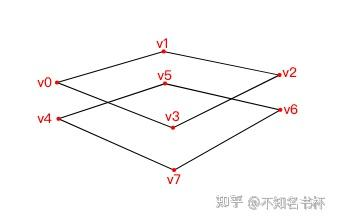
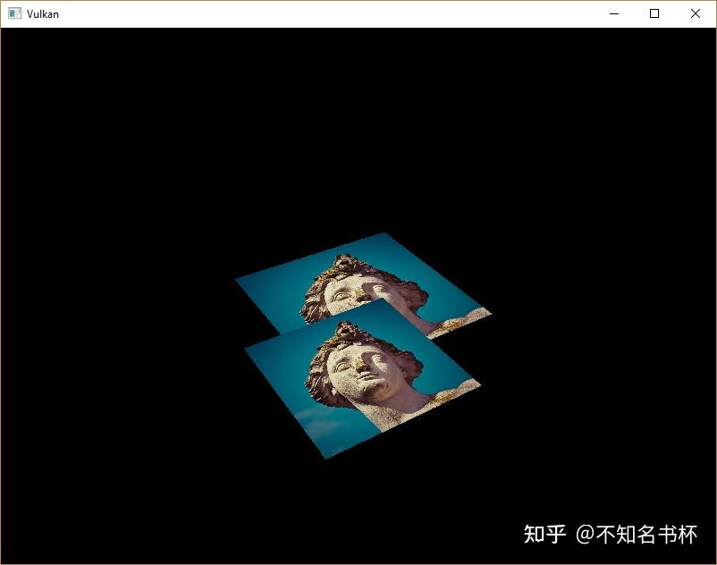
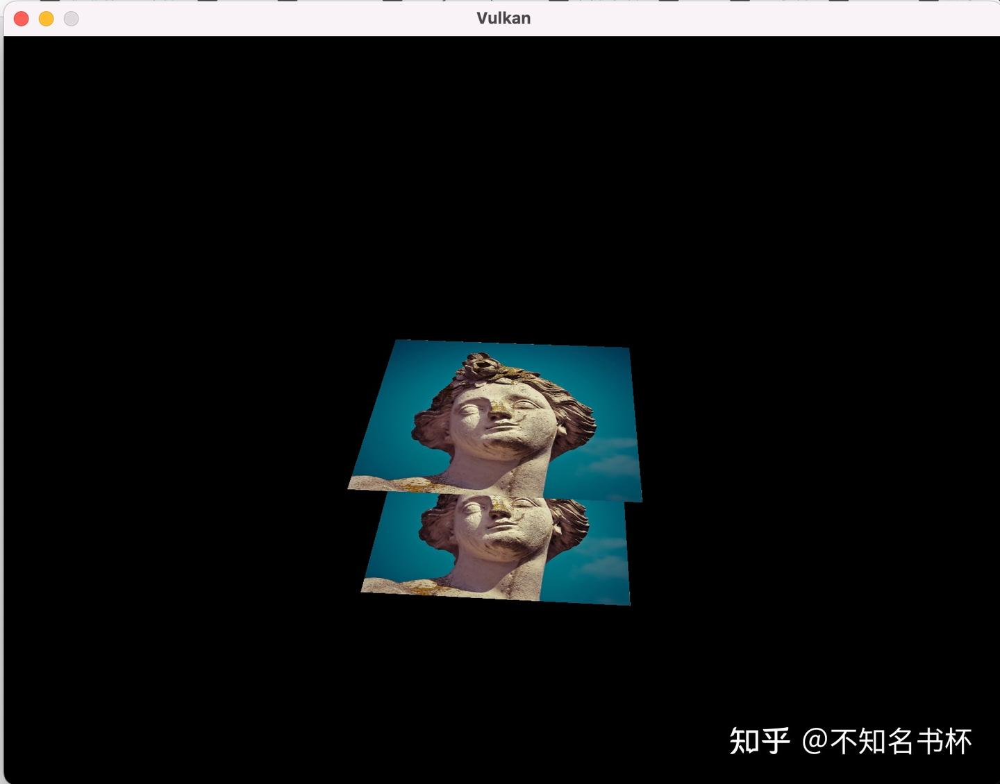

# Vulkan Depth Buffer

> 这里是记录笔者Vulkan的学习记录，参照该教程[vulkan-tutorial.com](https://vulkan-tutorial.com/Drawing_a_triangle/Drawing/Command_buffers)这里是记录笔者Vulkan的学习记录，如果你想识别Vulkan相比于之前的传统图形API有什么区别和优势的话，欢迎看我的另外一篇文章[初探Vulkan](https://zhuanlan.zhihu.com/p/554631289)。相信应该能够帮助你识别Vulkan的优势所在。

到目前为止，我们所处理的几何体是投射到三维的，但它仍然是完全平面的。在这一章中，我们要给位置添加一个Z坐标为三维网格做准备。我们将使用这三维坐标在当前的正方形上放置一个正方形，看看几何体不按深度排序时会出现的问题。

## **3D geometry**

将顶点结构改为使用三维向量来表示位置，并更新相应的Pos属性在VkVertexInputAttributeDescription结构体中的设置。

```cpp
struct Vertex {
        // 改为vec3
    glm::vec3 pos;
    glm::vec3 color;
    glm::vec2 texCoord;
    ...
    static std::array<VkVertexInputAttributeDescription, 3> getAttributeDescriptions() {
        std::array<VkVertexInputAttributeDescription, 3> attributeDescriptions{};
        attributeDescriptions[0].binding = 0;
        attributeDescriptions[0].location = 0;
                // 使用VK_FORMAT_R32G32B32_SFLOAT Format代表为Vec3类型
        attributeDescriptions[0].format = VK_FORMAT_R32G32B32_SFLOAT;
        attributeDescriptions[0].offset = offsetof(Vertex, pos);
        ...
    }
};

// shader当中同样需要修改
layout(location = 0) in vec3 inPosition;
...
void main() {
    gl_Position = ubo.proj * ubo.view * ubo.model * vec4(inPosition, 1.0);
    fragColor = inColor;
    fragTexCoord = inTexCoord;
}

// 同样也要记得更新顶点数据啊。
const std::vector<Vertex> vertices = {
    {{-0.5f, -0.5f, 0.0f}, {1.0f, 0.0f, 0.0f}, {0.0f, 0.0f}},
    {{0.5f, -0.5f, 0.0f}, {0.0f, 1.0f, 0.0f}, {1.0f, 0.0f}},
    {{0.5f, 0.5f, 0.0f}, {0.0f, 0.0f, 1.0f}, {1.0f, 1.0f}},
    {{-0.5f, 0.5f, 0.0f}, {1.0f, 1.0f, 1.0f}, {0.0f, 1.0f}}
};
```

如果你现在运行你的应用程序，那么你应该看到与之前完全一样的结果。现在是时候添加一些额外的几何来使场景更加有趣，并演示我们在接下来要解决的问题。复制顶点来定义当前正方形下面的位置，就像这样。



使用Z坐标为-0.5f，并为额外的方块添加适当的index。如下所示

```cpp
const std::vector<Vertex> vertices = {
    {{-0.5f, -0.5f, 0.0f}, {1.0f, 0.0f, 0.0f}, {0.0f, 0.0f}},
    {{0.5f, -0.5f, 0.0f}, {0.0f, 1.0f, 0.0f}, {1.0f, 0.0f}},
    {{0.5f, 0.5f, 0.0f}, {0.0f, 0.0f, 1.0f}, {1.0f, 1.0f}},
    {{-0.5f, 0.5f, 0.0f}, {1.0f, 1.0f, 1.0f}, {0.0f, 1.0f}},

    {{-0.5f, -0.5f, -0.5f}, {1.0f, 0.0f, 0.0f}, {0.0f, 0.0f}},
    {{0.5f, -0.5f, -0.5f}, {0.0f, 1.0f, 0.0f}, {1.0f, 0.0f}},
    {{0.5f, 0.5f, -0.5f}, {0.0f, 0.0f, 1.0f}, {1.0f, 1.0f}},
    {{-0.5f, 0.5f, -0.5f}, {1.0f, 1.0f, 1.0f}, {0.0f, 1.0f}}
};

const std::vector<uint16_t> indices = {
    0, 1, 2, 2, 3, 0,
    4, 5, 6, 6, 7, 4
};
```

可得到如下结果：



出现的问题是，下层正方形的片段被绘制在上层正方形的片段之上，仅仅是因为下层正方体在Index Buffer中排在后面。有两种方法可以解决这个问题。

- 按深度从后往前排序所有的Draw Call。
- 使用深度缓冲进行[深度测试](https://zhida.zhihu.com/search?content_id=212253444&content_type=Article&match_order=1&q=深度测试&zhida_source=entity)。

第一种处理方案通常用于绘制透明物体，因为与顺序无关的透明渲染是一个难题。然而使用**Depth Buffer**更普遍地解决了按深度排序片段的问题。Depth Buffer是一个额外的Attachment，它存储每个位置的深度，就像Color Attachment存储每个位置的颜色一样。每次[光栅化](https://zhida.zhihu.com/search?content_id=212253444&content_type=Article&match_order=1&q=光栅化&zhida_source=entity)产生一个片段时，**深度测试(Depth Test)**将检查新的片段是否比前一个片段更接近(其实也就是比较深度值)。如果不是，那么新的片段就会被丢弃。一个通过深度测试的片段会将它自己的深度写入Depth Buffer。可以从[片段着色器](https://zhida.zhihu.com/search?content_id=212253444&content_type=Article&match_order=1&q=片段着色器&zhida_source=entity)中操纵这个值，就像你可以操纵颜色输出一样。

GLM生成的[投影矩阵](https://zhida.zhihu.com/search?content_id=212253444&content_type=Article&match_order=1&q=投影矩阵&zhida_source=entity)默认会使用OpenGL的深度范围-1.0到1.0。我们需要使用GLM_FORCE_DEPTH_ZERO_TO_ONE定义将其配置为使用Vulkan的深度范围为0.0到1.0。

```cpp
#define GLM_FORCE_RADIANS
#define GLM_FORCE_DEPTH_ZERO_TO_ONE
#include <glm/glm.hpp>
#include <glm/gtc/matrix_transform.hpp>
```

## **Depth image and view**

Depth Attachment是基于Image的，就像Color Attachment一样。不同的是，Swap Chain不会自动为我们创建Depth Image。我们只需要一个Depth Image，因为一次只运行一个绘制操作。深度图像将再次需要三方面的资源：Image、Memory和Image View。

```cpp
VkImage depthImage;
VkDeviceMemory depthImageMemory;
VkImageView depthImageView;

// 并且创建一个新的函数 用于创建Depth Resources
void createDepthResources() {

}
```

创建一个Depth Image是相当直接的。它应该具有与Color Attachment相同的分辨率，由Swap Chain定义，适合Depth Attachment的图像用法，最佳的tiling(Image的像素布局)设置和存在在设备本地内存(device local memory)。唯一的问题是:Depth Image的正确格式是什么？该格式必须包含一个深度组件。

与纹理图像不同我们不一定需要一个特定的格式，因为我们不会直接从程序中访问Texel。它只需要有一个合理的精度，在现实世界的应用中，至少有24bit是常见的。有几种格式符合这一要求。

- **VK_FORMAT_D32_SFLOAT**：用于深度的32位浮点数。
- **VK_FORMAT_D32_SFLOAT_S8_UINT**：用于深度和8位模板的32位有符号浮点。
- **VK_FORMAT_D24_UNORM_S8_UINT**：用于深度和8位模板的24位浮点数。

[模板组件](https://zhida.zhihu.com/search?content_id=212253444&content_type=Article&match_order=1&q=模板组件&zhida_source=entity)用于**模版测试(Stencil Test)**，这是一个额外的测试，可以与深度测试相结合。我们在这里暂时还用不到。

我们可以简单地选择**VK_FORMAT_D32_SFLOAT**格式，因为硬件对它的支持是非常普遍的，但在可能的情况下为我们的应用程序增加一些额外的灵活性是很好的。我们要写一个函数findSupportedFormat，它按照从最理想到最不理想的顺序接收一个候选格式的列表，并检查哪个格式是第一个被支持的。如下所示：

```cpp
VkFormat findSupportedFormat(const std::vector<VkFormat>& candidates, VkImageTiling tiling, VkFormatFeatureFlags features) {
    for (VkFormat format : candidates) {
        VkFormatProperties props;
                // 查询该设备支持的Image Format
        vkGetPhysicalDeviceFormatProperties(physicalDevice, format, &props);
        if (tiling == VK_IMAGE_TILING_LINEAR && (props.linearTilingFeatures & features) == features) {
            return format;
        } else if (tiling == VK_IMAGE_TILING_OPTIMAL && (props.optimalTilingFeatures & features) == features) {
            return format;
        }
    }
    throw std::runtime_error("failed to find supported format!");
}
```

对一个格式的支持取决于Tiling和usage，所以我们把这些作为参数。使用vkGetPhysicalDeviceFormatProperties函数来查询对某种格式的支持。

VkFormatProperties结构包含三个字段:

- **linearTilingFeatures**: 使用线性平铺格式。
- **optimalTilingFeatures**: 使用最佳Tiling格式。
- **bufferFeatures**: 支持缓冲区。

如果没有一个候选格式支持所需的用法，那么我们可以返回一个特殊的值或者干脆抛出一个异常。

我们现在要用这个函数来创建一个findDepthFormat函数，以选择一个有深度组件的格式，支持作为Depth Attachment使用。

```cpp
VkFormat findDepthFormat() {
    return findSupportedFormat(
        {VK_FORMAT_D32_SFLOAT, VK_FORMAT_D32_SFLOAT_S8_UINT, VK_FORMAT_D24_UNORM_S8_UINT},
        VK_IMAGE_TILING_OPTIMAL,
        VK_FORMAT_FEATURE_DEPTH_STENCIL_ATTACHMENT_BIT
    );
}
```

确保使用 **VK_FORMAT_FEATURE_** 标志代替 **VK_IMAGE_USAGE_** 。所有的候选格式都包含深度组件，但是最后两个也包含 stencil 组件。我们不会使用它，但是我们需要考虑到这一点，比如在这些格式的图像布局进行变换的时候。添加一个简单的辅助函数，告诉我们所选择的深度格式是否包含模版组件。

```cpp
bool hasStencilComponent(VkFormat format) {
    return format == VK_FORMAT_D32_SFLOAT_S8_UINT || format == VK_FORMAT_D24_UNORM_S8_UINT;
}
```

接下来可以来继续完善咱们的createDepthResources函数啦

```cpp
void createDepthResources(){
    VkFormat depthFormat = findDepthFormat();
    createImage(swapChainExtent.width, swapChainExtent.height, depthFormat, VK_IMAGE_TILING_OPTIMAL, VK_IMAGE_USAGE_DEPTH_STENCIL_ATTACHMENT_BIT, VK_MEMORY_PROPERTY_DEVICE_LOCAL_BIT, depthImage, depthImageMemory);
    depthImageView = createImageView(depthImage, depthFormat);
}
```

然而createImageView函数目前假定subResource字段总是VK_IMAGE_ASPECT_COLOR_BIT，所以我们需要把这个字段变成一个参数。

```cpp
VkImageView createImageView(VkImage image, VkFormat format, VkImageAspectFlags aspectFlags) {
    ...
    viewInfo.subresourceRange.aspectMask = aspectFlags;
    ...
}
```

其他依赖该方法的函数都需要做出修改。

```cpp
swapChainImageViews[i] = createImageView(swapChainImages[i], swapChainImageFormat, VK_IMAGE_ASPECT_COLOR_BIT);
...
depthImageView = createImageView(depthImage, depthFormat, VK_IMAGE_ASPECT_DEPTH_BIT);
...
textureImageView = createImageView(textureImage, VK_FORMAT_R8G8B8A8_SRGB, VK_IMAGE_ASPECT_COLOR_BIT);
```

这就是创建Depth Image。我们不需要映射它或者拷贝另一个图像，因为我们会在RenderPass的时候进行清理，就像Color Attchment那样。

## **Explicitly transitioning the depth image**

然而它仍然需要变换为合适的Depth Attachment使用的布局。我们可以在RenderPass中像Color Attachment那样做(设置finalLayout)，不需要使用我们的显式的布局转换，但是在这里我们选择使用PipeLine Barrier，因为变换只会发生一次。

在createDepthResources函数的结尾处对transitionImageLayout进行调用，像这样。

```cpp
transitionImageLayout(depthImage, depthFormat, VK_IMAGE_LAYOUT_UNDEFINED, VK_IMAGE_LAYOUT_DEPTH_STENCIL_ATTACHMENT_OPTIMAL);
```

未定义的布局(undefined layout)可以作为初始布局，因为没有现有的深度图像内容，这很重要。我们需要更新transitionImageLayout中的一些逻辑以使用正确的subresourceRange字段。

```cpp
if (newLayout == VK_IMAGE_LAYOUT_DEPTH_STENCIL_ATTACHMENT_OPTIMAL) {
    barrier.subresourceRange.aspectMask = VK_IMAGE_ASPECT_DEPTH_BIT;
    if (hasStencilComponent(format)) {
        barrier.subresourceRange.aspectMask |= VK_IMAGE_ASPECT_STENCIL_BIT;
    }
} else {
    barrier.subresourceRange.aspectMask = VK_IMAGE_ASPECT_COLOR_BIT;
}
```

虽然我们没有使用模版组件，但我们确实需要在Depth Image的布局转换中包含它。最后，添加正确的Accessmask和PipeLineStage。

```cpp
if (oldLayout == VK_IMAGE_LAYOUT_UNDEFINED && newLayout == VK_IMAGE_LAYOUT_TRANSFER_DST_OPTIMAL) {
    barrier.srcAccessMask = 0;
    barrier.dstAccessMask = VK_ACCESS_TRANSFER_WRITE_BIT;

    sourceStage = VK_PIPELINE_STAGE_TOP_OF_PIPE_BIT;
    destinationStage = VK_PIPELINE_STAGE_TRANSFER_BIT;
} else if (oldLayout == VK_IMAGE_LAYOUT_TRANSFER_DST_OPTIMAL && newLayout == VK_IMAGE_LAYOUT_SHADER_READ_ONLY_OPTIMAL) {
    barrier.srcAccessMask = VK_ACCESS_TRANSFER_WRITE_BIT;
    barrier.dstAccessMask = VK_ACCESS_SHADER_READ_BIT;

    sourceStage = VK_PIPELINE_STAGE_TRANSFER_BIT;
    destinationStage = VK_PIPELINE_STAGE_FRAGMENT_SHADER_BIT;
} else if (oldLayout == VK_IMAGE_LAYOUT_UNDEFINED && newLayout == VK_IMAGE_LAYOUT_DEPTH_STENCIL_ATTACHMENT_OPTIMAL) {
    barrier.srcAccessMask = 0;
    barrier.dstAccessMask = VK_ACCESS_DEPTH_STENCIL_ATTACHMENT_READ_BIT | VK_ACCESS_DEPTH_STENCIL_ATTACHMENT_WRITE_BIT;

    sourceStage = VK_PIPELINE_STAGE_TOP_OF_PIPE_BIT;
    destinationStage = VK_PIPELINE_STAGE_EARLY_FRAGMENT_TESTS_BIT;
} else {
    throw std::invalid_argument("unsupported layout transition!");
}
```

读取深度缓冲并执行深度测试，以确认当前片段是否可见，并将在绘制新片段时更新Depth Buffer。读取操作发生在**VK_PIPELINE_STAGE_EARLY_FRAGMENT_TESTS_BIT**阶段，并在 **VK_PIPELINE_STAGE_LATE_FRAGMETN_TESTS_BIT** 中进行写入操作。我们应该选择与指定操作相匹配的最早的管线阶段，以便在需要时可以作为Depth Attachment使用。

## **Render pass**

我们现在要修改createRenderPass以包括一个Depth Attachment。首先指定VkAttachmentDescription。

```cpp
VkAttachmentDescription depthAttachment{};
depthAttachment.format = findDepthFormat();
depthAttachment.samples = VK_SAMPLE_COUNT_1_BIT;
depthAttachment.loadOp = VK_ATTACHMENT_LOAD_OP_CLEAR;
depthAttachment.storeOp = VK_ATTACHMENT_STORE_OP_DONT_CARE;
depthAttachment.stencilLoadOp = VK_ATTACHMENT_LOAD_OP_DONT_CARE;
depthAttachment.stencilStoreOp = VK_ATTACHMENT_STORE_OP_DONT_CARE;
depthAttachment.initialLayout = VK_IMAGE_LAYOUT_UNDEFINED;
depthAttachment.finalLayout = VK_IMAGE_LAYOUT_DEPTH_STENCIL_ATTACHMENT_OPTIMAL;
```

**format** 应该与深度图像一致。这次我们不会关心存储深度数据(**storeOp**)，因为完成渲染之后它不会在被使用。这可能允许硬件执行其他的优化。就像Color Buffer一样，我们不关心之前的深度内容，所以我们可以使用 **VK_IMAGE_LAYOUT_UNDEFINED** 作为 **initialLayout**。

```cpp
VkAttachmentReference depthAttachmentRef{};
depthAttachmentRef.attachment = 1;
depthAttachmentRef.layout = VK_IMAGE_LAYOUT_DEPTH_STENCIL_ATTACHMENT_OPTIMAL;
```

为第一个(也是唯一的)SubPass对Depth Attachment 添加引用。

```cpp
VkSubpassDescription subpass{};
subpass.pipelineBindPoint = VK_PIPELINE_BIND_POINT_GRAPHICS;
subpass.colorAttachmentCount = 1;
subpass.pColorAttachments = &colorAttachmentRef;
subpass.pDepthStencilAttachment = &depthAttachmentRef;
```

与Color Attachment不同，一个Subpass只能使用一个Depth+Stencil Attachment。在多个缓冲区上做Depth Test其实没有任何意义。

```cpp
std::array<VkAttachmentDescription, 2> attachments = {colorAttachment, depthAttachment};
VkRenderPassCreateInfo renderPassInfo{};
renderPassInfo.sType = VK_STRUCTURE_TYPE_RENDER_PASS_CREATE_INFO;
renderPassInfo.attachmentCount = static_cast<uint32_t>(attachments.size());
renderPassInfo.pAttachments = attachments.data();
renderPassInfo.subpassCount = 1;
renderPassInfo.pSubpasses = &subpass;
renderPassInfo.dependencyCount = 1;
renderPassInfo.pDependencies = &dependency;
```

更新VkRenderPassCreateInfo结构体以引用两个我们创建的两个Attachment。

```cpp
dependency.srcStageMask = VK_PIPELINE_STAGE_COLOR_ATTACHMENT_OUTPUT_BIT | VK_PIPELINE_STAGE_EARLY_FRAGMENT_TESTS_BIT;
dependency.dstStageMask = VK_PIPELINE_STAGE_COLOR_ATTACHMENT_OUTPUT_BIT | VK_PIPELINE_STAGE_EARLY_FRAGMENT_TESTS_BIT;
dependency.dstAccessMask = VK_ACCESS_COLOR_ATTACHMENT_WRITE_BIT | VK_ACCESS_DEPTH_STENCIL_ATTACHMENT_WRITE_BIT;
```

最后，我们需要扩展我们的Subpass Dependency，以确保深度图像布局转换和它作为其加载并被清除的操作的之间没有冲突。深度图像在**VK_PIPELINE_STAGE_EARLY_FRAGMENT_TESTS_BIT**被首次访问，由于我们有一个清除的加载操作，我们应该指定写入的访问掩码(**VK_ACCESS_DEPTH_STENCIL_ATTACHMENT_WRITE_BIT**)。

## **Framebuffer**

下一步是修改Frame Buffer的创建，将Depth Image View绑定到Depth Attachment上。进入createFramebuffers，指定Depth Image View 为第二个Attachment。

```cpp
std::array<VkImageView, 2> attachments = {
    swapChainImageViews[i],
    depthImageView
};

VkFramebufferCreateInfo framebufferInfo{};
framebufferInfo.sType = VK_STRUCTURE_TYPE_FRAMEBUFFER_CREATE_INFO;
framebufferInfo.renderPass = renderPass;
framebufferInfo.attachmentCount = static_cast<uint32_t>(attachments.size());
framebufferInfo.pAttachments = attachments.data();
framebufferInfo.width = swapChainExtent.width;
framebufferInfo.height = swapChainExtent.height;
framebufferInfo.layers = 1;
```

每一个Swap Chain Image 的Color Attachment都不一样，但是同一个Depth Image 可以被所有的图像使用，因为由于我们的semaphores，只有一个SubPass在同一时间运行。

你还需要移动对createFramebuffers的调用，以确保它是在Depth Image View 真正被创建后被调用的。

```cpp
void initVulkan() {
    ...
    createDepthResources();
    createFramebuffers();
    ...
}
```

## **Clear values**

因为我们现在有多个附件的VK_ATTACHMENT_LOAD_OP_CLEAR，我们也需要指定多个Clear Vaule。转到recordCommandBuffer并创建一个VkClearValue结构体的数组。

```cpp
std::array<VkClearValue, 2> clearValues{};
clearValues[0].color = {{0.0f, 0.0f, 0.0f, 1.0f}};
clearValues[1].depthStencil = {1.0f, 0};

renderPassInfo.clearValueCount = static_cast<uint32_t>(clearValues.size());
renderPassInfo.pClearValues = clearValues.data();
```

在Vulkan中，[深度缓冲区](https://zhida.zhihu.com/search?content_id=212253444&content_type=Article&match_order=1&q=深度缓冲区&zhida_source=entity)的深度范围是0.0到1.0，其中1.0位于远平面，0.0位于近平面。Depth Buffer中每一点的初始值应该是最远的深度，也就是1.0。需要注意的点是，clearValues的顺序应该与你的附件的顺序相同。

## **Depth and stencil state**

Depth Attachment现在已经可以使用了，但Depth test 仍需要在图形管道中启用。它是通过VkPipelineDepthStencilStateCreateInfo结构配置的。

```cpp
VkPipelineDepthStencilStateCreateInfo depthStencil{};
depthStencil.sType = VK_STRUCTURE_TYPE_PIPELINE_DEPTH_STENCIL_STATE_CREATE_INFO;
depthStencil.depthTestEnable = VK_TRUE;
depthStencil.depthWriteEnable = VK_TRUE;
```

depthTestEnable字段指定是否应将新片段的深度与Depth Buffer同位置的像素点的深度进行比较，看它们是否应被丢弃。depthWriteEnable字段指定是否应将通过深度测试的新片段的深度实际写入Depth Buffer。

```cpp
depthStencil.depthCompareOp = VK_COMPARE_OP_LESS;
depthStencil.depthBoundsTestEnable = VK_FALSE;
depthStencil.minDepthBounds = 0.0f; // Optional
depthStencil.maxDepthBounds = 1.0f; // Optional
```

depthCompareOp字段指定了为保留或丢弃片段所进行的比较函数。我们坚持较低的深度===较近的惯例，所以新片段的深度应该较小。

depthBoundsTestEnable、minDepthBounds和maxDepthBounds字段用于可选的深度边界测试。基本上，这允许你只保留落在指定深度范围内的片段。我们将不使用这个功能。

```cpp
depthStencil.stencilTestEnable = VK_FALSE;
depthStencil.front = {}; // Optional
depthStencil.back = {}; // Optional
```

最后三个字段配置了模板缓冲的操作，我们在这里不会使用。

```cpp
pipelineInfo.pDepthStencilState = &depthStencil;
```

更新 VkGraphicsPipelineCreateInfo 结构体以引用我们刚刚填充VkPipelineDepthStencilStateCreateInfo结构。如果RenderPass包含一个深度模版附件，必须始终指定一个VkPipelineDepthStencilStateCreateInfo。

如果你现在运行你的程序，那么你应该看到几何体的片段现在已经正确排序了。



## **Handling window resize**

窗口调整大小时，Depth Buffer的分辨率应该改变，以匹配新的Color Attachment分辨率。在这种情况下，扩展recreateSwapChain函数来重新创建深度资源。

```cpp
void recreateSwapChain() {
    int width = 0, height = 0;
    while (width == 0 || height == 0) {
        glfwGetFramebufferSize(window, &width, &height);
        glfwWaitEvents();
    }

    vkDeviceWaitIdle(device);

    cleanupSwapChain();

    createSwapChain();
    createImageViews();
    createDepthResources();
    createFramebuffers();
}
```

清理操作应该发生在Swap Chain Cleanup 功能中。

```cpp
void cleanupSwapChain() {
    vkDestroyImageView(device, depthImageView, nullptr);
    vkDestroyImage(device, depthImage, nullptr);
    vkFreeMemory(device, depthImageMemory, nullptr);

    ...
}
```

恭喜你，你的应用程序现在终于准备好渲染任意的三维几何体，并使其看起来正确。